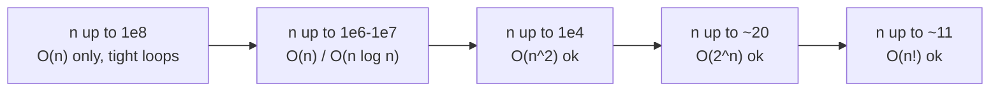

import DataCampExercise from "../../../../components/DataCampExercise.astro";
import Quiz from "../../../../components/Quiz.astro";

import ComplexityChart from "../../../../components/viz/ComplexityChart.tsx";

Big-O is the language interviewers and contest setters use to talk about speed.
It answers one question: **as the input grows, how does the work grow?**

## What you'll learn

- What Big-O, Big-Omega, and Big-Theta actually mean.
- The complexity hierarchy and how to read it off code.
- Best vs average vs worst case.
- Amortized analysis (why `list.append` is "$O(1)$" despite resizing).
- The Python constant-factor reality that decides TLE.

## Visual intuition

Big-O as arithmetic rather than vibes. The dashed line is roughly what an online
judge accepts in a second:

<ComplexityChart
  client:visible
  algo="growth"
  title="Read the constraint, not your instincts"
  lib="log scale, 1e8 op budget"
  desc="Step through the n values and watch which curves cross the budget line. This is the calculation to do BEFORE choosing an approach: n <= 20 means exponential is intended, n <= 5000 means quadratic is fine, n <= 100000 means you need O(n log n)."
/>

## The core idea

Big-O describes an **upper bound on growth**, ignoring constants and lower-order
terms. Formally, $f(n) = O(g(n))$ if there exist constants $c > 0$ and $n_0$ such
that:

$$
0 \le f(n) \le c \cdot g(n) \quad \text{for all } n \ge n_0.
$$

So $3n^2 + 5n + 100 = O(n^2)$ — the $n^2$ term dominates, constants drop.

Two companions complete the picture:

- $\Omega(g(n))$ — a **lower** bound (the work is at least this).
- $\Theta(g(n))$ — a **tight** bound (upper *and* lower).

## Watch the growth rates race

Small inputs hide everything — every algorithm looks fast. The gap explodes as
$n$ grows. This is why $O(n \log n)$ beats $O(n^2)$ so decisively on large data:

```p5 title="Growth-rate race" desc="Cost of each complexity class as n grows. O(1) hugs the floor; O(n!) and O(2^n) rocket off-screen almost immediately." height="360"
function setup() {
  createCanvas(600, 360);
  textFont("monospace");
  noLoop();
}

function draw() {
  background(13, 17, 23);
  const padL = 44, padB = 28, padT = 16, padR = 12;
  const W = width - padL - padR;
  const H = height - padB - padT;
  const maxN = 40;
  const maxY = 500; // clip cost here

  // axes
  stroke(80);
  strokeWeight(1);
  line(padL, padT, padL, height - padB);
  line(padL, height - padB, width - padR, height - padB);
  noStroke();
  fill(140);
  textSize(11);
  textAlign(CENTER, TOP);
  text("input size n", padL + W / 2, height - padB + 8);

  const funcs = [
    { name: "O(1)",       f: (n) => 1,                 c: [ 88, 166, 255] },
    { name: "O(log n)",   f: (n) => Math.log2(n + 1),  c: [ 63, 185, 80] },
    { name: "O(n)",       f: (n) => n,                 c: [219, 171, 90] },
    { name: "O(n log n)", f: (n) => n * Math.log2(n+1),c: [255, 123, 114] },
    { name: "O(n^2)",     f: (n) => n * n,             c: [188, 140, 255] },
    { name: "O(2^n)",     f: (n) => Math.pow(2, n),    c: [255, 105, 180] },
  ];

  const xAt = (n) => padL + (n / maxN) * W;
  const yAt = (v) => (height - padB) - Math.min(v, maxY) / maxY * H;

  funcs.forEach((fn, i) => {
    stroke(fn.c[0], fn.c[1], fn.c[2]);
    strokeWeight(2);
    noFill();
    beginShape();
    for (let n = 0; n <= maxN; n++) vertex(xAt(n), yAt(fn.f(n)));
    endShape();
    noStroke();
    fill(fn.c[0], fn.c[1], fn.c[2]);
    textAlign(LEFT, CENTER);
    textSize(11);
    text(fn.name, padL + 8, padT + 12 + i * 15);
  });
}
```

## The hierarchy (fastest to slowest)

| Big-O | Name | Example |
| ----- | ---- | ------- |
| $O(1)$ | constant | array index, dict lookup |
| $O(\log n)$ | logarithmic | binary search |
| $O(n)$ | linear | one pass over a list |
| $O(n \log n)$ | linearithmic | efficient sorts, most divide-and-conquer |
| $O(n^2)$ | quadratic | nested loops over the same data |
| $O(2^n)$ | exponential | naive subsets / recursion |
| $O(n!)$ | factorial | brute-force permutations |

## Reading complexity off code

Count the loops and how the input drives them.

```python title="reading_complexity.py" showLineNumbers{1}
# O(1) — no loop over input
def first(nums):
    return nums[0] if nums else None

# O(n) — one pass
def total(nums):
    s = 0
    for x in nums:          # runs n times
        s += x
    return s

# O(n^2) — loop inside a loop over the same data
def any_pair_sums_zero(nums):
    for i in range(len(nums)):
        for j in range(i + 1, len(nums)):
            if nums[i] + nums[j] == 0:
                return True
    return False

print(first([9, 2]), total([1, 2, 3]), any_pair_sums_zero([3, -3, 5]))
```

:::tip[Rule of thumb]
Sequential blocks **add** ($O(n) + O(n) = O(n)$). Nested loops **multiply**
($O(n) \times O(n) = O(n^2)$). Keep only the dominant term.
:::

## Best, average, worst

The same algorithm can have different costs depending on the input.

- **Best case** — luckiest input (e.g., target is the first element).
- **Worst case** — the input interviewers care about most.
- **Average case** — expected over random inputs.

Linear search: best $O(1)$ (found first), worst $O(n)$ (found last / absent).

## Amortized analysis

Some operations are occasionally expensive but cheap **on average** over a
sequence. `list.append` is the classic: usually $O(1)$, but when the underlying
array is full Python allocates a bigger one and copies everything ($O(n)$).
Because resizes double capacity, those costs spread out to **amortized $O(1)$**.

$$
\text{total for } n \text{ appends} = O(n) \;\Rightarrow\; \text{per append} = O(1).
$$

## The Python constant-factor reality

Big-O drops constants — but on a real judge, constants decide TLE. Python is
~10–100× slower per operation than C++. A rough safe budget per second:



We cover concrete TLE-beating tricks (fast I/O, stdlib, PyPy) in
**Phase 2: Python for DSA & CP**.

## Dry run

### Reading complexity off code, three cases that get misread

**1. A `while` inside a `for` is not automatically $O(n^2)$.**

The monotonic-stack shape -- each element pushed once and popped at most once -- runs the inner loop
$O(n)$ times *in total*, not per iteration. The bound comes from a potential argument, not from
counting nesting depth. Amortised $O(n)$.

**2. `list.append` is $O(1)$ amortised, and here is the evidence.**

Watching the length at which CPython reallocates a growing list:

```
1, 5, 9, 17, 25, 33, 41, 53, 65, 77, 93, 109, 129, 149, …
```

The gaps grow -- 4, 4, 8, 8, 8, 8, 12, 12, 12, 16, 16, 20, 20 -- because the new capacity is
proportional to the current size. Geometric growth means the total copying across `n` appends is a
*constant multiple of `n`*, so the average is $O(1)$ even though individual appends are $O(n)$.

That is what "amortised" means, and it is the honest figure to quote for a loop of appends.

**3. The operation that silently squares your complexity.**

| `n` | `x in list` | `x in set` | Ratio |
| --- | --- | --- | --- |
| 1,000 | 4.90 µs | 0.026 µs | **186x** |
| 100,000 | 659 µs | 0.048 µs | **13,649x** |

The set is *flat* -- 0.026 µs to 0.048 µs as `n` grows 100x -- while the list scales linearly.
Putting `x in some_list` inside a loop turns an $O(n)$ algorithm into $O(n^2)$ without changing a line
of the visible logic, and it is the single most common accidental blow-up in Python.

Same story for the front of a list:

| `n` | `list.insert(0, x)` | `deque.appendleft(x)` | Ratio |
| --- | --- | --- | --- |
| 10,000 | 7.06 µs | 0.032 µs | **220x** |
| 50,000 | 20.48 µs | 0.037 µs | **546x** |

`list.insert(0, …)` shifts every element; `deque` is $O(1)$ at both ends. The ratio grows with `n`
because one is linear and the other is constant -- which is exactly what the asymptotics predict, and
the measurement makes it concrete.

### One more drill: name the class from the shape

<DataCampExercise
  lang="python"
  hint={`Match each code shape to its complexity class. Halving a range each step is logarithmic; sorting dominates a following linear pass; a single pass with constant-time lookups is linear.`}
  code={`def classify(name):
    # TODO: return the complexity class for each code shape, as a string.
    # Shapes: 'nested loops over n', 'halve the range each step',
    #         'one pass with a set lookup', 'sort then one pass', 'all subsets'
    pass


print([classify('halve the range each step'),
       classify('sort then one pass'),
       classify('one pass with a set lookup')])
# expect ['O(log n)', 'O(n log n)', 'O(n)']`}
  solution={`def classify(name):
    table = {
        'nested loops over n': 'O(n^2)',
        'halve the range each step': 'O(log n)',
        'one pass with a set lookup': 'O(n)',
        'sort then one pass': 'O(n log n)',
        'all subsets': 'O(2^n)',
    }
    return table[name]


print([classify('halve the range each step'),
       classify('sort then one pass'),
       classify('one pass with a set lookup')])`}
  sct={`test_output_contains("O(n log n)")
success_msg("Note the third one: a single pass is only O(n) because the lookup inside it is constant. Swap the set for a list and the same loop becomes O(n^2) -- measured 13,649x slower at n = 100,000. The shape of the loop is not the whole story; what happens inside it counts.")`}
  height={420}
/>

## Practice

**Drill 1 — name the complexity.** Complete the function so it runs in $O(n)$,
not $O(n^2)$: sum every element using a single pass.

<DataCampExercise
  lang="python"
  hint={`One loop over nums is O(n). Accumulate into a running total; don't use a nested loop.`}
  code={`# Task: return the sum of nums in O(n).
def total(nums):
    s = 0
    for x in ___:      # iterate the list once
        s += x
    return s

print(total([1, 2, 3, 4]))   # expect 10`}
  solution={`def total(nums):
    s = 0
    for x in nums:
        s += x
    return s

print(total([1, 2, 3, 4]))`}
  sct={`test_output_contains("10")
success_msg("Single pass = O(n). Nailed it.")`}
  height={175}
/>

**Drill 2 — pick the fast structure.** Counting frequencies with a nested scan
is $O(n^2)$. A `dict` makes it $O(n)$. Fill the blank.

<DataCampExercise
  lang="python"
  hint={`Use dict.get(x, 0) + 1 to increment a running count for each element in O(1) per step.`}
  code={`# Task: return a dict of element -> count, in O(n).
def counts(nums):
    freq = {}
    for x in nums:
        freq[x] = freq.___(x, 0) + 1   # default to 0 if unseen
    return freq

print(counts([1, 1, 2, 3, 3, 3]))   # expect {1: 2, 2: 1, 3: 3}`}
  solution={`def counts(nums):
    freq = {}
    for x in nums:
        freq[x] = freq.get(x, 0) + 1
    return freq

print(counts([1, 1, 2, 3, 3, 3]))`}
  sct={`test_output_contains("3: 3")
success_msg("O(n) counting with a dict — a workhorse pattern.")`}
  height={185}
/>

## Complexity

The reference table, with the Python-specific numbers that the pure asymptotics hide.

| Operation | Bound | Note |
| --- | --- | --- |
| `list[i]`, `len(x)` | $O(1)$ | -- |
| `list.append` | $O(1)$ **amortised** | $O(n)$ on the reallocation; geometric growth makes the total linear |
| `list.pop()` (end) | $O(1)$ | -- |
| `list.insert(0, x)` / `list.pop(0)` | **$O(n)$** | measured 220-546x slower than `deque` |
| `list.insert`/`del` at an index | $O(n)$ | shifts the tail |
| `x in list` | **$O(n)$** | measured 186x slower than a set at $n{=}1000$, 13,649x at $10^5$ |
| `x in set` / `x in dict` | $O(1)$ average | $O(n)$ worst case under adversarial hashing |
| `dict[k]`, `set.add` | $O(1)$ average | -- |
| `deque.append` / `appendleft` / `pop` / `popleft` | $O(1)$ | use for a queue, always |
| `heapq.heappush` / `heappop` | $O(\log n)$ | `heapify` is $O(n)$ |
| `bisect.bisect_*` | $O(\log n)$ | but `insort` is $O(n)$ -- the shift |
| `sorted` / `list.sort` | $O(n \log n)$ | $O(n)$ best case, Timsort is adaptive |
| `min` / `max` / `sum` | $O(n)$ | C-level loop, small constant |
| `"".join(parts)` | $O(\text{total})$ | the right way to build a string |
| String slicing `s[a:b]` | $O(b - a)$ | copies -- a slice in a loop is a hidden $O(n^2)$ |
| `set` union / intersection | $O(\min/\max)$ of the sizes | -- |

**Best, average, worst -- and which one to quote:**

| Algorithm | Best | Average | Worst | Quote |
| --- | --- | --- | --- | --- |
| Quicksort | $O(n \log n)$ | $O(n \log n)$ | **$O(n^2)$** | worst, then say randomisation makes it unlikely |
| Timsort | **$O(n)$** | $O(n \log n)$ | $O(n \log n)$ | worst, and mention the adaptive best case |
| Hash lookup | $O(1)$ | $O(1)$ | $O(n)$ | average -- the worst case needs an adversary |
| Binary search | $O(1)$ | $O(\log n)$ | $O(\log n)$ | worst |

**The Python constant factor.** Roughly **10-100x slower than C** for interpreted loops, so the safe
working budget is about $10^7$ simple operations per second rather than $10^8$. Work pushed into C --
`sum`, `sorted`, `heapq`, `set` operations, `join` -- does not pay that tax, which is why the fix for
a slow Python loop is usually "express it as a built-in" rather than "change the algorithm".

## Pitfalls

- **`x in some_list` inside a loop.** Measured 13,649x slower than a set at $n = 10^5$. This turns
  $O(n)$ into $O(n^2)$ with no visible change to the logic, and it is the most common accidental
  blow-up in Python.
- **`list.pop(0)` for a queue.** $O(n)$ per call -- measured 546x slower than `deque.popleft` at
  $n = 50{,}000$. Use `collections.deque`.
- **Reading a `while` inside a `for` as $O(n^2)$.** If each element is pushed and popped at most once,
  the total inner work is $O(n)$ -- monotonic stack, sliding-window deque, KMP. The nesting is not the
  bound; the potential argument is.
- **Quoting `append` as $O(1)$ worst case.** It is $O(1)$ **amortised** and $O(n)$ on the
  reallocation. Over `n` appends the total is $O(n)$, so amortised is the honest figure for a loop --
  but say the word.
- **Ignoring the variable the bound is over.** Binary search on the answer is $O(n \log R)$ in the
  *value* range; knapsack is $O(nW)$ in the *capacity*. Both are routinely misquoted as functions of
  `n` alone, and both blow up when the other variable is large.
- **Forgetting recursion's space.** $O(h)$ stack frames, invisible in the source, and a hard ~1,000
  ceiling in CPython.
- **Slicing inside a loop.** `s[i:]` copies, so a loop of slices is $O(n^2)$ even though each line
  looks constant. Pass indices instead.
- **Assuming $O(1)$ hashing is unconditional.** It is $O(1)$ *average*; degenerate hashing is $O(n)$.
  It matters only against an adversary, which is why competitive judges hack fixed hash functions.
- **Comparing asymptotics without the constant.** $O(n)$ Python beats $O(n \log n)$ C only when `n`
  is large enough -- and `sorted` is C. Measured elsewhere: `heapq.nlargest` beats sorting by 13x at
  `k = 5` of 200,000 and *loses* by 4x at `k = n/2`.

## Interview follow-ups

| They ask | What they're checking | The answer |
| --- | --- | --- |
| "What is the complexity of `list.insert(0, x)`?" | Whether you know the data model | $O(n)$ -- every element shifts. Measured 220x slower than `deque.appendleft` at $n = 10{,}000$ and 546x at 50,000. That is why a queue uses `deque` |
| "`in` on a list versus a set?" | The most common Python performance bug | $O(n)$ against $O(1)$ average -- measured 186x at $n = 1000$ and 13,649x at $10^5$. Inside a loop it silently squares the whole algorithm |
| "Amortised or worst case?" | Precision with words | `append` is $O(1)$ amortised, $O(n)$ on the resize that copies. Because the capacity grows geometrically, `n` appends total $O(n)$ -- so amortised is the honest figure for a loop |
| "There's a `while` inside your `for`. Isn't that $O(n^2)$?" | Whether you can defend an amortised bound | Not if each element enters and leaves the structure once. Total inner-loop work is bounded by total pushes, which is `n`. That is the argument for monotonic stacks, sliding-window deques and KMP |
| "Your solution is $O(n \log n)$ but it times out" | Diagnosis order | Either the class is wrong, or the bound is over a variable you assumed ($O(nW)$, $O(n \log R)$), or the constant is the problem -- Python-level loops, per-iteration allocation, slicing. Check the first two before rewriting |
| "Space complexity of your recursion?" | The invisible cost | $O(h)$ frames, $O(n)$ degenerate, and a ~1,000-frame ceiling in CPython -- so it is a crash risk, not just memory |
| "Can you ever beat $O(n \log n)$ for sorting?" | Knowing the model | Only by leaving the comparison model: counting or radix sort is $O(n + k)$ for bounded integer keys. The $\Omega(n \log n)$ bound is about *comparison* sorts specifically |
| "Which bounds do people quote wrongly?" | Judgement | Pseudo-polynomial ones -- knapsack's $O(nW)$, digit DP -- because they are polynomial in a *value* rather than an input length. And naive Fibonacci, which is $\Theta(\phi^n)$, not $2^n$ |
| "How many operations per second should you assume?" | Practical sizing | ~$10^8$ for C, and about **$10^7$ for pure-Python loops** -- an order of magnitude down. Work pushed into built-ins does not pay that tax |

## Self-check

<Quiz
  questions={[
    {
      q: "`x in some_list` inside a loop over n elements. What is the measured cost?",
      options: [
        "The same as a set -- Python optimises membership tests",
        "O(n) per test: measured 186x slower than a set at n = 1000 and 13,649x at n = 100,000, turning an O(n) algorithm into O(n^2)",
        "O(log n), since lists are internally sorted",
        "O(1) amortised",
      ],
      answer: 1,
      explain:
        "The set timings were flat as n grew 100x (0.026 to 0.048 microseconds) while the list scaled linearly. Nothing about the code looks quadratic, which is what makes it the most common accidental blow-up in Python. One `set(...)` conversion fixes it.",
    },
    {
      q: "Why is `list.append` described as O(1) amortised rather than O(1)?",
      options: [
        "Because it is O(log n) in the worst case",
        "An individual append can be O(n) when the list reallocates and copies; capacity grows geometrically, so n appends total O(n) and the average is constant",
        "Because it may raise MemoryError",
        "Because the amortised bound only holds for small lists",
      ],
      answer: 1,
      explain:
        "Measured reallocation lengths: 1, 5, 9, 17, 25, 33, 41, 53, 65, 77, 93... with gaps that widen because new capacity is proportional to current size. Geometric growth is exactly what makes the total copying a constant multiple of n. Saying \"amortised\" when you mean it, and \"worst case\" when you mean that, is the precision being tested.",
    },
    {
      q: "A `while` loop nested inside a `for` loop. Is it necessarily O(n^2)?",
      options: [
        "Yes -- nested loops multiply",
        "No -- if each element enters and leaves the structure at most once, total inner work is bounded by n, giving O(n) amortised",
        "Only if the inner loop depends on the outer index",
        "Yes, unless the inner loop has a break",
      ],
      answer: 1,
      explain:
        "This is the monotonic stack, sliding-window deque and KMP argument. The bound comes from a potential function -- total pushes bound total pops -- rather than from counting nesting. Reading the nesting as the bound is the standard misread, and being able to give the potential argument is what \"prove your complexity\" is asking for.",
    },
    {
      q: "Why does a queue use `collections.deque` rather than a list?",
      options: [
        "deque uses less memory",
        "`list.pop(0)` and `list.insert(0, x)` are O(n) because every element shifts -- measured 546x slower than deque at n = 50,000",
        "Lists cannot be used as queues",
        "deque is thread-safe",
      ],
      answer: 1,
      explain:
        "A Python list is a dynamic array, so the front is the expensive end -- removing from it moves every remaining element. deque is a doubly linked list of blocks and is O(1) at both ends. Measured 220x at n = 10,000 and 546x at 50,000: the ratio grows with n, which is what linear-versus-constant looks like.",
    },
    {
      q: "Your O(n log n) solution times out. What do you check first?",
      options: [
        "The constant factor -- rewrite the inner loop",
        "Whether the class is actually wrong, and whether the bound is over the variable you assumed (O(nW), O(n log R)) -- only then the constant",
        "Whether the judge is slow",
        "Switch to PyPy immediately",
      ],
      answer: 1,
      explain:
        "Cheapest checks first, and the middle one is the sneaky case: binary search on the answer is O(n log R) in the *value* range and knapsack is O(nW) in the *capacity*, both routinely misquoted as functions of n. Rewriting for constant factor when the complexity class is wrong is the most expensive mistake available.",
    },
    {
      q: "What operations-per-second budget should you assume for pure-Python loops?",
      options: [
        "About 10^8, the same as C",
        "About 10^7 -- roughly an order of magnitude below C, though work pushed into built-ins does not pay that tax",
        "About 10^5",
        "About 10^9",
      ],
      answer: 1,
      explain:
        "Interpreted loops run 10-100x slower than compiled ones, so the standard 10^8 figure needs shifting down for Python-level iteration. The corollary matters more than the number: `sum`, `sorted`, `heapq`, set operations and `join` all run in C, which is why the fix for a slow Python loop is often to express it as a built-in rather than to change the algorithm.",
    },
    {
      q: "Which of these bounds is most often quoted wrongly?",
      options: [
        "Binary search's O(log n)",
        "Pseudo-polynomial ones -- knapsack's O(nW) and digit DP -- because they are polynomial in a VALUE, not in the input's length",
        "Merge sort's O(n log n)",
        "Hash lookup's O(1)",
      ],
      answer: 1,
      explain:
        "An amount of 10^9 is ten characters of input but a billion table entries, so calling O(nW) \"polynomial\" hides an exponential in the input size. Naive Fibonacci is the other classic: Theta(phi^n), not 2^n. Hash lookup's O(1)-average is a fair simplification since the worst case needs an adversary.",
    },
  ]}
/>

## Recall card

- **The Python budget is ~$10^7$ simple operations per second** for interpreted loops -- an order of
  magnitude below the usual $10^8$. Work in C (`sum`, `sorted`, `heapq`, sets, `join`) does not pay it.
- **`x in list` is $O(n)$; `x in set` is $O(1)$.** Measured 186x at $n{=}1000$, **13,649x** at
  $10^5$. In a loop this silently squares the algorithm -- the commonest Python blow-up.
- **`list.insert(0, …)` / `pop(0)` are $O(n)$** -- 220-546x slower than `deque`. Queues use `deque`.
- **`append` is $O(1)$ amortised, $O(n)$ on the resize.** Reallocation lengths 1, 5, 9, 17, 25, 33…
  -- geometric growth is why the total is linear. Say "amortised".
- **A `while` inside a `for` is not automatically $O(n^2)$.** Pushed-once/popped-once gives $O(n)$
  total -- monotonic stack, deque window, KMP.
- **Name the variable the bound is over**: $O(nW)$ is in the *capacity*, $O(n \log R)$ in the *value*
  range. Pseudo-polynomial is not polynomial.
- **Slicing copies** -- `s[i:]` in a loop is a hidden $O(n^2)$.
- **Recursion costs $O(h)$ frames**, invisible in the source, with a ~1,000 ceiling.
- **Quote the worst case for quicksort, the average for hashing, and mention Timsort's $O(n)$ best.**
- **$\Omega(n \log n)$ applies to *comparison* sorts** -- counting and radix escape it for bounded keys.

## Recap

- Big-O = growth of work vs input; drop constants and lower-order terms.
- Know the hierarchy cold: $O(1) < O(\log n) < O(n) < O(n\log n) < O(n^2) < O(2^n) < O(n!)$.
- Sequential adds, nested multiplies; keep the dominant term.
- Amortized cost spreads rare expensive ops across many cheap ones.
- In Python, constants matter — use $n$ to guess the intended complexity.

Next: **Recurrences & the Master Theorem** — complexity for divide-and-conquer.
