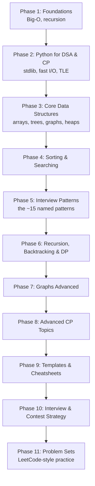

import Quiz from "../../../../components/Quiz.astro";

import DataCampExercise from "../../../../components/DataCampExercise.astro";

import ComplexityChart from "../../../../components/viz/ComplexityChart.tsx";

Welcome to the **DSA with Python** track — a complete, hands-on path from
"what is Big-O?" all the way to segment trees and max-flow. It is built for two
goals that overlap more than people think:

- **Cracking big-tech interviews** (FAANG-style problem solving).
- **Competitive programming** (LeetCode, Codeforces, contests).

## What you'll learn

- What data structures and algorithms actually are, and why they decide whether
  your code runs in 0.1 s or times out.
- How to **run and solve problems right here in the browser** — no setup.
- A repeatable way to read a problem, spot the pattern, and reach for the right tool.
- The full toolkit: arrays → trees → graphs → dynamic programming → advanced CP.

## Why DSA matters

An **algorithm** is a step-by-step recipe. A **data structure** is how you
organize data so an algorithm can be fast. Pick the wrong structure and even a
correct algorithm is too slow to pass.

The same task — "is `x` in this collection?" — costs wildly different amounts
depending on the structure:

| Structure | Membership check | Ordered? |
| --------- | ---------------- | -------- |
| `list`    | $O(n)$           | keeps insertion order |
| `set` / `dict` | $O(1)$ average | no (dict keeps insertion order, set doesn't) |
| sorted `list` + binary search | $O(\log n)$ | yes |

That single choice — `list` vs `set` — is the difference between **Accepted**
and **Time Limit Exceeded** on a large input.

## Visual intuition

Before any specific data structure, the one picture the whole track is built on: how differently
these growth rates behave once the input gets large.

<ComplexityChart
  client:visible
  algo="growth"
  title="Why the choice of algorithm stops being a matter of taste"
  lib="log scale, 1e8 op budget"
  desc="Step through the n values. At n = 10 every curve is fine and the choice genuinely does not matter; by n = 100000 the quadratic curve is millions of times past the budget line while O(n log n) is comfortable. Everything in this track exists to move a solution from one curve to a lower one."
/>

## The roadmap

This track is organized into ordered phases. Follow them top-to-bottom, or jump
to a phase you need.



## How to use this track

Every code block on this site is **live**. It runs real Python in your browser
(via Pyodide) — click **Run** to execute, edit the code, and re-run. Try it:

```python title="hello_dsa.py" showLineNumbers{1}
# Edit me, then press Run.
nums = [5, 3, 8, 1, 9, 2]

# Two ways to find the max — one is O(n), one hides a sort at O(n log n).
print("max via built-in:", max(nums))
print("sorted[-1]     :", sorted(nums)[-1])
```

You'll also see three other block types throughout the track:

- **`p5` animation panels** — watch an algorithm move (sorting, BFS, DP fills).
- **`mermaid` diagrams** — trees, graphs, and recursion structure.
- **Graded exercises** — small tasks that check your answer instantly.

:::note[About the in-browser judge]
The playground runs Python's **standard library only** — it does not connect to
LeetCode's real judge. For LeetCode-style problems we ship our own sample test
cases you can run here, plus a link to the original problem. Treat the in-page
run as your first check, then submit on the real platform.
:::

## A first taste of "which structure?"

Below is a classic interview warm-up: **does the array contain a duplicate?**
The naive double loop is $O(n^2)$. A `set` makes it $O(n)$. Fill in the blank to
use a set.

<DataCampExercise
  lang="python"
  hint={`Add each number to a \`set\`. If a number is already in the set, it's a duplicate. Use the \`in\` operator to check membership.`}
  code={`# Task: return True if nums has any duplicate, else False (in O(n)).
def has_duplicate(nums):
    seen = ___          # start with an empty set
    for x in nums:
        if x in seen:
            return True
        seen.add(x)
    return False

print(has_duplicate([1, 2, 3, 1]))   # expect True
print(has_duplicate([1, 2, 3, 4]))   # expect False`}
  solution={`def has_duplicate(nums):
    seen = set()
    for x in nums:
        if x in seen:
            return True
        seen.add(x)
    return False

print(has_duplicate([1, 2, 3, 1]))
print(has_duplicate([1, 2, 3, 4]))`}
  sct={`test_output_contains("True")
test_output_contains("False")
success_msg("That's the O(n) set trick — you'll use it constantly.")`}
  height={200}
/>

## Complexity

You do not need to *analyse* complexity yet -- that is the next page. But two numbers make the rest of
this track make sense, so they are worth carrying from the start.

**Number one: about $10^7$ simple operations per second** in pure Python. (Compiled languages get
roughly $10^8$; interpreted loops pay a 10-100x tax.) That single figure is what turns a constraint
into a plan:

| If the input size is | You can afford | Which usually means |
| --- | --- | --- |
| up to ~10 | anything, including trying every arrangement | brute force |
| up to ~1,000 | a nested loop over every pair | $O(n^2)$ |
| up to ~100,000 | one sort, or one pass with a lookup structure | $O(n \log n)$ or $O(n)$ |
| up to ~10,000,000 | a single pass, and not much else | $O(n)$ |
| astronomically large | no loop over the input at all | maths, or halving |

**Number two: the structure you pick changes the class, not just the constant.** The same question
answered two ways:

| "Have I seen this value before?" | Cost |
| --- | --- |
| Scan a list | $O(n)$ per check -- measured 659 µs at $n = 100{,}000$ |
| Ask a set | $O(1)$ per check -- measured 0.048 µs, **13,649x faster** |

Both are one line. Inside a loop, the first makes the whole algorithm $O(n^2)$ and the second keeps it
$O(n)$. **That gap is what this entire track is about**: not writing cleverer code, but choosing the
structure whose costs match what you are about to ask of it.

## Pitfalls

Habits worth avoiding from day one, because they are much harder to unlearn later.

- **Memorising solutions instead of patterns.** There are thousands of problems and about thirty
  patterns. Someone who has memorised 200 solutions is helpless on the 201st; someone who recognises
  "this is a sliding window" is not.
- **Skipping the brute force.** Naming the $O(n^2)$ answer takes fifteen seconds and gives you a
  baseline, a correctness reference, and something to fall back on. Jumping straight to the clever
  solution means having nothing when it does not work.
- **Reading the solution as soon as it gets hard.** Reading is a legitimate way to learn -- but log the
  problem as *scheduled*, not *done*, and re-attempt it cold in a week. Understanding a solution and
  being able to produce one are different skills.
- **Grinding easy problems because they feel productive.** Easies drill syntax; mediums drill
  composition, which is what interviews test. A week that is 80% easy has quietly become a comfort
  loop.
- **Ignoring the constraints.** The constraint block tells you the intended complexity before you have
  finished reading the statement. Reading it first is the highest-yield habit on this page.
- **Writing code before saying what it will do.** In an interview this reads as guessing. Even alone
  it costs you, because you cannot debug a plan you never articulated.
- **Optimising a solution that is not yet correct.** Get it right, then get it fast. An
  almost-working fast solution is worth nothing.
- **Learning DSA without writing any.** Reading about a heap is not the same as having implemented
  one. Every page in this track has runnable code for that reason.

## Interview follow-ups

Not follow-ups to a problem -- the questions to ask *yourself* as you work through this track.

| The question | Why it matters | What a good answer looks like |
| --- | --- | --- |
| "What pattern is this?" | Recognition is the transferable skill | Name it *and* the invariant: "sliding window, and the window is valid because all values are positive so the sum is monotonic" |
| "What is the brute force?" | It is your baseline and your fallback | "Check every pair, $O(n^2)$" -- said before you start optimising, every time |
| "What does the constraint imply?" | It prunes the search space in seconds | $n \le 12$ means enumerate; $n \le 10^5$ forbids $O(n^2)$; $10^{18}$ means no loop over the input at all |
| "Which structure fits what I am asking?" | The choice changes the complexity class | Membership -> `set`. Both ends -> `deque`. Always-the-smallest -> heap. Key to value -> `dict` |
| "Can I state why this is correct?" | Correct-looking is not correct | An invariant that holds at every step, or a reason the discarded half cannot contain the answer |
| "What are the edge cases?" | They are where the marks are | Empty, one element, all equal, all negative, and the case the algorithm pivots on |
| "Did I test it before declaring it done?" | Finding your own bug is the strongest signal | Trace it by hand on a small input, out loud, before running it |
| "Could I write this again tomorrow, cold?" | The real measure of learning | If not, it is scheduled for re-attempt, not finished |

## Self-check

<Quiz
  questions={[
    {
      q: "Roughly how many simple operations per second should you assume for pure Python?",
      options: [
        "About 10^8, the same as C",
        "About 10^7 -- interpreted loops pay a 10-100x tax, though work pushed into built-ins does not",
        "About 10^4",
        "It is impossible to estimate",
      ],
      answer: 1,
      explain:
        "This one number turns a constraint into a plan: 10^7 per second means n = 100,000 rules out an O(n^2) approach (10^10 operations) but comfortably allows O(n log n). The corollary matters as much -- `sum`, `sorted` and set operations run in C, so expressing a loop as a built-in is often the fix rather than changing the algorithm.",
    },
    {
      q: "\"Have I seen this value before?\" -- asked of a list versus a set at n = 100,000. What is the measured difference?",
      options: [
        "Roughly 2x",
        "About 13,649x -- 659 microseconds against 0.048",
        "They are the same; Python caches membership tests",
        "The list is faster for small values",
      ],
      answer: 1,
      explain:
        "Both are one line of code and they differ by four orders of magnitude, because one scans and the other hashes. Inside a loop that is the difference between O(n^2) and O(n). This gap is what the whole track is about: not cleverer code, but structures whose costs match what you are asking of them.",
    },
    {
      q: "A problem's constraints say n <= 12. What is that telling you?",
      options: [
        "That the problem is easy",
        "That exponential or factorial work is expected -- the setter sized the input for full enumeration",
        "That there is a closed-form formula",
        "Nothing; small inputs are just easy tests",
      ],
      answer: 1,
      explain:
        "A bound that tiny is never generosity. 2^12 is 4,096 and 12! is about 479 million, so trying every subset or arrangement is exactly what fits. Reading the constraint block before the statement rules out more approaches in five seconds than the prose does in five minutes -- which is the single highest-yield habit in this track.",
    },
    {
      q: "You read the editorial for a problem you could not solve. How should you record it?",
      options: [
        "As solved -- you understand it now",
        "As scheduled: re-attempt it cold in about a week, because understanding a solution and producing one are different skills",
        "As failed, and move on",
        "There is no need to record it",
      ],
      answer: 1,
      explain:
        "Reading is a legitimate learning move; logging it as done is the mistake, because it removes the problem from your queue without the skill having transferred. If the second attempt a week later is still slow, the pattern has not stuck -- which is precisely the signal a log exists to surface.",
    },
    {
      q: "Why prefer learning patterns over memorising solutions?",
      options: [
        "Patterns are easier to remember",
        "There are thousands of problems and about thirty patterns -- recognition generalises to problems you have never seen, memorised solutions do not",
        "Interviewers ask about patterns by name",
        "Memorisation is not possible at scale",
      ],
      answer: 1,
      explain:
        "The arithmetic is the argument. Someone with 200 memorised solutions is stuck on the 201st problem; someone who recognises \"contiguous subarray plus an optimum, so sliding window\" has a starting point for anything in that family. It is also what makes the constraint-reading habit pay off, since constraints point at patterns rather than at specific answers.",
    },
    {
      q: "Which structure answers \"give me the smallest item, repeatedly\" efficiently?",
      options: [
        "A sorted list, re-sorted after each insertion",
        "A heap -- O(log n) push and pop, with the minimum always at the root",
        "A set, since it is O(1)",
        "A deque",
      ],
      answer: 1,
      explain:
        "Re-sorting after every insertion is O(n^2 log n) overall -- the classic wrong answer here. A set gives O(1) membership but no ordering at all, so it cannot produce the smallest. A deque is O(1) at both ends but only in insertion order. Matching the structure to the *question being asked of it* is the skill this track builds.",
    },
  ]}
/>

## Drills

### Drill 1 -- match the need to the structure

<DataCampExercise
  lang="python"
  hint={`Membership testing wants a set. Adding and removing at both ends wants a deque. Repeatedly retrieving the smallest wants a heap. Key-to-value wants a dict. Positional access wants a list.`}
  code={`def pick(need):
    # TODO: return the structure that fits each need.
    # Needs: 'membership test', 'queue from both ends', 'always the smallest',
    #        'key to value', 'index by position'
    pass


print([pick('membership test'), pick('queue from both ends'), pick('always the smallest')])
# expect ['set', 'deque', 'heap']`}
  solution={`def pick(need):
    return {
        'membership test': 'set',
        'queue from both ends': 'deque',
        'always the smallest': 'heap',
        'key to value': 'dict',
        'index by position': 'list',
    }[need]


print([pick('membership test'), pick('queue from both ends'), pick('always the smallest')])`}
  sct={`test_output_contains("deque")
success_msg("Every one of these is a one-line choice that changes the complexity class of whatever loop encloses it. Using a list where a set belongs is the single most common Python performance bug -- measured 13,649x slower at n = 100,000.")`}
  height={380}
/>

### Drill 2 -- count the operations before you write the code

<DataCampExercise
  lang="python"
  hint={`A single loop over n does n units. Fully nested loops do n * n. A triangular nested loop -- where the inner loop starts at the outer index -- does n(n-1)/2, which is about half of n squared.`}
  code={`def op_count(n, shape):
    # TODO: return the approximate operation count for each loop shape.
    # Shapes: 'single loop', 'nested loops', 'triangular'
    pass


print([op_count(1000, 'single loop'),
       op_count(1000, 'nested loops'),
       op_count(1000, 'triangular')])
# expect [1000, 1000000, 499500]`}
  solution={`def op_count(n, shape):
    if shape == 'single loop':
        return n
    if shape == 'nested loops':
        return n * n
    if shape == 'triangular':
        return n * (n - 1) // 2
    raise ValueError(shape)


print([op_count(1000, 'single loop'),
       op_count(1000, 'nested loops'),
       op_count(1000, 'triangular')])`}
  sct={`test_output_contains("499500")
success_msg("The triangular count is 499,500 -- about half of a million, and still O(n^2). That is the point: a constant factor of 2 does not change the class, so a triangular loop times out on the same inputs a full nested loop does. Do this arithmetic against the ~10^7 per second budget BEFORE writing code.")`}
  height={400}
/>

## Recall card

- **About $10^7$ simple operations per second in pure Python** (~$10^8$ compiled). Do this arithmetic
  against the constraint *before* choosing an approach.
- **Read the constraints before the statement.** `n <= 12` means enumerate; `n <= 1000` allows
  $O(n^2)$; `n <= 10^5` forbids it.
- **The structure changes the complexity class, not just the constant.** `x in list` is $O(n)$;
  `x in set` is $O(1)$ -- measured **13,649x** apart at $n = 10^5$.
- **Match the structure to the question**: membership -> `set` · both ends -> `deque` ·
  always-the-smallest -> heap · key to value -> `dict` · positional -> `list`.
- **~30 patterns cover thousands of problems.** Learn recognition, not solutions.
- **Always name the brute force first** -- it is your baseline, your fallback, and your correctness
  reference.
- **A problem you read the solution to is *scheduled*, not done.** Re-attempt cold in a week.
- **Correct first, then fast.** An almost-working fast solution is worth nothing.
- **Write the plan before the code**, and test before declaring it finished.
- **Mediums are where interviews live.** An 80%-easy week is a comfort loop.

## Recap

- **Data structure = how data is organized; algorithm = what you do with it.**
- The right structure turns a slow solution into a fast one — often $O(n)$ vs $O(n^2)$.
- Every code block here is runnable; edit and experiment freely.

Next: **Setup for CP & interviews** — accounts, tooling, and how to practice.
