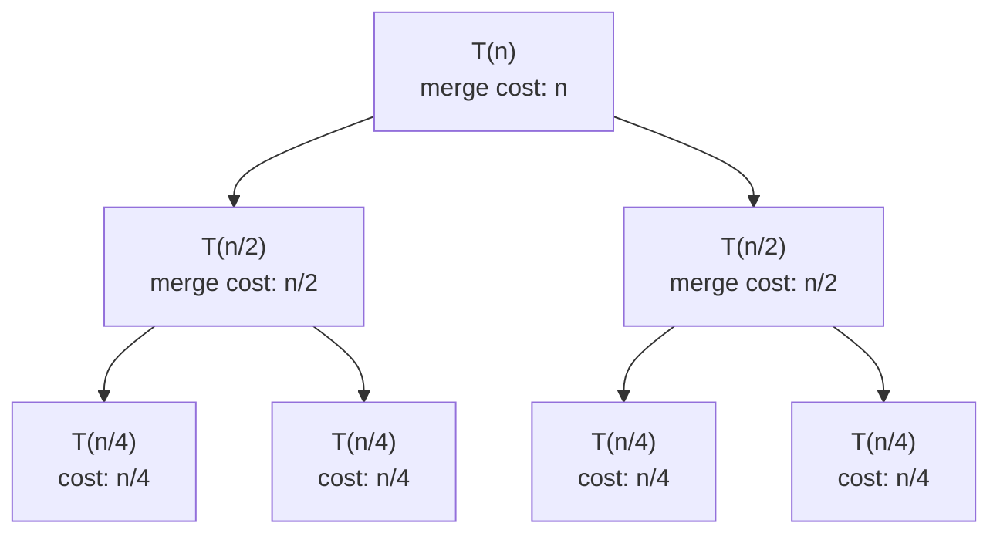
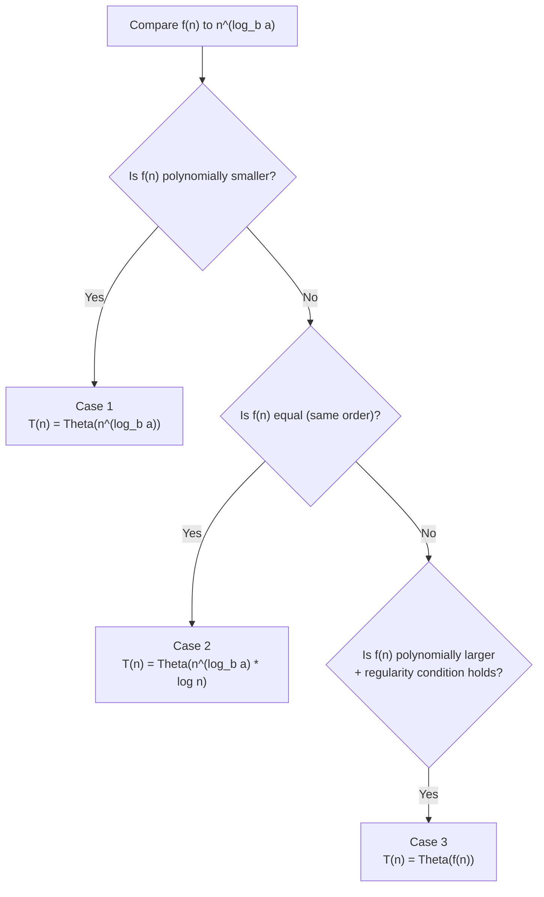

Merge sort, binary search, and most "divide and conquer" algorithms all share
one shape: split the problem, solve the pieces recursively, combine the
results. A **recurrence relation** captures that shape as an equation, and
solving it tells you the Big-O without simulating a single run.

## What you'll learn

- What a recurrence relation is and where it comes from.
- The **recursion tree method** — solving a recurrence by hand, level by level.
- The **Master Theorem** and its three cases.
- How merge sort and binary search reduce to closed-form Big-O.
- A small simulator that computes recurrence cost numerically.

## Where a recurrence comes from

A divide-and-conquer algorithm that splits an input of size $n$ into $a$
subproblems of size $n/b$, then spends $f(n)$ extra work combining the
results, has total cost:

$$
T(n) = a \, T(n/b) + f(n)
$$

- $a$ — how many subproblems you recurse into.
- $b$ — how much smaller each subproblem is ($n$ shrinks to $n/b$).
- $f(n)$ — the work done outside the recursive calls (splitting + combining).

Merge sort, for example, splits into 2 halves ($a = 2$, $b = 2$) and spends
$O(n)$ merging them back together — giving $T(n) = 2T(n/2) + O(n)$.

## The recursion tree method

Draw the recursion as a tree: the root does $f(n)$ work, its $a$ children each
do $f(n/b)$ work, their children do $f(n/b^2)$, and so on until subproblems
hit the base case. Summing every level's cost gives the total.



Every level's costs add up to roughly $n$ (the halves sum back to the whole),
and there are $\log_2 n$ levels before subproblems reach size 1. So total cost
is $n \cdot \log_2 n = O(n \log n)$ — no need to draw the whole tree once you
see the pattern.

## Visual intuition

A recurrence *is* a recursion tree, and the tree is where the cost comes from. Watch the branching
factor and the depth — those two numbers are the `a` and the $\log_b n$ in the theorem:

<RecursionTree
  client:visible
  algo="fib-naive"
  n={6}
  title="T(n) = T(n-1) + T(n-2) + O(1), drawn"
  lib="the tree IS the recurrence"
  desc="Count nodes per level rather than in total: that is exactly what the recursion-tree method does. Here the branching factor is 2 and the depth is n, giving the exponential blow-up. Contrast a divide-and-conquer recurrence, where the subproblem size halves and the depth collapses to log n."
/>

## The Master Theorem

Drawing a tree every time is tedious. The **Master Theorem** gives a direct
answer for $T(n) = aT(n/b) + f(n)$ (with $a \ge 1$, $b > 1$) by comparing
$f(n)$ to $n^{\log_b a}$ — the cost if there were *no* extra work at all:

$$
\begin{aligned}
\textbf{Case 1: } & f(n) = O\!\left(n^{\log_b a - \epsilon}\right) \text{ for some } \epsilon > 0
   \;\Rightarrow\; T(n) = \Theta\!\left(n^{\log_b a}\right) \\[4pt]
\textbf{Case 2: } & f(n) = \Theta\!\left(n^{\log_b a}\right)
   \;\Rightarrow\; T(n) = \Theta\!\left(n^{\log_b a} \log n\right) \\[4pt]
\textbf{Case 3: } & f(n) = \Omega\!\left(n^{\log_b a + \epsilon}\right) \text{ and } a f(n/b) \le c f(n) \text{ for some } c < 1
   \;\Rightarrow\; T(n) = \Theta\!\left(f(n)\right)
\end{aligned}
$$

In plain language: if the combine step is **smaller** than the recursive
work, the recursion dominates (Case 1). If they're **equal**, add a $\log n$
factor (Case 2). If the combine step **dominates**, the top level alone sets
the cost (Case 3).



## Worked examples

**Merge sort**: $T(n) = 2T(n/2) + O(n)$. Here $a = 2$, $b = 2$, so
$\log_b a = \log_2 2 = 1$, and $f(n) = O(n^1)$ — the same order. That's
**Case 2**, so:

$$
T(n) = \Theta(n \log n)
$$

**Binary search**: $T(n) = T(n/2) + O(1)$. Here $a = 1$, $b = 2$, so
$\log_b a = \log_2 1 = 0$, and $f(n) = O(n^0) = O(1)$ — again the same order.
Also **Case 2**, giving:

$$
T(n) = \Theta(\log n)
$$

## A recurrence-cost simulator

Instead of drawing trees by hand, you can compute $T(n)$ numerically by
literally implementing the recurrence, and compare it to the closed-form
prediction:

```python title="recurrence_simulator.py" showLineNumbers{1}
def recurrence_cost(n, a, b, f, base=1):
    """Numerically evaluate T(n) = a * T(n // b) + f(n)."""
    if n <= base:
        return 1
    return a * recurrence_cost(n // b, a, b, f, base) + f(n)

n = 64

# Merge sort: T(n) = 2T(n/2) + n  ->  should track n * log2(n)
merge_cost = recurrence_cost(n, a=2, b=2, f=lambda n: n)
print("merge sort cost:  ", merge_cost, " ~ n log n =", n * n.bit_length())

# Binary search: T(n) = T(n/2) + 1  ->  should track log2(n)
search_cost = recurrence_cost(n, a=1, b=2, f=lambda n: 1)
print("binary search cost:", search_cost, " ~ log n =", n.bit_length() - 1)
```

:::note[Recognizing recurrences fast]
You rarely need the full Master Theorem in an interview — recognizing "this
splits into 2 halves and does O(n) combine work" as merge sort's shape
($O(n \log n)$), or "this halves the search space each time" as binary
search's shape ($O(\log n)$), covers the vast majority of divide-and-conquer
problems you'll see.
:::

## Dry run

### Applying the theorem to six recurrences

For $T(n) = a\,T(n/b) + f(n)$ with $f(n) = n^d$, compare $d$ against $\log_b a$:

| Recurrence | $a$ | $b$ | $d$ | $\log_b a$ | Case | Result |
| --- | --- | --- | --- | --- | --- | --- |
| Merge sort: $2T(n/2) + n$ | 2 | 2 | 1 | **1** | 2 (equal) | $O(n \log n)$ |
| Binary search: $T(n/2) + 1$ | 1 | 2 | 0 | **0** | 2 (equal) | $O(\log n)$ |
| $4T(n/2) + n$ | 4 | 2 | 1 | **2** | 1 (leaves win) | $O(n^2)$ |
| $3T(n/2) + n$ | 3 | 2 | 1 | **1.585** | 1 (leaves win) | $O(n^{1.585})$ |
| Strassen: $7T(n/2) + n^2$ | 7 | 2 | 2 | **2.807** | 1 (leaves win) | $O(n^{2.807})$ |
| $2T(n/2) + n^2$ | 2 | 2 | 2 | **1** | 3 (root wins) | $O(n^2)$ |

All six computed rather than recalled. Three things the table makes concrete:

- **$\log_b a$ is "how fast the subproblems multiply".** It is the exponent of the *leaf count*: there
  are $a^{\log_b n} = n^{\log_b a}$ leaves. Comparing it against $d$ is literally asking "is the work
  concentrated at the leaves, spread evenly, or concentrated at the root?"
- **Case 2 is the only one that produces a $\log n$ factor**, and it happens exactly when the two
  exponents tie -- every level does the same total work, and there are $\log_b n$ levels. Merge sort
  and binary search are both case 2, which is why both have a bare $\log$ in them.
- **$\log_2 3 = 1.585$ is not a typo.** $3T(n/2) + n$ really is $O(n^{1.585})$ -- Karatsuba
  multiplication -- and it is faster than $n^2$ precisely because 3 subproblems is fewer than 4. Same
  for Strassen: $\log_2 7 = 2.807 < 3$, which is the entire point of the algorithm.

### Reading the recursion tree instead

For merge sort at `n = 8`, the work per level:

| Level | Subproblem size | Count | Work per level |
| --- | --- | --- | --- |
| 0 | 8 | 1 | 8 |
| 1 | 4 | 2 | 8 |
| 2 | 2 | 4 | 8 |
| 3 | 1 | 8 | 8 |

$\log_2 8 + 1 = 4$ levels, 8 units each -- so $n \log n$. **The pieces get smaller and there are
proportionally more of them**, which is what makes every level cost the same. That balance *is*
case 2, and seeing it in the tree is more reliable than remembering which case is which.

Change the branching to 4 and the level totals become 8, 16, 32, 64 -- geometrically increasing, so
the **last** level dominates and the answer is the leaf count, $O(n^2)$. That is case 1. Change the
merge cost to $n^2$ and they become 64, 32, 16, 8 -- decreasing, so the **root** dominates: case 3.
Three shapes, three cases, and the tree shows which one you are in.

## Practice

**Drill 1 — the critical exponent.** $\log_b a$ is the exponent every Master
Theorem case compares against. Compute it with `math.log(a, b)`.

<DataCampExercise
  lang="python"
  hint={`math.log(a, b) computes log base b of a directly — that's exactly log_b(a).`}
  code={`# Task: compute log_b(a), the Master Theorem critical exponent.
import math

def crit_exponent(a, b):
    return math.log(a, ___)

print(round(crit_exponent(4, 2), 2))   # expect 2.0
print(round(crit_exponent(2, 2), 2))   # expect 1.0`}
  solution={`import math

def crit_exponent(a, b):
    return math.log(a, b)

print(round(crit_exponent(4, 2), 2))
print(round(crit_exponent(2, 2), 2))`}
  sct={`test_output_contains("2.0")
test_output_contains("1.0")
success_msg("log_b(a) is the number every Master Theorem case is built around.")`}
  height={185}
/>

**Drill 2 — simulate the recurrence.** Finish the recursive call so the
simulator actually recurses on the smaller subproblem.

<DataCampExercise
  lang="python"
  hint={`Call the same function recursively on n // b, passing a, b, and extra through unchanged.`}
  code={`# Task: T(n) = a*T(n // b) + extra(n). Complete the recursive call.
def cost(n, a, b, extra):
    if n <= 1:
        return 1
    return a * ___(n // b, a, b, extra) + extra(n)

print(cost(8, 2, 2, lambda n: n))   # expect 32`}
  solution={`def cost(n, a, b, extra):
    if n <= 1:
        return 1
    return a * cost(n // b, a, b, extra) + extra(n)

print(cost(8, 2, 2, lambda n: n))`}
  sct={`test_output_contains("32")
success_msg("That's the recursion tree, computed instead of drawn.")`}
  height={175}
/>

**Drill 3 — pick the Master Theorem case.** Given the critical exponent and
$f(n)$'s exponent, decide which case applies.

<DataCampExercise
  lang="python"
  hint={`Same exponent means Case 2 (the middle case) — everything else falls to Case 1 or Case 3.`}
  code={`# Task: return 1, 2, or 3 depending on how f_exp compares to log_b_a.
def master_case(log_b_a, f_exp):
    if f_exp < log_b_a:
        return 1
    elif f_exp == log_b_a:
        return ___
    else:
        return 3

print(master_case(1, 1))   # expect 2  (merge sort's shape)
print(master_case(2, 1))   # expect 1`}
  solution={`def master_case(log_b_a, f_exp):
    if f_exp < log_b_a:
        return 1
    elif f_exp == log_b_a:
        return 2
    else:
        return 3

print(master_case(1, 1))
print(master_case(2, 1))`}
  sct={`test_output_contains("2")
test_output_contains("1")
success_msg("Merge sort and binary search both land in Case 2 for exactly this reason.")`}
  height={185}
/>

## Complexity

| Recurrence | Solution | Where it comes from |
| --- | --- | --- |
| $T(n) = T(n/2) + O(1)$ | $O(\log n)$ | binary search |
| $T(n) = T(n/2) + O(n)$ | $O(n)$ | quickselect (expected), root dominates |
| $T(n) = 2T(n/2) + O(1)$ | $O(n)$ | tree traversal -- leaf-dominated |
| $T(n) = 2T(n/2) + O(n)$ | $O(n \log n)$ | merge sort, balanced quicksort |
| $T(n) = 2T(n/2) + O(n^2)$ | $O(n^2)$ | root dominates |
| $T(n) = T(n-1) + O(1)$ | $O(n)$ | linear recursion -- **not** a Master Theorem shape |
| $T(n) = T(n-1) + O(n)$ | $O(n^2)$ | selection sort, insertion sort |
| $T(n) = 2T(n-1) + O(1)$ | $O(2^n)$ | subsets, Towers of Hanoi |
| $T(n) = T(n-1) + T(n-2)$ | $O(\phi^n)$ | naive Fibonacci -- $\phi \approx 1.618$, **not** $2^n$ |
| $T(n) = nT(n-1)$ | $O(n!)$ | permutations |

**The theorem does not cover everything, and knowing the boundary matters:**

- **Subtract-and-conquer ($T(n-1)$, not $T(n/b)$) is out of scope.** The Master Theorem is for
  *dividing*. Those rows above are solved by unrolling, and they are the ones that actually appear in
  interview recursion.
- **Unequal splits are out of scope.** $T(n) = T(n/3) + T(2n/3) + n$ is not of the form, though the
  recursion-tree argument still gives $O(n \log n)$ -- the depth is just $\log_{3/2} n$ instead.
- **Case 3 needs a regularity condition** ($a f(n/b) \le c f(n)$ for some $c < 1$), which every
  polynomial $f$ satisfies. It matters only for exotic $f$, so in practice "root dominates" is safe.
- **Naive Fibonacci is $\Theta(\phi^n)$, not $\Theta(2^n)$.** Measured call counts divided by $\phi^n$
  are a constant **1.45** at $n = 10, 20, 25, 30$ -- while $2^n$ overestimates by 12x at $n = 30$.
  $2^n$ is a valid upper bound and a wrong tight bound.

## Pitfalls

- **Using the theorem on $T(n-1)$ recurrences.** It only applies to $T(n/b)$ -- divide, not subtract.
  $T(n) = T(n-1) + n$ is $O(n^2)$ by unrolling, and no case of the theorem describes it.
- **Comparing $f(n)$ against $n$ instead of against $n^{\log_b a}$.** The comparison is always
  against the leaf-count exponent. For $4T(n/2) + n$, $f = n$ looks "linear and therefore cheap" but
  $\log_2 4 = 2$, so the leaves dominate and the answer is $O(n^2)$.
- **Forgetting that $\log_b a$ is usually not an integer.** $3T(n/2) + n$ gives $O(n^{1.585})$ --
  Karatsuba. Rounding to $n^2$ throws away the entire reason the algorithm exists.
- **Quoting naive Fibonacci as $O(2^n)$.** It is $\Theta(\phi^n)$. Measured: 2,692,537 calls at
  $n = 30$ against $2^{30} \approx 1.07$ billion -- a 400x overestimate. Correct as an upper bound,
  wrong as a tight one.
- **Assuming case 2 whenever you see a $\log$.** Case 2 requires the exponents to be **equal**. A
  $\log$ in $f(n)$ itself (say $f(n) = n \log n$) needs the extended form of the theorem.
- **Ignoring the base case's cost.** The theorem describes the recursion; if the base case does
  non-constant work, that multiplies the leaf count. $n$ leaves each doing $O(n)$ is $O(n^2)$ however
  cheap the combine step is.
- **Treating the theorem as a substitute for the tree.** Drawing two levels and asking "is the work
  growing, flat, or shrinking?" answers the question without recalling which case is which -- and it
  works on the recurrences the theorem does not cover.

## Interview follow-ups

| They ask | What they're checking | The answer |
| --- | --- | --- |
| "Solve $T(n) = 2T(n/2) + n$" | Whether you can do it two ways | $O(n \log n)$. Either case 2 ($\log_2 2 = 1 = d$), or the tree: $\log n$ levels of $n$ work each. The tree argument is the one to give, because it generalises |
| "Why does merge sort have a $\log$ but tree traversal does not?" | Understanding, not recall | Traversal is $2T(n/2) + O(1)$ -- the combine is free, so the leaves dominate and it is $O(n)$. Merge sort's combine is $O(n)$, which exactly ties the leaf growth: case 2, hence the $\log$ |
| "What is $\log_b a$ intuitively?" | Depth | The exponent of the **leaf count**: there are $n^{\log_b a}$ leaves. Comparing it against $f$'s exponent asks whether the work sits at the leaves, is spread evenly, or sits at the root |
| "Solve $T(n) = T(n-1) + n$" | Whether you notice it is out of scope | Not a Master Theorem shape -- it subtracts rather than divides. Unroll: $n + (n-1) + \cdots = O(n^2)$. This is insertion and selection sort |
| "Naive Fibonacci's complexity?" | Precision | $\Theta(\phi^n)$, $\phi \approx 1.618$ -- **not** $\Theta(2^n)$. Measured call counts are 1.45 $\phi^n$ at every $n$; $2^n$ overestimates 400x at $n = 30$. It is a correct upper bound and a wrong tight bound |
| "Strassen is $7T(n/2) + n^2$. Why is that an improvement?" | Applying it | $\log_2 7 = 2.807 < 3$, so $O(n^{2.807})$ beats the $O(n^3)$ of naive matrix multiplication. Seven subproblems instead of eight is the whole algorithm |
| "$T(n) = T(n/3) + T(2n/3) + n$?" | The limits | Unequal splits are outside the theorem, but the tree still works: every level totals $n$, and the depth is $\log_{3/2} n$ -- so $O(n \log n)$, with a worse constant than a balanced split |
| "Do you need to memorise the three cases?" | Judgement | No -- draw two levels and see whether the per-level work grows, stays flat, or shrinks. Growing means leaf-dominated, flat means multiply by the depth, shrinking means root-dominated. The tree also covers what the theorem does not |

## Self-check

<Quiz
  questions={[
    {
      q: "What is log_b(a) intuitively, in a divide-and-conquer recurrence?",
      options: [
        "The recursion depth",
        "The exponent of the LEAF COUNT -- there are n^(log_b a) leaves, so comparing it against f's exponent asks where the work sits",
        "The cost of the combine step",
        "The branching factor",
      ],
      answer: 1,
      explain:
        "Depth is log_b(n), a different quantity. Each level multiplies the subproblem count by a and divides the size by b, so after log_b(n) levels there are a^(log_b n) = n^(log_b a) leaves. The three cases are just \"leaves dominate\", \"every level ties\", and \"the root dominates\".",
    },
    {
      q: "T(n) = 3T(n/2) + n. What is the solution?",
      options: [
        "O(n log n)",
        "O(n^1.585), since log2(3) = 1.585 > 1 -- the leaves dominate",
        "O(n^2)",
        "O(n)",
      ],
      answer: 1,
      explain:
        "This is Karatsuba multiplication, and the non-integer exponent is the point: three subproblems rather than four is exactly what beats the O(n^2) schoolbook method. Rounding 1.585 up to 2 throws away the entire reason the algorithm exists.",
    },
    {
      q: "Why do merge sort (2T(n/2) + n) and tree traversal (2T(n/2) + O(1)) have different bounds?",
      options: [
        "They do not -- both are O(n log n)",
        "Traversal's combine is free, so the leaves dominate: O(n). Merge sort's O(n) combine exactly ties the leaf growth, giving case 2 and the log factor",
        "Traversal visits each node twice",
        "Merge sort allocates memory",
      ],
      answer: 1,
      explain:
        "Same a and b, different f, different case. For traversal, log2(2) = 1 > 0 = d, so case 1 gives O(n^1). For merge sort the exponents tie at 1, so case 2 multiplies by the depth. This pair is the cleanest illustration that the combine cost -- not the branching -- decides whether a log appears.",
    },
    {
      q: "Can the Master Theorem solve T(n) = T(n-1) + n?",
      options: [
        "Yes -- it gives O(n log n)",
        "No -- the theorem is for DIVIDING (T(n/b)). This subtracts, and unrolling gives O(n^2)",
        "Yes -- case 3 applies",
        "Only if you rewrite it as T(n/2)",
      ],
      answer: 1,
      explain:
        "Subtract-and-conquer is out of scope entirely. Unrolling gives n + (n-1) + (n-2) + ... = n(n+1)/2 = O(n^2) -- which is insertion sort and selection sort. Knowing where the theorem stops applying matters, because these subtracting recurrences are the ones that actually turn up in interview recursion.",
    },
    {
      q: "Naive recursive Fibonacci makes 2,692,537 calls at n = 30. Is it O(2^n)?",
      options: [
        "Yes -- exactly 2^n calls",
        "It is a valid upper bound but not tight: the real growth is Theta(phi^n) with phi = 1.618, and 2^30 overestimates by about 400x",
        "No -- it is O(n^2)",
        "No -- it is O(n log n) with memoisation",
      ],
      answer: 1,
      explain:
        "Measured call counts divided by phi^n give a constant 1.45 at n = 10, 20, 25 and 30 -- the signature of Theta(phi^n). 2^30 is about 1.07 billion against the actual 2.7 million. The recurrence T(n) = T(n-1) + T(n-2) has the Fibonacci growth rate by definition, which is why phi appears.",
    },
    {
      q: "When does the Master Theorem produce a log n factor?",
      options: [
        "Whenever the recurrence divides by b",
        "Only in case 2, when f's exponent equals log_b(a) -- every level does the same total work and there are log_b(n) levels",
        "Whenever f(n) contains a log",
        "In cases 2 and 3",
      ],
      answer: 1,
      explain:
        "The log is the level count, and it only survives when the per-level work is flat -- geometric growth or decay is dominated by one end of the tree instead. That is why merge sort and binary search both carry a bare log and why 4T(n/2)+n, which is leaf-dominated, does not.",
    },
    {
      q: "You cannot recall which case is which. What is the reliable fallback?",
      options: [
        "Assume case 2, which is the most common",
        "Draw two levels and ask whether the per-level total is growing, flat, or shrinking -- and it also handles recurrences the theorem does not cover",
        "Compute f(n) at n = 100",
        "Guess O(n log n)",
      ],
      answer: 1,
      explain:
        "Growing means the leaves dominate; flat means multiply by the depth; shrinking means the root dominates. For merge sort at n = 8 the levels are 8, 8, 8, 8 -- flat, so n log n. Change the branching to 4 and they become 8, 16, 32, 64 -- growing, so O(n^2). The tree also handles unequal splits like T(n/3) + T(2n/3) + n, which the theorem cannot.",
    },
  ]}
/>

## Recall card

- **$T(n) = a\,T(n/b) + n^d$: compare $d$ against $\log_b a$.** Less -> leaves win, $O(n^{\log_b a})$.
  Equal -> **case 2**, $O(n^{\log_b a} \log n)$. Greater -> root wins, $O(n^d)$.
- **$\log_b a$ is the leaf-count exponent** -- there are $n^{\log_b a}$ leaves. That is the whole
  intuition.
- **Only case 2 produces a bare $\log n$**, because that is the one where every level ties and the
  level count survives.
- **Merge sort $2T(n/2)+n$ -> $O(n\log n)$** (case 2); **tree traversal $2T(n/2)+O(1)$ -> $O(n)$**
  (case 1). Same split, different combine.
- **Non-integer exponents are real**: $3T(n/2)+n$ is $O(n^{1.585})$ (Karatsuba), Strassen's
  $7T(n/2)+n^2$ is $O(n^{2.807})$ -- both beat the naive bound because they cut the branching factor.
- **The theorem does not cover $T(n-1)$** -- subtract-and-conquer is unrolled instead:
  $T(n-1)+n \Rightarrow O(n^2)$, $2T(n-1)+1 \Rightarrow O(2^n)$.
- **Nor unequal splits** -- but the tree still works: $T(n/3)+T(2n/3)+n$ is $O(n\log n)$ with depth
  $\log_{3/2} n$.
- **Naive Fibonacci is $\Theta(\phi^n)$, not $2^n$** -- measured 1.45$\phi^n$ at every $n$; $2^{30}$
  overestimates 400x.
- **When in doubt, draw two levels** and ask: growing, flat, or shrinking?

## Recap

- Divide-and-conquer cost is captured by $T(n) = aT(n/b) + f(n)$.
- The recursion tree method sums cost per level; number of levels is
  $\log_b n$.
- The Master Theorem gives the closed form directly by comparing $f(n)$ to
  $n^{\log_b a}$ — no tree required.
- Merge sort: $\Theta(n \log n)$. Binary search: $\Theta(\log n)$. Both land
  in Case 2.

Next: **Space Complexity and the Call Stack** — what recursion actually costs
in memory, not just time.
