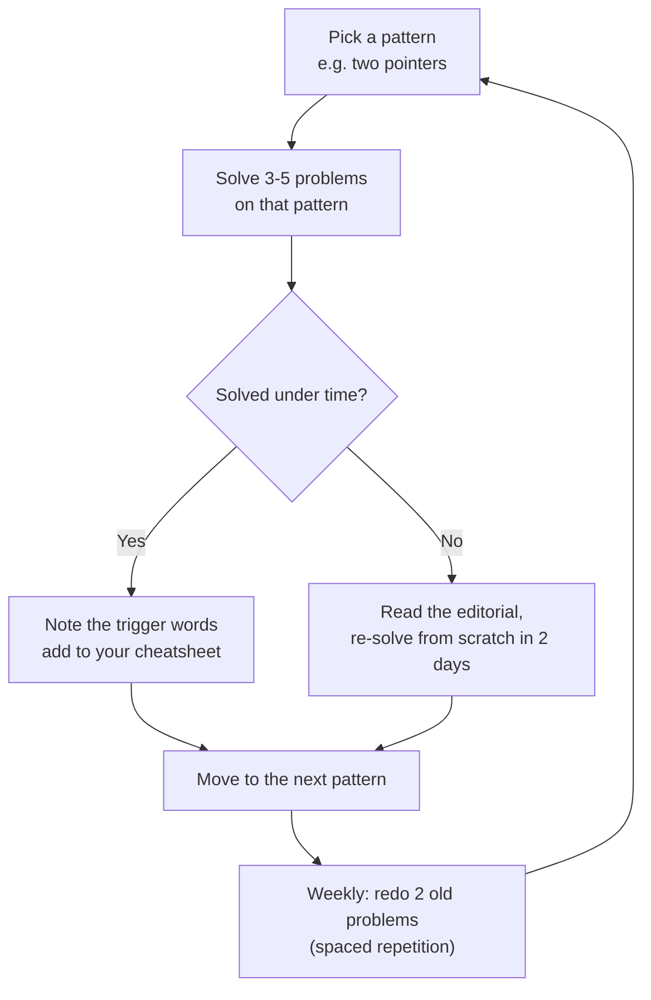

Before you write a single sorting algorithm, get the boring logistics out of
the way: which platforms to use, which Python to submit with, and how to
practice so the effort actually compounds instead of evaporating.

## What you'll learn

- Which accounts to create — LeetCode, Codeforces, HackerRank — and what each
  one is actually good for.
- **CPython vs PyPy**: which one to submit with on a competitive-programming judge.
- When to practice **in-browser here** vs setting up Python locally.
- A repeatable, **pattern-based, spaced-repetition** practice routine.
- A fast-I/O `main()` template you'll reuse for almost every CP problem.

## Create your accounts

Each platform rewards a different kind of practice:

| Platform | Best for | Judge languages |
| -------- | -------- | ---------------- |
| **LeetCode** | Interview-style patterns, company tags, contests (weekly/biweekly) | Python 3 (CPython) |
| **Codeforces** | Competitive programming, live rated contests (Div 2/3/4), rich editorials | Python 3 **and** PyPy 3 |
| **HackerRank** | Some companies use it directly as a hiring test; also good for language-warmup katas | Python 3 (CPython) |

Sign up for all three — you don't need to be active everywhere, but you'll
run into each one eventually (a recruiter sends a HackerRank test, an
interview prep plan lives on LeetCode, a contest happens on Codeforces).

## Visual intuition

The single most useful thing to have internalised before a contest: **which complexities fit inside
one second**. Read the constraint, find the curve, pick the approach — in that order.

<ComplexityChart
  client:visible
  algo="growth"
  title="The budget line is the whole setup"
  lib="~1e8 operations per second"
  desc="This is the calculation to run before writing anything: n ≤ 20 means exponential is intended, n ≤ 5000 allows quadratic, n ≤ 100000 demands O(n log n) or better. Python's constant factor is roughly 10–100× C++, so shift your budget down accordingly -- that is what the PyPy discussion below is really about."
/>

## CPython vs PyPy

CPython — the standard interpreter you're already running in this browser —
is what almost every interview platform (LeetCode, HackerRank) gives you, and
it's usually fine because their time limits are set with Python in mind.

Codeforces and some judges also offer **PyPy 3**, which uses a JIT compiler
and can be **10-50x faster** on tight numeric loops. If a Codeforces problem's
time limit feels impossibly strict for a correct $O(n)$ solution in Python,
resubmit with PyPy before assuming your algorithm is wrong.

:::tip[Rule of thumb]
Writing/interview practice → CPython is what you'll get anyway, so practice
with it. Competitive programming with tight TLEs → **submit PyPy 3** if the
judge offers it, especially for loop-heavy $O(n)$ or $O(n \log n)$ solutions.
:::

## Local setup vs practicing here

Every `python` code block on this site runs for real in your browser via
Pyodide — click **Run**, edit, re-run. That's enough for learning concepts,
drilling patterns, and testing edge cases quickly.

:::note[About the in-browser judge]
The playground runs Python's **standard library only** — it does not connect
to LeetCode's real judge. For LeetCode-style problems we ship our own sample
test cases you can run here, plus a link to the original problem. Treat the
in-page run as your first check, then submit on the real platform.
:::

For serious CP (and to match what a real judge sees) it's worth installing
**Python 3.11+** locally too, plus an editor with good autocomplete. Many
Codeforces regulars also install a browser extension like Competitive
Companion to parse sample tests straight into a local file — nice, but
entirely optional to get started.

## A repeatable practice routine

The single biggest mistake in early DSA practice is grinding problems
**randomly**. Practicing **by pattern** — sliding window, two pointers,
binary search on answer, and so on — and revisiting old problems on a
schedule (spaced repetition) beats raw problem count almost every time.



The **Interview Patterns** phase later in this track names all ~15 patterns
explicitly, so this workflow has a concrete list to walk through.

## A fast-I/O template

A real judge feeds your program input through **stdin**. This track's
playground can't attach a real stdin, so the template below simulates it
with a string — but the parsing shape (`sys.stdin.read().split()`) is exactly
what you'll paste into a real submission.

```python title="cp_template.py" showLineNumbers{1}
import sys

def main():
    # On a real judge you'd read everything at once for speed:
    #   data = sys.stdin.read().split()
    # Here we simulate that input so the template still runs in-browser.
    simulated_input = "5\n3 1 4 1 5\n"
    data = simulated_input.split()

    it = iter(data)
    n = int(next(it))
    nums = [int(next(it)) for _ in range(n)]

    print("n    =", n)
    print("nums =", nums)
    print("sum  =", sum(nums))

main()
```

:::tip[Why read all of stdin at once?]
Calling `input()` in a loop is slow for large inputs because of per-call
overhead. Reading everything with `sys.stdin.read()` once, then splitting and
walking an iterator, is the standard CP fast-I/O pattern — we cover it (plus
fast output with `sys.stdout.write`) in depth in **Phase 2**.
:::

## Practice

**Drill 1 — parse fast.** Turn a raw line of space-separated numbers into a
list of ints in one pass, the way you will at the top of almost every CP
solution.

<DataCampExercise
  lang="python"
  hint={`map(int, ...) applies int() to every piece produced by .split(). Wrap it in list(...) to get a real list back.`}
  code={`# Task: parse "3 1 4 1 5" into [3, 1, 4, 1, 5].
def read_ints(line):
    return list(map(int, ___.split()))

print(read_ints("3 1 4 1 5"))`}
  solution={`def read_ints(line):
    return list(map(int, line.split()))

print(read_ints("3 1 4 1 5"))`}
  sct={`test_output_contains("[3, 1, 4, 1, 5]")
success_msg("That one-liner starts almost every CP solution you'll write.")`}
  height={165}
/>

**Drill 2 — track your patterns.** Practicing by pattern means knowing which
ones you've drilled enough. Complete a check for "have I solved this pattern
at least 3 times?".

<DataCampExercise
  lang="python"
  hint={`.get(pattern, 0) returns the count, or 0 if the pattern isn't in the dict yet. Compare it with >=.`}
  code={`# Task: return True once a pattern has been solved 3+ times.
def is_mastered(pattern_counts, pattern):
    return pattern_counts.get(pattern, 0) ___ 3

counts = {"two_pointers": 4, "sliding_window": 2}
print(is_mastered(counts, "two_pointers"))    # expect True
print(is_mastered(counts, "sliding_window"))  # expect False`}
  solution={`def is_mastered(pattern_counts, pattern):
    return pattern_counts.get(pattern, 0) >= 3

counts = {"two_pointers": 4, "sliding_window": 2}
print(is_mastered(counts, "two_pointers"))
print(is_mastered(counts, "sliding_window"))`}
  sct={`test_output_contains("True")
test_output_contains("False")
success_msg("Now you can quantify 'have I actually drilled this pattern?'")`}
  height={190}
/>

**Drill 3 — the template in miniature.** Fill in the missing piece of the
fast-parse-then-reduce shape you'll use constantly.

<DataCampExercise
  lang="python"
  hint={`After list(map(int, line.split())) you have a plain list of ints — sum() reduces it in one call.`}
  code={`# Task: parse the line and return the sum of the numbers.
def fast_sum(line):
    nums = list(map(int, line.split()))
    return ___(nums)

print(fast_sum("10 20 30"))   # expect 60`}
  solution={`def fast_sum(line):
    nums = list(map(int, line.split()))
    return sum(nums)

print(fast_sum("10 20 30"))`}
  sct={`test_output_contains("60")
success_msg("Parse once, reduce once — the CP fast-I/O shape.")`}
  height={165}
/>

## Complexity

Setup is not an algorithms topic, but two of the choices on this page change your effective
complexity budget -- which is the only reason they matter.

| Choice | Effect on the budget |
| --- | --- |
| **CPython** | ~$10^7$ simple operations/second for interpreted loops |
| **PyPy** (where the judge offers it) | often **5-50x faster** on tight numeric loops -- the same algorithm may pass |
| Work expressed in built-ins (`sum`, `sorted`, `heapq`, set ops, `join`) | runs in C, so it dodges the interpreter tax entirely |
| `input()` in a loop | can dominate the whole runtime at $10^5$+ lines -- see [Fast IO](../../phase-02-python-for-dsa-and-cp/fast-io-and-beating-tle/) |
| `print()` in a loop | same problem on the output side; buffer and emit once |

So the practical ordering when something is too slow:

1. **Is the complexity class wrong?** Re-read the constraint. This is free to check and the most
   common cause.
2. **Is the bound over the variable you assumed?** $O(nW)$ is in the *capacity*, $O(n \log R)$ in the
   *value* range.
3. **Is I/O the bottleneck?** At $10^5$ lines, `input()` alone can be the whole time limit.
4. **Only then** the constant factor: push the hot loop into a built-in, or switch to PyPy.

Doing these in the wrong order is expensive. Rewriting an inner loop when the complexity class is
wrong is the classic waste, and it happens because step 4 feels like progress.

## Pitfalls

- **Practising without a timer.** Interviews and contests are timed, and untimed practice trains a
  different skill. Time-box from the start.
- **Only ever competing live, never practising between rounds.** Virtual contests on past rounds
  reproduce the same pressure on demand and are the most underused tool available.
- **Reading editorials instead of upsolving.** Reading is not solving. Get the accepted verdict on the
  problems you could not finish -- that is where the improvement actually comes from.
- **Using the judge as a debugger.** Wrong submissions cost time-adjusted points on LeetCode and a flat
  penalty on Codeforces. Test locally against the samples first.
- **No template ready.** Fast I/O, the common imports, and a multi-test-case scaffold should be
  paste-ready. Retyping them costs minutes on *every* problem, not just the hard ones.
- **A template that is too clever.** If you cannot debug it under pressure, it is a liability. Keep it
  short enough to read at a glance.
- **Leaving debug `print` statements in.** Judges compare output exactly, so a stray trace turns a
  correct solution into a wrong answer. Print to `sys.stderr` if you must -- judges ignore it.
- **Forgetting to reset global state between test cases.** A module-level `visited` set or an
  `lru_cache` that survives across cases fails from case two onward -- and the sample usually has one
  case, so it passes locally.
- **Assuming PyPy is always available or always faster.** It is often absent for interview platforms,
  and it is *slower* to start, so it can lose on tiny inputs. Check what the judge offers.
- **Not knowing your editor's run shortcut.** Sounds trivial; costs seconds on every iteration of a
  debug loop, which is where contest time actually goes.

## Interview follow-ups

| They ask | What they're checking | The answer |
| --- | --- | --- |
| "How do you practise?" | Whether your process is deliberate | Timed sessions, patterns rather than problem counts, a log tagged by pattern with the outcome, and mocks in the final stretch. Specific beats enthusiastic |
| "Python for interviews -- is that a problem?" | Whether you know the trade-offs | No for interviews: the interpreter tax rarely matters when `n` is small and readability is being graded. It can matter in contests, where PyPy or expressing work as built-ins is the answer |
| "Your solution timed out. What do you check first?" | Diagnosis order | Complexity class, then the variable the bound is over, then I/O, then the constant factor. Rewriting the inner loop when the class is wrong is the expensive mistake |
| "CPython or PyPy?" | Practical awareness | PyPy where the judge offers it and the loops are tight -- often 5-50x on numeric work. But it is frequently unavailable on interview platforms, and its startup cost can lose on tiny inputs |
| "Would you use a template in an interview?" | Reading the room | No -- a contest template signals the wrong thing in an interview, where they want to see you think. Templates are for contests, where minutes-to-correct is the score |
| "How do you know you are improving?" | Self-assessment | The struggled-by-pattern column of the log shrinking, and being able to name the intended complexity from the constraints before starting. Not a problem count |
| "What is in your template?" | Whether it is thought through | Fast I/O (`sys.stdin`), the imports you actually use (`deque`, `heapq`, `bisect`, `math`), a multi-test-case scaffold, and a raised recursion limit. Short enough to read at a glance |
| "Do you compete? Why does it help here?" | Framing it usefully | Implementation speed and debugging under pressure, plus reading constraints to size an approach. Not "it makes me a better engineer" -- that claim invites disagreement and is not what contests train |

## Self-check

<Quiz
  questions={[
    {
      q: "Your solution times out. What do you check first?",
      options: [
        "Rewrite the inner loop to use built-ins",
        "Whether the complexity class is wrong -- re-read the constraint. Then the bound's variable, then I/O, then the constant factor",
        "Switch to PyPy",
        "Reduce the input size",
      ],
      answer: 1,
      explain:
        "Cheapest and most likely first. Rewriting for constant factor feels like progress, which is exactly why people do it before checking whether the class is wrong -- and if it is, no amount of micro-optimisation will help. The middle step is the sneaky one: O(nW) is in the capacity and O(n log R) in the value range, both routinely misquoted as functions of n.",
    },
    {
      q: "When is PyPy the right choice?",
      options: [
        "Always -- it is strictly faster than CPython",
        "On judges that offer it, for tight numeric loops where it is often 5-50x faster -- but it is frequently unavailable and its startup cost can lose on tiny inputs",
        "Never for competitive programming",
        "Only for problems involving recursion",
      ],
      answer: 1,
      explain:
        "The JIT needs a hot loop to pay for itself, so on a small input the warm-up can make it slower. It is also commonly absent on interview platforms. The related point is that work already expressed in built-ins -- sum, sorted, heapq, set operations -- runs in C under CPython and so gains much less from PyPy than a hand-written loop does.",
    },
    {
      q: "Why is a stray debug `print` worse than it sounds?",
      options: [
        "It slows the program down",
        "Judges compare output exactly, so extra output turns a correct solution into a wrong answer",
        "It causes a memory leak",
        "It only matters on interactive problems",
      ],
      answer: 1,
      explain:
        "The verdict is Wrong Answer on an algorithm that is completely correct, which is the most frustrating way to lose points. Printing to sys.stderr is the safe habit -- judges ignore that stream, so debug output can stay in without affecting the comparison.",
    },
    {
      q: "A multi-test-case solution passes locally but fails from the second case onward on the judge. Most likely cause?",
      options: [
        "Input parsing",
        "Global or module-level state -- a visited set, a memo, an lru_cache -- not reset between cases",
        "The time limit",
        "Output formatting",
      ],
      answer: 1,
      explain:
        "The signature is passing case one and failing the rest, and the sample input usually contains a single case, which hides it completely. An lru_cache that survives across cases is the same bug in a different costume. Reset the state inside the per-case function, or build it fresh each time.",
    },
    {
      q: "What is the difference between reading an editorial and upsolving?",
      options: [
        "None -- both teach you the solution",
        "Upsolving means getting the accepted verdict yourself afterwards; reading skips the implementation, which is where contest failures actually live",
        "Upsolving means solving it faster the second time",
        "Editorials are for contests, upsolving is for interviews",
      ],
      answer: 1,
      explain:
        "Most contest losses are implementation bugs rather than missing ideas, so the part reading skips is the part that needed practice. Nodding at an editorial produces the feeling of learning without the transfer. Getting the verdict is the check that it actually happened.",
    },
    {
      q: "Should you use a contest template in a coding interview?",
      options: [
        "Yes -- it saves time",
        "No -- it signals the wrong thing where they want to watch you think. Templates are for contests, where minutes-to-correct is the score",
        "Yes, but only the imports",
        "It makes no difference",
      ],
      answer: 1,
      explain:
        "The two situations reward opposite things. A contest grades whether the verdict is Accepted and how fast; an interview grades your reasoning, communication and testing. Pasting a fast-I/O block into a whiteboard problem answers a question nobody asked, and it can read as though you are reciting rather than solving.",
    },
  ]}
/>

## Recall card

- **CPython gives ~$10^7$ simple operations/second**; **PyPy is often 5-50x faster** on tight loops
  where the judge offers it. Built-ins (`sum`, `sorted`, `heapq`, set ops) already run in C.
- **TLE diagnosis order**: complexity class -> the bound's variable ($O(nW)$, $O(n \log R)$) -> I/O
  -> constant factor. Never reverse it.
- **Have a paste-ready template**: `sys.stdin` fast I/O, the imports you use, a multi-test-case
  scaffold, a raised recursion limit -- short enough to read at a glance.
- **Templates are for contests, not interviews.** Different things are being graded.
- **Reset global state between test cases** -- passing case 1 and failing the rest is the signature,
  and the sample hides it.
- **Strip debug prints**, or send them to `sys.stderr`, which judges ignore.
- **Never use the judge as a debugger** -- penalties are real. Test locally, then submit.
- **Practise timed**, and use **virtual contests** on past rounds for pressure on demand.
- **Upsolve, do not just read.** Get the verdict yourself; reading skips the implementation, which is
  where contest failures live.
- **Know your editor's run shortcut.** Seconds per debug cycle is where contest time goes.

## Recap

- **LeetCode** for interview patterns, **Codeforces** for rated contests and
  editorials, **HackerRank** for hiring tests.
- CPython is fine for interviews; on Codeforces, **submit PyPy 3** if a
  correct solution is timing out.
- Practice **here** for fast iteration; install Python locally too once you're
  serious about CP.
- Practice **by pattern**, not randomly, and revisit old problems on a
  schedule.
- The fast-I/O `main()` shape above gets a full upgrade — real `sys.stdin`,
  buffered output — in **Phase 2: Python for DSA & CP**.

Next: **Big-O and Complexity Deep Dive** — the language you'll use to reason
about every solution from here on.
