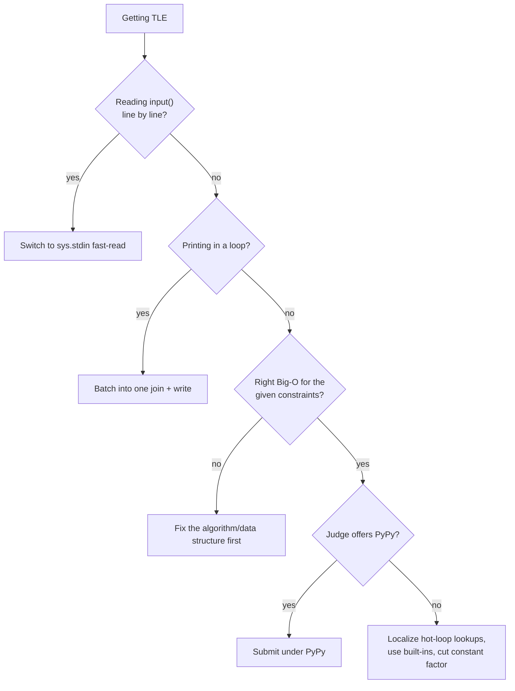

import Quiz from "../../../../components/Quiz.astro";

import DataCampExercise from "../../../../components/DataCampExercise.astro";

import ComplexityChart from "../../../../components/viz/ComplexityChart.tsx";

Plenty of correct, right-complexity solutions still get **Time Limit
Exceeded** — not because the algorithm is wrong, but because reading and
writing input the naive way is itself too slow when there are hundreds of
thousands of lines. This page fixes that half of the TLE problem.

## What you'll learn

- Why `input()` is slow for large inputs.
- The two standard fast-read patterns: `sys.stdin.readline` and
  `sys.stdin.buffer.read().split()`.
- Buffered output with `sys.stdout.write` / `"\n".join`.
- A reusable CP input template you can paste into any problem.
- What to try when Python is *genuinely* too slow, beyond I/O.
- Two silent perf traps: recursion limit and repeated attribute lookups.

## Why `input()` is slow

`input()` is convenient — it prompts, reads a line, strips the trailing
newline, and does encoding-safety work on every single call. That per-call
overhead is invisible for 10 lines and very visible for 200,000 lines. Fast
I/O in Python isn't about a faster algorithm; it's about **paying that
overhead once** instead of once per line.

## Visual intuition

TLE is an arithmetic problem, not a mystery. Locate your input size on the axis, find the curve your
solution sits on, and compare with the budget line:

<ComplexityChart
  client:visible
  algo="growth"
  title="Before optimising I/O, check that the algorithm can fit at all"
  lib="~1e8 operations per second"
  desc="Fast I/O buys a constant factor -- often 3-5x, which rescues a solution sitting just above the line. It cannot rescue one on the wrong curve: no amount of readline tuning turns O(n²) at n = 10^5 into a pass. Diagnose which of the two you have before spending time here."
/>

## Pattern 1: `sys.stdin.readline`

Drop-in-ish replacement for `input()` — but it **keeps the trailing
newline**, so you must `.strip()` or `.rstrip()` it yourself.

```python title="fast_readline.py" showLineNumbers{1}
import sys
import io

# Simulate stdin so this runs standalone (a real judge already has stdin set).
sys.stdin = io.StringIO("3\napple\nbanana\ncherry\n")

readline = sys.stdin.readline   # local alias — see the caution below

n = int(readline())
words = [readline().strip() for _ in range(n)]
print(n, words)
```

## Pattern 2: read everything at once

For pure whitespace-separated tokens (most CP inputs), the fastest pattern is
to read the **entire** input in one call and split it into a token list —
one system call total, no matter how many lines follow.

```python title="fast_read_all.py" showLineNumbers{1}
import sys
import io

sys.stdin = io.StringIO("4\n10 20 30 40\n")

data = sys.stdin.buffer.read().split()
it = iter(data)

n = int(next(it))
nums = [int(next(it)) for _ in range(n)]
print("n =", n, "nums =", nums)
```

`sys.stdin.buffer.read()` reads raw bytes; `.split()` on bytes splits on any
whitespace (spaces, newlines) and gives you a flat list of byte-strings,
which `int()` happily converts.

## Fast output: don't print in a loop

`print()` inside a big loop flushes repeatedly and is surprisingly costly at
scale. Build the output as a single string and write it once.

```python title="fast_output.py" showLineNumbers{1}
import sys

results = [str(i * i) for i in range(10)]

# Slow way (fine for small n): one print() call per line
# for r in results:
#     print(r)

# Fast way: one join, one write
sys.stdout.write("\n".join(results) + "\n")
```

## A reusable CP input template

This is the pattern to paste at the top of almost any competitive
programming solution — it works whether the real judge feeds stdin, or (as
here) we feed it a fake in-memory stream to run in the browser.

```python title="cp_template.py" showLineNumbers{1}
import sys
import io

# --- fake stdin so this demo runs standalone; a real judge sets this for you ---
sys.stdin = io.StringIO("5\n4 2 9 1 7\n")

def main():
    data = sys.stdin.buffer.read().split()
    it = iter(data)
    n = int(next(it))
    arr = [int(next(it)) for _ in range(n)]

    out = []
    out.append(str(sum(arr)))
    out.append(str(max(arr)))
    sys.stdout.write("\n".join(out) + "\n")

main()
```

:::tip[Template habit]
Wrap your solution in a `main()` function and call it at the bottom. Local
variables are looked up faster than globals in CPython, so this alone gives
a small but free speed-up on hot loops.
:::

## When Python is genuinely too slow

Sometimes fast I/O and a correct algorithm still aren't enough — Python's
per-operation constant factor is real. In rough order of effort:

1. **Reduce the constant factor first** — avoid re-computing things inside
   loops, localize attribute lookups (below), use built-ins (`sum`, `min`,
   `sorted`) which run in C, not a Python loop.
2. **Swap the data structure** — a `list` where you need `deque`/`set`/`heap`
   is often the real bottleneck, not the language.
3. **Switch algorithm/complexity class** — no I/O trick rescues an
   $O(n^2)$ solution where $O(n \log n)$ was required.
4. **Use PyPy** if the judge offers it — often a 10-50x speedup on
   pure-Python loops with zero code changes, because it JIT-compiles instead
   of interpreting.
5. **Vectorize** with libraries like array-based bulk operations, if allowed
   and the judge environment has them.



:::caution[Two silent perf traps]
**Recursion limit:** Python's default recursion depth (~1000) is far below
what a deep DFS on a large graph needs. Raise it with
`sys.setrecursionlimit(10**6)` — but know that very deep recursion can still
blow the *real* C stack and segfault; an iterative rewrite with an explicit
stack is safer for very deep recursion.

**Slow attribute lookups:** `obj.method()` inside a hot loop re-resolves
`method` on every iteration. Localize it once outside the loop:
`append = result.append` then call `append(x)` inside — a small but real win
when the loop runs millions of times.
:::

```python title="localize_lookups.py" showLineNumbers{1}
import sys
sys.setrecursionlimit(10_000)

result = []
append = result.append   # resolve once, reuse many times

for i in range(10):
    append(i * i)         # faster than result.append(i * i) in a hot loop

print(result)
```

## Dry run

### Where the time actually goes

The interpreter tax is the thing to internalise, because it decides which fix to reach for.

| Work | Runs in | Effective budget |
| --- | --- | --- |
| A Python-level `for` loop | the interpreter | ~$10^7$ simple operations/second |
| `sum`, `sorted`, `heapq`, set operations, `"".join` | C | close to $10^8$ |
| `input()` per line | Python, **plus** line-buffered I/O and prompt handling | the bottleneck at $10^5$+ lines |
| `sys.stdin.readline` | C, no prompt logic | fast enough to ignore |
| `sys.stdin.read().split()` | C, one syscall for everything | fastest |

**The consequence for diagnosis**: when a correct solution is too slow, the fix is often "express this
loop as a built-in" rather than "find a better algorithm" -- because moving work from the first row to
the second buys an order of magnitude without changing the complexity at all.

### The four causes of a TLE, in the order to check them

1. **The complexity class is wrong.** Re-read the constraint block -- it stated the intended bound
   before you started. Free to check, most common cause.
2. **The bound is over a variable you assumed.** Binary search on the answer is $O(n \log R)$ in the
   *value* range; knapsack is $O(nW)$ in the *capacity*. Both are routinely misquoted as functions of
   `n` alone, and both explode when the other variable is large.
3. **I/O is the bottleneck.** At $10^5$+ lines, `input()` in a loop can consume the entire limit on an
   algorithm that is asymptotically fine.
4. **The constant factor.** Python-level loops, per-iteration allocation, slicing inside a loop,
   `x in list`, string building without `join`.

Checking these in reverse is the classic waste, and it happens because step 4 *feels* like progress.
Rewriting an inner loop when the complexity class is wrong buys nothing at all.

### The two output mistakes that matter

**Printing in a loop.** Each `print` is a separate write plus a flush decision. At $10^5$ lines that
overhead dominates. Collect the lines and emit once:

```python
out = []
for ...:
    out.append(str(answer))
print("\n".join(out))          # one write
```

or `sys.stdout.write("\n".join(out) + "\n")` to skip `print`'s own formatting layer entirely.

**A stray debug `print`.** Judges compare output byte for byte, so one leftover trace turns a correct
solution into a **Wrong Answer** -- the most frustrating way to lose points, because the algorithm was
right. Print to `sys.stderr` instead: judges ignore that stream, so the diagnostics can stay in.

### The multi-test-case trap

A solution that passes locally and fails **from the second case onward** almost always has state
surviving between cases -- a module-level `visited` set, a global counter, or an `@lru_cache` that was
never cleared.

The reason it survives local testing: the sample input usually contains **one** test case, so the bug
is invisible until the judge feeds several. Build the state inside the per-case function, or reset it
explicitly at the top of each case.

## Practice

**Drill 1 — fast-read a token stream.** Fill in the blank to read all input
as whitespace-separated tokens in one call.

<DataCampExercise
  lang="python"
  hint={`sys.stdin.buffer.read() grabs everything at once; .split() breaks it into tokens on whitespace.`}
  code={`# Task: read n and then n integers using the read-all-at-once pattern.
import sys, io
sys.stdin = io.StringIO("3\n7 8 9\n")

data = sys.stdin.buffer.___().split()
it = iter(data)
n = int(next(it))
nums = [int(next(it)) for _ in range(n)]
print(n, nums)   # expect 3 [7, 8, 9]`}
  solution={`import sys, io
sys.stdin = io.StringIO("3\n7 8 9\n")

data = sys.stdin.buffer.read().split()
it = iter(data)
n = int(next(it))
nums = [int(next(it)) for _ in range(n)]
print(n, nums)`}
  sct={`test_output_contains("3 [7, 8, 9]")
success_msg("One read() call for the whole input, no matter how many lines follow.")`}
  height={190}
/>

**Drill 2 — batch your output.** Replace a line-by-line print loop with one
joined write.

<DataCampExercise
  lang="python"
  hint={`Use "\\n".join(list_of_strings) to build one big string, then write it once with sys.stdout.write.`}
  code={`# Task: write all squares as one call instead of printing in a loop.
import sys

squares = [str(i * i) for i in range(5)]
sys.stdout.___("\n".join(squares) + "\n")`}
  solution={`import sys

squares = [str(i * i) for i in range(5)]
sys.stdout.write("\n".join(squares) + "\n")`}
  sct={`test_output_contains("0")
test_output_contains("16")
success_msg("One write() call beats five print() calls at scale.")`}
  height={175}
/>

**Drill 3 — localize a hot-loop lookup.** Bind `list.append` to a local name
before the loop instead of re-resolving it every iteration.

<DataCampExercise
  lang="python"
  hint={`Assign result.append to a local variable, e.g. append = result.append, then call append(x) inside the loop.`}
  code={`# Task: localize the append lookup outside the loop.
result = []
append = result.___

for i in range(5):
    append(i * i)

print(result)   # expect [0, 1, 4, 9, 16]`}
  solution={`result = []
append = result.append

for i in range(5):
    append(i * i)

print(result)`}
  sct={`test_output_contains("[0, 1, 4, 9, 16]")
success_msg("A tiny trick, but it adds up across millions of iterations.")`}
  height={175}
/>

## Complexity

I/O has a complexity too, and it is often the term that dominates.

| Reading `n` lines | Cost | At $n = 10^5$ |
| --- | --- | --- |
| `input()` in a loop | $O(n)$ with a **large** constant | often the whole time limit |
| `sys.stdin.readline` in a loop | $O(n)$, small constant | negligible |
| `sys.stdin.read().split()` | $O(\text{total bytes})$, one syscall | fastest |
| `for line in sys.stdin` | $O(n)$, small constant, streams | best when the input does not fit in memory |

| Writing `n` lines | Cost |
| --- | --- |
| `print` per line | $O(n)$ with a large constant -- write + flush decision each time |
| `print("\n".join(out))` | $O(\text{total})$, one write |
| `sys.stdout.write(...)` | same, minus `print`'s formatting layer |

**Two things worth being precise about:**

- **`sys.stdin.read().split()` is $O(1)$ in *syscalls* but $O(\text{input size})$ in memory** -- it
  materialises the whole input as one string, then as a list of tokens. For a 100 MB input that
  matters, and streaming with `for line in sys.stdin` is the right answer instead.
- **Fast I/O changes the constant, never the class.** If the algorithm is $O(n^2)$ at $n = 10^5$, no
  reading technique saves it. That is why I/O is step 3 of the diagnosis, not step 1.

## Interview follow-ups

| They ask | What they're checking | The answer |
| --- | --- | --- |
| "Your solution times out. What do you check first?" | Diagnosis order | Complexity class -> the variable the bound is over -> I/O -> constant factor. Rewriting the inner loop when the class is wrong is the expensive mistake, and it is the tempting one |
| "Why is `input()` slow?" | Understanding, not ritual | It is a Python-level function doing prompt handling and line-buffered reads per call. `sys.stdin.readline` skips that; reading everything at once skips the per-line syscall too |
| "Read everything at once, or line by line?" | The trade | `sys.stdin.read().split()` is fastest but holds the whole input in memory. Stream with `for line in sys.stdin` when the input is large enough that memory matters |
| "How do you speed up output?" | Whether you know both sides | Buffer and emit once: `print("\n".join(out))`, or `sys.stdout.write`. Per-line `print` at $10^5$ lines can dominate the runtime |
| "Would fast I/O fix an $O(n^2)$ solution at $n = 10^5$?" | Whether you conflate constant and class | No. I/O changes the constant; $10^{10}$ operations is out of reach regardless. Which is exactly why the complexity class is step 1 |
| "Your output is correct locally but the judge says Wrong Answer" | The classic | A leftover debug `print` -- judges compare exactly. Send diagnostics to `sys.stderr`, which judges ignore |
| "It passes the first test case and fails the rest" | State hygiene | Global or module-level state not reset between cases -- a `visited` set, a counter, an uncleared `lru_cache`. The sample usually has one case, so it hides locally |
| "When is Python genuinely too slow?" | Honest limits | When the intended solution needs $\sim10^8$ tight numeric operations and no built-in expresses it. Then: PyPy if the judge offers it, push the loop into C-level operations, or accept a worse asymptotic bound with a much better constant |
| "What is in your I/O template?" | Whether it is thought through | `data = sys.stdin.buffer.read().split()` with an index pointer, or `input = sys.stdin.readline`; an output list joined once; and a raised recursion limit. Short enough to read at a glance under pressure |

## Self-check

<Quiz
  questions={[
    {
      q: "A correct solution times out. What do you check first?",
      options: [
        "Replace input() with sys.stdin.readline",
        "Whether the complexity class is wrong -- re-read the constraint. Then the bound's variable, then I/O, then the constant factor",
        "Switch to PyPy",
        "Reduce the recursion depth",
      ],
      answer: 1,
      explain:
        "Cheapest and most likely first. The constraint block stated the intended bound before you started coding, so checking it is free. Micro-optimising I/O or an inner loop feels productive, which is exactly why people do it before establishing that the algorithm can fit at all -- and if it cannot, none of that work helps.",
    },
    {
      q: "Would switching to fast I/O rescue an O(n^2) solution at n = 100,000?",
      options: [
        "Yes -- I/O is usually the bottleneck",
        "No -- I/O changes the constant factor, not the complexity class. 10^10 operations is unreachable regardless of how you read the input",
        "Yes, if you also use PyPy",
        "Only if the input has few lines",
      ],
      answer: 1,
      explain:
        "This is why I/O is step 3 of the diagnosis and not step 1. Fast I/O is genuinely worth minutes when the algorithm is already correct and asymptotically adequate -- at 10^5 lines, input() in a loop can eat the whole limit. But it cannot buy you four orders of magnitude.",
    },
    {
      q: "Why is `input()` slower than `sys.stdin.readline`?",
      options: [
        "input() reads the whole file",
        "input() is a Python-level function that handles prompts and line-buffered reads per call; readline goes almost straight to the C layer",
        "readline caches previous lines",
        "input() validates the encoding twice",
      ],
      answer: 1,
      explain:
        "The overhead is per call, so it scales with the number of lines and becomes the dominant term at 10^5 or more. Reading everything at once with sys.stdin.read().split() removes even the per-line syscall -- at the cost of holding the whole input in memory, which is the trade to name.",
    },
    {
      q: "What is the drawback of `sys.stdin.read().split()`?",
      options: [
        "It is slower than readline",
        "It materialises the entire input in memory -- twice, as a string then as a token list -- which matters for very large inputs",
        "It cannot handle multiple test cases",
        "It strips newlines incorrectly",
      ],
      answer: 1,
      explain:
        "It is the fastest option in syscalls and the most expensive in memory, so it is O(1) in one resource and O(input size) in another. For a 100 MB input, streaming with `for line in sys.stdin` is the right call instead. Naming which resource you are optimising is the point.",
    },
    {
      q: "Your solution is correct locally but the judge reports Wrong Answer. Most likely cause?",
      options: [
        "A precision issue with floats",
        "A leftover debug print -- judges compare output exactly, so any extra line fails a correct algorithm",
        "The output needs a trailing newline",
        "The input was read incorrectly",
      ],
      answer: 1,
      explain:
        "It is the most frustrating verdict because nothing is wrong with the reasoning. The habit that prevents it is printing diagnostics to sys.stderr, which judges ignore -- so the traces can stay in the submitted code without affecting the comparison.",
    },
    {
      q: "A multi-test-case solution passes case 1 and fails every case after it. What is wrong?",
      options: [
        "The output format",
        "Global or module-level state -- a visited set, a counter, an uncleared lru_cache -- surviving between cases",
        "The time limit",
        "The input parsing has an off-by-one",
      ],
      answer: 1,
      explain:
        "The signature is unmistakable once you know it, and it hides locally because the sample input usually has a single case. An lru_cache that persists across cases is the same bug wearing a different hat. Build the state inside the per-case function, or reset it explicitly at the top of each case.",
    },
    {
      q: "How should you speed up output for 100,000 answers?",
      options: [
        "Call print() with flush=False",
        "Collect the lines and emit once -- print(\"\\n\".join(out)) or sys.stdout.write",
        "Print in batches of 100",
        "Output cannot be a bottleneck",
      ],
      answer: 1,
      explain:
        "Each print is a separate write plus a flush decision, and that per-call overhead is what dominates at scale. One join and one write removes it entirely. sys.stdout.write goes one step further by skipping print's own argument formatting -- worth it in a contest, irrelevant in an interview.",
    },
  ]}
/>

## Recall card

- **TLE diagnosis order**: complexity class -> the bound's variable ($O(nW)$, $O(n \log R)$) -> I/O ->
  constant factor. Never reverse it; step 4 feels like progress and is usually not the cause.
- **I/O changes the constant, never the class.** No reading technique rescues $O(n^2)$ at $n = 10^5$.
- **`input()` is slow per call** -- prompt handling plus line buffering in Python. Use
  `sys.stdin.readline`, or `sys.stdin.read().split()` for one syscall.
- **`read().split()` is fastest in syscalls, $O(\text{input})$ in memory.** Stream with
  `for line in sys.stdin` when the input is large.
- **Buffer output**: `print("\n".join(out))` or `sys.stdout.write`. Per-line `print` at $10^5$ lines
  can dominate.
- **Strip debug prints, or send them to `sys.stderr`** -- judges compare exactly and ignore stderr.
- **Reset global state between test cases.** Passing case 1 and failing the rest is the signature; the
  single-case sample hides it.
- **~$10^7$ ops/second for interpreted loops, ~$10^8$ for work in C.** So "express the loop as a
  built-in" is often the real fix.
- **When Python is genuinely too slow**: PyPy where offered, push work into C-level operations, or take
  a worse bound with a much better constant.

## Recap

- `input()` is convenient but slow at scale; `sys.stdin.readline` or
  `sys.stdin.buffer.read().split()` remove per-line overhead.
- Batch output with `"\n".join(...)` + one `sys.stdout.write`, don't `print`
  in a hot loop.
- A `main()` function + read-all-tokens template is a reusable starting
  point for almost any CP problem.
- If it's still too slow: fix the algorithm/structure first, then consider
  PyPy, then micro-optimize (localize lookups, raise recursion limit safely).

Next: **Python Idioms and Tricks for CP** — the small patterns that make
solutions shorter, faster, and bug-free.
