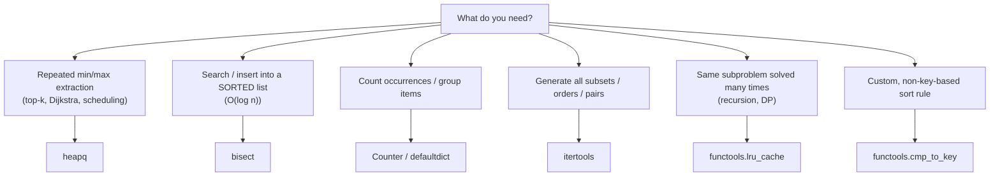

A huge chunk of "algorithm knowledge" in Python is really "know your stdlib".
Priority queues, binary search, combinatorics, memoization — they're all one
`import` away. This page is your toolbox: what each module gives you, and
when to reach for it.

## What you'll learn

- `collections`: `deque`, `Counter`, `defaultdict`, `OrderedDict`.
- `heapq`: a min-heap out of a plain list — push/pop, heapify, top-k.
- `bisect`: $O(\log n)$ search and sorted insertion on a sorted list.
- `itertools`: permutations, combinations, product, running totals.
- `functools`: `lru_cache` / `cache` for instant memoization, `cmp_to_key`
  for custom sort comparisons.
- `math`: `gcd`, `isqrt`, `comb`, `inf` — stop hand-rolling these.

## `collections` — beyond deque

You already met `deque` for O(1)-both-ends. Three more are everywhere in CP:

```python title="collections_tour.py" showLineNumbers{1}
from collections import Counter, defaultdict, OrderedDict

# Counter: frequency table in one call
freq = Counter("mississippi")
print("Counter:", freq)
print("2 most common:", freq.most_common(2))

# defaultdict: no more `if key not in d: d[key] = []`
groups = defaultdict(list)
for word in ["cat", "car", "dog", "do"]:
    groups[word[0]].append(word)
print("defaultdict:", dict(groups))

# OrderedDict: dict that remembers insertion order + supports move_to_end
# (plain dict has kept insertion order since 3.7, but OrderedDict adds
#  move_to_end/popitem(last=...) which is the backbone of an LRU cache)
od = OrderedDict()
od["a"] = 1
od["b"] = 2
od.move_to_end("a")
print("OrderedDict after move_to_end:", od)
```

`Counter` alone replaces a whole "build a frequency dict" pattern you'd
otherwise write by hand every time.

## `heapq` — a min-heap for free

Python has no built-in heap *type* — `heapq` turns an ordinary `list` into a
binary min-heap using module-level functions. The smallest element is always
at index `0`.

```python title="heapq_basics.py" showLineNumbers{1}
import heapq

heap = []
for x in [5, 1, 8, 3, 9, 2]:
    heapq.heappush(heap, x)   # O(log n)

print("smallest:", heap[0])          # O(1) — peek
print("pop order:", [heapq.heappop(heap) for _ in range(3)])   # O(log n) each

# heapify: turn an existing list into a heap in-place, O(n)
data = [7, 2, 9, 1, 5]
heapq.heapify(data)
print("heapified:", data)

# top-k without sorting the whole thing
nums = [4, 1, 7, 3, 8, 2, 9]
print("3 largest:", heapq.nlargest(3, nums))
print("3 smallest:", heapq.nsmallest(3, nums))
```

`heapq` is always a **min-heap**. Need a max-heap? Negate the values on the
way in and out:

```python title="heapq_max_heap.py" showLineNumbers{1}
import heapq

nums = [4, 1, 7, 3, 8]
max_heap = [-x for x in nums]
heapq.heapify(max_heap)

heapq.heappush(max_heap, -10)   # push -10 to represent "10"
largest = -heapq.heappop(max_heap)
print("largest via negation trick:", largest)
```

:::tip[Common CP pattern]
Top-k / "k-th largest so far" streaming problems: keep a min-heap of size
`k`. If a new value beats the heap's smallest (`heap[0]`), pop it and push the
new value — the heap always holds the current top `k` in $O(\log k)$ per step.
:::

## Visual intuition

`heapq` is the stdlib tool with the least obvious behaviour: the list it maintains is **not sorted**,
it only guarantees the smallest element sits at index 0. Watch what a push actually does:

<HeapView
  client:visible
  algo="sift-up"
  values={[9, 4, 7, 1, 8, 2]}
  title="heapq keeps a heap, not a sorted list"
  lib="heappush · O(log n)"
  desc="The array and the tree are the same object drawn two ways, and a push touches only one path from leaf to root -- not the whole array. That is why printing a heapq list looks unsorted and why heap[0] is the only element you may trust."
/>

## `bisect` — binary search on a sorted list

`bisect` gives you $O(\log n)$ search *and* $O(\log n)$-search sorted insertion
(the insertion itself is still $O(n)$ due to the shift, but finding *where*
to insert is fast).

```python title="bisect_basics.py" showLineNumbers{1}
import bisect

sorted_nums = [1, 3, 3, 5, 7, 9]

# bisect_left: leftmost valid insertion point (before existing equals)
print("bisect_left for 3: ", bisect.bisect_left(sorted_nums, 3))
# bisect_right: rightmost valid insertion point (after existing equals)
print("bisect_right for 3:", bisect.bisect_right(sorted_nums, 3))

# insort: insert while KEEPING the list sorted
bisect.insort(sorted_nums, 4)
print("after insort(4):", sorted_nums)

# classic use: is `target` present, in O(log n)?
target = 7
i = bisect.bisect_left(sorted_nums, target)
present = i < len(sorted_nums) and sorted_nums[i] == target
print("7 present?", present)
```

## `itertools` — combinatorics without the nested loops

```python title="itertools_tour.py" showLineNumbers{1}
from itertools import permutations, combinations, product, accumulate

items = ["A", "B", "C"]

print("permutations:", list(permutations(items, 2)))
print("combinations:", list(combinations(items, 2)))
print("product:     ", list(product([0, 1], repeat=2)))

# accumulate: running totals — perfect for prefix sums
nums = [1, 2, 3, 4, 5]
print("prefix sums:", list(accumulate(nums)))
```

Prefix sums via `accumulate` turn "sum of a range" queries from $O(n)$ each
into $O(1)$ each after one $O(n)$ pre-pass — a pattern you'll reuse constantly.

## `functools` — memoization and custom sorting

```python title="functools_tour.py" showLineNumbers{1}
from functools import lru_cache, cmp_to_key

# lru_cache: turns exponential naive recursion into linear, for free
@lru_cache(maxsize=None)
def fib(n):
    if n < 2:
        return n
    return fib(n - 1) + fib(n - 2)

print("fib(30):", fib(30))   # instant, thanks to memoization

# cmp_to_key: sort with a custom two-argument comparator
def by_length_then_alpha(a, b):
    if len(a) != len(b):
        return len(a) - len(b)
    return -1 if a < b else (1 if a > b else 0)

words = ["banana", "fig", "kiwi", "apple"]
print("custom sort:", sorted(words, key=cmp_to_key(by_length_then_alpha)))
```

:::note[cache vs lru_cache]
Python 3.9+ has `functools.cache`, a simpler unbounded shortcut for
`lru_cache(maxsize=None)`. Use whichever your judge's Python version supports
— `lru_cache(maxsize=None)` works everywhere.
:::

## `math` — stop hand-rolling these

```python title="math_tour.py" showLineNumbers{1}
import math

print("gcd(48, 18):", math.gcd(48, 18))
print("isqrt(50):  ", math.isqrt(50))    # exact integer sqrt, no float error
print("comb(10, 3):", math.comb(10, 3))  # n choose k
print("inf trick:  ", min(math.inf, 5, 3, math.inf))
```

`math.inf` (or `float("inf")`) is the standard "worse than anything" sentinel
for running minimums in shortest-path and DP code.

## Which tool for which job



## Dry run

### `bisect` is `lower_bound` and `upper_bound`

On `a = [1, 2, 2, 2, 5, 8]`:

| Target | `bisect_left` | `bisect_right` | `right - left` |
| --- | --- | --- | --- |
| **2** | **1** | **4** | **3** occurrences |
| 3 | 4 | 4 | 0 -- and 4 is where it would be inserted |
| 0 | 0 | 0 | 0 |
| 9 | 6 | 6 | 0 -- one past the end, a legal insertion point |

Three uses fall straight out: **insertion point** (`bisect_left`, which is LC 35), **count of a value**
(`right - left`), and **first/last occurrence** (`left`, and `right - 1`).

Note `bisect_right` on a missing value returns the same index as `bisect_left`, and both return a
*position*, never `-1`. Since 3.10 both accept `key=`, which removes the old trick of maintaining a
parallel list of keys.

**The trap**: `insort` is $O(n)$, not $O(\log n)$. The binary search finds the position in
$O(\log n)$ and then the insertion shifts the tail. It is still competitive well beyond where the
asymptotics suggest, because the shift is a fast memmove -- but a loop of `insort` calls is $O(n^2)$.

### `heapq` is min-only, and `heapify` is linear

| Operation | Cost |
| --- | --- |
| `heappush` / `heappop` | $O(\log n)$ |
| `heap[0]` (peek) | $O(1)$ |
| `heapify(list)` | **$O(n)$**, not $O(n \log n)$ |
| `nlargest(k, it)` / `nsmallest(k, it)` | $O(n \log k)$ |
| `merge(*iterables)` | lazy `k`-way merge, $O(k)$ memory |

**There is no max-heap.** Push `-value` and negate on the way out, or push tuples with a negated key.
A single missed negation gives plausible wrong answers rather than a crash, which is the thing to watch.

`heapify` being $O(n)$ is worth knowing precisely: it is the bottom-up sift-down build, where cost
tracks a node's *height* and most nodes are leaves. Measured on the [Heap Sort](../../phase-04-sorting-and-searching/heap-sort/)
page: 247 swaps at `n = 255` against an $n \log_2 n$ budget of 1,785. So `heapify(list(a))` beats `n`
individual pushes when you already hold the data.

### `Counter` and `defaultdict`, and where they differ

| Need | Tool | Why |
| --- | --- | --- |
| Count occurrences | `Counter(iterable)` | one pass, plus `most_common(k)` |
| Group into lists | `defaultdict(list)` | no `setdefault`, no key check |
| Accumulate sums | `defaultdict(int)` | `d[k] += v` just works |
| Adjacency list | `defaultdict(list)` | the standard graph idiom |

**`Counter` returns `0` for a missing key and does *not* insert it**; `defaultdict` **does** insert the
default on access. That difference matters when you iterate a `defaultdict` after probing it -- you
will find keys you only ever read. `Counter` also supports `+`, `-`, `&` and `|` as multiset
operations, which makes anagram and frequency comparisons one-liners.

### `itertools` and `functools`, the four that earn their keep

| Call | What it saves |
| --- | --- |
| `combinations(it, r)` / `permutations(it, r)` | hand-written nested loops or backtracking |
| `product(a, b)` / `product(r, repeat=n)` | nested loops of unknown depth -- base-`r` enumeration |
| `accumulate(it)` | a prefix-sum loop; takes an operator for prefix max, min, product |
| `groupby(it, key)` | grouping -- **but the input must already be sorted by that key** |
| `@lru_cache(maxsize=None)` / `@cache` | memoising a recursion in one line |
| `cmp_to_key(cmp)` | a genuinely pairwise ordering rule (LC 179) |

**`groupby` groups only *consecutive* equal keys** -- it never buffers or reorders. On unsorted input
that silently yields many fragmented groups, which is the commonest misuse of the module. Sort first,
or use a `defaultdict`.

## Practice

**Drill 1 — top-k with a heap.** Return the 2 largest values without sorting
the whole list.

<DataCampExercise
  lang="python"
  hint={`heapq.nlargest(k, iterable) returns the k largest values, more efficient than sorting the whole list when k is small.`}
  code={`# Task: get the 2 largest values from nums using heapq.
import heapq

nums = [5, 1, 9, 3, 7, 2]
top2 = heapq.___(2, nums)
print(top2)   # expect [9, 7]`}
  solution={`import heapq

nums = [5, 1, 9, 3, 7, 2]
top2 = heapq.nlargest(2, nums)
print(top2)`}
  sct={`test_output_contains("[9, 7]")
success_msg("heapq.nlargest — O(n log k) instead of a full O(n log n) sort.")`}
  height={175}
/>

**Drill 2 — sorted insert with bisect.** Keep a list sorted as you insert,
without re-sorting each time.

<DataCampExercise
  lang="python"
  hint={`bisect.insort(a_list, value) finds the correct spot with binary search and inserts in place, keeping the list sorted.`}
  code={`# Task: insert 4 into sorted_nums while keeping it sorted.
import bisect

sorted_nums = [1, 2, 3, 5, 6]
bisect.___(sorted_nums, 4)
print(sorted_nums)   # expect [1, 2, 3, 4, 5, 6]`}
  solution={`import bisect

sorted_nums = [1, 2, 3, 5, 6]
bisect.insort(sorted_nums, 4)
print(sorted_nums)`}
  sct={`test_output_contains("[1, 2, 3, 4, 5, 6]")
success_msg("bisect.insort finds the slot in O(log n), keeping order intact.")`}
  height={175}
/>

**Drill 3 — memoize recursion.** Speed up a naive recursive Fibonacci with
`lru_cache` so it doesn't re-solve the same subproblem millions of times.

<DataCampExercise
  lang="python"
  hint={`Decorate the function with @lru_cache(maxsize=None) directly above the def line.`}
  code={`# Task: memoize fib so repeated calls are instant.
from functools import lru_cache

___
def fib(n):
    if n < 2:
        return n
    return fib(n - 1) + fib(n - 2)

print(fib(25))   # expect 75025`}
  solution={`from functools import lru_cache

@lru_cache(maxsize=None)
def fib(n):
    if n < 2:
        return n
    return fib(n - 1) + fib(n - 2)

print(fib(25))`}
  sct={`test_output_contains("75025")
success_msg("Memoization turns O(2^n) recursion into O(n). Huge win, one decorator.")`}
  height={185}
/>

## Complexity

| Tool | Operation | Cost |
| --- | --- | --- |
| `deque` | append / appendleft / pop / popleft | $O(1)$ |
| `deque` | index in the middle | $O(n)$ |
| `Counter` | build from `n` items | $O(n)$ |
| `Counter.most_common(k)` | -- | $O(n \log k)$ |
| `defaultdict` | access | $O(1)$ avg, **inserts the default** |
| `heapq.heappush` / `heappop` | -- | $O(\log n)$ |
| `heapq.heapify` | -- | **$O(n)$** |
| `heapq.nlargest(k, …)` | -- | $O(n \log k)$ |
| `bisect.bisect_*` | -- | $O(\log n)$ |
| `bisect.insort` | -- | **$O(n)$** -- the shift dominates |
| `itertools.accumulate` | -- | $O(n)$, lazy |
| `itertools.combinations(n, r)` | -- | $O(\binom{n}{r} \cdot r)$ |
| `itertools.permutations(n)` | -- | $O(n! \cdot n)$ |
| `@lru_cache` | per hit | $O(1)$ avg, $O(\text{distinct args})$ space |
| `math.gcd` / `math.isqrt` / `math.comb` | -- | fast C, exact integers |

**Three bounds people get wrong here:**

- **`heapify` is $O(n)$, not $O(n \log n)$** -- bottom-up sift-down, and most nodes are leaves.
- **`insort` is $O(n)$, not $O(\log n)$** -- the search is logarithmic, the insertion is not.
- **`most_common(k)` is $O(n \log k)$**, but `most_common()` with no argument sorts everything at
  $O(n \log n)$. Passing `k` matters.

## Pitfalls

- **Expecting a max-heap from `heapq`.** There is none. Negate on the way in *and* out, or push
  `(-key, value)` tuples. One missed negation gives plausible wrong answers, not a crash.
- **`bisect.insort` in a loop.** $O(n)$ per insert, so $O(n^2)$ overall. Use it for occasional
  inserts; for many, collect and sort once, or reach for `sortedcontainers.SortedList`.
- **`groupby` on unsorted input.** It groups only *consecutive* equal keys, so you get many fragmented
  groups and no error. Sort by the same key first, or use `defaultdict(list)`.
- **`defaultdict` inserting keys you only read.** `d[missing]` creates the entry. If you then iterate
  `d`, you will find keys you never intended to add -- use `Counter` (returns `0` without inserting) or
  `d.get(k, default)` when probing.
- **A mutable default in `defaultdict` vs `dict.fromkeys`.** `dict.fromkeys(keys, [])` shares **one**
  list across every key -- the same aliasing bug as `[[0]*m]*n`. `defaultdict(list)` creates a fresh
  one per key.
- **`@lru_cache` on unhashable arguments.** A list argument raises `TypeError` -- convert to a tuple.
  And anything the function reads from *outside* its arguments is invisible to the key, so cached
  results go stale silently. `cache_clear()` exists for that.
- **`@lru_cache(maxsize=None)` as an unbounded cache.** It holds references to every distinct argument
  forever -- fine for a single run, a leak in a long-lived process.
- **`Counter` arithmetic dropping non-positive counts.** `a - b` keeps only positive results, so it is
  multiset difference, not element-wise subtraction. Use `subtract()` for the in-place, sign-preserving
  version.
- **`math.sqrt` for integer work.** It returns a float and loses precision on large values, and the
  error goes *upward*: `int(math.sqrt(999999999999999999))` is `1000000000`, one more than the true
  `999999999`. `isqrt` is exact. Same reasoning as preferring `//` over `int(a / b)`.
- **`itertools.product(..., repeat=n)` on a large `n`.** It is lazy, so it will not blow memory -- but
  it will happily iterate $r^n$ items forever. The laziness hides the cost.

## Interview follow-ups

| They ask | What they're checking | The answer |
| --- | --- | --- |
| "How do you get a max-heap in Python?" | `heapq` fluency | You do not -- negate the values on the way in and out, or push `(-key, value)`. `heapq` is min-only, and a missed negation produces plausible wrong answers rather than an error |
| "What is the complexity of `heapify`?" | The classic | **$O(n)$**, not $O(n \log n)$ -- bottom-up sift-down, where cost tracks a node's height and most nodes are leaves. So `heapify(list(a))` beats `n` pushes when you already hold the data |
| "`bisect_left` or `bisect_right`?" | Which is which | `bisect_left` is `lower_bound` -- the insertion point and the first occurrence. `bisect_right` is `upper_bound`; `right - left` is the count. On `[1,2,2,2,5,8]` and target 2 that is 1, 4 and 3 |
| "Is `insort` $O(\log n)$?" | The trap | No -- $O(n)$. The search is logarithmic; the insertion shifts the tail. Competitive well past where the asymptotics suggest because the shift is a memmove, but a loop of inserts is $O(n^2)$ |
| "`Counter` or `defaultdict(int)`?" | The behavioural difference | `Counter` returns `0` for a missing key **without inserting it** and adds `most_common` plus multiset operators. `defaultdict` inserts the default on access -- which matters if you iterate it after probing |
| "Why did `groupby` give me fragmented groups?" | The precondition | It groups only *consecutive* equal keys and never reorders. Sort by the same key first, or use `defaultdict(list)` if you do not need sorted order |
| "What does `@lru_cache` key on?" | The gotchas | The argument tuple -- so arguments must be hashable, and anything read from outside the arguments is invisible to the key and will serve stale results. `cache_clear()` when that state changes |
| "Generate all subsets" | Idiom versus hand-rolling | `chain.from_iterable(combinations(s, r) for r in range(len(s)+1))`, or bitmask enumeration with `1 << k`. Both $O(2^n \cdot n)$; the bitmask version is easier to adapt when you need the mask itself |
| "Prefix sums in one line" | `itertools` awareness | `list(accumulate(a))`, and it takes an operator -- `accumulate(a, max)` for a running maximum. It is lazy, so wrap in `list` only if you need to index it |
| "Which `math` functions replace hand-rolled code?" | Breadth | `gcd`, `lcm`, `isqrt` (exact, unlike `sqrt`), `comb`, `perm`, `factorial`, `inf`. `isqrt` matters most -- float `sqrt` loses precision on large integers |

## Self-check

<Quiz
  questions={[
    {
      q: "What is the complexity of `heapq.heapify`?",
      options: [
        "O(n log n) -- it is n insertions",
        "O(n) -- bottom-up sift-down, where cost tracks a node's height and most nodes are leaves",
        "O(log n)",
        "O(n^2) in the worst case",
      ],
      answer: 1,
      explain:
        "Sifting *down* from the last internal node puts the expensive work on the few nodes near the root; the many leaves cost nothing. Measured on the Heap Sort page: 247 swaps at n = 255 against an n log2 n budget of 1,785. This is why heapify(list(a)) beats n individual heappush calls when you already have the data -- pushing sifts *up*, which inverts the shape.",
    },
    {
      q: "How do you get a max-heap from `heapq`?",
      options: [
        "Pass reverse=True to heapify",
        "You cannot -- negate the values on the way in and out, or push (-key, value) tuples",
        "Use heapq.maxheapify",
        "Use a deque instead",
      ],
      answer: 1,
      explain:
        "heapq is min-only and offers no reverse option. The negation trick is standard, and the risk is that a single missed negation produces plausible-looking wrong answers rather than an exception -- so it is worth writing the negation on both sides in one go rather than adding it later.",
    },
    {
      q: "On [1,2,2,2,5,8], what do bisect_left(a, 2) and bisect_right(a, 2) return, and what is the difference used for?",
      options: [
        "2 and 3; the difference is the midpoint",
        "1 and 4; the difference (3) is the count of occurrences",
        "1 and 3; the difference is the insertion point",
        "0 and 4; the difference is the array length",
      ],
      answer: 1,
      explain:
        "bisect_left is lower_bound and bisect_right is upper_bound, so left gives the first occurrence, right - 1 gives the last, and right - left gives the count. All three uses come from those two calls. Note both return a position rather than -1 for a missing value -- bisect_left(a, 3) is 4, which is exactly where 3 would be inserted.",
    },
    {
      q: "Is `bisect.insort` O(log n)?",
      options: [
        "Yes -- it is a binary search",
        "No -- O(n). The search is logarithmic but the insertion shifts the tail, so a loop of inserts is O(n^2)",
        "Yes, for lists under 1000 elements",
        "No -- it is O(n log n)",
      ],
      answer: 1,
      explain:
        "Only the locating half is logarithmic. Because the shift is a fast memmove, insort stays competitive far beyond where the asymptotics suggest -- which is why it is a fine choice for occasional insertions. For many insertions, collect and sort once, or use sortedcontainers.SortedList.",
    },
    {
      q: "`itertools.groupby` returns many small fragmented groups on your data. Why?",
      options: [
        "The key function returns unhashable values",
        "groupby groups only CONSECUTIVE equal keys and never reorders -- so the input must already be sorted by that key",
        "You forgot to wrap it in list()",
        "groupby requires a list rather than an iterator",
      ],
      answer: 1,
      explain:
        "It is a streaming operation that cuts the sequence wherever the key changes, so it buffers nothing and reorders nothing. On unsorted input that yields one group per run of equal keys, usually many tiny ones, and it raises no error at all. Sort by the same key first, or use defaultdict(list) if you do not need the ordering.",
    },
    {
      q: "What is the difference between `Counter` and `defaultdict(int)` when you read a missing key?",
      options: [
        "There is none",
        "Counter returns 0 WITHOUT inserting the key; defaultdict inserts the default -- which matters if you iterate it after probing",
        "Counter raises KeyError",
        "defaultdict returns None",
      ],
      answer: 1,
      explain:
        "The insertion side effect is the practical difference. Probe a defaultdict for keys that turn out to be absent and you have silently added them, so a later iteration over the dict finds entries you never meant to create. Counter also adds most_common and the multiset operators + - & |, which make frequency comparisons one-liners.",
    },
    {
      q: "`dict.fromkeys(keys, [])` -- what is wrong with it?",
      options: [
        "Nothing; it is the idiomatic way to initialise",
        "Every key shares ONE list object -- the same aliasing bug as [[0]*m]*n. Use defaultdict(list) for a fresh list per key",
        "It raises TypeError for mutable defaults",
        "It only works for string keys",
      ],
      answer: 1,
      explain:
        "The default value is evaluated once and the same reference is stored under every key, so appending via one key appends for all of them. It is the identical failure to the 2D grid bug and just as silent. defaultdict(list) calls the factory per missing key, which is what you want.",
    },
    {
      q: "Why prefer `math.isqrt(n)` over `int(math.sqrt(n))`?",
      options: [
        "isqrt is faster",
        "sqrt returns a float and loses precision on large integers, so int(sqrt(n)) can be off by one; isqrt is exact",
        "sqrt raises on perfect squares",
        "isqrt handles negative inputs",
      ],
      answer: 1,
      explain:
        "Doubles carry about 53 bits of mantissa, so on large integers the float result is not exact and truncating it lands on the wrong integer. Measured: int(math.sqrt(999999999999999999)) gives 1000000000 where isqrt gives the correct 999999999, and 4503599761588224 is exactly 67108864 squared yet int(sqrt) returns 67108865. Both err *upward*, which is what breaks a perfect-square test or a primality loop bounded by sqrt(n). isqrt works in integers throughout.",
    },
  ]}
/>

## Recall card

- **`deque`** -- $O(1)$ at both ends, $O(n)$ in the middle. Every queue and sliding window.
- **`Counter`** for counting; returns `0` for a missing key **without inserting**. `most_common(k)` is
  $O(n \log k)$; bare `most_common()` sorts everything.
- **`defaultdict`** *inserts* the default on access -- so probing adds keys. `defaultdict(list)` for
  adjacency lists and grouping.
- **`dict.fromkeys(keys, [])` shares one list** -- the `[[0]*m]*n` bug again. Use `defaultdict(list)`.
- **`heapq` is min-only** -- negate in and out. **`heapify` is $O(n)$** (bottom-up sift-down);
  `nlargest(k, …)` is $O(n \log k)$; `merge` is a lazy `k`-way merge.
- **`bisect_left` = `lower_bound`, `bisect_right` = `upper_bound`.** Count = `right - left`. Both take
  `key=` from 3.10. **`insort` is $O(n)$**, not $O(\log n)$.
- **`groupby` needs pre-sorted input** -- it groups only consecutive equal keys, silently.
- **`accumulate`** for prefix sums, and it takes an operator (`max` for a running maximum).
- **`@lru_cache` keys on the argument tuple** -- hashable only, and anything captured from outside is
  invisible, so `cache_clear()` when it changes.
- **`math.isqrt` is exact; `int(math.sqrt(n))` overshoots by one** on large integers -- measured at
  `10^18 - 1` and at `67108864^2`. Also `gcd`,
  `lcm`, `comb`, `perm`.

## Recap

- `collections`: `Counter` for frequencies, `defaultdict` to skip existence
  checks, `deque`/`OrderedDict` for order-aware structures.
- `heapq`: min-heap on a plain list; negate values for a max-heap.
- `bisect`: $O(\log n)$ search and sorted-insert point on a sorted list.
- `itertools`: permutations/combinations/product for brute force, `accumulate`
  for prefix sums.
- `functools.lru_cache` turns exponential recursion into linear; `cmp_to_key`
  handles custom comparators.
- `math.gcd`/`isqrt`/`comb`/`inf` — small utilities, always faster and safer
  than hand-rolled versions.

Next: **Fast I/O and Beating TLE** — reading and writing at contest speed.
