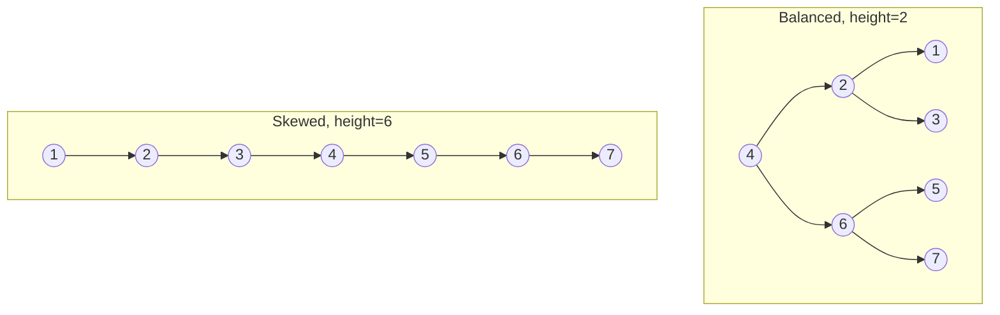
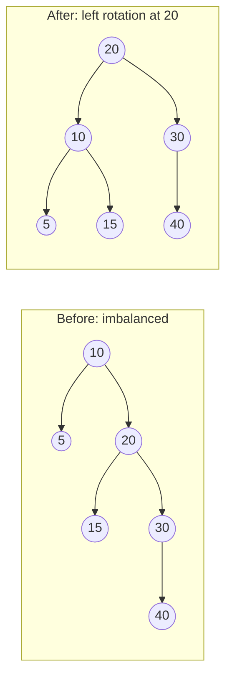

The BST from the last lesson promised $O(\log n)$ search and insert — but
that promise has fine print: **only if the tree is balanced**. Insert already
sorted data and a BST silently turns into a linked list.

## What you'll learn

- Why a **skewed** BST loses its $O(\log n)$ guarantee entirely.
- **AVL trees**: the height-balance rule and how rotations restore it.
- **Red-Black trees**: coloring rules that give a looser, cheaper-to-maintain
  balance guarantee.
- The practical reality: **Python has no built-in balanced BST** — what to
  reach for instead (`bisect`, `sortedcontainers.SortedList`).

## The cue

:::tip[Why balancing exists at all]
A plain BST gives $O(h)$ operations, and $h$ can be $n$. Insert `1, 2, 3, …, n`
in order and you have built a linked list with extra pointers — every operation
degrades to $O(n)$, and the structure is *worse* than an array.

A balanced tree adds rotations on insert and delete to keep $h = O(\log n)$,
which converts that worst case into a guarantee.

**What you actually need to know for an interview:** that the problem exists,
that rotations are the fix, roughly what AVL and red-black trees trade off, and
when a balanced tree beats a hash map. **You will almost never be asked to
implement one** — say so, and say you would use a library. Being able to reason
about *when* to reach for one is what is being tested.
:::

## Why balance matters

A BST's height determines its speed. Insert values in sorted order and every
new node becomes the rightmost node's only child — you get a chain, not a
tree:

```python title="skewed_bst.py" showLineNumbers{1}
class TreeNode:
    def __init__(self, val, left=None, right=None):
        self.val = val
        self.left = left
        self.right = right


def bst_insert(root, val):
    if root is None:
        return TreeNode(val)
    if val < root.val:
        root.left = bst_insert(root.left, val)
    else:
        root.right = bst_insert(root.right, val)
    return root


def height(node):
    if node is None:
        return -1
    return 1 + max(height(node.left), height(node.right))


# Insert already-sorted data: worst case for a plain BST
root = None
for v in [1, 2, 3, 4, 5, 6, 7]:
    root = bst_insert(root, v)

print("nodes: 7, height:", height(root))   # height 6 -- a straight line, not a tree!
```



Both trees hold the same 7 values. The balanced one answers "is 7 present?"
in 3 comparisons; the skewed one needs 7 — it's just a linked list wearing a
tree costume. **Self-balancing trees exist to prevent exactly this.**

## AVL trees: strict height balance

An **AVL tree** enforces a simple invariant at *every* node: the heights of
its left and right subtrees can differ by at most `1`.

$$
|\text{height(left)} - \text{height(right)}| \le 1
$$

Whenever an insert or delete breaks that invariant, the tree fixes itself
with a **rotation** — a local restructuring that restores balance in $O(1)$
without changing the sorted (inorder) order of the values.



Before: node `20`'s right subtree (rooted at `30`) is taller than its left
(`15`), so `20` becomes right-heavy. A **left rotation** promotes `20`'s
right child (`30`)... conceptually — in this small example the rotation
re-centers the tree around `20` so both subtrees end up height-balanced
again, without breaking the BST ordering. There are four rotation cases in
total (left-left, right-right, left-right, right-left), but they all boil
down to the same idea: **re-parent a few pointers, keep the sort order,
restore the height rule.**

Because AVL rebalances aggressively, it guarantees $O(\log n)$ height at all
times — the tightest balance guarantee of the common self-balancing trees,
at the cost of more rotations on insert/delete-heavy workloads.

## Red-Black trees: looser balance, cheaper to maintain

A **Red-Black tree** relaxes AVL's strict rule and instead colors every node
**red** or **black**, enforcing:

1. The root is always black.
2. A red node never has a red child (no two reds in a row on any path).
3. Every path from a node to its descendant `None` leaves passes through the
   **same number** of black nodes.

These rules don't force perfect height-balance like AVL does, but they
guarantee the longest root-to-leaf path is never more than **2x** the
shortest one — still $O(\log n)$ height, just with fewer rotations needed on
average. That trade-off (looser balance, cheaper maintenance) is why
Red-Black trees back most language standard libraries: C++'s `std::map` /
`std::set`, Java's `TreeMap`, and the Linux kernel's scheduler.

:::note[AVL vs Red-Black, the practical difference]
AVL trees are more strictly balanced → **faster lookups**, but more rotation
overhead on writes. Red-Black trees are less strictly balanced → **faster
inserts/deletes**, slightly slower lookups. Read-heavy workload → lean AVL.
Write-heavy workload → lean Red-Black. In interviews, you're expected to know
*that* these exist and *why* they matter, not to hand-implement rotation
logic from scratch.
:::

## The Python reality: no built-in balanced BST

Unlike C++ or Java, **Python's standard library ships no self-balancing
tree.** `dict` and `set` are hash tables ($O(1)$ average, but no ordering).
For competitive programming and interviews, you have two practical
substitutes:

1. **`bisect` on a plain sorted list** — no extra dependency, $O(\log n)$
   search, $O(n)$ insert (due to shifting), fine for small/medium `n`.
2. **`sortedcontainers.SortedList`** — a third-party package (allowed on
   most judges and installable via `pip`) implemented as a list of small
   sorted blocks, giving $O(\log n)$ search **and** $O(\sqrt{n})$-ish
   amortized insert/delete in practice — close to a real balanced tree's
   behavior, usable from pure Python.

```python title="ordered_structure_demo.py" showLineNumbers{1}
import bisect

# Maintain an always-sorted list using bisect -- Python's go-to
# "ordered set" substitute when a full balanced tree is overkill.
ordered = []
for value in [50, 20, 70, 10, 60, 30]:
    bisect.insort(ordered, value)
    print(f"after inserting {value}:", ordered)

target = 30
idx = bisect.bisect_left(ordered, target)
found = idx < len(ordered) and ordered[idx] == target
print("30 present?", found, "at sorted index", idx)

# rank of a value == how many elements are strictly smaller -- O(log n) to find
rank = bisect.bisect_left(ordered, 60)
print("elements smaller than 60:", rank)
```

:::tip[When you actually need a real balanced tree]
Reach for `sortedcontainers.SortedList` (or accept $O(n)$ inserts with
`bisect`) when a problem needs **all** of: sorted order, $O(\log n)$
search, AND frequent inserts/deletes into the middle — e.g. "find the k-th
smallest element seen so far" streaming problems, interval scheduling with
dynamic add/remove, or order-statistics queries. If you only need
membership/lookup with no ordering, a plain `set`/`dict` is faster and
simpler.
:::

## Complexity at a glance

| Structure | Search | Insert | Delete | Notes |
| --- | --- | --- | --- | --- |
| Unbalanced BST | $O(\log n)$ avg, $O(n)$ worst | same | same | degrades on sorted input |
| AVL tree | $O(\log n)$ | $O(\log n)$ | $O(\log n)$ | strictest balance, more rotations |
| Red-Black tree | $O(\log n)$ | $O(\log n)$ | $O(\log n)$ | looser balance, fewer rotations |
| `bisect` on a list | $O(\log n)$ | $O(n)$ | $O(n)$ | no dependency, fine for small `n` |
| `sortedcontainers.SortedList` | $O(\log n)$ | $O(\log n)$ amortized | $O(\log n)$ amortized | closest pure-Python analogue |

## Where this shows up in contests

You rarely implement AVL/Red-Black rotations yourself in a contest — instead
you recognize the **need** for an ordered, dynamically-updated set and reach
for `SortedList` (or `bisect`, or a Fenwick tree / segment tree, covered
later). Watch for phrasing like "maintain the k smallest values seen so far,"
"process queries online," or "find the number of elements less than x after
each update" — all signals that a balanced-tree-like structure is the
intended tool.

## Visual intuition

The degenerate case, made concrete. This is a valid BST built from sorted input:

<TreeWalker
  client:visible
  algo="inorder"
  tree={[1, null, 2, null, 3, null, 4, null, 5]}
  title="A valid BST that is really a linked list"
  lib="h = n, so every operation is O(n)"
  desc="In-order traversal still produces sorted output, so the BST invariant holds perfectly. The structure is simply useless: searching for 5 visits every node. Rotations exist to prevent exactly this shape, and this is the picture to have in mind when you say O(h) rather than O(log n)."
/>

## Practice -- real LeetCode problems

Problems from the database that exercise this material. Progress is saved
in this browser.

<ProblemLadder pattern="balanced-trees-overview" />


Each exercise is the actual LeetCode problem with its real method signature and
LeetCode's own examples as the test. Write the body, press **Run**, and match the
expected output.

### LC 110 -- Balanced Binary Tree · Easy

**Problem.** Return `True` if the tree is height-balanced -- every node's two
subtrees differ in height by at most one.

**Constraints.** `0 <= number of nodes <= 5000`.

**Examples.** `[3,9,20,null,null,15,7]` gives `True` ·
`[1,2,2,3,3,null,null,4,4]` gives `False` · `[]` gives `True`

<DataCampExercise
  lang="python"
  hint={`The naive version computes height separately at each node, which recomputes work and is O(n^2). Instead have one recursion return the height AND signal failure with a sentinel of -1: if either subtree returns -1, or the heights differ by more than one, return -1 immediately. The answer is whether the root returned something other than -1.`}
  code={`from collections import deque


class TreeNode:
    def __init__(self, val=0, left=None, right=None):
        self.val, self.left, self.right = val, left, right


def build(vals):
    if not vals or vals[0] is None:
        return None
    root = TreeNode(vals[0]); q, i = deque([root]), 1
    while q and i < len(vals):
        node = q.popleft()
        if i < len(vals) and vals[i] is not None:
            node.left = TreeNode(vals[i]); q.append(node.left)
        i += 1
        if i < len(vals) and vals[i] is not None:
            node.right = TreeNode(vals[i]); q.append(node.right)
        i += 1
    return root


def level_order(root):
    if not root:
        return []
    out, q = [], deque([root])
    while q:
        n = q.popleft()
        if n:
            out.append(n.val); q.append(n.left); q.append(n.right)
        else:
            out.append(None)
    while out and out[-1] is None:
        out.pop()
    return out


def inorder(root):
    return [] if not root else inorder(root.left) + [root.val] + inorder(root.right)


def height(root):
    return 0 if not root else 1 + max(height(root.left), height(root.right))


class Solution:
    def isBalanced(self, root):
        # TODO: O(n), not O(n^2). One recursion returning the height,
        # using -1 as a sentinel meaning "already unbalanced below".
        pass


sol = Solution()
cases = [[3, 9, 20, None, None, 15, 7], [1, 2, 2, 3, 3, None, None, 4, 4],
         [], [1, 2]]
print([sol.isBalanced(build(t)) for t in cases])
# expect [True, False, True, True]`}
  solution={`from collections import deque


class TreeNode:
    def __init__(self, val=0, left=None, right=None):
        self.val, self.left, self.right = val, left, right


def build(vals):
    if not vals or vals[0] is None:
        return None
    root = TreeNode(vals[0]); q, i = deque([root]), 1
    while q and i < len(vals):
        node = q.popleft()
        if i < len(vals) and vals[i] is not None:
            node.left = TreeNode(vals[i]); q.append(node.left)
        i += 1
        if i < len(vals) and vals[i] is not None:
            node.right = TreeNode(vals[i]); q.append(node.right)
        i += 1
    return root


def level_order(root):
    if not root:
        return []
    out, q = [], deque([root])
    while q:
        n = q.popleft()
        if n:
            out.append(n.val); q.append(n.left); q.append(n.right)
        else:
            out.append(None)
    while out and out[-1] is None:
        out.pop()
    return out


def inorder(root):
    return [] if not root else inorder(root.left) + [root.val] + inorder(root.right)


def height(root):
    return 0 if not root else 1 + max(height(root.left), height(root.right))


class Solution:
    def isBalanced(self, root):
        def check(node):
            # return the height, or -1 once imbalance is found anywhere below
            if not node:
                return 0
            lh = check(node.left)
            if lh == -1:
                return -1                      # propagate failure immediately
            rh = check(node.right)
            if rh == -1:
                return -1
            if abs(lh - rh) > 1:
                return -1                      # imbalance found here
            return 1 + max(lh, rh)

        return check(root) != -1


sol = Solution()
cases = [[3, 9, 20, None, None, 15, 7], [1, 2, 2, 3, 3, None, None, 4, 4],
         [], [1, 2]]
print([sol.isBalanced(build(t)) for t in cases])`}
  sct={`test_output_contains("[True, False, True, True]")
success_msg("One traversal carrying both the height and a failure flag -- O(n) instead of O(n^2).")
`}
  height={400}
/>

<details>
<summary>Editorial</summary>

Balance must hold at **every** node, not just the root. The obvious solution calls a
`height` helper at each node, recomputing the same subtree heights repeatedly --
$O(n^2)$ on a skewed tree.

Threading the answer through a single traversal fixes it: the recursion returns the
height when balanced, and `-1` to mean "something below is already unbalanced".

**Time** $O(n)$. **Space** $O(h)$.

The early propagation matters for more than speed: checking `lh == -1` before even
computing `rh` short-circuits whole subtrees once failure is known.

`[1,2,2,3,3,null,null,4,4]` is the failing case -- the left subtree reaches depth 4
while the right stops at 2, so the root's children differ by more than one.

This is the same "**return one thing, signal another**" idea as the split-brain
trick in [Tree DFS](../../phase-09-patterns-trees/tree-dfs-paths-and-sums/).

**Follow-ups:** "Return the height as well?" -- it is already computed. "Balance an
unbalanced BST (LC 1382)?" -- below. "How do AVL trees maintain this invariant?" --
rotations on insert and delete, keeping a balance factor per node. "Why $O(n^2)$
naively?" -- be ready to describe the repeated height computations.

</details>

### LC 108 -- Convert Sorted Array to Binary Search Tree · Easy

**Problem.** Given a sorted array of unique integers, build a **height-balanced**
BST.

**Constraints.** `1 <= len(nums) <= 10^4`, strictly increasing.

**Examples.** `[-10,-3,0,5,9]` gives a balanced BST of height 3 ·
`[1,3]` gives height 2

:::note[Why this test checks properties, not a fixed tree]
Several balanced trees are valid for the same input, so the test verifies the two
things that actually matter: the **in-order traversal equals the sorted input**
(so it really is a BST holding those values), and the **height is minimal**.
:::

<DataCampExercise
  lang="python"
  hint={`Take the middle element as the root -- that splits the remaining values into two halves of nearly equal size, which is exactly what balance means. Then recurse on each half. Pass index bounds rather than slicing, so you avoid copying the array at every level.`}
  code={`from collections import deque


class TreeNode:
    def __init__(self, val=0, left=None, right=None):
        self.val, self.left, self.right = val, left, right


def build(vals):
    if not vals or vals[0] is None:
        return None
    root = TreeNode(vals[0]); q, i = deque([root]), 1
    while q and i < len(vals):
        node = q.popleft()
        if i < len(vals) and vals[i] is not None:
            node.left = TreeNode(vals[i]); q.append(node.left)
        i += 1
        if i < len(vals) and vals[i] is not None:
            node.right = TreeNode(vals[i]); q.append(node.right)
        i += 1
    return root


def level_order(root):
    if not root:
        return []
    out, q = [], deque([root])
    while q:
        n = q.popleft()
        if n:
            out.append(n.val); q.append(n.left); q.append(n.right)
        else:
            out.append(None)
    while out and out[-1] is None:
        out.pop()
    return out


def inorder(root):
    return [] if not root else inorder(root.left) + [root.val] + inorder(root.right)


def height(root):
    return 0 if not root else 1 + max(height(root.left), height(root.right))


class Solution:
    def sortedArrayToBST(self, nums):
        # TODO: the MIDDLE element becomes the root; recurse on both halves.
        # Pass index bounds rather than slicing.
        pass


sol = Solution()
out = []
for nums in ([-10, -3, 0, 5, 9], [1, 3], [1], [1, 2, 3, 4, 5, 6, 7]):
    root = sol.sortedArrayToBST(nums)
    out.append((inorder(root) == sorted(nums), height(root)))
print(out)
# expect [(True, 3), (True, 2), (True, 1), (True, 3)]`}
  solution={`from collections import deque


class TreeNode:
    def __init__(self, val=0, left=None, right=None):
        self.val, self.left, self.right = val, left, right


def build(vals):
    if not vals or vals[0] is None:
        return None
    root = TreeNode(vals[0]); q, i = deque([root]), 1
    while q and i < len(vals):
        node = q.popleft()
        if i < len(vals) and vals[i] is not None:
            node.left = TreeNode(vals[i]); q.append(node.left)
        i += 1
        if i < len(vals) and vals[i] is not None:
            node.right = TreeNode(vals[i]); q.append(node.right)
        i += 1
    return root


def level_order(root):
    if not root:
        return []
    out, q = [], deque([root])
    while q:
        n = q.popleft()
        if n:
            out.append(n.val); q.append(n.left); q.append(n.right)
        else:
            out.append(None)
    while out and out[-1] is None:
        out.pop()
    return out


def inorder(root):
    return [] if not root else inorder(root.left) + [root.val] + inorder(root.right)


def height(root):
    return 0 if not root else 1 + max(height(root.left), height(root.right))


class Solution:
    def sortedArrayToBST(self, nums):
        def build_bst(lo, hi):
            if lo > hi:
                return None
            mid = (lo + hi) // 2            # middle -> balanced by construction
            node = TreeNode(nums[mid])
            node.left = build_bst(lo, mid - 1)
            node.right = build_bst(mid + 1, hi)
            return node

        return build_bst(0, len(nums) - 1)


sol = Solution()
out = []
for nums in ([-10, -3, 0, 5, 9], [1, 3], [1], [1, 2, 3, 4, 5, 6, 7]):
    root = sol.sortedArrayToBST(nums)
    out.append((inorder(root) == sorted(nums), height(root)))
print(out)`}
  sct={`test_output_contains("[(True, 3), (True, 2), (True, 1), (True, 3)]")
success_msg("Choosing the middle gives balance for free -- no rotations needed.")
`}
  height={390}
/>

<details>
<summary>Editorial</summary>

Choosing the middle element as the root splits the remaining values into halves
differing in size by at most one. Applying that recursively makes every subtree
balanced, so no rotations are ever required.

**Time** $O(n)$ -- each element becomes a node exactly once. **Space** $O(\log n)$
recursion.

Passing **bounds** rather than slices is the detail worth getting right. Slicing
`nums[:mid]` copies at every level, adding $O(n \log n)$ time and space for no
benefit.

The resulting height is $\lceil \log_2(n+1) \rceil$, which is minimal -- `[1..7]`
gives height 3, and 7 nodes cannot be arranged in fewer levels.

Because the in-order traversal of the result is the original array, this is the
inverse of the observation that a BST's in-order walk is sorted -- see
[BST Patterns](../../phase-09-patterns-trees/bst-patterns/).

**Follow-ups:** "From a sorted *linked list* (LC 109)?" -- no random access, so
either copy to an array or use the in-order simulation that builds bottom-up while
walking the list once. "Rebalance an existing BST (LC 1382)?" -- next problem.
"Why is the middle optimal?" -- any other split makes one side larger and increases
the height.

</details>

### LC 1382 -- Balance a Binary Search Tree · Medium

**Problem.** Given a BST, return a **balanced** BST containing the same values.

**Constraints.** `1 <= number of nodes <= 10^4`, `1 <= Node.val <= 10^5`, values
unique.

**Examples.** A right-leaning chain `[1,null,2,null,3,null,4]` becomes a balanced
tree of height 3

:::note[Why this test checks properties]
As with LC 108, many balanced trees are valid. The test checks the in-order values
and the height.
:::

<DataCampExercise
  lang="python"
  hint={`Two steps, and the first one does the real work: an in-order traversal of a BST yields its values in SORTED order. Once you have that sorted list, this is exactly LC 108 -- take the middle as the root and recurse. Do not attempt rotations.`}
  code={`from collections import deque


class TreeNode:
    def __init__(self, val=0, left=None, right=None):
        self.val, self.left, self.right = val, left, right


def build(vals):
    if not vals or vals[0] is None:
        return None
    root = TreeNode(vals[0]); q, i = deque([root]), 1
    while q and i < len(vals):
        node = q.popleft()
        if i < len(vals) and vals[i] is not None:
            node.left = TreeNode(vals[i]); q.append(node.left)
        i += 1
        if i < len(vals) and vals[i] is not None:
            node.right = TreeNode(vals[i]); q.append(node.right)
        i += 1
    return root


def level_order(root):
    if not root:
        return []
    out, q = [], deque([root])
    while q:
        n = q.popleft()
        if n:
            out.append(n.val); q.append(n.left); q.append(n.right)
        else:
            out.append(None)
    while out and out[-1] is None:
        out.pop()
    return out


def inorder(root):
    return [] if not root else inorder(root.left) + [root.val] + inorder(root.right)


def height(root):
    return 0 if not root else 1 + max(height(root.left), height(root.right))


class Solution:
    def balanceBST(self, root):
        # TODO: two steps.
        # 1) in-order traversal gives the values already SORTED
        # 2) rebuild from the middle outward, as in LC 108
        pass


sol = Solution()
out = []
for t in ([1, None, 2, None, 3, None, 4], [2, 1, 3], [1]):
    root = sol.balanceBST(build(t))
    out.append((inorder(root), height(root)))
print(out)
# expect [([1, 2, 3, 4], 3), ([1, 2, 3], 2), ([1], 1)]`}
  solution={`from collections import deque


class TreeNode:
    def __init__(self, val=0, left=None, right=None):
        self.val, self.left, self.right = val, left, right


def build(vals):
    if not vals or vals[0] is None:
        return None
    root = TreeNode(vals[0]); q, i = deque([root]), 1
    while q and i < len(vals):
        node = q.popleft()
        if i < len(vals) and vals[i] is not None:
            node.left = TreeNode(vals[i]); q.append(node.left)
        i += 1
        if i < len(vals) and vals[i] is not None:
            node.right = TreeNode(vals[i]); q.append(node.right)
        i += 1
    return root


def level_order(root):
    if not root:
        return []
    out, q = [], deque([root])
    while q:
        n = q.popleft()
        if n:
            out.append(n.val); q.append(n.left); q.append(n.right)
        else:
            out.append(None)
    while out and out[-1] is None:
        out.pop()
    return out


def inorder(root):
    return [] if not root else inorder(root.left) + [root.val] + inorder(root.right)


def height(root):
    return 0 if not root else 1 + max(height(root.left), height(root.right))


class Solution:
    def balanceBST(self, root):
        values = inorder(root)            # a BST in-order walk is SORTED

        def build_bst(lo, hi):            # then it is exactly LC 108
            if lo > hi:
                return None
            mid = (lo + hi) // 2
            node = TreeNode(values[mid])
            node.left = build_bst(lo, mid - 1)
            node.right = build_bst(mid + 1, hi)
            return node

        return build_bst(0, len(values) - 1)


sol = Solution()
out = []
for t in ([1, None, 2, None, 3, None, 4], [2, 1, 3], [1]):
    root = sol.balanceBST(build(t))
    out.append((inorder(root), height(root)))
print(out)`}
  sct={`test_output_contains("[([1, 2, 3, 4], 3), ([1, 2, 3], 2), ([1], 1)]")
success_msg("Flatten to sorted, then rebuild from the middle -- two easy steps beat any rotation scheme.")
`}
  height={390}
/>

<details>
<summary>Editorial</summary>

The reduction is the whole solution: a BST's in-order traversal is sorted, and
building a balanced BST from a sorted array is LC 108. So flatten, then rebuild.

**Time** $O(n)$ for both passes. **Space** $O(n)$ for the value list.

The rotation-based alternative -- the Day-Stout-Warren algorithm -- achieves this in
$O(1)$ extra space by first flattening the tree into a right-leaning "vine" via
rotations, then rotating it into balance. It is genuinely clever and worth naming,
but nobody expects you to derive it live, and the flatten-and-rebuild answer is
what interviewers want.

`[1,null,2,null,3,null,4]` is the worst input: a chain of height 4 becomes a
balanced tree of height 3.

**Follow-ups:** "In $O(1)$ extra space?" -- name Day-Stout-Warren. "Keep it balanced
under insertions?" -- that is what AVL and red-black trees do, via rotations on
every update; see [Balanced Trees Overview](../balanced-trees-overview/) above.
"Why not just rotate?" -- possible but far more code, and the reduction is
obviously correct.

</details>

## Dry run

**A single right rotation** — the primitive every balanced tree is built from.
Inserting `3, 2, 1` into an AVL tree:

| after inserting | shape | balance factor at root | action |
| --- | --- | --- | --- |
| 3 | `3` | 0 | none |
| 2 | `3` with left child `2` | −1 | still within ±1 |
| 1 | `3 → 2 → 1`, left-leaning | **−2** | **rotate right at 3** |
| after rotation | `2` with children `1` and `3` | 0 | balanced |

The rotation relinks three pointers and is $O(1)$. Height drops from 2 to 1, and
the BST invariant is preserved because `1 < 2 < 3` still holds in position.

There are four cases — left-left, right-right, left-right, right-left — and the
two "zigzag" cases need two rotations. That is the whole of AVL insertion, and
the level of detail worth carrying: **know that rotations are $O(1)$ and preserve
ordering**, rather than memorising the case analysis.

## The variant map

| Structure | Balance rule | Best for |
| --- | --- | --- |
| **AVL** | heights differ by ≤ 1 | read-heavy — stricter balance, faster lookups, more rotations on write |
| **Red-black** | colour rules bound height at $2\log n$ | write-heavy — looser balance, fewer rotations. Used by most standard libraries |
| **B-tree / B+tree** | many keys per node | disks and databases — node size matches a page, minimising I/O |
| **Treap** | random priorities give expected balance | far simpler to implement; $O(\log n)$ expected, not guaranteed |
| **Skip list** | randomised levels | easier concurrency; used by Redis sorted sets |

:::note[What Python actually gives you]
There is **no balanced tree in the standard library**. Options in practice:
`bisect` on a sorted list ($O(\log n)$ search, $O(n)$ insert — fine when writes
are rare), `sortedcontainers.SortedList` (a third-party B-tree-ish structure,
and the usual answer in competitive Python), or `heapq` when you only need the
extremes. Being able to name this gap is more useful in an interview than
reciting rotation cases.
:::

## Pitfalls

- **Assuming a BST is balanced.** Nothing enforces it. If the input order is
  adversarial or sorted, you have a linked list.
- **Reaching for a balanced tree when a hash map would do.** If you never need
  ordering, range queries or a successor, a hash map is simpler and faster.
- **Trying to implement AVL rebalancing under time pressure.** Four cases, easy
  to get wrong, and almost never what is being asked. State the approach and use
  a library.
- **Assuming `sortedcontainers` is available.** It is third-party. On a platform
  that lacks it, `bisect` plus a list, or a heap, is the fallback.
- **Forgetting that a treap's guarantee is only *expected*.** Randomised balance
  is not worst-case balance, which matters if the input can be adversarial.

## Interview follow-ups

| They ask | What they're checking | The answer |
| --- | --- | --- |
| "Why not just use a BST?" | Whether you know the failure mode | Sorted insertion gives $h = n$ and $O(n)$ operations. Balancing converts that into an $O(\log n)$ guarantee |
| "AVL or red-black?" | Trade-off reasoning | AVL balances more strictly — faster reads, more rotations on write. Red-black is looser and cheaper to update, which is why libraries pick it |
| "When is a balanced tree better than a hash map?" | Judgement | When you need order: range queries, k-th element, successor and predecessor, or sorted iteration. A hash map has none of those |
| "Why do databases use B-trees rather than AVL?" | Systems awareness | Node size matches a disk page, so one I/O fetches many keys. Height is tiny and I/O dominates, not comparisons |
| "Implement one" | Whether you scope realistically | Describe rotations and the invariant, note that a full implementation is long and error-prone, and offer a treap as the simplest option that actually works |
| "What does Python give you?" | Practical knowledge | Nothing in the standard library. `bisect` on a list, or third-party `sortedcontainers.SortedList` |

## Self-check

<Quiz
  title="Balanced trees — self-check"
  questions={[
    {
      q: "What happens to a plain BST when values are inserted in sorted order?",
      options: [
        "It rebalances automatically",
        "It degenerates into a linked list, so h = n and every operation becomes O(n)",
        "It raises an error",
        "Nothing — BSTs are always balanced",
      ],
      answer: 1,
      explain: "The BST invariant still holds perfectly; the structure is simply useless. This is the concrete reason to say O(h) rather than O(log n).",
    },
    {
      q: "AVL versus red-black: what is the trade-off?",
      options: [
        "AVL is always faster",
        "AVL balances more strictly, giving faster lookups but more rotations on write; red-black is looser and cheaper to update, which is why libraries prefer it",
        "Red-black trees are not actually balanced",
        "They are identical in behaviour",
      ],
      answer: 1,
      explain: "Read-heavy favours AVL, write-heavy favours red-black. Naming the direction of the trade-off is enough; the rotation case analysis is not.",
    },
    {
      q: "When is a balanced tree preferable to a hash map?",
      options: [
        "Always — trees are more general",
        "When you need ORDER: range queries, kth element, successor/predecessor, or sorted iteration",
        "When keys are strings",
        "When the data is small",
      ],
      answer: 1,
      explain: "A hash map wins on plain key lookup and loses everything order-related. If ordering is never needed, the tree is added complexity for nothing.",
    },
    {
      q: "Why do databases use B-trees rather than AVL trees?",
      options: [
        "B-trees are simpler to implement",
        "A B-tree node matches a disk page, so one I/O fetches many keys — height stays tiny and I/O dominates, not comparisons",
        "AVL trees cannot store large values",
        "B-trees are balanced and AVL trees are not",
      ],
      answer: 1,
      explain: "The right answer is about the cost model, not the algorithm. When a single disk read costs more than thousands of comparisons, you optimise for reads, not comparisons.",
    },
  ]}
/>

## Recall card

- **The problem** — a plain BST has no balance guarantee, so sorted input gives
  $h = n$ and $O(n)$ operations.
- **The fix** — rotations on insert and delete, keeping $h = O(\log n)$.
  Rotations are $O(1)$ and preserve the ordering invariant.
- **AVL vs red-black** — strict balance and faster reads, versus looser balance
  and cheaper writes. Libraries pick red-black.
- **B-trees** — many keys per node so a node fills a disk page. Databases, not
  interviews.
- **Tree over hash map when you need order** — ranges, k-th, successor, sorted
  iteration.
- **In Python** — nothing in the standard library. `bisect` on a list, or
  third-party `sortedcontainers`.

## Recap

- An unbalanced BST degrades to $O(n)$ on adversarial (e.g. sorted) input —
  height is the whole game.
- **AVL trees** enforce strict height balance via rotations after every
  insert/delete: fastest lookups, more rebalancing work.
- **Red-Black trees** use coloring rules for a looser but still
  $O(\log n)$-height guarantee: cheaper writes, standard in most language
  libraries.
- Python has **no built-in balanced BST** — use `bisect` on a list for light
  use, or `sortedcontainers.SortedList` when you need real $O(\log n)$
  ordered inserts/deletes.

Next: **Tries** — a tree specialized for strings, giving $O(L)$ prefix
operations regardless of how many words you've stored.

