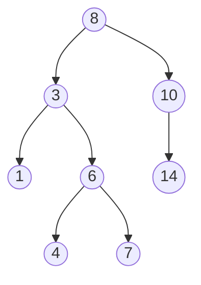

Arrays and linked lists are **linear** — one thing after another. A **tree**
breaks that: each node can branch into multiple children, giving you
hierarchy. Trees are everywhere in interviews: file systems, DOM, database
indexes, and a huge share of "medium" LeetCode problems.

## What you'll learn

- Core vocabulary: root, leaf, height, depth, subtree.
- A minimal `TreeNode` class — the shape every tree problem starts from.
- The three **depth-first** traversal orders, recursive and iterative.
- **Level-order** (breadth-first) traversal with `collections.deque`.
- The **Binary Search Tree (BST)** property, and why its inorder traversal
  comes out sorted for free.

## The cue

:::tip[Binary tree, or binary *search* tree?]
A **binary tree** is just a shape — at most two children. It promises nothing
about ordering, so answering "is x present" means visiting every node, $O(n)$.

A **binary search tree** adds one invariant: every value in the left subtree is
smaller, every value in the right is larger. That single promise turns search,
insert and delete into $O(h)$ — and makes an **in-order traversal produce sorted
output**, which is the most exploited fact in the whole family.

The trap is that $h$ is the *height*, not $\log n$. A BST built from sorted
input degenerates into a linked list and every operation becomes $O(n)$. Saying
"$O(h)$, which is $O(\log n)$ **only if balanced**" rather than "$O(\log n)$" is
a precision interviewers listen for — and it is what motivates
[balanced trees](../balanced-trees-overview/).
:::

## Tree terminology

- **Root** — the single top node with no parent.
- **Leaf** — a node with no children.
- **Depth** of a node — number of edges from the root down to it.
- **Height** of a tree — the depth of its deepest leaf (height of an empty
  tree is usually defined as $-1$, height of a single node is $0$).
- **Subtree** — any node plus everything hanging below it, treated as its
  own tree.
- **Binary tree** — every node has at most **two** children, conventionally
  called `left` and `right`.



Here `8` is the root, `1`, `4`, `7`, and `14` are leaves, and the height of
the whole tree is `2` (root at depth 0, deepest leaves at depth 2).

## The `TreeNode` class

Almost every tree problem — on LeetCode and in interviews — hands you (or
asks you to build) exactly this shape:

```python title="tree_node.py" showLineNumbers{1}
class TreeNode:
    def __init__(self, val=0, left=None, right=None):
        self.val = val
        self.left = left
        self.right = right


# Build the tree from the diagram above by hand
root = TreeNode(8,
    TreeNode(3, TreeNode(1), TreeNode(6, TreeNode(4), TreeNode(7))),
    TreeNode(10, None, TreeNode(14)))

print("root value:", root.val)
print("left child of root:", root.left.val)
print("right child of root:", root.right.val)
```

## Depth-first traversals (recursive)

There are three natural orders to visit `(node, left, right)`, depending on
*when* you visit the node itself:

```python title="dfs_recursive.py" showLineNumbers{1}
class TreeNode:
    def __init__(self, val=0, left=None, right=None):
        self.val = val
        self.left = left
        self.right = right


root = TreeNode(8,
    TreeNode(3, TreeNode(1), TreeNode(6, TreeNode(4), TreeNode(7))),
    TreeNode(10, None, TreeNode(14)))


def preorder(node, out):
    # node -> left -> right
    if node is None:
        return
    out.append(node.val)
    preorder(node.left, out)
    preorder(node.right, out)


def inorder(node, out):
    # left -> node -> right
    if node is None:
        return
    inorder(node.left, out)
    out.append(node.val)
    inorder(node.right, out)


def postorder(node, out):
    # left -> right -> node
    if node is None:
        return
    postorder(node.left, out)
    postorder(node.right, out)
    out.append(node.val)


pre, inn, post = [], [], []
preorder(root, pre)
inorder(root, inn)
postorder(root, post)
print("preorder :", pre)
print("inorder  :", inn)
print("postorder:", post)
```

:::tip[When to use which]
**Preorder** — copy/serialize a tree (visit before descending). **Inorder** —
on a BST this gives sorted order for free. **Postorder** — delete/free a tree,
or any "children must be processed before the parent" problem (e.g. computing
subtree sizes, diameter, or evaluating an expression tree).
:::

## Depth-first traversals (iterative, with an explicit stack)

Recursion is just the call stack doing the bookkeeping for you. Swap it for
your own `list`-as-stack and you get the same order without recursion depth
risk:

```python title="dfs_iterative.py" showLineNumbers{1}
class TreeNode:
    def __init__(self, val=0, left=None, right=None):
        self.val = val
        self.left = left
        self.right = right


root = TreeNode(8,
    TreeNode(3, TreeNode(1), TreeNode(6, TreeNode(4), TreeNode(7))),
    TreeNode(10, None, TreeNode(14)))


def preorder_iterative(root):
    if root is None:
        return []
    out, stack = [], [root]
    while stack:
        node = stack.pop()
        out.append(node.val)
        # push right FIRST so left is processed first (stack = LIFO)
        if node.right:
            stack.append(node.right)
        if node.left:
            stack.append(node.left)
    return out


def inorder_iterative(root):
    out, stack = [], []
    cur = root
    while cur or stack:
        while cur:            # walk all the way left, stacking as we go
            stack.append(cur)
            cur = cur.left
        cur = stack.pop()     # leftmost unvisited node
        out.append(cur.val)
        cur = cur.right       # then explore its right subtree
    return out


print("preorder (iterative):", preorder_iterative(root))
print("inorder (iterative): ", inorder_iterative(root))
```

## Level-order traversal (BFS) with a deque

Depth-first goes deep before wide; **level-order** visits every node one
level at a time, using a queue (`collections.deque` for $O(1)$ pops from the
front):

```python title="level_order.py" showLineNumbers{1}
from collections import deque


class TreeNode:
    def __init__(self, val=0, left=None, right=None):
        self.val = val
        self.left = left
        self.right = right


root = TreeNode(8,
    TreeNode(3, TreeNode(1), TreeNode(6, TreeNode(4), TreeNode(7))),
    TreeNode(10, None, TreeNode(14)))


def level_order(root):
    if root is None:
        return []
    result = []
    queue = deque([root])
    while queue:
        level_size = len(queue)
        level_vals = []
        for _ in range(level_size):
            node = queue.popleft()
            level_vals.append(node.val)
            if node.left:
                queue.append(node.left)
            if node.right:
                queue.append(node.right)
        result.append(level_vals)
    return result


print(level_order(root))   # one list per depth level
```

:::note[Why deque, not list]
`list.pop(0)` is $O(n)$ — it has to shift every remaining element. A
`deque`'s `popleft()` is $O(1)$. For BFS on anything but a tiny tree, this is
the difference between an accepted solution and a TLE.
:::

## Binary Search Trees (BST)

A **BST** adds one ordering rule to every node: everything in the **left**
subtree is smaller, everything in the **right** subtree is larger.

$$
\text{left subtree} < \text{node.val} < \text{right subtree}
$$

That single rule makes **search** and **insert** run in $O(h)$, where $h$ is
the tree's height — $O(\log n)$ if the tree stays roughly balanced, but
$O(n)$ if it degenerates into a chain (more on that next lesson).

```python title="bst_search_insert.py" showLineNumbers{1}
class TreeNode:
    def __init__(self, val=0, left=None, right=None):
        self.val = val
        self.left = left
        self.right = right


def bst_insert(root, val):
    if root is None:
        return TreeNode(val)
    if val < root.val:
        root.left = bst_insert(root.left, val)
    elif val > root.val:
        root.right = bst_insert(root.right, val)
    return root   # duplicate values: no-op


def bst_search(root, target):
    if root is None:
        return False
    if root.val == target:
        return True
    return bst_search(root.left, target) if target < root.val else bst_search(root.right, target)


def inorder(node, out):
    if node is None:
        return
    inorder(node.left, out)
    out.append(node.val)
    inorder(node.right, out)


root = None
for v in [8, 3, 10, 1, 6, 14, 4, 7]:
    root = bst_insert(root, v)

print("search 6: ", bst_search(root, 6))
print("search 99:", bst_search(root, 99))

sorted_out = []
inorder(root, sorted_out)
print("inorder (sorted!):", sorted_out)
```

:::tip[Free sorting]
Because a BST enforces `left < node < right` at every level, an **inorder**
traversal always visits values in ascending order — no separate sort step
needed. This is the single most useful BST fact to remember for interviews.
:::

## Complexity at a glance

| Operation | Average (balanced) | Worst case (skewed) |
| --- | --- | --- |
| Search | $O(\log n)$ | $O(n)$ |
| Insert | $O(\log n)$ | $O(n)$ |
| Traversal (any order) | $O(n)$ | $O(n)$ |
| Space (recursive traversal) | $O(h)$ call stack | $O(n)$ call stack |

## LeetCode problem set

Generated from the problem database, so each entry carries its sheet
membership and reported companies. Tick them off as you go — progress is
saved in this browser, and the Export button writes it to a file you can keep.

<ProblemLadder pattern="binary-trees-and-bst"
  notes={{"98":"Don't just compare a node to its children; carry a `(low, high)` bound down the recursion","102":"The deque pattern above, verbatim","104":"One line of recursion: `1 + max(depth(left), depth(right))`","235":"Use the BST property to decide \"go left / go right / this is it\" in $O(h)$ without visiting every node"}} />

## Visual intuition

In-order traversal on a BST produces sorted output. Step it and watch the
output strip:

<TreeWalker
  client:visible
  algo="inorder"
  tree={[8, 3, 10, 1, 6, null, 14]}
  title="Left, node, right — and on a BST that means sorted"
  lib="O(n) time, O(h) stack"
  desc="The node is recorded between its two subtrees, so everything smaller is emitted first. That is why so many BST problems reduce to a single in-order walk: kth smallest, validate, minimum absolute difference, and convert-to-sorted-list are all this traversal with a different accumulator."
/>

## Practice -- real LeetCode problems

Each exercise is the actual LeetCode problem with its real method signature and
LeetCode's own examples as the test. Write the body, press **Run**, and match the
expected output.

### LC 104 -- Maximum Depth of Binary Tree · Easy

**Problem.** Return the number of nodes along the longest path from the root down
to the farthest leaf.

**Constraints.** `0 <= number of nodes <= 10^4`, `-100 <= Node.val <= 100`.

**Examples.** `[3,9,20,null,null,15,7]` gives `3` · `[1,null,2]` gives `2` ·
`[]` gives `0`

<DataCampExercise
  lang="python"
  hint={`The depth of a tree is one plus the greater of its two subtree depths, and an empty tree has depth 0. That is the entire recursion -- two lines. This is the "return a summary upward" shape: each call needs only what its children report.`}
  code={`from collections import deque


class TreeNode:
    def __init__(self, val=0, left=None, right=None):
        self.val, self.left, self.right = val, left, right


def build(vals):
    if not vals or vals[0] is None:
        return None
    root = TreeNode(vals[0]); q, i = deque([root]), 1
    while q and i < len(vals):
        node = q.popleft()
        if i < len(vals) and vals[i] is not None:
            node.left = TreeNode(vals[i]); q.append(node.left)
        i += 1
        if i < len(vals) and vals[i] is not None:
            node.right = TreeNode(vals[i]); q.append(node.right)
        i += 1
    return root


def level_order(root):
    if not root:
        return []
    out, q = [], deque([root])
    while q:
        n = q.popleft()
        if n:
            out.append(n.val); q.append(n.left); q.append(n.right)
        else:
            out.append(None)
    while out and out[-1] is None:
        out.pop()
    return out


class Solution:
    def maxDepth(self, root):
        # TODO: an empty tree has depth 0; otherwise 1 + the deeper subtree.
        pass


sol = Solution()
cases = [[3, 9, 20, None, None, 15, 7], [1, None, 2], [], [1]]
print([sol.maxDepth(build(t)) for t in cases])   # expect [3, 2, 0, 1]`}
  solution={`from collections import deque


class TreeNode:
    def __init__(self, val=0, left=None, right=None):
        self.val, self.left, self.right = val, left, right


def build(vals):
    if not vals or vals[0] is None:
        return None
    root = TreeNode(vals[0]); q, i = deque([root]), 1
    while q and i < len(vals):
        node = q.popleft()
        if i < len(vals) and vals[i] is not None:
            node.left = TreeNode(vals[i]); q.append(node.left)
        i += 1
        if i < len(vals) and vals[i] is not None:
            node.right = TreeNode(vals[i]); q.append(node.right)
        i += 1
    return root


def level_order(root):
    if not root:
        return []
    out, q = [], deque([root])
    while q:
        n = q.popleft()
        if n:
            out.append(n.val); q.append(n.left); q.append(n.right)
        else:
            out.append(None)
    while out and out[-1] is None:
        out.pop()
    return out


class Solution:
    def maxDepth(self, root):
        if not root:
            return 0
        return 1 + max(self.maxDepth(root.left), self.maxDepth(root.right))


sol = Solution()
cases = [[3, 9, 20, None, None, 15, 7], [1, None, 2], [], [1]]
print([sol.maxDepth(build(t)) for t in cases])`}
  sct={`test_output_contains("[3, 2, 0, 1]")
success_msg("Return a summary upward -- the cleanest shape in tree recursion.")
`}
  height={320}
/>

<details>
<summary>Editorial</summary>

The base case handles the empty tree, and the recursive case combines what the
children report. This is the canonical "**return a value upward**" tree recursion.

**Time** $O(n)$. **Space** $O(h)$ for the recursion -- $O(\log n)$ balanced,
$O(n)$ degenerate.

Contrast with **minimum** depth (LC 111), where the analogous
`1 + min(left, right)` is **wrong**: a node with one child would report a depth
through its missing side. Maximum depth has no such trap, which is exactly why the
two problems are usually taught together -- see
[Tree BFS](../../phase-09-patterns-trees/tree-bfs-and-level-order/).

**Follow-ups:** "Iteratively?" -- BFS counting levels, or DFS with an explicit stack
of `(node, depth)`. "Minimum depth?" -- BFS with an early exit on the first leaf.
"Diameter (LC 543)?" -- the split-brain trick: return the height, record
`left + right`. "10^4 nodes in a chain?" -- exceeds Python's recursion limit; go
iterative or raise it.

</details>

### LC 226 -- Invert Binary Tree · Easy

**Problem.** Invert the tree -- mirror it left-to-right -- and return the root.

**Constraints.** `0 <= number of nodes <= 100`.

**Examples.** `[4,2,7,1,3,6,9]` gives `[4,7,2,9,6,3,1]` · `[2,1,3]` gives
`[2,3,1]` · `[]` gives `[]`

<DataCampExercise
  lang="python"
  hint={`Swap the two children, then recurse into both. Python's tuple assignment lets you do the swap and the recursion in one line without a temporary variable -- both right-hand sides are evaluated before either assignment happens, so nothing is lost.`}
  code={`from collections import deque


class TreeNode:
    def __init__(self, val=0, left=None, right=None):
        self.val, self.left, self.right = val, left, right


def build(vals):
    if not vals or vals[0] is None:
        return None
    root = TreeNode(vals[0]); q, i = deque([root]), 1
    while q and i < len(vals):
        node = q.popleft()
        if i < len(vals) and vals[i] is not None:
            node.left = TreeNode(vals[i]); q.append(node.left)
        i += 1
        if i < len(vals) and vals[i] is not None:
            node.right = TreeNode(vals[i]); q.append(node.right)
        i += 1
    return root


def level_order(root):
    if not root:
        return []
    out, q = [], deque([root])
    while q:
        n = q.popleft()
        if n:
            out.append(n.val); q.append(n.left); q.append(n.right)
        else:
            out.append(None)
    while out and out[-1] is None:
        out.pop()
    return out


class Solution:
    def invertTree(self, root):
        # TODO: swap the children and recurse. Mind the evaluation order
        # if you do it in a single assignment.
        pass


sol = Solution()
cases = [[4, 2, 7, 1, 3, 6, 9], [2, 1, 3], []]
print([level_order(sol.invertTree(build(t))) for t in cases])
# expect [[4, 7, 2, 9, 6, 3, 1], [2, 3, 1], []]`}
  solution={`from collections import deque


class TreeNode:
    def __init__(self, val=0, left=None, right=None):
        self.val, self.left, self.right = val, left, right


def build(vals):
    if not vals or vals[0] is None:
        return None
    root = TreeNode(vals[0]); q, i = deque([root]), 1
    while q and i < len(vals):
        node = q.popleft()
        if i < len(vals) and vals[i] is not None:
            node.left = TreeNode(vals[i]); q.append(node.left)
        i += 1
        if i < len(vals) and vals[i] is not None:
            node.right = TreeNode(vals[i]); q.append(node.right)
        i += 1
    return root


def level_order(root):
    if not root:
        return []
    out, q = [], deque([root])
    while q:
        n = q.popleft()
        if n:
            out.append(n.val); q.append(n.left); q.append(n.right)
        else:
            out.append(None)
    while out and out[-1] is None:
        out.pop()
    return out


class Solution:
    def invertTree(self, root):
        if not root:
            return None
        # both right-hand sides evaluate first, so no temporary is needed
        root.left, root.right = self.invertTree(root.right), self.invertTree(root.left)
        return root


sol = Solution()
cases = [[4, 2, 7, 1, 3, 6, 9], [2, 1, 3], []]
print([level_order(sol.invertTree(build(t))) for t in cases])`}
  sct={`test_output_contains("[[4, 7, 2, 9, 6, 3, 1], [2, 3, 1], []]")
success_msg("Tuple assignment evaluates both sides first -- no temporary variable required.")
`}
  height={320}
/>

<details>
<summary>Editorial</summary>

Swap at every node and recurse. The traversal order does not matter -- pre-order,
post-order and BFS all work, because each node's swap is independent of the others.

**Time** $O(n)$. **Space** $O(h)$.

The single-line swap relies on Python evaluating the whole right-hand side before
assigning. Written imperatively you would need a temporary:

```python
temp = root.left
root.left = self.invertTree(root.right)
root.right = self.invertTree(temp)      # temp, NOT root.left
```

Forgetting the temporary -- recursing into `root.left` after overwriting it --
silently produces a wrong tree, which is the one real trap in an otherwise trivial
problem.

**Follow-ups:** "Iteratively?" -- BFS with a queue, swapping each dequeued node's
children. "Check whether a tree is symmetric (LC 101)?" -- next problem; compare
the tree against its own mirror rather than mutating it. "Without mutating the
input?" -- build a new tree, returning fresh nodes with the children swapped.

</details>

### LC 101 -- Symmetric Tree · Easy

**Problem.** Return `True` if the tree is a mirror image of itself around its
centre.

**Constraints.** `1 <= number of nodes <= 1000`.

**Examples.** `[1,2,2,3,4,4,3]` gives `True` ·
`[1,2,2,null,3,null,3]` gives `False`

<DataCampExercise
  lang="python"
  hint={`Compare the tree against itself with a two-argument helper that walks one side outward-in and the other inward-out: mirror(a.left, b.right) and mirror(a.right, b.left). The CROSSED recursion is the whole point -- comparing left with left would just test equality. Guard both-None before touching .val.`}
  code={`from collections import deque


class TreeNode:
    def __init__(self, val=0, left=None, right=None):
        self.val, self.left, self.right = val, left, right


def build(vals):
    if not vals or vals[0] is None:
        return None
    root = TreeNode(vals[0]); q, i = deque([root]), 1
    while q and i < len(vals):
        node = q.popleft()
        if i < len(vals) and vals[i] is not None:
            node.left = TreeNode(vals[i]); q.append(node.left)
        i += 1
        if i < len(vals) and vals[i] is not None:
            node.right = TreeNode(vals[i]); q.append(node.right)
        i += 1
    return root


def level_order(root):
    if not root:
        return []
    out, q = [], deque([root])
    while q:
        n = q.popleft()
        if n:
            out.append(n.val); q.append(n.left); q.append(n.right)
        else:
            out.append(None)
    while out and out[-1] is None:
        out.pop()
    return out


class Solution:
    def isSymmetric(self, root):
        # TODO: a two-argument mirror helper.
        # The recursion must CROSS: left against right, right against left.
        pass


sol = Solution()
cases = [[1, 2, 2, 3, 4, 4, 3], [1, 2, 2, None, 3, None, 3], [1], [1, 2, 2]]
print([sol.isSymmetric(build(t)) for t in cases])
# expect [True, False, True, True]`}
  solution={`from collections import deque


class TreeNode:
    def __init__(self, val=0, left=None, right=None):
        self.val, self.left, self.right = val, left, right


def build(vals):
    if not vals or vals[0] is None:
        return None
    root = TreeNode(vals[0]); q, i = deque([root]), 1
    while q and i < len(vals):
        node = q.popleft()
        if i < len(vals) and vals[i] is not None:
            node.left = TreeNode(vals[i]); q.append(node.left)
        i += 1
        if i < len(vals) and vals[i] is not None:
            node.right = TreeNode(vals[i]); q.append(node.right)
        i += 1
    return root


def level_order(root):
    if not root:
        return []
    out, q = [], deque([root])
    while q:
        n = q.popleft()
        if n:
            out.append(n.val); q.append(n.left); q.append(n.right)
        else:
            out.append(None)
    while out and out[-1] is None:
        out.pop()
    return out


class Solution:
    def isSymmetric(self, root):
        def mirror(a, b):
            if not a and not b:
                return True                       # both empty: symmetric
            if not a or not b or a.val != b.val:
                return False
            # CROSSED: outer against outer, inner against inner
            return mirror(a.left, b.right) and mirror(a.right, b.left)

        return mirror(root, root)


sol = Solution()
cases = [[1, 2, 2, 3, 4, 4, 3], [1, 2, 2, None, 3, None, 3], [1], [1, 2, 2]]
print([sol.isSymmetric(build(t)) for t in cases])`}
  sct={`test_output_contains("[True, False, True, True]")
success_msg("The crossed recursion is what makes it a mirror test rather than an equality test.")
`}
  height={330}
/>

<details>
<summary>Editorial</summary>

Symmetry is a relation between **two** subtrees, so the helper takes two arguments.
Passing `(root, root)` starts the comparison of the tree against itself.

**Time** $O(n)$. **Space** $O(h)$.

The crossing is everything: `mirror(a.left, b.right)` pairs the outermost nodes,
and `mirror(a.right, b.left)` pairs the inner ones. Writing
`mirror(a.left, b.left)` would test whether the tree equals itself -- trivially
`True` -- and pass every input.

`[1,2,2,null,3,null,3]` is the discriminating case: the values are symmetric but
the **shape** is not. Both `2`s have only a right child, so the mirror pairing hits
`None` against a node.

This is the same parallel recursion as
[Same Tree](../../phase-09-patterns-trees/serialize-compare-and-subtree/), with the
child arguments swapped -- worth pointing out, since the two problems share a
skeleton.

**Follow-ups:** "Iteratively?" -- a queue of pairs, enqueuing
`(a.left, b.right)` and `(a.right, b.left)`. "Same tree (LC 100)?" -- the
uncrossed version. "Invert then compare?" -- works, but it mutates the input and
costs an extra pass.

</details>

## Dry run

**Search in a BST** for `6` in `[8, 3, 10, 1, 6, null, 14]`:

| step | at | compare | go |
| --- | --- | --- | --- |
| 1 | 8 | 6 < 8 | left |
| 2 | 3 | 6 > 3 | right |
| 3 | 6 | equal | **found** |

Three comparisons for seven nodes. Now the degenerate case — the *same values*
inserted in sorted order `1, 3, 6, 8, 10, 14`:

| step | at | go |
| --- | --- | --- |
| 1 | 1 | right |
| 2 | 3 | right |
| 3 | 6 | **found** |

…and searching for `14` would take all six steps. Same values, same code,
$O(n)$ instead of $O(\log n)$ — because the tree is now a linked list. This is
the concrete answer to "what is the worst case", and it is why the height must
be stated rather than assumed.

:::caution[Validating a BST needs an inherited range, not a parent comparison]
Checking only `left < node < right` at each node is wrong: a node can beat its
parent and still violate an ancestor. Pass `(low, high)` bounds down, narrowing
at each step. This is the single most common wrong answer on LC 98.
:::

## The variant map

| Question shape | Traversal | Why |
| --- | --- | --- |
| Per level, or nearest thing | **BFS** | levels are assembled in one place |
| Root-to-leaf path | **DFS pre-order** | the path is the recursion stack |
| Node's answer depends on its children | **DFS post-order** | children report upward first |
| Sorted output from a BST | **in-order** | left, node, right |
| Validate a BST | in-order, or DFS with `(low, high)` | ordering is global, not local |
| Minimum depth | **BFS** | early exit at the first leaf |
| Maximum depth | **DFS** | every node must be visited anyway |

Choosing the traversal *deliberately*, and being able to say why, is most of
what tree questions test. The techniques live in
[Phase 09](../../phase-09-patterns-trees/tree-bfs-and-level-order/).

## Pitfalls

- **Saying $O(\log n)$ where you mean $O(h)$.** They coincide only when the tree
  is balanced. State the assumption.
- **Validating a BST against the parent only.** Use inherited `(low, high)`
  bounds; a node can beat its parent and violate a grandparent.
- **Naive `1 + min(left, right)` for minimum depth.** A node with one child
  reports a depth through its missing child. Handle the single-child case
  explicitly.
- **Recursion depth on a degenerate tree.** $h = n$ overflows Python's default
  1000-frame limit around 1000 nodes. Mention converting to an explicit stack.
- **Identifying nodes by value.** Values can repeat; compare node objects.
- **Forgetting the empty tree.** `root is None` is the first line of almost every
  correct solution.

## Interview follow-ups

| They ask | What they're checking | The answer |
| --- | --- | --- |
| "What is the worst case for BST search?" | Precision | $O(n)$ — sorted insertion order degenerates the tree into a linked list. $O(\log n)$ requires balance |
| "How would you keep it balanced?" | Awareness | AVL or red-black rotations on insert and delete; see [balanced trees](../balanced-trees-overview/). In practice, reach for a library |
| "Find the k-th smallest in a BST" | Whether you exploit the invariant | In-order traversal, stop after k nodes. $O(h + k)$, not $O(n)$ |
| "Validate a BST" | Whether you know the classic trap | Inherited `(low, high)` bounds, or an in-order walk asserting strict increase. A parent comparison alone is wrong |
| "Do it iteratively" | Fluency | Explicit stack for DFS; for in-order, push left spine, pop, then go right. Necessary when $h$ risks a recursion-limit crash |
| "Why is a hash map not always better?" | Judgement | A hash map has no ordering. Range queries, k-th smallest, and successor all need the tree |

## Self-check

<Quiz
  title="Binary trees and BSTs — self-check"
  questions={[
    {
      q: "What is the time complexity of search in a binary search tree?",
      options: [
        "O(log n) always",
        "O(h) where h is the height — which is O(log n) only if the tree is balanced, and O(n) if it degenerates",
        "O(n) always",
        "O(1) average",
      ],
      answer: 1,
      explain: "Sorted insertion order produces a linked list. Saying O(h) and naming the balance assumption is the precision that distinguishes understanding from recall.",
    },
    {
      q: "Why is checking left < node < right at each node insufficient to validate a BST?",
      options: [
        "It is sufficient",
        "Because the ordering constraint is global — a node can satisfy its parent while violating an ancestor's bound",
        "Because it fails on empty trees",
        "Because it is too slow",
      ],
      answer: 1,
      explain: "The standard counterexample: a value in the right subtree that is smaller than the root but larger than its immediate parent. Pass (low, high) bounds down instead.",
    },
    {
      q: "Which traversal gives sorted output from a BST, and what does that unlock?",
      options: [
        "Pre-order — it visits the root first",
        "In-order (left, node, right) — which reduces kth-smallest, validation, and minimum-difference to one walk",
        "Post-order",
        "Level-order",
      ],
      answer: 1,
      explain: "The node is emitted between its subtrees, so everything smaller comes first. A large share of BST problems are this traversal with a different accumulator.",
    },
    {
      q: "Minimum depth of a binary tree — why is 1 + min(left, right) wrong?",
      options: [
        "It is correct",
        "Because a node with one child would report a depth through its missing child, which is not a root-to-leaf path",
        "Because it is O(n)",
        "Because min is not defined for empty subtrees",
      ],
      answer: 1,
      explain: "A missing child returns 0, so min picks it and the answer undercounts. Handle the single-child case explicitly, or use BFS and stop at the first leaf.",
    },
  ]}
/>

## Recall card

- **Binary tree** — a shape, no ordering. Search is $O(n)$.
- **BST** — left subtree smaller, right subtree larger. Search, insert, delete
  are $O(h)$, and **in-order gives sorted output**.
- **Say $O(h)$, not $O(\log n)$** — they coincide only when balanced. Sorted
  insertion order degenerates to $O(n)$.
- **Traversal choice** — BFS for per-level and nearest; pre-order for paths;
  post-order when a node needs its children's answers; in-order for BST order.
- **Validate with inherited `(low, high)` bounds**, never a parent comparison.
- **Watch recursion depth** — $h = n$ crashes Python's default limit near 1000
  nodes.

## Recap

- Trees generalize linked lists into a hierarchy; `TreeNode` with
  `left`/`right` is the universal building block.
- Preorder/inorder/postorder are the same recursive shape with the "visit"
  step moved; both recursive and iterative (explicit stack) versions matter.
- Level-order needs a `deque` for $O(1)$ front-pops — never `list.pop(0)`.
- A BST's ordering rule gives $O(h)$ search/insert and a free sorted output
  via inorder traversal — but only if the tree stays balanced.

Next: **Balanced Trees Overview** — why an unbalanced BST degrades to $O(n)$,
and how AVL/Red-Black trees keep height at $O(\log n)$.

