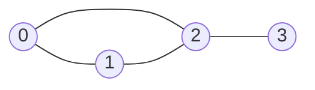

A **graph** is nodes plus connections between them — no strict hierarchy
required, unlike a tree. Trees, in fact, are just graphs with no cycles.
Before you can run BFS/DFS (Phase 7), you need to pick how to **store** the
graph, and that choice has real time/space consequences.

## What you'll learn

- The three standard representations: **adjacency list**, **adjacency
  matrix**, **edge list**.
- Directed vs undirected, and weighted vs unweighted graphs.
- Time/space tradeoffs for each representation, and when to pick which.
- Building a graph from raw edge input — the step every graph problem starts
  with.

## The cue

:::tip[Which representation? Ask about density and the operation you repeat]
**Adjacency list** — `defaultdict(list)` or a list of lists. Space $O(V + E)$,
and iterating a node's neighbours is $O(\deg v)$. This is the default and the
right answer almost always, because interview graphs are sparse.

**Adjacency matrix** — a $V \times V$ grid. Space $O(V^2)$, but "is there an edge
between `u` and `v`?" is $O(1)$. Worth it when the graph is dense ($E$ near
$V^2$), when you test specific edges repeatedly, or when the algorithm is
matrix-shaped anyway — Floyd-Warshall being the obvious case.

**Edge list** — just `[(u, v, w), …]`. Useless for traversal, ideal when you sort
edges by weight, which is exactly what Kruskal's does.

The rule of thumb: **$V \le$ a few hundred and dense, use a matrix. Otherwise a
list.** And notice the grid problems — an implicit graph where neighbours are
computed rather than stored, so no representation is built at all.
:::

## The same small graph, three ways

Take this undirected graph with 4 nodes and 4 edges:



### 1. Adjacency list — a dict of lists

Store, for each node, the list of nodes it connects to. This is the **default
choice** for almost all graph algorithms — compact, and iterating a node's
neighbors is directly proportional to how many neighbors it actually has.

```python title="adjacency_list.py" showLineNumbers{1}
from collections import defaultdict

# Undirected: each edge is added BOTH ways
edges = [(0, 1), (0, 2), (1, 2), (2, 3)]

graph = defaultdict(list)
for u, v in edges:
    graph[u].append(v)
    graph[v].append(u)   # remove this line for a DIRECTED graph

print("adjacency list:")
for node in sorted(graph):
    print(f"  {node}: {graph[node]}")

print("neighbors of 2:", graph[2])
```

### 2. Adjacency matrix — an n x n grid

Store an `n x n` grid where `matrix[u][v] = 1` (or a weight) if an edge
exists between `u` and `v`, else `0`. Checking "are `u` and `v` connected?" is
$O(1)$, but the matrix costs $O(n^2)$ space **regardless of how many edges
actually exist**.

```python title="adjacency_matrix.py" showLineNumbers{1}
n = 4   # number of nodes, labeled 0..3
edges = [(0, 1), (0, 2), (1, 2), (2, 3)]

matrix = [[0] * n for _ in range(n)]
for u, v in edges:
    matrix[u][v] = 1
    matrix[v][u] = 1   # remove this line for a DIRECTED graph

print("adjacency matrix:")
for row in matrix:
    print(" ", row)

print("0 and 2 connected?", matrix[0][2] == 1)
print("0 and 3 connected?", matrix[0][3] == 1)
```

### 3. Edge list — a flat list of pairs

Just the raw list of `(u, v)` pairs, with no lookup structure at all. Cheapest
to build and to store, but finding a node's neighbors means scanning **every**
edge — $O(E)$ per query.

```python title="edge_list.py" showLineNumbers{1}
edges = [(0, 1), (0, 2), (1, 2), (2, 3)]

def neighbors_of(edges, target, directed=False):
    result = []
    for u, v in edges:
        if u == target:
            result.append(v)
        elif not directed and v == target:
            result.append(u)
    return result

print("edge list:", edges)
print("neighbors of 2 (scan every edge):", neighbors_of(edges, 2))
```

Edge lists show up mostly as the **input format** for a problem (e.g. "you
are given `edges`, a list of `[u, v]` pairs") — you almost always convert
them into an adjacency list before running any real algorithm on them.

## Directed vs undirected, weighted vs unweighted

- **Undirected**: an edge `(u, v)` means you can travel `u -> v` **and**
  `v -> u`. Add the connection both ways (as in the adjacency list/matrix
  code above).
- **Directed**: an edge `(u, v)` only means `u -> v`. Add the connection
  **one way only** — this is the "remove this line" comment in the code
  above.
- **Weighted**: each edge carries a cost, not just a yes/no connection. In an
  adjacency list, store `(neighbor, weight)` pairs instead of bare neighbors;
  in a matrix, store the weight instead of `1`.

```python title="weighted_directed_graph.py" showLineNumbers{1}
from collections import defaultdict

# Directed, weighted: edges are (source, destination, weight)
weighted_edges = [(0, 1, 4), (0, 2, 1), (2, 1, 2), (1, 3, 5)]

graph = defaultdict(list)
for u, v, w in weighted_edges:
    graph[u].append((v, w))   # directed: only u -> v, carrying weight w

print("weighted, directed adjacency list:")
for node in sorted(graph):
    print(f"  {node}: {graph[node]}")

# cost of going straight from 0 to 2
for neighbor, weight in graph[0]:
    if neighbor == 2:
        print("cost 0 -> 2:", weight)
```

:::tip[Weighted-graph algorithms preview]
Weighted graphs are where **Dijkstra's algorithm** (shortest path, non-negative
weights) and **minimum spanning tree** algorithms (Prim's/Kruskal's) live —
both covered once BFS/DFS foundations are in place.
:::

## Building a graph from raw edge input

This is the very first step of nearly every graph problem: you're handed
`n` (number of nodes) and `edges` (a list of pairs), and you build an
adjacency list before doing anything else.

```python title="build_from_input.py" showLineNumbers{1}
from collections import defaultdict


def build_graph(n, edges, directed=False):
    graph = defaultdict(list)
    for node in range(n):
        graph[node]   # ensure every node 0..n-1 has an entry, even isolated ones
    for u, v in edges:
        graph[u].append(v)
        if not directed:
            graph[v].append(u)
    return graph


n = 5
edges = [(0, 1), (1, 2), (3, 4)]   # node 4 has no edges to node 0-2 -- two components

graph = build_graph(n, edges)
for node in sorted(graph):
    print(f"  {node}: {graph[node]}")
```

:::note[Don't forget isolated nodes]
If you only build the graph from `edges`, a node with **zero** connections
never gets a `dict` entry — and code that does `for node in graph` will
silently skip it. Pre-seed every node `0..n-1` (as above) so isolated nodes
still show up with an empty neighbor list.
:::

## Complexity at a glance

| Representation | Space | Check edge (u,v)? | Iterate neighbors of u | Add an edge |
| --- | --- | --- | --- | --- |
| Adjacency list | $O(V + E)$ | $O(\deg(u))$ | $O(\deg(u))$ | $O(1)$ |
| Adjacency matrix | $O(V^2)$ | $O(1)$ | $O(V)$ | $O(1)$ |
| Edge list | $O(E)$ | $O(E)$ | $O(E)$ | $O(1)$ |

`V` = number of vertices, `E` = number of edges, `deg(u)` = degree
(neighbor count) of node `u`.

:::tip[Default to an adjacency list]
Unless the graph is **dense** (E close to $V^2$, so the matrix's $O(V^2)$
space isn't wasteful) or you need $O(1)$ "are these two nodes directly
connected?" checks constantly, an adjacency list is the right default —
it's what BFS, DFS, Dijkstra, and topological sort all expect.
:::

## Where this leads: BFS/DFS in Phase 7

Every graph traversal — BFS (shortest path in unweighted graphs), DFS (cycle
detection, connected components, topological sort) — is built directly on
top of the adjacency list from this lesson: "for each neighbor of the current
node, do X." Getting the representation right here is what makes those
algorithms a few lines of code instead of a mess of index arithmetic.

## LeetCode problem set

Generated from the problem database, so each entry carries its sheet
membership and reported companies. Tick them off as you go — progress is
saved in this browser, and the Export button writes it to a file you can keep.

Both of these are traversal problems — the topic right after this one once BFS/DFS are introduced.

<ProblemLadder pattern="graph-representations"
  notes={{"200":"The grid itself *is* an implicit adjacency structure (each cell's neighbors are its 4 grid-adjacent cells); you rarely build an explicit list, but the \"who are my neighbors\" question is identical","207":"Build a directed adjacency list from prerequisite pairs, then detect a cycle (a course that depends on itself, transitively)"}} />

## Visual intuition

Whatever the representation, the traversal is the same. Here BFS over an
adjacency list, with the frontier structure on screen:

<GraphTraversal
  client:visible
  algo="bfs"
  edges={[["A","B"], ["A","C"], ["B","D"], ["C","D"], ["C","E"], ["D","F"], ["E","F"]]}
  start="A"
  title="The representation is storage; the traversal is the algorithm"
  lib="O(V + E)"
  desc="Nodes are marked seen on ENQUEUE, not on dequeue. Marking on dequeue lets a node reachable by two edges enter the queue twice — the standard way this degrades."
/>

## Practice -- real LeetCode problems

Each exercise is the actual LeetCode problem with its real method signature and
LeetCode's own examples as the test. Write the body, press **Run**, and match the
expected output.

### LC 1791 -- Find Center of Star Graph · Easy

**Problem.** A star graph has one centre connected to every other node. Given its
edge list, return the centre.

**Constraints.** `3 <= n <= 10^5`, exactly `n - 1` edges, and the input is
guaranteed to be a valid star.

**Examples.** `[[1,2],[2,3],[4,2]]` gives `2` ·
`[[1,2],[5,1],[1,3],[1,4]]` gives `1`

<DataCampExercise
  lang="python"
  hint={`You do not need to count degrees. The centre appears in EVERY edge, so it is whichever endpoint of the first edge also appears in the second edge. Two edges are enough -- an O(1) solution that reads only the first two entries.`}
  code={`class Solution:
    def findCenter(self, edges):
        # TODO: O(1) -- you only need the first TWO edges.
        # The centre appears in every edge.
        pass


sol = Solution()
cases = [[[1, 2], [2, 3], [4, 2]], [[1, 2], [5, 1], [1, 3], [1, 4]]]
print([sol.findCenter(c) for c in cases])   # expect [2, 1]`}
  solution={`class Solution:
    def findCenter(self, edges):
        a, b = edges[0]
        return a if a in edges[1] else b     # the centre is in every edge


sol = Solution()
cases = [[[1, 2], [2, 3], [4, 2]], [[1, 2], [5, 1], [1, 3], [1, 4]]]
print([sol.findCenter(c) for c in cases])`}
  sct={`test_output_contains("[2, 1]")
success_msg("Two edges determine the centre -- O(1), no degree counting at all.")
`}
  height={250}
/>

<details>
<summary>Editorial</summary>

Since every edge touches the centre, the shared endpoint of any two edges **is** the
centre.

**Time** $O(1)$. **Space** $O(1)$.

The obvious solution counts degrees and returns the node with degree `n - 1`. That is
$O(n)$ and perfectly correct -- worth stating -- but the structure lets you stop after
two edges. Recognising that the guarantee ("it is a valid star") licenses the
shortcut is the point of the problem.

**Follow-ups:** "Verify it really is a star?" -- then you do need the degree count:
one node with degree `n - 1` and the rest with degree 1. "Find the centre of a
**tree** (LC 310)?" -- much harder: peel leaves layer by layer until one or two
nodes remain. "What if the graph were given as an adjacency list?" -- the node whose
list has length `n - 1`.

</details>

### LC 997 -- Find the Town Judge · Easy

**Problem.** In a town of `n` people, the judge trusts nobody, everybody else
trusts the judge, and there is at most one judge. Given `trust` pairs
`[a, b]` meaning `a` trusts `b`, return the judge's label or `-1`.

**Constraints.** `1 <= n <= 1000`, `0 <= len(trust) <= 10^4`, pairs are distinct.

**Examples.** `n = 2, trust = [[1,2]]` gives `2` ·
`n = 3, trust = [[1,3],[2,3]]` gives `3` ·
`n = 3, trust = [[1,3],[2,3],[3,1]]` gives `-1`

<DataCampExercise
  lang="python"
  hint={`Track a single net score per person: subtract one for each person they trust (out-degree) and add one for each person who trusts them (in-degree). The judge is trusted by all n-1 others and trusts nobody, so their score is exactly n-1. Nobody else can reach that. Note n = 1 with no trust pairs makes person 1 the judge, with score 0 = n-1.`}
  code={`class Solution:
    def findJudge(self, n, trust):
        # TODO: one net score per person -- in-degree minus out-degree.
        # The judge scores exactly n - 1. Return -1 if nobody does.
        pass


sol = Solution()
cases = [(2, [[1, 2]]), (3, [[1, 3], [2, 3]]),
         (3, [[1, 3], [2, 3], [3, 1]]), (1, [])]
print([sol.findJudge(n, t) for n, t in cases])   # expect [2, 3, -1, 1]`}
  solution={`class Solution:
    def findJudge(self, n, trust):
        score = [0] * (n + 1)                # 1-indexed people
        for a, b in trust:
            score[a] -= 1                    # trusts someone: cannot be the judge
            score[b] += 1                    # is trusted by someone
        for i in range(1, n + 1):
            if score[i] == n - 1:            # trusted by all others, trusts none
                return i
        return -1


sol = Solution()
cases = [(2, [[1, 2]]), (3, [[1, 3], [2, 3]]),
         (3, [[1, 3], [2, 3], [3, 1]]), (1, [])]
print([sol.findJudge(n, t) for n, t in cases])`}
  sct={`test_output_contains("[2, 3, -1, 1]")
success_msg("One net score collapses two degree conditions into a single test.")
`}
  height={280}
/>

<details>
<summary>Editorial</summary>

The judge needs in-degree `n - 1` and out-degree `0`. Combining them into a single
net score is what makes the solution three lines: only a person with in-degree
`n - 1` **and** out-degree `0` can reach `n - 1`, since any outgoing trust subtracts.

**Time** $O(\text{len(trust)} + n)$. **Space** $O(n)$.

Two cases worth checking:

- **`n = 1, trust = []`** gives `1`. The lone person trusts nobody and is trusted by
  nobody, and `n - 1 == 0` matches their score. A solution that requires at least one
  trust edge misses this.
- **`[[1,3],[2,3],[3,1]]`** gives `-1`. Person 3 is trusted by two others but also
  trusts person 1, so their score is `2 - 1 = 1`, not `2`.

This is a **degree-counting** problem, which is the cheapest form of graph analysis --
no adjacency structure or traversal is needed at all. Recognising when in/out-degrees
alone answer the question saves building a graph you never traverse.

**Follow-ups:** "Two separate arrays for in and out degree?" -- equally correct, and
arguably clearer; the single score is just tidier. "Find a *celebrity* in $O(n)$
queries (LC 277)?" -- a related problem solved by eliminating candidates pairwise.
"What if several judges were allowed?" -- collect every person scoring `n - 1`.

</details>

### LC 133 -- Clone Graph · Medium

**Problem.** Given a reference to a node in a **connected** undirected graph, return
a **deep copy**. Each node has a `val` and a list of `neighbors`.

**Constraints.** `0 <= number of nodes <= 100`, values are unique, the graph has no
self-loops or repeated edges and is connected.

**Examples.** The square `1-2-3-4-1` must be copied so that the structure matches and
**no node object is shared** with the original.

:::note[What this test checks]
It verifies each copied node's value and its neighbours' values, and that **no copy
is the same object** as its original -- which is what makes it a *deep* copy. A
shallow copy passes the structural check and fails the identity one.
:::

<DataCampExercise
  lang="python"
  hint={`Keep a dict from original node to its copy. On visiting a node, if it is already in the dict return the existing copy -- that both avoids duplicates and terminates on cycles. Otherwise create the copy and register it in the dict BEFORE recursing into neighbours, or a cycle will send you into infinite recursion.`}
  code={`class Node:
    def __init__(self, val=0, neighbors=None):
        self.val = val
        self.neighbors = neighbors if neighbors is not None else []


class Solution:
    def cloneGraph(self, node):
        # TODO: DFS or BFS with a dict from original -> copy.
        # Register the copy BEFORE recursing, or cycles loop forever.
        # The dict doubles as the visited set.
        pass


# build the square 1-2-3-4-1
g = [Node(i) for i in range(1, 5)]
g[0].neighbors = [g[1], g[3]]
g[1].neighbors = [g[0], g[2]]
g[2].neighbors = [g[1], g[3]]
g[3].neighbors = [g[0], g[2]]

copy = Solution().cloneGraph(g[0])
order, is_deep, visited, stack = [], True, set(), [(copy, g[0])]
while stack:
    c, o = stack.pop()
    if id(c) in visited:
        continue
    visited.add(id(c))
    order.append((c.val, sorted(nb.val for nb in c.neighbors)))
    if c is o:
        is_deep = False          # sharing a node means it is NOT a deep copy
    for cn, on in zip(c.neighbors, o.neighbors):
        stack.append((cn, on))
print([sorted(order), is_deep])
# expect [[(1, [2, 4]), (2, [1, 3]), (3, [2, 4]), (4, [1, 3])], True]`}
  solution={`class Node:
    def __init__(self, val=0, neighbors=None):
        self.val = val
        self.neighbors = neighbors if neighbors is not None else []


class Solution:
    def cloneGraph(self, node):
        if not node:
            return None
        clone = {}                       # original -> copy, doubles as visited

        def dfs(n):
            if n in clone:
                return clone[n]          # already copied: stops cycles
            copy = Node(n.val)
            clone[n] = copy              # register BEFORE recursing
            for nb in n.neighbors:
                copy.neighbors.append(dfs(nb))
            return copy

        return dfs(node)


g = [Node(i) for i in range(1, 5)]
g[0].neighbors = [g[1], g[3]]
g[1].neighbors = [g[0], g[2]]
g[2].neighbors = [g[1], g[3]]
g[3].neighbors = [g[0], g[2]]

copy = Solution().cloneGraph(g[0])
order, is_deep, visited, stack = [], True, set(), [(copy, g[0])]
while stack:
    c, o = stack.pop()
    if id(c) in visited:
        continue
    visited.add(id(c))
    order.append((c.val, sorted(nb.val for nb in c.neighbors)))
    if c is o:
        is_deep = False
    for cn, on in zip(c.neighbors, o.neighbors):
        stack.append((cn, on))
print([sorted(order), is_deep])`}
  sct={`test_output_contains("[[(1, [2, 4]), (2, [1, 3]), (3, [2, 4]), (4, [1, 3])], True]")
success_msg("Register the copy before recursing -- that one line is what makes cycles terminate.")
`}
  height={520}
/>

<details>
<summary>Editorial</summary>

A single map from original node to its copy does two jobs: it is the copy registry,
and it is the **visited set**. That is why the traversal terminates on a cyclic
graph.

**Time** $O(V + E)$. **Space** $O(V)$.

**Registering before recursing is essential.** In the square graph, node 1's
neighbour 2 has node 1 as its own neighbour. If `clone[n] = copy` came *after* the
neighbour loop, the recursion would bounce between them until the stack overflowed.
Inserting first means the second visit finds the entry and returns immediately.

This is the graph version of
[LC 138 Copy List with Random Pointer](../../phase-08-patterns-linked-lists/copy-flatten-and-reorder/).
There the linear order let you create all nodes in one pass and wire them in a
second; here there is no order, so creation and wiring interleave -- and the map is
what keeps that consistent.

BFS works identically: create the copy on first sight, enqueue, and wire neighbours
as you dequeue.

**Follow-ups:** "Iteratively?" -- BFS with a queue and the same map. "Disconnected
graph?" -- the problem guarantees connectivity from the given node; otherwise you
would need to iterate over all nodes. "Directed graph?" -- the same code works
unchanged. "Why not `copy.deepcopy`?" -- it works but defeats the exercise.

</details>

## Dry run

The same graph — edges `A-B`, `A-C`, `B-D`, `C-D` — in all three forms.

**Adjacency list** (undirected, so each edge appears twice):

```
A: [B, C]      B: [A, D]      C: [A, D]      D: [B, C]
```

**Adjacency matrix:**

| | A | B | C | D |
| --- | --- | --- | --- | --- |
| **A** | 0 | 1 | 1 | 0 |
| **B** | 1 | 0 | 0 | 1 |
| **C** | 1 | 0 | 0 | 1 |
| **D** | 0 | 1 | 1 | 0 |

**Edge list:** `[(A,B), (A,C), (B,D), (C,D)]`

Now the cost comparison for four nodes and four edges:

| operation | list | matrix | edge list |
| --- | --- | --- | --- |
| storage | 8 entries | 16 cells | 4 tuples |
| neighbours of `A` | $O(\deg A)$ = 2 | $O(V)$ = 4 | $O(E)$ = 4 |
| is there an `A-D` edge? | $O(\deg A)$ | **$O(1)$** | $O(E)$ |
| iterate all edges | $O(V + E)$ | $O(V^2)$ | **$O(E)$** |

At $V = 1000$ with $E = 2000$, the matrix costs a million cells to store two
thousand edges — and every neighbour lookup scans a thousand entries to find
two. That is the concrete reason the list is the default.

:::caution[Undirected means adding the edge twice]
`adj[u].append(v)` alone builds a *directed* graph. Forgetting the reverse edge
produces a traversal that mysteriously fails to reach half the graph, and it is
the most common graph-setup bug.
:::

## The variant map

| Situation | Representation | Why |
| --- | --- | --- |
| Sparse, traversal-heavy | adjacency list | $O(V + E)$ space, cheap neighbour iteration |
| Dense, or repeated edge tests | adjacency matrix | $O(1)$ edge lookup |
| Sort edges by weight (Kruskal) | edge list | the algorithm only ever iterates edges |
| All-pairs shortest paths (Floyd-Warshall) | adjacency matrix | the algorithm *is* matrix updates |
| Grid or maze | **implicit** — compute neighbours from `(r, c)` | building a graph object is wasted work |
| Weighted | store `(neighbour, weight)` tuples in the list | keeps Dijkstra straightforward |
| Nodes are strings or objects | `defaultdict(list)` keyed by the object | avoids an id-mapping layer |

:::note[Implicit graphs are the most common shape in interviews]
Grid problems, word ladders, and state-space searches never build an adjacency
structure at all — neighbours are *derived* on demand. Recognising that a problem
is a graph problem without a graph in it is worth more than any representation
detail.
:::

## Pitfalls

- **Adding only one direction for an undirected edge.** Half the graph becomes
  unreachable, and the symptom looks like a traversal bug.
- **Using a matrix when the graph is sparse.** $O(V^2)$ memory for $O(V)$ edges,
  and neighbour iteration slows to $O(V)$.
- **Forgetting isolated nodes.** Building the graph purely from an edge list drops
  any node with no edges — which changes the component count.
- **Not handling self-loops or duplicate edges.** Both are legal in many problems
  and both break naive assumptions.
- **Building a graph object for a grid.** Compute neighbours from `(r, c)`
  instead; the graph is implicit.
- **Using `dict` where node ids are `0..n-1`.** A list of lists is faster and
  simpler for a dense integer range.

## Interview follow-ups

| They ask | What they're checking | The answer |
| --- | --- | --- |
| "List or matrix here?" | Judgement | Sparse and traversal-heavy means list ($O(V+E)$). Dense or repeated edge tests means matrix ($O(1)$ lookup, $O(V^2)$ space) |
| "Space complexity of each?" | Precision | List $O(V + E)$; matrix $O(V^2)$; edge list $O(E)$ |
| "How do you represent a grid as a graph?" | Whether you see implicit graphs | You do not build one — derive neighbours from `(r, c)` with a `DIRS` list. The graph is implicit |
| "Weighted edges?" | Practical detail | Store `(neighbour, weight)` tuples in the list, or put the weight in the matrix cell |
| "Node ids are arbitrary strings" | Modelling | `defaultdict(list)` keyed directly by the string, or map to integers first if the algorithm needs indices |
| "When is an edge list the right choice?" | Breadth | When the algorithm only iterates or sorts edges — Kruskal's MST is the canonical case |

## Self-check

<Quiz
  title="Graph representations — self-check"
  questions={[
    {
      q: "Space complexity of an adjacency list versus an adjacency matrix?",
      options: [
        "Both O(V squared)",
        "List O(V + E); matrix O(V squared) — which is why the list is the default for sparse graphs",
        "List O(E); matrix O(V)",
        "Both O(V + E)",
      ],
      answer: 1,
      explain: "At V = 1000 with E = 2000, the matrix stores a million cells for two thousand edges. That ratio is the whole argument.",
    },
    {
      q: "When is an adjacency matrix the better choice?",
      options: [
        "Always — O(1) lookup beats everything",
        "When the graph is dense, or you repeatedly test specific edges, or the algorithm is matrix-shaped like Floyd-Warshall",
        "Never in practice",
        "Only for directed graphs",
      ],
      answer: 1,
      explain: "The O(1) edge test is the matrix's only real advantage, and it only pays for itself when the graph is dense or you use it often.",
    },
    {
      q: "You are building an undirected graph from an edge list. What is the classic bug?",
      options: [
        "Using a dict instead of a list",
        "Adding only one direction, so half the graph becomes unreachable",
        "Not sorting the edges",
        "Forgetting to deduplicate",
      ],
      answer: 1,
      explain: "The symptom looks like a traversal bug rather than a setup bug, which is what makes it expensive. Both adj[u].append(v) and adj[v].append(u) are needed.",
    },
    {
      q: "How should a grid maze be represented as a graph?",
      options: [
        "Build an adjacency list with one entry per cell",
        "Do not build one — derive neighbours from (r, c) using a DIRS list. The graph is implicit",
        "Use an adjacency matrix of size rc x rc",
        "Convert to an edge list first",
      ],
      answer: 1,
      explain: "Materialising the graph is wasted work and memory. Recognising a graph problem that has no graph object in it is the more valuable skill.",
    },
  ]}
/>

## Recall card

- **Adjacency list** — `defaultdict(list)`. $O(V + E)$ space. **The default.**
- **Adjacency matrix** — $O(V^2)$ space, $O(1)$ edge test. Use when dense, when
  edge tests repeat, or for Floyd-Warshall.
- **Edge list** — $O(E)$ space, no traversal. Use when sorting edges (Kruskal).
- **Implicit** — grids and state spaces build nothing; neighbours are derived.
  This is the most common interview shape.
- **Undirected means adding both directions.** Forgetting the reverse edge is
  the classic setup bug.
- **Rule of thumb** — $V$ in the hundreds and dense → matrix. Otherwise list.

## Recap

- **Adjacency list** ($O(V+E)$ space): the default, best for iterating a
  node's neighbors — what nearly every graph algorithm expects.
- **Adjacency matrix** ($O(V^2)$ space): $O(1)$ edge checks, worth it only
  for dense graphs or frequent direct-connection queries.
- **Edge list** ($O(E)$ space): the common *input* format, converted to an
  adjacency list before real work starts.
- Undirected = add both directions; directed = add one; weighted = carry a
  value alongside each neighbor.
- Always pre-seed nodes `0..n-1` so isolated nodes aren't silently dropped.

Next up in **Phase 7**: BFS and DFS run directly on the adjacency list built
here — shortest paths, connected components, and cycle detection.

