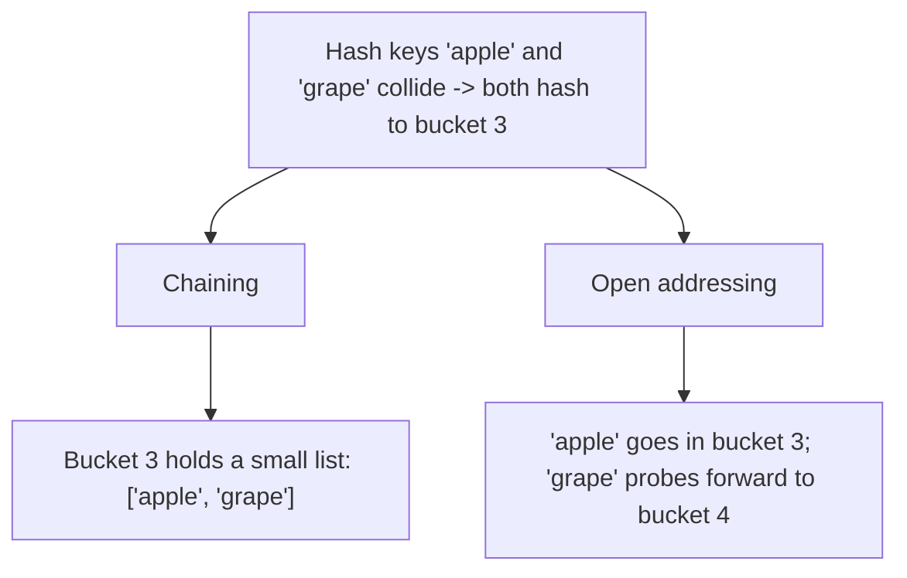

If arrays are "index in, value out", hash tables are "**anything** in,
value out, still fast." That trick — turning an arbitrary key into an array
index — is what makes `dict` and `set` the single most-used tools in
interview Python.

## What you'll learn

- What hashing actually does: key → hash → bucket index.
- Collisions, and the two standard fixes: chaining and open addressing.
- Why `dict`/`set` give $O(1)$ **average** lookup, and the worst case.
- Core idioms: `get`, `setdefault`, `defaultdict`, `Counter`.
- The frequency-table and seen-set patterns, runnable.
- LeetCode-style problems to drill the pattern.

## The cue

:::tip[Reach for a hash table when…]
- Lookup is **by key**, not by position, and you need it in $O(1)$ average.
- You are counting occurrences, deduplicating, or grouping by a derived key.
- You need to remember **what you have already seen** while scanning — which is
  what turns most $O(n^2)$ double loops into $O(n)$ single passes.

That last one is the highest-value use. "Have I seen `target - x`?" is Two Sum;
"have I seen this prefix sum?" is LC 560; "have I seen this canonical form?" is
Group Anagrams. The pattern is always: trade $O(n)$ memory for a factor of $n$
in time.

**Reach for something else** when you need **ordering** (a sorted list plus
`bisect`, or a heap), when you need the *k*-th smallest (a heap), when keys are a
dense integer range (a plain list is faster and simpler), or when worst-case
guarantees matter — hashing is $O(1)$ *average*, not worst case.
:::

## Hashing: key to bucket, in O(1)

A hash table is really just an array (buckets) plus a **hash function**
that turns any key into an index into that array. Insert and lookup both
start the same way: hash the key, jump straight to that bucket — no
scanning required.

```python title="hash_basics.py" showLineNumbers{1}
# Python exposes the hash function directly via hash()
print(hash("apple"))
print(hash(42))
print(hash((1, 2, 3)))   # tuples are hashable, lists are NOT

# a tiny hash table, built by hand, to show the idea
num_buckets = 8

def bucket_for(key):
    return hash(key) % num_buckets

for key in ["apple", "banana", "cherry", "date"]:
    print(f"{key:<8} -> bucket {bucket_for(key)}")
```

## Collisions: two keys, one bucket

With a fixed number of buckets, two different keys will eventually hash to
the same index — a **collision**. There are two classic fixes:

- **Chaining** — each bucket holds a small list; colliding keys just get
  appended to that bucket's list.
- **Open addressing** — on a collision, probe forward to the next free
  slot instead of using a list per bucket.

CPython's `dict`/`set` use an open-addressing variant internally, but the
concept is the same either way: collisions are handled *inside* the table,
invisibly to you.



:::caution[When O(1) average breaks down]
If a key's `__hash__` is bad, or an adversary crafts inputs that all hash to
the same bucket, every lookup degrades toward $O(n)$ — the worst case for
both `dict` and `set`. This is rare with Python's built-in hashing but real
with custom `__hash__` implementations. Also: only **hashable** (immutable)
types can be keys — `tuple`, `str`, `int`, `frozenset` work; `list`, `dict`,
`set` do not.
:::

## `dict` / `set`: O(1) average, in practice

```python title="dict_set_speed.py" showLineNumbers{1}
nums = list(range(50_000))
lookup_set = set(nums)
target = 49_999

# list membership: O(n) -- must scan, possibly the whole thing
found_in_list = target in nums

# set membership: O(1) average -- hash once, check one bucket
found_in_set = target in lookup_set

print("found in list:", found_in_list)
print("found in set: ", found_in_set)
print("same answer, wildly different cost per lookup")
```

## Core dict idioms

Four small idioms replace almost every "check if key exists first" pattern
you'd otherwise write by hand.

```python title="dict_idioms.py" showLineNumbers{1}
from collections import defaultdict, Counter

d = {"a": 1, "b": 2}

# get: lookup with a default, no KeyError, no "if key in d" needed
print(d.get("a"))          # 1
print(d.get("z"))          # None
print(d.get("z", 0))       # 0

# setdefault: get-or-insert in one call
d.setdefault("c", []).append(10)
d.setdefault("c", []).append(20)
print(d)   # {"a": 1, "b": 2, "c": [10, 20]}

# defaultdict: every missing key gets a default value automatically
groups = defaultdict(list)
for word in ["cat", "car", "dog", "do"]:
    groups[word[0]].append(word)
print(dict(groups))

# Counter: a frequency table in one call
freq = Counter("mississippi")
print(freq)
print(freq.most_common(2))
```

## Pattern: frequency table

Counting occurrences is the single most common warm-up interview problem,
and it's always the same shape.

```python title="frequency_pattern.py" showLineNumbers{1}
def char_frequencies(s):
    freq = {}
    for c in s:
        freq[c] = freq.get(c, 0) + 1   # O(1) per character
    return freq


print(char_frequencies("hello"))
```

## Pattern: seen-set (duplicate / pair detection)

Keeping a running `set` of "things seen so far" turns an $O(n^2)$ nested
scan into a single $O(n)$ pass.

```python title="seen_set_pattern.py" showLineNumbers{1}
def has_duplicate(nums):
    seen = set()
    for x in nums:
        if x in seen:      # O(1) average
            return True
        seen.add(x)         # O(1) average
    return False


def two_sum(nums, target):
    seen = {}   # value -> index
    for i, x in enumerate(nums):
        complement = target - x
        if complement in seen:
            return [seen[complement], i]
        seen[x] = i
    return []


print(has_duplicate([4, 5, 6, 4]))
print(has_duplicate([1, 2, 3]))
print(two_sum([2, 7, 11, 15], 9))
```

`two_sum` finds the answer in one pass: for each number, check if the
value that would complete the target has already been seen — no nested
loop needed.

## Complexity summary

| Operation | `list` | `set` / `dict` |
| --- | --- | --- |
| Membership (`x in ...`) | $O(n)$ | $O(1)$ average |
| Insert | $O(1)$ amortized (end) | $O(1)$ average |
| Delete by key/value | $O(n)$ | $O(1)$ average |
| Worst case (adversarial hashing) | — | $O(n)$ |

## LeetCode problem set

Generated from the problem database, so each entry carries its sheet
membership and reported companies. Tick them off as you go — progress is
saved in this browser, and the Export button writes it to a file you can keep.

<ProblemLadder pattern="hash-tables"
  notes={{"1":"Trade $O(n^2)$ scanning for $O(n)$ lookups -- the dict *is* the algorithm","49":"A canonical dict-of-lists bucket, keyed by the sorted letters (or a 26-slot count tuple)","217":"`len(set(nums)) != len(nums)` in one line -- proof that picking the right structure ends the problem"}} />

## Visual intuition

The chips are the map. Watch it answer "have I seen the value I need?" in
constant time, once per element:

<ArrayStepper
  client:visible
  algo="subarray-sum-k"
  values={[1, 2, 3, -3, 1, 1, 1]}
  target={3}
  title="Remembering what you have seen turns O(n squared) into O(n)"
  lib="LC 560"
  desc="Every step asks the map one question and gets an O(1) answer. Without the map, answering it would mean re-scanning everything to the left — which is exactly the nested loop the hash table removes."
/>

## Practice -- real LeetCode problems

Each exercise is the actual LeetCode problem with its real method signature and
LeetCode's own examples as the test. Write the body, press **Run**, and match the
expected output.

### LC 1 -- Two Sum · Easy

**Problem.** Given an array `nums` and a `target`, return the indices of the two
numbers that add up to `target`. Exactly one solution exists, and you may not use
the same element twice.

**Constraints.** `2 <= len(nums) <= 10^4`, `-10^9 <= nums[i], target <= 10^9`.
Can you do better than $O(n^2)$?

**Examples.** `[2,7,11,15], target = 9` gives `[0,1]` ·
`[3,2,4], target = 6` gives `[1,2]` · `[3,3], target = 6` gives `[0,1]`

<DataCampExercise
  lang="python"
  hint={`One pass with a dict from value to index. For each number, look up its complement (target minus the number) FIRST, then insert the current number. Checking before inserting is what prevents an element from pairing with itself -- which matters for input like [3,3].`}
  code={`class Solution:
    def twoSum(self, nums, target):
        # TODO: one pass, O(n). A dict of value -> index.
        # Look up the complement BEFORE inserting the current number,
        # or an element can pair with itself.
        pass


sol = Solution()
cases = [([2, 7, 11, 15], 9), ([3, 2, 4], 6), ([3, 3], 6), ([0, 4, 3, 0], 0)]
print([sol.twoSum(n, t) for n, t in cases])
# expect [[0, 1], [1, 2], [0, 1], [0, 3]]`}
  solution={`class Solution:
    def twoSum(self, nums, target):
        seen = {}                          # value -> index
        for i, n in enumerate(nums):
            if target - n in seen:
                return [seen[target - n], i]
            seen[n] = i                    # insert AFTER checking
        return []


sol = Solution()
cases = [([2, 7, 11, 15], 9), ([3, 2, 4], 6), ([3, 3], 6), ([0, 4, 3, 0], 0)]
print([sol.twoSum(n, t) for n, t in cases])`}
  sct={`test_output_contains("[[0, 1], [1, 2], [0, 1], [0, 3]]")
success_msg("Check then insert -- reverse the order and an element pairs with itself.")
`}
  height={280}
/>

<details>
<summary>Editorial</summary>

Trading $O(n^2)$ scanning for $O(n)$ lookups is the whole idea, and it is the
canonical demonstration of why hash tables matter.

**Time** $O(n)$. **Space** $O(n)$.

The ordering -- **look up, then insert** -- is what enforces "not the same element
twice". With `[3,3]` and `target = 6`: at `i = 0` the complement `3` is not yet in
the map, so we insert it; at `i = 1` the complement `3` *is* present, mapped to
index `0`, giving `[0, 1]`. Inserting first would let index 0 match itself and
return `[0, 0]`.

`[0,4,3,0]` with `target = 0` is the same trap with a duplicate that is not
adjacent.

Note the input is **unsorted**, which is why a hash map beats the two-pointer
approach. When the array *is* sorted, converging pointers solve it in $O(1)$
space -- that is
[LC 167](../../phase-05-patterns-arrays-and-strings/two-pointers/), and knowing
which applies is the real lesson.

**Follow-ups:** "Sorted input?" -- two pointers, $O(1)$ space. "Return the values
instead of indices?" -- sorting becomes viable. "All pairs, not just one?" -- watch
for duplicates. "Three numbers (LC 15)?" -- sort, fix one, two-pointer the rest.

</details>

### LC 217 -- Contains Duplicate · Easy

**Problem.** Return `True` if any value appears at least twice.

**Constraints.** `1 <= len(nums) <= 10^5`, `-10^9 <= nums[i] <= 10^9`.

**Examples.** `[1,2,3,1]` gives `True` · `[1,2,3,4]` gives `False`

<DataCampExercise
  lang="python"
  hint={`A set discards duplicates, so if the set is smaller than the list something repeated. That is a one-liner. The early-exit version -- build the set as you scan and return True on the first repeat -- uses less memory on average and is worth mentioning.`}
  code={`class Solution:
    def containsDuplicate(self, nums):
        # TODO: O(n). Think about what a set does to duplicates.
        pass


sol = Solution()
cases = [[1, 2, 3, 1], [1, 2, 3, 4], [1, 1, 1, 3, 3, 4, 3, 2, 4, 2], [1]]
print([sol.containsDuplicate(c) for c in cases])
# expect [True, False, True, False]`}
  solution={`class Solution:
    def containsDuplicate(self, nums):
        return len(set(nums)) != len(nums)    # a set drops duplicates


sol = Solution()
cases = [[1, 2, 3, 1], [1, 2, 3, 4], [1, 1, 1, 3, 3, 4, 3, 2, 4, 2], [1]]
print([sol.containsDuplicate(c) for c in cases])`}
  sct={`test_output_contains("[True, False, True, False]")
success_msg("Choosing the right structure ends the problem -- that is the point of this one.")
`}
  height={250}
/>

<details>
<summary>Editorial</summary>

A set stores each value once, so a size mismatch proves a duplicate existed.

**Time** $O(n)$. **Space** $O(n)$.

The early-exit variant is worth writing out, because it is strictly better on
memory when a duplicate appears early:

```python
seen = set()
for n in nums:
    if n in seen:
        return True
    seen.add(n)
return False
```

Same worst case, but it stops as soon as it can and never holds more than the
prefix it has scanned.

The alternatives are instructive: sorting and checking neighbours is
$O(n \log n)$ time and $O(1)$ extra space -- a real trade, not a worse answer, if
memory is the binding constraint.

**Follow-ups:** "$O(1)$ space?" -- sort first, then compare adjacent elements.
"Duplicates within `k` indices (LC 219)?" -- a sliding-window set of size `k`.
"Values within `t` *and* indices within `k` (LC 220)?" -- bucketing or a
`SortedList`. "Find *which* value repeats?" -- return it instead of a boolean.

</details>

### LC 383 -- Ransom Note · Easy

**Problem.** Return `True` if `ransomNote` can be built from the letters in
`magazine`, using each letter at most as many times as it appears there.

**Constraints.** `1 <= len(ransomNote), len(magazine) <= 10^5`, lowercase letters.

**Examples.** `("a", "b")` gives `False` · `("aa", "ab")` gives `False` ·
`("aa", "aab")` gives `True`

<DataCampExercise
  lang="python"
  hint={`This is multiset containment, and collections.Counter supports it directly with the <= operator: Counter(note) <= Counter(magazine) is True exactly when every letter appears at least as often in the magazine. Note that a plain set would be wrong -- it would accept "aa" from "ab" because it ignores counts.`}
  code={`from collections import Counter


class Solution:
    def canConstruct(self, ransomNote, magazine):
        # TODO: multiset containment, not set containment -- counts matter.
        # Counter supports <= directly.
        pass


sol = Solution()
cases = [("a", "b"), ("aa", "ab"), ("aa", "aab"), ("", "x"), ("abc", "cba")]
print([sol.canConstruct(a, b) for a, b in cases])
# expect [False, False, True, True, True]`}
  solution={`from collections import Counter


class Solution:
    def canConstruct(self, ransomNote, magazine):
        return Counter(ransomNote) <= Counter(magazine)   # multiset subset


sol = Solution()
cases = [("a", "b"), ("aa", "ab"), ("aa", "aab"), ("", "x"), ("abc", "cba")]
print([sol.canConstruct(a, b) for a, b in cases])`}
  sct={`test_output_contains("[False, False, True, True, True]")
success_msg("Counter's <= is multiset containment -- exactly the question being asked.")
`}
  height={260}
/>

<details>
<summary>Editorial</summary>

The question is whether the note's letter **multiset** is contained in the
magazine's. `Counter.__le__` implements precisely that comparison.

**Time** $O(n + m)$. **Space** $O(|\Sigma|)$, so $O(1)$ for lowercase English.

`("aa", "ab")` returning `False` is the case that rules out a set-based solution:
both strings use the same letter *set*, but the magazine has only one `a`. Counts
are the whole problem.

The explicit version is worth knowing for interviews that ban library shortcuts:
count the magazine, then decrement per note character and fail on a miss. It also
allows an early exit, which `Counter <= Counter` does not.

`("", "x")` returning `True` -- an empty note needs nothing -- falls out for free.

**Follow-ups:** "Without `Counter`?" -- a 26-slot list, or a dict with manual
decrements. "Reuse letters unlimited times?" -- then it is set containment, and
`set(note) <= set(magazine)`. "Anagram check instead (LC 242)?" -- equality rather
than containment. "Unicode input?" -- the dict handles it; only the space bound
changes.

</details>

## Dry run

**Collision handling.** Suppose a table of 8 buckets and `hash(k) % 8`:

| insert | hash % 8 | bucket state |
| --- | --- | --- |
| `"a"` | 3 | `3: [a]` |
| `"b"` | 5 | `3: [a], 5: [b]` |
| `"c"` | 3 | `3: [a, c]` ← **collision** |
| `"d"` | 3 | `3: [a, c, d]` |

Looking up `"d"` now costs three comparisons, not one. That is why the $O(1)$ is
an *average* over a good hash function and a bounded load factor — and why an
adversary who can predict your hash can force every key into one bucket and
degrade lookups to $O(n)$. Python mitigates this with per-process string-hash
randomisation, which is worth naming if asked about worst cases.

**Two Sum, the canonical use.** `nums = [2, 7, 11, 15]`, `target = 9`:

| `i` | `v` | need `9 - v` | in map? | map after |
| --- | --- | --- | --- | --- |
| 0 | 2 | 7 | no | `{2: 0}` |
| 1 | 7 | 2 | **yes, index 0** | — return `[0, 1]` |

One pass, and note the ordering: **check before inserting**. Inserting first
would let an element match itself whenever `target == 2 * v`.

## The variant map

| Need | Python tool | Note |
| --- | --- | --- |
| Membership | `set` | $O(1)$ average; `x in list` is $O(n)$ |
| Count occurrences | `collections.Counter` | `.most_common(k)` is $O(n \log k)$ |
| Group by derived key | `collections.defaultdict(list)` | avoids the `setdefault` dance |
| Key → value with a default | `dict.get(k, default)` | or `defaultdict(int)` for counters |
| Insertion-ordered | plain `dict` | ordered since 3.7 — usable, but say so explicitly |
| LRU eviction | `OrderedDict` or `dict` + doubly linked list | see [Design LRU](../../phase-14-design-problems/design-lru-and-lfu-caches/) |

:::note[What can be a key: hashable means immutable, in practice]
Lists and dicts are unhashable. Convert a list to a `tuple`, a set to a
`frozenset`, and a counter to a sorted tuple of items. Trying to use a list as a
key is the most common `TypeError` in these problems, and it appears the moment
you try to group by a multiset.
:::

## Interview follow-ups

| They ask | What they're checking | The answer |
| --- | --- | --- |
| "Is lookup really $O(1)$?" | Precision | $O(1)$ **average**, given a good hash and a bounded load factor. Worst case is $O(n)$ when every key collides |
| "How would you break it?" | Depth | Feed keys that all hash to one bucket. Python randomises string hashing per process specifically to make that hard |
| "Implement a hash map from scratch" | Fundamentals | Array of buckets, hash-mod-capacity, chaining or open addressing for collisions, and resize at a load factor around 0.75 to keep chains short (LC 706) |
| "Why resize at 0.75 rather than 1.0?" | Understanding | Chain length grows with load factor, so waiting until full makes lookups slow before the resize happens. Resizing is $O(n)$ but amortises away |
| "Do it without extra space" | Whether you know the trade | Usually means sort first and use two pointers, accepting $O(n \log n)$ time to get $O(1)$ space. Name the trade explicitly |
| "Why is a dict slower than a list for integer keys 0..n?" | Practical judgement | Hashing, bucket indirection, and worse cache locality. For a dense integer range, index a list directly |

## Self-check

<Quiz
  title="Hash tables — self-check"
  questions={[
    {
      q: "Hash table lookup is described as O(1). What is the precise claim?",
      options: [
        "O(1) always, in every case",
        "O(1) on average, given a good hash function and a bounded load factor — worst case is O(n) when all keys collide",
        "O(log n) average",
        "O(1) only for integer keys",
      ],
      answer: 1,
      explain: "Saying 'O(1) average' rather than 'O(1)' is a small precision that interviewers notice, and it opens the door to the follow-up about adversarial inputs.",
    },
    {
      q: "In one-pass Two Sum, why check the map BEFORE inserting the current value?",
      options: [
        "For speed",
        "Because inserting first would let an element match itself whenever target equals twice that value",
        "Because the map must not be empty",
        "The order does not matter",
      ],
      answer: 1,
      explain: "With nums = [3, 3] and target = 6 the order is harmless, but with target = 6 and a single 3 it would wrongly report a pair. Check, then insert.",
    },
    {
      q: "Why can a list not be used as a dict key?",
      options: [
        "Lists are too large",
        "Keys must be hashable, and mutability would let a key's hash change after insertion, losing the entry",
        "It is an arbitrary language restriction",
        "Lists can be used as keys",
      ],
      answer: 1,
      explain: "Convert to a tuple, or a frozenset for an unordered collection. This TypeError shows up the instant you try to group by a multiset, as in Group Anagrams.",
    },
    {
      q: "Keys are integers densely covering 0..n-1. Should you use a dict?",
      options: [
        "Yes — dicts are always the right choice for key lookup",
        "No — index a plain list directly: no hashing, no bucket indirection, better cache locality",
        "Yes, but only if n is large",
        "It makes no measurable difference",
      ],
      answer: 1,
      explain: "A dense integer range IS an array index. Reaching for a dict there adds constant-factor overhead for nothing, and noticing that is a practical-judgement signal.",
    },
  ]}
/>

## Recall card

- **Use when** — lookup by key, counting, grouping, or remembering what you have
  seen while scanning.
- **The big win** — "have I seen X?" in $O(1)$ collapses a nested loop into one
  pass. Two Sum, prefix-sum counting, and Group Anagrams are all this.
- **Costs** — $O(1)$ **average** for insert, lookup and delete. Worst case
  $O(n)$. Space $O(n)$.
- **Python** — `set` for membership, `Counter` for counts, `defaultdict(list)` for
  grouping. Keys must be hashable: `tuple`, not `list`.
- **Remember** — check before inserting in Two Sum; a dense integer key range
  should be a list, not a dict.

## Recap

- A hash table maps key -> bucket index via `hash(key)`, giving O(1)-style
  access without scanning.
- Collisions are handled internally, via chaining (list per bucket) or open
  addressing (probe to the next slot) — CPython uses an open-addressing
  scheme for `dict`/`set`.
- `dict`/`set` give $O(1)$ **average** membership, insert, and delete; only
  hashable (immutable) types can be keys or set elements.
- `get`, `setdefault`, `defaultdict`, and `Counter` cover almost every
  "check existence first" pattern.
- Frequency tables and seen-sets turn $O(n^2)$ nested scans into a single
  $O(n)$ pass — the single highest-leverage pattern in easy interview
  problems.

You've now covered the core linear data structures. Next up in Phase 3:
trees, graphs, and heaps — structures built from these same building
blocks.

