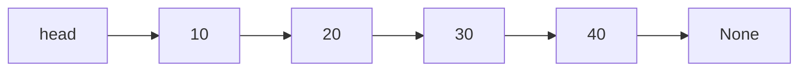

import DataCampExercise from "../../../../components/DataCampExercise.astro";


import ProblemLadder from "../../../../components/dsa/ProblemLadder.astro";


import Quiz from "../../../../components/Quiz.astro";

A Python `list` is a contiguous array under the hood — fast random access, slow
insertion in the middle. A **linked list** flips that trade-off: no random
access, but $O(1)$ insertion or deletion once you're holding the right node.
Interviewers love linked lists because they test whether you can manipulate
raw pointers correctly, not just call a library function.

## What you'll learn

- Singly vs doubly linked lists, and the `Node` class that builds both.
- Why arrays win on cache locality but linked lists win on $O(1)$ splice.
- Iterative traversal, and the classic **iterative reversal** pointer dance.
- **Floyd's Tortoise and Hare** cycle detection, in $O(n)$ time and $O(1)$ space.
- Merging two sorted linked lists — the building block behind merge sort.

## The cue

:::tip[Reach for a linked list when…]
- You insert or delete at a position you **already hold a reference to** — that
  is genuinely $O(1)$, with no shifting.
- The structure must grow without reallocating, or you are splicing whole
  sublists.
- You are implementing something else that needs $O(1)$ removal from the middle:
  an LRU cache, a free list, an adjacency list.

Be honest about the caveat: **finding** that position is still $O(n)$, and a
linked list has no locality, so an array usually wins in practice. In interviews
linked lists appear less because they are useful and more because pointer
manipulation is hard to fake — which is exactly why they are worth drilling.

**Reach for something else** when you need indexed access (array), or when you
only push and pop at the ends (`collections.deque` gives $O(1)$ both ends with
far better constants).
:::

## Why a linked list at all

A Python `list` (really a dynamic array) gives you $O(1)$ index access but
$O(n)$ insertion/deletion anywhere except the end, because every element after
the insertion point has to shift. A linked list stores each value in its own
**node**, plus a pointer to the next node. Nothing shifts — you just rewire a
couple of pointers.



The cost: to reach the 4th node you must walk through the first three — there
is no `list[3]`-style jump. Traversal is always $O(n)$.

## The `Node` class and a singly linked list

```python title="singly_linked_list.py" showLineNumbers{1}
class Node:
    def __init__(self, value, next=None):
        self.value = value
        self.next = next


class SinglyLinkedList:
    def __init__(self):
        self.head = None

    def append(self, value):
        node = Node(value)
        if self.head is None:
            self.head = node
            return
        cur = self.head
        while cur.next is not None:
            cur = cur.next
        cur.next = node

    def to_list(self):
        out = []
        cur = self.head
        while cur is not None:
            out.append(cur.value)
            cur = cur.next
        return out


ll = SinglyLinkedList()
for v in [10, 20, 30, 40]:
    ll.append(v)

print("traversal:", ll.to_list())
```

## Doubly linked lists: pointers both ways

A doubly linked list adds a `prev` pointer, so you can walk backward and
delete a node in $O(1)$ **given a reference to it** (no need to find its
predecessor first).

```python title="doubly_linked_list.py" showLineNumbers{1}
class DNode:
    def __init__(self, value, prev=None, next=None):
        self.value = value
        self.prev = prev
        self.next = next


class DoublyLinkedList:
    def __init__(self):
        self.head = None
        self.tail = None

    def append(self, value):
        node = DNode(value)
        if self.head is None:
            self.head = self.tail = node
            return
        node.prev = self.tail
        self.tail.next = node
        self.tail = node

    def forward(self):
        out, cur = [], self.head
        while cur is not None:
            out.append(cur.value)
            cur = cur.next
        return out

    def backward(self):
        out, cur = [], self.tail
        while cur is not None:
            out.append(cur.value)
            cur = cur.prev
        return out


dll = DoublyLinkedList()
for v in [1, 2, 3]:
    dll.append(v)

print("forward: ", dll.forward())
print("backward:", dll.backward())
```

:::tip[Python's own deque]
`collections.deque` is a production-grade doubly linked list (technically a
block-linked list) giving $O(1)$ append/pop on **both** ends. Reach for it
whenever you need a queue or a sliding window — don't hand-roll one for
real code.
:::

## Reversing a list: the pointer dance

Reversal is the single most common linked-list interview question. No new
nodes are allocated — you just walk the list once, flipping each `next`
pointer to point backward.

```p5 title="Pointer surgery: reversing a linked list" desc="Each step flips one next pointer to point backward instead of forward — no node ever moves, only the arrows change direction." height="340"
let values = [1, 2, 3, 4];
let n = values.length;
let step = 0;          // how many links have been flipped so far
let lastTime = 0;
let stepDelay = 900;

function setup() {
  createCanvas(600, 300);
  textFont("monospace");
}

function draw() {
  background(13, 17, 23);

  if (millis() - lastTime > stepDelay) {
    lastTime = millis();
    step = (step + 1) % (n + 1);
  }

  const boxW = 64, boxH = 44, gap = 46;
  const totalW = n * boxW + (n - 1) * gap;
  const startX = (width - totalW) / 2;
  const y = height / 2;

  for (let i = 0; i < n; i++) {
    const x = startX + i * (boxW + gap);

    if (i < step) fill(255, 123, 114);
    else fill(75, 139, 190);
    noStroke();
    rect(x, y - boxH / 2, boxW, boxH, 8);

    fill(255);
    textAlign(CENTER, CENTER);
    textSize(16);
    text(values[i], x + boxW / 2, y);

    if (i < n - 1) {
      const x1 = x + boxW;
      const x2 = x + boxW + gap;
      const reversed = i < step;

      if (!reversed) {
        stroke(140, 150, 160);
        strokeWeight(2);
        line(x1, y, x2, y);
        line(x2, y, x2 - 8, y - 5);
        line(x2, y, x2 - 8, y + 5);
      } else {
        stroke(255, 171, 90);
        strokeWeight(2);
        noFill();
        const midX = (x1 + x2) / 2;
        const arcY = y - 34;
        bezier(x2, y, midX, arcY, midX, arcY, x1, y);
        line(x1, y, x1 + 9, y - 6);
        line(x1, y, x1 + 9, y + 6);
      }
      noStroke();
    }
  }

  fill(180);
  textAlign(CENTER, TOP);
  textSize(12);
  let label;
  if (step === 0) label = "original: 1 -> 2 -> 3 -> 4 -> None";
  else if (step === n) label = "fully reversed: 4 -> 3 -> 2 -> 1 -> None";
  else label = "flipping link " + step + " of " + (n - 1) + " (prev/curr walk forward together)";
  text(label, width / 2, 14);
}
```

```python title="reverse_linked_list.py" showLineNumbers{1}
class Node:
    def __init__(self, value, next=None):
        self.value = value
        self.next = next


def build(values):
    head = tail = None
    for v in values:
        node = Node(v)
        if head is None:
            head = tail = node
        else:
            tail.next = node
            tail = node
    return head


def to_list(head):
    out = []
    while head is not None:
        out.append(head.value)
        head = head.next
    return out


def reverse_iterative(head):
    prev = None
    curr = head
    while curr is not None:
        nxt = curr.next     # save the rest of the list before we overwrite it
        curr.next = prev    # flip this node's pointer backward
        prev = curr         # prev advances to curr
        curr = nxt          # curr advances to the node we saved
    return prev              # prev ends up as the new head


head = build([1, 2, 3, 4, 5])
print("before:", to_list(head))
new_head = reverse_iterative(head)
print("after: ", to_list(new_head))
```

Three variables (`prev`, `curr`, `nxt`), one pass, zero extra allocation:
$O(n)$ time, $O(1)$ space.

## Detecting a cycle: Floyd's Tortoise and Hare

If a buggy `next` pointer (or an intentional circular structure) loops back
on itself, naive traversal never terminates. Two pointers moving at different
speeds solve it without any extra memory: if there's a cycle, the fast
pointer eventually **laps** the slow one.

```python title="cycle_detection.py" showLineNumbers{1}
class Node:
    def __init__(self, value, next=None):
        self.value = value
        self.next = next


def build_with_cycle(values, cycle_at=None):
    nodes = [Node(v) for v in values]
    for i in range(len(nodes) - 1):
        nodes[i].next = nodes[i + 1]
    if cycle_at is not None:
        nodes[-1].next = nodes[cycle_at]   # last node points back into the list
    return nodes[0]


def has_cycle(head):
    slow = fast = head
    while fast is not None and fast.next is not None:
        slow = slow.next          # moves 1 step
        fast = fast.next.next     # moves 2 steps
        if slow is fast:           # they met -- must be a cycle
            return True
    return False


clean = build_with_cycle([1, 2, 3, 4])
looped = build_with_cycle([1, 2, 3, 4], cycle_at=1)   # 4 -> back to node at index 1

print("clean list has cycle: ", has_cycle(clean))
print("looped list has cycle:", has_cycle(looped))
```

:::note[Why they always meet]
If a cycle exists, once the slow pointer enters it the fast pointer is at
most one lap ahead and gains one position on the slow pointer every step
(closing the gap by 1 each iteration) — so it's guaranteed to land on the
slow pointer within one full lap of the cycle.
:::

## Merging two sorted linked lists

The core routine behind linked-list merge sort: walk both lists once,
always taking the smaller head, and re-link nodes — no new nodes are ever
created.

```python title="merge_two_sorted_lists.py" showLineNumbers{1}
class Node:
    def __init__(self, value, next=None):
        self.value = value
        self.next = next


def build(values):
    head = tail = None
    for v in values:
        node = Node(v)
        if head is None:
            head = tail = node
        else:
            tail.next = node
            tail = node
    return head


def to_list(head):
    out = []
    while head is not None:
        out.append(head.value)
        head = head.next
    return out


def merge_sorted(a, b):
    dummy = Node(0)   # placeholder so we never special-case an empty result
    tail = dummy
    while a is not None and b is not None:
        if a.value <= b.value:
            tail.next = a
            a = a.next
        else:
            tail.next = b
            b = b.next
        tail = tail.next
    tail.next = a if a is not None else b   # attach whatever's left
    return dummy.next


a = build([1, 3, 5])
b = build([2, 4, 6, 8])
print("merged:", to_list(merge_sorted(a, b)))
```

## Time and space complexity

| Operation | Linked list | Python `list` (array) |
| --------- | ----------- | ---------------------- |
| Access by index | $O(n)$ | $O(1)$ |
| Search by value | $O(n)$ | $O(n)$ |
| Insert/delete at head | $O(1)$ | $O(n)$ |
| Insert/delete at tail (tracked) | $O(1)$ | $O(1)$ amortized |
| Insert/delete given a node reference | $O(1)$ | $O(n)$ |
| Auxiliary space per element | extra pointer(s) | none |

:::caution[Arrays usually win in practice anyway]
Big-O says linked lists tie or beat arrays almost everywhere except random
access. In real hardware, arrays are **cache-friendly** (contiguous memory,
the CPU prefetches ahead) while linked-list nodes scatter across the heap,
causing a cache miss on nearly every `.next` hop. Reach for a linked list
when you truly need $O(1)$ splice given a node reference (LRU caches, certain
graph adjacency structures) — not by default.
:::

## LeetCode problem set

Generated from the problem database, so each entry carries its sheet
membership and reported companies. Tick them off as you go — progress is
saved in this browser, and the Export button writes it to a file you can keep.

<ProblemLadder pattern="linked-lists"
  notes={{"21":"The dummy-head merge routine above","141":"Floyd's Tortoise and Hare, exactly as shown","206":"The iterative pointer dance above, from scratch"}} />

## Practice -- real LeetCode problems

Each exercise is the actual LeetCode problem with its real method signature and
LeetCode's own examples as the test. Write the body, press **Run**, and match the
expected output.

### LC 206 -- Reverse Linked List · Easy

**Problem.** Reverse a singly linked list and return the new head.

**Constraints.** `0 <= number of nodes <= 5000`, `-5000 <= Node.val <= 5000`.

**Examples.** `[1,2,3,4,5]` gives `[5,4,3,2,1]` · `[1,2]` gives `[2,1]` ·
`[]` gives `[]`

<DataCampExercise
  lang="python"
  hint={`Walk the list with three references: prev, current and the saved next. Each step: save current.next, point current.next at prev, then advance prev and current. Saving next BEFORE overwriting it is the whole trick -- otherwise you lose the rest of the list. Return prev, which ends up on the last node.`}
  code={`class ListNode:
    def __init__(self, val=0, next=None):
        self.val, self.next = val, next


def build_list(vals):
    d = ListNode(); t = d
    for v in vals:
        t.next = ListNode(v); t = t.next
    return d.next


def to_list(h):
    out = []
    while h:
        out.append(h.val); h = h.next
    return out


class Solution:
    def reverseList(self, head):
        # TODO: iterative, O(1) space.
        # Save next BEFORE you overwrite it, or the rest of the list is lost.
        # Return the node that ends up last.
        pass


sol = Solution()
cases = [[1, 2, 3, 4, 5], [1, 2], [], [1]]
print([to_list(sol.reverseList(build_list(c))) for c in cases])
# expect [[5, 4, 3, 2, 1], [2, 1], [], [1]]`}
  solution={`class ListNode:
    def __init__(self, val=0, next=None):
        self.val, self.next = val, next


def build_list(vals):
    d = ListNode(); t = d
    for v in vals:
        t.next = ListNode(v); t = t.next
    return d.next


def to_list(h):
    out = []
    while h:
        out.append(h.val); h = h.next
    return out


class Solution:
    def reverseList(self, head):
        prev = None
        while head:
            nxt = head.next        # save BEFORE overwriting
            head.next = prev       # flip the pointer
            prev = head            # advance prev
            head = nxt             # advance head
        return prev                # prev is now the new head


sol = Solution()
cases = [[1, 2, 3, 4, 5], [1, 2], [], [1]]
print([to_list(sol.reverseList(build_list(c))) for c in cases])`}
  sct={`test_output_contains("[[5, 4, 3, 2, 1], [2, 1], [], [1]]")
success_msg("Save, flip, advance, advance -- four lines in a fixed order.")
`}
  height={330}
/>

<details>
<summary>Editorial</summary>

Three references and a fixed order of operations. `prev` trails behind, `head`
walks forward, and `nxt` preserves the link you are about to destroy.

**Time** $O(n)$. **Space** $O(1)$.

The empty-list case works with no guard: the loop never runs and `prev` is already
`None`, which is the correct answer. That is a small sign the design is right.

The recursive version is elegant but $O(n)$ stack: reverse the tail, then attach
`head` to its end. At 5000 nodes that is within Python's default limit, but only
just -- worth mentioning.

This is the core operation behind
[In-place Linked List Reversal](../../phase-08-patterns-linked-lists/in-place-linked-list-reversal/),
where the same four lines reverse a *segment* rather than the whole list.

**Follow-ups:** "Reverse only positions `m..n` (LC 92)?" -- the same loop, anchored
by a dummy head. "Reverse in groups of `k` (LC 25)?" -- count `k` ahead, reverse,
relink, repeat. "Recursively?" -- have it ready, and mention the stack cost.

</details>

### LC 203 -- Remove Linked List Elements · Easy

**Problem.** Remove every node whose value equals `val`, and return the new head.

**Constraints.** `0 <= number of nodes <= 10^4`, `1 <= Node.val <= 50`,
`0 <= val <= 50`.

**Examples.** `[1,2,6,3,4,5,6], val = 6` gives `[1,2,3,4,5]` ·
`[7,7,7,7], val = 7` gives `[]`

<DataCampExercise
  lang="python"
  hint={`Use a dummy node pointing at the head so removing the first node needs no special case. Keep prev and curr; when curr matches, unlink it with prev.next = curr.next and leave prev where it is. Only advance prev when you KEEP a node -- otherwise consecutive matches survive.`}
  code={`class ListNode:
    def __init__(self, val=0, next=None):
        self.val, self.next = val, next


def build_list(vals):
    d = ListNode(); t = d
    for v in vals:
        t.next = ListNode(v); t = t.next
    return d.next


def to_list(h):
    out = []
    while h:
        out.append(h.val); h = h.next
    return out


class Solution:
    def removeElements(self, head, val):
        # TODO: a dummy head makes removing the first node ordinary.
        # Advance prev ONLY when you keep a node, or runs of matches survive.
        pass


sol = Solution()
cases = [([1, 2, 6, 3, 4, 5, 6], 6), ([], 1), ([7, 7, 7, 7], 7), ([1, 2], 3)]
print([to_list(sol.removeElements(build_list(a), v)) for a, v in cases])
# expect [[1, 2, 3, 4, 5], [], [], [1, 2]]`}
  solution={`class ListNode:
    def __init__(self, val=0, next=None):
        self.val, self.next = val, next


def build_list(vals):
    d = ListNode(); t = d
    for v in vals:
        t.next = ListNode(v); t = t.next
    return d.next


def to_list(h):
    out = []
    while h:
        out.append(h.val); h = h.next
    return out


class Solution:
    def removeElements(self, head, val):
        dummy = ListNode(0, head)      # gives the head a predecessor
        prev, curr = dummy, head
        while curr:
            if curr.val == val:
                prev.next = curr.next  # unlink; prev does NOT move
            else:
                prev = curr            # keep it, so prev advances
            curr = curr.next
        return dummy.next


sol = Solution()
cases = [([1, 2, 6, 3, 4, 5, 6], 6), ([], 1), ([7, 7, 7, 7], 7), ([1, 2], 3)]
print([to_list(sol.removeElements(build_list(a), v)) for a, v in cases])`}
  sct={`test_output_contains("[[1, 2, 3, 4, 5], [], [], [1, 2]]")
success_msg("prev advances only on a keep -- that single rule handles consecutive matches.")
`}
  height={330}
/>

<details>
<summary>Editorial</summary>

The [dummy head](../../phase-08-patterns-linked-lists/dummy-head-rewiring-and-merging/)
gives the real head a predecessor, so deleting it is no different from deleting any
other node -- no `if node is head` branch anywhere.

**Time** $O(n)$. **Space** $O(1)$.

The rule that matters: **`prev` advances only in the `else` branch.** After
unlinking, `prev` is the predecessor of the *next* node, which may also need
removing. Advancing unconditionally means `[7,7,7,7]` leaves stray sevens behind --
that case must return `[]`.

**Follow-ups:** "Remove the `n`th node from the end (LC 19)?" -- two pointers with a
fixed gap, both starting at the dummy. "Remove duplicates from a sorted list
(LC 83 / LC 82)?" -- 83 keeps one of each; 82 removes every duplicated value, which
makes the dummy essential. "Recursively?" -- `head.next = removeElements(head.next,
val)`, returning `head.next` when it matches.

</details>

### LC 876 -- Middle of the Linked List · Easy

**Problem.** Return the middle node. If there are two middle nodes, return the
**second** one.

**Constraints.** `1 <= number of nodes <= 100`.

**Examples.** `[1,2,3,4,5]` gives the node `3` · `[1,2,3,4,5,6]` gives the node
`4`

:::note[Why the test prints a list]
The problem returns a **node**, so the test prints that node and everything after
it -- which is how LeetCode itself displays the answer, and it confirms you returned
the node rather than a copied value.
:::

<DataCampExercise
  lang="python"
  hint={`Fast and slow pointers, both starting at the head. Advance slow one step and fast two steps while fast and fast.next both exist. When fast runs off the end, slow is at the middle -- and this exact loop condition returns the SECOND middle for even lengths, which is what the problem asks for.`}
  code={`class ListNode:
    def __init__(self, val=0, next=None):
        self.val, self.next = val, next


def build_list(vals):
    d = ListNode(); t = d
    for v in vals:
        t.next = ListNode(v); t = t.next
    return d.next


def to_list(h):
    out = []
    while h:
        out.append(h.val); h = h.next
    return out


class Solution:
    def middleNode(self, head):
        # TODO: fast and slow pointers, both from the head.
        # The loop condition decides which middle you get for even lengths --
        # this problem wants the SECOND one.
        pass


sol = Solution()
cases = [[1, 2, 3, 4, 5], [1, 2, 3, 4, 5, 6], [1], [1, 2]]
print([to_list(sol.middleNode(build_list(c))) for c in cases])
# expect [[3, 4, 5], [4, 5, 6], [1], [2]]`}
  solution={`class ListNode:
    def __init__(self, val=0, next=None):
        self.val, self.next = val, next


def build_list(vals):
    d = ListNode(); t = d
    for v in vals:
        t.next = ListNode(v); t = t.next
    return d.next


def to_list(h):
    out = []
    while h:
        out.append(h.val); h = h.next
    return out


class Solution:
    def middleNode(self, head):
        slow = fast = head
        while fast and fast.next:      # this form gives the SECOND middle
            slow, fast = slow.next, fast.next.next
        return slow


sol = Solution()
cases = [[1, 2, 3, 4, 5], [1, 2, 3, 4, 5, 6], [1], [1, 2]]
print([to_list(sol.middleNode(build_list(c))) for c in cases])`}
  sct={`test_output_contains("[[3, 4, 5], [4, 5, 6], [1], [2]]")
success_msg("The loop condition alone decides which of the two middles you land on.")
`}
  height={310}
/>

<details>
<summary>Editorial</summary>

If `fast` moves twice as fast as `slow`, then when `fast` reaches the end `slow` has
covered half the distance.

**Time** $O(n)$, one pass. **Space** $O(1)$.

The loop condition is the whole subtlety, and it is worth memorising both forms:

- **`while fast and fast.next`** -- `slow` lands on the **second** middle of an even
  list. `[1,2]` returns node `2`. This is what LC 876 wants.
- **`while fast.next and fast.next.next`** -- `slow` lands on the **first** middle,
  i.e. the end of the first half. That is what you want when **splitting** a list,
  as in [Reorder List](../../phase-08-patterns-linked-lists/copy-flatten-and-reorder/)
  and merge sort.

Choosing the wrong one is a common source of off-by-one bugs in list problems, and
the two-element case is the fastest way to tell them apart.

**Follow-ups:** "Return the first middle instead?" -- switch conditions. "Detect a
cycle (LC 141)?" -- same pointers; they meet if a cycle exists. "Find the cycle's
start (LC 142)?" -- after they meet, reset one to the head and step both by one.

</details>

## Dry run

**Deleting a node given only a pointer to it** (LC 237) — the problem that shows
what a singly linked list can and cannot do.

You cannot reach the *previous* node, so you cannot unlink the target. The trick
is to stop trying: copy the successor's value into the target, then unlink the
successor instead.

| step | list | note |
| --- | --- | --- |
| start | `4 → 5 → 1 → 9`, delete node `5` | no access to `4` |
| copy value | `4 → 1 → 1 → 9` | `5` became `1` |
| unlink next | `4 → 1 → 9` | the *second* `1` is gone |

The observable result is correct. Two things to say out loud: the node object
you were given still exists (a different one was freed), and **this cannot work
on the tail**, because there is no successor to copy from — which is why the
problem guarantees the node is not last.

:::caution[Always draw the pointers before writing the code]
Every linked-list bug is an ordering bug: overwriting `cur.next` before saving
it, or advancing a pointer before using it. Three boxes and three arrows on paper
takes fifteen seconds and prevents almost all of them. Do it in the interview,
visibly — it also shows the interviewer your reasoning.
:::

## The variant map

| Technique | What it solves | Pattern page |
| --- | --- | --- |
| **Dummy head** | removes every special case at the head | [Dummy Head Rewiring](../../phase-08-patterns-linked-lists/dummy-head-rewiring-and-merging/) |
| **Fast and slow pointers** | middle, cycle detection, `n`-th from the end | [Fast and Slow Pointers](../../phase-08-patterns-linked-lists/fast-and-slow-pointers/) |
| **Three-pointer reversal** | reverse all or part of a list in place | [In-place Reversal](../../phase-08-patterns-linked-lists/in-place-linked-list-reversal/) |
| **Doubly linked + hash map** | $O(1)$ removal from the middle | [Design LRU](../../phase-14-design-problems/design-lru-and-lfu-caches/) |

Those four cover essentially every linked-list interview question. This page is
the structure; Phase 08 is the techniques.

## Interview follow-ups

| They ask | What they're checking | The answer |
| --- | --- | --- |
| "When is a linked list actually better than an array?" | Honest judgement | When you already hold the node and splice frequently — LRU caches, free lists. For iteration or indexing, the array wins on locality |
| "Find the middle in one pass" | Whether you know the idiom | Fast and slow pointers; `slow` lands on the middle when `fast` reaches the end |
| "Detect a cycle in $O(1)$ space" | Whether you know Floyd's | Tortoise and hare. A hash set of visited nodes also works but costs $O(n)$ space, and the $O(1)$ requirement is the point |
| "Why does your solution need a dummy head?" | Whether you can justify it | Because the head may itself be removed or replaced. The dummy gives the previous pointer somewhere to stand, deleting a branch |
| "Reverse in $O(1)$ space" | Pointer fluency | Three pointers — `prev`, `cur`, `nxt`. Save `next` *first*; the order of the four assignments is the whole problem |
| "What is the space cost versus an array?" | Practical detail | A pointer per node — 8 bytes on 64-bit, plus per-object overhead in Python. For small values that can be several times the payload |

## Self-check

<Quiz
  title="Linked lists — self-check"
  questions={[
    {
      q: "Insertion in a linked list is O(1). What does that claim omit?",
      options: [
        "Nothing — insertion is simply O(1)",
        "That you must already hold a reference to the position; FINDING it is O(n)",
        "That it only applies to doubly linked lists",
        "That it requires extra memory",
      ],
      answer: 1,
      explain: "This is the honest framing, and interviewers probe it. Insert-after-a-known-node is O(1); insert-at-index-k is O(k). Conflating the two is how people over-recommend linked lists.",
    },
    {
      q: "Given only a pointer to a middle node, how do you delete it from a singly linked list?",
      options: [
        "Traverse from the head to find the previous node",
        "Copy the successor's value into this node, then unlink the successor",
        "Set the node to None",
        "It is impossible",
      ],
      answer: 1,
      explain: "You cannot reach the predecessor, so stop trying to unlink this node and unlink the next one instead. It fails on the tail, which is why LC 237 guarantees the node is not last.",
    },
    {
      q: "Why does a dummy head simplify list-building and deletion code?",
      options: [
        "It makes the list circular",
        "It gives the 'previous' pointer somewhere to stand even when the real head is removed or replaced, deleting the head special case",
        "It speeds up traversal",
        "It prevents cycles",
      ],
      answer: 1,
      explain: "Every bug in this family lives at the head. With a dummy, tail.next = x is unconditionally correct and the answer is just dummy.next.",
    },
    {
      q: "In the three-pointer reversal, why must nxt be saved before flipping cur.next?",
      options: [
        "For readability",
        "Because flipping cur.next overwrites the only reference to the rest of the list, making it unreachable",
        "To handle the empty list",
        "It does not have to be saved first",
      ],
      answer: 1,
      explain: "One assignment out of order and the tail of the list is orphaned. This is why the reversal needs three pointers rather than two, and why drawing the arrows first prevents the bug.",
    },
  ]}
/>

## Recall card

- **Use when** — $O(1)$ splice at a node you already hold: LRU caches, free
  lists, adjacency lists.
- **Costs** — access by index $O(n)$; insert/delete at a held node $O(1)$;
  space is one pointer per node plus object overhead.
- **Honest caveat** — *finding* the position is $O(n)$, and there is no cache
  locality. Arrays usually win in practice.
- **Four techniques cover everything** — dummy head, fast/slow pointers,
  three-pointer reversal, doubly-linked plus hash map.
- **Always draw the pointers first.** Every bug here is an ordering bug.

## Recap

- Nodes + pointers trade array cache-locality for $O(1)$ splice **given a
  node reference** — traversal is always $O(n)$, there's no random access.
- Reversal is pure pointer rewiring: `prev`, `curr`, `nxt`, one pass, $O(1)$
  space.
- Floyd's Tortoise and Hare detects a cycle in $O(n)$ time and $O(1)$ space —
  no visited-set required.
- Merging two sorted lists is $O(n + m)$ and re-links existing nodes instead
  of allocating new ones.

Next: **Hash Tables** — trading the linked list's sequential walk for
average-$O(1)$ lookup by key.

