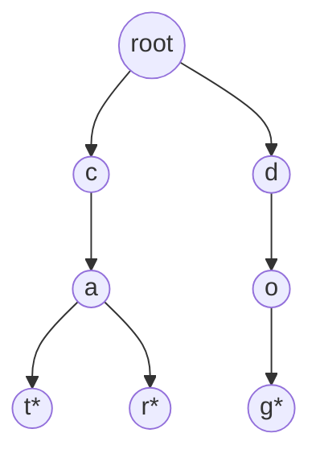

import DataCampExercise from "../../../../components/DataCampExercise.astro";

import TrieView from "../../../../components/viz/TrieView.tsx";


import ProblemLadder from "../../../../components/dsa/ProblemLadder.astro";


import Quiz from "../../../../components/Quiz.astro";

A **trie** (say "try", from re**trie**val) is a tree specialized for one job:
storing a set of strings so that **prefix** operations — "does any word start
with `pre`?" — are as fast as looking up a single word.

## What you'll learn

- The trie shape: each node is a map of `character -> child node`, plus an
  `is_end` flag.
- Why insert/search/`startsWith` are all $O(L)$ — where `L` is the length of
  the word, **not** the number of words stored.
- The memory tradeoff: tries trade space for that prefix speed.
- A complete, runnable `Trie` class you can reuse directly.

## The cue

:::tip[Reach for a trie when…]
- The question is about **prefixes**: autocomplete, "does any word start with
  this", longest common prefix across a set.
- A search needs **early pruning** — one failed character lookup kills a whole
  branch for every candidate word simultaneously. That is why Word Search II is
  a trie problem.
- Keys are strings sharing structure, and you want lookup that is $O(L)$
  *independent of how many words are stored*.

Be honest about the boundary: for **exact membership only**, a hash set is as
fast, simpler and usually smaller. The trie earns its place the moment prefixes
matter — and if you cannot name a prefix requirement, you probably want the set.
:::

## Visual intuition

Characters live on **edges**, not in nodes, and every common prefix is stored
exactly once:

<TrieView
  client:visible
  words={["cat", "car", "card", "dog"]}
  query="car"
  title="Common prefixes are stored once, and lookup is O(length)"
  lib="prefix tree"
  desc="Watch the end-of-word markers. They are separate from 'has no children' for a reason: 'car' ends inside the path to 'card', so without the flag a trie could not tell a stored word from a mere prefix."
/>

## The shape of a trie

Instead of storing whole words, a trie stores them **letter by letter**,
sharing common prefixes as a single path. Insert `"cat"`, `"car"`, and
`"dog"` and you get:



`cat` and `car` share the `c -> a` path — the trie only branches where the
words actually differ. Nodes marked with `*` are **end-of-word** markers:
`cat` and `car` are complete words, but `c` and `ca` alone are just prefixes
that happen to be shared.

## Building it: a dict of children + an end flag

The simplest, most Pythonic trie node is just a `dict` mapping each character
to its child node, plus a boolean for "a word ends here":

```python title="trie_node.py" showLineNumbers{1}
class TrieNode:
    def __init__(self):
        self.children = {}     # char -> TrieNode
        self.is_end = False    # True if a word ends at this node


# Manually build the cat/car/dog trie from the diagram
root = TrieNode()
for word in ["cat", "car", "dog"]:
    node = root
    for ch in word:
        if ch not in node.children:
            node.children[ch] = TrieNode()
        node = node.children[ch]
    node.is_end = True

# Walk down "ca" and see both children waiting
ca_node = root.children["c"].children["a"]
print("children after 'ca':", sorted(ca_node.children.keys()))
print("'ca' itself a full word?", ca_node.is_end)
```

## A complete, reusable `Trie` class

Wrap that pattern into insert/search/`startsWith` — the exact three methods
LeetCode's "Implement Trie" problem asks for:

```python title="trie_class.py" showLineNumbers{1}
class TrieNode:
    def __init__(self):
        self.children = {}
        self.is_end = False


class Trie:
    def __init__(self):
        self.root = TrieNode()

    def insert(self, word):
        node = self.root
        for ch in word:
            if ch not in node.children:
                node.children[ch] = TrieNode()
            node = node.children[ch]
        node.is_end = True

    def _walk(self, prefix):
        """Return the node at the end of `prefix`, or None if it's absent."""
        node = self.root
        for ch in prefix:
            if ch not in node.children:
                return None
            node = node.children[ch]
        return node

    def search(self, word):
        node = self._walk(word)
        return node is not None and node.is_end

    def starts_with(self, prefix):
        return self._walk(prefix) is not None


trie = Trie()
for word in ["cat", "car", "dog", "do"]:
    trie.insert(word)

print("search 'cat':      ", trie.search("cat"))       # True -- full word
print("search 'ca':       ", trie.search("ca"))        # False -- only a prefix
print("starts_with 'ca':  ", trie.starts_with("ca"))   # True -- cat/car both start with ca
print("starts_with 'do':  ", trie.starts_with("do"))   # True
print("search 'dogs':     ", trie.search("dogs"))      # False -- never inserted
```

Every operation walks at most `L` characters — one hop per letter — so all
three run in $O(L)$, completely independent of how many other words share
the trie.

:::tip[The `is_end` vs `_walk` distinction]
`search` requires the walked node to be a real word ending (`is_end`).
`starts_with` only requires the path to **exist** — it doesn't care whether
that exact string is itself a complete word. Mixing these two up is the most
common trie bug.
:::

## The memory tradeoff

A trie's speed comes from **sharing prefixes**, but every distinct character
transition still needs its own node. Storing `n` words of average length `L`
costs up to $O(n \cdot L)$ nodes in the worst case (no shared prefixes at
all) — often more memory than just keeping the words in a `set` (which is
$O(n \cdot L)$ total characters, but with far less per-character overhead
from Python object/dict headers). The payoff is that prefix queries — "how
many words start with `pre`?", autocomplete, spell-check — are **not**
possible in $O(L)$ with a plain `set` at all; you'd have to scan every word.

:::note[Trie vs set/hash-map]
Use a `set`/`dict` when you only need **exact** membership (`"is this whole
word present?"`). Reach for a trie when you need **prefix-aware** queries —
autocomplete, "does any word start with X", or dictionary-constrained word
search — where the shared-prefix structure is doing real work for you.
:::

## Complexity at a glance

| Operation | Time | Notes |
| --- | --- | --- |
| `insert(word)` | $O(L)$ | `L` = length of `word` |
| `search(word)` | $O(L)$ | independent of `n` (word count) |
| `starts_with(prefix)` | $O(L)$ | same — the whole point of a trie |
| Space | up to $O(n \cdot L)$ | less if words share prefixes heavily |

## LeetCode problem set

Generated from the problem database, so each entry carries its sheet
membership and reported companies. Tick them off as you go — progress is
saved in this browser, and the Export button writes it to a file you can keep.

<ProblemLadder pattern="tries"
  notes={{"208":"Exactly the class built above","212":"Build a trie of the dictionary first, then DFS the board while walking the trie in lock-step, pruning any path the trie doesn't contain","648":"For each sentence word, walk a trie of \"roots\" and stop at the first `is_end` you hit — the shortest matching root replaces the word"}} />

## Practice -- real LeetCode problems

Each exercise is the actual LeetCode problem with its real method signature and
LeetCode's own examples as the test. Write the body, press **Run**, and match the
expected output.

### LC 720 -- Longest Word in Dictionary · Medium

**Problem.** Return the longest word in `words` such that **every prefix** of it is
also in `words`. If several tie, return the lexicographically smallest. If none
qualifies, return `""`.

**Constraints.** `1 <= len(words) <= 1000`, `1 <= len(words[i]) <= 30`, lowercase.

**Examples.** `["w","wo","wor","worl","world"]` gives `"world"` ·
`["a","banana","app","appl","ap","apply","apple"]` gives `"apple"` ·
`["abc","bc"]` gives `""`

<DataCampExercise
  lang="python"
  hint={`A word qualifies only if every one of its proper prefixes is also present. Put the words in a set for O(1) membership, then iterate in SORTED order so the lexicographically smallest candidate is seen first -- which means you only replace the best answer when a word is STRICTLY longer. Check prefixes with w[:i] for i in range(1, len(w)).`}
  code={`class Solution:
    def longestWord(self, words):
        # TODO: a word qualifies only if EVERY proper prefix is also a word.
        # Iterate in sorted order so ties resolve lexicographically, then
        # only replace the answer on a STRICTLY longer word.
        pass


sol = Solution()
cases = [["w", "wo", "wor", "worl", "world"],
         ["a", "banana", "app", "appl", "ap", "apply", "apple"],
         ["abc", "bc"], ["a"]]
print([sol.longestWord(list(c)) for c in cases])
# expect ['world', 'apple', '', 'a']`}
  solution={`class Solution:
    def longestWord(self, words):
        present = set(words)                    # O(1) prefix membership
        best = ""
        for w in sorted(words):                 # lexicographic order
            if all(w[:i] in present for i in range(1, len(w))):
                if len(w) > len(best):          # STRICTLY longer only
                    best = w
        return best


sol = Solution()
cases = [["w", "wo", "wor", "worl", "world"],
         ["a", "banana", "app", "appl", "ap", "apply", "apple"],
         ["abc", "bc"], ["a"]]
print([sol.longestWord(list(c)) for c in cases])`}
  sct={`test_output_contains("['world', 'apple', '', 'a']")
success_msg("Sorted iteration plus a strict length comparison resolves the tie-break for free.")
`}
  height={300}
/>

<details>
<summary>Editorial</summary>

Two requirements interact: **length** (longest wins) and **order** (lexicographically
smallest breaks ties). Iterating in sorted order and only replacing on a *strictly*
longer word satisfies both -- among equal-length candidates the first one seen is
the smallest, and it is never displaced.

**Time** $O(\sum |w|)$ roughly -- each word's prefixes are checked once, plus
$O(n \log n)$ for the sort. **Space** $O(\sum |w|)$ for the set.

`["a","banana","app","appl","ap","apply","apple"]` is the discriminating case:
`"apply"` and `"apple"` both qualify at length 5, and the answer is `"apple"`
because it sorts first. Using `>=` instead of `>` would return `"apply"`.

`["abc","bc"]` gives `""` -- `"abc"` needs `"a"` and `"ab"`, neither present.

**The trie version** is the more idiomatic answer for this page: insert every word,
then DFS from the root, descending only into children that are themselves complete
words. That naturally explores only valid prefix chains, and visiting children in
alphabetical order gives the tie-break for free. It is $O(\sum |w|)$ with no sort.

**Follow-ups:** "Do it with a trie?" -- as above; the expected answer if the
interviewer is testing this page's structure. "Longest word built from *other*
words (LC 472)?" -- different: concatenation rather than prefixes, needing DP.
"Why sort?" -- for the tie-break; a trie replaces it with ordered child traversal.

</details>

### LC 677 -- Map Sum Pairs · Medium

**Problem.** Implement `MapSum` with `insert(key, val)` and `sum(prefix)`, which
returns the total of all values whose keys start with `prefix`. Inserting an
existing key **overwrites** its value.

**Constraints.** `1 <= len(key), len(prefix) <= 50`, `1 <= val <= 1000`, up to
`50` calls.

**Examples.** `insert("apple", 3)`, `sum("ap")` gives `3`, `insert("app", 2)`,
`sum("ap")` gives `5`, `insert("apple", 1)`, `sum("ap")` gives `3`

<DataCampExercise
  lang="python"
  hint={`Keep a plain dict from key to value -- and note that insert must OVERWRITE, not add to, an existing key. For sum, add up the values of every key that startswith the prefix. That is O(number of keys) per query, which is fine at these constraints; a trie storing a running total per node would make it O(len(prefix)).`}
  code={`class MapSum:
    def __init__(self):
        # TODO: a dict from key to value is enough at these constraints.
        pass

    def insert(self, key, val):
        # TODO: OVERWRITE an existing key rather than accumulating.
        pass

    def sum(self, prefix):
        # TODO: total the values of all keys starting with prefix.
        pass


m = MapSum()
out = []
m.insert("apple", 3)
out.append(m.sum("ap"))     # 3
m.insert("app", 2)
out.append(m.sum("ap"))     # 5
m.insert("apple", 1)        # overwrite 3 with 1
out.append(m.sum("ap"))     # 3
out.append(m.sum("zz"))     # 0
print(out)   # expect [3, 5, 3, 0]`}
  solution={`class MapSum:
    def __init__(self):
        self.values = {}

    def insert(self, key, val):
        self.values[key] = val          # OVERWRITE, do not accumulate

    def sum(self, prefix):
        return sum(v for k, v in self.values.items() if k.startswith(prefix))


m = MapSum()
out = []
m.insert("apple", 3)
out.append(m.sum("ap"))
m.insert("app", 2)
out.append(m.sum("ap"))
m.insert("apple", 1)
out.append(m.sum("ap"))
out.append(m.sum("zz"))
print(out)`}
  sct={`test_output_contains("[3, 5, 3, 0]")
success_msg("Overwrite semantics are the trap -- and they are exactly what breaks a naive trie of running sums.")
`}
  height={330}
/>

<details>
<summary>Editorial</summary>

At only 50 calls with keys up to 50 characters, a dict plus a linear scan is
comfortably fast and obviously correct. Start there.

**Time** $O(1)$ insert, $O(\text{keys} \times |\text{prefix}|)$ per sum.
**Space** $O(\text{total key length})$.

The **overwrite** rule is the real content. `insert("apple", 1)` after
`insert("apple", 3)` must replace the 3, so `sum("ap")` drops from 5 to 3. A
solution that adds to the existing value returns 6.

That rule is also what makes the obvious trie optimisation subtle. If each trie node
stores a running total along the path, an overwrite must propagate the **delta**
(`new - old`), not the new value -- which means you must remember the previous value
anyway:

```python
delta = val - self.values.get(key, 0)
self.values[key] = val
# then add `delta` to every node along the path
```

That gives $O(|\text{key}|)$ insert and $O(|\text{prefix}|)$ sum, independent of
how many keys are stored. Worth offering as the scaling answer, and the delta detail
is what an interviewer is listening for.

**Follow-ups:** "Make `sum` independent of the key count?" -- the trie with running
totals and delta updates. "Support deletion?" -- insert a value of 0, or subtract
the stored value along the path. "Sum over a key *range* rather than a prefix?" -- a
sorted structure or a Fenwick tree over sorted keys.

</details>

### LC 1268 -- Search Suggestions System · Medium

**Problem.** Given `products` and a `searchWord`, return, for each successive prefix
of `searchWord`, the **three** lexicographically smallest products sharing that
prefix.

**Constraints.** `1 <= len(products) <= 1000`, `1 <= len(searchWord) <= 1000`,
lowercase letters.

**Examples.** `products = ["mobile","mouse","moneypot","monitor","mousepad"]`,
`searchWord = "mouse"` gives
`[["mobile","moneypot","monitor"],["mobile","moneypot","monitor"],["mouse","mousepad"],["mouse","mousepad"],["mouse","mousepad"]]`

<DataCampExercise
  lang="python"
  hint={`Sort the products once, then for each prefix of searchWord collect the first three that start with it. Because the list is sorted, the first three matches ARE the three lexicographically smallest -- no further sorting needed. Slicing with [:3] handles the case where fewer than three match.`}
  code={`class Solution:
    def suggestedProducts(self, products, searchWord):
        # TODO: sort once, then for each prefix take the first three matches.
        # Sorted order means the first three ARE the smallest three.
        pass


sol = Solution()
print(sol.suggestedProducts(
    ["mobile", "mouse", "moneypot", "monitor", "mousepad"], "mouse"))
# expect [['mobile', 'moneypot', 'monitor'], ['mobile', 'moneypot', 'monitor'], ['mouse', 'mousepad'], ['mouse', 'mousepad'], ['mouse', 'mousepad']]`}
  solution={`class Solution:
    def suggestedProducts(self, products, searchWord):
        products.sort()                          # sorted once, up front
        out = []
        for i in range(1, len(searchWord) + 1):
            prefix = searchWord[:i]
            # sorted order -> the first three matches are the smallest three
            out.append([p for p in products if p.startswith(prefix)][:3])
        return out


sol = Solution()
print(sol.suggestedProducts(
    ["mobile", "mouse", "moneypot", "monitor", "mousepad"], "mouse"))`}
  sct={`test_output_contains("[['mobile', 'moneypot', 'monitor'], ['mobile', 'moneypot', 'monitor'], ['mouse', 'mousepad'], ['mouse', 'mousepad'], ['mouse', 'mousepad']]")
success_msg("Sorting once makes 'smallest three' the same as 'first three' -- no per-query sort.")
`}
  height={280}
/>

<details>
<summary>Editorial</summary>

Sorting up front converts "the three lexicographically smallest matches" into "the
first three matches", which a single scan plus a `[:3]` slice answers.

**Time** $O(n \log n)$ for the sort, then $O(n \times |\text{searchWord}|)$ for
the scans. **Space** $O(n)$.

`[:3]` handling short results is why the last three rows have only two entries --
`"mouse"` and `"mousepad"` are the only matches, and no padding is needed.

At these constraints the repeated scanning is fine. The two better approaches, both
worth naming:

- **Trie with cached suggestions.** Insert all products, and at each node store (up
  to) the three smallest words beneath it. Each query prefix is then an
  $O(|\text{prefix}|)$ walk with the answer already sitting at the node -- which is
  exactly the [autocomplete](../tries/) use case a trie exists for.
- **Two pointers over the sorted list.** Narrow a `[left, right]` window as the
  prefix grows, since matches for a longer prefix are always a sub-range of the
  matches for a shorter one. $O(n \log n)$ total with no re-scanning.

**Follow-ups:** "Do it with a trie?" -- the expected answer on this page; describe
the cached-suggestions node. "Return `k` suggestions instead of three?" -- change
the slice, and the cache size. "Products added dynamically?" -- the trie handles
inserts in $O(|\text{word}|)$, whereas re-sorting is $O(n \log n)$.

</details>

## Dry run

Inserting `cat`, `car`, `card`, `dog`, then searching:

| insert | new nodes | reused |
| --- | --- | --- |
| `cat` | `c`, `a`, `t` | — |
| `car` | `r` | `c`, `a` |
| `card` | `d` | `c`, `a`, `r` |
| `dog` | `d`, `o`, `g` | — |

Seven nodes for four words totalling thirteen characters — the shared prefixes
cost nothing after the first insertion.

Now the searches, which is where the end-of-word flag earns its keep:

| query | path exists? | `is_word` at the end? | result |
| --- | --- | --- | --- |
| `car` | yes | **yes** | found |
| `ca` | yes | **no** | *not* a stored word — only a prefix |
| `cars` | no `s` after `r` | — | not found, pruned at depth 4 |

The `ca` row is the whole point. Path existence and word existence are different
questions, and only the flag distinguishes them.

:::caution[is_word is not the same as "this node has no children"]
`car` terminates *inside* the path to `card`, so it has a child while still being
a complete word. Conflating leaf-ness with word-ness makes "is car a word"
unanswerable, and it is the most common trie bug.
:::

## The variant map

| Variant | Change | Canonical problem |
| --- | --- | --- |
| **Exact insert and search** | the base structure | 208 Implement Trie |
| **Wildcard `.`** | on `.`, branch into *every* child at that step | 211 Add and Search Word |
| **Grid search with pruning** | carry a trie node alongside the DFS position | 212 Word Search II |
| **Prefix counts** | store a counter per node, incremented on every insert | 1804 Implement Trie II |
| **Maximum XOR pair** | a *binary* trie over bits; greedily take the opposite bit | 421 Maximum XOR of Two Numbers |
| **Longest common prefix** | walk down while each node has exactly one child and is not a word end | 14 Longest Common Prefix |

:::note[The binary trie is the one people do not see coming]
For maximum-XOR problems, insert each number's 32 bits as a path. Then for each
number, walk down greedily preferring the *opposite* bit at every level — that
maximises the XOR one bit at a time, and it turns an $O(n^2)$ pairwise scan into
$O(32n)$. Same structure, entirely different-looking problem.
:::

## Pitfalls

- **Treating "no children" as "end of word".** Use an explicit flag; a word can
  terminate inside a longer word's path.
- **Using a trie where a hash set would do.** For exact membership only, the set
  is simpler and faster. Justify the trie with a prefix requirement.
- **Forgetting to delete matched words in LC 212.** A grid containing the same
  word twenty times re-explores it twenty times.
- **Fixed 26-slot arrays for non-lowercase input.** A `dict` handles any
  alphabet; the array is a constant-factor optimisation with a correctness risk.
- **Quoting the memory cost as $O(n)$.** It is $O(n \cdot L)$ worst case with no
  shared prefixes — real dictionaries share heavily, but state the bound.

## Interview follow-ups

| They ask | What they're checking | The answer |
| --- | --- | --- |
| "Why not a hash set?" | Judgement | A set cannot answer prefix queries without scanning every key. If no prefix question exists, use the set |
| "Space complexity?" | Precision | $O(n \cdot L)$ worst case — one node per character with no sharing. Far less in practice, but quote the bound |
| "Support a wildcard `.`" | Adaptability | On `.`, recurse into every child. Worst case becomes $O(26^{L})$ for an all-wildcard query, which is worth naming |
| "How does a trie speed up Word Search II?" | Whether you see the pruning | One failed child lookup kills the branch for *every* word at once, instead of once per word |
| "Delete a word" | Care | Unset the flag, then prune upward while a node has no children and is not itself a word end |
| "Maximum XOR of two numbers in an array" | Breadth | Binary trie over the bits; greedily prefer the opposite bit at each level. $O(32n)$ instead of $O(n^2)$ |

## Self-check

<Quiz
  title="Tries — self-check"
  questions={[
    {
      q: "Why is is_word a separate flag rather than 'this node has no children'?",
      options: [
        "For efficiency",
        "Because a word can terminate inside a longer word's path — 'car' inside 'card' — so it has children while still being complete",
        "To support deletion only",
        "It is redundant",
      ],
      answer: 1,
      explain: "Leaf-ness and word-ness are different properties. Conflating them makes 'is car a word' unanswerable and is the most common trie bug.",
    },
    {
      q: "For exact membership only, is a trie better than a hash set?",
      options: [
        "Yes — tries are always faster",
        "No — a hash set is as fast, simpler and usually smaller. The trie earns its place only when prefixes matter",
        "Yes, because tries use less memory",
        "They are identical",
      ],
      answer: 1,
      explain: "Being able to say when NOT to use the structure is worth as much as knowing how to build it. If you cannot name a prefix requirement, use the set.",
    },
    {
      q: "What is the space complexity of a trie holding n words of average length L?",
      options: [
        "O(n) — one node per word",
        "O(n · L) worst case, when no prefixes are shared — far less in practice",
        "O(L), independent of the word count",
        "O(n log L)",
      ],
      answer: 1,
      explain: "Quote the worst case, then note that real dictionaries share heavily. The sharing is the point of the structure, but it is not a bound.",
    },
    {
      q: "How would you find the maximum XOR of two numbers in an array using a trie?",
      options: [
        "Tries cannot help with XOR",
        "Build a binary trie over the bits, then for each number walk down greedily preferring the opposite bit at every level",
        "Sort the array and compare neighbours",
        "Insert the XOR of every pair",
      ],
      answer: 1,
      explain: "Preferring the opposite bit maximises the result one bit at a time, turning an O(n squared) pairwise scan into O(32n). Same structure, unrecognisably different problem.",
    },
  ]}
/>

## Recall card

- **Use when** — prefix queries, or a search that should prune dead branches
  early. **Not** for exact membership alone — that is a hash set.
- **Structure** — `children: dict[str, Node]` plus an `is_word` flag. Characters
  live on edges.
- **Costs** — insert and search $O(L)$, independent of the number of stored
  words. Space $O(n \cdot L)$ worst case.
- **`is_word` ≠ leaf.** A word can end inside a longer word's path.
- **Variants** — wildcard (branch into all children); grid search (carry the
  node alongside the DFS); binary trie over bits for maximum XOR.

## Recap

- A trie node is a `dict` of `character -> child` plus an `is_end` flag —
  that's the entire data structure.
- Insert, search, and `starts_with` are all $O(L)$: one hop per character,
  independent of how many words are stored.
- The cost is memory — shared prefixes save space, but divergent words each
  need their own node chain.
- Reach for a trie specifically when the problem needs **prefix-aware**
  queries; for plain exact-match membership, a `set` is simpler and often
  leaner.

Next: **Graph Representations** — adjacency lists, adjacency matrices, and
edge lists, the building blocks BFS/DFS run on top of.
