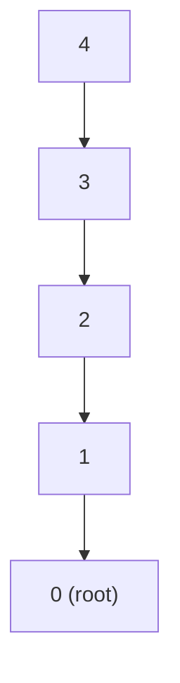

import DataCampExercise from "../../../../components/DataCampExercise.astro";

import DSUView from "../../../../components/viz/DSUView.tsx";


import ProblemLadder from "../../../../components/dsa/ProblemLadder.astro";


import Quiz from "../../../../components/Quiz.astro";

**Union-Find** (also called Disjoint Set Union, or DSU) answers one question
extremely fast, over and over: "are these two things in the same group?" It
underlies connected-components problems, Kruskal's minimum spanning tree, and
any "merge these into groups, then query membership" pattern — all with two
tiny operations: `find` and `union`.

## What you'll learn

- The parent-array representation of disjoint sets.
- **Path compression** — flattening a tree every time you `find` through it.
- **Union by rank/size** — always attaching the shorter tree under the taller.
- Why the combination is near $O(1)$ amortized: the inverse Ackermann
  function $\alpha(n)$.
- Counting connected components with a DSU.

## The problem: grouping things that get merged over time

Imagine friendships forming one pair at a time: "0 and 1 are friends," "1 and
2 are friends," and so on. At any point you want to answer "are `x` and `y`
in the same friend group?" in as close to $O(1)$ as possible — even though
the groups keep merging. That's exactly what DSU is built for.

## The naive version: a parent array

Each element starts as its own group (its own root). `find` walks up
`parent` pointers until it hits a node that is its own parent (the root).
`union` connects two groups by pointing one root at the other.

```python title="dsu_naive.py" showLineNumbers{1}
class NaiveUnionFind:
    def __init__(self, n):
        self.parent = list(range(n))   # each node starts as its own root

    def find(self, x):
        while self.parent[x] != x:      # walk up until we hit a root
            x = self.parent[x]
        return x

    def union(self, a, b):
        root_a, root_b = self.find(a), self.find(b)
        if root_a != root_b:
            self.parent[root_b] = root_a   # attach one tree under the other


uf = NaiveUnionFind(6)
uf.union(0, 1)
uf.union(1, 2)
uf.union(1, 3)
uf.union(1, 4)
uf.union(1, 5)   # always attaching the same way builds a long chain

print("parents:", uf.parent)
print("find(5):", uf.find(5))   # walks the whole chain -- O(n) worst case
```

This works, but nothing stops the tree from degenerating into a straight
line — `find` on the deepest node becomes $O(n)$.



## Path compression: flatten as you go

Every time `find` walks up to the root, path compression re-points every
node it passed **directly at the root**. The next `find` on any of those
nodes is then a single hop.

```mermaid title="After find(4) with path compression: every node points straight to the root"
graph TD
    R0["0 (root)"]
    N1["1"] --> R0
    N2["2"] --> R0
    N3["3"] --> R0
    N4["4"] --> R0
```

## Union by rank: never grow the chain on purpose

Path compression alone helps, but pairing it with **union by rank** (attach
the shallower tree under the deeper one, so tree height only grows when two
equally-tall trees merge) keeps trees flat from the start instead of
relying on repair after the fact.

```python title="dsu_optimized.py" showLineNumbers{1}
class UnionFind:
    def __init__(self, n):
        self.parent = list(range(n))
        self.rank = [0] * n
        self.count = n   # number of distinct components

    def find(self, x):
        if self.parent[x] != x:
            self.parent[x] = self.find(self.parent[x])   # path compression
        return self.parent[x]

    def union(self, a, b):
        root_a, root_b = self.find(a), self.find(b)
        if root_a == root_b:
            return False   # already in the same group

        # union by rank: attach the shorter tree under the taller one
        if self.rank[root_a] < self.rank[root_b]:
            root_a, root_b = root_b, root_a
        self.parent[root_b] = root_a
        if self.rank[root_a] == self.rank[root_b]:
            self.rank[root_a] += 1

        self.count -= 1
        return True


uf = UnionFind(7)
edges = [(0, 1), (1, 2), (3, 4), (5, 6), (2, 3)]
for a, b in edges:
    uf.union(a, b)

print("connected components:", uf.count)
print("0 and 4 connected?", uf.find(0) == uf.find(4))
print("0 and 5 connected?", uf.find(0) == uf.find(5))
```

## Counting connected components: Number of Provinces

A near drop-in application: given an adjacency matrix, union every connected
pair, then count the distinct roots.

```python title="count_provinces.py" showLineNumbers{1}
def count_provinces(is_connected):
    n = len(is_connected)
    parent = list(range(n))

    def find(x):
        if parent[x] != x:
            parent[x] = find(parent[x])
        return parent[x]

    def union(a, b):
        ra, rb = find(a), find(b)
        if ra != rb:
            parent[ra] = rb

    for i in range(n):
        for j in range(i + 1, n):
            if is_connected[i][j] == 1:
                union(i, j)

    return len({find(i) for i in range(n)})


matrix = [
    [1, 1, 0],
    [1, 1, 0],
    [0, 0, 1],
]
print("provinces:", count_provinces(matrix))
```

## Why it's (almost) O(1): the inverse Ackermann function

With **both** path compression and union by rank, a sequence of $m$ `find`
and `union` operations on $n$ elements costs:

$$
O(m \cdot \alpha(n))
$$

where $\alpha(n)$ is the **inverse Ackermann function** — it grows so slowly
that $\alpha(n) < 5$ for any $n$ you could ever actually construct (far
beyond the number of atoms in the observable universe). In practice, treat
`find` and `union` as $O(1)$.

## The cue

:::tip[Reach for union-find when…]
- The question is about **connectivity** and edges arrive **incrementally**:
  "are these two connected?", "how many groups are there?", "does adding this
  edge create a cycle?"
- You are grouping things by an equivalence relation — accounts by shared email,
  cells by adjacency, variables by equality constraints.
- You need Kruskal's minimum spanning tree, where the cycle check *is*
  union-find.

The decisive question versus BFS or DFS is **whether the graph is static**. A
traversal answers connectivity in $O(V + E)$ but must be re-run after every edge
insertion. Union-find handles insertions online, in effectively constant time
each.

**Reach for something else** when you need the actual *path* between two nodes
(union-find knows only that they are connected, not how), when edges are
**removed** (union-find cannot un-merge), or when the graph is static and you
need a traversal order anyway.
:::

## Visual intuition

A union-find structure is a forest of parent pointers. Watch the forest stay
shallow — that shallowness is the entire complexity argument:

<DSUView
  client:visible
  n={8}
  unions={[[0, 1], [2, 3], [1, 2], [4, 5], [6, 7], [5, 6], [0, 3]]}
  title="Small tree under large, and path compression flattening as it goes"
  lib="O(alpha(n)) amortised"
  desc="The last union finds both endpoints already share a root. That is not a wasted operation — it is exactly how union-find detects a cycle, and it is Kruskal's rejection test."
/>

## Time and space complexity

| Operation | Naive (no compression/rank) | Path compression + union by rank |
| --------- | ---------------------------- | ---------------------------------- |
| `find` | $O(n)$ worst case | $O(\alpha(n))$ amortized, effectively $O(1)$ |
| `union` | $O(n)$ worst case | $O(\alpha(n))$ amortized, effectively $O(1)$ |
| Space | $O(n)$ | $O(n)$ |

:::tip[You only need one of the two optimizations to pass most judges]
Path compression alone gives $O(\log n)$ amortized; union by rank alone gives
$O(\log n)$ worst case. Together they give the near-constant $\alpha(n)$
bound. In an interview, implementing path compression correctly is usually
enough — mention union by rank as the "and if I wanted the tight bound" add-on.
:::

## LeetCode problem set

Generated from the problem database, so each entry carries its sheet
membership and reported companies. Tick them off as you go — progress is
saved in this browser, and the Export button writes it to a file you can keep.

<ProblemLadder pattern="union-find-disjoint-set-union"
  notes={{"547":"Union every connected city, count distinct roots","684":"The first edge that connects two already-`find`- equal nodes is the extra one to remove","721":"Union accounts sharing an email, then group by root"}} />

## Practice -- real LeetCode problems

Each exercise is the actual LeetCode problem with its real method signature and
LeetCode's own examples as the test. Write the body, press **Run**, and match the
expected output.

### LC 990 -- Satisfiability of Equality Equations · Medium

**Problem.** Given equations of the form `"a==b"` or `"a!=b"` over single lowercase
letters, return `True` if some assignment of integers satisfies all of them.

**Constraints.** `1 <= len(equations) <= 500`, each string has length 4 and is
well-formed.

**Examples.** `["a==b","b!=a"]` gives `False` · `["b==a","a==b"]` gives `True` ·
`["a==b","b==c","a==c"]` gives `True` · `["a==b","b!=c","c==a"]` gives `False`

<DataCampExercise
  lang="python"
  hint={`Process ALL the equalities first, unioning the two letters -- that builds the groups of variables forced to be equal. Only THEN scan the inequalities and fail if any pair already shares a root. Interleaving the two passes can accept an inequality that a later equality would contradict. Map letters to 0..25 with ord(ch) - 97.`}
  code={`class DSU:
    def __init__(self, n):
        self.p = list(range(n))

    def find(self, x):
        while self.p[x] != x:
            self.p[x] = self.p[self.p[x]]     # path halving
            x = self.p[x]
        return x

    def union(self, a, b):
        ra, rb = self.find(a), self.find(b)
        if ra == rb:
            return False
        self.p[rb] = ra
        return True


class Solution:
    def equationsPossible(self, equations):
        # TODO: two passes, and the ORDER matters.
        # 1) union every "==" pair
        # 2) then check every "!=" pair for a contradiction
        pass


sol = Solution()
cases = [["a==b", "b!=a"], ["b==a", "a==b"], ["a==b", "b==c", "a==c"],
         ["a==b", "b!=c", "c==a"], ["c==c", "b==d", "x!=z"]]
print([sol.equationsPossible(c) for c in cases])
# expect [False, True, True, False, True]`}
  solution={`class DSU:
    def __init__(self, n):
        self.p = list(range(n))

    def find(self, x):
        while self.p[x] != x:
            self.p[x] = self.p[self.p[x]]     # path halving
            x = self.p[x]
        return x

    def union(self, a, b):
        ra, rb = self.find(a), self.find(b)
        if ra == rb:
            return False
        self.p[rb] = ra
        return True


class Solution:
    def equationsPossible(self, equations):
        dsu = DSU(26)
        for e in equations:                       # ALL equalities first
            if e[1] == "=":
                dsu.union(ord(e[0]) - 97, ord(e[3]) - 97)
        for e in equations:                       # then the inequalities
            if e[1] == "!" and dsu.find(ord(e[0]) - 97) == dsu.find(ord(e[3]) - 97):
                return False                      # forced equal AND unequal
        return True


sol = Solution()
cases = [["a==b", "b!=a"], ["b==a", "a==b"], ["a==b", "b==c", "a==c"],
         ["a==b", "b!=c", "c==a"], ["c==c", "b==d", "x!=z"]]
print([sol.equationsPossible(c) for c in cases])`}
  sct={`test_output_contains("[False, True, True, False, True]")
success_msg("All equalities before any inequality -- interleaving them accepts contradictions.")
`}
  height={340}
/>

<details>
<summary>Editorial</summary>

Equality is transitive, so the `==` constraints partition the variables into groups
that must share a value -- exactly what union-find computes. An inequality is then
satisfiable only if its two letters are in **different** groups.

**Time** $O(n \cdot \alpha(26))$, effectively $O(n)$. **Space** $O(1)$ -- there are
only 26 variables.

**The ordering is the whole problem.** `["a==b","b!=c","c==a"]` must be `False`: the
first and third equations force `a`, `b` and `c` together, contradicting the second.
Checking `b != c` *before* processing `c == a` would find them in separate groups and
wrongly accept.

`["c==c"]` is a self-equality, which unions a letter with itself -- harmless, since
`union` returns `False` and changes nothing.

**Follow-ups:** "Why union-find rather than DFS?" -- either works here; union-find is
more natural for incremental merging, and DFS on the equality graph then checking
components is equally valid. "What if variables were arbitrary strings?" -- map them
to indices with a dict. "With `<` and `>` as well?" -- no longer a partition problem;
it becomes cycle detection on a directed graph.

</details>

### LC 721 -- Accounts Merge · Medium

**Problem.** Each account is `[name, email1, email2, ...]`. Two accounts belong to
the same person if they share **any** email. Merge them, returning each person as
their name followed by their emails in **sorted** order.

**Constraints.** `1 <= len(accounts) <= 1000`, `2 <= len(accounts[i]) <= 10`.

**Examples.** Two "John" accounts sharing `johnsmith@mail.com` merge into one with
all three emails; a separate "John" with a different email stays separate.

:::note[Why this test sorts the output]
Accounts may be returned **in any order**, so the test sorts the result. The emails
*within* each account must still be sorted -- that part is required.
:::

<DataCampExercise
  lang="python"
  hint={`Assign every distinct email an integer id, then union all the emails within each account together -- that transitively links accounts sharing any email. Afterwards group the emails by their root, and recover each group's name from any account containing one of its emails. Sort the emails within each group.`}
  code={`class DSU:
    def __init__(self, n):
        self.p = list(range(n))

    def find(self, x):
        while self.p[x] != x:
            self.p[x] = self.p[self.p[x]]     # path halving
            x = self.p[x]
        return x

    def union(self, a, b):
        ra, rb = self.find(a), self.find(b)
        if ra == rb:
            return False
        self.p[rb] = ra
        return True


from collections import defaultdict


class Solution:
    def accountsMerge(self, accounts):
        # TODO: give each distinct email an id, union the emails within
        # each account, then group by root. Recover the name from any
        # account in the group, and sort each group's emails.
        pass


sol = Solution()
res = sol.accountsMerge([["John", "johnsmith@mail.com", "john_newyork@mail.com"],
                         ["John", "johnsmith@mail.com", "john00@mail.com"],
                         ["Mary", "mary@mail.com"],
                         ["John", "johnnybravo@mail.com"]])
print(sorted(res))
# expect [['John', 'john00@mail.com', 'john_newyork@mail.com', 'johnsmith@mail.com'], ['John', 'johnnybravo@mail.com'], ['Mary', 'mary@mail.com']]`}
  solution={`class DSU:
    def __init__(self, n):
        self.p = list(range(n))

    def find(self, x):
        while self.p[x] != x:
            self.p[x] = self.p[self.p[x]]     # path halving
            x = self.p[x]
        return x

    def union(self, a, b):
        ra, rb = self.find(a), self.find(b)
        if ra == rb:
            return False
        self.p[rb] = ra
        return True


from collections import defaultdict


class Solution:
    def accountsMerge(self, accounts):
        email_to_id = {}
        for acc in accounts:                         # assign ids to emails
            for email in acc[1:]:
                email_to_id.setdefault(email, len(email_to_id))

        dsu = DSU(len(email_to_id))
        for acc in accounts:                         # link emails in one account
            first = email_to_id[acc[1]]
            for email in acc[2:]:
                dsu.union(first, email_to_id[email])

        groups = defaultdict(list)
        for email, eid in email_to_id.items():
            groups[dsu.find(eid)].append(email)

        name_of = {}
        for acc in accounts:                         # any member gives the name
            name_of[dsu.find(email_to_id[acc[1]])] = acc[0]

        return [[name_of[root]] + sorted(emails) for root, emails in groups.items()]


sol = Solution()
res = sol.accountsMerge([["John", "johnsmith@mail.com", "john_newyork@mail.com"],
                         ["John", "johnsmith@mail.com", "john00@mail.com"],
                         ["Mary", "mary@mail.com"],
                         ["John", "johnnybravo@mail.com"]])
print(sorted(res))`}
  sct={`test_output_contains("[['John', 'john00@mail.com', 'john_newyork@mail.com', 'johnsmith@mail.com'], ['John', 'johnnybravo@mail.com'], ['Mary', 'mary@mail.com']]")
success_msg("Union the emails, not the accounts -- shared emails then link accounts transitively for free.")
`}
  height={420}
/>

<details>
<summary>Editorial</summary>

The key modelling decision: **union the emails, not the accounts.** Linking every
email within an account to that account's first email means any two accounts sharing
an email end up in the same component automatically, and transitivity across chains
of accounts comes for free.

**Time** $O(N \log N)$ where `N` is the total number of emails, dominated by the
per-group sorting. **Space** $O(N)$.

Two practical details:

- **Names cannot identify people.** Three accounts here are named "John" and two of
  them are different people. The name is only a label to attach at the end, which is
  why it must be recovered from an account in the group rather than used as a key.
- **Union-find indexes integers**, so emails need ids. `setdefault(email, len(...))`
  assigns them in one line as they are first seen.

Emails within a group must be sorted; the groups themselves may be in any order.

**Follow-ups:** "Do it with DFS instead?" -- build a graph where each account
connects its emails, then DFS each component; equally valid and a common alternative.
"Why not key by name?" -- the duplicate-name case above. "Accounts arriving as a
stream?" -- union-find handles incremental merging naturally, which is its real
advantage here.

</details>

### LC 128 -- Longest Consecutive Sequence · Medium

**Problem.** Given an unsorted array, return the length of the longest run of
**consecutive** integers present (the elements need not be adjacent in the array).
Must run in $O(n)$.

**Constraints.** `0 <= len(nums) <= 10^5`, `-10^9 <= nums[i] <= 10^9`.

**Examples.** `[100,4,200,1,3,2]` gives `4` (the run `1,2,3,4`) ·
`[0,3,7,2,5,8,4,6,0,1]` gives `9` · `[]` gives `0`

<DataCampExercise
  hint={`Put everything in a set, then only start counting from a value that BEGINS a run -- one where n - 1 is absent. Walk upward from there while the successor exists. That guard is what makes it O(n): without it you would re-walk the same run from every member. Sorting would be O(n log n) and is explicitly ruled out.`}
  lang="python"
  code={`class Solution:
    def longestConsecutive(self, nums):
        # TODO: O(n). Use a set, and only start counting at values that
        # BEGIN a run -- otherwise you re-walk each run many times.
        pass


sol = Solution()
cases = [[100, 4, 200, 1, 3, 2], [0, 3, 7, 2, 5, 8, 4, 6, 0, 1], [], [1, 2, 0, 1]]
print([sol.longestConsecutive(list(c)) for c in cases])
# expect [4, 9, 0, 3]`}
  solution={`class Solution:
    def longestConsecutive(self, nums):
        present = set(nums)
        best = 0
        for n in present:
            if n - 1 not in present:          # only start at a run's HEAD
                length = 1
                while n + length in present:
                    length += 1
                best = max(best, length)
        return best


sol = Solution()
cases = [[100, 4, 200, 1, 3, 2], [0, 3, 7, 2, 5, 8, 4, 6, 0, 1], [], [1, 2, 0, 1]]
print([sol.longestConsecutive(list(c)) for c in cases])`}
  sct={`test_output_contains("[4, 9, 0, 3]")
success_msg("The 'is this a run head?' guard is what makes it O(n) rather than O(n^2).")
`}
  height={290}
/>

<details>
<summary>Editorial</summary>

A set gives $O(1)$ membership. The subtlety is *where* to start counting: only from a
value `n` whose predecessor `n - 1` is absent, i.e. the head of a run.

**Time** $O(n)$. **Space** $O(n)$.

The complexity argument is worth stating, because the nested `while` looks
quadratic. Each run is walked exactly **once**, from its head, and the total length
of all runs is at most `n`. Values that are not run heads do no work at all. So the
inner loop performs $O(n)$ steps across the whole execution.

Without the guard, `[1,2,3,...,n]` would walk the full run from every element --
$O(n^2)$.

`[1,2,0,1]` giving `3` confirms duplicates are handled: the set collapses them.

This problem appears in union-find collections -- and it **can** be solved that way,
unioning each value with `n + 1` when present and tracking component sizes. But the
set solution is $O(n)$, far shorter, and the intended answer. It is a useful reminder
that recognising a structure is not the same as that structure being the best tool.

**Follow-ups:** "With union-find?" -- describable, but note it is more code for the
same complexity. "$O(1)$ space?" -- not without sorting, which is $O(n \log n)$ and
ruled out. "Return the run itself?" -- record the head when `best` improves. "Longest
run with at most one gap?" -- extend the walk to tolerate a single miss.

</details>

## Dry run

Eight elements, unions applied in order. `parent` shown as an array.

| union | roots found | action | sets left |
| --- | --- | --- | --- |
| — | — | every element is its own root | 8 |
| (0,1) | 0, 1 | attach 1 under 0 | 7 |
| (2,3) | 2, 3 | attach 3 under 2 | 6 |
| (1,2) | 0, 2 | sizes 2 and 2 — attach 2 under 0 | 5 |
| (4,5) | 4, 5 | attach 5 under 4 | 4 |
| (6,7) | 6, 7 | attach 7 under 6 | 3 |
| (5,6) | 4, 6 | attach 6 under 4 | 2 |
| (0,3) | 0, 0 | **already joined** — no-op | 2 |

That last row is not wasted work: an edge whose endpoints already share a root
**closes a cycle**. That is precisely how union-find detects cycles, and it is
Kruskal's rejection test.

**Why union by size matters.** Attach the larger tree under the smaller and the
depth grows linearly — union-find degrades to $O(n)$ per operation, which is
worse than the BFS it was meant to beat. Always attach small under large.

**Why path compression matters.** During `find`, repoint each visited node
directly at its grandparent. The path collapses as a side effect of querying it,
so repeated finds get progressively cheaper — which is where the near-constant
amortised bound comes from.

## The variant map

| Variant | Extra state | Canonical problem |
| --- | --- | --- |
| **Count components** | a `sets` counter, decremented on each successful union | 323 · 547 Number of Provinces |
| **Detect a cycle** | none — a union whose roots already match | 684 Redundant Connection |
| **Kruskal's MST** | sort edges by weight, union while no cycle | 1584 Min Cost to Connect All Points |
| **Group by equivalence** | map each key to an integer id first | 721 Accounts Merge |
| **Weighted / with offsets** | store a ratio or offset per edge to its parent | 399 Evaluate Division |
| **Bipartite check** | union each node with the *complement* of its neighbour | 886 Possible Bipartition |

:::note[Union-find on a grid: map (r, c) to r * cols + c]
Island and region problems become union-find by flattening the 2-D index into a
1-D one. It is usually more code than a flood fill for a static grid — but if
cells are *added* one at a time (LC 305 Number of Islands II), union-find is the
only reasonable approach, because a flood fill would restart from scratch on
every addition.
:::

## Pitfalls

- **Skipping union by size (or rank).** Attaching arbitrarily lets the tree grow
  to depth $n$, and the complexity guarantee is gone.
- **Comparing `a` and `b` instead of `find(a)` and `find(b)`.** Membership is
  about roots, not about the elements themselves.
- **Forgetting to decrement the component counter only on a *successful* union.**
  A no-op union must not reduce the count.
- **Expecting to un-merge.** Union-find is one-way. If edges are removed, you need
  offline processing in reverse, or a different structure entirely.
- **Using it to find a path.** It answers *whether* two nodes are connected, never
  *how*. For the path, use BFS or DFS.
- **Recursive `find` on a deep tree.** Without path compression the recursion can
  exceed Python's frame limit. The iterative two-line version is safer.

## Interview follow-ups

| They ask | What they're checking | The answer |
| --- | --- | --- |
| "What is the actual complexity?" | Precision | $O(\alpha(n))$ amortised per operation with both optimisations — inverse Ackermann, below 5 for any real input. Say "effectively constant" |
| "What if you use only one optimisation?" | Depth | Either alone gives $O(\log n)$. Both together give the near-constant bound; they are not redundant |
| "When would you use BFS instead?" | Judgement | Static graph, or you need the path or a traversal order. Union-find wins when edges arrive incrementally |
| "Can you delete an edge?" | Whether you know the limitation | Not directly — union-find is one-way. Process queries offline in reverse, turning deletions into insertions |
| "Detect a cycle while adding edges" | Whether you see it | A union whose two roots already match closes a cycle. That is Kruskal's rejection test |
| "Group accounts by shared email" | Modelling | Map every email to an integer id, union all emails within an account, then group by root (LC 721) |

## Self-check

<Quiz
  title="Union-find — self-check"
  questions={[
    {
      q: "What does union-find give you that BFS does not?",
      options: [
        "The shortest path between two nodes",
        "Incremental connectivity — edges can be added online, in effectively constant time each, with no re-traversal",
        "Lower memory use",
        "The ability to detect bipartite graphs",
      ],
      answer: 1,
      explain: "BFS answers connectivity in O(V+E) but must be re-run after every insertion. Whether the graph is static is the question that decides between them.",
    },
    {
      q: "Why attach the smaller tree under the larger?",
      options: [
        "It looks tidier",
        "Because attaching larger under smaller lets the depth grow linearly, destroying the complexity guarantee",
        "To keep the roots sorted",
        "It makes no difference with path compression",
      ],
      answer: 1,
      explain: "Skipping union by size degrades operations to O(n) — worse than the BFS you were trying to beat. Both optimisations matter and neither is redundant.",
    },
    {
      q: "During a union, both endpoints turn out to have the same root. What does that mean?",
      options: [
        "An error in the input",
        "They are already connected, so this edge closes a cycle — which is exactly Kruskal's rejection test",
        "The union must be retried",
        "One of them must be re-rooted",
      ],
      answer: 1,
      explain: "It is not wasted work; it is the cycle-detection signal. LC 684 Redundant Connection is nothing more than reporting the first edge that does this.",
    },
    {
      q: "Can union-find handle edge DELETION?",
      options: [
        "Yes, by reversing the union",
        "No — it is one-way. Process the queries offline in reverse so deletions become insertions, or use a different structure",
        "Yes, with path compression disabled",
        "Only for trees",
      ],
      answer: 1,
      explain: "There is no un-merge. The offline-in-reverse trick is the standard workaround and worth naming, since 'it cannot' is only half an answer.",
    },
  ]}
/>

## Recall card

- **Use when** — connectivity with **incrementally arriving** edges, grouping by
  an equivalence relation, or Kruskal's MST.
- **Two optimisations, both required** — union by size (small under large) and
  path compression in `find`. Either alone gives $O(\log n)$; together,
  effectively constant.
- **Complexity** — $O(\alpha(n))$ amortised, below 5 for any real input.
- **Cycle detection is free** — a union whose roots already match closes a cycle.
- **Cannot** — find a path, or delete an edge. For deletions, process offline in
  reverse.
- **Grids** — flatten `(r, c)` to `r * cols + c`.

## Recap

- DSU tracks disjoint groups with a `parent` array: `find` walks to the
  root, `union` connects two roots.
- Path compression flattens every path it walks; union by rank keeps trees
  short from the start.
- Together, both optimizations make `find`/`union` run in
  $O(\alpha(n))$ amortized — effectively constant time in practice.
- The classic application is connected components: union every known
  connection, then count (or query) distinct roots.

Next: **Sorting Algorithms** — where these core structures become building
blocks for faster comparisons and partitioning.
