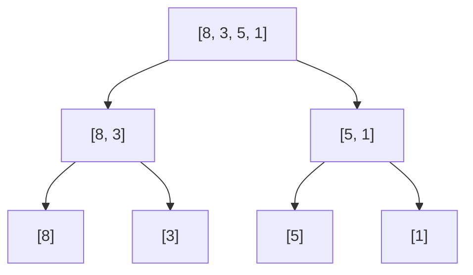

import DataCampExercise from "../../../../components/DataCampExercise.astro";
import Quiz from "../../../../components/Quiz.astro";


import ProblemLadder from "../../../../components/dsa/ProblemLadder.astro";

Every algorithm in the previous lesson does roughly $n^2$ comparisons in the
worst case. **Merge sort** breaks that ceiling with one idea: split the
problem in half, solve each half, then spend a single linear pass **merging**
the two sorted halves back together. That's divide and conquer, and it's the
same pattern behind binary search, quicksort, and a huge share of efficient
algorithms you'll meet later.

## What you'll learn

- The **merge** step -- combining two already-sorted lists into one sorted
  list in a single $O(n)$ pass.
- The **recursive split** -- dividing the array in half until pieces are
  trivially sorted (size 0 or 1).
- Why the recurrence $T(n) = 2T(n/2) + O(n)$ solves to $O(n \log n)$.
- Why merge sort is **stable** and needs $O(n)$ extra space -- unlike the
  in-place $O(n^2)$ sorts from the last lesson.
- Where Python's own `sorted()` fits into this story.

## The cue

Merge sort is rarely the literal ask. **The merge step is**, and so is the divide-and-conquer count.

:::tip[You are looking at merge sort machinery when...]
- Two (or `k`) **already-sorted** sequences must become one -- LC 21, 88, 23. The merge *is* the
  answer.
- You need to **count inversions**, or "how many elements to the right are smaller" -- LC 315, 493.
  The count falls out of the merge for free, and there is no easier $O(n \log n)$ route.
- **Stability is required** and the bound must be guaranteed $O(n \log n)$. Merge sort is the only
  common sort that is both.
- The data is a **linked list**. Merge sort is the natural $O(n \log n)$ list sort -- no random
  access needed, and it can be done in $O(1)$ extra space with pointer rewiring. LC 148.
- The data does not fit in memory. **External sorting** is merge sort: sort runs that fit, then
  `k`-way merge them.
:::

**When it is the wrong tool.** For an in-memory array in Python, `list.sort()` is Timsort -- which
*is* a merge sort, tuned for real data, written in C. Hand-rolling loses. If you need $O(1)$ space on
an array, merge sort's $O(n)$ buffer rules it out; use [heap sort](../heap-sort/). And if you only
need the `k`th element,
[quickselect](../../phase-06-patterns-search-and-selection/quickselect-and-nth-element/) is $O(n)$.

## The merge step: combine two sorted lists in one pass

If you already have two **sorted** lists, you never need to look backward to
merge them: walk both with a pointer, always take the smaller of the two
current fronts, and advance that pointer. When one list runs out, the rest
of the other list is already in order -- just copy it over.

```python title="merge_step.py" showLineNumbers{1}
def merge(left, right):
    merged = []
    i = j = 0

    while i < len(left) and j < len(right):
        if left[i] <= right[j]:
            merged.append(left[i])
            i += 1
        else:
            merged.append(right[j])
            j += 1

    merged.extend(left[i:])    # copy whatever's left, if anything
    merged.extend(right[j:])
    return merged


left = [1, 4, 7]
right = [2, 3, 9]
print(merge(left, right))   # expect [1, 2, 3, 4, 7, 9]
```

Every element is looked at exactly once, so `merge` runs in $O(n)$ time
where $n$ is the combined length of both lists -- this is the linear "combine"
step that makes the whole algorithm work.

```p5 title="Merging two sorted lists" desc="Two pointers walk left and right. The smaller of the two current fronts (amber) is copied into merged -- blue if it came from left, green if it came from right. Once one side runs out, the rest of the other side is copied straight across." height="320"
const left = [1, 4, 7];
const right = [2, 3, 9];

const frames = [
  { li: 0, ri: 0, merged: [], take: null, label: "compare left[0]=1 vs right[0]=2" },
  { li: 0, ri: 0, merged: [1], take: "L", label: "1 <= 2 -- take from left" },
  { li: 1, ri: 0, merged: [1], take: null, label: "compare left[1]=4 vs right[0]=2" },
  { li: 1, ri: 0, merged: [1, 2], take: "R", label: "2 < 4 -- take from right" },
  { li: 1, ri: 1, merged: [1, 2], take: null, label: "compare left[1]=4 vs right[1]=3" },
  { li: 1, ri: 1, merged: [1, 2, 3], take: "R", label: "3 < 4 -- take from right" },
  { li: 1, ri: 2, merged: [1, 2, 3], take: null, label: "compare left[1]=4 vs right[2]=9" },
  { li: 1, ri: 2, merged: [1, 2, 3, 4], take: "L", label: "4 <= 9 -- take from left" },
  { li: 2, ri: 2, merged: [1, 2, 3, 4], take: null, label: "compare left[2]=7 vs right[2]=9" },
  { li: 2, ri: 2, merged: [1, 2, 3, 4, 7], take: "L", label: "7 <= 9 -- take from left" },
  { li: 3, ri: 2, merged: [1, 2, 3, 4, 7], take: null, label: "left exhausted -- copy remaining right" },
  { li: 3, ri: 3, merged: [1, 2, 3, 4, 7, 9], take: "R", label: "merged = [1, 2, 3, 4, 7, 9]" },
];

let frameIndex = 0;
let lastTime = 0;
const stepDelay = 1100;

function setup() {
  createCanvas(600, 320);
  textFont("monospace");
}

function drawRow(arr, y, activeIdx, labelText) {
  noStroke();
  fill(200);
  textAlign(LEFT, CENTER);
  textSize(12);
  text(labelText, 20, y - 22);
  const boxW = 40, boxH = 34, gap = 8;
  for (let k = 0; k < arr.length; k++) {
    const x = 20 + k * (boxW + gap);
    const isActive = k === activeIdx;
    fill(isActive ? color(219, 171, 90) : color(75, 139, 190));
    rect(x, y, boxW, boxH, 6);
    fill(13, 17, 23);
    textAlign(CENTER, CENTER);
    textSize(14);
    text(arr[k], x + boxW / 2, y + boxH / 2);
  }
}

function draw() {
  background(13, 17, 23);

  if (millis() - lastTime > stepDelay) {
    lastTime = millis();
    frameIndex = (frameIndex + 1) % frames.length;
  }

  const f = frames[frameIndex];
  const boxW = 40, boxH = 34, gap = 8;

  drawRow(left, 40, f.li < left.length ? f.li : -1, "left");
  drawRow(right, 110, f.ri < right.length ? f.ri : -1, "right");

  noStroke();
  fill(200);
  textAlign(LEFT, CENTER);
  textSize(12);
  text("merged", 20, 158);
  for (let k = 0; k < f.merged.length; k++) {
    const x = 20 + k * (boxW + gap);
    const isNew = k === f.merged.length - 1 && f.take !== null;
    if (isNew) fill(f.take === "L" ? color(75, 139, 190) : color(63, 185, 80));
    else fill(60, 66, 74);
    rect(x, 180, boxW, boxH, 6);
    fill(230);
    textAlign(CENTER, CENTER);
    textSize(14);
    text(f.merged[k], x + boxW / 2, 180 + boxH / 2);
  }

  noStroke();
  fill(210);
  textAlign(CENTER, TOP);
  textSize(13);
  text(f.label, width / 2, 250);
}
```

## The recursive split

Merge only helps if you already have two sorted halves. Merge sort gets
those halves the same way it got the whole array sorted: **recursively**.
Split the array in half, sort each half (recursively), then merge the
results. The recursion bottoms out at size 0 or 1 -- a list of one element
is trivially already sorted.

```python title="merge_sort.py" showLineNumbers{1}
def merge(left, right):
    merged = []
    i = j = 0
    while i < len(left) and j < len(right):
        if left[i] <= right[j]:
            merged.append(left[i])
            i += 1
        else:
            merged.append(right[j])
            j += 1
    merged.extend(left[i:])
    merged.extend(right[j:])
    return merged


def merge_sort(arr):
    if len(arr) <= 1:          # base case: already sorted
        return arr

    mid = len(arr) // 2
    left = merge_sort(arr[:mid])
    right = merge_sort(arr[mid:])
    return merge(left, right)


nums = [8, 3, 5, 1, 9, 2]
print(merge_sort(nums))   # expect [1, 2, 3, 5, 8, 9]
```

The recursion builds a tree $\log_2 n$ levels deep -- each level does a
total of $O(n)$ merge work across all its calls, since every element is
touched exactly once per level:



Splitting stops at single elements (the base case), and then merging climbs
back up: `[8]` and `[3]` merge into `[3, 8]`; `[5]` and `[1]` merge into
`[1, 5]`; finally `[3, 8]` and `[1, 5]` merge into `[1, 3, 5, 8]`.

## Why this is O(n log n)

Every recursive call splits the array in half and does $O(n)$ work in the
merge step to recombine the results. That's exactly the shape of recurrence
covered in **Recurrences and the Master Theorem**:

$$
T(n) = 2\,T\!\left(\frac{n}{2}\right) + O(n)
$$

There are $\log_2 n$ levels of recursion (each halving shrinks $n$ down to 1
after $\log_2 n$ steps), and every level does $O(n)$ total merge work across
all the calls at that depth. Multiply the two together:

$$
T(n) = O(n \log n)
$$

Unlike bubble, selection, and insertion sort, this bound holds in the
**best**, **average**, and **worst** case -- merge sort never degrades,
because the split is always exactly in half regardless of the input's
order.

:::note[Stable, but not in-place]
Merge sort is **stable**: the merge step's `left[i] <= right[j]` check (not
strict `<`) means that when values are equal, the element from `left` is
always taken first -- so equal elements never swap relative order. The
tradeoff is space: building new `left`/`right`/`merged` lists at every level
costs $O(n)$ extra memory, unlike the $O(1)$ in-place sorts from the
previous lesson.
:::

## Dry run

### One merge of `[1, 4, 7]` and `[2, 4, 6, 8]`

| Pick | From | Why |
| --- | --- | --- |
| 1 | left | `1 <= 2` |
| 2 | right | `4 > 2` |
| 4 | **left** | `4 <= 4` -- the tie goes left |
| 4 | right | left is exhausted at this key |
| 6 | right | `7 > 6` |
| 7 | left | `7 <= 8` |
| 8 | right | drained from the right tail |

Result `[1, 2, 4, 4, 6, 7, 8]` in **7 picks for 7 elements** -- one comparison-and-append per output
slot, which is the $O(n)$ merge. The final `out += l[i:]; out += r[j:]` is not an optimisation: when
one side runs out, the other is already sorted and can be appended wholesale.

**The tie on row 3 is where stability lives.** `4 <= 4` takes from the **left**, and the left half
holds the elements that came earlier in the original array. Change it to `<` and the right-hand `4`
goes first:

| Comparison | Merging `[(1,'a')]` with `[(1,'b')]` |
| --- | --- |
| `l[i] <= r[j]` | `[(1,'a'), (1,'b')]` -- **stable** |
| `l[i] < r[j]` | `[(1,'b'), (1,'a')]` -- not stable |

Verified. One character decides whether merge sort keeps its defining property. Nothing crashes, and
the output is still correctly sorted -- the only symptom is that equal elements swap, which surfaces
much later in a multi-key sort that depended on the earlier pass.

### Why the recursion is $O(n \log n)$

The tree has $\log_2 n$ levels, because halving `n` reaches 1 after that many steps. Every level
merges a total of `n` elements -- the pieces get smaller but there are proportionally more of them.
So the work is `n` per level times $\log_2 n$ levels.

For `n = 8`: levels of size 8, 4+4, 2+2+2+2, 1x8 -- four levels, 8 elements merged at each. The
recursion tree's *shape* is fixed by the input size alone, which is why merge sort has no bad input:
its best, average and worst cases are all $\Theta(n \log n)$. That is the property quicksort lacks
and the reason merge sort is what you reach for when the bound must be a guarantee.

## Time and space complexity

| Case | Complexity |
| --- | --- |
| Best | $O(n \log n)$ |
| Average | $O(n \log n)$ |
| Worst | $O(n \log n)$ |
| Space | $O(n)$ |
| Stable? | Yes |

:::tip[Python already does this for you]
Python's built-in `sorted()` and `list.sort()` use **Timsort**, a highly
tuned hybrid that borrows merge sort's overall divide-and-conquer structure
and stability guarantee, but switches to insertion sort for small runs and
detects already-sorted chunks to skip work entirely. We'll cover Timsort's
details in a later lesson -- for now, know that reaching for `sorted()` in
real code is *always* the right call; hand-rolling merge sort is for
understanding the idea, not for production use.
:::

## The variant map

| Variant | The change | Canonical problem |
| --- | --- | --- |
| **Merge two sorted lists** | The merge step alone | 21 · 88 |
| **Merge `k` sorted lists** | Heap of heads, or balanced pairwise merging -- both $O(N \log k)$ | 23 |
| **Merge in place from the back** | Write into the tail of the larger array, right to left, so nothing is overwritten | 88 Merge Sorted Array |
| **Count inversions** | Add `count += len(l) - i` when taking from the right | 493 Reverse Pairs |
| **Count smaller elements to the right** | Merge sort on `(value, original_index)` pairs, accumulating per index | 315 |
| **Sort a linked list** | Split with fast/slow pointers, merge by rewiring -- $O(1)$ extra space | 148 |
| **External sort** | Sort chunks that fit in memory, then `k`-way merge the files | -- |
| **Timsort** | Merge sort that finds existing **runs** and uses insertion sort below ~64 elements | Python's `list.sort` |
| **Bottom-up merge sort** | Iterate widths 1, 2, 4, 8 -- no recursion, so no stack limit | -- |

:::note[Inversion counting is why this page matters more than the sort]
When the merge takes an element from the **right** half, every element still unconsumed in the left
half is greater than it *and* appeared earlier -- so `len(left) - i` inversions are discovered in one
addition.

That is the whole trick behind LC 493 and 315, and there is no simpler $O(n \log n)$ way to count
inversions. If a problem asks "how many pairs are out of order", the answer is a merge sort with one
extra line -- and recognising that is worth far more than being able to write the sort itself.
:::

## LeetCode problem set

Generated from the problem database, so each entry carries its sheet
membership and reported companies. Tick them off as you go — progress is
saved in this browser, and the Export button writes it to a file you can keep.

<ProblemLadder pattern="merge-sort"
  notes={{"21":"The `merge` step above, applied to a linked list instead of a Python list","315":"A classic \"augment the merge step\" problem: count cross-inversions while merging","912":"Implement merge sort (or any $O(n \\log n)$ sort) from scratch"}} />

## Practice -- real LeetCode problems

Each exercise is the actual LeetCode problem with its real method signature and
LeetCode's own examples as the test. Write the body, press **Run**, and match the
expected output.

### LC 88 -- Merge Sorted Array · Easy

**Problem.** `nums1` has length `m + n`, with its first `m` slots holding sorted
values and the rest set to `0`. Merge the `n` sorted values of `nums2` into `nums1`
**in place**.

**Constraints.** `0 <= m, n <= 200`, both inputs sorted non-decreasing.

**Examples.** `nums1 = [1,2,3,0,0,0], m = 3, nums2 = [2,5,6], n = 3` gives
`[1,2,2,3,5,6]`

<DataCampExercise
  lang="python"
  hint={`Merge from the BACK, not the front. Writing forward would overwrite values in nums1 you have not read yet; writing into the trailing zeros from the right never collides. Keep three indices: a write pointer at m+n-1, and readers at m-1 and n-1. Loop while the nums2 reader is still valid -- anything left in nums1 is already in place.`}
  code={`class Solution:
    def merge(self, nums1, m, nums2, n):
        # TODO: in place. Merge from the BACK so you never overwrite
        # unread values. Mutate nums1, then return it.
        pass


sol = Solution()
cases = [([1, 2, 3, 0, 0, 0], 3, [2, 5, 6], 3), ([1], 1, [], 0), ([0], 0, [1], 1)]
print([sol.merge(list(a), m, list(b), n) for a, m, b, n in cases])
# expect [[1, 2, 2, 3, 5, 6], [1], [1]]`}
  solution={`class Solution:
    def merge(self, nums1, m, nums2, n):
        write = m + n - 1            # fill from the BACK
        i, j = m - 1, n - 1
        while j >= 0:                # nums1 leftovers are already in place
            if i >= 0 and nums1[i] > nums2[j]:
                nums1[write] = nums1[i]
                i -= 1
            else:
                nums1[write] = nums2[j]
                j -= 1
            write -= 1
        return nums1


sol = Solution()
cases = [([1, 2, 3, 0, 0, 0], 3, [2, 5, 6], 3), ([1], 1, [], 0), ([0], 0, [1], 1)]
print([sol.merge(list(a), m, list(b), n) for a, m, b, n in cases])`}
  sct={`test_output_contains("[[1, 2, 2, 3, 5, 6], [1], [1]]")
success_msg("Merging backwards into the spare slots is what makes it in place with no shifting.")
`}
  height={300}
/>

<details>
<summary>Editorial</summary>

This is the **merge step** of merge sort, with the twist that the output must go into
one of the inputs.

**Time** $O(m + n)$. **Space** $O(1)$.

Merging **backwards** is the key. Forwards, writing to `nums1[0]` would clobber a
value still needed. Backwards, the write pointer starts in the zero-padding and
always stays at or ahead of both readers -- so a collision is impossible.

Two details:

- **`while j >= 0`** is the right loop condition. Once `nums2` is exhausted, any
  remaining `nums1` values are already in their correct positions, so no copying is
  needed. Looping on `i >= 0 or j >= 0` also works but does pointless writes.
- **`i >= 0` inside the comparison** guards the case where `nums1`'s values run out
  first and only `nums2` remains.

`([0], 0, [1], 1)` is that case: `m = 0`, so everything comes from `nums2`.

**Follow-ups:** "Why not use `sorted(nums1[:m] + nums2)`?" -- correct in Python and
$O((m+n)\log(m+n))$, but it defeats the point and is not in place. "Merge `k` sorted
arrays?" -- a heap; see [K-way Merge](../../phase-06-patterns-search-and-selection/k-way-merge/).
"What if `nums1` had no spare room?" -- you would need $O(n)$ extra space, or the
much harder in-place merge algorithms.

</details>

### LC 977 -- Squares of a Sorted Array · Easy

**Problem.** Given an array sorted in non-decreasing order, return an array of the
**squares** of each number, also sorted non-decreasing. Aim for $O(n)$.

**Constraints.** `1 <= len(nums) <= 10^4`, `-10^4 <= nums[i] <= 10^4`, sorted.

**Examples.** `[-4,-1,0,3,10]` gives `[0,1,9,16,100]` ·
`[-7,-3,2,3,11]` gives `[4,9,9,49,121]`

<DataCampExercise
  lang="python"
  hint={`Squaring breaks the sort because negatives flip, but the LARGEST square is always at one of the two ends. So compare the squares at both ends, take the bigger, and write it into the output from the BACK -- filling right to left. Two readers converging, one write pointer descending.`}
  code={`class Solution:
    def sortedSquares(self, nums):
        # TODO: O(n) without sorting.
        # The largest square is at one END; fill the output from the back.
        pass


sol = Solution()
cases = [[-4, -1, 0, 3, 10], [-7, -3, 2, 3, 11], [-1], [1], [-2, -1]]
print([sol.sortedSquares(list(c)) for c in cases])
# expect [[0, 1, 9, 16, 100], [4, 9, 9, 49, 121], [1], [1], [1, 4]]`}
  solution={`class Solution:
    def sortedSquares(self, nums):
        n = len(nums)
        out = [0] * n
        left, right, write = 0, n - 1, n - 1
        while left <= right:                     # note <= : one element remains
            ls, rs = nums[left] * nums[left], nums[right] * nums[right]
            if ls > rs:
                out[write] = ls
                left += 1
            else:
                out[write] = rs
                right -= 1
            write -= 1
        return out


sol = Solution()
cases = [[-4, -1, 0, 3, 10], [-7, -3, 2, 3, 11], [-1], [1], [-2, -1]]
print([sol.sortedSquares(list(c)) for c in cases])`}
  sct={`test_output_contains("[[0, 1, 9, 16, 100], [4, 9, 9, 49, 121], [1], [1], [1, 4]]")
success_msg("The largest square sits at an end -- so filling backwards turns this into a merge.")
`}
  height={310}
/>

<details>
<summary>Editorial</summary>

Squaring destroys the ordering in the middle but preserves a useful fact: the input
is sorted, so the **largest magnitude** is at one of the two ends. Comparing the ends
and emitting the larger square -- into the output's back -- is exactly a merge of two
sorted sequences: the negatives read right-to-left and the non-negatives left-to-right.

**Time** $O(n)$. **Space** $O(n)$ for the output.

`while left <= right` (not `<`) matters: with an odd length the two pointers meet on
the middle element, which still needs writing. `[-1]` and `[1]` are the minimal tests.

`[-2,-1]` giving `[1,4]` is the all-negative case, where the *left* end holds the
largest square throughout.

The obvious `sorted(x*x for x in nums)` is $O(n \log n)$ and perfectly fine to
mention -- the problem explicitly asks for an $O(n)$ alternative, which is the whole
exercise.

**Follow-ups:** "Do it in place?" -- awkward, since squares can exceed the space
freed; $O(n)$ output is expected. "What if the input were not sorted?" -- then
$O(n \log n)$ is unavoidable. "Cubes instead of squares?" -- cubing preserves order,
so the answer is just the mapped array.

</details>

### LC 148 -- Sort List · Medium

**Problem.** Sort a linked list in $O(n \log n)$ time and, ideally, $O(1)$ extra
space.

**Constraints.** `0 <= number of nodes <= 5 * 10^4`,
`-10^5 <= Node.val <= 10^5`.

**Examples.** `[4,2,1,3]` gives `[1,2,3,4]` · `[-1,5,3,4,0]` gives
`[-1,0,3,4,5]` · `[]` gives `[]`

<DataCampExercise
  lang="python"
  hint={`Merge sort. Split with fast/slow pointers -- start fast at head.next so a two-element list splits into one and one rather than looping forever. Cut the first half with slow.next = None, recurse on both halves, then merge them behind a dummy head. Forgetting the cut creates a cycle and hangs.`}
  code={`class ListNode:
    def __init__(self, val=0, next=None):
        self.val, self.next = val, next


def build_list(vals):
    d = ListNode(); t = d
    for v in vals:
        t.next = ListNode(v); t = t.next
    return d.next


def to_list(h):
    out = []
    while h:
        out.append(h.val); h = h.next
    return out


class Solution:
    def sortList(self, head):
        # TODO: merge sort. Split with fast/slow, CUT the first half,
        # recurse, then merge behind a dummy head.
        # Start fast at head.next so a 2-node list splits 1 and 1.
        pass


sol = Solution()
cases = [[4, 2, 1, 3], [-1, 5, 3, 4, 0], [], [1], [2, 1]]
print([to_list(sol.sortList(build_list(c))) for c in cases])
# expect [[1, 2, 3, 4], [-1, 0, 3, 4, 5], [], [1], [1, 2]]`}
  solution={`class ListNode:
    def __init__(self, val=0, next=None):
        self.val, self.next = val, next


def build_list(vals):
    d = ListNode(); t = d
    for v in vals:
        t.next = ListNode(v); t = t.next
    return d.next


def to_list(h):
    out = []
    while h:
        out.append(h.val); h = h.next
    return out


class Solution:
    def sortList(self, head):
        if not head or not head.next:
            return head                       # base case: 0 or 1 node

        slow, fast = head, head.next          # head.next so 2 nodes split 1/1
        while fast and fast.next:
            slow, fast = slow.next, fast.next.next
        mid = slow.next
        slow.next = None                      # CUT, or you build a cycle

        left, right = self.sortList(head), self.sortList(mid)

        dummy = ListNode(); tail = dummy      # merge the two sorted halves
        while left and right:
            if left.val <= right.val:
                tail.next, left = left, left.next
            else:
                tail.next, right = right, right.next
            tail = tail.next
        tail.next = left or right
        return dummy.next


sol = Solution()
cases = [[4, 2, 1, 3], [-1, 5, 3, 4, 0], [], [1], [2, 1]]
print([to_list(sol.sortList(build_list(c))) for c in cases])`}
  sct={`test_output_contains("[[1, 2, 3, 4], [-1, 0, 3, 4, 5], [], [1], [1, 2]]")
success_msg("Merge sort is the natural list sort -- splitting and merging need no random access.")
`}
  height={400}
/>

<details>
<summary>Editorial</summary>

Merge sort is the right choice for a linked list, because both of its operations --
splitting and merging -- need only sequential access. Quicksort needs random access
to partition efficiently, so it fares badly here.

**Time** $O(n \log n)$. **Space** $O(\log n)$ for the recursion (a bottom-up
iterative version reaches genuine $O(1)$).

Two details decide whether it works:

- **`fast = head.next`**, not `head`. With `fast = head` and two nodes, `slow` stays
  at `head`, `mid` is the second node, and the recursion makes no progress --
  infinite recursion. Starting `fast` one ahead splits `[2,1]` into `[2]` and `[1]`.
  That case is in the tests for exactly this reason.
- **`slow.next = None`.** Without the cut the first half still runs into the second,
  and the recursion never shrinks. This is the same warning as in
  [Reorder List](../../phase-08-patterns-linked-lists/copy-flatten-and-reorder/).

This composes three things already covered:
[fast/slow pointers](../../phase-08-patterns-linked-lists/fast-and-slow-pointers/)
to find the middle, a
[dummy head](../../phase-08-patterns-linked-lists/dummy-head-rewiring-and-merging/)
to merge, and the
[divide-and-conquer](../../phase-11-recursion-and-backtracking/divide-and-conquer/)
skeleton.

**Follow-ups:** "Truly $O(1)$ space?" -- bottom-up merge sort, merging runs of size
1, 2, 4, … iteratively. "Why not quicksort?" -- no random access, and worst-case
$O(n^2)$. "Copy the values into an array and sort?" -- works, $O(n)$ space, and
defeats the exercise.

</details>

## Interview follow-ups

| They ask | What they're checking | The answer |
| --- | --- | --- |
| "Why merge sort over quicksort?" | Knowing the trade | Guaranteed $\Theta(n \log n)$ on every input, and **stable**. Quicksort risks $O(n^2)$ and is not stable. You pay $O(n)$ space and a worse constant factor |
| "Prove it is $O(n \log n)$" | The recursion-tree argument | $\log_2 n$ levels because halving reaches 1 in that many steps, and every level merges `n` elements in total. Crucially the tree's shape depends on `n` alone, so no input can unbalance it |
| "Is it stable? Why?" | The mechanism, not the label | Yes, because the merge takes from the **left** on a tie (`<=`). Verified: switching to `<` reverses two equal elements while still producing sorted output |
| "Space complexity?" | Precision | $O(n)$ for the merge buffer plus $O(\log n)$ for the stack. Only the **linked-list** version is $O(1)$ extra, since merging there is pointer rewiring |
| "Sort a linked list in $O(n \log n)$" | Recognising the natural fit | Merge sort: split with fast/slow pointers, merge by rewiring. No random access needed, which rules out quicksort and heap sort. LC 148 |
| "Count how many pairs are out of order" | Whether you see the free result | Inversion counting during the merge: `count += len(left) - i` when taking from the right. LC 493, 315 -- and there is no simpler $O(n \log n)$ route |
| "The data does not fit in memory" | External sorting | Sort chunks that do fit, write them out, then `k`-way merge the files with a heap. This is what merge sort is actually used for at scale |
| "What does Python's `sorted` use?" | Stdlib fluency | Timsort -- a merge sort that detects existing **runs** and insertion-sorts short ones. Which is why nearly-sorted input is close to $O(n)$ in practice |
| "Reduce the allocation" | Implementation quality | Allocate one scratch array up front and merge between it and the original, alternating direction per level. Slicing at every level costs $O(n \log n)$ in allocation on top of the sort |
| "Can merge sort be done in $O(1)$ space on an array?" | Honesty about the hard case | In-place merging exists but is complex and slow enough that nobody uses it. The practical answer is: no, use heap sort if $O(1)$ space is the requirement |

## Pitfalls

- **Using `<` instead of `<=` in the merge comparison.** This is the one that matters:
  verified, merging `[(1,'a')]` with `[(1,'b')]` gives `[(1,'a'),(1,'b')]` with `<=` and the reverse
  with `<`. The output is still sorted, so nothing fails visibly -- the loss only shows up in a
  later multi-key sort that relied on the earlier order.
- **Forgetting to drain both tails.** After the main loop exactly one side has leftovers, but writing
  only `out += l[i:]` silently truncates whenever the right side is the longer one. Append both; one
  is always empty.
- **Allocating a new buffer at every recursion level.** Correct but wasteful. Real implementations
  allocate one scratch array up front and merge into alternating halves.
- **Claiming $O(1)$ space for the array version.** It is $O(n)$ for the buffer plus $O(\log n)$ for
  the stack. Only the *linked-list* version is $O(1)$ extra, because merging is pointer rewiring.
- **Recursion depth on a large list.** $\log_2 n$ frames is fine -- 20 at a million -- so this is the
  one common sort that does *not* risk a `RecursionError`. Worth knowing so you do not offer a fix
  that is not needed.
- **Splitting with `mid = len(arr) // 2` and then slicing.** Slices copy, so an $O(n \log n)$
  algorithm gains an $O(n \log n)$ allocation cost on top. Passing `(lo, hi)` indices avoids it.
- **Merging in place from the front on LC 88.** Writing forward overwrites unread elements. Fill from
  the **back** of the destination array, right to left, where the spare capacity already is.
- **Off-by-one in the inversion count.** It is `len(left) - i`, the number of left-half elements
  *still unconsumed*, added when you take from the right. Using `i` counts the consumed ones instead.

## Self-check

<Quiz
  questions={[
    {
      q: "In the merge step, why is the comparison `left[i] <= right[j]` rather than `<`?",
      options: [
        "To avoid an infinite loop on equal values",
        "It preserves stability: on a tie the left half wins, and the left half holds the elements that came earlier",
        "It is faster by one comparison",
        "They are equivalent",
      ],
      answer: 1,
      explain:
        "Verified: merging [(1,'a')] with [(1,'b')] gives [(1,'a'),(1,'b')] with <= and [(1,'b'),(1,'a')] with <. Both outputs are correctly sorted, which is what makes this dangerous -- nothing fails until a later multi-key sort depends on the earlier ordering surviving. Stability is merge sort's defining advantage and one character controls it.",
    },
    {
      q: "Why is merge sort O(n log n) in the best, average AND worst case?",
      options: [
        "Because the merge is O(n)",
        "The recursion tree's shape depends only on n -- log n levels, n elements merged per level -- so no input can unbalance it",
        "Because it always allocates the same buffer",
        "Because it is stable",
      ],
      answer: 1,
      explain:
        "Halving is driven by the array length, never by the values, so there is no adversarial input. That is exactly the property quicksort lacks -- its partition depends on the data, which is why sorted input costs it O(n^2). When the bound has to be a guarantee, this is why merge sort is the answer.",
    },
    {
      q: "The merge loop ends and you write `out += left[i:]`. What is missing?",
      options: [
        "Nothing -- only the left side can have leftovers",
        "`out += right[j:]` as well; exactly one side has leftovers and it may be either",
        "A final sort of the output",
        "The two tails must be merged recursively",
      ],
      answer: 1,
      explain:
        "The loop exits as soon as *either* index runs out, so the survivor may be either side -- in the traced merge of [1,4,7] and [2,4,6,8] it was the right, leaving [8]. Append both; one is always empty, so it costs nothing. Draining only one silently drops elements whenever you guess wrong.",
    },
    {
      q: "What is merge sort's space complexity on an array?",
      options: [
        "O(1) -- it sorts in place",
        "O(n) for the merge buffer plus O(log n) for the recursion stack",
        "O(n log n), since each level allocates",
        "O(log n) only",
      ],
      answer: 1,
      explain:
        "The O(n) buffer is unavoidable for arrays -- merging cannot be done in place efficiently -- and it is the reason to reach for heap sort when O(1) space is required. A naive implementation allocating fresh lists at every level does cost O(n log n) in total allocation; real ones use a single scratch array. The linked-list version is genuinely O(1) extra, since merging is pointer rewiring.",
    },
    {
      q: "How do you count inversions during a merge sort?",
      options: [
        "Count every comparison made",
        "When taking an element from the RIGHT half, add len(left) - i -- the left elements still unconsumed",
        "Count the swaps performed",
        "Add 1 each time the right side wins",
      ],
      answer: 1,
      explain:
        "Every left-half element still waiting is both greater than the one you just took and earlier in the original array, so all of those inversions are discovered in a single addition. That is what makes LC 493 and 315 tractable -- there is no simpler O(n log n) route. Using `i` counts the consumed elements instead, which is the mirror image and wrong.",
    },
    {
      q: "LC 88 asks you to merge into the first array, which has spare capacity at the end. Which direction do you write?",
      options: [
        "Forward from index 0, shifting as needed",
        "Backwards from the end, largest first -- the spare capacity is there, so nothing unread is overwritten",
        "Either; the result is the same",
        "Sort the combined array afterwards",
      ],
      answer: 1,
      explain:
        "Writing forward overwrites elements of the first array that have not been read yet, so you would need a copy -- which defeats the point of the in-place framing. Filling from the back means every slot you write is either spare capacity or a slot whose value you have already consumed.",
    },
    {
      q: "Should you worry about RecursionError when merge sorting a million elements in Python?",
      options: [
        "Yes -- the depth is n",
        "No -- the depth is log2(n), about 20 at a million, far below the ~1,000-frame limit",
        "Yes, unless you use an explicit stack",
        "Only if the input is already sorted",
      ],
      answer: 1,
      explain:
        "Merge sort halves, so the depth is logarithmic and comfortably safe -- unlike quicksort, whose worst-case depth is n-1 and does hit the limit on adversarial input. Knowing this matters so you do not offer a fix that is not needed; a bottom-up iterative merge sort exists, but stack depth is not the reason to want it.",
    },
  ]}
/>

## Recall card

- **Merge sort = split in half, sort both, merge.** The **merge** is what interviews actually ask
  for.
- **The merge is one pass, $O(n)$**: compare the two fronts, append the smaller, then drain **both**
  tails -- exactly one is non-empty.
- **`<=`, not `<`.** The tie must go left to keep stability. Verified: `<` swaps equal elements while
  still producing sorted output, so the loss is silent.
- **$\Theta(n \log n)$ in every case** -- the tree's shape depends on `n` alone, so there is no bad
  input. That is the guarantee quicksort lacks.
- **Space is $O(n)$ buffer + $O(\log n)$ stack** on arrays. Only the linked-list version is $O(1)$
  extra.
- **Depth is $\log_2 n$** -- about 20 at a million, so no `RecursionError` risk.
- **Inversion counting is free**: taking from the right adds `len(left) - i`. This is LC 493 and 315,
  and there is no simpler $O(n \log n)$ way.
- **LC 88 merges backwards**, into the spare capacity at the end.
- **Merge sort is the stable, guaranteed $O(n \log n)$ sort** -- and Python's `list.sort` is Timsort,
  which is a merge sort that finds existing runs.
- **External sorting is merge sort**: sort runs that fit in memory, then `k`-way merge.

## Recap

- **Merge** combines two sorted lists in one $O(n)$ pass by always taking
  the smaller current front.
- **Merge sort** recursively splits in half down to single elements, then
  merges back up -- the recurrence $T(n) = 2T(n/2) + O(n)$ solves to
  $O(n \log n)$.
- It's **stable** ($O(n)$ time, guaranteed, in every case) but needs
  $O(n)$ extra space -- unlike the $O(1)$ in-place sorts from the previous
  lesson.
- Python's `sorted()` uses Timsort, a hybrid built on these same ideas plus
  insertion sort for small runs -- covered in a later lesson.

Next: **Quick Sort** -- another divide-and-conquer sort, in-place this time,
with an average case just as fast but a worst case that depends entirely on
how you pick the pivot.
