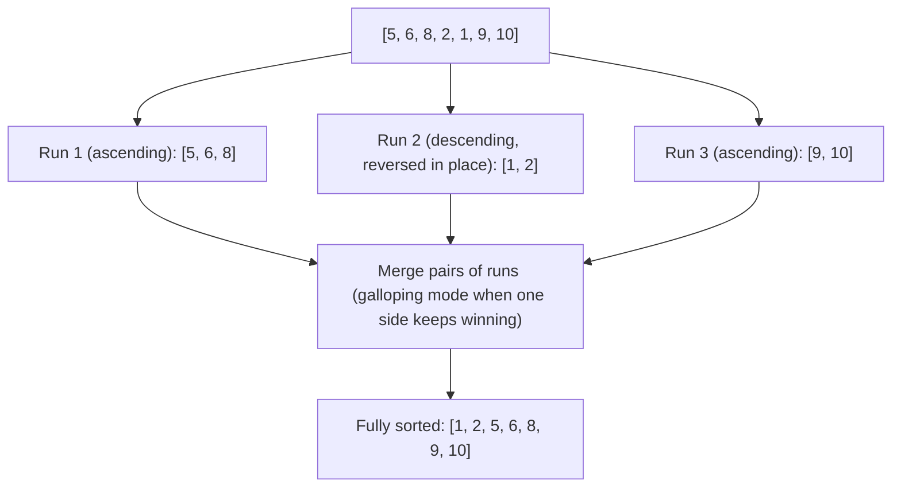

Sorting sounds solved the moment you learn `sorted()` exists. The interview
value is in the details: **new list vs in-place**, **custom ordering**, and
the one guarantee -- **stability** -- that turns a single built-in into a
tool for multi-key sorting. Underneath it all sits **Timsort**, an algorithm
clever enough to notice when your data is already halfway sorted.

## What you'll learn

- `sorted()` (returns a new list) vs `list.sort()` (sorts in place, returns
  `None`).
- `key=` functions: sort by length, by a tuple for multi-key ordering, or
  descending without `reverse=`.
- `reverse=True` and how it composes with `key=`.
- **Stability**: what it guarantees, and why it enables multi-pass multi-key
  sorts.
- `functools.cmp_to_key` for old-style pairwise comparators.
- **Timsort**: the hybrid merge + insertion sort that powers both functions.

## The cue

This page is the one you use most and study least.

:::tip[You are reaching for `sorted` with a key when...]
- The ordering is **derived**, not intrinsic: by length, by last name, by frequency, by distance.
  `key=` is the whole solution -- LC 451, 973, 1051.
- **Two or more keys** with different directions -- score descending, then name ascending. A tuple
  key, with a negation on the numeric part.
- The ordering rule is **pairwise and not expressible as a key** -- "is `a + b` bigger than
  `b + a`?" That needs `functools.cmp_to_key`. LC 179 Largest Number.
- You need the **original order of equal elements to survive**. Python's sort is stable, and that
  guarantee is load-bearing for multi-key sorting.
- The data is **already nearly sorted** -- Timsort detects existing runs and is close to $O(n)$ on
  it, measured 4x faster than random input below.
:::

**When it is the wrong tool.** If you only need the extreme, `min`/`max` is $O(n)$ against $O(n \log n)$.
If you need the `k` best and `k \ll n`, `heapq.nlargest` is $O(n \log k)$ -- measured 13x faster than
sorting at `k = 5` of 200,000. And if you need a *sorted structure* under repeated insertion, sorting
after every insert is $O(n^2 \log n)$; use `bisect.insort` or `sortedcontainers`.

## `sorted()` vs `list.sort()`

The two easiest-to-mix-up functions in Python: one returns a new list and
leaves the original untouched, the other mutates in place and returns
nothing at all.

```python title="sorted_vs_sort.py" showLineNumbers{1}
nums = [5, 2, 8, 1, 9]

new_list = sorted(nums)   # returns a NEW sorted list -- nums is untouched
print("original untouched:", nums)
print("new sorted list:   ", new_list)

result = nums.sort()      # sorts nums IN PLACE, returns None
print("nums after .sort():     ", nums)
print("return value of .sort():", result)
```

:::caution[The classic bug]
`x = some_list.sort()` silently sets `x` to `None` -- `.sort()` always
returns `None`, by design, to make it obvious it mutated in place. If you
need a *new* sorted list (or you're sorting anything that isn't a `list`,
like a `tuple` or a generator), use `sorted()` instead.
:::

## Sorting with `key=`

`key=` takes a function applied to each element before comparing -- you sort
by *what the key function returns*, not the elements directly.

```python title="sort_by_key.py" showLineNumbers{1}
words = ["banana", "kiwi", "apple", "fig", "cherry"]

by_length = sorted(words, key=len)
print("by length:          ", by_length)

# descending by length -- two equivalent ways
by_length_desc_a = sorted(words, key=len, reverse=True)
by_length_desc_b = sorted(words, key=lambda w: -len(w))
print("desc via reverse=:   ", by_length_desc_a)
print("desc via negation:   ", by_length_desc_b)
```

Negating the key (`-len(w)`) works for numbers because sorting ascending on
`-x` is the same ordering as sorting descending on `x`. It doesn't work for
strings (`-w` isn't valid) -- use `reverse=True` for those.

## Multi-key sorting with a tuple

The single most useful `key=` trick: return a **tuple**. Python compares
tuples element-by-element, so `(primary, secondary)` sorts by `primary`
first and only looks at `secondary` to break ties.

```python title="multi_key_tuple.py" showLineNumbers{1}
people = [
    ("Bob", 25),
    ("Amy", 30),
    ("Cid", 25),
    ("Amy", 22),
]

# sort by age ascending, then by name ascending for ties
by_age_then_name = sorted(people, key=lambda p: (p[1], p[0]))
print(by_age_then_name)

# sort by age ascending, but name descending for ties -- negate what you can
by_age_then_name_desc = sorted(people, key=lambda p: (p[1], p[0]), reverse=True)
print(by_age_then_name_desc)
```

## Visual intuition

Timsort is not a new algorithm so much as a marriage of two you already know: **insertion sort** on
short runs, then **merge sort** to combine them. Both halves, in order:

<ArrayStepper
  client:visible
  algo="insertion-sort"
  values={[5, 2, 4, 6, 1, 3]}
  tag="sort"
  title="Timsort, part one: insertion sort on short runs"
  lib="O(n) on nearly-sorted input"
  desc="Insertion sort is quadratic in general and linear when the data is almost in order -- which is exactly why Timsort uses it on small runs. On real-world data those runs are frequently already sorted, and this is where Timsort's famous best case comes from."
/>

<ArrayStepper
  client:visible
  algo="merge-sort"
  values={[38, 27, 43, 3, 9, 82, 10]}
  tag="sort"
  title="Timsort, part two: merging the runs"
  lib="stable · O(n log n)"
  desc="The merge is what makes the sort stable: on a tie the element from the left run is taken first, so equal keys keep their original order. That guarantee is what lets you sort by one key and then another to build a compound ordering."
/>

## Stability: the guarantee that makes multi-key sorting work

A sort is **stable** if elements that compare equal keep their original
relative order. Python's sort has always guaranteed this -- and it's not
just a nice-to-have, it's what lets you build a multi-key sort out of
several single-key sorts.

```python title="stability_demo.py" showLineNumbers{1}
students = [
    ("Alice", "B"),
    ("Bob", "A"),
    ("Cara", "B"),
    ("Dan", "A"),
]

# stable sort: within each grade, the ORIGINAL relative order is preserved
by_grade = sorted(students, key=lambda s: s[1])
print(by_grade)   # Bob and Dan (grade A) stay in their original order; same for Alice/Cara
```

Because sorting is stable, you can sort by the *least* important key first,
then the *most* important key last -- each later sort only reorders groups
that tied on the earlier key, leaving everything else exactly where a
single tuple-key sort would have put it.

```python title="multi_pass_stable_sort.py" showLineNumbers{1}
people = [
    ("Bob", 25),
    ("Amy", 30),
    ("Cid", 25),
    ("Amy", 22),
]

# two passes: sort by the secondary key first, then the primary key
step1 = sorted(people, key=lambda p: p[0])   # name (secondary), first
step2 = sorted(step1, key=lambda p: p[1])    # age (primary), last -- stable, so name order survives ties

# equivalent single-pass version using a tuple key
direct = sorted(people, key=lambda p: (p[1], p[0]))

print("two-pass:  ", step2)
print("tuple key: ", direct)
print("identical: ", step2 == direct)
```

:::note[Why this matters beyond Python]
Not every language's built-in sort is stable (some historically weren't, or
made no promise). When a sort is stable, "sort by column A, then stably
sort by column B" is a legitimate way to build multi-column ordering --
exactly how spreadsheet "sort by multiple columns" features are implemented.
:::

## Custom comparators with `functools.cmp_to_key`

`key=` needs a function that maps *one* element to a sortable value. Some
orderings genuinely need to **compare two elements directly** -- for those,
wrap an old-style comparator with `cmp_to_key`.

```python title="cmp_to_key_largest_number.py" showLineNumbers{1}
from functools import cmp_to_key

def compare(a, b):
    # if a+b forms a bigger number than b+a, a should sort before b
    if a + b > b + a:
        return -1   # a before b
    elif a + b < b + a:
        return 1    # b before a
    return 0


nums = ["3", "30", "34", "5", "9"]
nums.sort(key=cmp_to_key(compare))
print("".join(nums))   # expect "9534330" -- the largest number formed by concatenation
```

`compare(a, b)` returns negative if `a` belongs first, positive if `b`
belongs first, and `0` for a tie -- the same contract as C's `qsort` or
Java's `Comparator`.

## How Timsort actually works

`sorted()` and `list.sort()` both run **Timsort**, a hybrid algorithm
designed by Tim Peters specifically for CPython (later adopted by Java and
others). The core idea: real-world data is rarely random -- it usually
contains long stretches that are already sorted, so Timsort looks for those
stretches first instead of ignoring them.

1. **Find runs.** Scan the array for maximal *runs* -- contiguous stretches
   that are already sorted ascending, or sorted descending (which get
   reversed in place to become ascending runs).
2. **Extend short runs.** If a natural run is shorter than a threshold
   (`minrun`, usually 32-64), extend it using **insertion sort** -- cheap
   and fast for small stretches.
3. **Merge runs.** Repeatedly merge pairs of runs using **merge sort**,
   using a **galloping mode** that speeds up merging when one run keeps
   "winning" many comparisons in a row (a strong signal of already-sorted
   structure).



```python title="timsort_best_case.py" showLineNumbers{1}
import time

# nearly-sorted data: Timsort's best case, close to O(n)
nearly_sorted = list(range(200_000))
nearly_sorted[100_000], nearly_sorted[100_001] = nearly_sorted[100_001], nearly_sorted[100_000]

start = time.perf_counter()
nearly_sorted.sort()
elapsed_sorted = time.perf_counter() - start

# fully random data: Timsort's average/worst case, O(n log n)
import random
random_data = list(range(200_000))
random.shuffle(random_data)

start = time.perf_counter()
random_data.sort()
elapsed_random = time.perf_counter() - start

print(f"nearly-sorted: {elapsed_sorted * 1000:.2f} ms")
print(f"random:        {elapsed_random * 1000:.2f} ms")
print("Timsort recognizes existing order -- nearly-sorted input sorts noticeably faster.")
```

## Dry run

### Stability, and what it buys

`data = [("bob", 2), ("amy", 1), ("cal", 2), ("dan", 1)]`, sorting by score only:

```
sorted(data, key=lambda x: x[1])
-> [('amy', 1), ('dan', 1), ('bob', 2), ('cal', 2)]
```

`amy` before `dan`, and `bob` before `cal` -- **the original relative order inside each score group is
preserved**. That is stability, and it is a documented guarantee of Python's sort, not an accident of
the implementation.

Which means multi-key sorting has two equivalent spellings:

| Approach | Result |
| --- | --- |
| One tuple key: `key=lambda x: (x[1], x[0])` | `[('amy',1), ('dan',1), ('bob',2), ('cal',2)]` |
| Two stable passes: by name, **then** by score | `[('amy',1), ('dan',1), ('bob',2), ('cal',2)]` |

**Identical** -- verified. The second pass preserves the first pass's ordering within each group, so
sorting by the *least* significant key first and working up gives the same answer. That is radix
sort's argument, and it is the technique to use when a key cannot be put in a tuple -- for example
when one direction needs reversing and the value is a string.

### `reverse=True` is not the same as negating the key

Score **descending**, name **ascending**:

| Expression | Result |
| --- | --- |
| `key=lambda x: (-x[1], x[0])` | `[('bob',2), ('cal',2), ('amy',1), ('dan',1)]` ✅ |
| `key=lambda x: (x[1], x[0]), reverse=True` | `[('cal',2), ('bob',2), ('dan',1), ('amy',1)]` ❌ |

Verified, and they differ. `reverse=True` flips the **entire** comparison, so the names come out
descending too -- `cal` before `bob`. Negating only the numeric component reverses just that
component.

So for mixed directions you must negate, not reverse. And when the descending key is a **string**,
negation is unavailable -- that is exactly when you fall back to the two-pass trick above, or to
`cmp_to_key`.

One more detail: `reverse=True` **preserves stability** rather than reversing ties. It is defined as
"reverse the comparison", not "reverse the output", so equal elements keep their original order in
both cases. `sorted(x)[::-1]` does *not* have that property.

### Timsort exploits existing order, measured

`sorted()` over 2,000,000 floats:

| Input | Time |
| --- | --- |
| random | 0.537 s |
| already sorted | **0.131 s** |
| reverse sorted | **0.138 s** |

**About 4x faster on pre-sorted data** -- and almost exactly as fast on *reverse*-sorted, because
Timsort detects a descending run and reverses it in place rather than starting from scratch. A
comparison sort with no run detection would show no difference at all between the three rows.

This is why the theoretical bound is $O(n \log n)$ but the *best case* is $O(n)$: a single run means
one pass to detect it and nothing left to merge. Real data is full of partial order -- appended
batches, timestamps, previously-sorted segments -- which is why Timsort was worth building.

The mechanism, briefly: scan for a natural run (ascending, or descending and reversed), extend short
runs to a minimum of ~32-64 elements with **insertion sort**, push the run onto a stack, and merge
runs while maintaining size invariants that keep the merges balanced. Both halves of that -- runs and
insertion sort -- are why the elementary sorts on the previous page still matter.

## Time and space complexity

| Case | Complexity |
| --- | --- |
| Best (already sorted, or nearly sorted runs) | $O(n)$ |
| Average | $O(n \log n)$ |
| Worst | $O(n \log n)$ |
| Space | $O(n)$ (needs a temporary merge buffer) |
| Stable? | Yes, always |

:::tip[Timsort is why `key=` only runs once per element]
Python computes each element's key **once**, caches it, then compares
cached keys -- it never re-invokes your `key` function during comparisons.
That's a real optimization if your key function is expensive; it's not
recomputed $O(n \log n)$ times, only $O(n)$ times.
:::

## The variant map

| Variant | The spelling | Canonical problem |
| --- | --- | --- |
| **Sort by a derived value** | `key=len`, `key=abs`, `key=counts.get` | 451 · 1051 |
| **Sort by distance** | `key=lambda p: p[0]**2 + p[1]**2` -- no `sqrt` needed, it is monotonic | 973 |
| **Two keys, same direction** | `key=lambda x: (a, b)` | -- |
| **Two keys, opposite directions** | `key=lambda x: (-num, string)` -- negate, do **not** use `reverse` | 692 Top K Frequent Words |
| **Descending on a non-negatable key** | Two stable passes, least significant first | -- |
| **Pairwise rule, not a key** | `functools.cmp_to_key(cmp)` | 179 Largest Number |
| **Sort in place** | `list.sort()` -- returns `None`, saves the copy | -- |
| **Sort a non-list iterable** | `sorted(iterable)` -- always returns a new list | -- |
| **Keep a list sorted under insertion** | `bisect.insort` -- $O(n)$ per insert but a tiny constant | 220 |
| **Only the `k` best** | `heapq.nlargest(k, …)` -- $O(n \log k)$, 13x faster at `k=5` of 200k | 215 · 347 |
| **Only the extreme** | `min` / `max` with `key=` -- $O(n)$ | -- |
| **Group after sorting** | `itertools.groupby` -- requires the input already sorted by that key | 49 |
| **Sort by index into another list** | `sorted(range(n), key=lst.__getitem__)` -- argsort | -- |

:::caution[`cmp_to_key` is correct and slow]
`functools.cmp_to_key` wraps every element in an object whose `__lt__` calls your Python comparator,
so every comparison is a Python-level function call -- typically several times slower than a key
function, which is called only **once per element**.

Use it when the rule is genuinely pairwise and cannot be expressed as a key. LC 179 is the canonical
case: "order `a` before `b` if `a + b > b + a`" compares *concatenations*, which no per-element key
captures.

If a key function exists, always prefer it. `key=` is `n` calls; `cmp=` is $O(n \log n)$ calls.
:::

## Practice -- real LeetCode problems

Each exercise is the actual LeetCode problem with its real method signature and
LeetCode's own examples as the test. Write the body, press **Run**, and match the
expected output.

### LC 2418 -- Sort the People · Easy

**Problem.** Given `names` and `heights` of the same length with distinct heights,
return the names sorted by **decreasing** height.

**Constraints.** `1 <= len(names) <= 10^3`, heights are distinct.

**Examples.** `names = ["Mary","John","Emma"], heights = [180,165,170]` gives
`["Mary","Emma","John"]`

<DataCampExercise
  lang="python"
  hint={`Zip the two lists so each height travels with its name, sort the pairs in reverse, then take the names. Because heights are distinct, tuple comparison never needs to fall through to the name -- and sorting (height, name) pairs is simpler than sorting indices.`}
  code={`class Solution:
    def sortPeople(self, names, heights):
        # TODO: pair each height with its name, sort descending by height,
        # then extract the names.
        pass


sol = Solution()
cases = [(["Mary", "John", "Emma"], [180, 165, 170]),
         (["Alice", "Bob", "Bob"], [155, 185, 150])]
print([sol.sortPeople(list(a), list(b)) for a, b in cases])
# expect [['Mary', 'Emma', 'John'], ['Bob', 'Alice', 'Bob']]`}
  solution={`class Solution:
    def sortPeople(self, names, heights):
        # heights are distinct, so the pair comparison never reaches the name
        return [n for _, n in sorted(zip(heights, names), reverse=True)]


sol = Solution()
cases = [(["Mary", "John", "Emma"], [180, 165, 170]),
         (["Alice", "Bob", "Bob"], [155, 185, 150])]
print([sol.sortPeople(list(a), list(b)) for a, b in cases])`}
  sct={`test_output_contains("[['Mary', 'Emma', 'John'], ['Bob', 'Alice', 'Bob']]")
success_msg("zip pairs the data so one sort moves both lists together.")
`}
  height={260}
/>

<details>
<summary>Editorial</summary>

`zip` keeps each height attached to its name, so a single sort reorders both
consistently. Sorting the pairs is cleaner than sorting an index list and then
gathering.

**Time** $O(n \log n)$. **Space** $O(n)$.

`reverse=True` here is safe **because the heights are distinct** -- the comparison
never falls through to the second element. If heights could repeat, `reverse=True`
would also reverse the alphabetical order of tied names, which is the
mixed-direction trap. The correct key in that case is
`key=lambda p: (-p[0], p[1])`.

`["Alice","Bob","Bob"]` with heights `[155,185,150]` shows duplicate *names* are
harmless -- it is duplicate *keys* that would matter.

**Follow-ups:** "What if heights could tie?" -- use `(-height, name)`; do not rely on
`reverse=True`. "Sort by height ascending?" -- drop `reverse`. "Avoid building
pairs?" -- `sorted(range(n), key=lambda i: -heights[i])` then gather, which is what
you would do if the payload were expensive to copy.

</details>

### LC 937 -- Reorder Data in Log Files · Medium

**Problem.** Each log begins with an identifier, followed by either all words
(**letter-log**) or all numbers (**digit-log**). Reorder so letter-logs come first,
sorted by content and then by identifier; digit-logs keep their **original relative
order** at the end.

**Constraints.** `1 <= len(logs) <= 100`, each log has an identifier and at least
one word.

**Examples.** `["dig1 8 1 5 1","let1 art can","dig2 3 6","let2 own kit dig","let3 art zero"]`
gives `["let1 art can","let3 art zero","let2 own kit dig","dig1 8 1 5 1","dig2 3 6"]`

<DataCampExercise
  hint={`Design one sort key. Split each log once into identifier and rest. For a digit-log return a key that is IDENTICAL for all of them -- a one-element tuple like (1,) -- and Python's stable sort will preserve their input order for free. For a letter-log return (0, rest, identifier) so they sort first, by content then identifier.`}
  lang="python"
  code={`class Solution:
    def reorderLogFiles(self, logs):
        # TODO: one sort key.
        # Digit-logs must keep their ORIGINAL order -- give them all an
        # identical key and let sort stability do the work.
        # Letter-logs sort by content, then identifier.
        pass


sol = Solution()
print(sol.reorderLogFiles(
    ["dig1 8 1 5 1", "let1 art can", "dig2 3 6", "let2 own kit dig", "let3 art zero"]))
# expect ['let1 art can', 'let3 art zero', 'let2 own kit dig', 'dig1 8 1 5 1', 'dig2 3 6']`}
  solution={`class Solution:
    def reorderLogFiles(self, logs):
        def key(log):
            ident, rest = log.split(" ", 1)      # split ONCE
            if rest[0].isdigit():
                return (1,)                      # all digit-logs TIE -> stable
            return (0, rest, ident)              # letters first, then content

        return sorted(logs, key=key)


sol = Solution()
print(sol.reorderLogFiles(
    ["dig1 8 1 5 1", "let1 art can", "dig2 3 6", "let2 own kit dig", "let3 art zero"]))`}
  sct={`test_output_contains("['let1 art can', 'let3 art zero', 'let2 own kit dig', 'dig1 8 1 5 1', 'dig2 3 6']")
success_msg("Give the digit-logs an identical key and stability preserves their order -- no extra pass.")
`}
  height={290}
/>

<details>
<summary>Editorial</summary>

This is a **stability** problem disguised as a sorting problem, and it is the clearest
demonstration of why Python's guaranteed-stable sort is a feature you can design
around.

**Time** $O(n \log n \cdot L)$ -- comparisons involve string content.
**Space** $O(n)$.

The key does three things at once:

- **First component** `0` or `1` separates letter-logs from digit-logs.
- **Identical keys for all digit-logs** `(1,)` means the sort never reorders them, so
  their input order survives -- exactly what the problem demands, with no extra
  bookkeeping.
- **`(0, rest, ident)`** for letter-logs sorts by content and falls back to the
  identifier, which is why `let1 art can` precedes `let3 art zero` (same first word,
  different content) and both precede `let2 own kit dig`.

`split(" ", 1)` with the count argument is important: splitting fully would break the
content into words and lose the ability to compare it as one string.

**Follow-ups:** "How do you know digit-logs keep their order?" -- Python's sort is
documented stable; equal keys never swap. "Without relying on stability?" -- partition
into two lists, sort only the letter-logs, and concatenate. "What if content ties
*and* identifiers tie?" -- impossible here, since the whole log would be identical.

</details>

### LC 1329 -- Sort the Matrix Diagonally · Medium

**Problem.** Sort each diagonal of a matrix (running from top-left to bottom-right)
in ascending order, and return the matrix.

**Constraints.** `1 <= m, n <= 100`, `1 <= mat[i][j] <= 100`.

**Examples.** `[[3,3,1,1],[2,2,1,2],[1,1,1,2]]` gives
`[[1,1,1,1],[1,2,2,2],[1,2,3,3]]`

<DataCampExercise
  lang="python"
  hint={`Cells on the same top-left-to-bottom-right diagonal all share the same value of r - c. So group the values into a dict keyed by r - c, sort each group, and write them back in the same traversal order. Sorting each group in REVERSE lets you pop() from the end, which takes the smallest first and is O(1).`}
  code={`from collections import defaultdict


class Solution:
    def diagonalSort(self, mat):
        # TODO: cells on one diagonal share r - c.
        # Group by that key, sort each group, write back in traversal order.
        # Mutate mat, then return it.
        pass


sol = Solution()
cases = [[[3, 3, 1, 1], [2, 2, 1, 2], [1, 1, 1, 2]], [[1]], [[2, 1], [1, 2]]]
print([sol.diagonalSort([r[:] for r in m]) for m in cases])
# expect [[[1, 1, 1, 1], [1, 2, 2, 2], [1, 2, 3, 3]], [[1]], [[2, 1], [1, 2]]]`}
  solution={`from collections import defaultdict


class Solution:
    def diagonalSort(self, mat):
        diagonals = defaultdict(list)
        for r, row in enumerate(mat):
            for c, v in enumerate(row):
                diagonals[r - c].append(v)       # one diagonal shares r - c

        for d in diagonals:
            diagonals[d].sort(reverse=True)      # so pop() yields the smallest

        for r in range(len(mat)):
            for c in range(len(mat[0])):
                mat[r][c] = diagonals[r - c].pop()
        return mat


sol = Solution()
cases = [[[3, 3, 1, 1], [2, 2, 1, 2], [1, 1, 1, 2]], [[1]], [[2, 1], [1, 2]]]
print([sol.diagonalSort([r[:] for r in m]) for m in cases])`}
  sct={`test_output_contains("[[[1, 1, 1, 1], [1, 2, 2, 2], [1, 2, 3, 3]], [[1]], [[2, 1], [1, 2]]]")
success_msg("r - c identifies the diagonal -- the rest is bucketing plus a sort per bucket.")
`}
  height={310}
/>

<details>
<summary>Editorial</summary>

The whole insight is the **invariant**: moving one step down-right increases both `r`
and `c` by one, so `r - c` is constant along a diagonal. That turns a geometric
grouping into a dictionary key.

**Time** $O(mn \log(\min(m, n)))$ -- each diagonal has at most $\min(m, n)$
elements. **Space** $O(mn)$.

Sorting each diagonal **descending** so that `pop()` returns the smallest is a small
but real optimisation: `pop()` from the end is $O(1)$, whereas `pop(0)` from the front
is $O(k)$ because it shifts the list.

The second write loop must traverse in the **same order** as the first, so that values
are consumed in the order the diagonal was collected. Both loops go row by row, left
to right.

`[[2,1],[1,2]]` returning unchanged is a good check: each diagonal here has one or
two already-sorted elements.

Note `r - c` can be negative -- for cells above the main diagonal -- which is fine as
a dict key. Using a list indexed by `r - c + n` is the alternative if you prefer array
indexing.

**Follow-ups:** "Anti-diagonals instead?" -- those share `r + c`. "Sort each diagonal
descending?" -- flip the sort and pop order. "Do it in place per diagonal?" -- walk
each diagonal, collect, sort, write back; same complexity, less memory at once.

</details>

## Practice

This page is about using `sorted` well, so the ladder is the problems where the **key function or the comparator is the whole solution** -- plus the merge-sort problems, since Timsort is a merge sort with runs.

<ProblemLadder pattern={["sorting-with-custom-comparators", "merge-sort"]} />

## Pitfalls

- **`list.sort()` returns `None`.** `x = mylist.sort()` silently binds `None`. `sort()` mutates and
  returns nothing; `sorted()` returns a new list and leaves the input alone. The most common Python
  sorting bug, and it fails later with a confusing `TypeError`.
- **Using `reverse=True` for mixed directions.** Verified: `key=(x[1], x[0]), reverse=True` gives
  `[cal, bob, dan, amy]` while `key=(-x[1], x[0])` gives `[bob, cal, amy, dan]`. `reverse` flips the
  *whole* comparison, so every component reverses. Negate the one component you want descending.
- **Assuming `reverse=True` reverses ties.** It does not -- it is defined as reversing the comparison,
  so stability is preserved. `sorted(x)[::-1]` *does* reverse ties, and is therefore not equivalent.
- **Reaching for `cmp_to_key` when a key exists.** A key function is called once per element; a
  comparator is called $O(n \log n)$ times, each a Python-level call. Only use it for genuinely
  pairwise rules like LC 179.
- **Sorting to find the maximum.** $O(n \log n)$ for something `max()` does in $O(n)$. Same for the
  `k` best -- `heapq.nlargest` is $O(n \log k)$ and measured 13x faster at `k = 5` of 200,000.
- **Re-sorting inside a loop.** Sorting after each insertion is $O(n^2 \log n)$. Use `bisect.insort`,
  or collect everything and sort once.
- **Assuming Timsort is $O(n \log n)$ on every input.** Its best case is $O(n)$ -- measured 4x faster
  on pre-sorted 2M floats, and equally fast on reverse-sorted, because descending runs are detected
  and reversed.
- **Sorting mixed types.** Python 3 raises `TypeError` comparing `int` with `str`. Give a `key` that
  normalises, or partition first.
- **A `key` function with side effects, or an expensive one.** It is called exactly once per element
  and the results are cached -- which is the point -- but that also means it must be pure, and
  computing something costly is paid `n` times, not $n \log n$.
- **Forgetting `groupby` needs pre-sorted input.** `itertools.groupby` groups *consecutive* equal
  keys, so unsorted input silently yields fragmented groups.

## Interview follow-ups

| They ask | What they're checking | The answer |
| --- | --- | --- |
| "What algorithm does Python use?" | Stdlib awareness | **Timsort** -- a stable, adaptive merge sort that detects natural runs, insertion-sorts short ones (~32-64 elements), and merges under size invariants that keep the merges balanced |
| "Complexity?" | Both bounds | $O(n \log n)$ worst case, **$O(n)$ best case** on already-sorted input, $O(n)$ space. Measured: 0.131 s pre-sorted against 0.537 s random on 2M floats |
| "Is it stable, and why does that matter?" | The consequence, not the label | Yes, guaranteed. It is what makes multi-key sorting by successive passes valid -- verified that two stable passes equal one tuple key |
| "Sort by score descending, then name ascending" | The `reverse` trap | `key=lambda x: (-x[1], x[0])`. **Not** `reverse=True`, which reverses both components -- verified to give a different, wrong answer |
| "The descending key is a string, so you cannot negate it" | Whether you have a fallback | Two stable passes (least significant key first), or `cmp_to_key`. This is exactly the case where the two-pass trick earns its keep |
| "`sort()` or `sorted()`?" | A real bug source | `sort()` mutates in place and returns **`None`**; `sorted()` returns a new list and accepts any iterable. `x = lst.sort()` binding `None` is the classic mistake |
| "When would you use `cmp_to_key`?" | Judgement | Only when the rule is pairwise and no per-element key captures it -- LC 179's `a+b > b+a`. It is markedly slower: a key is `n` calls, a comparator is $O(n \log n)$ Python-level calls |
| "Do you need to sort at all?" | Whether sorting is reflexive | Often not. `max` is $O(n)$; `heapq.nlargest(k, …)` is $O(n \log k)$ and was 13x faster than sorting at `k = 5` of 200,000. Sorting is the answer when you need the whole order |
| "Why is Timsort faster on real data than on random data?" | The adaptive part | Real data contains partial order -- appended batches, timestamps, previously-sorted segments -- and Timsort finds those runs instead of re-deriving them. Measured 4x. Reverse-sorted is just as fast, since a descending run is detected and reversed in place |
| "Keep a collection sorted while inserting" | The right structure | `bisect.insort` -- $O(\log n)$ to locate, $O(n)$ to shift, but the shift is a fast memmove so it is competitive well beyond where the asymptotics suggest. For large `n`, `sortedcontainers.SortedList` |
| "Sort by frequency, ties broken alphabetically" | Composing it | `key=lambda w: (-counts[w], w)`. Negate the count for descending, leave the word ascending. LC 692, and it is the mixed-direction case again |

## Self-check

<Quiz
  questions={[
    {
      q: "What does `x = mylist.sort()` bind to x?",
      options: [
        "A sorted copy of mylist",
        "None -- sort() mutates in place and returns nothing; sorted() is the one that returns a list",
        "The original unsorted list",
        "It raises a TypeError",
      ],
      answer: 1,
      explain:
        "The most common Python sorting bug. It fails nowhere near the mistake -- x is None, and the error surfaces later as a confusing TypeError when you index or iterate it. The naming convention is the mnemonic: `sorted()` is a function returning a value, `.sort()` is a method acting on the receiver.",
    },
    {
      q: "You need score descending, name ascending. Does `key=lambda x: (x[1], x[0]), reverse=True` work?",
      options: [
        "Yes -- that is the standard idiom",
        "No -- reverse=True flips the entire comparison, so names come out descending too. Negate only the numeric component: key=lambda x: (-x[1], x[0])",
        "Yes, but only if the names are unique",
        "No -- reverse cannot be combined with key",
      ],
      answer: 1,
      explain:
        "Verified to give different answers: the negated key gives [bob, cal, amy, dan] and reverse=True gives [cal, bob, dan, amy]. `reverse` is all-or-nothing across the whole tuple. When the descending key cannot be negated -- a string -- you fall back to two stable passes or cmp_to_key.",
    },
    {
      q: "Does `reverse=True` reverse the order of equal elements?",
      options: [
        "Yes -- it reverses the whole output",
        "No -- it is defined as reversing the comparison, so stability is preserved and ties keep their original order",
        "Only when a key function is supplied",
        "It is unspecified",
      ],
      answer: 1,
      explain:
        "This is why `sorted(x, reverse=True)` and `sorted(x)[::-1]` are not interchangeable -- the slice genuinely reverses everything, ties included. The documented behaviour is that reverse=True sorts as if each comparison were inverted, which leaves equal elements in input order.",
    },
    {
      q: "Sorting [('bob',2),('amy',1),('cal',2),('dan',1)] by name and THEN by score gives the same result as one tuple key (score, name). Why?",
      options: [
        "Coincidence for this input",
        "Python's sort is stable, so the second pass preserves the first pass's order within each score group -- the same argument that makes radix sort work",
        "Because the names happen to be alphabetical already",
        "Because both keys are the same length",
      ],
      answer: 1,
      explain:
        "Verified equal. Sort by the LEAST significant key first and work up; each stable pass leaves the previous ordering intact inside groups it considers equal. This is the technique for mixed directions when a key cannot be negated -- a descending string key, for instance.",
    },
    {
      q: "`sorted()` on 2,000,000 floats took 0.54 s random and 0.13 s already-sorted. Why the 4x gap?",
      options: [
        "Caching of previously computed comparisons",
        "Timsort detects natural runs; one long run means almost nothing to merge, giving an O(n) best case",
        "Pre-sorted data compresses better in memory",
        "The measurement is unreliable",
      ],
      answer: 1,
      explain:
        "Adaptivity is Timsort's design goal. Note reverse-sorted input was just as fast at 0.138 s -- a descending run is detected and reversed in place rather than merged element by element. A comparison sort without run detection would show no difference between the three inputs at all.",
    },
    {
      q: "When is `functools.cmp_to_key` the right tool?",
      options: [
        "Whenever you need a custom order",
        "Only when the rule is genuinely pairwise and no per-element key captures it -- LC 179's \"a before b if a+b > b+a\"",
        "When sorting mixed types",
        "When you need stability",
      ],
      answer: 1,
      explain:
        "A key function is called exactly n times; a comparator is called O(n log n) times, each a Python-level call through a wrapper object, so it is markedly slower. LC 179 compares concatenations, which no per-element key can express. If a key exists, use it.",
    },
    {
      q: "You need the 5 largest of 200,000 numbers. Sort or heap?",
      options: [
        "Sort -- it is simpler and the difference is negligible",
        "heapq.nlargest(5, ...) -- O(n log k), measured about 13x faster than sorted(...)[:5] at this size",
        "min/max in a loop",
        "bisect.insort into a size-5 list",
      ],
      answer: 1,
      explain:
        "Bounding the heap at k shrinks the log term and the memory. Measured 0.007 s against 0.100 s. But the advantage reverses as k grows: at k = n/2 the sort wins by about 4x, because log k approaches log n while the heap keeps paying Python-level bookkeeping against Timsort's C loop.",
    },
    {
      q: "`itertools.groupby` returns fragmented groups on your data. What went wrong?",
      options: [
        "The key function is wrong",
        "groupby only groups CONSECUTIVE equal keys, so the input must already be sorted by that key",
        "groupby requires a list, not an iterator",
        "It needs reverse=True",
      ],
      answer: 1,
      explain:
        "groupby is a streaming operation -- it never buffers or reorders, it just cuts the sequence wherever the key changes. On unsorted input that produces one group per run of equal keys, which is usually many tiny groups. Sort by the same key first, or use a defaultdict if you do not need the sorted order anyway.",
    },
  ]}
/>

## Recall card

- **`sorted()` returns a new list from any iterable; `list.sort()` mutates and returns `None`.** The
  `None`-binding bug is the classic.
- **Timsort**: stable, adaptive merge sort. Finds natural runs, insertion-sorts short ones (~32-64),
  merges under size invariants. $O(n \log n)$ worst case, **$O(n)$ best**, $O(n)$ space.
- **Measured adaptivity**: 2M floats took 0.54 s random, **0.13 s pre-sorted**, 0.14 s
  reverse-sorted -- descending runs are detected and reversed in place.
- **Stability is guaranteed**, and it is what makes multi-key sorting by successive passes valid --
  two stable passes == one tuple key, verified.
- **Mixed directions: negate the component**, `key=(-num, string)`. **`reverse=True` flips
  everything** -- verified to give a different answer.
- **`reverse=True` preserves ties**; `sorted(x)[::-1]` does not.
- **Least-significant-key-first two-pass** is the fallback when a descending key cannot be negated.
- **`key=` is called `n` times; `cmp_to_key` is called $O(n \log n)$ times.** Only use a comparator
  for genuinely pairwise rules (LC 179).
- **Do not sort when you do not need the order**: `max` is $O(n)$; `heapq.nlargest(k, …)` is
  $O(n \log k)$ and 13x faster at `k = 5` of 200k -- though the sort wins again by `k = n/2`.
- **`bisect.insort` to maintain sorted order** under insertion; never re-sort in a loop.
- **`groupby` needs pre-sorted input** -- it only groups consecutive equal keys.

## Recap

- `sorted()` returns a new list; `list.sort()` mutates in place and returns
  `None` -- never assign the result of `.sort()` to a variable.
- `key=` maps each element to a sortable value; return a tuple for
  multi-key ordering, negate numeric fields for a mixed ascending/descending
  sort.
- Python's sort is **stable** -- equal elements keep their relative order,
  which is what makes multi-pass and tuple-key multi-key sorting correct.
- `functools.cmp_to_key` bridges old-style pairwise comparators into the
  `key=` interface.
- Under the hood, both `sorted()` and `.sort()` run **Timsort**: find runs,
  extend short ones with insertion sort, merge the rest with galloping
  merge sort -- $O(n)$ best case, $O(n \log n)$ worst case, always stable.

Next: **Binary Search Template and Variants** -- the bug-free template for
searching a sorted sequence, plus the "search on the answer" pattern.
