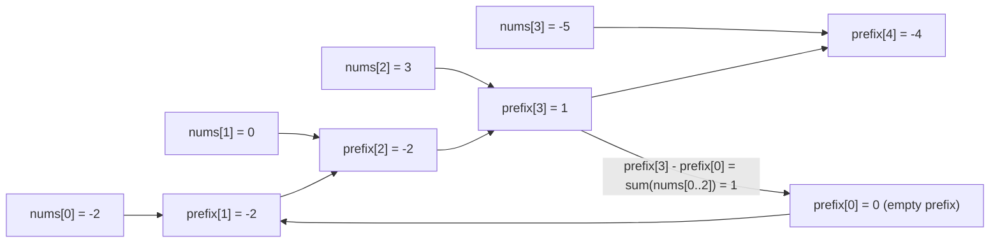

If a problem asks the same question -- "what's the sum of this range?" --
over and over on a fixed array, recomputing the sum each time is wasted
work. Precompute once, answer forever: that's the entire idea behind a
**prefix sum**, and it's one of the highest-leverage $O(n)$-setup tricks in
all of interview coding.

## What you'll learn

- Building a **prefix sum array** in $O(n)$, then answering any range-sum
  query in $O(1)$.
- Extending prefix sums to **2D** for rectangle-sum queries over a matrix.
- The **difference array** -- the mirror-image trick for applying many
  range *updates* efficiently.
- The **hashmap + prefix sum** combo that turns "subarray sums equal to k"
  from $O(n^2)$ into $O(n)$.

## The cue

:::tip[You are looking at prefix sums when…]
- There are **many range queries** over an array that does not change. Answering
  each by summing costs $O(n)$ per query; one $O(n)$ precomputation makes every
  query $O(1)$.
- Or there are **many range updates** and only one read at the end — that is the
  mirror image, a **difference array**: record `+v` at the start and `-v` just
  past the end, then take one prefix sum to materialise the result.

The distinguishing question is **which side is hot**. Many reads and static data
means prefix sums. Many writes and one read means a difference array. Both hot
means a Fenwick tree or a segment tree — which is precisely the trade-off Phase
17 exists to cover.

**Reach for something else** when the array changes between queries (Fenwick /
segment tree), or when you need a *subarray matching a condition* rather than a
*given range* — that is [prefix sum with a hash map](../prefix-sum-with-hashmap/).
:::

## The pattern: precompute once, query in O(1)

A prefix sum array `prefix` stores running totals, with `prefix[0] = 0` and
`prefix[i] = nums[0] + nums[1] + ... + nums[i-1]`. The sum of any range
`[left, right]` (inclusive) is then just a subtraction:

$$
\text{sum}(left, right) = \text{prefix}[right + 1] - \text{prefix}[left]
$$

```python title="range_sum_query.py" showLineNumbers{1}
class NumArray:
    def __init__(self, nums):
        self.prefix = [0] * (len(nums) + 1)
        for i, x in enumerate(nums):
            self.prefix[i + 1] = self.prefix[i] + x   # O(n) build, once

    def sum_range(self, left, right):
        return self.prefix[right + 1] - self.prefix[left]   # O(1) per query


arr = NumArray([-2, 0, 3, -5, 2, -1])
print(arr.sum_range(0, 2))   # expect 1
print(arr.sum_range(2, 5))   # expect -1
print(arr.sum_range(0, 5))   # expect -3
```

The `+1` offset is what makes `sum_range` subtraction-only, with no special
case for `left == 0`: `prefix[0] = 0` acts as "the sum of nothing before
the array starts."

## How it works



Each `prefix[i]` folds in one more element than the last -- once that chain
is built, any range sum is just two array lookups and a subtraction, no
matter how wide the range.

## Worked example: Subarray Sum Equals K

Count subarrays summing to exactly `k`. The brute-force way checks every
`(left, right)` pair, $O(n^2)$. The prefix-sum trick: a subarray
`nums[i+1..j]` sums to `k` exactly when `prefix[j] - prefix[i] == k` --
so for every new running sum, look up how many *earlier* prefix sums are
exactly `k` less, using a hashmap instead of a nested loop.

```python title="subarray_sum_equals_k.py" showLineNumbers{1}
def subarray_sum_equals_k(nums, k):
    count = 0
    prefix_sum = 0
    seen = {0: 1}   # empty prefix (sum 0) has been "seen" once, before the array starts

    for x in nums:
        prefix_sum += x
        count += seen.get(prefix_sum - k, 0)          # how many earlier prefixes make this a valid subarray?
        seen[prefix_sum] = seen.get(prefix_sum, 0) + 1  # record the current running sum

    return count


print(subarray_sum_equals_k([1, 1, 1], 2))   # expect 2
print(subarray_sum_equals_k([1, 2, 3], 3))   # expect 2
```

The same `seen` hashmap trick (running value -> how many times seen)
solves **Contiguous Array** too: treat each `0` as `-1` and each `1` as
`+1`, then the longest subarray with equal `0`s and `1`s is the longest
gap between two indices sharing the same running sum.

:::tip[The hashmap turns "count matching pairs" from O(n^2) into O(n)]
Whenever you need to count pairs of indices `(i, j)` where some running
value at `j` minus the running value at `i` hits a target, a hashmap from
"running value seen so far" to "how many times" replaces the inner loop
entirely -- look the target up instead of scanning for it.
:::

## 2D prefix sums: rectangle-sum queries

The same idea extends one dimension further. `prefix[r][c]` holds the sum
of every cell in the rectangle from `(0, 0)` to `(r-1, c-1)`. Building it
uses inclusion-exclusion to avoid double-counting the overlapping corner;
querying a rectangle does the same subtraction in reverse.

```python title="range_sum_query_2d.py" showLineNumbers{1}
class NumMatrix:
    def __init__(self, matrix):
        rows, cols = len(matrix), len(matrix[0])
        self.prefix = [[0] * (cols + 1) for _ in range(rows + 1)]

        for r in range(rows):
            for c in range(cols):
                self.prefix[r + 1][c + 1] = (
                    matrix[r][c]
                    + self.prefix[r][c + 1]      # sum above
                    + self.prefix[r + 1][c]      # sum to the left
                    - self.prefix[r][c]           # remove double-counted corner
                )

    def sum_region(self, row1, col1, row2, col2):
        p = self.prefix
        return (
            p[row2 + 1][col2 + 1]
            - p[row1][col2 + 1]
            - p[row2 + 1][col1]
            + p[row1][col1]
        )


matrix = [
    [3, 0, 1, 4, 2],
    [5, 6, 3, 2, 1],
    [1, 2, 0, 1, 5],
    [4, 1, 0, 1, 7],
    [1, 0, 3, 0, 5],
]
nm = NumMatrix(matrix)
print(nm.sum_region(2, 1, 4, 3))   # expect 8
print(nm.sum_region(1, 1, 2, 2))   # expect 11
```

The plus/minus pattern in `sum_region` is the 2D inclusion-exclusion
principle: adding back `p[row1][col1]` corrects for subtracting the
top-left overlap region twice.

## The mirror image: difference arrays for range updates

Prefix sums answer "what's the sum over this range?" fast. A **difference
array** answers the opposite question fast: "add `val` to every element in
this range", applied many times, each in $O(1)$ -- by marking only the
range's two endpoints, then reconstructing the final array with a single
prefix-sum pass at the very end.

```python title="difference_array_range_updates.py" showLineNumbers{1}
def apply_range_updates(n, updates):
    diff = [0] * (n + 1)

    for left, right, val in updates:
        diff[left] += val          # start adding val from `left` onward
        diff[right + 1] -= val     # cancel that addition after `right`

    result = [0] * n
    running = 0
    for i in range(n):
        running += diff[i]         # this IS a prefix sum over the diff array
        result[i] = running

    return result


# Add +2 to indices [1, 3], and +1 to indices [0, 2].
print(apply_range_updates(5, [(1, 3, 2), (0, 2, 1)]))   # expect [1, 3, 3, 2, 0]
```

Each update touches only 2 positions instead of the entire range, no
matter how wide it is -- $m$ updates cost $O(m)$ total, then one final
$O(n)$ pass reconstructs the array. A difference array is quite literally
a prefix sum array run in reverse.

## Time and space complexity

| Structure | Build | Query / Update | Space |
| --- | --- | --- | --- |
| 1D prefix sum | $O(n)$ | $O(1)$ range-sum query | $O(n)$ |
| 2D prefix sum | $O(rows \cdot cols)$ | $O(1)$ rectangle-sum query | $O(rows \cdot cols)$ |
| Difference array | $O(1)$ per update | $O(n)$ final reconstruction | $O(n)$ |
| Hashmap + prefix sum (subarray sum = k) | -- | $O(n)$ total | $O(n)$ |

## When to use it

- Many range-sum queries on a **fixed** array or matrix -- prefix sums
  turn each query from $O(n)$ into $O(1)$ after one $O(n)$ (or
  $O(rows \cdot cols)$) build.
- Many range **updates** (add a value to every element in `[l, r]`)
  followed by reading the final array once -- a difference array does
  each update in $O(1)$ instead of $O(\text{range length})$.
- "Count subarrays/substrings matching some sum/parity condition" --
  pair a running prefix value with a hashmap of "seen so far" counts.
- Note the array must stay **fixed** between queries for a pure prefix
  sum to help; if elements change frequently between range-sum queries, a
  Fenwick tree / segment tree (outside this pattern) is the right upgrade.

## Visual intuition

Note the `pre[0] = 0` sentinel. It is the reason the range formula needs no
special case at the left edge:

<ArrayStepper
  client:visible
  algo="prefix-sums"
  values={[3, 1, 4, 1, 5, 9, 2]}
  title="One O(n) pass buys unlimited O(1) range queries"
  lib="pre[r+1] - pre[l]"
  desc="The prefix array is one longer than the input and shifted by one. That shift is deliberate: it makes sum(arr[0..r]) = pre[r+1] - pre[0] work without a branch, and getting the shift wrong is the standard off-by-one in this pattern."
/>

## Practice -- real LeetCode problems

Each exercise is the actual LeetCode problem with its real method signature and
LeetCode's own examples as the test. Write the body, press **Run**, and match the
expected output -- then paste the same code into leetcode.com.

### LC 303 -- Range Sum Query, Immutable · Easy

**Problem.** Design `NumArray` supporting `sumRange(left, right)`, returning the
**inclusive** sum of `nums[left..right]`. The array never changes, and there may be
many queries.

**Constraints.** `1 <= len(nums) <= 10^4`, `-10^5 <= nums[i] <= 10^5`, up to
`10^4` calls.

**Examples.** For `[-2,0,3,-5,2,-1]`: `sumRange(0,2)` gives `1`,
`sumRange(2,5)` gives `-1`, `sumRange(0,5)` gives `-3`

<DataCampExercise
  lang="python"
  hint={`Build a prefix array in the constructor with a leading 0, so prefix[i] is the sum of the first i elements. Then an inclusive range sum is prefix[right + 1] - prefix[left]. That leading zero is what removes the special case for left == 0.`}
  code={`class NumArray:
    def __init__(self, nums):
        # TODO: build prefix sums with a LEADING 0 so no special case is
        # needed when left == 0.
        pass

    def sumRange(self, left, right):
        # TODO: O(1) using two prefix lookups. The range is INCLUSIVE.
        pass


na = NumArray([-2, 0, 3, -5, 2, -1])
print([na.sumRange(0, 2), na.sumRange(2, 5), na.sumRange(0, 5),
       na.sumRange(3, 3), na.sumRange(5, 5)])
# expect [1, -1, -3, -5, -1]`}
  solution={`class NumArray:
    def __init__(self, nums):
        self.prefix = [0]                   # leading 0: no left == 0 special case
        for n in nums:
            self.prefix.append(self.prefix[-1] + n)

    def sumRange(self, left, right):
        return self.prefix[right + 1] - self.prefix[left]   # inclusive


na = NumArray([-2, 0, 3, -5, 2, -1])
print([na.sumRange(0, 2), na.sumRange(2, 5), na.sumRange(0, 5),
       na.sumRange(3, 3), na.sumRange(5, 5)])`}
  sct={`test_output_contains("[1, -1, -3, -5, -1]")
success_msg("One O(n) precomputation buys O(1) queries forever -- and the leading zero removes the edge case.")
`}
  height={310}
/>

<details>
<summary>Editorial — approach, complexity, follow-ups</summary>

Precompute cumulative sums once, then every range query is a single subtraction.

**Construction** $O(n)$. **Each query** $O(1)$. **Space** $O(n)$.

The **leading `0`** is the whole design decision. With `prefix[i]` defined as "the
sum of the first `i` elements", `prefix[0] = 0` is the empty prefix, and
`sumRange(left, right) = prefix[right + 1] - prefix[left]` works uniformly --
including when `left == 0`. Without it you need an `if left == 0` branch, which is
exactly the sort of special case that becomes a bug in the 2D version.

The `+ 1` on the right index is what makes the range **inclusive**;
`sumRange(3, 3)` returning `-5` (a single element) is the test that pins it down.

**Follow-ups you should expect:**

- **"What if the array can be updated (LC 307)?"** Prefix sums cost $O(n)$ per
  update. Use a
  [Fenwick tree](../../phase-17-advanced-cp-topics/fenwick-tree-binary-indexed-tree/)
  or a segment tree for $O(\log n)$ on both operations.
- **"2D version (LC 304)?"** A 2D prefix table with inclusion-exclusion:
  `total - top - left + topleft`.
- **"Count subarrays summing to k (LC 560)?"** Prefix sums plus a hash map -- see
  [Prefix Sum with HashMap](../prefix-sum-with-hashmap/).
- **"Memory too tight for the prefix array?"** You could recompute per query at
  $O(n)$; the whole point here is trading space for query speed.

</details>

### LC 238 -- Product of Array Except Self · Medium

**Problem.** Return an array where `answer[i]` is the product of every element
**except** `nums[i]`. You must not use division, and it must run in $O(n)$.

**Constraints.** `2 <= len(nums) <= 10^5`, `-30 <= nums[i] <= 30`, and the answer
is guaranteed to fit in a 32-bit integer.

**Examples.** `[1,2,3,4]` gives `[24,12,8,6]` ·
`[-1,1,0,-3,3]` gives `[0,0,9,0,0]`

<DataCampExercise
  hint={`The answer for index i is (product of everything left of i) times (product of everything right of i). Do two sweeps: first left to right writing the running prefix product into the output, then right to left multiplying in the running suffix product. That needs only the output array, so it is O(1) extra space, and it never divides -- which is essential because of the zeros.`}
  lang="python"
  code={`class Solution:
    def productExceptSelf(self, nums):
        # TODO: two sweeps, no division. O(n) time, O(1) extra space
        # (the output array does not count).
        # Pass 1 left-to-right: prefix products. Pass 2 right-to-left:
        # multiply in the suffix products.
        pass


sol = Solution()
cases = [[1, 2, 3, 4], [-1, 1, 0, -3, 3], [2, 3], [0, 0], [0, 1, 2]]
print([sol.productExceptSelf(list(c)) for c in cases])
# expect [[24, 12, 8, 6], [0, 0, 9, 0, 0], [3, 2], [0, 0], [2, 0, 0]]`}
  solution={`class Solution:
    def productExceptSelf(self, nums):
        n = len(nums)
        out = [1] * n

        running = 1
        for i in range(n):              # prefix products
            out[i] = running
            running *= nums[i]

        running = 1
        for i in range(n - 1, -1, -1):  # suffix products, multiplied in
            out[i] *= running
            running *= nums[i]

        return out


sol = Solution()
cases = [[1, 2, 3, 4], [-1, 1, 0, -3, 3], [2, 3], [0, 0], [0, 1, 2]]
print([sol.productExceptSelf(list(c)) for c in cases])`}
  sct={`test_output_contains("[[24, 12, 8, 6], [0, 0, 9, 0, 0], [3, 2], [0, 0], [2, 0, 0]]")
success_msg("Two sweeps and no division -- which is exactly what makes the zeros harmless.")
`}
  height={320}
/>

<details>
<summary>Editorial — approach, complexity, follow-ups</summary>

`answer[i]` is the prefix product before `i` times the suffix product after it. Two
sweeps compute both without ever storing separate arrays: the first writes prefixes
into the output, the second multiplies suffixes in as it walks back.

**Time** $O(n)$. **Space** $O(1)$ extra -- the output does not count, per the
problem's own note.

**Why the no-division rule matters.** The obvious solution divides the total product
by each element, but a single `0` makes that undefined, and two zeros make every
answer `0` in a way division cannot express. The prefix/suffix method handles zeros
with no special case at all: `[-1,1,0,-3,3]` gives `[0,0,9,0,0]`, where only the
zero's own position gets a non-zero answer. `[0,0]` gives `[0,0]`.

Getting that behaviour for free is the point of the technique -- a
division-with-zero-counting solution needs to branch on whether there are zero, one,
or many zeros.

The overflow note in the constraints ("the answer fits in 32 bits") is a hint for
fixed-width languages; Python is unaffected.

**Follow-ups you should expect:** "With division allowed?" -- count the zeros and
branch; be ready to enumerate the three cases. "Prefix and suffix arrays instead?"
-- clearer to explain at $O(n)$ extra space; a fine first answer before optimising.
"Sum instead of product?" -- ordinary prefix sums. "Product of a range?" -- prefix
products work only when no zeros exist; otherwise reset at zeros, as in
[LC 1352](../../phase-14-design-problems/design-trackers-and-feeds/).

</details>

### LC 1109 -- Corporate Flight Bookings · Medium

**Problem.** Given `n` flights labelled `1..n` and bookings
`[first, last, seats]` meaning `seats` were reserved on every flight from `first`
to `last` **inclusive**, return the total seats reserved on each flight.

**Constraints.** `1 <= n <= 2 * 10^4`, `1 <= len(bookings) <= 2 * 10^4`,
`1 <= first <= last <= n`, `1 <= seats <= 10^4`.

**Examples.** `bookings = [[1,2,10],[2,3,20],[2,5,25]], n = 5` gives
`[10,55,45,25,25]` · `bookings = [[1,2,10],[2,2,15]], n = 2` gives `[10,25]`

<DataCampExercise
  lang="python"
  hint={`This is the mirror image of prefix sums -- a difference array. For each booking add seats at index first-1 and subtract it at index last, then take a running sum over the array. Each booking becomes O(1) work instead of O(range). Size the delta array n+1 so subtracting at index last is always in bounds, and remember flights are 1-indexed while the array is 0-indexed.`}
  code={`class Solution:
    def corpFlightBookings(self, bookings, n):
        # TODO: difference array. Each booking is TWO updates, not a loop.
        # +seats at the start, -seats just past the end, then a running sum.
        # Flights are 1-indexed; the array is 0-indexed.
        pass


sol = Solution()
cases = [([[1, 2, 10], [2, 3, 20], [2, 5, 25]], 5),
         ([[1, 2, 10], [2, 2, 15]], 2),
         ([[1, 1, 5]], 1),
         ([[1, 3, 7]], 3)]
print([sol.corpFlightBookings(b, n) for b, n in cases])
# expect [[10, 55, 45, 25, 25], [10, 25], [5], [7, 7, 7]]`}
  solution={`class Solution:
    def corpFlightBookings(self, bookings, n):
        delta = [0] * (n + 1)              # n+1 so index "last" is in bounds
        for first, last, seats in bookings:
            delta[first - 1] += seats      # 1-indexed flight -> 0-indexed slot
            delta[last] -= seats           # inclusive end -> cancel just past it

        out, running = [], 0
        for i in range(n):                 # running sum recovers the totals
            running += delta[i]
            out.append(running)
        return out


sol = Solution()
cases = [([[1, 2, 10], [2, 3, 20], [2, 5, 25]], 5),
         ([[1, 2, 10], [2, 2, 15]], 2),
         ([[1, 1, 5]], 1),
         ([[1, 3, 7]], 3)]
print([sol.corpFlightBookings(b, n) for b, n in cases])`}
  sct={`test_output_contains("[[10, 55, 45, 25, 25], [10, 25], [5], [7, 7, 7]]")
success_msg("Two writes per booking instead of a loop -- range update in O(1), then one sweep to read it all back.")
`}
  height={320}
/>

<details>
<summary>Editorial — approach, complexity, follow-ups</summary>

A difference array inverts the prefix-sum relationship. Prefix sums make **range
queries** $O(1)$ after $O(n)$ setup; difference arrays make **range updates**
$O(1)$, with one $O(n)$ sweep at the end to read the final values.

**Time** $O(\text{bookings} + n)$. **Space** $O(n)$.

The naive alternative loops over each booking's range, which is
$O(\text{bookings} \times n)$ -- up to $4 \times 10^8$ operations at these
constraints. Two writes per booking instead of a loop is the whole optimisation.

Two indexing details:

- **`delta[first - 1]`** converts the 1-indexed flight number to a 0-indexed slot.
- **`delta[last]`**, not `delta[last + 1]`. Because `last` is a 1-indexed inclusive
  end, its 0-indexed slot is `last - 1`, so the cancellation belongs at `last`.
  Sizing the array `n + 1` means a booking ending at flight `n` can write at index
  `n` without going out of bounds.

`[[1,1,5]]` giving `[5]` is the minimal case: `+5` at index 0, `-5` at index 1 (the
spare slot), and the running sum yields `[5]`.

**Follow-ups you should expect:** "Range *queries* as well as updates?" -- a Fenwick
tree or segment tree gives $O(\log n)$ for both. "2D range updates?" -- a 2D
difference array with four corner writes. "Range Addition (LC 370)?" -- the same
technique, stated directly. "Why not a sweep line?" -- it is essentially the same
idea; see
[Sweep Line and Event Counting](../../phase-07-patterns-intervals-and-greedy/sweep-line-and-event-counting/).

</details>

## LeetCode problem set

Generated from the problem database, so each entry carries its sheet
membership and reported companies. Tick them off as you go — progress is
saved in this browser, and the Export button writes it to a file you can keep.

<ProblemLadder pattern="prefix-sums-and-difference-arrays"
  notes={{"238":"Not a sum, but the same \"precompute running totals from both directions\" idea, using running products instead of running sums","303":"The exact 1D prefix sum template","304":"The 2D prefix sum with inclusion-exclusion","525":"Map `0 -> -1`, `1 -> +1`, then find the longest span between two equal running sums","560":"The hashmap + prefix sum combo, as above"}} />

## Dry run

**Prefix sums.** `arr = [3, 1, 4, 1, 5, 9, 2]`:

| index | 0 | 1 | 2 | 3 | 4 | 5 | 6 | 7 |
| --- | --- | --- | --- | --- | --- | --- | --- | --- |
| `arr` | 3 | 1 | 4 | 1 | 5 | 9 | 2 | — |
| `pre` | **0** | 3 | 4 | 8 | 9 | 14 | 23 | 25 |

Query `sum(arr[2..5])` = `pre[6] - pre[2]` = `23 - 4` = **19**. Check:
`4 + 1 + 5 + 9 = 19`. Note the query used `r + 1` and `l`, not `r` and `l`.

**Difference array.** Same length, three range updates:
`+5 on [1..3]`, `+2 on [0..1]`, `-1 on [4..6]`.

| index | 0 | 1 | 2 | 3 | 4 | 5 | 6 | 7 |
| --- | --- | --- | --- | --- | --- | --- | --- | --- |
| after `+5 [1..3]` | 0 | +5 | 0 | 0 | −5 | 0 | 0 | 0 |
| after `+2 [0..1]` | +2 | +5 | −2 | 0 | −5 | 0 | 0 | 0 |
| after `-1 [4..6]` | +2 | +5 | −2 | 0 | −6 | 0 | 0 | +1 |
| **prefix sum** | 2 | 7 | 5 | 5 | −1 | −1 | −1 | 0 |

Three updates in $O(1)$ each, then one $O(n)$ pass to read the result — versus
$O(n)$ per update the naive way. The extra slot at index 7 exists so that
`d[r + 1] -= v` never runs off the end when `r` is the last index; without it
you need a branch, and the branch is where the bug lives.

## The variant map

| Variant | Structure | Canonical problem |
| --- | --- | --- |
| **Static range sum** | 1-D prefix array | 303 Range Sum Query Immutable |
| **Static 2-D range sum** | 2-D prefix array, inclusion–exclusion on 4 corners | 304 Range Sum Query 2D |
| **Many range updates, one read** | difference array | 370 Range Addition · 1109 Corporate Flight Bookings |
| **Interval overlap counting** | difference array on a timeline | 253 Meeting Rooms II · 1094 Car Pooling |
| **Running product / XOR** | same shape, different operator | 238 Product Except Self · 1310 XOR Queries |
| **Both reads and writes hot** | Fenwick or segment tree | 307 Range Sum Query Mutable |

:::note[The 2-D formula, and why it is four terms]
`sum(r1..r2, c1..c2) = P[r2+1][c2+1] - P[r1][c2+1] - P[r2+1][c1] + P[r1][c1]`

Subtracting the strip above and the strip to the left removes the top-left
corner **twice**, so it has to be added back. That is inclusion–exclusion, and
the `+ P[r1][c1]` term is the one people drop.
:::

## Pitfalls

- **Dropping the `pre[0] = 0` sentinel.** Without it, any query starting at
  index 0 needs a special case, and that branch is where the off-by-one lives.
- **Using `pre[r] - pre[l]` instead of `pre[r+1] - pre[l]`.** The prefix array
  is shifted by one. Write the formula down before coding it.
- **Sizing the difference array at `n` instead of `n + 1`.** `d[r+1] -= v` runs
  off the end when `r` is the last index.
- **Forgetting the `+ P[r1][c1]` term in 2-D.** Inclusion–exclusion removes the
  overlapping corner twice; it must be added back.
- **Reaching for prefix sums when the array mutates.** Every update invalidates
  the whole prefix array, so an update costs $O(n)$. If both operations are
  frequent, that is a Fenwick tree.
- **Integer overflow in other languages.** Not an issue in Python, but worth
  naming: prefix sums of a large array of large values overflow 32-bit integers,
  and saying so signals you have written this in C++ or Java too.

## Interview follow-ups

| They ask | What they're checking | The answer |
| --- | --- | --- |
| "What if the array is updated between queries?" | Whether you know the limit | Prefix sums die — one update invalidates everything downstream at $O(n)$. Use a Fenwick tree for $O(\log n)$ on both operations |
| "Extend it to two dimensions" | Inclusion–exclusion | 2-D prefix array; a query is four corner lookups, and the top-left term is added back because it was subtracted twice |
| "Many range updates but only one final read" | Whether you know the mirror image | Difference array: $O(1)$ per update, one $O(n)$ prefix pass at the end |
| "Why the extra element in both arrays?" | Attention to the sentinel | It removes the edge case — `pre[0] = 0` for queries at index 0, and slot `n` for `d[r+1]` when `r` is last |
| "Now the operator is product, not sum" | Generalisation | Same shape, but division is not always available (a zero anywhere breaks it), so LC 238 uses prefix **and** suffix passes instead of dividing |
| "Count maximum overlapping intervals" | Whether you see the reduction | A difference array over the timeline: `+1` at each start, `-1` at each end, then the running maximum of the prefix sum |

## Self-check

<Quiz
  title="Prefix sums and difference arrays — self-check"
  questions={[
    {
      q: "Why is the prefix array length n+1 with pre[0] = 0?",
      options: [
        "To avoid an index error at the end",
        "So that any range, including one starting at index 0, uses the same formula with no special case",
        "Because the first element is always zero",
        "It is a convention with no practical effect",
      ],
      answer: 1,
      explain:
        "sum(arr[0..r]) = pre[r+1] - pre[0], and pre[0] must exist and be 0 for that to work. Drop the sentinel and every query at the left edge needs a branch — which is where the off-by-one appears.",
    },
    {
      q: "You have many range updates and one read at the very end. What do you use?",
      options: [
        "A prefix sum array, rebuilt after each update",
        "A difference array: +v at the start, -v just past the end, then one prefix pass at the end",
        "A segment tree",
        "A hash map of ranges",
      ],
      answer: 1,
      explain:
        "This is the mirror image of prefix sums: O(1) per update instead of O(1) per query. Which side is hot decides which structure you want, and both being hot is what pushes you to a Fenwick tree.",
    },
    {
      q: "In the 2-D range-sum formula, why is P[r1][c1] added back?",
      options: [
        "To handle negative values",
        "Because subtracting the strip above and the strip to the left removes the top-left corner twice",
        "To include the boundary row",
        "It is a rounding correction",
      ],
      answer: 1,
      explain:
        "Inclusion-exclusion. Both subtracted rectangles overlap in the top-left region, so it is removed twice and must be restored once. That term is the one people forget.",
    },
    {
      q: "The array is updated between queries. Why do prefix sums stop being the right tool?",
      options: [
        "They still work fine",
        "One update invalidates every prefix from that index onward, so an update costs O(n) — if updates are frequent, use a Fenwick tree",
        "Because the sentinel breaks",
        "Because the array length changes",
      ],
      answer: 1,
      explain:
        "Prefix sums trade update cost for query cost. When both are hot you need a structure that is logarithmic in both, which is exactly what a Fenwick or segment tree provides.",
    },
    {
      q: "LC 238 Product of Array Except Self forbids division. Why, and what do you do?",
      options: [
        "Division is slow — use bit shifts",
        "A single zero in the array makes division undefined, so use a prefix pass and a suffix pass and multiply them",
        "Division loses precision",
        "Use logarithms",
      ],
      answer: 1,
      explain:
        "The zero case is the real reason, and the two-pass prefix/suffix solution sidesteps it entirely while staying O(n) time and O(1) extra space if the output array is not counted.",
    },
  ]}
/>

## Recall card

- **Cue** — many range **queries** on static data (prefix sums), or many range
  **updates** with one read (difference array). Ask which side is hot.
- **Prefix formula** — `sum(arr[l..r]) = pre[r+1] - pre[l]`, with `pre` of length
  `n + 1` and `pre[0] = 0`.
- **Difference formula** — `d[l] += v`, `d[r+1] -= v`, then one prefix pass. Size
  `d` at `n + 1`.
- **2-D** — four corners, and add `P[r1][c1]` back (inclusion–exclusion).
- **Complexity** — $O(n)$ build, $O(1)$ query. Updates are $O(n)$, which is the
  reason a Fenwick tree exists.
- **Remember** — the sentinel, the `r + 1` shift, and the extra slot. All three
  exist to delete a branch.

## Recap

- A **prefix sum** array turns repeated range-sum queries into $O(1)$
  lookups after one $O(n)$ build; the `+1` offset avoids special-casing
  `left == 0`.
- The same inclusion-exclusion idea extends to **2D** for rectangle sums
  over a matrix.
- A **difference array** is the mirror image: many range *updates*, each
  $O(1)$, reconstructed into the real array with one final prefix-sum
  pass.
- Pairing a running prefix sum with a **hashmap** of "seen so far" counts
  solves subarray-sum-matching questions in $O(n)$ instead of $O(n^2)$.

You've now covered the core interview-pattern toolkit -- top-k heaps,
k-way merges, binary search on the answer, monotonic stacks, and prefix
sums -- the five patterns that recur across the widest range of DSA
interview questions.
