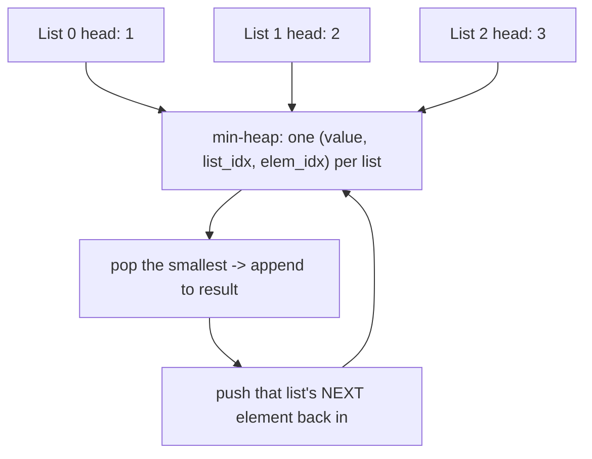

import DataCampExercise from "../../../../components/DataCampExercise.astro";

import HeapView from "../../../../components/viz/HeapView.tsx";


import ProblemLadder from "../../../../components/dsa/ProblemLadder.astro";
import Quiz from "../../../../components/Quiz.astro";

You already know how to merge **two** sorted lists in $O(n)$ -- it's the
merge step from merge sort. The interview twist is merging $k$ of them at
once. Doing that with repeated two-way merges works, but a **min-heap that
always holds one candidate per list** turns it into a single clean pass, and
it's the pattern behind an entire family of "smallest across k sequences"
questions.

## What you'll learn

- Why merging $k$ lists two-at-a-time is worse than it looks.
- The k-way merge template: a min-heap of
  `(value, list_index, element_index)` tuples, one entry per list.
- How the same heap-of-heads idea generalizes to a sorted **matrix**, not
  just a list of lists.
- Why the pattern costs $O(N \log k)$, where $N$ is the total element count.

## The cue

:::tip[You are looking at a k-way merge when...]
- The input is **several already-sorted sequences** and the output is one sorted sequence -- 23,
  21 (`k = 2`), 88.
- You need the **`n`th smallest across all of them** without materialising the merge -- 378, 373,
  632, 719.
- The phrase is "**`k` sorted lists**", "**`k` sorted arrays**", or "a matrix with **sorted rows**"
  -- a row-sorted matrix is `k` sorted lists wearing a disguise.
- You are merging **streams or iterators** whose total length you do not know, and only $O(k)$
  memory is available.
- The problem asks for the **smallest range / smallest interval covering one element from each
  list** -- that is a k-way merge with a sliding maximum (632).
:::

**When it is the wrong tool.** If there is one unsorted array and you want its `k` smallest, that is
[Top K](../top-k-elements/) or [quickselect](../quickselect-and-nth-element/) -- there are no sorted
runs to exploit. If the matrix is *fully* sorted when flattened, one binary search is $O(\log mn)$
and beats any merge. And if the question is "the `k`th smallest **value**" in a row/column-sorted
matrix with `n` large, **binary search on the value** is $O(n \log R)$ and beats the heap's
$O(k \log n)$ once `k` approaches $n^2$ -- LC 378 accepts both, and which one wins depends on `k`.

The tell that separates this from Top K: **the input is already sorted in pieces**, and the algorithm
exists to avoid throwing that structure away.

## The naive approach, and why it's worse than it looks

Merging $k$ sorted lists two at a time -- merge list 1 into list 2, merge
that into list 3, and so on -- costs $O(N \cdot k)$ in the worst case: each
of the $k$ merge passes touches close to all $N$ elements. As $k$ grows,
that quadratic-ish blowup gets painful. The fix is to never compare more
than $k$ candidates at once, no matter how many elements are still buried
inside each list.

## The pattern: one heap slot per list

Keep a min-heap with **at most one entry per list** -- always its current
smallest unconsumed element. Popping the heap's minimum gives you the next
overall smallest value; you then push that list's *next* element back in to
replace it. The heap tuple carries `(value, list_idx, elem_idx)` so you
always know exactly which list to advance.

```python title="merge_k_sorted_lists.py" showLineNumbers{1}
import heapq

def merge_k_sorted(lists):
    result = []
    heap = []

    # Seed the heap with each list's first element (skip empty lists).
    for i, lst in enumerate(lists):
        if lst:
            heapq.heappush(heap, (lst[0], i, 0))

    while heap:
        val, list_idx, elem_idx = heapq.heappop(heap)
        result.append(val)

        # Advance the list this value came from, if it has more elements.
        if elem_idx + 1 < len(lists[list_idx]):
            next_val = lists[list_idx][elem_idx + 1]
            heapq.heappush(heap, (next_val, list_idx, elem_idx + 1))

    return result


lists = [[1, 4, 7], [2, 5, 8], [3, 6, 9]]
print(merge_k_sorted(lists))   # expect [1, 2, 3, 4, 5, 6, 7, 8, 9]
```

:::note[Why the tuple needs list_idx as a tiebreaker]
Python compares tuples element by element. If two lists both offer the
same `value`, the comparison falls through to `list_idx` next -- an `int`,
always comparable. Without it, ties would fall through to comparing the
list objects themselves (or, for linked-list problems, `ListNode` objects),
which Python can't order and will crash on with a `TypeError`.
:::

## Visual intuition

The heap holds **one slot per list**, never the whole input. Watch the root: every pop is the global
minimum across all `k` lists, and the replacement comes only from the list that just gave one up:

<HeapView
  client:visible
  algo="top-k"
  values={[5, 1, 9, 3, 7, 2, 8]}
  k={3}
  title="A size-k heap: the root is the answer, everything else is bookkeeping"
  lib="LC 23 · O(N log k)"
  desc="Contrast the naive approach -- concatenate everything and sort -- at O(N log N). Keeping only k items in the heap is what turns log N into log k, and when k is 3 and N is a million that is the whole difference."
/>

## How it works



The heap never holds more than $k$ items at once -- one per list -- no
matter how large each individual list is. Every element from every list
gets pushed and popped from the heap exactly once over the whole run.

## Worked example: Kth Smallest Element in a Sorted Matrix

A matrix with sorted rows (and sorted columns) is just $k$ sorted lists in
disguise -- one list per row. Seed the heap with the first element of every
row, then pop $k$ times, advancing along each row exactly like before.

```python title="kth_smallest_in_matrix.py" showLineNumbers{1}
import heapq

def kth_smallest_in_matrix(matrix, k):
    n = len(matrix)
    # Seed the heap with the first element of every row.
    heap = [(matrix[row][0], row, 0) for row in range(n)]
    heapq.heapify(heap)

    val = None
    for _ in range(k):
        val, row, col = heapq.heappop(heap)
        if col + 1 < n:
            heapq.heappush(heap, (matrix[row][col + 1], row, col + 1))
    return val


matrix = [
    [1, 5, 9],
    [10, 11, 13],
    [12, 13, 15],
]
print(kth_smallest_in_matrix(matrix, 8))   # expect 13
```

The $k$-th pop off the heap is, by construction, the $k$-th smallest value
across the whole matrix -- you never sort all $9$ elements to get there.

## Dry run

### `merge_k_sorted([[1, 4, 7], [2, 5, 8], [3, 6, 9]])`

Heap contents are shown sorted for readability; only the root is guaranteed to be in place.

| Step | Pop | Result so far | Pushed | Heap after |
| --- | --- | --- | --- | --- |
| seed | -- | `[]` | -- | `(1,0,0) (2,1,0) (3,2,0)` |
| 1 | `(1,0,0)` | `[1]` | `(4,0,1)` | `(2,1,0) (3,2,0) (4,0,1)` |
| 2 | `(2,1,0)` | `[1,2]` | `(5,1,1)` | `(3,2,0) (4,0,1) (5,1,1)` |
| 3 | `(3,2,0)` | `[1,2,3]` | `(6,2,1)` | `(4,0,1) (5,1,1) (6,2,1)` |
| 4 | `(4,0,1)` | `[1,2,3,4]` | `(7,0,2)` | `(5,1,1) (6,2,1) (7,0,2)` |
| 5 | `(5,1,1)` | `[1,…,5]` | `(8,1,2)` | `(6,2,1) (7,0,2) (8,1,2)` |
| 6 | `(6,2,1)` | `[1,…,6]` | `(9,2,2)` | `(7,0,2) (8,1,2) (9,2,2)` |
| 7 | `(7,0,2)` | `[1,…,7]` | -- (list 0 exhausted) | `(8,1,2) (9,2,2)` |
| 8 | `(8,1,2)` | `[1,…,8]` | -- | `(9,2,2)` |
| 9 | `(9,2,2)` | `[1,…,9]` | -- | `[]` |

**The heap never exceeded 3 entries** -- one per list -- while nine elements passed through it. That
is the whole point: $O(k)$ space regardless of how long the lists are. Nine pops, six pushes, and
every element entered and left exactly once.

**Steps 7-9 show the heap shrinking.** Once a list is exhausted its slot is not refilled, so `k`
effectively decreases and the remaining work gets cheaper. Nothing special-cases this; the
`elem_idx + 1 < len(...)` check is the only guard.

### The tuple tiebreaker, and the crash without it

`kth_smallest_in_matrix` on

```
 1   5   9
10  11  13
12  13  15
```

with `k = 8`. Watch pops 6 and 7:

| Pop | Value | From | Pushed | Heap after |
| --- | --- | --- | --- | --- |
| 1 | 1 | row 0, col 0 | `(5,0,1)` | `(5,0,1) (10,1,0) (12,2,0)` |
| 2 | 5 | row 0, col 1 | `(9,0,2)` | `(9,0,2) (10,1,0) (12,2,0)` |
| 3 | 9 | row 0, col 2 | -- | `(10,1,0) (12,2,0)` |
| 4 | 10 | row 1, col 0 | `(11,1,1)` | `(11,1,1) (12,2,0)` |
| 5 | 11 | row 1, col 1 | `(13,1,2)` | `(12,2,0) (13,1,2)` |
| 6 | 12 | row 2, col 0 | `(13,2,1)` | **`(13,1,2) (13,2,1)`** |
| 7 | **13** | row 1, col 2 | -- | `(13,2,1)` |
| 8 | **13** | row 2, col 1 | `(15,2,2)` | `(15,2,2)` |

Answer `13`, matching `sorted(flattened)[7]` on `[1, 5, 9, 10, 11, 12, 13, 13, 15]`.

**After step 6 the heap holds two entries with the identical value 13.** Python compares tuples
left to right, so the value ties and the comparison falls through to `list_idx`: `1 < 2`, so row 1's
copy pops first. Both orders would give the same answer here, but the *comparison has to resolve* --
and that is the point.

Without the index, a tuple of `(value, node)` on tied values raises:

```
TypeError: '<' not supported between instances of 'Node' and 'Node'
```

verified directly. This is why the tuple is `(value, list_idx, elem_idx)` and not just
`(value, node)`. It bites on LC 23 specifically, where the payload is a `ListNode` -- and only on
inputs with duplicate values, so it passes small tests and crashes on the real ones. Any always-
comparable tiebreaker works; the list index is the natural one, and it is what you need anyway to
know which list to advance.

### The empty-list guard

Seeding with a comprehension instead of the guarded loop:

| Input | Guarded loop | `[(l[0], i, 0) for i, l in enumerate(lists)]` |
| --- | --- | --- |
| `[[], [1], []]` | `[1]` | **`IndexError`** |
| `[[], [], []]` | `[]` | `IndexError` |
| `[]` | `[]` | `[]` (vacuously) |

LC 23's constraints explicitly allow empty lists in the input, so `if lst:` is load-bearing, not
defensive style.

### Why sequential pairwise merging is worse, counted

Element-touch counts for `k` lists of 100 each -- one "touch" is one element copied through one merge
pass:

| `k` | `N` | Sequential pairwise | **Balanced** pairwise | Heap (pushes + pops) |
| --- | --- | --- | --- | --- |
| 10 | 1,000 | 5,400 | 3,600 | **1,000** |
| 100 | 10,000 | **504,900** | 68,800 | **10,000** |

Sequential merging -- fold list 1 into 2, that into 3, and so on -- re-copies the growing
accumulator on every pass: $O(Nk)$, and at `k = 100` that is 50x the heap's work.

**But balanced pairwise merging is genuinely competitive.** Merge lists in pairs, then pairs of
pairs, tournament style: $\log k$ rounds, each touching all `N` elements, so $O(N \log k)$ -- the
same asymptotic bound as the heap. Its 68,800 against the heap's 10,000 is a constant factor (the
heap counts single pushes and pops, the merge counts copies), and it needs $O(N)$ space rather than
$O(k)$.

So the honest answer to "can you do LC 23 without a heap?" is **yes, divide-and-conquer pairwise
merge, same $O(N \log k)$** -- and the heap's real advantages are $O(k)$ space and that it works on
streams of unknown length. Claiming the heap is asymptotically necessary is wrong, and it is a
follow-up interviewers do ask.

## Time and space complexity

| Operation | Complexity |
| --- | --- |
| Seeding the heap with $k$ heads | $O(k)$ |
| Each pop + push | $O(\log k)$ |
| Total for $N$ elements across $k$ lists | $O(N \log k)$ |
| Space (heap holds at most $k$ entries) | $O(k)$ |

Compare that to sorting all $N$ elements directly: $O(N \log N)$. When
$k \ll N$ -- a handful of long lists, or a matrix with far more entries
than rows -- the k-way merge is meaningfully cheaper.

## When to use it

- You have $k$ **already-sorted** sequences (lists, arrays, or matrix rows)
  and need them combined into one sorted output, or need only the $k$-th
  overall smallest/largest value without materializing the full merge.
- $k$ is small relative to the total element count $N$ -- the heap's
  $O(\log k)$ cost per step is what makes this cheaper than one big sort.
- The "list" doesn't have to be a Python list -- linked lists, matrix rows,
  or even ranges from `k` different iterators all work the same way, as
  long as each one is individually sorted and you can ask for "the next
  element after this one."

## The variant map

| Variant | What the heap entry carries | Canonical problem |
| --- | --- | --- |
| **Merge `k` sorted lists** | `(value, list_idx, elem_idx)` | 23 · 21 (`k = 2`) |
| **Merge `k` sorted linked lists** | `(value, list_idx, node)` -- the index is what makes ties comparable | 23 |
| **`k`th smallest in a row-sorted matrix** | `(value, row, col)`; pop `k` times | 378 |
| **`k`th smallest, `k` near $n^2$** | Abandon the heap -- **binary search the value**, counting entries $\le x$ per row: $O(n \log R)$ | 378 |
| **`k` smallest pairs from two arrays** | Frontier only: seed `(a[i] + b[0], i, 0)`, push `(i, j+1)` on pop -- never all $n^2$ pairs | 373 |
| **`k`th smallest in a multiplication table** | No array exists to merge -- binary search the value and count with division | 668 |
| **Smallest range covering one element per list** | Heap of heads plus a running **maximum**; the range is `max - heap[0]` | 632 |
| **`k`th smallest pair distance** | Binary search the distance, count pairs with two pointers | 719 |
| **Merge sorted iterators / files** | `heapq.merge(*iterables)` -- lazy, $O(k)$ memory, the stdlib version of this page | external sort |
| **Sorted output, `k` inputs, no heap** | Divide-and-conquer pairwise merge: also $O(N \log k)$, but $O(N)$ space | 23 |

:::note[`heapq.merge` is the one-liner, and it is lazy]
`heapq.merge(*lists)` is exactly this algorithm in the standard library: it yields values one at a
time, holds $O(k)$ state, and accepts arbitrary iterables -- so it merges files or generators that
never fit in memory. `key=` and `reverse=` are supported.

Reach for it in real code. Hand-roll the heap in an interview when the point is to show the
mechanics, and *say* that `heapq.merge` exists -- knowing the stdlib equivalent reads as fluency,
not as avoidance.
:::

:::caution[The frontier trick: do not push what you do not need]
For LC 373 (`k` pairs with the smallest sums) the tempting move is to push all $n \times m$ pairs and
pop `k`. That is $O(nm \log nm)$ and defeats the purpose.

Instead seed the heap with only `(a[i] + b[0], i, 0)` for each `i` -- the `k` (or `n`) best candidates
along one frontier -- and when you pop `(i, j)`, push only `(i, j + 1)`. The heap stays at $O(k)$ and
the total is $O(k \log k)$.

The general principle: **a heap should hold the frontier of unexplored candidates, never the whole
candidate set.** The same idea drives Dijkstra and A*.
:::

## Practice -- real LeetCode problems

Each exercise is the actual LeetCode problem with its real method signature and
LeetCode's own examples as the test. Write the body, press **Run**, and match the
expected output.

### LC 23 -- Merge k Sorted Lists · Hard

**Problem.** Merge `k` sorted linked lists into one sorted list and return its head.

**Constraints.** `0 <= k <= 10^4`, `0 <= len(each list) <= 500`, total nodes up to
`10^4`.

**Examples.** `[[1,4,5],[1,3,4],[2,6]]` gives `[1,1,2,3,4,4,5,6]` ·
`[]` gives `[]` · `[[]]` gives `[]`

<DataCampExercise
  lang="python"
  hint={`Push the head of each non-empty list into a min-heap, then repeatedly pop the smallest and push its successor. Heap entries must include a TIE-BREAKER -- push (value, list_index, node), because two nodes can share a value and ListNode objects are not comparable, which would raise a TypeError. Build the output behind a dummy head.`}
  code={`class ListNode:
    def __init__(self, val=0, next=None):
        self.val, self.next = val, next


def build_list(vals):
    d = ListNode(); t = d
    for v in vals:
        t.next = ListNode(v); t = t.next
    return d.next


def to_list(h):
    out = []
    while h:
        out.append(h.val); h = h.next
    return out


import heapq


class Solution:
    def mergeKLists(self, lists):
        # TODO: a min-heap of the current head of each list.
        # Heap entries need a tie-breaker: ListNode is not comparable, so
        # (value, list_index, node) avoids a TypeError on equal values.
        pass


sol = Solution()
cases = [[[1, 4, 5], [1, 3, 4], [2, 6]], [], [[]], [[1], [1]]]
print([to_list(sol.mergeKLists([build_list(v) for v in c])) for c in cases])
# expect [[1, 1, 2, 3, 4, 4, 5, 6], [], [], [1, 1]]`}
  solution={`class ListNode:
    def __init__(self, val=0, next=None):
        self.val, self.next = val, next


def build_list(vals):
    d = ListNode(); t = d
    for v in vals:
        t.next = ListNode(v); t = t.next
    return d.next


def to_list(h):
    out = []
    while h:
        out.append(h.val); h = h.next
    return out


import heapq


class Solution:
    def mergeKLists(self, lists):
        heap = []
        for i, node in enumerate(lists):
            if node:
                heapq.heappush(heap, (node.val, i, node))   # i breaks val ties

        dummy = ListNode(); tail = dummy
        while heap:
            _, i, node = heapq.heappop(heap)
            tail.next = node                 # splice the node in
            tail = node
            if node.next:
                heapq.heappush(heap, (node.next.val, i, node.next))
        return dummy.next


sol = Solution()
cases = [[[1, 4, 5], [1, 3, 4], [2, 6]], [], [[]], [[1], [1]]]
print([to_list(sol.mergeKLists([build_list(v) for v in c])) for c in cases])`}
  sct={`test_output_contains("[[1, 1, 2, 3, 4, 4, 5, 6], [], [], [1, 1]]")
success_msg("The list index is not decoration -- without it, equal values make Python compare ListNodes and crash.")
`}
  height={370}
/>

<details>
<summary>Editorial</summary>

The heap holds at most one node per list -- the smallest unconsumed value from each.
Popping the global minimum and pushing that node's successor keeps the invariant.

**Time** $O(N \log k)$ for `N` total nodes across `k` lists. **Space** $O(k)$.

:::caution[The tie-breaker is mandatory, not stylistic]
Pushing `(node.val, node)` looks fine and crashes. When two entries have equal
`val`, Python falls through to comparing the second element -- and `ListNode` defines
no `__lt__`, so you get `TypeError: '<' not supported between instances of
'ListNode'`. The `[[1],[1]]` test case triggers exactly this.

The list index is unique per entry and never ties, so the comparison stops there. The
alternative is giving `ListNode` a `__lt__`, which is fine but more intrusive.
:::

Two other approaches worth naming:

- **Pairwise merging.** Merge lists in rounds, halving the count each time:
  $O(N \log k)$ too, and it avoids the heap entirely. Many people find it easier to
  reason about.
- **Concatenate and sort.** $O(N \log N)$ -- worse, and it ignores the sortedness you
  were given.

**Follow-ups:** "Do it without a heap?" -- pairwise merging, using
[LC 21](../../phase-08-patterns-linked-lists/dummy-head-rewiring-and-merging/) as the
subroutine. "Merge `k` sorted **arrays**?" -- same heap, indices instead of nodes.
"Why $O(N \log k)$ and not $O(N \log N)$?" -- the heap never holds more than `k`
entries.

</details>

### LC 378 -- Kth Smallest Element in a Sorted Matrix · Medium

**Problem.** Given an `n x n` matrix whose rows **and** columns are each sorted
ascending, return the `k`th smallest element (in overall sorted order, counting
duplicates).

**Constraints.** `1 <= n <= 300`, `1 <= k <= n^2`.

**Examples.** `matrix = [[1,5,9],[10,11,13],[12,13,15]], k = 8` gives `13` ·
`matrix = [[-5]], k = 1` gives `-5`

<DataCampExercise
  lang="python"
  hint={`Treat each ROW as a sorted list and run a k-way merge. Seed the heap with the first element of each row as (value, row, col), then pop k-1 times, each time pushing the next element from the same row. Only the first min(n, k) rows can matter, since the kth smallest cannot come from a later row's first element.`}
  code={`import heapq


class Solution:
    def kthSmallest(self, matrix, k):
        # TODO: k-way merge over the ROWS.
        # Seed with the first element of each row as (value, row, col),
        # then pop k-1 times, pushing the next element from the same row.
        pass


sol = Solution()
cases = [([[1, 5, 9], [10, 11, 13], [12, 13, 15]], 8), ([[-5]], 1),
         ([[1, 2], [1, 3]], 2)]
print([sol.kthSmallest([r[:] for r in m], k) for m, k in cases])
# expect [13, -5, 1]`}
  solution={`import heapq


class Solution:
    def kthSmallest(self, matrix, k):
        n = len(matrix)
        # only the first min(n, k) rows can contribute the kth smallest
        heap = [(matrix[r][0], r, 0) for r in range(min(n, k))]
        heapq.heapify(heap)
        for _ in range(k - 1):
            val, r, c = heapq.heappop(heap)
            if c + 1 < n:
                heapq.heappush(heap, (matrix[r][c + 1], r, c + 1))
        return heap[0][0]


sol = Solution()
cases = [([[1, 5, 9], [10, 11, 13], [12, 13, 15]], 8), ([[-5]], 1),
         ([[1, 2], [1, 3]], 2)]
print([sol.kthSmallest([r[:] for r in m], k) for m, k in cases])`}
  sct={`test_output_contains("[13, -5, 1]")
success_msg("n sorted rows is just a k-way merge -- and only the first k rows can matter.")
`}
  height={300}
/>

<details>
<summary>Editorial</summary>

The matrix is `n` sorted lists, so this is a k-way merge stopped after `k` pops.

**Time** $O(k \log n)$. **Space** $O(n)$.

Seeding only `min(n, k)` rows is a genuine optimisation: the first element of row `k`
is at least as large as the first elements of all earlier rows, so it cannot be among
the `k` smallest.

`[[1,2],[1,3]]` with `k = 2` gives `1` -- duplicates count separately, so the answer
is the second `1`, not `2`. That is a common misreading.

The stronger solution is **binary search on the value range**: pick a candidate value,
count how many matrix entries are at most it (via a staircase walk from the
bottom-left, $O(n)$), and binary search until the count reaches `k`. That is
$O(n \log(\max - \min))$, which beats $O(k \log n)$ when `k` approaches $n^2$, and
it uses $O(1)$ space. Worth naming as the follow-up answer -- it composes the
[staircase walk](../binary-search-on-rotated-arrays-and-matrices/) with
[binary search on the answer](../binary-search-on-answer/).

**Follow-ups:** "Beat $O(k \log n)$?" -- the value-range binary search above. "Why
only `min(n, k)` rows?" -- the bounding argument. "Kth **largest**?" -- mirror it, or
ask for the $(n^2 - k + 1)$th smallest.

</details>

### LC 373 -- Find K Pairs with Smallest Sums · Medium

**Problem.** Given two sorted arrays and an integer `k`, return the `k` pairs
`(u, v)` with `u` from `nums1` and `v` from `nums2` that have the smallest sums.

**Constraints.** `1 <= len(nums1), len(nums2) <= 10^5`, both sorted ascending,
`1 <= k <= 10^4`.

**Examples.** `nums1 = [1,7,11], nums2 = [2,4,6], k = 3` gives
`[[1,2],[1,4],[1,6]]` · `nums1 = [1,1,2], nums2 = [1,2,3], k = 2` gives
`[[1,1],[1,1]]`

<DataCampExercise
  hint={`Do NOT build all pairs -- there can be 10^10 of them. Seed the heap with the pairs (nums1[i], nums2[0]) for the first min(len(nums1), k) values of i. Then each time you pop (i, j), push (i, j+1) -- advancing only the second index. That generates candidates lazily, and every pair is reachable exactly once.`}
  lang="python"
  code={`import heapq


class Solution:
    def kSmallestPairs(self, nums1, nums2, k):
        # TODO: lazy generation -- never materialise all pairs.
        # Seed with (nums1[i] + nums2[0], i, 0) for the first k values of i,
        # then on popping (i, j) push (i, j + 1).
        pass


sol = Solution()
cases = [([1, 7, 11], [2, 4, 6], 3), ([1, 1, 2], [1, 2, 3], 2), ([1, 2], [3], 3)]
print([sol.kSmallestPairs(a, b, k) for a, b, k in cases])
# expect [[[1, 2], [1, 4], [1, 6]], [[1, 1], [1, 1]], [[1, 3], [2, 3]]]`}
  solution={`import heapq


class Solution:
    def kSmallestPairs(self, nums1, nums2, k):
        if not nums1 or not nums2:
            return []
        # seed one candidate per nums1 index, paired with nums2[0]
        heap = [(nums1[i] + nums2[0], i, 0) for i in range(min(len(nums1), k))]
        heapq.heapify(heap)

        out = []
        while heap and len(out) < k:
            _, i, j = heapq.heappop(heap)
            out.append([nums1[i], nums2[j]])
            if j + 1 < len(nums2):
                heapq.heappush(heap, (nums1[i] + nums2[j + 1], i, j + 1))
        return out


sol = Solution()
cases = [([1, 7, 11], [2, 4, 6], 3), ([1, 1, 2], [1, 2, 3], 2), ([1, 2], [3], 3)]
print([sol.kSmallestPairs(a, b, k) for a, b, k in cases])`}
  sct={`test_output_contains("[[[1, 2], [1, 4], [1, 6]], [[1, 1], [1, 1]], [[1, 3], [2, 3]]]")
success_msg("Advance only the second index -- that is what makes every pair reachable exactly once.")
`}
  height={330}
/>

<details>
<summary>Editorial</summary>

There can be $10^{10}$ pairs, so they must be generated **lazily**. The structure is a
k-way merge over conceptual rows: row `i` is the sorted sequence
`nums1[i] + nums2[0], nums1[i] + nums2[1], …`.

**Time** $O(k \log k)$. **Space** $O(k)$.

The generation rule is what makes it correct: seed one entry per `nums1` index, and
when popping `(i, j)` push only `(i, j+1)`. Because each row is entered once at
`j = 0` and advanced only along `j`, **every pair is reachable by exactly one path** --
so no duplicates and nothing missed. Pushing both `(i+1, j)` and `(i, j+1)` is the
common variant and it needs a `visited` set, because pairs become reachable two ways.

`([1,1,2], [1,2,3], 2)` giving `[[1,1],[1,1]]` shows duplicate *values* are distinct
*pairs* -- both `nums1[0]` and `nums1[1]` pair with `nums2[0]`.

Seeding only `min(len(nums1), k)` rows matters at the stated constraints: with
`len(nums1) = 10^5` and `k = 10^4`, seeding everything would be ten times the
necessary work.

**Follow-ups:** "Why not push both directions?" -- it works but needs deduplication;
the one-direction rule avoids it. "Kth smallest sum rather than the first k?" -- pop
`k` times and return the last. "Three arrays?" -- fold pairwise, or extend the heap
entry to three indices.

</details>

## LeetCode problem set

Generated from the problem database, so each entry carries its sheet
membership and reported companies. Tick them off as you go — progress is
saved in this browser, and the Export button writes it to a file you can keep.

<ProblemLadder pattern="k-way-merge"
  notes={{"23":"The exact template, applied to linked lists instead of Python lists","373":"The \"lists\" are implicit (all pairs `(nums1[i], nums2[j])`), generated and pruned lazily through the heap instead of built up front","378":"Treat each row as one of the $k$ sorted sequences","632":"Extend the pattern: track the current max alongside the heap's min to shrink the covering range as you advance"}} />

## Interview follow-ups

| They ask | What they're checking | The answer |
| --- | --- | --- |
| "Why does the tuple carry `list_idx`?" | Whether you have hit the crash | Two purposes. It tells you which list to advance, and it makes tied values comparable -- without it, `(value, node)` on a duplicate raises `TypeError: '<' not supported between instances of 'ListNode'`. It only fails on inputs with duplicates, so it passes small tests |
| "What is the complexity, and in terms of what?" | Naming the right variables | $O(N \log k)$ time where `N` is the **total** element count and `k` the number of lists, plus $O(k)$ space. Not $O(N \log N)$ -- the heap is capped at one entry per list |
| "Can you do it without a heap?" | Whether you know the heap is not required | Yes -- divide-and-conquer pairwise merge is also $O(N \log k)$: $\log k$ rounds, each touching all `N`. The heap's advantages are $O(k)$ space instead of $O(N)$, and it works on streams of unknown length. Claiming the heap is asymptotically necessary is wrong |
| "Why is merging them one at a time worse?" | Cost analysis | Sequential folding re-copies the growing accumulator each pass: $O(Nk)$. Counted for `k = 100` lists of 100, that is 504,900 element touches against the heap's 10,000 |
| "The lists are now streams of unknown length" | Where the heap actually wins | Unchanged -- the heap holds one entry per stream and asks each for its next value. This is what `heapq.merge` does, and it is how external merge sort works |
| "`k` is now close to $n^2$ in LC 378" | Whether you re-check the bound | The heap is $O(k \log n)$, so a large `k` makes it worse than **binary search on the value**: guess `x`, count entries $\le x$ in $O(n)$ using the sorted rows, narrow. $O(n \log R)$, independent of `k` |
| "Now find the `k` smallest *pairs* from two arrays" | Whether you push the whole cross product | Seed one frontier -- `(a[i] + b[0], i, 0)` -- and on popping `(i, j)` push only `(i, j + 1)`. $O(k \log k)$. Pushing all $nm$ pairs is the trap |
| "Give me the smallest range containing one element from each list" | Composing the pattern | Same heap of heads, plus a running maximum of everything currently in it. The candidate range is `current_max - heap[0]`; advance the list that just gave up its minimum. LC 632 |
| "Is there a stdlib shortcut?" | Fluency | `heapq.merge(*iterables, key=…)` -- lazy, $O(k)$ memory, arbitrary iterables. Say it exists, then hand-roll if the interviewer wants the mechanics |
| "What if one list is empty?" | Edge cases | The seeding loop must skip it. Seeding with a comprehension raises `IndexError` on `[[], [1], []]`, and LC 23 explicitly permits empty lists in the input |

## Self-check

<Quiz
  questions={[
    {
      q: "Why does the heap entry carry `list_idx` in addition to the value?",
      options: [
        "Only so you know which list to advance after popping",
        "Both to know which list to advance and to make tied values comparable -- without it, a tuple like (value, node) raises TypeError on duplicates",
        "To keep the heap stable, so equal values pop in input order",
        "It is redundant; elem_idx alone is enough",
      ],
      answer: 1,
      explain:
        "Python compares tuples left to right, so on a tie it moves to the next component. With (value, node) that means comparing ListNode objects, which raises `TypeError: '<' not supported`. Verified directly. The vicious part is that it only fails when two lists offer the same value, so it passes small tests and crashes on real input. Stability is a side effect, not the reason.",
    },
    {
      q: "In the 3x3 matrix trace, the heap briefly holds (13,1,2) and (13,2,1) at once. What decides which pops first?",
      options: [
        "Insertion order -- heapq is stable",
        "The tuple comparison falls through the tied value to list_idx, and 1 < 2, so row 1's copy pops first",
        "The one with the smaller elem_idx",
        "It is undefined behaviour",
      ],
      answer: 1,
      explain:
        "heapq is not stable -- there is no insertion-order guarantee at all. The tiebreak is whatever the next tuple component says, which is exactly why an always-comparable one must be there. Both orders happen to give the same answer for LC 378, but the comparison must *resolve* or the pop raises.",
    },
    {
      q: "What is the complexity of the k-way merge, and in terms of which variables?",
      options: [
        "O(N log N) time, O(N) space",
        "O(N log k) time and O(k) space, where N is the total element count and k the number of lists",
        "O(k log N) time, O(k) space",
        "O(Nk) time, O(1) space",
      ],
      answer: 1,
      explain:
        "The heap holds at most one entry per list, so each of the N push/pop pairs costs log k rather than log N. In the nine-element trace the heap never exceeded 3 entries. O(k) space is what lets the algorithm run on streams -- and it is the property that distinguishes it from every alternative.",
    },
    {
      q: "\"Can you merge k sorted lists without a heap, in the same time bound?\"",
      options: [
        "No -- O(N log k) requires a heap",
        "Yes -- divide-and-conquer pairwise merging is also O(N log k): log k rounds, each touching all N elements",
        "Yes, but only O(Nk) sequentially",
        "Yes, by concatenating and sorting, which is also O(N log k)",
      ],
      answer: 1,
      explain:
        "Merge in pairs, then pairs of pairs, tournament style. Counted for k = 100 lists of 100: sequential folding costs 504,900 element touches, balanced pairwise 68,800, the heap 10,000 pushes plus pops. The heap wins on constant factor and on space -- O(k) versus O(N) -- and it handles streams. But it is not asymptotically necessary, and claiming otherwise is a common overstatement. Concatenate-and-sort is O(N log N), a different bound.",
    },
    {
      q: "Seeding the heap with `[(l[0], i, 0) for i, l in enumerate(lists)]` instead of a guarded loop. What breaks?",
      options: [
        "Nothing -- it is equivalent and shorter",
        "`IndexError` on any empty input list, which LC 23 explicitly permits",
        "The heap invariant, because heapify is not called",
        "Ties become uncomparable",
      ],
      answer: 1,
      explain:
        "`l[0]` on an empty list raises immediately -- verified on [[], [1], []], which the guarded version correctly returns [1] for. LC 23's constraints allow empty lists in the input, so `if lst:` is load-bearing rather than defensive style. (The comprehension does still need an explicit heapify, but that is a separate issue.)",
    },
    {
      q: "LC 373 asks for the k pairs with the smallest sums from two arrays of length n. What is the trap?",
      options: [
        "Forgetting to sort the arrays first",
        "Pushing all n^2 pairs into the heap -- O(n^2 log n^2) -- instead of seeding one frontier and expanding it",
        "Using a min-heap where a max-heap is needed",
        "Not handling duplicate sums",
      ],
      answer: 1,
      explain:
        "Seed only (a[i] + b[0], i, 0) for each i, and on popping (i, j) push just (i, j + 1). The heap stays O(k) and the total is O(k log k). The general principle is that a heap should hold the *frontier* of unexplored candidates, never the whole candidate set -- the same idea that makes Dijkstra and A* work.",
    },
    {
      q: "For LC 378 (kth smallest in a row/column-sorted matrix), when is the heap the wrong choice?",
      options: [
        "When n is small",
        "When k approaches n^2 -- the heap is O(k log n), so binary searching the value at O(n log R) becomes better and is independent of k",
        "When the matrix contains duplicates",
        "Never -- the heap is always optimal here",
      ],
      answer: 1,
      explain:
        "The heap pops k times, so its cost scales with k. Binary search on the *value* guesses x, counts entries <= x in O(n) by walking each sorted row, and narrows -- O(n log R) regardless of k. LC 378 accepts both, and which wins depends on k relative to n^2. Noticing that the bound has a k in it is the whole point.",
    },
    {
      q: "The inputs become file streams too large to hold in memory. Does the algorithm change?",
      options: [
        "Yes -- you must sort each file externally first",
        "No -- the heap holds one entry per stream and asks each for its next value; this is exactly what heapq.merge and external merge sort do",
        "Yes -- switch to divide-and-conquer pairwise merging",
        "No, but the complexity becomes O(N log N)",
      ],
      answer: 1,
      explain:
        "O(k) space and one forward pass per input are precisely the properties that make this the streaming algorithm. `heapq.merge(*iterables)` is the lazy stdlib version, accepting any iterables with an optional key. Pairwise merging is the wrong answer here -- it needs O(N) space to hold the intermediate results.",
    },
  ]}
/>

## Recall card

- **`k` sorted inputs -> a min-heap holding one entry per input.** Pop the global minimum, then push
  only the *next* element from the list that just gave one up.
- **The entry is `(value, list_idx, elem_idx)`.** The index tells you which list to advance **and**
  makes ties comparable -- without it, `(value, node)` raises `TypeError` on duplicate values, so it
  passes small tests and fails real ones.
- **$O(N \log k)$ time, $O(k)$ space** -- `N` total elements, `k` lists. Each element is pushed and
  popped exactly once, and the heap is capped at `k`.
- **Skip empty lists when seeding.** A comprehension raises `IndexError`; LC 23 allows empty inputs.
- **A row-sorted matrix is `k` sorted lists.** Seed with each row's head, pop `k` times.
- **Sequential pairwise folding is $O(Nk)$** -- 504,900 touches against 10,000 at `k = 100`. But
  **balanced** pairwise merge is also $O(N \log k)$; the heap's real edges are $O(k)$ space and
  streaming, not the asymptotic bound.
- **The heap holds the frontier, never the whole candidate set.** LC 373: seed one row of candidates
  and expand on pop -- never all $n^2$ pairs.
- **When `k` approaches $n^2$, switch to binary search on the value** ($O(n \log R)$, independent of
  `k`) -- LC 378, 668, 719.
- **`heapq.merge(*iterables, key=…)`** is this algorithm in the stdlib: lazy, $O(k)$ memory, any
  iterable. Name it, then hand-roll if asked.

## Recap

- Merging $k$ sorted sequences two at a time costs up to $O(N \cdot k)$ --
  a single heap holding one candidate per sequence does it in
  $O(N \log k)$ instead.
- The heap tuple is `(value, list_idx, elem_idx)` -- the indices both
  identify where to advance next and break ties Python can compare safely.
- Every element is pushed and popped from the heap exactly once over the
  whole run.
- The same idea covers linked lists, plain arrays, matrix rows, and even
  lazily generated pairs -- anything you can ask "what's your next
  smallest element?"

Next: **Binary Search on Answer** -- turning binary search from an array
lookup into a tool for optimization problems.
