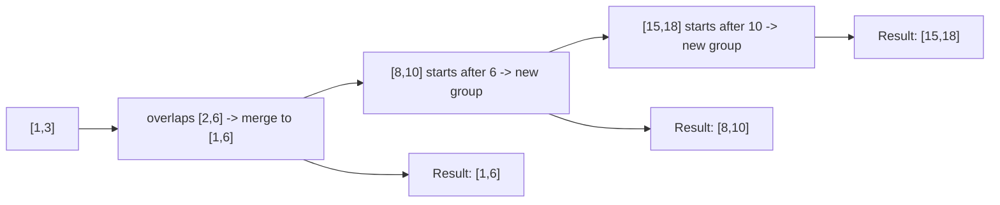

Any problem about **ranges** -- meeting times, calendar events, number
ranges -- that asks you to combine overlapping ones, insert a new one, or
count how many you need, is a **merge intervals** problem. The trick that
unlocks all of them: **sort by start time first**. Once intervals are
sorted, overlaps only ever happen between neighbors, so a single pass is
enough.

## What you'll learn

- Why sorting by start time turns an $O(n^2)$ overlap check into
  $O(n \log n)$ total.
- The merge template: compare each interval to the last one you kept.
- Worked example: merging a list of overlapping intervals.
- Related variants: inserting a new interval, and counting the minimum
  resources needed (meeting rooms).
- The cue that says "sort by start, then sweep."

## The cue

:::tip[You are looking at merge intervals when…]
- The input is a **list of intervals** and the output is **also intervals** — combined spans,
  the gaps between them, or the result of inserting one more.
- The words are **"merge"**, **"overlapping"**, **"consolidate"**, **"free time"**,
  **"insert"**, or **"remove covered"**.
- Two intervals interact **only if they touch or overlap**, and once sorted by start, every
  interaction is with the *immediately preceding* kept interval — never with anything further
  back.

**The reframe:** sorting by start converts a pairwise $O(n^2)$ question into a single pass with
one piece of state, `merged[-1]`. Everything earlier than that is already final and can never be
affected again, which is the property the whole pattern rests on.

**Reach for something else** when the answer is a **count** rather than intervals ("how many
rooms", "peak overlap" → [sweep line](../sweep-line-and-event-counting/)); when you must
**select a subset** rather than combine ("most non-overlapping meetings" →
[greedy scheduling](../greedy-interval-scheduling/)); or when intervals arrive **one at a time
and must be queried between arrivals** (LC 715, LC 352 — that wants an ordered structure such
as `SortedList` or a balanced tree, since re-sorting per insertion is $O(n^2 \log n)$).
:::

## The pattern

Sort intervals by their start value. Walk through them once, keeping a
"merged" list. For each new interval, compare it only to the **last**
interval you've kept: if they overlap, extend the last one; if not,
append the new interval as its own entry.

```python title="merge_intervals_template.py" showLineNumbers{1}
def merge_intervals(intervals):
    if not intervals:
        return []

    intervals = sorted(intervals, key=lambda pair: pair[0])
    merged = [intervals[0]]

    for start, end in intervals[1:]:
        last_start, last_end = merged[-1]
        if start <= last_end:                 # overlaps the last kept interval
            merged[-1] = [last_start, max(last_end, end)]
        else:                                  # no overlap -- start a new group
            merged.append([start, end])

    return merged


print(merge_intervals([[1, 3], [2, 6], [8, 10], [15, 18]]))
```

## Visual intuition

Sorted by start time, then a single linear pass. The sort is the algorithm:

<IntervalTimeline
  client:visible
  algo="merge"
  intervals={[[1, 3], [2, 6], [8, 10], [15, 18]]}
  title="Once sorted by start, only the most recent kept interval can overlap"
  lib="LC 56 · O(n log n)"
  desc="That is why one comparison per step suffices. Note the max() when absorbing: taking the incoming end unconditionally breaks on a fully contained interval like [1,10] followed by [2,3]."
/>

## How it works

Sorting guarantees that if interval `i` doesn't overlap the interval
right before it, it can't overlap anything even earlier either (their
starts only get bigger). That's what makes comparing to just the **last**
kept interval enough -- you never need to look further back.



```p5 title="Overlapping intervals merging on a number line" desc="Intervals are sorted by start. Each new interval either extends the current merged bar (overlap) or starts a fresh one (gap)." height="280"
let raw = [[1, 3], [2, 6], [8, 10], [15, 18]];
let steps = [
  { upto: 1, merged: [[1, 3]], note: "start with [1,3]" },
  { upto: 2, merged: [[1, 6]], note: "[2,6] overlaps -> merge to [1,6]" },
  { upto: 3, merged: [[1, 6], [8, 10]], note: "[8,10] starts after 6 -> new group" },
  { upto: 4, merged: [[1, 6], [8, 10], [15, 18]], note: "[15,18] starts after 10 -> new group" }
];
let stepIndex = 0;
let lastTime = 0;
let stepDelay = 1200;

function setup() {
  createCanvas(600, 260);
  textFont("monospace");
}

function scaleX(v) {
  const margin = 40;
  return margin + (v / 20) * (width - 2 * margin);
}

function draw() {
  background(13, 17, 23);

  if (millis() - lastTime > stepDelay) {
    lastTime = millis();
    stepIndex = (stepIndex + 1) % steps.length;
  }

  const s = steps[stepIndex];

  stroke(90, 98, 110);
  strokeWeight(1);
  line(scaleX(0), 60, scaleX(20), 60);

  noStroke();
  fill(255);
  textAlign(CENTER, CENTER);
  textSize(12);
  for (let v = 0; v <= 20; v += 5) {
    text(v, scaleX(v), 42);
  }

  fill(120, 130, 140);
  textAlign(LEFT, CENTER);
  textSize(12);
  text("raw intervals:", 20, 90);
  for (let i = 0; i < raw.length; i++) {
    const [a, b] = raw[i];
    const used = i < s.upto;
    fill(used ? color(75, 139, 190) : color(70, 76, 86));
    rect(scaleX(a), 100, scaleX(b) - scaleX(a), 16, 6);
  }

  fill(120, 130, 140);
  textAlign(LEFT, CENTER);
  text("merged result:", 20, 150);
  for (const [a, b] of s.merged) {
    fill(120, 200, 140);
    rect(scaleX(a), 160, scaleX(b) - scaleX(a), 20, 6);
  }

  fill(210);
  textAlign(CENTER, TOP);
  textSize(13);
  text(s.note, width / 2, 210);
}
```

## Worked example

**Merge Intervals.** The template above, applied directly.

```python title="merge_intervals.py" showLineNumbers{1}
def merge_intervals(intervals):
    if not intervals:
        return []

    intervals = sorted(intervals, key=lambda pair: pair[0])
    merged = [intervals[0]]

    for start, end in intervals[1:]:
        last_start, last_end = merged[-1]
        if start <= last_end:
            merged[-1] = [last_start, max(last_end, end)]
        else:
            merged.append([start, end])

    return merged


print(merge_intervals([[1, 3], [2, 6], [8, 10], [15, 18]]))
# expect [[1, 6], [8, 10], [15, 18]]
```

**Meeting Rooms II.** A close relative: instead of merging, count the
**maximum overlap at any point in time** -- the fewest rooms needed. Sort
start times and end times separately, then sweep both with two pointers:
every time a meeting starts before the earliest one ends, you need
another room.

```python title="meeting_rooms_ii.py" showLineNumbers{1}
def min_meeting_rooms(intervals):
    starts = sorted(start for start, end in intervals)
    ends = sorted(end for start, end in intervals)

    rooms_needed = 0
    max_rooms = 0
    s = e = 0

    while s < len(starts):
        if starts[s] < ends[e]:
            rooms_needed += 1       # a new meeting starts before one ends
            s += 1
        else:
            rooms_needed -= 1       # a meeting ended, free up a room
            e += 1
        max_rooms = max(max_rooms, rooms_needed)

    return max_rooms


print(min_meeting_rooms([[0, 30], [5, 10], [15, 20]]))   # expect 2
```

:::tip[Insert Interval is a special case]
**Insert Interval** hands you an already-merged, sorted list plus one new
interval to add. You don't need to re-sort: walk past intervals that end
before the new one starts, merge all intervals that overlap the new one,
then append the rest untouched -- still a single $O(n)$ pass.
:::

## Dry run

`[[1,3], [2,6], [8,10], [15,18]]` — already sorted by start, so the sort changes nothing here
(deliberately: it isolates the scan).

| incoming | vs `merged[-1]` | test | action | `merged` |
| --- | --- | --- | --- | --- |
| `[1,3]` | — | seed | initialise | `[[1,3]]` |
| `[2,6]` | `[1,3]` | 2 ≤ 3 ✓ **overlap** | extend end to `max(3, 6) = 6` | `[[1,6]]` |
| `[8,10]` | `[1,6]` | 8 ≤ 6 ✗ **gap** | append | `[[1,6], [8,10]]` |
| `[15,18]` | `[8,10]` | 15 ≤ 10 ✗ **gap** | append | `[[1,6], [8,10], [15,18]]` |

Answer `[[1,6], [8,10], [15,18]]`.

Four things the table makes concrete:

- **Only `merged[-1]` is ever consulted.** When `[8,10]` arrives, `[1,6]` is compared and
  `[1,3]`'s original form is irrelevant — it has already been absorbed. Sorting by start is what
  guarantees nothing earlier can still overlap: any interval starting later than `merged[-1]`'s
  start that overlapped something *before* it would have had to overlap `merged[-1]` too.
- **`max(last_end, end)` is not decoration.** Try `[[1,10], [2,3]]`: the second interval is
  *nested* inside the first, so extending blindly to `end` would shrink the span to `[1,3]`.
  With `max` it stays `[1,10]`. Nested intervals are the standard failing test case for this
  line.
- **`start <= last_end` merges touching intervals.** `[1,3]` and `[3,5]` become `[1,5]`. If a
  problem treats touching as *distinct* (rare for merging, common for scheduling) the test
  becomes `<`. Read the statement — LC 56 wants them merged.
- **The output is built in sorted order for free**, so no final sort is needed. That matters for
  LC 57 and LC 986, which assume sorted output.

**LC 57 (insert one interval) on the same shape:** inserting `[4,8]` into
`[[1,2],[3,5],[6,7],[8,10],[12,16]]` gives `[[1,2], [3,10], [12,16]]` — the new interval
swallows three existing ones at once. The three-phase version (copy those entirely before,
absorb those overlapping, copy those entirely after) is $O(n)$ with no sort, because the input
is already sorted. Re-running the full merge would also be correct but throws away that
guarantee.

## Time and space complexity

| Step | Time | Space |
| --- | --- | --- |
| Sort by start | $O(n \log n)$ | $O(n)$ (or $O(\log n)$ for the sort itself) |
| Single merge pass | $O(n)$ | $O(n)$ for the output |
| **Total** | $O(n \log n)$ | $O(n)$ |

The sort dominates the runtime -- once intervals are ordered, merging
itself is linear.

## When to use it

| Cue in the problem | Approach |
| --- | --- |
| "merge all overlapping intervals" | Sort by start, sweep once |
| "insert a new interval into a sorted list" | Skip / merge / append in one pass |
| "minimum number of meeting rooms / resources" | Sort starts and ends separately, sweep both |
| "can a person attend all meetings" | Sort by start, check consecutive overlap |
| "count non-overlapping intervals to remove" | Sort by **end** time, greedily keep earliest-ending |

## The variant map

| Problem | Sort key | What changes |
| --- | --- | --- |
| **LC 56** Merge Intervals | start | the base template |
| **LC 57** Insert Interval | — (already sorted) | three phases — before / absorb / after — in $O(n)$ with no sort |
| **LC 252** Meeting Rooms | start | just detect *any* overlap; return on the first one |
| **LC 253** Meeting Rooms II | — | a **count**, not intervals → [sweep line](../sweep-line-and-event-counting/) or a heap |
| **LC 1288** Remove Covered Intervals | start asc, **end desc** | the tie-break is the trick: with equal starts, the longer one must come first so the shorter is seen as covered |
| **LC 986** Interval List Intersections | — (both sorted) | two pointers; the intersection is `[max(starts), min(ends)]`, kept only when non-empty |
| **LC 759** Employee Free Time | start | merge *all* employees' intervals, then output the **gaps** between merged spans |
| **LC 435** Erase Overlap Intervals | **end** | selection, not merging → [greedy scheduling](../greedy-interval-scheduling/) |
| **LC 1229** Meeting Scheduler | — | intersect two lists, then keep the first intersection of at least `duration` |
| **LC 715 / 352** Range module, Data stream as ranges | — | intervals arrive over time; a single pass no longer applies, so use an ordered structure (`SortedList`, balanced tree) |
| **Merge intervals with weights** | start | keep a running weight while merging; overlapping spans accumulate rather than just extend |

## Pitfalls

- **Forgetting `max(last_end, end)`.** A nested interval such as `[2,3]` inside `[1,10]` will
  shrink the merged span to `[1,3]`. The most common single-character bug on this page.
- **Sorting by end when the task is merging.** End-sorting is for *selection* (LC 435). Merging
  needs start order, otherwise "only compare with `merged[-1]`" stops being valid.
- **Mutating the caller's list.** `intervals.sort()` sorts in place; `sorted(intervals)` does
  not. Say which you are doing — some interviewers care, and LeetCode does not.
- **`<` versus `<=` for touching intervals.** LC 56 merges `[1,3]` and `[3,5]`; a scheduling
  problem may treat them as compatible instead. Read the statement rather than guessing.
- **Assuming the input is sorted.** LC 57 and LC 986 guarantee it; LC 56 does not. Sorting a
  pre-sorted list is harmless, but *skipping* the sort on unsorted input silently produces
  garbage.
- **Building the result then sorting it again.** Unnecessary — the scan emits in sorted order.
- **Comparing every pair.** $O(n^2)$ works at `n < 1000` and is the answer you should visibly
  reject: the sort is what makes it $O(n \log n)$.
- **Empty input.** `merged = [intervals[0]]` raises `IndexError` on `[]`; the guard is one line
  and LeetCode does test it in some variants.

## Interview follow-ups

| They ask | What they're checking | The answer |
| --- | --- | --- |
| "Why is comparing against only the last merged interval enough?" | The core invariant | Because sorting by start means anything still to come starts at or after the current interval's start. If it overlapped something earlier, it would have to overlap `merged[-1]` as well — so everything before `merged[-1]` is final |
| "Why `max(last_end, end)`?" | Whether you have hit the nested case | Because the incoming interval may be entirely contained in the current one. `[[1,10],[2,3]]` must stay `[1,10]`; taking `end` blindly gives `[1,3]` |
| "What is the complexity, and what dominates?" | Precision | $O(n \log n)$ from the sort, then one $O(n)$ pass; $O(n)$ output. If the input is already sorted — LC 57, LC 986 — the whole thing is $O(n)$ |
| "Do touching intervals merge?" | Reading carefully | For LC 56, yes: `start <= last_end`. For problems where an interval ends *before* the next may begin, use `<`. It is a one-character decision driven by the statement, not by the algorithm |
| "Now give me the free time between meetings" | Composition | Merge everything, then emit the gaps: for consecutive merged spans `a` and `b`, output `[a.end, b.start]`. That is LC 759, and it is merging plus one extra pass |
| "Intervals arrive one at a time and I query after each" | Boundaries | A single sorted pass no longer applies. Keep them in an ordered structure — `sortedcontainers.SortedList` or a balanced BST — and merge locally around the insertion point in $O(\log n)$ plus the number of intervals absorbed |
| "How many rooms do these meetings need?" | Choosing the right pattern | That is a count, not a set of intervals — sweep line or a min-heap of end times. Reaching for merging there is the classic mis-selection between these two pages |
| "LC 1288 asks which intervals are covered by another" | The tie-break | Sort by start ascending **and end descending**. With equal starts the longer interval must be processed first, or the shorter one will not be recognised as covered |

## Practice -- real LeetCode problems

Each exercise is the actual LeetCode problem with its real method signature and
LeetCode's own examples as the test. Write the body, press **Run**, and match the
expected output.

### LC 56 -- Merge Intervals · Medium

**Problem.** Given an array of intervals, merge all overlapping intervals and
return the non-overlapping intervals that cover the same ranges.

**Constraints.** `1 <= len(intervals) <= 10^4`,
`0 <= start <= end <= 10^4`.

**Examples.** `[[1,3],[2,6],[8,10],[15,18]]` gives `[[1,6],[8,10],[15,18]]` ·
`[[1,4],[4,5]]` gives `[[1,5]]`

<DataCampExercise
  lang="python"
  hint={`Sort by START time -- that is what guarantees any interval overlapping the current one comes next. Then walk: if the new interval starts at or before the last merged interval's end, extend that end with max(); otherwise append a new interval. Use max() rather than assignment, since the new interval may be entirely contained.`}
  code={`class Solution:
    def merge(self, intervals):
        # TODO: sort by START, then extend or append.
        # Use max() when extending -- the incoming interval may be nested.
        pass


sol = Solution()
cases = [[[1, 3], [2, 6], [8, 10], [15, 18]], [[1, 4], [4, 5]],
         [[1, 4], [2, 3]], [[1, 4]]]
print([sol.merge([list(x) for x in c]) for c in cases])
# expect [[[1, 6], [8, 10], [15, 18]], [[1, 5]], [[1, 4]], [[1, 4]]]`}
  solution={`class Solution:
    def merge(self, intervals):
        intervals.sort(key=lambda x: x[0])        # sort by START
        out = []
        for start, end in intervals:
            if out and start <= out[-1][1]:       # overlaps the last merged
                out[-1][1] = max(out[-1][1], end) # max: may be nested
            else:
                out.append([start, end])
        return out


sol = Solution()
cases = [[[1, 3], [2, 6], [8, 10], [15, 18]], [[1, 4], [4, 5]],
         [[1, 4], [2, 3]], [[1, 4]]]
print([sol.merge([list(x) for x in c]) for c in cases])`}
  sct={`test_output_contains("[[[1, 6], [8, 10], [15, 18]], [[1, 5]], [[1, 4]], [[1, 4]]]")
success_msg("Sorting by start is what makes one pass sufficient -- and max() handles nesting.")
`}
  height={280}
/>

<details>
<summary>Editorial</summary>

Sorting by **start** is the enabling step: after it, any interval that overlaps the
one you are building must be the very next one, so a single pass suffices.

**Time** $O(n \log n)$ for the sort. **Space** $O(n)$ for the output.

Two details:

- **`max(out[-1][1], end)`**, not `= end`. `[[1,4],[2,3]]` has the second interval
  entirely **inside** the first, so assigning would shrink the merged range to
  `[1,3]`. The test includes it for that reason.
- **`start <= out[-1][1]`** treats touching intervals as overlapping, so
  `[[1,4],[4,5]]` merges to `[[1,5]]`. Whether touching counts is a genuine
  clarifying question -- LC 56 says it does.

Contrast with sorting by **end**, which is what
[interval scheduling](../greedy-interval-scheduling/) needs. Merging wants start
order; selecting a maximum non-overlapping subset wants end order. Same input shape,
different sort, different problem.

**Follow-ups:** "Insert one interval into an already-sorted list (LC 57)?" -- next
problem: no sort needed, $O(n)$. "Count the rooms needed instead?" -- that is a
[sweep line](../sweep-line-and-event-counting/), not a merge. "Intervals arriving as a
stream?" -- keep them in a sorted structure and merge on insert.

</details>

### LC 57 -- Insert Interval · Medium

**Problem.** Given a list of **non-overlapping** intervals sorted by start, insert a
new interval, merging where necessary. Return the result still sorted and
non-overlapping.

**Constraints.** `0 <= len(intervals) <= 10^4`, sorted and non-overlapping,
`0 <= start <= end <= 10^5`.

**Examples.** `intervals = [[1,3],[6,9]], newInterval = [2,5]` gives
`[[1,5],[6,9]]` ·
`intervals = [[1,2],[3,5],[6,7],[8,10],[12,16]], newInterval = [4,8]` gives
`[[1,2],[3,10],[12,16]]`

<DataCampExercise
  lang="python"
  hint={`The input is already sorted, so no sort is needed -- this is O(n). Walk in three phases: first copy every interval that ends BEFORE the new one starts; then absorb every interval that starts at or before the new one's end, widening the new interval with min and max; append it; then copy the rest.`}
  code={`class Solution:
    def insert(self, intervals, newInterval):
        # TODO: O(n), no sorting -- the input is already sorted.
        # Three phases: copy the ones entirely before, absorb the
        # overlapping ones into the new interval, then copy the rest.
        pass


sol = Solution()
cases = [([[1, 3], [6, 9]], [2, 5]),
         ([[1, 2], [3, 5], [6, 7], [8, 10], [12, 16]], [4, 8]),
         ([], [5, 7]), ([[1, 5]], [6, 8])]
print([sol.insert([list(x) for x in a], list(b)) for a, b in cases])
# expect [[[1, 5], [6, 9]], [[1, 2], [3, 10], [12, 16]], [[5, 7]], [[1, 5], [6, 8]]]`}
  solution={`class Solution:
    def insert(self, intervals, newInterval):
        out = []
        start, end = newInterval
        i, n = 0, len(intervals)

        while i < n and intervals[i][1] < start:   # entirely before
            out.append(intervals[i]); i += 1

        while i < n and intervals[i][0] <= end:    # overlapping: absorb
            start = min(start, intervals[i][0])
            end = max(end, intervals[i][1])
            i += 1
        out.append([start, end])

        while i < n:                               # entirely after
            out.append(intervals[i]); i += 1
        return out


sol = Solution()
cases = [([[1, 3], [6, 9]], [2, 5]),
         ([[1, 2], [3, 5], [6, 7], [8, 10], [12, 16]], [4, 8]),
         ([], [5, 7]), ([[1, 5]], [6, 8])]
print([sol.insert([list(x) for x in a], list(b)) for a, b in cases])`}
  sct={`test_output_contains("[[[1, 5], [6, 9]], [[1, 2], [3, 10], [12, 16]], [[5, 7]], [[1, 5], [6, 8]]]")
success_msg("Already-sorted input means no sort -- three clean phases in O(n).")
`}
  height={330}
/>

<details>
<summary>Editorial</summary>

Because the input is already sorted and non-overlapping, this is $O(n)$ rather than
LC 56's $O(n \log n)$. Exploiting the guarantee you were given is the point.

**Time** $O(n)$. **Space** $O(n)$.

The three phases partition the intervals cleanly:

1. **Ends before the new one starts** (`intervals[i][1] < start`) -- untouched.
2. **Starts at or before the new one ends** (`intervals[i][0] <= end`) -- overlaps, so
   absorb it by widening `start` and `end`. Note the new interval keeps growing as it
   absorbs, which is why later intervals can also be pulled in -- that is how
   `[4,8]` ends up as `[3,10]` in the second example.
3. **Everything after** -- untouched.

Both boundary comparisons are non-strict on the touching case, matching LC 56's
convention.

`([], [5,7])` and `([[1,5]], [6,8])` are the degenerate cases: an empty list, and a
new interval that overlaps nothing.

**Follow-ups:** "Why no sort?" -- the input guarantee; this is the expected question.
"Insert many intervals?" -- repeated insertion is $O(nm)$; better to concatenate and
run LC 56 once. "Remove an interval instead (LC 1272)?" -- similar three-phase walk,
splitting rather than merging. "Binary search for the start phase?" -- yes,
$O(\log n)$ to find it, though the absorb phase is still $O(n)$ in the worst case.

</details>

### LC 986 -- Interval List Intersections · Medium

**Problem.** Given two lists of **closed** intervals, each sorted and pairwise
disjoint, return the intersection of the two lists.

**Constraints.** `0 <= len(each list) <= 1000`, both sorted and disjoint,
`0 <= start <= end <= 10^9`.

**Examples.** `first = [[0,2],[5,10],[13,23],[24,25]]`,
`second = [[1,5],[8,12],[15,24],[25,26]]` gives
`[[1,2],[5,5],[8,10],[15,23],[24,24],[25,25]]`

<DataCampExercise
  lang="python"
  hint={`Two pointers, one per list. The intersection of the current pair is [max of the starts, min of the ends] -- record it if that range is non-empty, i.e. lo <= hi. Then advance the pointer whose interval ENDS FIRST, because that interval cannot intersect anything further in the other list.`}
  code={`class Solution:
    def intervalIntersection(self, firstList, secondList):
        # TODO: two pointers, one per list.
        # Intersection is [max(starts), min(ends)] -- keep it if non-empty.
        # Advance whichever interval ENDS first.
        pass


sol = Solution()
cases = [([[0, 2], [5, 10], [13, 23], [24, 25]],
          [[1, 5], [8, 12], [15, 24], [25, 26]]),
         ([[1, 3], [5, 9]], []),
         ([[1, 7]], [[3, 10]])]
print([sol.intervalIntersection([list(x) for x in a], [list(x) for x in b])
       for a, b in cases])
# expect [[[1, 2], [5, 5], [8, 10], [15, 23], [24, 24], [25, 25]], [], [[3, 7]]]`}
  solution={`class Solution:
    def intervalIntersection(self, firstList, secondList):
        out = []
        i = j = 0
        while i < len(firstList) and j < len(secondList):
            lo = max(firstList[i][0], secondList[j][0])   # latest start
            hi = min(firstList[i][1], secondList[j][1])   # earliest end
            if lo <= hi:                                  # non-empty overlap
                out.append([lo, hi])
            # the interval ending first cannot meet anything later
            if firstList[i][1] < secondList[j][1]:
                i += 1
            else:
                j += 1
        return out


sol = Solution()
cases = [([[0, 2], [5, 10], [13, 23], [24, 25]],
          [[1, 5], [8, 12], [15, 24], [25, 26]]),
         ([[1, 3], [5, 9]], []),
         ([[1, 7]], [[3, 10]])]
print([sol.intervalIntersection([list(x) for x in a], [list(x) for x in b])
       for a, b in cases])`}
  sct={`test_output_contains("[[[1, 2], [5, 5], [8, 10], [15, 23], [24, 24], [25, 25]], [], [[3, 7]]]")
success_msg("Advance the interval that ends first -- it can never intersect anything further along.")
`}
  height={330}
/>

<details>
<summary>Editorial</summary>

The intersection of `[a1, a2]` and `[b1, b2]` is `[max(a1,b1), min(a2,b2)]`, which is
non-empty exactly when `max(starts) <= min(ends)`.

**Time** $O(m + n)$. **Space** $O(m + n)$ for the output.

The advancement rule is the crux: **advance whichever interval ends first.** Since
both lists are sorted and disjoint, an interval that ends earlier cannot possibly
overlap any *later* interval in the other list -- so it is finished and can be
discarded. Advancing the wrong pointer skips intersections.

Note the output can contain **single-point** intervals like `[5,5]` and `[24,24]`,
because these are **closed** intervals -- `[5,10]` and `[1,5]` share exactly the point
5. The `lo <= hi` test (not `<`) is what keeps them. That is easy to get wrong, and
those two entries in the first example exist to catch it.

`([[1,3],[5,9]], [])` returning `[]` handles an empty list with no special case, since
the loop condition fails immediately.

**Follow-ups:** "Union instead of intersection?" -- concatenate and run LC 56. "Why
advance the earlier-ending one?" -- the sortedness argument; the expected question.
"Half-open intervals?" -- the test becomes `lo < hi` and single points disappear.
"More than two lists?" -- fold pairwise, or sweep all endpoints at once.

</details>

## LeetCode problem set

Generated from the problem database, so each entry carries its sheet
membership and reported companies. Tick them off as you go — progress is
saved in this browser, and the Export button writes it to a file you can keep.

<ProblemLadder pattern="merge-intervals"
  notes={{"56":"Sort by start, then extend or append -- the base template for the whole family","57":"Already sorted, so merge in one pass without sorting: before, overlapping, after","253":"Only the *count* of overlaps matters, so a min-heap of end times (or a sweep line) beats merging","435":"Greedy the other way -- sort by *end* and keep the earliest-finishing compatible interval"}} />

## Self-check

<Quiz
  title="Merge intervals — self-check"
  questions={[
    {
      q: "Why is it enough to compare each incoming interval against only `merged[-1]`?",
      options: [
        "Because intervals are usually short",
        "Because sorting by start means everything still to come starts at or after the current start — so if it overlapped anything earlier it would overlap merged[-1] too, making everything before merged[-1] final",
        "Because merged is kept sorted by end",
        "It is not enough; you must check all merged intervals",
      ],
      answer: 1,
      explain:
        "This invariant is the whole reason the pattern is a single pass rather than O(n²). It is also exactly what breaks if you sort by end instead.",
    },
    {
      q: "What goes wrong if you write `merged[-1] = [last_start, end]` instead of using `max(last_end, end)`?",
      options: [
        "Nothing — the incoming end is always larger",
        "A nested interval shrinks the merged span: [[1,10],[2,3]] becomes [1,3] instead of staying [1,10]",
        "The list grows unbounded",
        "Touching intervals stop merging",
      ],
      answer: 1,
      explain:
        "The incoming end is NOT always larger — sorting is by start, which says nothing about ends. Nested intervals are the standard failing test for this line.",
    },
    {
      q: "Should merging use `start <= last_end` or `start < last_end`?",
      options: [
        "Always `<`",
        "`<=` for LC 56, which merges touching intervals like [1,3] and [3,5] into [1,5]; `<` only when the problem treats touching as distinct",
        "Always `<=`, in every interval problem",
        "It depends on whether the input is sorted",
      ],
      answer: 1,
      explain:
        "It is a reading-comprehension decision, not an algorithmic one — the same half-open-versus-inclusive question that drives the sweep-line tie-break and the scheduling compatibility test.",
    },
    {
      q: "The question is 'how many meeting rooms are needed'. Is this the right pattern?",
      options: [
        "Yes — merge, then count the merged spans",
        "No — the answer is a count of simultaneous overlap, not a set of combined spans; that is a sweep line or a min-heap of end times",
        "Yes, if you sort by end",
        "Yes, and the answer is n minus the merged count",
      ],
      answer: 1,
      explain:
        "Merging [0,30] and [5,10] gives one span but two rooms are needed. Choosing between merge / sweep / greedy by asking 'is the output intervals, a count, or a subset?' is the actual skill these three pages teach.",
    },
    {
      q: "LC 759 asks for the employees' common free time. How does that follow from merging?",
      options: [
        "It needs a completely different algorithm",
        "Merge every employee's intervals into one list, then emit the gaps: for consecutive merged spans a and b, output [a.end, b.start]",
        "Sort by end and take the complement",
        "Intersect all the lists pairwise",
      ],
      answer: 1,
      explain:
        "Merging plus one extra pass over the result. Recognising that 'free time' is the complement of 'busy time' is the whole insight.",
    },
    {
      q: "Intervals now arrive one at a time and you must answer queries between arrivals (LC 715). What changes?",
      options: [
        "Nothing — re-run the merge each time",
        "A single sorted pass no longer applies: keep the intervals in an ordered structure (SortedList, balanced BST) and merge locally around the insertion point, since re-sorting per insertion is O(n² log n)",
        "Switch to a sweep line",
        "Use a min-heap of end times",
      ],
      answer: 1,
      explain:
        "The same static-versus-incremental boundary as DFS-versus-union-find for connectivity. Re-running the batch algorithm per insertion is the trap.",
    },
  ]}
/>

## Recall card

- **Cue** — intervals in, **intervals out**: merge, insert, consolidate, remove covered, free
  time.
- **Do** — sort by **start**, then for each interval compare only with `merged[-1]`: if
  `start <= last_end`, extend to `max(last_end, end)`; otherwise append.
- **The invariant** — sorting by start makes everything before `merged[-1]` final. That is what
  licenses the single pass.
- **`max(last_end, end)`** — nested intervals would otherwise shrink the span.
- **`<=` merges touching intervals** (LC 56); `<` when the problem says otherwise.
- **Output is already sorted** — no second sort.
- **Cost** — $O(n \log n)$ from the sort, $O(n)$ pass, $O(n)$ output. $O(n)$ total when input is
  pre-sorted (LC 57, LC 986).
- **Pick the right sibling** — a **count** → [sweep line](../sweep-line-and-event-counting/); a
  **subset** → [greedy scheduling](../greedy-interval-scheduling/); **incremental** inserts →
  an ordered structure.

## Recap

- Sort intervals by start time first -- that's what guarantees you only
  ever need to compare a new interval to the **last** merged one.
- The merge pass itself is $O(n)$; the sort dominates at
  $O(n \log n)$ total.
- Insert Interval skips the sort (input's already sorted); Meeting Rooms
  II sorts starts and ends separately and sweeps both with two pointers.
- Cue: any "overlapping ranges" problem -- merge, insert, count, or
  schedule -- starts with sort-by-start.

Next: **Cyclic Sort** -- placing numbers `1..n` directly at their home
index to find missing or duplicate values in $O(n)$ with no extra space.
