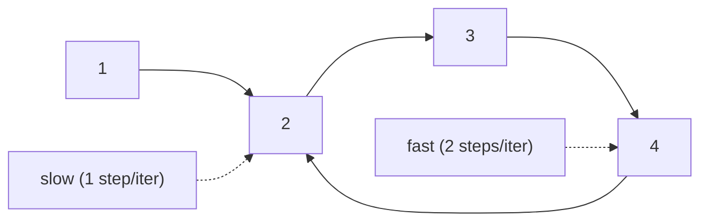

import DataCampExercise from "../../../../components/DataCampExercise.astro";

import Quiz from "../../../../components/Quiz.astro";

import LinkedListRewire from "../../../../components/viz/LinkedListRewire.tsx";


import ProblemLadder from "../../../../components/dsa/ProblemLadder.astro";

Some problems hand you a sequence with no fixed end -- a linked list that
might loop back on itself, or a number sequence defined by "apply this
function again." You can't just check `if visited` without extra memory.
**Fast and slow pointers** (Floyd's Tortoise and Hare) solve this with two
pointers moving through the *same* structure at different speeds -- no
extra memory, no hash set.

## What you'll learn

- Floyd's Tortoise and Hare: why a fast pointer laps a slow one inside a
  cycle, guaranteeing they meet.
- Cycle detection, and the follow-up trick that finds **where** the cycle
  starts.
- Finding the middle of a linked list in one pass.
- The Happy Number problem -- the exact same pattern, no linked list in
  sight.
- The cue: "does this ever repeat/loop" without room for a visited set.

## The cue

:::tip[You are looking at fast and slow pointers when…]
- The question is about a **cycle**: does one exist, where does it start, how long is it — LC 141,
  142, 202, 287.
- You need the **middle** of a list in one pass, without knowing its length — LC 876, and as the
  first step of [reorder](../copy-flatten-and-reorder/) and palindrome checking.
- You need the **`n`-th node from the end** in one pass — LC 19: open a gap of `n`, then advance
  both until the leader falls off.
- The constraint is **$O(1)$ space** on a problem where a `visited` set would be the obvious
  answer. That constraint is the entire hint.
- The structure is a **functional graph** — every state has exactly one successor. That covers
  linked lists, but also "repeatedly sum the squares of the digits" (LC 202) and
  "treat `nums[i]` as a pointer to index `nums[i]`" (LC 287).

**The reframe:** two cursors moving at different *rates* turn a question about global structure
(is there a loop? where is the midpoint?) into a local comparison you can make in one pass. The
gap between them encodes the information a second traversal would otherwise have to recover.

**Reach for something else** when nodes may have **more than one successor** — Floyd's needs a
functional graph, so a general graph wants [DFS cycle detection](../../phase-10-patterns-graphs/cycle-detection-and-bipartite-checking/)
with three colours — or when $O(n)$ space is acceptable and clarity matters more: a `visited` set
is two lines and impossible to get wrong.

## The pattern

One pointer (`slow`) moves one step at a time. The other (`fast`) moves
two steps at a time. If the sequence loops, `fast` will eventually lap
`slow` and they land on the same node -- if it doesn't loop, `fast` simply
runs off the end first.

```python title="fast_slow_template.py" showLineNumbers{1}
def has_cycle_template(get_next, start):
    """get_next(node) returns the next node/state in the sequence."""
    slow = fast = start
    while fast is not None and get_next(fast) is not None:
        slow = get_next(slow)                    # 1 step
        fast = get_next(get_next(fast))           # 2 steps
        if slow is fast:
            return True
    return False


# example: a simple linked-list-like chain expressed as a dict
graph = {1: 2, 2: 3, 3: 4, 4: 2}   # 4 points back to 2 -> cycle
print(has_cycle_template(lambda n: graph.get(n), 1))
```

## Visual intuition

Both phases of Floyd's algorithm. The second phase is the surprising one — watch
where the pointers meet after slow is reset to the head:

<LinkedListRewire
  client:visible
  algo="cycle-detection"
  values={[3, 2, 0, -4]}
  cycleAt={1}
  title="Tortoise and hare, then the reset that finds the entrance"
  lib="LC 141 / 142 · O(n) time, O(1) space"
  desc="Phase 1 proves a cycle exists. Phase 2 locates its entrance, and does so for a reason worth working through on paper: when the pointers first met, fast had travelled exactly twice as far as slow."
/>

## How it works

Think of it as two runners on the same circular track: the fast runner
gains one lap position on the slow runner every step. Once the slow
pointer is anywhere inside the cycle, the fast pointer is guaranteed to
close the gap and land exactly on it within one full lap -- it cannot
"jump over" the slow pointer because it only gains one position at a
time.



```p5 title="Tortoise and hare moving around a cyclic chain" desc="slow moves one node per tick, fast moves two -- inside the cycle, fast steadily closes the gap until both land on the same node." height="300"
let n = 6;           // total nodes in the ring
let cycleStart = 2;  // node index where the cycle begins
let slowPos = 0;
let fastPos = 0;
let lastTime = 0;
let stepDelay = 550;

function nextPos(p) {
  if (p + 1 >= n) return cycleStart;
  return p + 1;
}

function setup() {
  createCanvas(600, 300);
  textFont("monospace");
}

function draw() {
  background(13, 17, 23);

  if (millis() - lastTime > stepDelay) {
    lastTime = millis();
    slowPos = nextPos(slowPos);
    fastPos = nextPos(nextPos(fastPos));
    if (slowPos === fastPos) {
      slowPos = 0;
      fastPos = 0;
    }
  }

  const cx = width / 2, cy = height / 2 + 10, r = 100;
  const angleStep = TWO_PI / n;

  for (let i = 0; i < n; i++) {
    const a = -HALF_PI + i * angleStep;
    const x = cx + r * cos(a);
    const y = cy + r * sin(a);

    if (i === slowPos && i === fastPos) fill(120, 200, 140);
    else if (i === slowPos) fill(75, 139, 190);
    else if (i === fastPos) fill(255, 123, 114);
    else fill(60, 66, 76);

    noStroke();
    circle(x, y, 40);
    fill(255);
    textAlign(CENTER, CENTER);
    textSize(14);
    text(i, x, y);
  }

  fill(210);
  textAlign(CENTER, TOP);
  textSize(13);
  text("slow @ " + slowPos + "   fast @ " + fastPos, width / 2, 16);
}
```

## Worked example

**Linked List Cycle.** Exactly the template above, applied to a real
linked list.

```python title="linked_list_cycle.py" showLineNumbers{1}
class Node:
    def __init__(self, value, next=None):
        self.value = value
        self.next = next


def build_with_cycle(values, cycle_at=None):
    nodes = [Node(v) for v in values]
    for i in range(len(nodes) - 1):
        nodes[i].next = nodes[i + 1]
    if cycle_at is not None:
        nodes[-1].next = nodes[cycle_at]
    return nodes[0]


def has_cycle(head):
    slow = fast = head
    while fast is not None and fast.next is not None:
        slow = slow.next
        fast = fast.next.next
        if slow is fast:
            return True
    return False


clean = build_with_cycle([1, 2, 3, 4])
looped = build_with_cycle([1, 2, 3, 4], cycle_at=1)
print("clean:", has_cycle(clean))
print("looped:", has_cycle(looped))
```

**Happy Number.** No linked list at all -- the "next state" is
"sum of squares of digits." A number is happy if this sequence reaches 1;
unhappy numbers cycle forever instead, so cycle detection tells you which.

```python title="happy_number.py" showLineNumbers{1}
def next_value(n):
    total = 0
    while n > 0:
        digit = n % 10
        total += digit * digit
        n //= 10
    return total


def is_happy(n):
    slow = fast = n
    while True:
        slow = next_value(slow)
        fast = next_value(next_value(fast))
        if fast == 1:
            return True
        if slow == fast:            # cycle found, and it's not at 1
            return False


print(is_happy(19))   # expect True   (19 -> 82 -> 68 -> 100 -> 1)
print(is_happy(2))    # expect False  (loops without ever hitting 1)
```

:::tip[Finding the middle of a linked list]
Same two speeds, different question: when `fast` reaches the end, `slow`
is sitting exactly at the middle -- because `slow` has covered half the
distance `fast` has.

```python
def middle_node(head):
    slow = fast = head
    while fast is not None and fast.next is not None:
        slow = slow.next
        fast = fast.next.next
    return slow   # middle node (second middle if length is even)
```
:::

:::note[Finding *where* the cycle starts]
After `slow` and `fast` meet inside the cycle, reset one pointer to the
head and advance **both** one step at a time -- they meet again exactly at
the cycle's start. This works because of the distance math: the distance
from the head to the cycle start equals the distance from the meeting
point back around to the cycle start (Floyd's second phase).
:::

## Dry run

**LC 142 — `[3, 2, 0, -4]` with the tail linking back to index 1** (the node holding 2).

**Phase 1, find a meeting point.** Both start at the head:

| step | `slow` | `fast` | met? |
| --- | --- | --- | --- |
| 1 | 2 | 0 | no |
| 2 | 0 | 2 | no |
| 3 | **−4** | **−4** | **yes** |

**Phase 2, find the entrance.** Reset one pointer to the head and advance **both one step at a
time**:

| step | from head | from meeting point | same? |
| --- | --- | --- | --- |
| 1 | 2 | 2 | **yes** → the cycle starts at the node holding 2 |

- **The meeting point is not the cycle entrance.** They met at −4; the entrance is 2. Returning the
  meeting node is the standard LC 142 bug, and it passes LC 141 (which only asks *whether* a cycle
  exists), so it can survive being written and tested.
- **Why phase 2 works, in one line of algebra.** Let `a` be the distance from head to entrance and
  `b` the distance from entrance to the meeting point. When they meet, slow has walked `a + b` and
  fast `2(a + b)`, and fast's extra `a + b` must be a whole number of laps. So `a + b` is a
  multiple of the cycle length, which means walking `a` more steps *from the meeting point* lands
  exactly on the entrance — and walking `a` steps from the head does too. That is why both pointers
  move at the **same** speed in phase 2.
- **Fast cannot jump over slow.** It closes the gap by exactly one node per step, so once slow is
  inside the cycle the meeting is guaranteed within one lap. This is also why the 2× speed
  specifically matters: a 3× runner can leap past.
- **The loop guard is `while fast and fast.next`.** Both checks are needed: `fast.next.next` on a
  list of even length would otherwise dereference `None`.

**Finding the middle — `[1,2,3,4,5]`:** slow ends on 3 after fast runs out. On even length
`[1,2,3,4]`, `while fast and fast.next` leaves slow on **3** (the second middle) while
`while fast.next and fast.next.next` leaves it on **2** (the first). Which you want is
problem-specific — reorder and palindrome need the *first* middle so the split favours the left
half.

## Time and space complexity

| Operation | Time | Space |
| --- | --- | --- |
| Cycle detection (hash-set of visited nodes) | $O(n)$ | $O(n)$ |
| Cycle detection (fast/slow pointers) | $O(n)$ | $O(1)$ |
| Find middle / cycle start (fast/slow) | $O(n)$ | $O(1)$ |

The whole point of this pattern is trading the hash set's $O(n)$ memory
for $O(1)$ -- same time complexity, none of the extra space.

## When to use it

| Cue in the problem | Why fast/slow fits |
| --- | --- |
| "does this linked list have a cycle" | Direct application |
| "find the start of the cycle" | Meet, then reset + walk together |
| "find the middle of a linked list" | fast reaches end when slow is at middle |
| "does this number sequence eventually repeat/reach 1" | Happy Number-style, no list needed |
| "find the duplicate number without extra space" | Treat array values as a linked list via indices |

## The variant map

| Problem | Speeds / gap | What you read off |
| --- | --- | --- |
| **LC 141** Cycle detection | 1 and 2 | whether they ever meet |
| **LC 142** Cycle start | 1 and 2, then **1 and 1** from head and meeting point | the entrance node |
| **Cycle length** | after meeting, keep one still and walk the other | steps taken to return |
| **LC 876** Middle of the list | 1 and 2 | `slow` when `fast` runs out; the loop condition picks which middle |
| **LC 19** Remove `n`-th from end | same speed, **gap of `n`** | the node before the target, if the gap opens from a dummy |
| **LC 234** Palindrome list | 1 and 2 to the middle, then reverse and compare | equality in $O(1)$ space |
| **LC 143** Reorder list | 1 and 2 to split | see [Copy Flatten and Reorder](../copy-flatten-and-reorder/) |
| **LC 202** Happy Number | 1 and 2 over digit-square-sums | there is no list at all — the successor function is arithmetic |
| **LC 287** Find the Duplicate | 1 and 2 over `i → nums[i]` | the duplicate **is** the cycle entrance, so phase 2 is the answer |
| **LC 457** Circular Array Loop | 1 and 2 with direction and self-loop guards | a valid cycle of length > 1 |
| **Any functional graph** | 1 and 2 | Floyd's applies to *any* "each state has exactly one successor" |

## Interview follow-ups

| They ask | What they're checking | The answer |
| --- | --- | --- |
| "Why does the fast pointer always catch the slow one?" | Whether you can prove it | Once slow is inside the cycle, fast closes the gap by exactly one node per step, so it cannot jump over — the meeting happens within one lap. Speeds 1 and 2 are what guarantee that; a 3× runner can leap past |
| "You found where they meet. How do you find the cycle's *start*?" | The part people skip | Reset one pointer to the head and advance **both at one step**. Where they meet again is the entrance. It works because `a + b` is a whole number of laps, so `a` more steps from the meeting point lands on the entrance |
| "What is the complexity?" | Precision | $O(n)$ time, $O(1)$ space. The $O(n)$ space alternative is a `visited` set — mention it, because it is clearer and the interview is asking you to beat it |
| "How long is the cycle?" | Whether you can extend it | After they meet, hold one pointer still and walk the other until it returns. The number of steps is the cycle length |
| "There is no linked list — the input is an array" (LC 287) | Recognising the abstraction | Treat `i → nums[i]` as edges. Values in `1..n` with `n+1` slots means two indices point to the same place, so the functional graph has a cycle and **the duplicate is its entrance** — phase 2 returns the answer directly |
| "Now the graph has nodes with two successors" | The boundary | Floyd's requires a functional graph. With branching you need DFS with three colours or a `visited` set; there is no two-pointer equivalent |
| "Find the middle — which one on even length?" | Attention to the loop condition | `while fast and fast.next` gives the *second* middle; `while fast.next and fast.next.next` gives the *first*. Reorder and palindrome want the first, so the split favours the left half |
| "Remove the n-th node from the end in one pass" | The gap variant | Open a gap of `n` between two pointers starting from a **dummy**, then advance both. When the leader falls off, the trailer sits just before the target — which is the only position from which it can be unlinked |

## Practice -- real LeetCode problems

Each exercise is the actual LeetCode problem with its real method signature and
LeetCode's own examples as the test. Write the body, press **Run**, and match the
expected output.

### LC 141 -- Linked List Cycle · Easy

**Problem.** Return `True` if the linked list contains a cycle.

**Constraints.** `0 <= number of nodes <= 10^4`. Can you do it in $O(1)$ memory?

**Examples.** `[3,2,0,-4]` with the tail linked to index 1 gives `True` ·
`[1]` with no cycle gives `False`

<DataCampExercise
  lang="python"
  hint={`Floyd's cycle detection. Move slow one step and fast two steps. If there is a cycle, fast eventually laps slow and they land on the same node; if there is not, fast runs off the end. Compare with "is" (identity), not by value -- values may repeat. Guard both fast and fast.next before stepping twice.`}
  code={`class ListNode:
    def __init__(self, val=0, next=None):
        self.val, self.next = val, next


def build_list(vals):
    d = ListNode(); t = d
    for v in vals:
        t.next = ListNode(v); t = t.next
    return d.next


def to_list(h):
    out = []
    while h:
        out.append(h.val); h = h.next
    return out


def build_cycle(vals, pos):
    # pos == -1 means no cycle; otherwise the tail links back to index pos
    head = build_list(vals)
    if pos == -1 or not head:
        return head, None
    tail = head
    while tail.next:
        tail = tail.next
    target = head
    for _ in range(pos):
        target = target.next
    tail.next = target
    return head, target


class Solution:
    def hasCycle(self, head):
        # TODO: Floyd's tortoise and hare, O(1) memory.
        # Compare nodes by IDENTITY, and guard fast and fast.next.
        pass


sol = Solution()
out = []
for vals, pos in ([[3, 2, 0, -4], 1], [[1, 2], 0], [[1], -1], [[1, 2], -1]):
    head, _ = build_cycle(vals, pos)
    out.append(sol.hasCycle(head))
print(out)   # expect [True, True, False, False]`}
  solution={`class ListNode:
    def __init__(self, val=0, next=None):
        self.val, self.next = val, next


def build_list(vals):
    d = ListNode(); t = d
    for v in vals:
        t.next = ListNode(v); t = t.next
    return d.next


def to_list(h):
    out = []
    while h:
        out.append(h.val); h = h.next
    return out


def build_cycle(vals, pos):
    # pos == -1 means no cycle; otherwise the tail links back to index pos
    head = build_list(vals)
    if pos == -1 or not head:
        return head, None
    tail = head
    while tail.next:
        tail = tail.next
    target = head
    for _ in range(pos):
        target = target.next
    tail.next = target
    return head, target


class Solution:
    def hasCycle(self, head):
        slow = fast = head
        while fast and fast.next:          # guard BOTH before stepping twice
            slow, fast = slow.next, fast.next.next
            if slow is fast:               # identity, not value
                return True
        return False


sol = Solution()
out = []
for vals, pos in ([[3, 2, 0, -4], 1], [[1, 2], 0], [[1], -1], [[1, 2], -1]):
    head, _ = build_cycle(vals, pos)
    out.append(sol.hasCycle(head))
print(out)`}
  sct={`test_output_contains("[True, True, False, False]")
success_msg("Two speeds and O(1) memory -- no visited set required.")
`}
  height={330}
/>

<details>
<summary>Editorial</summary>

If a cycle exists, the fast pointer enters it first and then gains one position on the
slow pointer per step, so the gap shrinks by one each time and must reach zero -- they
collide. Without a cycle, fast reaches the end.

**Time** $O(n)$. **Space** $O(1)$ -- which is the whole point, since a `visited` set
solves it trivially at $O(n)$ space.

Two details:

- **`while fast and fast.next`.** Both are needed, because the step is
  `fast.next.next`. Checking only `fast` raises `AttributeError` on the last node.
- **`slow is fast`, not `slow.val == fast.val`.** Values may repeat, so value equality
  reports false cycles. The habit matters even though this problem's tests may not
  punish it.

**Follow-ups:** "Find where the cycle starts (LC 142)?" -- next problem. "Cycle
length?" -- once they meet, keep one still and walk the other until it returns.
"Why must they meet rather than skip past?" -- the gap decreases by exactly one per
step, so it cannot jump over zero. "Faster than 2x speed?" -- still works, but the
proof is less clean and there is no benefit.

</details>

### LC 142 -- Linked List Cycle II · Medium

**Problem.** Return the node where the cycle begins, or `None` if there is no
cycle. Do not modify the list.

**Constraints.** `0 <= number of nodes <= 10^4`. Can you do it in $O(1)$ memory?

**Examples.** `[3,2,0,-4]` with the tail linked to index 1 returns the node at
index 1 · `[1]` with no cycle returns `None`

:::note[What this test checks]
The problem returns a **node**, so the test checks the returned node **is** the actual
cycle-entry node object -- not merely one with a matching value.
:::

<DataCampExercise
  lang="python"
  hint={`Two phases. First run Floyd's detection until slow and fast meet. Then reset ONE pointer to the head and advance both one step at a time -- they meet exactly at the cycle entrance. The reason is arithmetic: the distance from the head to the entrance equals the distance from the meeting point to the entrance, modulo the cycle length.`}
  code={`class ListNode:
    def __init__(self, val=0, next=None):
        self.val, self.next = val, next


def build_list(vals):
    d = ListNode(); t = d
    for v in vals:
        t.next = ListNode(v); t = t.next
    return d.next


def to_list(h):
    out = []
    while h:
        out.append(h.val); h = h.next
    return out


def build_cycle(vals, pos):
    # pos == -1 means no cycle; otherwise the tail links back to index pos
    head = build_list(vals)
    if pos == -1 or not head:
        return head, None
    tail = head
    while tail.next:
        tail = tail.next
    target = head
    for _ in range(pos):
        target = target.next
    tail.next = target
    return head, target


class Solution:
    def detectCycle(self, head):
        # TODO: phase 1 -- detect the meeting point with two speeds.
        # phase 2 -- reset one pointer to the head, then advance BOTH by one;
        # they meet at the cycle entrance. Return None if there is no cycle.
        pass


sol = Solution()
out = []
for vals, pos in ([[3, 2, 0, -4], 1], [[1, 2], 0], [[1], -1]):
    head, target = build_cycle(vals, pos)
    found = sol.detectCycle(head)
    out.append(found is target)      # identity, not value
print(out)   # expect [True, True, True]`}
  solution={`class ListNode:
    def __init__(self, val=0, next=None):
        self.val, self.next = val, next


def build_list(vals):
    d = ListNode(); t = d
    for v in vals:
        t.next = ListNode(v); t = t.next
    return d.next


def to_list(h):
    out = []
    while h:
        out.append(h.val); h = h.next
    return out


def build_cycle(vals, pos):
    # pos == -1 means no cycle; otherwise the tail links back to index pos
    head = build_list(vals)
    if pos == -1 or not head:
        return head, None
    tail = head
    while tail.next:
        tail = tail.next
    target = head
    for _ in range(pos):
        target = target.next
    tail.next = target
    return head, target


class Solution:
    def detectCycle(self, head):
        slow = fast = head
        while fast and fast.next:
            slow, fast = slow.next, fast.next.next
            if slow is fast:                  # phase 1: they meet
                slow = head                   # phase 2: reset one to the head
                while slow is not fast:
                    slow, fast = slow.next, fast.next   # both by ONE now
                return slow                   # the cycle entrance
        return None


sol = Solution()
out = []
for vals, pos in ([[3, 2, 0, -4], 1], [[1, 2], 0], [[1], -1]):
    head, target = build_cycle(vals, pos)
    found = sol.detectCycle(head)
    out.append(found is target)
print(out)`}
  sct={`test_output_contains("[True, True, True]")
success_msg("Reset one pointer to the head and step both by one -- the arithmetic does the rest.")
`}
  height={340}
/>

<details>
<summary>Editorial</summary>

Phase 1 finds a meeting point; phase 2 converts it into the cycle entrance.

**Time** $O(n)$. **Space** $O(1)$.

**Why phase 2 works.** Let `L` be the distance from the head to the cycle entrance,
`C` the cycle length, and `m` the distance from the entrance to the meeting point.
When they meet, slow has travelled `L + m` and fast `2(L + m)`, and their difference
must be a whole number of laps: `L + m = nC`. So `L = nC - m` -- meaning walking `L`
steps from the head, and `L` steps forward from the meeting point, both land on the
entrance. Hence stepping both pointers one at a time from those two positions makes
them meet exactly there.

Being able to give that argument is the point of the problem; the code is six lines.

The test compares with `is` because the problem specifies returning the **node**. A
solution that finds the right position but constructs a new node would fail, correctly.

**Follow-ups:** "Prove phase 2" -- the arithmetic above; the expected question.
"Cycle length?" -- walk from the meeting point back to itself. "With a `visited`
set?" -- $O(n)$ space, trivial, and the reason the $O(1)$ version is asked for.
"Where else does this apply?" -- LC 287 below, and
[Happy Number](../fast-and-slow-pointers/) (LC 202), where the "list" is a function.

</details>

### LC 287 -- Find the Duplicate Number · Medium

**Problem.** An array of `n + 1` integers, each in `[1, n]`, contains exactly one
repeated number. Return it **without modifying the array** and using only $O(1)$
extra space.

**Constraints.** `1 <= n <= 10^5`, values in `[1, n]`, exactly one value repeats
(possibly many times).

**Examples.** `[1,3,4,2,2]` gives `2` · `[3,1,3,4,2]` gives `3` ·
`[3,3,3,3,3]` gives `3`

<DataCampExercise
  lang="python"
  hint={`Treat the array as a linked list where index i points to index nums[i]. Because values lie in 1..n and there are n+1 slots, this functional graph must contain a cycle, and the duplicate value IS the cycle entrance. So run Floyd's algorithm on nums: slow = nums[slow], fast = nums[nums[fast]], then the same phase-2 reset from nums[0].`}
  code={`class Solution:
    def findDuplicate(self, nums):
        # TODO: treat i -> nums[i] as a linked list and run Floyd's.
        # The duplicate is the CYCLE ENTRANCE.
        # Do not sort, do not modify nums, O(1) extra space.
        pass


sol = Solution()
cases = [[1, 3, 4, 2, 2], [3, 1, 3, 4, 2], [3, 3, 3, 3, 3], [1, 1]]
print([sol.findDuplicate(list(c)) for c in cases])
# expect [2, 3, 3, 1]`}
  solution={`class Solution:
    def findDuplicate(self, nums):
        slow = fast = nums[0]
        while True:                       # phase 1: find the meeting point
            slow = nums[slow]
            fast = nums[nums[fast]]
            if slow == fast:
                break
        slow = nums[0]                    # phase 2: find the entrance
        while slow != fast:
            slow = nums[slow]
            fast = nums[fast]
        return slow                       # the duplicated value


sol = Solution()
cases = [[1, 3, 4, 2, 2], [3, 1, 3, 4, 2], [3, 3, 3, 3, 3], [1, 1]]
print([sol.findDuplicate(list(c)) for c in cases])`}
  sct={`test_output_contains("[2, 3, 3, 1]")
success_msg("Seeing i -> nums[i] as a linked list is the whole insight -- then it is LC 142 verbatim.")
`}
  height={300}
/>

<details>
<summary>Editorial</summary>

The reframing is everything: read the array as a function `i -> nums[i]`, giving a
linked structure. Since every value is in `[1, n]` but there are `n + 1` indices, two
indices must point at the same place -- so the structure has a **cycle**, and the
duplicated value is precisely the node where two arrows converge, i.e. the cycle
entrance.

Then it is [LC 142](#lc-142----linked-list-cycle-ii--medium) applied to indices
instead of nodes.

**Time** $O(n)$. **Space** $O(1)$, and the array is untouched -- which is exactly what
the constraints demand.

Why the obvious solutions are excluded: a `set` is $O(n)$ space; sorting modifies the
array (and is $O(n \log n)$); the
[cyclic-sort marking trick](../../phase-05-patterns-arrays-and-strings/cyclic-sort/)
also modifies it. Those constraints exist to force this insight.

Starting at `nums[0]` rather than index `0` matters: because values are at least `1`,
index `0` is never a target, so it cannot be inside the cycle -- which makes it a valid
"head" outside the loop.

`[3,3,3,3,3]` giving `3` is the many-repeats case, and `[1,1]` is the minimum size.

**Follow-ups:** "Prove there must be a cycle" -- pigeonhole on `n + 1` indices into `n`
values. "Binary search on the value range?" -- also $O(1)$ space: count how many
values are `<= mid` and compare against `mid`; $O(n \log n)$ but easier to explain.
"If modification were allowed?" -- mark visited slots by negation, $O(n)$. "Multiple
duplicates?" -- Floyd's finds one; you would need a different approach for all.

</details>

## LeetCode problem set

Generated from the problem database, so each entry carries its sheet
membership and reported companies. Tick them off as you go — progress is
saved in this browser, and the Export button writes it to a file you can keep.

<ProblemLadder pattern="fast-and-slow-pointers"
  notes={{"141":"The base template: if the pointers ever meet, there is a cycle","142":"Once they meet, reset one pointer to the head and advance both by one -- they meet at the entrance","202":"The 'linked list' is the digit-square function -- same cycle detection, no nodes involved","287":"Treat `i -> nums[i]` as a linked list; the duplicate value is the cycle entrance","876":"Slow lands on the middle exactly when fast runs off the end"}} />

## Pitfalls

- **Returning the meeting node as the cycle start.** They meet somewhere inside the loop, not at
  its entrance. Phase 2 — reset to head, walk both at speed 1 — is what finds the entrance, and
  omitting it still passes LC 141.
- **Advancing at 2× in phase 2.** Both pointers move **one** step there. Keeping fast at 2× gives a
  node that is usually wrong and occasionally right, which is the worst kind of bug.
- **`while fast and fast.next` versus `while fast`.** Checking only `fast` dereferences `None` on
  `fast.next.next` for even-length lists.
- **Comparing values instead of identity.** `slow.val == fast.val` is true for any duplicate value;
  cycle detection needs `slow is fast`.
- **Starting the pointers apart.** Both must begin at the head for the `a + b` algebra to hold.
  Seeding `fast = head.next` is a common "optimisation" that breaks phase 2.
- **The wrong middle.** On even-length input the two loop conditions give different nodes; pick
  deliberately, because reorder and palindrome need the *first* middle.
- **Assuming it works on a branching graph.** Floyd's needs exactly one successor per node.
- **Forgetting the dummy in LC 19.** Opening the gap from the head instead means removing the head
  itself needs a special case.

## Self-check

<Quiz
  title="Fast and slow pointers — self-check"
  questions={[
    {
      q: "Why is the fast pointer guaranteed to catch the slow one inside a cycle?",
      options: [
        "Because it starts ahead",
        "Because it closes the gap by exactly one node per step, so it cannot jump over — the meeting happens within one lap",
        "Because the cycle length is even",
        "It is not guaranteed; it is probabilistic",
      ],
      answer: 1,
      explain:
        "The 2× speed is what makes the gap shrink by exactly 1. A 3× runner shrinks it by 2 and can leap past the slow pointer entirely.",
    },
    {
      q: "You have the meeting node. How do you find where the cycle STARTS?",
      options: [
        "The meeting node is the start",
        "Reset one pointer to the head and advance both at ONE step each — where they meet again is the entrance",
        "Walk backwards from the meeting node",
        "Count the cycle length and subtract",
      ],
      answer: 1,
      explain:
        "In the dry run they meet at −4 but the cycle starts at 2. Returning the meeting node still passes LC 141, which only asks whether a cycle exists — so the bug can survive testing.",
    },
    {
      q: "Why does phase 2 work?",
      options: [
        "Coincidence that holds for small lists",
        "Because when they meet, slow has walked a + b and fast 2(a + b), so fast's extra a + b is a whole number of laps — meaning a more steps from the meeting point lands on the entrance, exactly as a steps from the head does",
        "Because the cycle length divides a",
        "Because the meeting point is always halfway",
      ],
      answer: 1,
      explain:
        "That one line of algebra is also why both pointers must move at the SAME speed in phase 2 — keeping fast at 2× breaks the equality.",
    },
    {
      q: "LC 287 asks for a duplicate in an array of n+1 values from 1..n, in O(1) space. How is that this pattern?",
      options: [
        "Sort the array first",
        "Treat i → nums[i] as edges: two indices pointing at the same value means the functional graph has a cycle, and the duplicate IS the cycle's entrance — so phase 2 returns it directly",
        "Use the sum formula",
        "Binary search on the value range",
      ],
      answer: 1,
      explain:
        "Recognising a functional graph where no list exists is what this pattern really teaches. LC 202 (Happy Number) is the same move with an arithmetic successor function.",
    },
    {
      q: "On an even-length list, which node does `while fast and fast.next` leave `slow` on?",
      options: [
        "The first middle",
        "The second middle — use `while fast.next and fast.next.next` if you need the first, as reorder and palindrome do",
        "The last node",
        "It depends on the values",
      ],
      answer: 1,
      explain:
        "On [1,2,3,4] the two conditions give 3 and 2 respectively. Choosing by accident is how the split ends up favouring the wrong half.",
    },
    {
      q: "The nodes can now have two successors each. Does Floyd's still apply?",
      options: [
        "Yes, follow the first successor",
        "No — Floyd's requires a functional graph (exactly one successor per node). With branching you need DFS with three colours, or a visited set",
        "Yes, with three pointers",
        "Yes, but only for acyclic graphs",
      ],
      answer: 1,
      explain:
        "Knowing the precondition is what stops you reaching for a two-pointer trick on a general graph, where there is no equivalent.",
    },
  ]}
/>

## Recall card

- **Cue** — cycles, middles, or `n`-th-from-end in **one pass** with **$O(1)$ space**; or any
  functional graph (each state has exactly one successor).
- **Detect** — `slow = slow.next`, `fast = fast.next.next`, guard `while fast and fast.next`,
  compare with **`is`** not `==`.
- **Entrance (LC 142)** — after they meet, reset one to the head and advance **both by one**. They
  meet at the entrance because `a + b` is a whole number of laps.
- **Cycle length** — hold one still after meeting, walk the other back round.
- **Middle** — `slow` when `fast` runs out; the loop condition decides first-versus-second middle on
  even lengths.
- **`n`-th from end** — same speed, **gap of `n`**, opened from a dummy.
- **No list required** — LC 202 (digit squares) and LC 287 (`i → nums[i]`) are the same pattern with
  a different successor function.
- **Cost** — $O(n)$ time, $O(1)$ space. The $O(n)$-space `visited` set is the baseline you are being
  asked to beat.
- **Precondition** — exactly one successor per node. Branching graphs need DFS instead.

## Recap

- Fast and slow pointers detect cycles in $O(n)$ time and $O(1)$ space --
  no hash set of visited nodes required.
- The same two-speed idea finds a linked list's **middle** (fast finishes
  when slow is halfway) and, with a second phase, the **cycle's start**.
- The pattern isn't limited to linked lists -- any "repeatedly apply a
  function" sequence (Happy Number, Find the Duplicate Number) fits too.
- Cue: "does this ever loop/repeat" with no room for extra memory.

Next: **Merge Intervals** -- sorting overlapping ranges by start time and
collapsing them into a minimal set.
