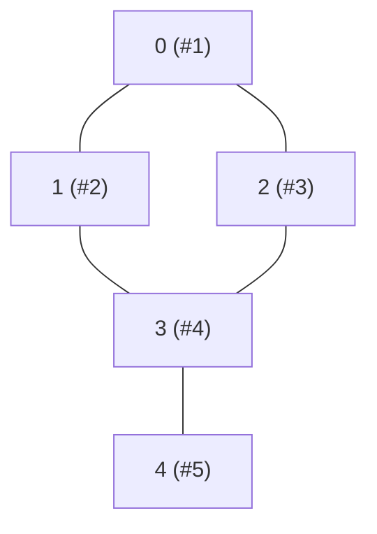

**Interviewer cue:** "shortest path", "fewest steps", "minimum number of
moves", or "level by level" almost always means BFS. Breadth-first search
explores everything at distance 1 from the start, then everything at
distance 2, and so on -- so the **first** time it reaches a target, that's
guaranteed to be the shortest route (as long as every edge has equal
weight).

## What you'll learn

- The BFS template: a **queue** plus a **visited set**, and why both matter.
- Level-order traversal on trees, and traversal on graphs given as an
  adjacency dict.
- Using BFS to find the **shortest path length** in an unweighted graph.
- **Multi-source BFS**: starting the queue with several nodes at once (the
  trick behind Rotting Oranges).

## The cue

:::tip[You are looking at BFS when…]
- The question asks for the **shortest path, fewest steps, minimum moves, or the
  smallest number of transformations** — and every move costs the **same**.
- The question asks **"how far"** or **"how many levels"** rather than "is there a
  path". For mere reachability, DFS is equally correct and often shorter to write.
- The input is a grid, a word list with one-letter edits, a board state with legal
  moves, or a tree where you need per-level output. All of these are unweighted graphs
  in disguise.

**The reframe:** BFS does not search for a target so much as it *computes distance from
a source outward*. Every node is reached first by a shortest route, so the first time
you see the target, you are done — and that "first time" property is the whole reason
the queue must be FIFO.

**Reach for something else** when edges have different costs (Dijkstra, or a
[deque if the costs are 0/1](../0-1-bfs-and-deque-shortest-paths/)), when you need
*all* paths rather than a shortest one (DFS with backtracking), when the state space is
huge and you have a heuristic (A\*), or when you only need to know whether a path
exists at all (DFS, less memory).
:::

## The pattern

```python title="bfs_template.py" showLineNumbers{1}
from collections import deque


def bfs(graph, start):
    visited = {start}                 # mark visited the moment a node is ENQUEUED
    queue = deque([start])
    order = []

    while queue:
        node = queue.popleft()        # FIFO: process in the order nodes were discovered
        order.append(node)
        for neighbor in graph[node]:
            if neighbor not in visited:
                visited.add(neighbor)
                queue.append(neighbor)

    return order


graph = {
    0: [1, 2],
    1: [0, 3],
    2: [0, 3],
    3: [1, 2, 4],
    4: [3],
}

print("BFS order from 0:", bfs(graph, 0))
```

:::caution[Mark visited on enqueue, not on dequeue]
If you only mark a node visited when you pop it from the queue, the same
node can be pushed onto the queue multiple times by different neighbors
before it's ever processed -- wasting work and, in some variants, breaking
correctness. Always add to `visited` the moment you enqueue.
:::

## How it works: expanding one layer at a time



Node `0` is layer 0. Nodes `1` and `2` -- both one edge away -- form layer 1
and get visited next, *before* BFS ever looks at node `4` (two edges away).
That's the whole guarantee: BFS finishes an entire layer before starting the
next one.

```p5 title="BFS frontier expanding outward, ring by ring" desc="Each tick reveals the next 'ring' of cells at one greater distance -- exactly how BFS explores a graph one full layer before going any farther." height="340"
let cols = 11;
let rows = 7;
let cellSize = 40;
let startR = 3, startC = 5;
let ring = 0;
let maxRing = 0;
let lastTime = 0;
let stepDelay = 550;

function setup() {
  createCanvas(cols * cellSize, rows * cellSize + 30);
  maxRing = rows + cols;
}

function draw() {
  background(13, 17, 23);

  if (millis() - lastTime > stepDelay) {
    lastTime = millis();
    ring = (ring + 1) % (maxRing + 2);
  }

  for (let r = 0; r < rows; r++) {
    for (let c = 0; c < cols; c++) {
      const dist = abs(r - startR) + abs(c - startC);   // BFS distance on a grid
      const x = c * cellSize, y = r * cellSize + 30;

      if (dist < ring) fill(75, 139, 190);        // already visited
      else if (dist === ring) fill(255, 211, 67);  // frontier this tick
      else fill(30, 36, 46);                        // not reached yet

      stroke(13, 17, 23);
      strokeWeight(2);
      rect(x, y, cellSize - 2, cellSize - 2, 4);
    }
  }

  fill(200);
  noStroke();
  textAlign(CENTER, TOP);
  textSize(13);
  text("frontier distance = " + min(ring, maxRing), width / 2, 6);
}
```

## Worked example: shortest path in an unweighted graph

Carry a `distance` alongside each queued node. The first time you reach the
target, its distance is the shortest possible.

```python title="bfs_shortest_path.py" showLineNumbers{1}
from collections import deque


def shortest_path_length(graph, start, target):
    if start == target:
        return 0
    visited = {start}
    queue = deque([(start, 0)])       # (node, distance from start)

    while queue:
        node, dist = queue.popleft()
        for neighbor in graph[node]:
            if neighbor == target:
                return dist + 1        # first arrival at target = shortest path
            if neighbor not in visited:
                visited.add(neighbor)
                queue.append((neighbor, dist + 1))

    return -1   # target unreachable


graph = {
    0: [1, 2],
    1: [0, 3],
    2: [0, 3],
    3: [1, 2, 4],
    4: [3],
}

print("shortest 0 -> 4:", shortest_path_length(graph, 0, 4))
print("shortest 0 -> 0:", shortest_path_length(graph, 0, 0))
```

## Worked example: multi-source BFS on a grid

Rotting Oranges seeds the queue with **every** already-rotten cell at once,
then spreads outward -- the same BFS loop, just with more than one starting
node.

```python title="bfs_grid_multi_source.py" showLineNumbers{1}
from collections import deque


def minutes_to_rot_all(grid):
    rows, cols = len(grid), len(grid[0])
    queue = deque()
    fresh = 0

    for r in range(rows):
        for c in range(cols):
            if grid[r][c] == 2:
                queue.append((r, c, 0))     # every already-rotten orange starts the frontier
            elif grid[r][c] == 1:
                fresh += 1

    minutes = 0
    while queue:
        r, c, minute = queue.popleft()
        minutes = max(minutes, minute)
        for dr, dc in [(-1, 0), (1, 0), (0, -1), (0, 1)]:
            nr, nc = r + dr, c + dc
            if 0 <= nr < rows and 0 <= nc < cols and grid[nr][nc] == 1:
                grid[nr][nc] = 2            # rot it -- this doubles as the visited marker
                fresh -= 1
                queue.append((nr, nc, minute + 1))

    return minutes if fresh == 0 else -1


grid = [
    [2, 1, 1],
    [1, 1, 0],
    [0, 1, 1],
]
print("minutes until every fresh orange rots:", minutes_to_rot_all(grid))
```

:::tip[Level-order on a tree is the same template]
Level-order traversal (covered in **Binary Trees and BST**) is BFS with no
`visited` set needed -- a tree has no cycles, so you can never revisit a
node. The `deque` + "process one level's worth before moving on" shape is
identical.
:::

## Dry run

The template's own graph, `start = 0`:

```
0 —— 1 —— 3 —— 4
|         |
2 ————————+
```

| step | pop | `order` | neighbours examined | enqueued | `queue` after | `visited` |
| --- | --- | --- | --- | --- | --- | --- |
| 0 | — | — | seed | 0 | `[0]` | `{0}` |
| 1 | 0 | `0` | 1, 2 | **1, 2** | `[1, 2]` | `{0,1,2}` |
| 2 | 1 | `0 1` | 0 ✗ visited, 3 | **3** | `[2, 3]` | `{0,1,2,3}` |
| 3 | 2 | `0 1 2` | 0 ✗, 3 ✗ **already visited** | none | `[3]` | unchanged |
| 4 | 3 | `0 1 2 3` | 1 ✗, 2 ✗, 4 | **4** | `[4]` | `{0,1,2,3,4}` |
| 5 | 4 | `0 1 2 3 4` | 3 ✗ | none | `[]` | unchanged |

Three things the table shows that the six-line template hides:

- **Step 3 is the whole reason to mark on enqueue.** Node 3 is a neighbour of both 1
  and 2. It was marked when node 1 discovered it in step 2, so node 2's attempt is
  rejected. Mark on *dequeue* instead and 3 gets pushed twice, appearing twice in
  `order`, and on a dense graph the queue inflates toward $O(E)$ entries.
- **The queue holds at most one layer plus part of the next** — `[1, 2]` is layer 1
  entire. That is the real space bound: $O(w)$ for the widest layer, which on a grid is
  $O(\min(r,c))$ and on a complete binary tree is $O(n/2)$. DFS's mirror-image bound is
  $O(h)$.
- **Node 4 is reached at step 4, not before.** Both layer-1 nodes are fully processed
  first. That ordering *is* the shortest-path guarantee: nothing at distance 2 can be
  dequeued while something at distance 1 is still waiting, because FIFO cannot reorder
  them.

If you needed distances rather than an order, the only change is replacing `visited`
with `dist = {start: 0}` and setting `dist[neighbor] = dist[node] + 1` at the moment of
enqueue — the set and the distance map are the same mechanism, and the distance map is
strictly more useful.

## Complexity

BFS visits every node and edge at most once: $O(V + E)$ time, and $O(V)$
space for the `visited` set plus whatever is sitting in the queue at once
(at most one full layer).

## When to use it

- **Shortest path / fewest steps** in an unweighted graph (or a grid where
  every move costs the same).
- **Level-by-level** processing (tree level sums, "print each level").
- **Multi-source spreading** -- infection, fire, rot, or "distance from the
  nearest X" problems where several starting points exist simultaneously.

If edges have different weights, BFS's "first arrival = shortest" guarantee
breaks -- that's Dijkstra's territory instead.

## The variant map

| Variant | What changes in the template | Canonical problem |
| --- | --- | --- |
| **Reachability only** | nothing — but DFS is shorter and uses $O(h)$ space | LC 200 |
| **Shortest distance** | `visited` becomes `dist = {start: 0}`; set `dist[nxt] = dist[node] + 1` on enqueue | LC 1091 |
| **Level-by-level output** | wrap the pop in `for _ in range(len(queue))` — snapshot the level size *before* the loop | LC 102, LC 103 |
| **Many starting points** | push every source before the loop; distances stay correct | [Multi-source BFS](../multi-source-bfs/) · LC 994, 542 |
| **State is more than a position** | the visited key becomes a tuple, e.g. `(cell, keys_held)` | [BFS with extra state](../bfs-and-dijkstra-with-extra-state/) · LC 864, 1293 |
| **Weights of 0 and 1** | queue becomes a `deque`; 0-edges `appendleft`, 1-edges `append` | [0-1 BFS](../0-1-bfs-and-deque-shortest-paths/) · LC 1368 |
| **Arbitrary weights** | queue becomes a heap — this is no longer BFS | [Dijkstra](../shortest-paths-dijkstra-bellman-ford-and-floyd-warshall/) |
| **Reconstruct the path** | store `parent[nxt] = node` on enqueue, then walk back from the target | LC 126, LC 127 |
| **Both endpoints known** | bidirectional BFS: alternate two frontiers, stop when they touch — roughly $O(b^{d/2})$ | LC 127 follow-up |
| **Implicit graph** | there is no adjacency list; generate neighbours on demand from the state | LC 752, LC 773 |

## Interview follow-ups

| They ask | What they're checking | The answer |
| --- | --- | --- |
| "Why does BFS find the *shortest* path?" | Whether you can prove it | Because FIFO order means every node at distance $d$ is dequeued before any node at distance $d+1$, so the first time a node is reached, it is reached by a shortest route. Break the FIFO property and the guarantee goes with it |
| "Why mark visited on enqueue rather than on dequeue?" | The one habit that matters | Otherwise a node discovered by several neighbours is pushed several times before being processed — duplicated output and a queue that grows toward $O(E)$. Step 3 of the dry run is exactly that case |
| "What is the space complexity, precisely?" | Precision | $O(V)$ for `visited`, plus the queue, which holds at most one layer — so $O(w)$ where $w$ is the widest layer. On a grid that is $O(\min(r,c))$; DFS's mirror bound is $O(h)$ |
| "Now the edges have weights" | Boundaries | The first-arrival guarantee fails. Weights of 0 and 1 → deque; arbitrary non-negative → Dijkstra's heap; negative → Bellman-Ford |
| "Return the path, not just its length" | Bookkeeping | Store a `parent` pointer at enqueue time and walk back from the target. Recording parents anywhere else (on dequeue, or on a rejected neighbour) gives a path that is not the shortest |
| "The graph is huge and you know both endpoints" | Breadth | Bidirectional BFS — expand the smaller frontier alternately and stop when the frontiers intersect. Roughly $O(b^{d/2})$ instead of $O(b^d)$ |
| "There is no adjacency list" | Modelling | Generate neighbours from the state itself — one-letter edits (LC 127), one wheel turn (LC 752), one legal swap (LC 773). BFS never needs the graph materialised |
| "Recursive BFS?" | Whether you know why not | Recursion is naturally depth-first; a "recursive BFS" just carries the queue as a parameter, so it is the same algorithm with extra stack frames. There is no benefit |

## Practice -- real LeetCode problems

Each exercise is the actual LeetCode problem with its real method signature and
LeetCode's own examples as the test. Write the body, press **Run**, and match the
expected output.

### LC 1091 -- Shortest Path in Binary Matrix · Medium

**Problem.** In an `n x n` binary matrix, return the length of the shortest **clear**
path from the top-left to the bottom-right, moving in **8 directions** through `0`
cells only. Return `-1` if no such path exists. Path length counts cells visited.

**Constraints.** `1 <= n <= 100`, cells are `0` or `1`.

**Examples.** `[[0,1],[1,0]]` gives `2` · `[[0,0,0],[1,1,0],[1,1,0]]` gives `4` ·
`[[1,0,0],[1,1,0],[1,1,0]]` gives `-1`

<DataCampExercise
  lang="python"
  hint={`BFS from (0,0) carrying the distance, with EIGHT neighbour offsets rather than four. Check both the start and the end cell for being blocked before you begin. Mark a cell visited when you ENQUEUE it, not when you dequeue it, or the same cell gets queued many times.`}
  code={`from collections import deque


class Solution:
    def shortestPathBinaryMatrix(self, grid):
        # TODO: BFS with EIGHT directions. Return the number of cells visited.
        # Guard a blocked start or end. Mark visited on ENQUEUE.
        pass


sol = Solution()
cases = [[[0, 1], [1, 0]], [[0, 0, 0], [1, 1, 0], [1, 1, 0]],
         [[1, 0, 0], [1, 1, 0], [1, 1, 0]]]
print([sol.shortestPathBinaryMatrix([r[:] for r in g]) for g in cases])
# expect [2, 4, -1]`}
  solution={`from collections import deque


class Solution:
    def shortestPathBinaryMatrix(self, grid):
        n = len(grid)
        if grid[0][0] or grid[n - 1][n - 1]:
            return -1                          # start or end is blocked
        queue = deque([(0, 0, 1)])             # path length counts cells
        grid[0][0] = 1                         # mark visited on ENQUEUE
        while queue:
            r, c, d = queue.popleft()
            if r == n - 1 and c == n - 1:
                return d
            for dr in (-1, 0, 1):
                for dc in (-1, 0, 1):          # 8 directions (dr=dc=0 is a no-op)
                    nr, nc = r + dr, c + dc
                    if 0 <= nr < n and 0 <= nc < n and grid[nr][nc] == 0:
                        grid[nr][nc] = 1
                        queue.append((nr, nc, d + 1))
        return -1


sol = Solution()
cases = [[[0, 1], [1, 0]], [[0, 0, 0], [1, 1, 0], [1, 1, 0]],
         [[1, 0, 0], [1, 1, 0], [1, 1, 0]]]
print([sol.shortestPathBinaryMatrix([r[:] for r in g]) for g in cases])`}
  sct={`test_output_contains("[2, 4, -1]")
success_msg("BFS gives shortest paths on unweighted graphs -- and marking on enqueue keeps it O(n^2).")
`}
  height={330}
/>

<details>
<summary>Editorial</summary>

BFS explores in non-decreasing distance order, so the first time it reaches the target
it has found a shortest path. That is the property DFS lacks, and it is why shortest
path on an **unweighted** graph is always BFS.

**Time** $O(n^2)$ -- each cell is enqueued at most once. **Space** $O(n^2)$.

Three details:

- **Eight directions.** The nested `dr`/`dc` loops over `(-1, 0, 1)` produce nine
  offsets including `(0, 0)`, which is harmless because the current cell is already
  marked visited.
- **Blocked endpoints.** `[[1,0,0],...]` has a blocked start, so it must return `-1`
  before any search happens.
- **Mark on enqueue.** Marking at dequeue time lets several neighbours enqueue the
  same cell first, inflating the queue and risking a stale longer distance.

The path length counts **cells**, not steps, which is why the initial distance is `1`
rather than `0`. `[[0,1],[1,0]]` returning `2` is the check for that.

**Follow-ups:** "Why not DFS?" -- it does not visit in distance order. "Weighted
cells?" -- Dijkstra; see [Shortest Paths](../shortest-paths-dijkstra-bellman-ford-and-floyd-warshall/).
"A* instead?" -- with a distance heuristic it explores less, and is the practical
choice on large grids. "Return the path?" -- store a parent per cell and walk back.

</details>

### LC 752 -- Open the Lock · Medium

**Problem.** A lock has four wheels showing `'0'` to `'9'`, starting at `"0000"`.
Each move turns one wheel one slot. Some states are **deadends** and may not be
visited. Return the minimum moves to reach `target`, or `-1`.

**Constraints.** `1 <= len(deadends) <= 500`, `target` is four digits and not
`"0000"` unless stated.

**Examples.** `deadends = ["0201","0101","0102","1212","2002"], target = "0202"`
gives `6` · `deadends = ["8888"], target = "0009"` gives `1` · a fully-surrounded
start gives `-1`

<DataCampExercise
  lang="python"
  hint={`The graph is implicit: each state has EIGHT neighbours -- four wheels, each turnable up or down with wraparound via modulo 10. BFS from "0000", skipping deadends and already-seen states. Check the start against the deadends first, and handle target == "0000" as zero moves.`}
  code={`from collections import deque


class Solution:
    def openLock(self, deadends, target):
        # TODO: BFS over an IMPLICIT graph of lock states.
        # Each state has 8 neighbours (4 wheels x up/down, mod 10).
        # Guard: "0000" in deadends, and target == "0000".
        pass


sol = Solution()
cases = [(["0201", "0101", "0102", "1212", "2002"], "0202"),
         (["8888"], "0009"),
         (["8887", "8889", "8878", "8898", "8788", "8988", "7888", "9888"], "8888"),
         ([], "0000")]
print([sol.openLock(list(d), t) for d, t in cases])
# expect [6, 1, -1, 0]`}
  solution={`from collections import deque


class Solution:
    def openLock(self, deadends, target):
        dead = set(deadends)
        if "0000" in dead:
            return -1                          # cannot even start
        if target == "0000":
            return 0
        queue = deque([("0000", 0)])
        seen = {"0000"}
        while queue:
            state, steps = queue.popleft()
            for i in range(4):                 # each of the four wheels
                d = int(state[i])
                for nd in ((d + 1) % 10, (d - 1) % 10):    # wraparound
                    nxt = state[:i] + str(nd) + state[i + 1:]
                    if nxt in dead or nxt in seen:
                        continue
                    if nxt == target:
                        return steps + 1
                    seen.add(nxt)
                    queue.append((nxt, steps + 1))
        return -1


sol = Solution()
cases = [(["0201", "0101", "0102", "1212", "2002"], "0202"),
         (["8888"], "0009"),
         (["8887", "8889", "8878", "8898", "8788", "8988", "7888", "9888"], "8888"),
         ([], "0000")]
print([sol.openLock(list(d), t) for d, t in cases])`}
  sct={`test_output_contains("[6, 1, -1, 0]")
success_msg("The graph is never built -- neighbours are generated on demand, which is what 'implicit graph' means.")
`}
  height={370}
/>

<details>
<summary>Editorial</summary>

There is no adjacency list here. The graph is **implicit**: a state is a string, and its
neighbours are generated by a rule. Recognising that a puzzle's state space *is* a graph
is the transferable skill -- the same reframing turns Rubik's cube, word ladders and
sliding puzzles into BFS.

**Time** $O(10^4 \times 8)$ -- bounded by the state space, not the input.
**Space** $O(10^4)$.

Three guards, each with a test:

- **`"0000"` in deadends** -- return `-1` immediately; you cannot begin.
- **`target == "0000"`** -- zero moves, and the search would otherwise never check the
  start.
- **Wraparound with `% 10`** -- `9` turns up to `0`. Python's modulo also keeps
  `(0 - 1) % 10 == 9` correct without a special case.

The third test case surrounds `"8888"` with all eight of its neighbours as deadends, so
it is unreachable -- `-1`.

**Follow-ups:** "Speed it up?" -- **bidirectional BFS** from both the start and the
target roughly square-roots the explored space, and is the standard follow-up here.
"More wheels?" -- the state space grows as $10^w$; BFS still works but bidirectional
search becomes important. "Weighted turns?" -- Dijkstra.

</details>

### LC 127 -- Word Ladder · Hard

**Problem.** Given `beginWord`, `endWord` and a `wordList`, return the number of
words in the shortest transformation sequence changing one letter at a time, where
every intermediate word must be in `wordList`. Return `0` if impossible.

**Constraints.** `1 <= len(beginWord) <= 10`, `1 <= len(wordList) <= 5000`, all
words the same length, lowercase.

**Examples.** `"hit" -> "cog"` with
`["hot","dot","dog","lot","log","cog"]` gives `5` · without `"cog"` gives `0`

<DataCampExercise
  hint={`BFS over words. For each word, generate neighbours by replacing each position with every letter a-z and checking membership in a SET of the word list -- that is O(L * 26) per word, far cheaper than comparing against all 5000 words. Remove a word from the set as you enqueue it; that doubles as the visited marker. Return 0 if endWord is absent up front.`}
  lang="python"
  code={`from collections import deque


class Solution:
    def ladderLength(self, beginWord, endWord, wordList):
        # TODO: BFS. Generate neighbours by trying each letter at each
        # position and testing membership in a SET.
        # Removing a word from the set as you enqueue it marks it visited.
        pass


sol = Solution()
cases = [("hit", "cog", ["hot", "dot", "dog", "lot", "log", "cog"]),
         ("hit", "cog", ["hot", "dot", "dog", "lot", "log"]),
         ("a", "c", ["a", "b", "c"])]
print([sol.ladderLength(a, b, list(c)) for a, b, c in cases])
# expect [5, 0, 2]`}
  solution={`from collections import deque


class Solution:
    def ladderLength(self, beginWord, endWord, wordList):
        words = set(wordList)                  # O(1) membership
        if endWord not in words:
            return 0                           # unreachable by definition
        queue = deque([(beginWord, 1)])
        words.discard(beginWord)
        while queue:
            word, steps = queue.popleft()
            if word == endWord:
                return steps
            for i in range(len(word)):
                for ch in "abcdefghijklmnopqrstuvwxyz":
                    cand = word[:i] + ch + word[i + 1:]
                    if cand in words:
                        words.remove(cand)     # mark visited on ENQUEUE
                        queue.append((cand, steps + 1))
        return 0


sol = Solution()
cases = [("hit", "cog", ["hot", "dot", "dog", "lot", "log", "cog"]),
         ("hit", "cog", ["hot", "dot", "dog", "lot", "log"]),
         ("a", "c", ["a", "b", "c"])]
print([sol.ladderLength(a, b, list(c)) for a, b, c in cases])`}
  sct={`test_output_contains("[5, 0, 2]")
success_msg("Generating candidates and testing a set beats comparing every pair of words.")
`}
  height={360}
/>

<details>
<summary>Editorial</summary>

Another **implicit graph**: words are nodes, and an edge exists between words differing
in exactly one letter. BFS then gives the shortest ladder.

**Time** $O(N \times L \times 26)$ for `N` words of length `L`. **Space** $O(N)$.

The neighbour-generation choice is what makes it fast. Comparing every pair of words is
$O(N^2 L)$ -- with `N = 5000` that is 250 million character comparisons. Generating the
`L × 26` candidate mutations and testing set membership is $O(L \times 26)$ per word,
which at `L = 10` is 260 lookups. That inversion -- **generate and test rather than
compare** -- is the main lesson.

**Removing from `words` as you enqueue** serves as the visited set, which is both
shorter and avoids the duplicate-enqueue problem. It does mutate the caller's set (a
copy of the list here), which is worth mentioning.

The early `endWord not in words` check matters: without it the BFS explores the entire
reachable space before concluding failure.

**Follow-ups:** "Return the actual sequence (LC 126)?" -- much harder; you must record
predecessors and reconstruct **all** shortest paths. "Speed it up?" -- bidirectional
BFS from both ends, the standard optimisation. "Precompute buckets?" -- group words by
wildcard patterns like `h*t`, giving $O(N L)$ preprocessing and cheaper neighbour
lookup. "Very long words?" -- the `L × 26` generation dominates, so pattern buckets win.

</details>

## LeetCode problem set

Generated from the problem database, so each entry carries its sheet
membership and reported companies. Tick them off as you go — progress is
saved in this browser, and the Export button writes it to a file you can keep.

<ProblemLadder pattern="breadth-first-search"
  notes={{"102":"The tree-BFS template, no `visited` set needed","127":"BFS over an implicit graph where \"neighbors\" are one-letter-different words","200":"(BFS variant) -- flood-fill each unvisited land cell with a queue instead of recursion","994":"Multi-source BFS on a grid, exactly as above","1091":"Grid BFS with 8-directional moves"}} />

## Self-check

<Quiz
  title="Breadth-first search — self-check"
  questions={[
    {
      q: "Why does BFS find a shortest path in an unweighted graph?",
      options: [
        "Because it visits fewer nodes than DFS",
        "Because FIFO order dequeues every node at distance d before any node at distance d+1, so the first time a node is reached it is reached by a shortest route",
        "Because it uses a visited set",
        "Because it explores the smallest-degree node first",
      ],
      answer: 1,
      explain:
        "The guarantee lives in the queue's ordering, not in the traversal itself. Swap the deque for a stack and you still visit every node — just not in distance order.",
    },
    {
      q: "Should a node be marked visited when it is enqueued or when it is dequeued?",
      options: [
        "On dequeue, so you only mark nodes you actually process",
        "On enqueue — otherwise a node discovered by several neighbours is pushed several times before being processed, duplicating output and inflating the queue toward O(E)",
        "Either; it makes no difference",
        "On enqueue for grids, on dequeue for graphs",
      ],
      answer: 1,
      explain:
        "In the dry run, node 3 is a neighbour of both 1 and 2. Marking on enqueue makes node 2's attempt a no-op. This is the single most common BFS bug and it gets worse the denser the graph.",
    },
    {
      q: "What is BFS's space complexity, stated precisely?",
      options: [
        "O(1) beyond the input",
        "O(V) for the visited set plus O(w) for the queue, where w is the widest layer — O(min(r,c)) on a grid, O(n/2) on a complete binary tree",
        "O(h), where h is the longest path",
        "O(E)",
      ],
      answer: 1,
      explain:
        "O(h) is DFS's bound — the two are mirror images. Being able to name the queue's peak as 'one layer' rather than hand-waving O(V) is what the question is after.",
    },
    {
      q: "You need per-level output (LC 102). What changes?",
      options: [
        "Track a depth per node and group afterwards",
        "Snapshot the level size before processing: `for _ in range(len(queue))` inside the while loop — that boundary is what separates one level from the next",
        "Use two queues and swap them",
        "Switch to DFS with a depth parameter",
      ],
      answer: 1,
      explain:
        "Reading len(queue) inside the loop condition instead of snapshotting it first is the bug: the queue grows while you iterate, and levels merge. (Two queues also works and is what the snapshot compiles down to conceptually.)",
    },
    {
      q: "The edges now cost 1 or 5. What happens to BFS?",
      options: [
        "Nothing — BFS still works",
        "The first-arrival guarantee fails, because a two-edge route can be cheaper than a one-edge route; use Dijkstra's heap (or a deque if the weights were 0 and 1)",
        "Multiply every weight by 5",
        "Run BFS five times",
      ],
      answer: 1,
      explain:
        "This is the boundary of the whole pattern. 0/1 weights are the one case where a deque preserves the ordering for free — see the 0-1 BFS page.",
    },
    {
      q: "The problem gives you no adjacency list — just a start word and a dictionary (LC 127). Is BFS still the tool?",
      options: [
        "No, you must build the graph first",
        "Yes — generate neighbours on demand from the state itself; BFS never needs the graph materialised, and building it explicitly is often the more expensive step",
        "No, this needs DFS",
        "Only if the dictionary is sorted",
      ],
      answer: 1,
      explain:
        "Implicit graphs are most of the interesting BFS problems: one-letter edits (127), one wheel turn (752), one legal swap (773). The neighbour function replaces the adjacency list.",
    },
  ]}
/>

## Recall card

- **Cue** — fewest steps / shortest path / minimum moves, with **every move costing the
  same**; or per-level output.
- **Structure** — `deque`, `popleft()`. FIFO is not a detail: it *is* the shortest-path
  guarantee.
- **Mark visited on enqueue**, never on dequeue.
- **Distances for free** — replace `visited` with `dist = {start: 0}` and set
  `dist[nxt] = dist[node] + 1` at enqueue time.
- **Levels** — `for _ in range(len(queue))`, with the length snapshotted before the loop.
- **Cost** — $O(V + E)$ time; $O(V)$ visited plus a queue holding at most one layer.
- **Path** — store `parent[nxt] = node` on enqueue, then walk back from the target.
- **Boundaries** — 0/1 weights → deque; arbitrary weights → Dijkstra; negative →
  Bellman-Ford; reachability only → DFS is cheaper in space.

## Recap

- BFS = **queue** + **visited set**, mark visited the moment you enqueue.
- Because it finishes one full layer before starting the next, the first
  time it reaches a target is guaranteed shortest -- but only when every
  edge/move costs the same.
- Multi-source BFS just seeds the queue with several starting nodes instead
  of one; everything else is identical.
- $O(V + E)$ time, $O(V)$ space.

Next: **Depth First Search** -- the go-deep-first counterpart, for
connected components, path existence, and cycle detection.
