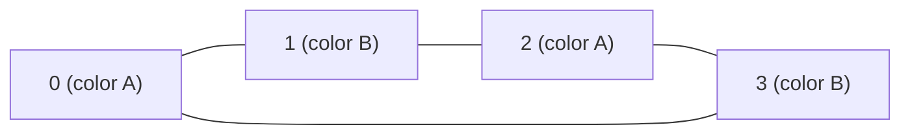

**Interviewer cue:** "can all tasks finish given these dependencies", "is
there a deadlock", or "can you split these people/items into two groups
with no conflicts" -- all three boil down to the same two questions on a
graph: **does a cycle exist**, and **is this graph 2-colorable**? Both
questions reuse the traversal templates from Phase 5, with one extra piece
of bookkeeping each.

## What you'll learn

- Cycle detection in an **undirected** graph -- DFS that tracks each node's
  **parent**, and the equivalent Union-Find approach.
- Cycle detection in a **directed** graph -- the 3-color (white/gray/black)
  DFS, and why a plain visited set isn't enough.
- **Bipartite checking** -- 2-coloring the graph with BFS so every edge
  connects opposite colors.
- Why undirected and directed graphs need genuinely different cycle checks.

## The cue

:::tip[You are looking at cycle detection or 2-colouring when…]
- The problem asks whether something is **possible** given constraints that point in one
  direction: can every course be taken, can the build complete, is there a deadlock. A
  cycle is exactly what makes it impossible.
- The problem asks whether a graph is a **tree** — that is "connected **and** acyclic",
  which is two checks, or one union-find pass plus an edge count.
- Nodes must be **split into two groups** with every relationship crossing between them:
  two teams, mutual dislikes, alternating turns. That is bipartite.
- The problem says **"possible bipartition"**, or describes people who cannot be in the
  same room.

**The reframe:** all three questions are one traversal with a different bookkeeping rule.
Undirected cycles need *the parent you came from*; directed cycles need *whether the node
is on the current path*; bipartiteness needs *a colour that must flip across every edge*.
Nothing else about the traversal changes.

**Reach for something else** when you need the cycle's *contents* rather than its
existence (record parents and walk back, or use Tarjan for
[SCCs](../../phase-16-advanced-graph-algorithms/strongly-connected-components-and-bridges/)),
when edges arrive over time and you must answer between arrivals
([union-find](../union-find-problem-patterns/)), or when you need to split into three or
more groups — graph colouring with $k \ge 3$ is NP-complete, and no traversal will do it.
:::

## Visual intuition

**Directed cycle detection.** The three states are the whole algorithm — watch a node go
grey on the way down and black on the way out:

<GraphTraversal
  client:visible
  algo="cycle-directed"
  edges={[
    ["A", "B"],
    ["B", "C"],
    ["C", "A"],
    ["A", "D"],
  ]}
  start="A"
  title="A back edge into a node still on the current path is a cycle"
  lib="3-state DFS · O(V + E)"
  desc="C's edge back to A lands on a node that is still GREY -- still on the stack, still being explored -- so it closes a cycle. Contrast a node that is BLACK: finished, reachable from two branches, and perfectly legal. That distinction is the reason a plain visited set gives false positives here."
/>

**Bipartite checking.** Same traversal, different bookkeeping: a colour that must flip
across every edge.

<GraphTraversal
  client:visible
  algo="bipartite"
  edges={[
    ["A", "B"],
    ["B", "C"],
    ["C", "D"],
    ["D", "A"],
  ]}
  start="A"
  title="A 4-cycle 2-colours cleanly — every edge joins opposite colours"
  lib="BFS 2-colouring"
  desc="Walk the cycle and the colour flips four times, returning to where it started. An odd cycle cannot do that: three flips around a triangle land the third node on the first node's colour, forcing a same-colour edge. 'Bipartite' and 'no odd cycle' are the same statement."
/>

## Undirected graphs: DFS with a parent pointer

In an undirected graph, every edge `(u, v)` is stored **both ways** -- so a
plain DFS immediately "revisits" the node it just came from. That's not a
cycle; it's just walking back over the same edge. The fix: skip only the
edge back to your **immediate parent**, but treat reaching *any other*
already-visited node as a real cycle.

```python title="cycle_undirected_dfs.py" showLineNumbers{1}
def has_cycle_undirected(n, edges):
    graph = {i: [] for i in range(n)}
    for u, v in edges:
        graph[u].append(v)
        graph[v].append(u)

    visited = set()

    def dfs(node, parent):
        visited.add(node)
        for neighbor in graph[node]:
            if neighbor not in visited:
                if dfs(neighbor, node):
                    return True
            elif neighbor != parent:
                return True   # reached a visited node that ISN'T my parent -> cycle
        return False

    return any(node not in visited and dfs(node, -1) for node in range(n))


tree_edges = [(0, 1), (1, 2), (1, 3)]              # a tree: no cycle
cyclic_edges = [(0, 1), (1, 2), (2, 0), (1, 3)]     # 0-1-2-0 forms a triangle

print("tree has cycle:", has_cycle_undirected(4, tree_edges))
print("graph has cycle:", has_cycle_undirected(4, cyclic_edges))
```

```mermaid title="A cycle exists once DFS reaches an already-visited, non-parent node"
graph TD
    N0["0"] --- N1["1"]
    N1 --- N2["2"]
    N2 --- N0
    N1 --- N3["3"]
```

DFS from `0` goes `0 -> 1 -> 2`. From `2`, the edge back to `1` is skipped
(that's the parent), but the edge `2 -> 0` lands on `0`, which is visited
and is **not** `2`'s parent -- that's the back edge that proves the
triangle `0-1-2` is a cycle.

## Undirected graphs: the Union-Find alternative

Union-Find answers the same question without recursion: process edges one
at a time, and if both endpoints are **already in the same set** before you
union them, that edge closes a cycle.

```python title="cycle_undirected_union_find.py" showLineNumbers{1}
def has_cycle_union_find(n, edges):
    parent = list(range(n))

    def find(x):
        if parent[x] != x:
            parent[x] = find(parent[x])
        return parent[x]

    for u, v in edges:
        root_u, root_v = find(u), find(v)
        if root_u == root_v:
            return True          # u and v were already connected -> this edge is a cycle
        parent[root_u] = root_v

    return False


tree_edges = [(0, 1), (1, 2), (1, 3)]
cyclic_edges = [(0, 1), (1, 2), (2, 0), (1, 3)]

print("tree has cycle:", has_cycle_union_find(4, tree_edges))
print("graph has cycle:", has_cycle_union_find(4, cyclic_edges))
```

:::tip[Redundant Connection is this exact function]
LeetCode's Redundant Connection asks for the **first** edge that would
create a cycle -- just return the current `(u, v)` the moment `find(u) ==
find(v)`, instead of a boolean.
:::

## Directed graphs: the 3-color DFS

A directed graph needs a different check entirely -- there's no "parent
edge" to skip, and a plain visited set gives **false positives** on graphs
where two branches simply share a descendant without ever looping. The fix
is three states per node: **white** (untouched), **gray** (on the current
DFS path), **black** (fully explored and safe forever). A cycle exists
exactly when an edge points at a `gray` node.

```python title="cycle_directed_dfs.py" showLineNumbers{1}
WHITE, GRAY, BLACK = 0, 1, 2


def has_cycle_directed(n, edges):
    graph = {i: [] for i in range(n)}
    for u, v in edges:
        graph[u].append(v)

    state = [WHITE] * n

    def dfs(node):
        state[node] = GRAY                     # on the current path
        for neighbor in graph[node]:
            if state[neighbor] == GRAY:
                return True                     # back edge to the current path -> cycle
            if state[neighbor] == WHITE and dfs(neighbor):
                return True
        state[node] = BLACK                     # fully explored, never re-check
        return False

    return any(state[i] == WHITE and dfs(i) for i in range(n))


dag_edges = [(0, 1), (0, 2), (1, 3), (2, 3)]     # a DAG: 3 has two parents, no cycle
cyclic_edges = [(0, 1), (1, 2), (2, 0)]           # 0 -> 1 -> 2 -> 0

print("DAG has cycle:", has_cycle_directed(4, dag_edges))
print("directed graph has cycle:", has_cycle_directed(3, cyclic_edges))
```

:::caution[Why a plain visited set fails here]
In `dag_edges`, node `3` is reached from both `1` and `2`. A plain "have I
ever seen this node" check would flag the second arrival at `3` as a
cycle -- it isn't. Only `GRAY` (on the *current* path right now) is a real
back edge; `BLACK` (finished, reached via a different branch) is perfectly
fine.
:::

## Bipartite checking: 2-coloring with BFS

A graph is **bipartite** if you can split its nodes into two groups such
that every edge connects one group to the other -- equivalently, if you can
color every node with one of two colors so no edge joins two same-colored
nodes. BFS makes this a one-line rule: color every unvisited neighbor the
**opposite** color of the current node, and fail the moment two same-color
nodes share an edge.

```python title="is_bipartite.py" showLineNumbers{1}
from collections import deque


def is_bipartite(n, edges):
    graph = {i: [] for i in range(n)}
    for u, v in edges:
        graph[u].append(v)
        graph[v].append(u)

    color = {}
    for start in range(n):
        if start in color:
            continue
        color[start] = 0
        queue = deque([start])
        while queue:
            node = queue.popleft()
            for neighbor in graph[node]:
                if neighbor not in color:
                    color[neighbor] = 1 - color[node]   # flip the color
                    queue.append(neighbor)
                elif color[neighbor] == color[node]:
                    return False                         # same color on both ends of an edge

    return True


square_edges = [(0, 1), (1, 2), (2, 3), (3, 0)]          # even cycle -- 2-colorable
triangle_edges = [(0, 1), (1, 2), (2, 0)]                 # odd cycle -- NOT 2-colorable

print("4-cycle is bipartite:", is_bipartite(4, square_edges))
print("3-cycle (triangle) is bipartite:", is_bipartite(3, triangle_edges))
```



Every edge above joins a "color A" node to a "color B" node -- that's what
makes the 4-cycle bipartite. A triangle can never be 2-colored: going
around it flips the color three times, so the third node ends up matching
the color of the first, forcing a same-color edge.

:::note[The rule: odd cycles break bipartiteness]
A graph is bipartite **if and only if it has no odd-length cycle**. That's
why the triangle (a 3-cycle) fails above but the square (a 4-cycle)
succeeds -- it's the same 2-coloring idea, just phrased in terms of cycle
length instead of a coloring conflict.
:::

## Dry run

**The DAG that a plain `visited` set gets wrong — `0→1, 0→2, 1→3, 2→3`.** Node 3 has two
parents, and nothing loops.

| depth | action | states (W/G/B) |
| --- | --- | --- |
| 0 | enter 0 → GREY | `G W W W` |
| 1 | enter 1 → GREY | `G G W W` |
| 2 | enter 3 → GREY | `G G W G` |
| 2 | exit 3 → BLACK | `G G W B` |
| 1 | edge `1→3`: target is **BLACK** → fine, keep going | `G G W B` |
| 1 | exit 1 → BLACK | `G B W B` |
| 1 | enter 2 → GREY | `G B G B` |
| 1 | edge `2→3`: target is **BLACK** → fine | `G B G B` |
| 1 | exit 2 → BLACK, then exit 0 → BLACK | `B B B B` |

No cycle. **A plain visited set would have reported one** the moment node 2 reached node
3 for the second time — that is the false positive the third state exists to prevent.
BLACK means "finished, reachable by another branch, harmless"; only GREY means "still on
the stack below me".

**Now the cyclic case — `A→B, B→C, C→A`, plus `A→D`:**

| depth | action | states |
| --- | --- | --- |
| 0 | enter A → GREY | `G W W W` |
| 1 | enter B → GREY | `G G W W` |
| 2 | enter C → GREY | `G G G W` |
| 3 | edge `C→A`: **A is GREY** → return `True` | — |

The recursion unwinds immediately and node D is never visited. Three things follow:

- **The GREY set is the current DFS path**, `A → B → C`, so an edge into it is by
  definition a back edge and closes a cycle. That is the whole proof.
- **`state[node] = BLACK` on exit is not bookkeeping tidiness.** Omit it and every node
  stays GREY forever, so the first shared descendant reports a false cycle — the same bug
  as using a plain visited set.
- **Early exit means a partial state array.** If you need the cycle's *nodes*, record a
  parent per node and walk back from the GREY target when the back edge is found.

**Bipartite, on a triangle — `0-1, 1-2, 2-0`:** colour 0 → A, then 1 → B (flip), then 2 →
A (flip). Now examine edge `2-0`: both are colour A → **`False`**. Walking an odd cycle
flips the colour an odd number of times, so it cannot return to its starting colour — the
reason "bipartite" and "no odd cycle" are the same statement. The 4-cycle flips four times
and closes cleanly.

## Complexity

All three checks are a single BFS/DFS pass: $O(V + E)$ time. Space is
$O(V)$ for the visited set / color map / parent array (plus recursion
depth for the DFS versions).

## The variant map

| Question | Bookkeeping that changes | Canonical problem |
| --- | --- | --- |
| **Cycle in an undirected graph** | pass the **parent** down and skip the edge you arrived on | LC 261 |
| **Cycle in a directed graph** | three states; a back edge into a **GREY** node | LC 207 |
| **Which edge closes the cycle** | union-find: the first `union` returning `False` | LC 684 |
| **Is it a tree?** | connected **and** acyclic — or `edges == n - 1` plus one component | LC 261 |
| **Can everything be scheduled?** | the same directed check, phrased as [topological sort](../topological-sort/) with `len(order) != n` | LC 207, LC 210 |
| **Two groups, every edge crossing** | 2-colour, flipping across each edge | LC 785, LC 886 |
| **Three or more groups** | not a traversal problem — $k$-colouring is NP-complete for $k \ge 3$ | — |
| **Cycle in a linked list** | Floyd's tortoise and hare, $O(1)$ space; a linked list is a functional graph | LC 141, LC 142 |
| **Duplicate number in an array** | treat the array as a functional graph and find the cycle entrance | LC 287 |
| **Cycle *contents*, not existence** | store a parent per node; on the back edge, walk parents back to the GREY target | LC 2360 |
| **Shortest cycle** | BFS from every node, $O(V \cdot E)$ — the DFS state trick finds *a* cycle, never the shortest | LC 2608 |

## Interview follow-ups

| They ask | What they're checking | The answer |
| --- | --- | --- |
| "Why does a plain visited set fail on a directed graph?" | The core insight | Because a node reached twice from two different branches is not a cycle. In the dry run, node 3 has two parents and the graph is a DAG. Only GREY — still on the current path — is a genuine back edge |
| "Why does the undirected version need the parent?" | The other half | Every undirected edge appears in both adjacency lists, so without skipping the edge you arrived on, every single edge looks like a 2-cycle |
| "What if there are parallel edges between the same two nodes?" | Edge cases | Then the parent trick breaks — two distinct edges `u–v` *are* a real cycle. Track the edge you came in on rather than just the node, or count edges per pair |
| "Prove that bipartite means no odd cycle" | Rigour | Walking a cycle flips the colour once per edge, so returning to the start requires an even number of flips. An odd cycle forces a same-colour edge, and conversely 2-colouring succeeds when every cycle is even |
| "Split them into three groups instead" | Whether you know the wall | 3-colouring is NP-complete, so there is no traversal-based answer. Say that immediately rather than searching for a clever DFS |
| "Return the cycle itself" | Bookkeeping | Store a parent pointer per node during the DFS; when the back edge to a GREY node is found, walk parents from the current node back to it. The GREY set is the path, so it is guaranteed to be reachable |
| "The edges arrive one at a time and you must answer after each" | Choosing the tool | Union-find, $O(\alpha)$ per edge — a `union` returning `False` is a cycle. DFS would be $O(V + E)$ *per query* |
| "Find the *shortest* cycle" | Boundaries | The DFS state trick finds *some* cycle. Shortest requires BFS from each node, $O(V \cdot E)$, or Floyd–Warshall on small graphs |

## Practice -- real LeetCode problems

Each exercise is the actual LeetCode problem with its real method signature and
LeetCode's own examples as the test. Write the body, press **Run**, and match the
expected output.

### LC 785 -- Is Graph Bipartite? · Medium

**Problem.** Given an undirected graph as an adjacency list, return `True` if it is
bipartite -- its nodes can be split into two sets with every edge joining the two
sets.

**Constraints.** `1 <= n <= 100`, no self-loops or parallel edges. The graph may be
**disconnected**.

**Examples.** `[[1,2,3],[0,2],[0,1,3],[0,2]]` gives `False` ·
`[[1,3],[0,2],[1,3],[0,2]]` gives `True`

<DataCampExercise
  lang="python"
  hint={`Two-colour the graph. Start each uncoloured node with colour 0, then give every neighbour the opposite colour. If you ever find a neighbour already coloured the SAME as the current node, an edge joins two same-set nodes and it is not bipartite. Loop over ALL nodes as starting points -- the graph may be disconnected.`}
  code={`class Solution:
    def isBipartite(self, graph):
        # TODO: two-colouring via traversal.
        # Same colour across an edge means not bipartite.
        # The graph may be DISCONNECTED, so start from every node.
        pass


sol = Solution()
cases = [[[1, 2, 3], [0, 2], [0, 1, 3], [0, 2]],
         [[1, 3], [0, 2], [1, 3], [0, 2]],
         [[], []]]
print([sol.isBipartite(g) for g in cases])
# expect [False, True, True]`}
  solution={`class Solution:
    def isBipartite(self, graph):
        colour = {}
        for start in range(len(graph)):        # disconnected: try every node
            if start in colour:
                continue
            colour[start] = 0
            stack = [start]
            while stack:
                node = stack.pop()
                for nxt in graph[node]:
                    if nxt not in colour:
                        colour[nxt] = 1 - colour[node]   # opposite colour
                        stack.append(nxt)
                    elif colour[nxt] == colour[node]:
                        return False           # same colour across an edge
        return True


sol = Solution()
cases = [[[1, 2, 3], [0, 2], [0, 1, 3], [0, 2]],
         [[1, 3], [0, 2], [1, 3], [0, 2]],
         [[], []]]
print([sol.isBipartite(g) for g in cases])`}
  sct={`test_output_contains("[False, True, True]")
success_msg("Bipartite is exactly two-colourable -- and the outer loop is what handles disconnected graphs.")
`}
  height={310}
/>

<details>
<summary>Editorial</summary>

Bipartite is equivalent to **2-colourable**, and a graph is 2-colourable exactly when
it contains no **odd-length cycle**. Traversing and assigning alternating colours tests
that directly: a conflict means you have closed a cycle of odd length.

**Time** $O(V + E)$. **Space** $O(V)$.

Two details:

- **The outer loop over every node.** The graph may be disconnected, so a single
  traversal from node 0 can miss components entirely. The `if start in colour: continue`
  guard skips already-coloured components.
- **`1 - colour[node]`** flips between 0 and 1 without a conditional.

The first example is `False` because nodes 0, 1 and 2 form a triangle -- an odd cycle.
`[[], []]` is two isolated nodes, trivially bipartite.

Either DFS or BFS works; there is no distance question. Union-find can also solve it by
unioning each node with its neighbours' "opposite" proxies, but colouring is more
direct.

**Follow-ups:** "Return the two sets?" -- collect nodes by colour. "Why odd cycles?" --
walking an odd cycle forces two adjacent nodes to share a colour; be ready to say it.
"Three colours?" -- 3-colourability is NP-complete, a sharp and worth-knowing
contrast. "Directed graph?" -- bipartiteness ignores direction, so treat it as
undirected.

</details>

### LC 886 -- Possible Bipartition · Medium

**Problem.** Given `n` people and a list of mutual dislikes, return `True` if
everyone can be split into two groups such that no two people who dislike each other
share a group.

**Constraints.** `1 <= n <= 2000`, `0 <= len(dislikes) <= 10^4`, people are labelled
`1..n`.

**Examples.** `n = 4, dislikes = [[1,2],[1,3],[2,4]]` gives `True` ·
`n = 3, dislikes = [[1,2],[1,3],[2,3]]` gives `False`

<DataCampExercise
  lang="python"
  hint={`This is LC 785 with the graph given as an edge list rather than an adjacency list, so build the adjacency first -- both directions. People are labelled 1..n, so loop the starting nodes over range(1, n+1). Everything else is the same two-colouring.`}
  code={`from collections import defaultdict


class Solution:
    def possibleBipartition(self, n, dislikes):
        # TODO: build an undirected adjacency list, then two-colour it.
        # People are 1-INDEXED. The graph may be disconnected.
        pass


sol = Solution()
cases = [(4, [[1, 2], [1, 3], [2, 4]]), (3, [[1, 2], [1, 3], [2, 3]]), (1, [])]
print([sol.possibleBipartition(n, d) for n, d in cases])
# expect [True, False, True]`}
  solution={`from collections import defaultdict


class Solution:
    def possibleBipartition(self, n, dislikes):
        adj = defaultdict(list)
        for a, b in dislikes:
            adj[a].append(b)
            adj[b].append(a)                   # dislike is mutual

        colour = {}
        for start in range(1, n + 1):          # 1-indexed people
            if start in colour:
                continue
            colour[start] = 0
            stack = [start]
            while stack:
                node = stack.pop()
                for nxt in adj[node]:
                    if nxt not in colour:
                        colour[nxt] = 1 - colour[node]
                        stack.append(nxt)
                    elif colour[nxt] == colour[node]:
                        return False
        return True


sol = Solution()
cases = [(4, [[1, 2], [1, 3], [2, 4]]), (3, [[1, 2], [1, 3], [2, 3]]), (1, [])]
print([sol.possibleBipartition(n, d) for n, d in cases])`}
  sct={`test_output_contains("[True, False, True]")
success_msg("Recognising a word problem as a known graph question is most of the work here.")
`}
  height={320}
/>

<details>
<summary>Editorial</summary>

The modelling step is the content: "split people into two groups so that no disliking
pair shares a group" **is** graph bipartiteness, with people as nodes and dislikes as
edges.

**Time** $O(V + E)$. **Space** $O(V + E)$.

Once modelled, the code is LC 785 verbatim plus adjacency-list construction. Two small
differences worth noting:

- **1-indexed labels**, so the outer loop is `range(1, n + 1)`. Using `range(n)` silently
  skips person `n` and examines a nonexistent person `0`.
- **Edge list input**, so you must build the adjacency both ways -- dislike is mutual.

`(3, [[1,2],[1,3],[2,3]])` is a triangle: three mutually disliking people cannot be
split into two groups. That is the odd-cycle obstruction.

**Follow-ups:** "Three groups?" -- 3-colouring, NP-complete. "Return the groups?" --
read them off the colour map. "What if some pairs must be *together*?" -- that adds
equality constraints, making it a union-find problem alongside the colouring, similar to
[LC 990](../union-find-problem-patterns/). "Maximise the split when it is impossible?"
-- max-cut, NP-hard.

</details>

### LC 1361 -- Validate Binary Tree Nodes · Medium

**Problem.** Given `n` nodes numbered `0..n-1` with `leftChild[i]` and
`rightChild[i]` (or `-1`), return `True` if they form exactly one valid binary tree.

**Constraints.** `1 <= n <= 10^4`, child values are `-1` or valid node indices.

**Examples.** `n = 4, leftChild = [1,-1,3,-1], rightChild = [2,-1,-1,-1]` gives
`True` · with `rightChild = [2,3,-1,-1]` gives `False` (node 3 has two parents) ·
`n = 2, leftChild = [1,0], rightChild = [-1,-1]` gives `False` (a cycle)

<DataCampExercise
  hint={`A valid binary tree needs three things: no node has two parents (check in-degrees), exactly one node has no parent (the root), and every node is reachable from that root (which rules out a separate cycle). Check all three -- the in-degree conditions alone allow a disconnected cycle plus a valid tree.`}
  lang="python"
  code={`class Solution:
    def validateBinaryTreeNodes(self, n, leftChild, rightChild):
        # TODO: three conditions.
        # 1) no node has two parents
        # 2) exactly one node has no parent (the root)
        # 3) every node is reachable from that root
        # All three are needed -- think about why 1 and 2 alone are not enough.
        pass


sol = Solution()
cases = [(4, [1, -1, 3, -1], [2, -1, -1, -1]),
         (4, [1, -1, 3, -1], [2, 3, -1, -1]),
         (2, [1, 0], [-1, -1]),
         (1, [-1], [-1])]
print([sol.validateBinaryTreeNodes(n, l, r) for n, l, r in cases])
# expect [True, False, False, True]`}
  solution={`class Solution:
    def validateBinaryTreeNodes(self, n, leftChild, rightChild):
        indeg = [0] * n
        for i in range(n):
            for child in (leftChild[i], rightChild[i]):
                if child != -1:
                    indeg[child] += 1
                    if indeg[child] > 1:
                        return False           # two parents

        roots = [i for i in range(n) if indeg[i] == 0]
        if len(roots) != 1:
            return False                       # need exactly one root

        seen = {roots[0]}                      # connectivity from the root
        stack = [roots[0]]
        count = 0
        while stack:
            node = stack.pop()
            count += 1
            for child in (leftChild[node], rightChild[node]):
                if child != -1 and child not in seen:
                    seen.add(child)
                    stack.append(child)
        return count == n


sol = Solution()
cases = [(4, [1, -1, 3, -1], [2, -1, -1, -1]),
         (4, [1, -1, 3, -1], [2, 3, -1, -1]),
         (2, [1, 0], [-1, -1]),
         (1, [-1], [-1])]
print([sol.validateBinaryTreeNodes(n, l, r) for n, l, r in cases])`}
  sct={`test_output_contains("[True, False, False, True]")
success_msg("Degree conditions alone permit a cycle hiding elsewhere -- the reachability check is what excludes it.")
`}
  height={370}
/>

<details>
<summary>Editorial</summary>

Three conditions, and **all three are necessary**:

1. **No node has two parents** -- in-degree at most 1.
2. **Exactly one node has in-degree 0** -- the root.
3. **Every node is reachable from that root.**

**Time** $O(n)$. **Space** $O(n)$.

The interesting part is why (3) cannot be dropped. Consider two nodes forming a
**cycle** pointing at each other, alongside a separate valid tree: every node in the
cycle has in-degree exactly 1, so condition (1) holds, and the tree contributes exactly
one in-degree-0 node, so (2) holds too. Yet the structure is not a single tree.
`(2, [1,0], [-1,-1])` is the minimal version -- nodes 0 and 1 point at each other, no
node has in-degree 0, so it fails at (2); but larger constructions pass both degree
checks and only reachability catches them.

That is the general lesson: **degree conditions constrain local structure, traversal
confirms global structure.** Both are needed.

`(1, [-1], [-1])` is the single-node tree: in-degree 0, one root, reachable, `True`.

**Follow-ups:** "Why is the reachability check needed?" -- the disconnected-cycle
argument; the expected question. "Union-find instead?" -- union each parent with its
children and reject a union that fails (a cycle) or leaves more than one component.
"Validate a general tree?" -- the same three conditions with unbounded children.
"Detect *which* nodes are unreachable?" -- `set(range(n)) - seen`.

</details>

## LeetCode problem set

Generated from the problem database, so each entry carries its sheet
membership and reported companies. Tick them off as you go — progress is
saved in this browser, and the Export button writes it to a file you can keep.

<ProblemLadder pattern="cycle-detection-and-bipartite-checking"
  notes={{"207":"Directed cycle detection via the 3-color DFS above; courses can finish iff there's no cycle","684":"Undirected cycle detection with Union-Find; return the edge that first closes the loop","785":"The 2-coloring BFS above, applied directly","886":"Build a graph from the \"dislikes\" pairs, then run the same bipartite check"}} />

## Self-check

<Quiz
  title="Cycle detection and bipartite checking — self-check"
  questions={[
    {
      q: "Why does a plain `visited` set produce false positives for cycles in a directed graph?",
      options: [
        "Because directed graphs may be disconnected",
        "Because a node reached twice from two different branches is not a cycle — in a DAG like 0→1, 0→2, 1→3, 2→3, node 3 has two parents and nothing loops",
        "Because visited sets cannot store direction",
        "It does not; a visited set is sufficient",
      ],
      answer: 1,
      explain:
        "Only GREY — on the current DFS path — is a genuine back edge. BLACK means finished and reachable by another route, which is perfectly legal. That is exactly why the third state exists.",
    },
    {
      q: "What is the role of `state[node] = BLACK` on the way out of the recursion?",
      options: [
        "Bookkeeping tidiness; it can be omitted",
        "It is load-bearing: without it every visited node stays GREY forever, so the first shared descendant reports a cycle that does not exist",
        "It prevents infinite recursion",
        "It marks the node as part of a cycle",
      ],
      answer: 1,
      explain:
        "Omitting the exit transition reduces the three-state algorithm to the two-state one, reintroducing the false positive it was written to avoid.",
    },
    {
      q: "Why does the undirected version need the parent node passed down?",
      options: [
        "To reconstruct the cycle",
        "Because every undirected edge appears in both adjacency lists, so without skipping the edge you arrived on, every edge looks like a 2-cycle",
        "To count components",
        "To handle self-loops",
      ],
      answer: 1,
      explain:
        "Note the failure mode if there are parallel edges between the same pair: two distinct u–v edges ARE a real cycle, so tracking the node is not enough — you must track the specific edge.",
    },
    {
      q: "Why is a graph bipartite if and only if it has no odd cycle?",
      options: [
        "Because odd cycles have more edges than nodes",
        "Because traversing a cycle flips the colour once per edge, so returning to the start requires an even number of flips — an odd cycle forces two adjacent nodes to share a colour",
        "Because BFS visits odd layers last",
        "It is a convention, not a theorem",
      ],
      answer: 1,
      explain:
        "The triangle in the dry run flips A → B → A and then collides on the closing edge. The 4-cycle flips four times and closes cleanly.",
    },
    {
      q: "The follow-up asks you to split the nodes into three groups with no edge inside a group. What do you say?",
      options: [
        "Use three colours instead of two, same BFS",
        "That 3-colouring is NP-complete, so no traversal solves it — say so immediately rather than hunting for a clever DFS",
        "Run bipartite checking twice",
        "Use union-find with three sets",
      ],
      answer: 1,
      explain:
        "2-colouring is easy precisely because each node's colour is forced by its neighbour. With three colours there is a choice at every step, and the problem becomes a search.",
    },
    {
      q: "Edges arrive one at a time and after each you must report whether a cycle now exists. Which tool?",
      options: [
        "Re-run DFS after each edge",
        "Union-find: O(α(n)) per edge, and a `union` that returns False means the new edge closes a cycle",
        "Kahn's algorithm",
        "Floyd's tortoise and hare",
      ],
      answer: 1,
      explain:
        "Re-running DFS is O(V + E) per query. This incremental setting is precisely where union-find beats traversal — and it also names the offending edge, which LC 684 asks for.",
    },
  ]}
/>

## Recall card

- **Cue** — "is it possible" under one-way constraints (cycle), "is it a tree"
  (connected + acyclic), or "split into two groups" (bipartite).
- **Undirected cycle** — DFS carrying the **parent**; skip the edge you arrived on. Or
  union-find, where a failed `union` names the closing edge.
- **Directed cycle** — three states. **GREY = on the current path**, and an edge into GREY
  is the cycle. BLACK on exit is mandatory, not tidiness.
- **Plain visited fails on directed graphs** — two parents is not a loop.
- **Bipartite** — 2-colour, flipping across every edge; a same-colour edge fails. Loop
  over all nodes: the graph may be disconnected.
- **Bipartite ⇔ no odd cycle** — an odd number of flips cannot return to the starting
  colour.
- **Cost** — $O(V + E)$ time, $O(V)$ space for all three.
- **Walls** — $k$-colouring for $k \ge 3$ is NP-complete; the *shortest* cycle needs BFS
  from every node, $O(V \cdot E)$.

## Recap

- **Undirected cycle**: DFS with a `parent` pointer (skip only the parent
  edge), or Union-Find (a cycle closes the moment two endpoints share a
  root).
- **Directed cycle**: 3-color DFS -- a back edge to a `GRAY` node (on the
  current path) is a cycle; a `BLACK` node (finished via another branch) is
  not.
- **Bipartite**: 2-color with BFS, flipping color across every edge; fails
  the instant two same-colored nodes share an edge. Equivalently: bipartite
  iff no odd-length cycle exists.
- All three are $O(V + E)$ time, $O(V)$ space -- the same traversal
  budget as plain BFS/DFS, just with extra per-node bookkeeping.

Next: **Strongly Connected Components and Bridges** -- what happens when
"connected" gets stricter (both directions) or the graph itself has
single points of failure.
