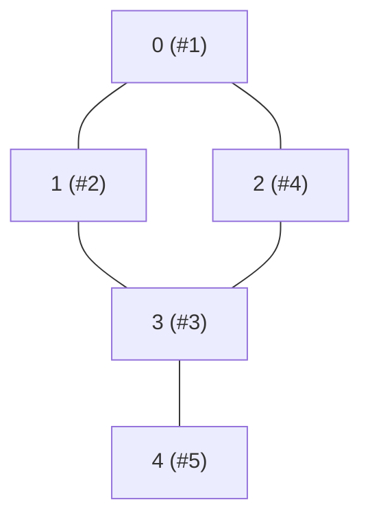

**Interviewer cue:** "does a path exist", "how many connected groups",
"flood-fill this region", or "is there a cycle" -- depth-first search goes
as deep as possible down one branch before backtracking, making it the
natural fit for exploring *whether something exists* rather than *how far
away it is*.

## What you'll learn

- The **recursive** DFS template, using the call stack for you.
- The **iterative** version with an explicit stack -- same order, no
  recursion-depth risk.
- **Connected components** / flood fill, the pattern behind Number of
  Islands and Max Area of Island.
- A quick preview of **cycle detection** on a directed graph (Course
  Schedule).

## The cue

:::tip[You are looking at DFS when…]
- The question is **"is there a path"**, **"how many groups"**, or **"does this
  contain"** — reachability and structure, not distance.
- You need to **explore every possibility and undo** — all paths, all subsets, all
  placements. Backtracking is DFS with an un-choose step.
- The answer depends on a node's **subtree or descendants**: sizes, sums, "does anything
  below me satisfy X". Post-order is the natural shape and BFS cannot express it.
- The problem is about **cycles, topological order, bridges, or articulation points** —
  all of which are defined in terms of DFS's entry/exit times, not distances.

**The reframe:** DFS commits. It follows one path as far as it goes, then backtracks
exactly one step and tries the next option. That commitment is what gives you a *path in
hand* at every moment — which is why path-recording, cycle detection and backtracking
are all DFS, and why shortest-path is not.

**Reach for something else** when you need the **shortest** anything in an unweighted
graph ([BFS](../breadth-first-search/) — DFS's first arrival is *not* shortest), or when
the graph is deep enough to blow the recursion limit and you have no reason to prefer
depth (use BFS, or DFS with an explicit stack).
:::

## Visual intuition

Watch the **stack** panel rather than the graph: DFS's memory is the path from the root
to where it currently is, which is exactly why the space bound is $O(h)$ and not
$O(\text{width})$.

<GraphTraversal
  client:visible
  algo="dfs"
  edges={[
    ["A", "B"],
    ["A", "C"],
    ["B", "D"],
    ["C", "D"],
    ["D", "E"],
  ]}
  start="A"
  title="DFS goes deep first: A → B → D → C, and only then back out to E"
  lib="O(V + E) time, O(h) stack"
  desc="Compare this with the BFS trace on the previous page: identical graph, identical code except pop() versus popleft(), completely different order. Notice that when D is reached, the stack holds A, B, D -- the current path -- and node C is discovered from D rather than from A, even though A is adjacent to it."
/>

## The pattern (recursive)

```python title="dfs_recursive.py" showLineNumbers{1}
def dfs(graph, node, visited=None, order=None):
    if visited is None:
        visited = set()
        order = []
    visited.add(node)
    order.append(node)
    for neighbor in graph[node]:
        if neighbor not in visited:
            dfs(graph, neighbor, visited, order)   # go deep before trying siblings
    return order


graph = {
    0: [1, 2],
    1: [0, 3],
    2: [0, 3],
    3: [1, 2, 4],
    4: [3],
}

print("DFS order from 0:", dfs(graph, 0))
```

## The pattern (iterative, with an explicit stack)

```python title="dfs_iterative.py" showLineNumbers{1}
def dfs_iterative(graph, start):
    visited = {start}
    stack = [start]
    order = []

    while stack:
        node = stack.pop()             # LIFO: most recently pushed goes first
        order.append(node)
        for neighbor in graph[node]:
            if neighbor not in visited:
                visited.add(neighbor)
                stack.append(neighbor)

    return order


graph = {
    0: [1, 2],
    1: [0, 3],
    2: [0, 3],
    3: [1, 2, 4],
    4: [3],
}

print("DFS order from 0 (iterative):", dfs_iterative(graph, 0))
```

:::tip[stack.pop() vs. queue.popleft()]
This is the *entire* difference between DFS and BFS: swap the LIFO
`stack.pop()` (last in, first out -- go deep) for a FIFO `queue.popleft()`
(first in, first out -- go wide) and you get breadth-first search using
almost identical code.
:::

## How it works



From `0`, DFS commits to `1` immediately, then to `1`'s unvisited neighbor
`3`, then to `3`'s unvisited neighbor `2` -- only backtracking to explore
`4` once that entire branch is exhausted. Compare this to BFS's diagram in
the previous lesson: same graph, completely different visit order.

## Worked example: connected components / flood fill

Counting islands means: for every unvisited land cell, run a DFS that marks
its **entire connected region** as visited, then count how many times you
had to start a fresh DFS.

```python title="dfs_flood_fill_islands.py" showLineNumbers{1}
def count_islands(grid):
    rows, cols = len(grid), len(grid[0])
    visited = set()

    def flood_fill(r, c):
        stack = [(r, c)]
        visited.add((r, c))
        while stack:
            row, col = stack.pop()
            for dr, dc in [(-1, 0), (1, 0), (0, -1), (0, 1)]:
                nr, nc = row + dr, col + dc
                if (0 <= nr < rows and 0 <= nc < cols
                        and grid[nr][nc] == 1 and (nr, nc) not in visited):
                    visited.add((nr, nc))
                    stack.append((nr, nc))

    islands = 0
    for r in range(rows):
        for c in range(cols):
            if grid[r][c] == 1 and (r, c) not in visited:
                islands += 1          # found a NEW island's starting cell
                flood_fill(r, c)

    return islands


grid = [
    [1, 1, 0, 0],
    [1, 0, 0, 1],
    [0, 0, 1, 1],
]
print("number of islands:", count_islands(grid))
```

:::note[Max Area of Island is one small tweak]
Have `flood_fill` return the count of cells it marked instead of nothing,
and take the `max` across every call -- that's Max Area of Island, same
traversal.
:::

## A preview: cycle detection

Course Schedule asks "can all courses be finished given prerequisites?" --
equivalently, "does this directed graph have a cycle?" DFS answers this by
tracking three states per node: **unvisited**, **currently on this DFS
path**, and **fully finished**. A cycle exists exactly when you reach a node
that's still on the current path.

```python title="dfs_cycle_detection_teaser.py" showLineNumbers{1}
WHITE, GRAY, BLACK = 0, 1, 2   # unvisited, currently exploring, fully done


def can_finish(num_courses, prerequisites):
    graph = {i: [] for i in range(num_courses)}
    for course, prereq in prerequisites:
        graph[prereq].append(course)

    state = [WHITE] * num_courses

    def has_cycle(node):
        state[node] = GRAY                  # mark "on the current DFS path"
        for neighbor in graph[node]:
            if state[neighbor] == GRAY:
                return True                  # back edge to a node still on the path -> cycle
            if state[neighbor] == WHITE and has_cycle(neighbor):
                return True
        state[node] = BLACK                  # fully explored, safe forever
        return False

    return not any(state[i] == WHITE and has_cycle(i) for i in range(num_courses))


print(can_finish(2, [[1, 0]]))          # True: 0 -> 1, no cycle
print(can_finish(2, [[1, 0], [0, 1]]))  # False: 0 -> 1 -> 0, a cycle
```

:::caution[GRAY vs. BLACK matters]
Checking only "have I seen this node before" (a plain visited set, no
states) gives false positives on graphs that just **share** a descendant
without looping -- you specifically need "is it on *my current path right
now*" (`GRAY`), not "have I ever visited it" (`GRAY` or `BLACK`).
:::

## Dry run

Same graph as the BFS page — `{0: [1,2], 1: [0,3], 2: [0,3], 3: [1,2,4], 4: [3]}`,
starting at 0 — so the two orders can be compared directly.

**Recursive.** Indentation is recursion depth:

| depth | visit | neighbours | what happens |
| --- | --- | --- | --- |
| 0 | **0** | `[1, 2]` | descend into 1 and do not touch 2 yet |
| 1 | **1** | `[0, 3]` | 0 is visited; descend into 3 |
| 2 | **3** | `[1, 2, 4]` | 1 visited; descend into **2** — from *here*, not from 0 |
| 3 | **2** | `[0, 3]` | both visited → return immediately |
| 3 | **4** | `[3]` | visited → return; the whole recursion unwinds |

Order: `0 1 3 2 4`. BFS on the same graph gave `0 1 2 3 4`.

- **Node 2 is discovered from node 3, not from node 0**, even though 0 is adjacent to
  it. DFS had already committed to the 1 → 3 branch, and 3 reached 2 first. This is the
  concrete meaning of "first arrival is not shortest": 2 is at distance 1 from the
  start, but DFS found it at recursion depth 3.
- **At the deepest point the stack holds `0 → 1 → 3 → 2`** — the current path, and
  nothing else. That is the $O(h)$ space bound, and it is also why DFS can hand you a
  path for free while BFS needs a `parent` map.

**Iterative, with the template exactly as written above:**

| pop | `order` | pushed | `stack` after |
| --- | --- | --- | --- |
| 0 | `0` | 1, 2 | `[1, 2]` |
| **2** | `0 2` | 3 | `[1, 3]` |
| 3 | `0 2 3` | 4 | `[1, 4]` |
| 4 | `0 2 3 4` | — | `[1]` |
| 1 | `0 2 3 4 1` | — | `[]` |

Order: `0 2 3 4 1` — **a different order from the recursive version**, and both are
legitimate depth-first traversals.

:::note[Why the iterative order differs, and how to make it match]
Two things cause the difference. The stack reverses sibling order (1 is pushed first, so
2 pops first), and marking visited at **push** time fixes a node's fate before it is
reached, so node 1 is still sitting in the stack when the walk finishes elsewhere.

If the exact recursive order matters — and for a plain traversal it usually does not —
push neighbours in **reverse** and mark visited on **pop**, skipping nodes already seen:

```python
while stack:
    node = stack.pop()
    if node in visited:
        continue                      # a stale duplicate; skip it
    visited.add(node)
    order.append(node)
    for neighbor in reversed(graph[node]):
        if neighbor not in visited:
            stack.append(neighbor)
```

That returns `0 1 3 2 4`, identical to the recursion. The price is that the stack may
hold duplicates, so it is $O(E)$ rather than $O(V)$ in the worst case — the mirror of
the enqueue/dequeue trade-off in BFS.
:::

## Complexity

Recursive or iterative, DFS visits every node and edge at most once:
$O(V + E)$ time. Space is $O(V)$ for the visited set, plus $O(V)$ in the
worst case for the recursion stack (or explicit stack) on a graph that
degenerates into one long chain.

## When to use it

- **Connected components / flood fill** -- islands, regions, clusters.
- **Path existence** -- "can you get from A to B", without needing the
  shortest route.
- **Cycle detection** -- directed graphs (course prerequisites, deadlock
  detection) via the 3-state trick above.
- **Exhaustive exploration with undo** -- the very next pattern,
  backtracking, is DFS plus "undo the last choice before trying the next
  one."

## The variant map

| Variant | What changes | Canonical problem |
| --- | --- | --- |
| **Reachability / components** | count how many times the outer loop starts a DFS | LC 200, LC 547 |
| **Flood fill on a grid** | the four offsets replace the adjacency list; sink the cell to mark it | LC 733, LC 695 |
| **All paths** | append to a `path` list, recurse, then `pop()` — DFS plus undo | LC 797, LC 113 |
| **Cycle detection, directed** | three states (unvisited / **in progress** / done); a back edge to an in-progress node is a cycle | [Cycle detection](../cycle-detection-and-bipartite-checking/) · LC 207 |
| **Cycle detection, undirected** | two states plus the **parent** node, so the edge you arrived on is not mistaken for a cycle | LC 261 |
| **Topological order** | push each node to a list on **exit**, then reverse it | [Topological sort](../topological-sort/) · LC 210 |
| **Subtree summaries** | do the work *after* the recursive calls (post-order) and return a value upward | LC 543, LC 124 |
| **Bridges / articulation points** | track discovery time and a low-link value per node — Tarjan | [SCC and bridges](../../phase-16-advanced-graph-algorithms/strongly-connected-components-and-bridges/) |
| **Memoised DFS on a DAG** | cache each node's answer; DFS becomes top-down DP | LC 329, LC 1626 |
| **Very deep graph** | explicit stack, or `sys.setrecursionlimit` — a $10^5$-node chain exceeds CPython's ~1000 frames | — |

## Interview follow-ups

| They ask | What they're checking | The answer |
| --- | --- | --- |
| "DFS or BFS here, and why?" | Judgement | Reachability, components, all-paths, cycles and subtree values → DFS. Shortest path or per-level output → BFS. If either works, DFS is usually shorter and uses $O(h)$ rather than $O(w)$ space |
| "Does DFS find the shortest path?" | A common misconception | No. In the dry run, node 2 is one edge from the start and DFS reaches it at depth 3. DFS's first arrival carries no distance guarantee at all |
| "Convert your recursion to an iterative version" | Whether you understand the stack | Push the start, then pop-and-expand. Note that the naive conversion visits siblings in reverse order; pushing neighbours reversed and marking visited on pop reproduces the recursive order exactly |
| "What is the space complexity?" | Precision | $O(V)$ for `visited` plus $O(h)$ for the stack, where $h$ is the longest path explored — $O(V)$ on a chain. BFS's mirror bound is the widest layer |
| "The graph has $10^5$ nodes in a line" | Python awareness | The recursion dies at CPython's ~1000-frame default. Either raise the limit or switch to the explicit stack. Worth saying before it is asked |
| "How do you detect a cycle?" | Whether you know both cases | Directed: three colours, and a back edge into an in-progress node is a cycle. Undirected: pass the parent down and ignore the edge you came in on. Using the directed method on an undirected graph reports every edge as a cycle |
| "Give me every path, not just one" | Backtracking | Maintain a shared `path`, append before recursing, `pop()` after, and copy the list when recording a complete path — `out.append(list(path))`, never `out.append(path)` |
| "When is a `visited` set *not* needed?" | Understanding of the structure | On a tree or a DAG traversal where revisiting is impossible or harmless. On a DAG you may still want memoisation — not to avoid cycles, but to avoid exponential re-exploration |

## Practice -- real LeetCode problems

Each exercise is the actual LeetCode problem with its real method signature and
LeetCode's own examples as the test. Write the body, press **Run**, and match the
expected output.

### LC 797 -- All Paths From Source to Target · Medium

**Problem.** Given a **DAG** as an adjacency list of `n` nodes, return all paths from
node `0` to node `n - 1`, in any order.

**Constraints.** `2 <= n <= 15`, the graph is acyclic and has no self-loops.

**Examples.** `[[1,2],[3],[3],[]]` gives `[[0,1,3],[0,2,3]]`

<DataCampExercise
  lang="python"
  hint={`Backtracking DFS. Keep one shared path list, seeded with node 0. On reaching the last node, record a COPY of the path. Otherwise append each neighbour, recurse, and pop. Because the graph is a DAG there are no cycles, so no visited set is needed -- and you must not use one, since a node can appear on several different paths.`}
  code={`class Solution:
    def allPathsSourceTarget(self, graph):
        # TODO: backtracking DFS from node 0 to node n-1.
        # Record a COPY of the path at the target.
        # It is a DAG, so no visited set -- a node may appear on many paths.
        pass


sol = Solution()
cases = [[[1, 2], [3], [3], []], [[4, 3, 1], [3, 2, 4], [3], [4], []]]
print([sol.allPathsSourceTarget(g) for g in cases])
# expect [[[0, 1, 3], [0, 2, 3]], [[0, 4], [0, 3, 4], [0, 1, 3, 4], [0, 1, 2, 3, 4], [0, 1, 4]]]`}
  solution={`class Solution:
    def allPathsSourceTarget(self, graph):
        target = len(graph) - 1
        out, path = [], [0]

        def dfs(node):
            if node == target:
                out.append(list(path))         # COPY, not a reference
                return
            for nxt in graph[node]:
                path.append(nxt)               # choose
                dfs(nxt)
                path.pop()                     # un-choose

        dfs(0)
        return out


sol = Solution()
cases = [[[1, 2], [3], [3], []], [[4, 3, 1], [3, 2, 4], [3], [4], []]]
print([sol.allPathsSourceTarget(g) for g in cases])`}
  sct={`test_output_contains("[[0, 1, 3], [0, 2, 3]]")
test_output_contains("[0, 1, 2, 3, 4]")
success_msg("No visited set -- a DAG has no cycles, and a node legitimately appears on many paths.")
`}
  height={310}
/>

<details>
<summary>Editorial</summary>

This is [backtracking](../../phase-11-recursion-and-backtracking/subsets-and-combinations/)
on a graph rather than pure traversal: you are enumerating paths, not visiting nodes
once.

**Time** $O(2^n \times n)$ in the worst case -- a complete DAG has exponentially many
paths, and the constraint `n <= 15` tells you that is expected. **Space** $O(n)$ for
the recursion and path.

**The absence of a visited set is deliberate**, and it is the detail worth
understanding. In ordinary traversal you mark nodes to avoid revisiting. Here a node
may legitimately lie on many different paths -- node `3` appears in three of the second
example's five paths -- so marking it would lose answers. The DAG guarantee is what
makes omitting it safe: with no cycles, the recursion cannot loop forever.

The usual backtracking disciplines still apply: record `list(path)` not `path`, and
pair every `append` with a `pop`.

**Follow-ups:** "What if the graph had cycles?" -- infinite paths; you would need a
per-path visited set (added and removed alongside the path) to avoid revisiting within
the current path. "Just count the paths?" -- DP over the DAG, $O(V + E)$, no
enumeration. "Only the shortest path?" -- BFS. "Why is exponential acceptable?" -- the
output itself is exponential.

</details>

### LC 841 -- Keys and Rooms · Medium

**Problem.** `n` rooms are locked except room `0`. Each room contains keys to other
rooms. Return `True` if you can visit **all** rooms starting from room `0`.

**Constraints.** `2 <= n <= 1000`, keys are valid room numbers, no key to room `0`.

**Examples.** `[[1],[2],[3],[]]` gives `True` ·
`[[1,3],[3,0,1],[2],[0]]` gives `False` (room 2 is unreachable)

<DataCampExercise
  lang="python"
  hint={`This is reachability: can a single DFS or BFS from room 0 reach every room? Use an explicit stack with a seen set, adding rooms as you push them. At the end compare the number of rooms seen against the total. A room can hold a key you already have, so the seen check is what prevents infinite looping.`}
  code={`class Solution:
    def canVisitAllRooms(self, rooms):
        # TODO: reachability from room 0.
        # DFS or BFS with a seen set; compare the count against len(rooms).
        pass


sol = Solution()
cases = [[[1], [2], [3], []], [[1, 3], [3, 0, 1], [2], [0]]]
print([sol.canVisitAllRooms(r) for r in cases])
# expect [True, False]`}
  solution={`class Solution:
    def canVisitAllRooms(self, rooms):
        seen = {0}
        stack = [0]
        while stack:
            room = stack.pop()
            for key in rooms[room]:
                if key not in seen:            # skip rooms already opened
                    seen.add(key)
                    stack.append(key)
        return len(seen) == len(rooms)


sol = Solution()
cases = [[[1], [2], [3], []], [[1, 3], [3, 0, 1], [2], [0]]]
print([sol.canVisitAllRooms(r) for r in cases])`}
  sct={`test_output_contains("[True, False]")
success_msg("A single traversal from node 0 answers reachability -- count what you reached.")
`}
  height={270}
/>

<details>
<summary>Editorial</summary>

"Can I reach everything from one node?" is answered by a single traversal plus a count.
Either DFS or BFS works -- there is no distance question, so the choice is arbitrary.

**Time** $O(V + E)$ -- every room entered once, every key examined once.
**Space** $O(V)$.

The `seen` check does double duty: it prevents re-traversal and it makes the final count
meaningful. Rooms can contain keys to rooms you have already opened -- room 1 in the
second example holds a key to room 0 -- so without it the loop would never terminate.

The second example returns `False` because room 2's only key holder is room 2 itself:
nothing reachable from room 0 provides it.

This is [connected-component](../graph-traversal-and-connected-components/) counting
specialised to "is there exactly one component containing node 0, and does it cover
everything".

**Follow-ups:** "Which rooms are unreachable?" -- return
`set(range(n)) - seen`. "Iterative or recursive?" -- either; the explicit stack avoids
Python's recursion limit at `n = 1000`. "What if room 0 were locked too?" -- the answer
would be `False` unless `n == 0`. "Minimum keys to open everything?" -- a much harder
covering problem.

</details>

### LC 1443 -- Minimum Time to Collect All Apples in a Tree · Medium

**Problem.** An undirected tree has `n` nodes rooted at `0`. Each edge takes 1 second
to traverse in each direction. Return the minimum seconds to collect all apples and
return to node `0`.

**Constraints.** `1 <= n <= 10^5`, `edges` forms a tree,
`hasApple` has length `n`.

**Examples.** With edges `[[0,1],[0,2],[1,4],[1,5],[2,3],[2,6]]` and apples at
nodes 2, 4, 5, the answer is `8`; with apples at 2 and 5 only, `6`; with no apples,
`0`

<DataCampExercise
  lang="python"
  hint={`Post-order DFS returning the cost of the subtree below each node. For each child, recurse -- and only pay the 2 seconds for that edge (down and back up) if the child's subtree returned a non-zero cost OR the child itself has an apple. That condition is what prunes branches with nothing worth collecting. Build an adjacency list and pass the parent down to avoid walking back up.`}
  code={`from collections import defaultdict


class Solution:
    def minTime(self, n, edges, hasApple):
        # TODO: post-order DFS returning the subtree cost.
        # Pay 2 for a child edge only if that subtree has something worth
        # visiting -- a non-zero cost below, or an apple at the child itself.
        # Pass the parent down; the tree is undirected.
        pass


sol = Solution()
E = [[0, 1], [0, 2], [1, 4], [1, 5], [2, 3], [2, 6]]
cases = [(7, E, [False, False, True, False, True, True, False]),
         (7, E, [False, False, True, False, False, True, False]),
         (7, E, [False] * 7)]
print([sol.minTime(n, e, h) for n, e, h in cases])
# expect [8, 6, 0]`}
  solution={`from collections import defaultdict


class Solution:
    def minTime(self, n, edges, hasApple):
        adj = defaultdict(list)
        for a, b in edges:
            adj[a].append(b)
            adj[b].append(a)                   # undirected

        def dfs(node, parent):
            cost = 0
            for nxt in adj[node]:
                if nxt == parent:
                    continue                   # do not walk back up
                sub = dfs(nxt, node)
                # only pay for this edge if the subtree is worth entering
                if sub > 0 or hasApple[nxt]:
                    cost += sub + 2            # down and back up
            return cost

        return dfs(0, -1)


sol = Solution()
E = [[0, 1], [0, 2], [1, 4], [1, 5], [2, 3], [2, 6]]
cases = [(7, E, [False, False, True, False, True, True, False]),
         (7, E, [False, False, True, False, False, True, False]),
         (7, E, [False] * 7)]
print([sol.minTime(n, e, h) for n, e, h in cases])`}
  sct={`test_output_contains("[8, 6, 0]")
success_msg("Pay for an edge only if something below is worth collecting -- that pruning IS the algorithm.")
`}
  height={350}
/>

<details>
<summary>Editorial</summary>

Because it is a tree, any edge you traverse downward must also be traversed back up --
so each useful edge costs exactly `2`. The question is which edges are useful.

An edge to child `c` is worth taking exactly when there is an apple at or below `c`.
The recursion expresses that as `sub > 0 or hasApple[nxt]`: a non-zero subtree cost
means an apple lies deeper, and `hasApple[nxt]` covers an apple at the child itself.

**Time** $O(n)$. **Space** $O(n)$ for the adjacency list plus $O(h)$ recursion.

This is the [Tree DFS](../../phase-09-patterns-trees/tree-dfs-paths-and-sums/)
"return a summary upward" shape, with the summary being a cost and the pruning
condition doing the real work.

Two practical notes:

- **Pass the parent down.** The edge list is undirected, so without it the recursion
  immediately walks back up and loops.
- **Recursion depth.** At `n = 10^5` a path-shaped tree exceeds Python's default limit;
  mention `sys.setrecursionlimit` or an iterative post-order.

An apple at the **root** costs nothing extra, which the no-apples case (`0`) and the
structure of the condition both reflect -- the root is never a "child" of anything.

**Follow-ups:** "Not required to return to the root?" -- subtract the longest downward
path to an apple, since that final ascent is saved. "Weighted edges?" -- multiply by
the weight instead of using 2. "Collect only `k` apples?" -- much harder, a tree-DP
over counts.

</details>

## LeetCode problem set

Generated from the problem database, so each entry carries its sheet
membership and reported companies. Tick them off as you go — progress is
saved in this browser, and the Export button writes it to a file you can keep.

<ProblemLadder pattern="depth-first-search"
  notes={{"112":"DFS down a tree, subtracting each node's value from a running target","133":"DFS while building a copy, using a `visited` map from original node to its clone (so cycles in the graph don't infinite-loop you)","200":"(DFS variant) -- the flood-fill pattern above","207":"The 3-state cycle-detection preview above","695":"Flood fill, returning a size instead of just counting"}} />

## Self-check

<Quiz
  title="Depth-first search — self-check"
  questions={[
    {
      q: "In the dry run, node 2 is adjacent to the start node 0, yet DFS reaches it at recursion depth 3. What does that tell you?",
      options: [
        "The traversal is buggy",
        "That DFS's first arrival carries no distance guarantee — it commits to one branch and may reach a nearby node by a long route, which is why shortest-path problems need BFS",
        "That the graph is directed",
        "That node 2 has a higher index",
      ],
      answer: 1,
      explain:
        "This is the single most useful thing to understand about DFS versus BFS. DFS gives you a path in hand at every moment; it just is not a shortest one.",
    },
    {
      q: "What is the only difference between the iterative DFS and BFS templates?",
      options: [
        "DFS needs no visited set",
        "`stack.pop()` (LIFO) versus `queue.popleft()` (FIFO) — everything else is identical",
        "DFS pushes neighbours in reverse",
        "BFS marks visited on dequeue",
      ],
      answer: 1,
      explain:
        "One method call decides depth-first versus breadth-first. It is worth writing the two templates side by side once, because it makes the choice between them feel like a parameter rather than two separate algorithms.",
    },
    {
      q: "Your naive iterative conversion returns `0 2 3 4 1` while the recursion returns `0 1 3 2 4`. Is it wrong?",
      options: [
        "Yes — the recursive order is the definition of DFS",
        "No, both are valid depth-first traversals; the stack reverses sibling order. To match the recursion exactly, push neighbours reversed and mark visited on pop",
        "Yes, the visited set is being updated too early",
        "No, and the orders are actually identical",
      ],
      answer: 1,
      explain:
        "Marking on push also fixes a node's fate before it is reached — node 1 sits in the stack until the very end. The mark-on-pop variant reproduces the recursion at the cost of possible duplicates in the stack, O(E) instead of O(V).",
    },
    {
      q: "What is DFS's space complexity, and how does it compare with BFS?",
      options: [
        "O(V) for both, identically",
        "O(V) for visited plus O(h) for the stack, where h is the longest path — the mirror image of BFS, whose queue holds the widest layer",
        "O(1) if you mutate the input",
        "O(E) always",
      ],
      answer: 1,
      explain:
        "On a wide, shallow graph DFS wins on memory; on a deep chain BFS does — and DFS additionally risks CPython's ~1000-frame recursion limit there.",
    },
    {
      q: "How does cycle detection differ between directed and undirected graphs?",
      options: [
        "It does not",
        "Directed needs three states (unvisited / in-progress / done) and looks for a back edge into an in-progress node; undirected needs the parent passed down so the edge you arrived on is not counted",
        "Undirected graphs cannot have cycles",
        "Directed needs a parent pointer, undirected needs three states",
      ],
      answer: 1,
      explain:
        "Applying the directed method to an undirected graph reports a cycle for every single edge, since each edge appears in both adjacency lists.",
    },
    {
      q: "When can you skip the `visited` set entirely?",
      options: [
        "Never",
        "On a tree, or on a DAG where revisiting is impossible or merely wasteful — though on a DAG you often still want memoisation, to avoid exponential re-exploration rather than to avoid cycles",
        "On any undirected graph",
        "When the graph is connected",
      ],
      answer: 1,
      explain:
        "Distinguishing 'visited, to stay correct' from 'memoised, to stay fast' is the step from DFS to top-down DP — LC 329 is the standard example.",
    },
  ]}
/>

## Recall card

- **Cue** — reachability, components, all-paths, cycles, or anything defined on a node's
  **descendants**. Not shortest paths.
- **Recursive shape** — mark visited, record, then recurse into each unvisited neighbour.
  Work placed **before** the calls is pre-order; **after** them is post-order, which is
  what subtree summaries and topological order need.
- **Iterative shape** — a stack, `pop()`. It is the BFS template with `popleft()` swapped
  for `pop()`; sibling order reverses, and mark-on-pop reproduces the recursive order.
- **Cost** — $O(V + E)$ time; $O(V)$ visited plus $O(h)$ stack. BFS's mirror is the
  widest layer.
- **Cycles** — directed: three states, back edge into an *in-progress* node. Undirected:
  two states plus the parent.
- **Backtracking is DFS plus undo** — append, recurse, `pop()`; copy the path when
  recording it.
- **Python** — a $10^5$-node chain exceeds the ~1000-frame recursion limit; use the
  explicit stack and say so unprompted.

## Recap

- Recursive DFS uses the call stack; iterative DFS uses an explicit `list`
  as a stack -- same visit order either way.
- `stack.pop()` (LIFO) is the one-line difference from BFS's
  `queue.popleft()` (FIFO).
- Flood fill = DFS that marks an entire connected region visited in one
  call; counting how many times you start a new one counts components.
- Cycle detection on a directed graph needs **3 states**
  (unvisited/on-path/done), not just a plain visited set.
- $O(V + E)$ time, $O(V)$ space.

Next: **Backtracking** -- DFS that also **undoes** each choice, for
generating every valid arrangement instead of just checking reachability.
