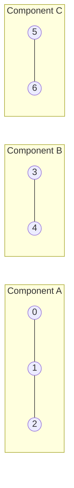

Phase 5 gave you the two traversal engines -- **BFS** (queue, layer by layer)
and **DFS** (stack, go deep then backtrack). Everything in this lesson reuses
those exact templates; the new idea is what you do with them once a graph
isn't fully connected: figure out how many separate "islands" of nodes
exist, and answer questions per-island instead of assuming one big blob.

## What you'll learn

- Counting **connected components** in an undirected graph -- the single
  loop-plus-traversal trick behind half of all "how many groups" problems.
- Why recursive DFS can crash on large or adversarial graphs, and how to
  rewrite it **iteratively** with an explicit stack.
- Components on a **matrix** representation (Number of Provinces) versus an
  **edge list** (Number of Connected Components), and on an implicit **grid**
  graph (flood fill).
- **Multi-source BFS**: seeding the queue with several starting cells at
  once to build a "distance to nearest source" map in a single pass.

## The cue

:::tip[You are looking at a components sweep when…]
- The question counts **groups**: provinces, islands, friend circles, clusters, "how many
  separate networks".
- The question asks whether **everything** is reachable — one component, or a specific
  count. "Is the network connected" is "are there exactly 1 components".
- The input **may be disconnected**, and the constraints say so. That single sentence is
  the tell: it means one traversal from node 0 is not enough, and the outer sweep is the
  answer.
- The question asks for the **largest** group, or a per-group statistic — same sweep,
  accumulating a size instead of a count.

**The reframe:** one traversal answers "what is reachable from here". A components problem
is that traversal wrapped in a loop over *every* node, where the number of times the loop
*starts* a traversal is the number of components. Everything else — sizes, largest,
per-group sums — is what you accumulate inside.

**Reach for something else** when edges arrive over time and you must answer between
arrivals ([union-find](../union-find-problem-patterns/), $O(\alpha)$ per edge versus a
full re-traversal), when the graph is **directed** and you want mutually-reachable groups
(that is
[strongly connected components](../../phase-16-advanced-graph-algorithms/strongly-connected-components-and-bridges/),
and a plain sweep gives the wrong answer), or when you need distances rather than
membership ([BFS](../breadth-first-search/)).
:::

## Quick recap: BFS and DFS

Both traversals visit every reachable node exactly once, using a `visited`
set to avoid repeats. BFS uses a `deque` and processes nodes in the order
they were discovered (FIFO); DFS uses a stack (or the call stack, via
recursion) and always chases the most recently discovered node first (LIFO).
Swap `queue.popleft()` for `stack.pop()` and the rest of the loop is
identical -- see **Breadth First Search** and **Depth First Search** in
Phase 5 if you need the full walkthrough.

The pattern this lesson builds on top of that: **a graph doesn't have to be
one connected blob.** Some nodes might be completely unreachable from
others. Counting how many separate reachable groups exist is the "connected
components" problem.

## Connected components in an undirected graph

The recipe is always the same: loop over every node; if it hasn't been
visited yet, it must be the start of a **brand-new** component, so run a
full traversal from it (marking everything reachable as visited) and bump a
counter.

```python title="count_components.py" showLineNumbers{1}
from collections import deque, defaultdict


def count_components(n, edges):
    graph = defaultdict(list)
    for u, v in edges:
        graph[u].append(v)
        graph[v].append(u)

    visited = set()
    components = 0

    for start in range(n):
        if start in visited:
            continue
        components += 1          # 'start' was never reached before -- a NEW component
        queue = deque([start])
        visited.add(start)
        while queue:
            node = queue.popleft()
            for neighbor in graph[node]:
                if neighbor not in visited:
                    visited.add(neighbor)
                    queue.append(neighbor)

    return components


n = 7
edges = [(0, 1), (1, 2), (3, 4), (5, 6)]
print("connected components:", count_components(n, edges))
```



There's no edge connecting any of the three subgraphs above, so a traversal
started at `0` can never reach `3` or `5` -- that's exactly what "separate
component" means, and why the outer `for start in range(n)` loop has to try
**every** node instead of stopping after the first traversal.

:::tip[Union-Find solves the same problem, differently]
**Union-Find (Disjoint Set Union)**, covered in Phase 3, answers "how many
components?" without any traversal at all -- union every edge's endpoints,
then count distinct roots. It's the better tool when edges arrive one at a
time (online) instead of all at once.
:::

## Recursion limits: prefer iterative DFS

```python title="recursive_dfs_danger.py" showLineNumbers{1}
import sys


def dfs_recursive(graph, node, visited):
    visited.add(node)
    for neighbor in graph[node]:
        if neighbor not in visited:
            dfs_recursive(graph, neighbor, visited)


# A "path graph" -- 0-1-2-3-...-n-1, one long chain with no branching.
n = 5000
graph = {i: [i - 1, i + 1] for i in range(n)}
graph[0] = [1]
graph[n - 1] = [n - 2]

print("Python's default recursion limit:", sys.getrecursionlimit())
# Calling dfs_recursive(graph, 0, set()) here would raise RecursionError --
# the chain is 5000 nodes deep, far past the default ~1000 limit.
print("chain length:", n, "-- deeper than the default recursion limit")
```

:::caution[A long chain will crash recursive DFS]
Recursive DFS uses one stack frame **per node on the current path**. A graph
that degenerates into a single long chain -- common in grid problems and
adversarial test cases -- can be thousands of nodes deep, far past Python's
default recursion limit (~1000), raising `RecursionError: maximum recursion
depth exceeded`. The fix is always the same: replace the recursive call with
an explicit `list` used as a stack.
:::

```python title="count_components_iterative_dfs.py" showLineNumbers{1}
def count_components_dfs(n, edges):
    graph = {i: [] for i in range(n)}
    for u, v in edges:
        graph[u].append(v)
        graph[v].append(u)

    visited = set()
    components = 0

    for start in range(n):
        if start in visited:
            continue
        components += 1
        stack = [start]
        visited.add(start)
        while stack:                      # explicit stack -- no recursion-depth risk
            node = stack.pop()
            for neighbor in graph[node]:
                if neighbor not in visited:
                    visited.add(neighbor)
                    stack.append(neighbor)

    return components


n = 6
edges = [(0, 1), (1, 2), (3, 4)]   # node 5 has no edges -- its own component
print("connected components:", count_components_dfs(n, edges))
```

## Components on other representations

The exact same "loop + traversal + counter" idea works no matter how the
graph is handed to you.

**Number of Provinces** hands you an **adjacency matrix** (`is_connected[i][j]
== 1` means cities `i` and `j` are directly connected) instead of an edge
list -- only the neighbor lookup changes.

```python title="number_of_provinces.py" showLineNumbers{1}
def find_circle_num(is_connected):
    n = len(is_connected)
    visited = set()
    provinces = 0

    def dfs(city):
        stack = [city]
        visited.add(city)
        while stack:
            node = stack.pop()
            for neighbor in range(n):     # scan the matrix ROW for direct connections
                if is_connected[node][neighbor] == 1 and neighbor not in visited:
                    visited.add(neighbor)
                    stack.append(neighbor)

    for city in range(n):
        if city not in visited:
            provinces += 1
            dfs(city)

    return provinces


is_connected = [
    [1, 1, 0],
    [1, 1, 0],
    [0, 0, 1],
]
print("number of provinces:", find_circle_num(is_connected))
```

**Flood fill on a grid** treats each cell as a node whose neighbors are its
4 grid-adjacent cells -- an implicit adjacency list you never build
explicitly. The classic **Flood Fill** LeetCode problem recolors an entire
connected region starting from one pixel:

```python title="flood_fill.py" showLineNumbers{1}
from collections import deque


def flood_fill(image, sr, sc, new_color):
    old_color = image[sr][sc]
    if old_color == new_color:
        return image           # nothing to do -- avoids an infinite requeue loop

    rows, cols = len(image), len(image[0])
    queue = deque([(sr, sc)])
    image[sr][sc] = new_color

    while queue:
        r, c = queue.popleft()
        for dr, dc in [(-1, 0), (1, 0), (0, -1), (0, 1)]:
            nr, nc = r + dr, c + dc
            if 0 <= nr < rows and 0 <= nc < cols and image[nr][nc] == old_color:
                image[nr][nc] = new_color   # recoloring doubles as the visited marker
                queue.append((nr, nc))

    return image


image = [
    [1, 1, 1],
    [1, 1, 0],
    [1, 0, 1],
]
print("flood filled:", flood_fill(image, 1, 1, 2))
```

:::note[Max Area of Island is the same traversal, different bookkeeping]
Instead of just marking cells visited, have the flood fill **return** how
many cells it touched, and take the `max` across every unvisited land cell
you start from -- that's Max Area of Island, no new algorithm required.
:::

## Multi-source BFS: distance to the nearest source

Sometimes you don't want to explore from one starting point -- you want,
for **every** cell, the distance to whichever of several sources is
closest. Seed the queue with all sources at once (each at distance 0), and
BFS's "finish one layer before starting the next" guarantee does the rest.

```python title="multi_source_distance.py" showLineNumbers{1}
from collections import deque


def nearest_source_distance(rows, cols, sources):
    dist = [[-1] * cols for _ in range(rows)]
    queue = deque()

    for r, c in sources:
        dist[r][c] = 0            # every source starts the frontier at distance 0
        queue.append((r, c))

    while queue:
        r, c = queue.popleft()
        for dr, dc in [(-1, 0), (1, 0), (0, -1), (0, 1)]:
            nr, nc = r + dr, c + dc
            if 0 <= nr < rows and 0 <= nc < cols and dist[nr][nc] == -1:
                dist[nr][nc] = dist[r][c] + 1
                queue.append((nr, nc))

    return dist


grid_rows, grid_cols = 3, 4
sources = [(0, 0), (2, 3)]   # two starting points, e.g. two exits or two fires
for row in nearest_source_distance(grid_rows, grid_cols, sources):
    print(row)
```

```p5 title="Multi-source BFS: distance to whichever source is closer" desc="Two starting cells seed the queue at once. Every ring lights up the tick it's reached -- the same BFS loop as before, just with two frontiers merging into one." height="340"
let cols = 11;
let rows = 7;
let cellSize = 40;
let sources = [[1, 2], [5, 8]];
let ring = 0;
let maxRing = 0;
let lastTime = 0;
let stepDelay = 550;

function setup() {
  createCanvas(cols * cellSize, rows * cellSize + 30);
  maxRing = rows + cols;
}

function draw() {
  background(13, 17, 23);

  if (millis() - lastTime > stepDelay) {
    lastTime = millis();
    ring = (ring + 1) % (maxRing + 2);
  }

  for (let r = 0; r < rows; r++) {
    for (let c = 0; c < cols; c++) {
      let dist = 999;
      for (let s = 0; s < sources.length; s++) {
        const d = abs(r - sources[s][0]) + abs(c - sources[s][1]);
        dist = min(dist, d);
      }
      const x = c * cellSize, y = r * cellSize + 30;

      if (dist < ring) fill(75, 139, 190);        // already reached
      else if (dist === ring) fill(255, 211, 67);  // frontier this tick
      else fill(30, 36, 46);                        // not reached yet

      stroke(13, 17, 23);
      strokeWeight(2);
      rect(x, y, cellSize - 2, cellSize - 2, 4);
    }
  }

  fill(200);
  noStroke();
  textAlign(CENTER, TOP);
  textSize(13);
  text("frontier distance = " + min(ring, maxRing), width / 2, 6);
}
```

## Dry run

`n = 7`, `edges = [(0,1), (1,2), (3,4), (5,6)]` — three components and the sweep that
finds them.

| `start` | already visited? | action | `visited` after | `components` |
| --- | --- | --- | --- | --- |
| 0 | no | **new component**; BFS reaches 1, then 2 | `{0,1,2}` | 1 |
| 1 | **yes** | skip — reached from 0 | unchanged | 1 |
| 2 | **yes** | skip | unchanged | 1 |
| 3 | no | **new component**; BFS reaches 4 | `{0,1,2,3,4}` | 2 |
| 4 | yes | skip | unchanged | 2 |
| 5 | no | **new component**; BFS reaches 6 | `{0,…,6}` | 3 |
| 6 | yes | skip | unchanged | 3 |

Answer **3**.

- **The counter increments on *starts*, not on visits.** Seven iterations of the outer
  loop, three traversals started, four skips. That is the whole mechanism, and it is why
  the total cost is $O(V + E)$ rather than $O(V \cdot (V+E))$: the skips are $O(1)$ and
  each node is traversed exactly once across all the starts.
- **Removing the outer loop is the classic bug.** A single BFS from node 0 returns 1, and
  it looks right on any connected test case. The constraint sentence "the graph may be
  disconnected" is the only warning you get.
- **Per-component data costs nothing extra.** Have the inner traversal return how many
  nodes it marked, and you have component *sizes* — largest component, sum per group, "is
  every component a tree". The sweep does not change.
- **An isolated node is a component.** Nodes 0–6 all appear in an edge here, but if `n`
  were 8 with no edge touching node 7, the answer would be 4. Sizing the loop by `n`
  rather than by the nodes mentioned in `edges` is what gets that right — a frequent
  off-by-one when the graph is built from an edge list alone.

## Complexity

| Technique | Time | Space | Notes |
| --- | --- | --- | --- |
| Component counting (BFS/DFS) | $O(V + E)$ | $O(V)$ | One traversal per unvisited node |
| Iterative DFS | $O(V + E)$ | $O(V)$ | Same bound, but no recursion-depth risk |
| Flood fill on an `r x c` grid | $O(r \cdot c)$ | $O(r \cdot c)$ | Each cell is a node with 4 implicit neighbors |
| Multi-source BFS | $O(r \cdot c)$ | $O(r \cdot c)$ | Same traversal, queue just starts with more than one node |

## The variant map

| Variant | What changes inside the sweep | Canonical problem |
| --- | --- | --- |
| **Count components** | `components += 1` per start | LC 323, LC 547 |
| **Largest component** | the traversal returns its size; keep the max | LC 695 |
| **Component id per node** | store `comp[node] = components` while traversing — then "same group?" is an $O(1)$ lookup | LC 1971-style |
| **Adjacency *matrix* input** | neighbours are `[j for j in range(n) if M[i][j]]`, so the sweep is $O(V^2)$ — unavoidable, the input is already that big | LC 547 Provinces |
| **Grid input** | the four offsets replace the adjacency list; the outer sweep is the double `for` over cells | LC 200 Islands |
| **Is it a tree?** | one component **and** `len(edges) == n - 1` | LC 261 |
| **Directed graph, mutual reachability** | a plain sweep is **wrong** — use Kosaraju or Tarjan for SCCs | [SCC page](../../phase-16-advanced-graph-algorithms/strongly-connected-components-and-bridges/) |
| **Edges arriving over time** | union-find, $O(\alpha)$ per edge, instead of re-traversing | [Union-find](../union-find-problem-patterns/) · LC 1319 |
| **Minimum edges to connect everything** | `components - 1`, provided you have at least that many spare edges | LC 1319 |
| **Distance, not membership** | replace `visited` with a `dist` map — that is just [BFS](../breadth-first-search/) | LC 1091 |

## Interview follow-ups

| They ask | What they're checking | The answer |
| --- | --- | --- |
| "Why loop over every node instead of traversing once?" | The defining idea | Because the graph may be disconnected. The number of times the loop *starts* a traversal is the component count; a single traversal from node 0 answers a different question |
| "Is that loop not $O(V \cdot (V+E))$?" | Complexity reasoning | No — a start on an already-visited node is $O(1)$, and across all starts each node and edge is touched once. Total $O(V + E)$ |
| "BFS or DFS here?" | Judgement | Either; the sweep is identical. BFS avoids recursion limits without extra work, and recursive DFS is shortest to write but dies on a $10^5$-node chain in CPython |
| "Now give me the size of each component" | Whether the pattern generalises | Have the inner traversal count what it marks and return that. Same sweep, one accumulator — that is also how "largest island" works |
| "The graph is directed. Same answer?" | An important boundary | No. A sweep counts *weakly* connected groups. Mutual reachability needs strongly connected components — Kosaraju (two passes) or Tarjan (one) |
| "Minimum number of cables to connect the whole network?" | Modelling | `components - 1`, if you have that many redundant edges to move. LC 1319 is exactly this, and the feasibility check `len(edges) >= n - 1` comes first |
| "The input is an $n \times n$ adjacency matrix" | Whether you notice the bound changed | The sweep becomes $O(V^2)$ because finding a node's neighbours means scanning a row. That is inherent to the representation, not a flaw in the algorithm |
| "Edges keep arriving; report the count after each" | Choosing the tool | Union-find with a `components` counter decremented on each successful union — $O(\alpha)$ per edge, versus $O(V+E)$ to re-traverse |

## Practice -- real LeetCode problems

Each exercise is the actual LeetCode problem with its real method signature and
LeetCode's own examples as the test. Write the body, press **Run**, and match the
expected output.

### LC 1971 -- Find if Path Exists in Graph · Easy

**Problem.** Given an undirected graph with `n` vertices and an edge list, determine
whether a path exists from `source` to `destination`.

**Constraints.** `1 <= n <= 2 * 10^5`, no duplicate edges or self-loops.

**Examples.** `n = 3, edges = [[0,1],[1,2],[2,0]], source = 0, destination = 2`
gives `True` · `n = 6, edges = [[0,1],[0,2],[3,5],[5,4],[4,3]], 0 -> 5` gives
`False`

<DataCampExercise
  lang="python"
  hint={`Build an adjacency list from the edge list -- adding BOTH directions since the graph is undirected -- then DFS or BFS from source looking for destination. Handle source == destination up front. Use an explicit stack rather than recursion: at n = 2*10^5 a path-shaped graph would blow Python's recursion limit.`}
  code={`from collections import defaultdict


class Solution:
    def validPath(self, n, edges, source, destination):
        # TODO: build an undirected adjacency list, then traverse from source.
        # Handle source == destination. Use an explicit stack, not recursion.
        pass


sol = Solution()
cases = [(3, [[0, 1], [1, 2], [2, 0]], 0, 2),
         (6, [[0, 1], [0, 2], [3, 5], [5, 4], [4, 3]], 0, 5),
         (1, [], 0, 0)]
print([sol.validPath(n, e, a, b) for n, e, a, b in cases])
# expect [True, False, True]`}
  solution={`from collections import defaultdict


class Solution:
    def validPath(self, n, edges, source, destination):
        if source == destination:
            return True
        adj = defaultdict(list)
        for a, b in edges:
            adj[a].append(b)
            adj[b].append(a)               # undirected: both directions

        seen = {source}
        stack = [source]                   # explicit stack: no recursion limit
        while stack:
            node = stack.pop()
            for nxt in adj[node]:
                if nxt == destination:
                    return True
                if nxt not in seen:
                    seen.add(nxt)
                    stack.append(nxt)
        return False


sol = Solution()
cases = [(3, [[0, 1], [1, 2], [2, 0]], 0, 2),
         (6, [[0, 1], [0, 2], [3, 5], [5, 4], [4, 3]], 0, 5),
         (1, [], 0, 0)]
print([sol.validPath(n, e, a, b) for n, e, a, b in cases])`}
  sct={`test_output_contains("[True, False, True]")
success_msg("An edge list is not a graph until you build the adjacency structure -- that step is the work.")
`}
  height={310}
/>

<details>
<summary>Editorial</summary>

The work is in the **representation**: an edge list is not traversable, so the first
step is always building an adjacency list, adding both directions for an undirected
graph.

**Time** $O(V + E)$. **Space** $O(V + E)$.

`(1, [], 0, 0)` is why the `source == destination` guard exists: with no edges the
traversal finds nothing, but a node trivially reaches itself.

`n = 2 * 10^5` is the reason for the explicit stack. A recursive DFS on a path-shaped
graph would need 200,000 frames and raise `RecursionError` -- one of the most common
avoidable failures on large graph inputs.

[Union-find](../union-find-problem-patterns/) also solves this, and is the better
choice if you must answer many connectivity queries on a graph that keeps growing. For
a single query, one traversal is simpler and equally fast.

**Follow-ups:** "Many queries?" -- precompute components with union-find or one pass of
component labelling, then each query is $O(1)$. "Directed graph?" -- add only one
direction, and reachability stops being symmetric. "Shortest path rather than
existence?" -- BFS. "Count the components?" -- loop over all nodes, traversing from
each unvisited one.

</details>

### LC 1466 -- Reorder Routes to Make All Paths Lead to the City Zero · Medium

**Problem.** `n` cities form a tree with `n - 1` **directed** roads. Return the
minimum number of roads that must be reversed so every city can reach city `0`.

**Constraints.** `2 <= n <= 5 * 10^4`, the underlying undirected graph is a tree.

**Examples.** `n = 6, connections = [[0,1],[1,3],[2,3],[4,0],[4,5]]` gives `3` ·
`n = 5, connections = [[1,0],[1,2],[3,2],[3,4]]` gives `2`

<DataCampExercise
  hint={`Traverse the tree from city 0 over the UNDIRECTED edges, but tag each direction with a cost: store the original direction with cost 1 (it points away from 0, so it must be reversed) and the reverse direction with cost 0. Then a single traversal outward from 0 sums exactly the roads pointing the wrong way.`}
  lang="python"
  code={`from collections import defaultdict


class Solution:
    def minReorder(self, n, connections):
        # TODO: traverse outward from city 0 over undirected edges, but tag
        # each direction with a cost: the original direction costs 1
        # (it points away from 0), the reverse costs 0. Sum the costs.
        pass


sol = Solution()
cases = [(6, [[0, 1], [1, 3], [2, 3], [4, 0], [4, 5]]),
         (5, [[1, 0], [1, 2], [3, 2], [3, 4]]),
         (3, [[1, 0], [2, 0]])]
print([sol.minReorder(n, c) for n, c in cases])
# expect [3, 2, 0]`}
  solution={`from collections import defaultdict


class Solution:
    def minReorder(self, n, connections):
        adj = defaultdict(list)
        for a, b in connections:
            adj[a].append((b, 1))          # original direction: away from 0
            adj[b].append((a, 0))          # reverse: already points inward

        seen = {0}
        stack = [0]
        count = 0
        while stack:
            node = stack.pop()
            for nxt, cost in adj[node]:
                if nxt not in seen:
                    seen.add(nxt)
                    count += cost          # pay only for wrong-way roads
                    stack.append(nxt)
        return count


sol = Solution()
cases = [(6, [[0, 1], [1, 3], [2, 3], [4, 0], [4, 5]]),
         (5, [[1, 0], [1, 2], [3, 2], [3, 4]]),
         (3, [[1, 0], [2, 0]])]
print([sol.minReorder(n, c) for n, c in cases])`}
  sct={`test_output_contains("[3, 2, 0]")
success_msg("Tagging both directions with costs turns a directed problem into one undirected walk.")
`}
  height={330}
/>

<details>
<summary>Editorial</summary>

The trick is to **traverse the undirected tree while remembering the original
directions**. Storing each edge twice -- forward with cost `1`, backward with cost `0`
-- means a single outward walk from city `0` counts exactly the edges pointing the
wrong way.

**Time** $O(n)$. **Space** $O(n)$.

Why it is correct: because the underlying graph is a **tree**, there is exactly one path
between city `0` and every other city. Walking outward from `0`, each edge is crossed
in the direction *away* from `0` -- which is the direction traffic must be able to
travel *toward* `0`. So an edge whose original orientation matches the outward direction
is pointing away from `0` and must be reversed; that is precisely the cost-`1` case.

`(3, [[1,0],[2,0]])` gives `0`: both roads already point at city `0`.

Attempting this by building only the directed adjacency and searching for what can
reach `0` is much harder -- the undirected-walk-with-costs reframing is what makes it a
five-line traversal.

**Follow-ups:** "What if it were not a tree?" -- multiple paths would exist and the
problem becomes a min-cost orientation problem, far harder. "Make everything reachable
*from* 0 instead?" -- flip the cost assignment. "Recursive version?" -- fine at
`5 * 10^4`? No -- a path-shaped tree would exceed the recursion limit, so keep the
explicit stack.

</details>

### LC 802 -- Find Eventual Safe States · Medium

**Problem.** A node is **safe** if every possible path starting from it leads to a
terminal node (one with no outgoing edges). Return all safe nodes in ascending order.

**Constraints.** `1 <= n <= 10^4`, no duplicate edges.

**Examples.** `graph = [[1,2],[2,3],[5],[0],[5],[],[]]` gives `[2,4,5,6]` ·
`graph = [[1,2,3,4],[1,2],[3,4],[0,4],[]]` gives `[4]`

<DataCampExercise
  lang="python"
  hint={`A node is unsafe exactly when it can reach a cycle. Use three-colour DFS: 0 unvisited, 1 in-progress, 2 safe. If you reach an in-progress node you have found a cycle, so the current node is unsafe. A node is safe only if EVERY successor is safe. Memoising the state is what keeps it linear rather than exponential.`}
  code={`class Solution:
    def eventualSafeNodes(self, graph):
        # TODO: three-colour DFS -- 0 unvisited, 1 in progress, 2 safe.
        # Hitting an in-progress node means a cycle, so unsafe.
        # A node is safe only if ALL its successors are safe.
        pass


sol = Solution()
cases = [[[1, 2], [2, 3], [5], [0], [5], [], []],
         [[1, 2, 3, 4], [1, 2], [3, 4], [0, 4], []]]
print([sol.eventualSafeNodes(g) for g in cases])
# expect [[2, 4, 5, 6], [4]]`}
  solution={`class Solution:
    def eventualSafeNodes(self, graph):
        # 0 = unvisited, 1 = in progress (on the current path), 2 = safe
        state = [0] * len(graph)

        def safe(node):
            if state[node]:
                return state[node] == 2        # memoised: safe or unsafe
            state[node] = 1                    # mark in progress
            for nxt in graph[node]:
                if not safe(nxt):
                    return False               # a successor reaches a cycle
            state[node] = 2
            return True

        return [i for i in range(len(graph)) if safe(i)]


sol = Solution()
cases = [[[1, 2], [2, 3], [5], [0], [5], [], []],
         [[1, 2, 3, 4], [1, 2], [3, 4], [0, 4], []]]
print([sol.eventualSafeNodes(g) for g in cases])`}
  sct={`test_output_contains("[[2, 4, 5, 6], [4]]")
success_msg("Three colours distinguish 'on the current path' from 'finished' -- that is how DFS detects cycles.")
`}
  height={310}
/>

<details>
<summary>Editorial</summary>

Reframe it: a node is **unsafe** exactly when some path from it enters a cycle. So this
is cycle detection, reported per starting node.

**Three-colour DFS** is the standard tool for cycles in a **directed** graph:

- **0 (white)** -- not yet visited.
- **1 (grey)** -- currently on the recursion stack. Reaching a grey node means you have
  looped back onto your own path, which *is* a cycle.
- **2 (black)** -- fully explored and confirmed safe.

A two-colour visited set is not enough: revisiting a *finished* node is fine, but
revisiting an *in-progress* node is a cycle. Distinguishing those two cases is exactly
what the third colour buys, and it is why undirected cycle detection (where a parent
check suffices) does not transfer.

**Time** $O(V + E)$ thanks to memoisation -- each node is resolved once. **Space**
$O(V)$.

Note that nodes left grey when a `False` propagates are never reset to white. That is
deliberate: they reached a cycle, so they are permanently unsafe, and `state[node] == 2`
correctly reports them as such.

Terminal nodes (5 and 6 in the first example) are trivially safe -- the loop over their
successors does not execute.

**Follow-ups:** "Do it with topological sort?" -- yes: reverse the edges and run Kahn's
algorithm from the terminal nodes; whatever gets processed is safe. That is arguably
cleaner and worth offering. "Just detect whether *any* cycle exists (LC 207)?" -- the
same three colours, stopping at the first grey hit. "Undirected graph?" -- a parent
check replaces the third colour.

</details>

## LeetCode problem set

Generated from the problem database, so each entry carries its sheet
membership and reported companies. Tick them off as you go — progress is
saved in this browser, and the Export button writes it to a file you can keep.

<ProblemLadder pattern="graph-traversal-and-connected-components"
  notes={{"200":"Flood fill each unvisited land cell, count how many times a new fill starts","323":"Component counting straight from an edge list, the template this lesson opened with","547":"Component counting on an adjacency **matrix** instead of a list","695":"Flood fill that returns a size instead of just marking cells visited, tracking the max across all islands","733":"Recolor one connected region given a starting pixel"}} />

## Self-check

<Quiz
  title="Graph traversal and connected components — self-check"
  questions={[
    {
      q: "Why does the component count need a loop over every node rather than one traversal?",
      options: [
        "To handle self-loops",
        "Because the graph may be disconnected — a traversal only reaches its own component, and the number of times the loop *starts* a traversal is the component count",
        "To visit nodes in index order",
        "Because BFS misses some nodes",
      ],
      answer: 1,
      explain:
        "Dropping the outer loop returns 1 on every connected test case, which is why the bug survives casual testing. 'The graph may be disconnected' in the constraints is the tell.",
    },
    {
      q: "The outer loop runs V times and each iteration may start a full traversal. Is the total O(V · (V + E))?",
      options: [
        "Yes",
        "No — a start on an already-visited node costs O(1), and across all starts each node and edge is touched exactly once, so the total is O(V + E)",
        "Yes, but only on dense graphs",
        "It is O(V²) regardless",
      ],
      answer: 1,
      explain:
        "In the dry run, seven outer iterations produce three traversals and four O(1) skips. Adding the costs rather than multiplying them is the same reasoning as the islands page.",
    },
    {
      q: "You need the size of each component as well as the count. What changes?",
      options: [
        "A second pass over the graph",
        "Nothing structural — have the inner traversal count what it marks and return that; the sweep is unchanged",
        "Switch to union-find",
        "Sort the nodes by degree first",
      ],
      answer: 1,
      explain:
        "Largest island, per-group sums, and 'is every component a tree' are all this same accumulate-inside-the-sweep shape.",
    },
    {
      q: "The graph is directed. Does the sweep still count connected components correctly?",
      options: [
        "Yes, identically",
        "No — it counts weakly connected groups. Mutual reachability means strongly connected components, which needs Kosaraju (two passes) or Tarjan (one)",
        "Yes, if you traverse both directions",
        "No, and there is no efficient algorithm",
      ],
      answer: 1,
      explain:
        "A→B with no B→A puts both in one weakly connected group but two SCCs. Knowing which question you are answering matters more here than the code.",
    },
    {
      q: "n = 8 with edges only among nodes 0–6. How many components?",
      options: [
        "3",
        "4 — an isolated node is a component, which is why the loop must run over range(n) rather than only the nodes appearing in the edge list",
        "3, since node 7 has no edges",
        "Undefined",
      ],
      answer: 1,
      explain:
        "Building the graph from the edge list alone silently drops isolated nodes. Size structures by n, which the problem always gives you.",
    },
    {
      q: "Edges keep arriving and you must report the component count after each one. Which tool?",
      options: [
        "Re-run the sweep after each edge",
        "Union-find with a components counter decremented on each successful union — O(α(n)) per edge instead of O(V + E) per query",
        "Kahn's algorithm",
        "Multi-source BFS",
      ],
      answer: 1,
      explain:
        "For a static graph the two are equivalent and DFS is often simpler. The incremental setting is where union-find wins decisively — LC 1319 is the standard example.",
    },
  ]}
/>

## Recall card

- **Cue** — count the groups, or "is everything reachable"; constraints that mention the
  graph **may be disconnected**.
- **The sweep** — `for start in range(n)`: skip if visited, otherwise **start a traversal
  and increment**. The count of *starts* is the answer.
- **Cost** — $O(V + E)$: skips are $O(1)$ and each node/edge is touched once overall.
  $O(V^2)$ if the input is an adjacency matrix, which is inherent to the representation.
- **BFS or DFS, freely** — the sweep is identical. Prefer iterative on deep graphs;
  CPython dies at ~1000 frames.
- **Size the loop by `n`**, not by the nodes in the edge list — an isolated node is a
  component.
- **Accumulate inside** for sizes, largest component, or a component id per node.
- **Tree** = one component **and** `len(edges) == n - 1`.
- **Boundaries** — directed graphs need SCCs, not this sweep; incremental edges need
  union-find; distances need BFS.

## Recap

- Counting components = loop over every node, and for each **unvisited**
  one, run a full traversal and increment a counter.
- The same idea works on an edge list, an adjacency matrix, or an implicit
  grid graph -- only the "get neighbors" step changes.
- Recursive DFS risks `RecursionError` on deep/chain-shaped graphs; swap in
  an explicit stack when the input could be adversarial.
- Multi-source BFS seeds the queue with every source at distance 0 up
  front -- one traversal computes "distance to nearest source" for every
  node at once.

Next: **Shortest Paths -- Dijkstra, Bellman-Ford, and Floyd-Warshall**, for
when edges carry different weights and BFS's "first arrival = shortest"
guarantee no longer holds.
