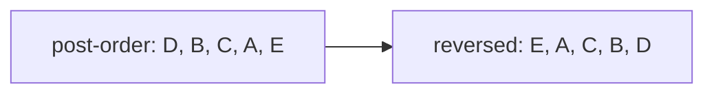

**Interviewer cue:** "in what order should these tasks/courses/builds run,
given these dependencies" is a topological sort problem. A **topological
order** of a directed acyclic graph (DAG) is a linear arrangement of its
nodes such that for every directed edge `u -> v`, `u` comes before `v` in the
ordering. It only exists when the graph has **no cycles** -- if `u`
transitively depends on itself, there's no valid order at all.

## What you'll learn

- What a DAG is, and why a topological order only exists when there's no
  cycle.
- **Kahn's algorithm**: a BFS driven by in-degree counts, which also detects
  cycles for free.
- **DFS-based topological sort**: post-order traversal, reversed.
- Why reversed post-order is a valid topological order in the first place.
- Real applications: build/dependency ordering and course scheduling.

## The cue

:::tip[You are looking at a topological sort when…]
- The problem states **dependencies, prerequisites, or ordering constraints**: "course
  `b` requires course `a`", "task X must finish before Y", "these letters appear in this
  relative order".
- You are asked for **an order in which everything can be done**, or merely **whether
  such an order exists** — the second question is cycle detection wearing a different
  hat, and it is the same algorithm.
- The input is a **directed** graph and the question is *not* about distance. If the edge
  direction did not matter, this is not a topological sort.

**The reframe:** a topological order exists **if and only if** the graph is a DAG, so
these two questions are one algorithm. Kahn's version makes the equivalence visible: if
the queue empties before every node has been emitted, whatever is left is exactly the
set of nodes trapped in or behind a cycle.

**Reach for something else** when the graph is undirected (there is no ordering to find
— you want components or a spanning tree), when you need the *shortest* schedule rather
than *a* valid one (that is longest-path-on-a-DAG, which uses the topological order as a
first step), or when constraints are equalities rather than orderings (union-find).
:::

## A DAG and one of its valid orderings

```mermaid title="A DAG and a valid topological order: every arrow points from earlier to later"
graph LR
    N0["A"] --> N1["B"]
    N0 --> N2["C"]
    N1 --> N3["D"]
    N2 --> N3
    N3 --> N4["E"]
```

`A, B, C, D, E` is a valid order here (so is `A, C, B, D, E` -- ties between
independent nodes can go either way). What's *not* valid is anything placing
`D` before `B` or `C`, since both edges point into `D`.

:::caution[A cycle means no topological order exists]
If the graph had an extra edge `E -> A`, there would be no valid ordering at
all -- `A` would need to come before `E` (via the `A -> ... -> E` chain) *and*
after it (via `E -> A`), which is a contradiction. Both algorithms below
detect this case instead of silently returning a wrong or partial answer.
:::

## Kahn's algorithm: BFS driven by in-degree

Track each node's **in-degree** (how many edges point into it). Any node
with in-degree `0` has no unfinished prerequisites, so it's safe to process
right now. Processing a node "removes" its outgoing edges, which may drop a
neighbor's in-degree to `0` and unlock it next.

```python title="kahns_topo_sort.py" showLineNumbers{1}
from collections import deque, defaultdict


def topological_sort_kahn(n, edges):
    graph = defaultdict(list)
    in_degree = [0] * n

    for u, v in edges:            # edge u -> v means "u must come before v"
        graph[u].append(v)
        in_degree[v] += 1

    queue = deque(node for node in range(n) if in_degree[node] == 0)   # no prerequisites left
    order = []

    while queue:
        node = queue.popleft()
        order.append(node)
        for neighbor in graph[node]:
            in_degree[neighbor] -= 1
            if in_degree[neighbor] == 0:   # every prerequisite of neighbor is now satisfied
                queue.append(neighbor)

    if len(order) != n:
        return None   # fewer nodes processed than exist -> a cycle blocked the rest

    return order


edges = [(0, 1), (0, 2), (1, 3), (2, 3), (3, 4)]
print("topological order:", topological_sort_kahn(5, edges))

cyclic_edges = [(0, 1), (1, 2), (2, 0)]
print("cyclic graph result:", topological_sort_kahn(3, cyclic_edges))
```

```p5 title="Kahn's algorithm processing one zero-in-degree node at a time" desc="Each tick pops the next node whose prerequisites are all satisfied, then decrements the in-degree of its neighbors -- watch a node turn gold the instant its last prerequisite finishes." height="340"
let positions = {
  0: { x: 80, y: 170 },
  1: { x: 220, y: 90 },
  2: { x: 220, y: 250 },
  3: { x: 360, y: 170 },
  4: { x: 480, y: 170 },
};

let edges = [
  { a: 0, b: 1 },
  { a: 0, b: 2 },
  { a: 1, b: 3 },
  { a: 2, b: 3 },
  { a: 3, b: 4 },
];

let processOrder = [0, 1, 2, 3, 4];

let step = 0;
let lastTime = 0;
let stepDelay = 900;

function setup() {
  createCanvas(560, 340);
}

function draw() {
  background(13, 17, 23);

  if (millis() - lastTime > stepDelay) {
    lastTime = millis();
    step = (step + 1) % (processOrder.length + 2);
  }

  let done = new Set(processOrder.slice(0, step));

  stroke(90, 98, 110);
  strokeWeight(2);
  for (let e of edges) {
    let p1 = positions[e.a], p2 = positions[e.b];
    line(p1.x, p1.y, p2.x, p2.y);
  }

  for (let id in positions) {
    let p = positions[id];
    let n = Number(id);
    if (done.has(n)) fill(75, 139, 190);                         // already processed
    else if (step < processOrder.length && n === processOrder[step]) fill(255, 211, 67);  // eligible now
    else fill(30, 36, 46);                                        // still waiting on a prerequisite

    noStroke();
    circle(p.x, p.y, 40);
    fill(230);
    textAlign(CENTER, CENTER);
    textSize(14);
    text(n, p.x, p.y);
  }

  fill(200);
  noStroke();
  textAlign(CENTER, TOP);
  textSize(13);
  text("processed so far: [" + processOrder.slice(0, step).join(", ") + "]", width / 2, 10);
}
```

## DFS-based topological sort: post-order, reversed

This reuses the exact 3-state (`WHITE` / `GRAY` / `BLACK`) cycle-detection
trick from **Depth First Search**: run a DFS from every unvisited node, and
append a node to the order only **after** every one of its neighbors has been
fully explored. Reversing that list at the end gives a valid topological
order.

```python title="dfs_topo_sort.py" showLineNumbers{1}
def topological_sort_dfs(n, edges):
    graph = {i: [] for i in range(n)}
    for u, v in edges:
        graph[u].append(v)

    WHITE, GRAY, BLACK = 0, 1, 2   # unvisited, currently exploring, fully done
    state = [WHITE] * n
    order = []

    def dfs(node):
        state[node] = GRAY
        for neighbor in graph[node]:
            if state[neighbor] == GRAY:
                return False   # back edge to a node still on the path -> cycle
            if state[neighbor] == WHITE and not dfs(neighbor):
                return False
        state[node] = BLACK
        order.append(node)   # append AFTER every descendant is fully processed
        return True

    for node in range(n):
        if state[node] == WHITE:
            if not dfs(node):
                return None

    return order[::-1]   # reverse post-order = topological order


edges = [(0, 1), (0, 2), (1, 3), (2, 3), (3, 4)]
print("topological order (DFS):", topological_sort_dfs(5, edges))

cyclic_edges = [(0, 1), (1, 2), (2, 0)]
print("cyclic graph result (DFS):", topological_sort_dfs(3, cyclic_edges))
```

## Why reversed post-order works

A node is only appended to `order` once **every** node reachable from it has
already been appended -- so in the raw `order` list, every node's
descendants appear *before* it. Reversing the list flips that, so every
node's descendants appear *after* it, and every dependency appears *before*
the thing that depends on it. That's exactly the topological property.



:::note[Wait -- doesn't that put E first?]
That example graph only has the single edge `D -> E`, so post-order finishes
`E` before `D`, giving `..., D, E` and reversed `E, D, ...` with `E` first --
which is only valid if nothing depends on `E` coming last. For the actual DAG
in this lesson (`A -> B -> D`, `A -> C -> D`, `D -> E`), tracing the code
gives post-order `E, D, B, C, A` (or `E, D, C, B, A`), reversed to
`A, C, B, D, E` (or `A, B, C, D, E`) -- both valid, matching Kahn's result.
:::

## Applications: build systems and course scheduling

- **Build/dependency ordering**: a package manager or build tool models
  "package A requires package B" as an edge `B -> A`, then topologically
  sorts to decide install/compile order. A cycle here means two packages
  depend on each other -- an unresolvable dependency loop.
- **Course scheduling**: "course B requires course A" becomes edge
  `A -> B`. Course Schedule asks *if* a valid order exists (equivalent to "no
  cycle"); Course Schedule II asks you to actually produce that order.
- **Task scheduling with prerequisites** in general -- spreadsheet cell
  recalculation order, compiler instruction scheduling, and Makefile target
  ordering all reduce to the same problem.

## Dry run

**Kahn on `edges = [(0,1), (0,2), (1,3), (2,3), (3,4)]`, `n = 5`.** In-degrees start at
`[0, 1, 1, 2, 1]`, so only node 0 is initially free.

| pop | `order` | in-degrees after decrementing | unlocked | `queue` after |
| --- | --- | --- | --- | --- |
| — | — | `[0, 1, 1, 2, 1]` | seed: node 0 | `[0]` |
| 0 | `0` | `[0, 0, 0, 2, 1]` | **1, 2** | `[1, 2]` |
| 1 | `0 1` | `[0, 0, 0, 1, 1]` | none — 3 still needs 2 | `[2]` |
| 2 | `0 1 2` | `[0, 0, 0, 0, 1]` | **3** | `[3]` |
| 3 | `0 1 2 3` | `[0, 0, 0, 0, 0]` | **4** | `[4]` |
| 4 | `0 1 2 3 4` | all zero | none | `[]` |

Five nodes emitted out of five, so the graph is a DAG and `0 1 2 3 4` is a valid order.

- **Node 3 is the interesting one.** It has in-degree 2, so node 1 releasing it is not
  enough — it becomes free only when node 2 also finishes. That is why the unlock test is
  `if in_degree[neighbor] == 0` and not "if this neighbour has been reached". Enqueueing
  on first sight would emit 3 before 2, violating the `2 → 3` constraint.
- **The order is not unique.** After popping 0 the queue holds `[1, 2]`, and either could
  go first — `0 2 1 3 4` is equally valid. If a problem demands a *specific* order (say
  lexicographically smallest), replace the deque with a heap; the algorithm is otherwise
  unchanged.
- **Nothing is ever decremented twice**, because each edge is walked exactly once when
  its source is popped. That is the $O(V + E)$ argument.

**The cyclic case — `edges = [(0,1), (1,2), (2,0)]`.** In-degrees are `[1, 1, 1]`, so the
initial queue is **empty**, the `while` loop never runs, and `order` is `[]`. Since
`0 != 3`, the function returns `None`.

That is the entire cycle detector: **`len(order) != n` means a cycle.** The nodes missing
from `order` are precisely those on a cycle or downstream of one — which is how LC 210
reports "impossible" and how a build system names the offending targets. A partial output
is diagnostic, not garbage.

## Complexity

| Algorithm | Time | Space | Cycle detection |
| --- | --- | --- | --- |
| Kahn's (BFS) | $O(V + E)$ | $O(V + E)$ | `len(order) != n` -- some nodes never reached in-degree 0 |
| DFS-based | $O(V + E)$ | $O(V)$ (recursion stack) | A `GRAY` neighbor -- a back edge to a node still on the current path |

## The variant map

| Variant | What changes | Canonical problem |
| --- | --- | --- |
| **"Can it be done at all?"** | run Kahn and compare `len(order)` with `n`; discard the order | LC 207 Course Schedule |
| **"Give me an order"** | return `order` itself | LC 210 Course Schedule II |
| **Lexicographically smallest order** | replace the deque with a **heap** — everything else is identical | LC 1462-style, contest problems |
| **Alien dictionary** | build the edges first, from adjacent word pairs, then sort. The graph construction is the hard part, not the sort | LC 269 |
| **Longest path / minimum time** | process nodes **in topological order** and relax `dp[v] = max(dp[v], dp[u] + w)`. A DAG makes longest-path easy, which it never is in a general graph | LC 2050, LC 1857 |
| **Count the orderings** | count *how many* nodes are free at each step; if the queue ever holds more than one, the order is not unique | LC 444 (Premium) |
| **Unique order?** | if the queue's size is ever above 1, several orders exist — a cheap check to bolt onto Kahn | LC 1136-style |
| **Which nodes are stuck?** | the nodes missing from `order` are exactly those on or behind a cycle | build-system diagnostics |
| **DFS flavour** | append on **exit** and reverse; detect cycles with the three-colour `GRAY` test | LC 210 |
| **Parallel schedule / levels** | process the queue level by level as in BFS; each level is a batch that can run concurrently | LC 2115, LC 1136 |

## Interview follow-ups

| They ask | What they're checking | The answer |
| --- | --- | --- |
| "When does a topological order exist?" | The core theorem | Exactly when the graph is a DAG. So "find an order" and "is there a cycle" are the same problem, and one algorithm answers both |
| "How does Kahn detect the cycle?" | Whether you understand its output | If fewer than `n` nodes are emitted, the remainder never reached in-degree 0 — they are on a cycle or downstream of one. `len(order) != n` is the whole test, and the partial order is a useful diagnostic |
| "Why enqueue on in-degree 0 rather than on first sight?" | The key invariant | Because a node may have several prerequisites. In the dry run, node 3 has in-degree 2 and must wait for *both* 1 and 2. Enqueueing on first sight emits it too early and breaks the constraint |
| "Is the order unique?" | Precision | Generally no — whenever the queue holds more than one node, any of them may go next. Watch the queue size to detect non-uniqueness, and use a heap if a specific tie-break is required |
| "Kahn or DFS?" | Judgement | Kahn is iterative (no recursion limit), gives the cycle test for free, and extends naturally to level-by-level scheduling. DFS is shorter and composes with other DFS work you may already be doing. Both are $O(V+E)$ |
| "Now find the minimum time to finish everything, with per-task durations" | Composition | Relax along edges *in topological order*: `finish[v] = max(finish[v], finish[u] + dur[v])`. The DAG order guarantees every predecessor is final before you use it — the same reason longest-path is easy on a DAG and NP-hard in general |
| "Some tasks can run in parallel" | Modelling | Process the queue one level at a time; each level is a batch with no internal dependencies, and the number of levels is the critical-path length |
| "The graph is undirected" | Boundaries | There is nothing to sort — orderings need direction. That question is about components or a spanning tree |

## Practice -- real LeetCode problems

Each exercise is the actual LeetCode problem with its real method signature and
LeetCode's own examples as the test. Write the body, press **Run**, and match the
expected output.

### LC 207 -- Course Schedule · Medium

**Problem.** Given `numCourses` and prerequisite pairs `[course, prereq]`, return
`True` if all courses can be finished.

**Constraints.** `1 <= numCourses <= 2000`, `0 <= len(prerequisites) <= 5000`, no
duplicate pairs.

**Examples.** `2, [[1,0]]` gives `True` · `2, [[1,0],[0,1]]` gives `False`

<DataCampExercise
  lang="python"
  hint={`This asks whether the prerequisite graph is acyclic. Kahn's algorithm: compute in-degrees, queue every course with in-degree 0, and repeatedly remove a course and decrement its dependents. Count how many you processed -- if it is fewer than numCourses, the remainder sits in a cycle.`}
  code={`from collections import deque, defaultdict


class Solution:
    def canFinish(self, numCourses, prerequisites):
        # TODO: Kahn's algorithm. Queue the in-degree-0 courses, process,
        # and decrement dependents. Fewer processed than numCourses means
        # a cycle.
        pass


sol = Solution()
cases = [(2, [[1, 0]]), (2, [[1, 0], [0, 1]]), (1, []),
         (3, [[1, 0], [2, 1], [0, 2]])]
print([sol.canFinish(n, p) for n, p in cases])
# expect [True, False, True, False]`}
  solution={`from collections import deque, defaultdict


class Solution:
    def canFinish(self, numCourses, prerequisites):
        adj = defaultdict(list)
        indeg = [0] * numCourses
        for course, pre in prerequisites:
            adj[pre].append(course)            # pre must come first
            indeg[course] += 1

        queue = deque(i for i in range(numCourses) if indeg[i] == 0)
        done = 0
        while queue:
            node = queue.popleft()
            done += 1
            for nxt in adj[node]:
                indeg[nxt] -= 1
                if indeg[nxt] == 0:
                    queue.append(nxt)
        return done == numCourses              # leftovers mean a cycle


sol = Solution()
cases = [(2, [[1, 0]]), (2, [[1, 0], [0, 1]]), (1, []),
         (3, [[1, 0], [2, 1], [0, 2]])]
print([sol.canFinish(n, p) for n, p in cases])`}
  sct={`test_output_contains("[True, False, True, False]")
success_msg("A count short of numCourses is exactly the cycle detection -- no separate check needed.")
`}
  height={320}
/>

<details>
<summary>Editorial</summary>

"Can all courses be finished?" is "is the prerequisite graph acyclic?". A topological
order exists precisely for a DAG.

**Time** $O(V + E)$. **Space** $O(V + E)$.

**Kahn's algorithm** is the BFS formulation: repeatedly take a node with no remaining
prerequisites. The elegance is that cycle detection is **free** -- nodes inside a cycle
never reach in-degree 0, so they are never queued, and the processed count falls short.

The edge direction is the detail to get right. `[course, pre]` means `pre` must come
first, so the edge runs `pre -> course` and `course`'s in-degree increases. Reversing
this produces a graph that is still acyclic when the original is, so simple tests pass
and ordering problems (LC 210) then fail -- worth being careful.

`(3, [[1,0],[2,1],[0,2]])` is a three-node cycle, giving `False`.

The DFS alternative uses three-colour marking, as in
[LC 802](../graph-traversal-and-connected-components/). Kahn's is usually easier to get
right and gives the order for free.

**Follow-ups:** "Return the actual order (LC 210)?" -- next problem. "Detect the cycle
itself?" -- DFS with three colours records the path. "Iterative DFS?" -- doable but
fiddlier than Kahn's. "Why is a topological order equivalent to acyclicity?" -- a cycle
has no valid first element; conversely every DAG has a node of in-degree 0.

</details>

### LC 210 -- Course Schedule II · Medium

**Problem.** Return **any** valid order in which to take all courses, or an empty
array if impossible.

**Constraints.** `1 <= numCourses <= 2000`, `0 <= len(prerequisites) <= 5000`.

**Examples.** `4, [[1,0],[2,0],[3,1],[3,2]]` gives `[0,1,2,3]` or
`[0,2,1,3]` · `2, [[1,0],[0,1]]` gives `[]`

:::note[Why this test validates rather than compares]
Several orders are usually valid, so the test checks the returned order has the right
**length** and that **every prerequisite precedes its course** -- the actual definition
of correctness.
:::

<DataCampExercise
  lang="python"
  hint={`Identical to LC 207, but record each course as you dequeue it. If the recorded order is shorter than numCourses a cycle blocked the rest, so return an empty list. The edge direction matters more here than in 207: prereq -> course, or the order comes out reversed.`}
  code={`from collections import deque, defaultdict


class Solution:
    def findOrder(self, numCourses, prerequisites):
        # TODO: Kahn's algorithm, recording the order as you dequeue.
        # Return [] if a cycle prevents a complete order.
        pass


sol = Solution()
cases = [(4, [[1, 0], [2, 0], [3, 1], [3, 2]]), (2, [[1, 0]]), (1, []),
         (2, [[1, 0], [0, 1]])]
out = []
for n, p in cases:
    order = sol.findOrder(n, p)
    if not order:
        out.append(([], True))
    else:
        pos = {c: i for i, c in enumerate(order)}
        out.append((len(order), all(pos[pre] < pos[c] for c, pre in p)))
print(out)
# expect [(4, True), (2, True), (1, True), ([], True)]`}
  solution={`from collections import deque, defaultdict


class Solution:
    def findOrder(self, numCourses, prerequisites):
        adj = defaultdict(list)
        indeg = [0] * numCourses
        for course, pre in prerequisites:
            adj[pre].append(course)            # prereq -> course
            indeg[course] += 1

        queue = deque(i for i in range(numCourses) if indeg[i] == 0)
        order = []
        while queue:
            node = queue.popleft()
            order.append(node)                 # record as you dequeue
            for nxt in adj[node]:
                indeg[nxt] -= 1
                if indeg[nxt] == 0:
                    queue.append(nxt)
        return order if len(order) == numCourses else []


sol = Solution()
cases = [(4, [[1, 0], [2, 0], [3, 1], [3, 2]]), (2, [[1, 0]]), (1, []),
         (2, [[1, 0], [0, 1]])]
out = []
for n, p in cases:
    order = sol.findOrder(n, p)
    if not order:
        out.append(([], True))
    else:
        pos = {c: i for i, c in enumerate(order)}
        out.append((len(order), all(pos[pre] < pos[c] for c, pre in p)))
print(out)`}
  sct={`test_output_contains("[(4, True), (2, True), (1, True), ([], True)]")
success_msg("Same algorithm as 207 -- record the dequeue order and you have the schedule.")
`}
  height={370}
/>

<details>
<summary>Editorial</summary>

The same Kahn's algorithm, with one line added: append each node as it is dequeued.
That sequence **is** a topological order, because a node is only dequeued once all its
prerequisites have been.

**Time** $O(V + E)$. **Space** $O(V + E)$.

The **edge direction** is where this problem punishes what LC 207 forgives. Reversing
the edges still detects cycles correctly, so LC 207 would pass -- but the emitted order
comes out reversed, and every prerequisite check fails. `[course, pre]` means the edge
runs `pre -> course`.

Using a `deque` and `popleft` gives the BFS order; a plain list with `pop()` also
produces a valid topological order, just a different one. Since any valid order is
accepted, either works -- which is why the test validates the property rather than
comparing to a fixed answer.

The DFS alternative produces the order by **reversed post-order**: append each node
after exploring all its successors, then reverse. Worth knowing, and it naturally
detects cycles with three-colour marking.

**Follow-ups:** "Lexicographically smallest order?" -- use a **heap** instead of a
queue. "All valid orders?" -- exponentially many; backtracking. "How many valid
orders?" -- counting linear extensions is #P-complete in general. "Parallel course
scheduling (LC 1136)?" -- count Kahn's *rounds* rather than nodes; each round is one
semester.

</details>

### LC 310 -- Minimum Height Trees · Medium

**Problem.** Given a tree with `n` nodes, return all root labels that produce a
**minimum-height** rooted tree.

**Constraints.** `1 <= n <= 2 * 10^4`, `edges` forms a tree.

**Examples.** `n = 4, edges = [[1,0],[1,2],[1,3]]` gives `[1]` ·
`n = 6, edges = [[3,0],[3,1],[3,2],[3,4],[5,4]]` gives `[3,4]`

<DataCampExercise
  lang="python"
  hint={`Peel leaves layer by layer, like Kahn's algorithm on an undirected tree. Start with every node of degree 1, remove them all, then find the new leaves, and repeat until at most TWO nodes remain -- those are the centroids. A tree always has exactly one or two, which is why the loop stops at 2 rather than 1. Handle n == 1 up front.`}
  code={`from collections import defaultdict


class Solution:
    def findMinHeightTrees(self, n, edges):
        # TODO: peel leaves layer by layer until at most 2 nodes remain.
        # Those survivors are the centroids. Handle n == 1 separately.
        pass


sol = Solution()
cases = [(4, [[1, 0], [1, 2], [1, 3]]),
         (6, [[3, 0], [3, 1], [3, 2], [3, 4], [5, 4]]),
         (1, []), (2, [[0, 1]])]
print([sol.findMinHeightTrees(n, e) for n, e in cases])
# expect [[1], [3, 4], [0], [0, 1]]`}
  solution={`from collections import defaultdict


class Solution:
    def findMinHeightTrees(self, n, edges):
        if n == 1:
            return [0]                          # no edges to peel
        adj = defaultdict(set)
        for a, b in edges:
            adj[a].add(b)
            adj[b].add(a)

        leaves = [i for i in range(n) if len(adj[i]) == 1]
        remaining = n
        while remaining > 2:                    # stop at 1 or 2 centroids
            remaining -= len(leaves)
            nxt_leaves = []
            for leaf in leaves:
                nb = adj[leaf].pop()            # its single neighbour
                adj[nb].discard(leaf)
                if len(adj[nb]) == 1:
                    nxt_leaves.append(nb)       # became a leaf
            leaves = nxt_leaves
        return sorted(leaves)


sol = Solution()
cases = [(4, [[1, 0], [1, 2], [1, 3]]),
         (6, [[3, 0], [3, 1], [3, 2], [3, 4], [5, 4]]),
         (1, []), (2, [[0, 1]])]
print([sol.findMinHeightTrees(n, e) for n, e in cases])`}
  sct={`test_output_contains("[[1], [3, 4], [0], [0, 1]]")
success_msg("Peeling leaves converges on the centroids -- and a tree has at most two of them.")
`}
  height={360}
/>

<details>
<summary>Editorial</summary>

The minimum-height roots are the tree's **centroids**, and the key fact is that a tree
has **exactly one or two** of them -- never more. So peel leaves inward until at most
two nodes survive.

**Time** $O(n)$ -- each node is removed once. **Space** $O(n)$.

Why peeling works: the deepest nodes in any rooted tree are leaves, so removing all
leaves reduces every node's height by exactly one and preserves which node is best. The
process is Kahn's algorithm with "degree 1" standing in for "in-degree 0".

Why **two** and not one: on a path with an even number of nodes, the two middle nodes
are equally good roots. `(2, [[0,1]])` is the minimal case, giving `[0, 1]`. Stopping
the loop at `> 1` would peel one of them away and lose an answer.

`n == 1` needs its own line: a single node has degree 0, so it is never in the initial
`leaves` list, and the loop would return an empty result.

Using `set` for the adjacency makes `discard` and `pop` clean; with lists you would
need `remove`, which is $O(\deg)$.

**Follow-ups:** "Why at most two centroids?" -- the standard proof: if three existed,
two would be adjacent to a third and one could be improved. Be ready to sketch it.
"Compute the actual minimum height?" -- count the peeling rounds. "Diameter of the
tree?" -- two BFS passes, and the centroids sit at the diameter's midpoint. "Not a
tree?" -- the argument collapses; centroids are a tree-specific notion.

</details>

## LeetCode problem set

Generated from the problem database, so each entry carries its sheet
membership and reported companies. Tick them off as you go — progress is
saved in this browser, and the Export button writes it to a file you can keep.

<ProblemLadder pattern="topological-sort"
  notes={{"207":"Does a valid order exist at all (equivalent to \"is this graph acyclic\")?","210":"Return the actual order, using either algorithm above","269":"Build the edges yourself first: compare adjacent words letter by letter to infer `letter -> letter` ordering constraints, then topologically sort the alphabet","310":"Not a direct topo sort, but solved by repeatedly peeling off leaves (nodes with in/out-degree 1) layer by layer, the same \"process degree-1 nodes, update neighbors\" shape as Kahn's","1136":"Kahn's algorithm directly, counting how many *rounds* (BFS layers) it takes to clear the whole queue"}} />

## Self-check

<Quiz
  title="Topological sort — self-check"
  questions={[
    {
      q: "When does a topological order exist?",
      options: [
        "When the graph is connected",
        "Exactly when the graph is a DAG — so 'find an order' and 'is there a cycle' are the same problem answered by one algorithm",
        "When every node has in-degree at most 1",
        "Always, for directed graphs",
      ],
      answer: 1,
      explain:
        "This equivalence is why LC 207 (can it be done?) and LC 210 (in what order?) share a solution — the first just discards the order and checks the count.",
    },
    {
      q: "In Kahn's algorithm, why enqueue a neighbour only when its in-degree reaches 0, rather than the first time you see it?",
      options: [
        "To avoid duplicates in the queue",
        "Because a node can have several prerequisites — node 3 in the dry run has in-degree 2 and must wait for both 1 and 2; enqueueing on first sight emits it before one of its prerequisites",
        "Because the queue must stay sorted",
        "It makes no difference for a DAG",
      ],
      answer: 1,
      explain:
        "Both effects are real, but correctness is the reason. In-degree is a counter of unmet prerequisites, and only zero means 'safe to run now'.",
    },
    {
      q: "Kahn's finishes with `order` containing 4 of 6 nodes. What do you conclude?",
      options: [
        "The graph is disconnected",
        "There is a cycle — and the two missing nodes are on it or downstream of it, which makes the partial output a useful diagnostic rather than garbage",
        "The algorithm has a bug",
        "The remaining nodes have in-degree 0",
      ],
      answer: 1,
      explain:
        "`len(order) != n` is the entire cycle test. Disconnected graphs are fine: every component contributes its own zero-in-degree nodes to the initial queue.",
    },
    {
      q: "Is the topological order unique?",
      options: [
        "Yes, for any DAG",
        "Generally no — whenever the queue holds more than one node, any of them may go next; watch the queue size to detect it, and use a heap if a specific tie-break is required",
        "Only if the graph is a tree",
        "Yes, if you always start from node 0",
      ],
      answer: 1,
      explain:
        "In the dry run the queue holds [1, 2] after popping 0, so 0 1 2 3 4 and 0 2 1 3 4 are both valid. Swapping the deque for a heap yields the lexicographically smallest order at O((V+E) log V).",
    },
    {
      q: "In the DFS version, why is the answer reversed post-order?",
      options: [
        "Because recursion returns in reverse",
        "Because a node finishes only after every node reachable from it has finished — so it must come before all of them, which is exactly what reversing the finish order gives you",
        "Because pre-order visits parents last",
        "To make cycle detection work",
      ],
      answer: 1,
      explain:
        "Appending on exit records finish order; the node that finishes last has nothing depending on it left to place, so it belongs first. Appending on entry instead is a plausible-looking bug that produces an invalid order.",
    },
    {
      q: "The follow-up adds per-task durations and asks for the minimum total time. What changes?",
      options: [
        "Run Dijkstra instead",
        "Relax along the edges in topological order: `finish[v] = max(finish[v], finish[u] + dur[v])` — the DAG order guarantees every predecessor is final before it is used",
        "Sum all the durations",
        "Use binary search on the answer",
      ],
      answer: 1,
      explain:
        "Longest path is NP-hard in a general graph and easy on a DAG, purely because a topological order exists. That is the single most useful thing this pattern unlocks beyond scheduling.",
    },
  ]}
/>

## Recall card

- **Cue** — dependencies, prerequisites, "must come before", or "is any order possible".
  Directed graph, no distances.
- **Exists iff DAG** — so ordering and cycle detection are one algorithm.
- **Kahn's** — count in-degrees, seed the queue with every zero, pop and decrement
  neighbours, **enqueue only when a neighbour's in-degree hits 0**.
- **Cycle test** — `len(order) != n`. The missing nodes are on or behind the cycle.
- **DFS version** — append on **exit**, then reverse; `GRAY` (in-progress) neighbour
  means a cycle.
- **Cost** — $O(V + E)$ for both. Kahn's avoids recursion limits; DFS composes with other
  DFS work.
- **Not unique** — queue size above 1 means several valid orders; a heap gives the
  lexicographically smallest.
- **Unlocks longest-path on a DAG** — relax in topological order for critical paths and
  minimum schedules.

## Recap

- A topological order only exists for a **DAG** -- a directed graph with no
  cycles.
- **Kahn's algorithm**: BFS seeded with every in-degree-0 node; a cycle
  reveals itself as `len(order) != n`.
- **DFS-based**: append each node to `order` after all its descendants are
  done, then reverse; a cycle reveals itself as a `GRAY` back edge.
- Both run in $O(V + E)$ time and both double as cycle detectors -- pick
  whichever fits the surrounding code (BFS-style queue vs. recursive DFS).

Next up in Phase 7: shortest-path algorithms (Dijkstra, Bellman-Ford) that
build directly on the weighted-graph representations, DSU, and traversal
patterns covered so far.
