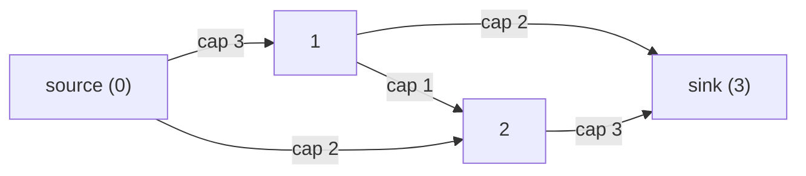
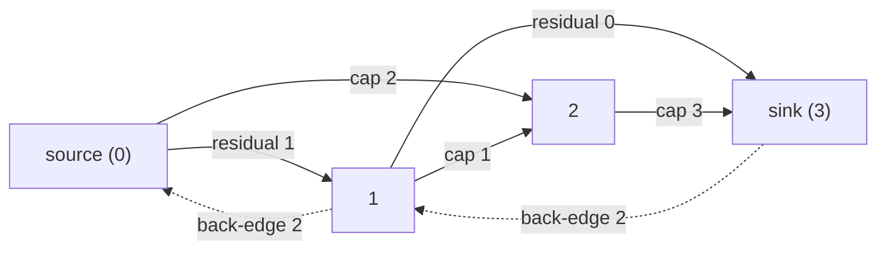

:::caution[Competitive-programming territory]
Max flow is a CP staple (network design, assignment problems, image
segmentation) but rarely appears verbatim in coding interviews -- the one
interview-adjacent exception is **bipartite matching**, covered at the end
of this page. Treat this as "know the shape and where it applies," not
"memorize under time pressure."
:::

## What you'll learn

- What a **flow network** is: a directed graph with a **source**, a
  **sink**, and a **capacity** on every edge.
- The **max-flow min-cut theorem** -- why the maximum amount you can push
  from source to sink always equals the capacity of the cheapest "cut"
  separating them.
- The **residual graph**: how "undoing" flow is modeled with back edges.
- **Ford-Fulkerson with BFS** (Edmonds-Karp) -- a runnable max-flow
  algorithm, and why using BFS specifically bounds its running time.
- Modeling **bipartite matching** as a flow problem.

## The cue

:::tip[You are looking at a flow or matching problem when...]
- The question is **"how many things can be paired up one-to-one?"** subject to a compatibility
  list -- workers to tasks, students to projects, rows to columns. That is maximum bipartite
  matching, which is max flow with unit capacities.
- Something must be **routed through a shared network with per-link limits**, and you want the
  total throughput.
- The question is **"what is the cheapest set of links to cut to disconnect A from B?"** -- that is
  min cut, and by the theorem it equals max flow.
- Greedy pairing **fails because of a conflict chain**: your obvious choice blocks a later one, and
  fixing it requires *rearranging earlier decisions*. That rerouting is exactly what residual back
  edges buy you.
- Every unit is **indivisible and capacity-1**, and the answer counts units rather than measuring
  them -- edge-disjoint paths, vertex covers on bipartite graphs, minimum path cover on a DAG.
:::

**When it is the wrong tool.** Weighted shortest path is
[Dijkstra](/dsa-with-python/phase-10-patterns-graphs/graph-traversal-and-connected-components/), not flow. Cheapest set of edges keeping *everything*
connected is a [minimum spanning tree](../minimum-spanning-trees-kruskal-and-prim/) -- MST connects,
flow routes, and they are not interchangeable. Scheduling with deadlines is usually a
[greedy or heap](/dsa-with-python/phase-07-patterns-intervals-and-greedy/merge-intervals/) problem. And if a direct greedy
provably works, use it: flow is heavy machinery, and the modelling is where the errors live.

**The honest interview framing.** Max flow essentially never appears on LeetCode by name -- the
`:::caution` at the top of this page says so. What *does* appear is a hard assignment or
scheduling question where the greedy answer is subtly wrong and matching is correct. Recognising
that shape is the transferable skill; Dinic's algorithm from memory is not.

## Flow networks

A **flow network** is a directed graph where every edge `(u, v)` has a
**capacity** -- the maximum amount of "flow" it can carry. One node is the
**source** `s` (where flow originates), another is the **sink** `t` (where
it's collected). A valid flow must respect two rules: no edge carries more
than its capacity, and every node except `s`/`t` sends out exactly as much
as it receives (**flow conservation**). The question: what's the maximum
total flow you can push from `s` to `t`?



## The residual graph

Ford-Fulkerson's core trick: whenever you push flow along an edge, add a
**back edge** in the opposite direction with capacity equal to the flow you
just pushed. That back edge represents "you can undo up to this much flow"
-- which lets a later augmenting path effectively **reroute** flow that
turned out to be a bad choice, without ever explicitly undoing anything.



The forward edges shrink by the flow pushed; the dashed back edges grow by
that same amount. An augmenting-path search treats **any** edge with
positive residual capacity -- forward or back -- as usable.

## Visual intuition

Edmonds-Karp is Ford-Fulkerson with one decision fixed: find each augmenting path by **BFS**, so the
path with the fewest edges is always chosen. That inner search is an ordinary BFS over the residual
graph:

<GraphTraversal
  client:visible
  algo="bfs"
  edges={[
    ["s", "a"],
    ["s", "b"],
    ["a", "b"],
    ["a", "t"],
    ["b", "t"],
  ]}
  start="s"
  title="Every augmenting path is one BFS over the residual graph"
  lib="Edmonds-Karp · O(V·E²)"
  desc="The only difference from this trace is that edges vanish and appear as residual capacities change between iterations. Choosing BFS rather than DFS is what bounds the number of augmentations -- shortest augmenting paths can only get longer, which gives the polynomial guarantee that plain Ford-Fulkerson lacks."
/>

## The max-flow min-cut theorem

Split the nodes into two sets `S` (containing `s`) and `T` (containing `t`).
The **cut capacity** is the sum of capacities of edges going from `S` to
`T`. The theorem:

$$
\text{max flow}(s, t) \;=\; \min_{S,\,T} \sum_{u \in S,\; v \in T} \text{cap}(u, v)
$$

In words: **the maximum flow you can push equals the smallest "choke
point" separating source from sink.** In the network above, cutting
`S = {0}` from everything else costs `3 + 2 = 5` -- and, as the code below
confirms, 5 is exactly the max flow. No cut can ever be cheaper than the
true max flow, and no flow can ever exceed the cheapest cut -- that's the
theorem's whole content.

## Ford-Fulkerson with BFS: Edmonds-Karp

"Ford-Fulkerson" is a *method* -- repeatedly find any augmenting path from
`s` to `t` in the residual graph, push the bottleneck capacity along it,
repeat until no path remains. **Edmonds-Karp** is Ford-Fulkerson with one
specific rule: always find the augmenting path using **BFS** (fewest edges
first). That single choice is what gives it a guaranteed polynomial bound.

```python title="edmonds_karp.py" showLineNumbers{1}
from collections import deque, defaultdict


def edmonds_karp(capacity, source, sink):
    graph = defaultdict(list)      # adjacency: who does each node point at (either direction)
    cap = defaultdict(int)         # residual capacity for every directed pair

    for (u, v), c in capacity.items():
        graph[u].append(v)
        graph[v].append(u)         # reverse direction exists in the residual graph too
        cap[(u, v)] += c            # cap[(v, u)] starts at 0 -- the back edge

    def bfs_augmenting_path():
        parent = {source: None}
        queue = deque([source])
        while queue:
            u = queue.popleft()
            if u == sink:
                break
            for v in graph[u]:
                if v not in parent and cap[(u, v)] > 0:
                    parent[v] = u
                    queue.append(v)
        if sink not in parent:
            return None, 0

        bottleneck = float("inf")
        v = sink
        while parent[v] is not None:
            u = parent[v]
            bottleneck = min(bottleneck, cap[(u, v)])
            v = u

        v = sink
        while parent[v] is not None:
            u = parent[v]
            cap[(u, v)] -= bottleneck   # use up forward capacity
            cap[(v, u)] += bottleneck   # grow the back edge by the same amount
            v = u

        return True, bottleneck

    max_flow = 0
    while True:
        found, bottleneck = bfs_augmenting_path()
        if not found:
            break
        max_flow += bottleneck

    return max_flow


capacity = {
    (0, 1): 3, (0, 2): 2,
    (1, 3): 2, (1, 2): 1,
    (2, 3): 3,
}
print("max flow:", edmonds_karp(capacity, source=0, sink=3))
```

:::tip[Why BFS specifically]
Using BFS (shortest augmenting path by edge count, not by capacity) bounds
the number of augmentations to $O(VE)$ -- each augmentation is guaranteed
to either saturate an edge that stays saturated for a while, or strictly
increase the shortest-path distance from `s` to some node. Plain
Ford-Fulkerson with DFS-found paths has no such bound and can, on
adversarial inputs, take arbitrarily many augmentations.
:::

## Complexity

Each BFS is $O(E)$, and Edmonds-Karp needs at most $O(VE)$ augmentations,
giving $O(V E^2)$ total. That's polynomial and safe for CP-sized graphs
(hundreds to low thousands of nodes/edges); pure Ford-Fulkerson's bound
depends on the capacities themselves and can be far worse.

## Dry run

### Edmonds-Karp on the page's network

Capacities `(0,1): 3, (0,2): 2, (1,3): 2, (1,2): 1, (2,3): 3`, source 0, sink 3.

| Iter | BFS path | Edges | Bottleneck | Flow so far | Forward residuals after |
| --- | --- | --- | --- | --- | --- |
| 1 | `0 -> 1 -> 3` | 2 | 2 | 2 | `(0,1):1 (0,2):2 (1,2):1 (2,3):3` |
| 2 | `0 -> 2 -> 3` | 2 | 2 | 4 | `(0,1):1 (1,2):1 (2,3):1` |
| 3 | `0 -> 1 -> 2 -> 3` | **3** | 1 | **5** | *(none left)* |
| 4 | no path | -- | -- | 5 | stop |

Max flow **5**. Brute-forcing all four cuts confirms the theorem:

| `S` | Cut capacity |
| --- | --- |
| `{0}` | **5** |
| `{0, 1}` | **5** |
| `{0, 1, 2}` | **5** |
| `{0, 2}` | 6 |

The minimum is 5, equal to the max flow. Note **three different cuts achieve it** -- the min cut is
not unique, and any of them is a valid answer to "where is the bottleneck?"

Two structural things the trace shows:

**Path lengths only ever grow.** Iterations 1 and 2 use 2-edge paths; iteration 3 needs 3 edges.
That monotonicity is the whole reason BFS gives a bound: the shortest augmenting distance from `s`
to `t` never decreases, and each length can persist for only $O(E)$ augmentations, giving $O(VE)$
total. It is not an accident of this input -- it is the invariant Edmonds-Karp is built on.

**Iteration 3 needed the `1 -> 2` edge that iteration 1 had no use for.** After the first two
augmentations, `0 -> 1` still has 1 unit spare and `2 -> 3` still has 1, but they are not adjacent.
The `1 -> 2` link joins them. A greedy that only ever pushed along direct source-to-sink routes
would have stopped at 4.

**What the residual graph looks like at termination**: only back edges have positive capacity --
`(1,0):3, (2,0):2, (2,1):1, (3,1):2, (3,2):3`. Every forward edge is saturated. Reading off which
nodes are still reachable from the source in that residual graph is how you *recover* the min cut,
not just its size -- here nothing is reachable, so `S = {0}`.

### Why BFS specifically, measured

The classic network: `s -> a` and `s -> b` with capacity `X`, `a -> t` and `b -> t` with capacity
`X`, and a single **capacity-1** edge `a -> b` in the middle.

| `X` | Edmonds-Karp (BFS) | Adversarial path choice |
| --- | --- | --- |
| 10 | flow 20 in **2** augmentations | flow 20 in **20** augmentations |
| 100 | flow 200 in **2** augmentations | flow 200 in **200** augmentations |
| 1000 | flow 2000 in **2** augmentations | flow 2000 in **2000** augmentations |

Both find the correct answer. But BFS takes two augmentations of `X` units each *regardless of
`X`*, while the adversarial order routes every path through the unit-capacity middle edge -- and
then back through its residual -- pushing **one unit at a time**, for exactly `2X` augmentations.
Every bottleneck in that run is 1, verified.

That is the precise statement worth carrying: plain Ford-Fulkerson's iteration count depends on the
**capacity values**, so it is $O(E \cdot \text{maxflow})$ -- exponential in the *input size*, since
a capacity of `1000` is four characters. Edmonds-Karp's $O(VE)$ bound mentions only the graph's
size. With irrational capacities, the unbounded version can fail to terminate at all.

One caveat on reproducing this: a DFS-based Ford-Fulkerson only hits the bad case if its
neighbour ordering happens to prefer the middle edge. A naive stack-based DFS on this network found
the two short paths and finished in 2 augmentations. The pathology is real but it is about the
*absence of a guarantee*, not about DFS always behaving badly -- which is exactly why BFS is
specified rather than recommended.

### Bipartite matching: the rerouting, step by step

Three workers, three tasks. Worker 0 can do tasks `{0, 1}`, worker 1 only task `{0}`, worker 2 can
do `{1, 2}`.

| Augment from | `match_right` before | What happens | Result |
| --- | --- | --- | --- |
| left 0 | `[-1, -1, -1]` | tries right 0, free | right 0 -> left 0 |
| left 1 | `[0, -1, -1]` | tries right 0, **held by left 0**; recurses -- left 0 tries right 1, free | right 1 -> left 0, **right 0 -> left 1** |
| left 2 | `[1, 0, -1]` | tries right 1 (held by left 0); left 0 retries right 0 -- already visited, fails. Backs out, tries right 2, free | right 2 -> left 2 |

Matching size **3**, assignment `match_right = [1, 0, 2]` -- task 0 to worker 1, task 1 to worker 0,
task 2 to worker 2.

**Row 2 is the augmenting path.** Worker 1's only option is already taken, so instead of giving up
the algorithm asks its current holder to move. Worker 0 has an alternative, takes it, and worker 1
gets task 0. **This is the residual back edge, in disguise** -- "undo the flow on `0 -> task0` and
push it along `0 -> task1` instead."

A greedy that assigned in order and never revisited would have stopped at 2: worker 0 takes task 0,
worker 1 finds nothing. That gap is the entire reason flow exists.

**Row 3 shows the `visited` array earning its keep.** Worker 2 probes right 1, which triggers left
0 to re-probe right 0 -- but right 0 is already in `visited` for this augmentation, so the recursion
fails rather than cycling between the two. Without per-augmentation `visited`, that is an infinite
loop.

**And the limit case:** with workers 0 and 1 both able to do only task 0, the result is size **1**
with `match_right = [0, -1]`. No amount of rerouting creates capacity that is not there -- Hall's
condition fails, and the algorithm correctly reports the smaller matching rather than looping.

## Modeling: bipartite matching as flow

Maximum bipartite matching -- pairing up left-side and right-side nodes,
one-to-one, using only compatible pairs -- is a max-flow problem in
disguise: source `->` every left node (capacity 1), every right node `->`
sink (capacity 1), and a capacity-1 edge between every compatible
`(left, right)` pair. Max flow = maximum matching size. In practice, it's
usually solved with a direct augmenting-path search (Kuhn's algorithm)
rather than building the full flow network explicitly -- same idea, less
bookkeeping:

```python title="bipartite_matching.py" showLineNumbers{1}
def max_bipartite_matching(left_n, right_n, adj):
    match_right = [-1] * right_n   # match_right[r] = which left node is matched to right node r

    def try_augment(l, visited):
        for r in adj[l]:
            if not visited[r]:
                visited[r] = True
                # if r is free, OR its current match can be rerouted elsewhere, take r
                if match_right[r] == -1 or try_augment(match_right[r], visited):
                    match_right[r] = l
                    return True
        return False

    matching_size = 0
    for l in range(left_n):
        visited = [False] * right_n
        if try_augment(l, visited):
            matching_size += 1

    return matching_size, match_right


# Left nodes 0,1,2 (e.g. workers); right nodes 0,1,2 (e.g. tasks they can do).
adj = {
    0: [0, 1],
    1: [0],
    2: [1, 2],
}
size, match_right = max_bipartite_matching(3, 3, adj)
print("max matching size:", size)
print("right -> left assignment:", match_right)
```

Each call to `try_augment` is exactly an augmenting-path search in the
residual graph of the equivalent flow network -- "if my preferred task is
taken, can its current worker be rerouted to a different task?" is the
same rerouting idea the residual graph's back edges capture above.

:::note[Flow models more than matching]
Job assignment, project selection with dependencies, image segmentation
(min-cut), and edge-disjoint path counting all reduce to a max-flow
formulation once you correctly identify the source, sink, and capacities
-- the hard part is almost always the modeling, not the Edmonds-Karp code
itself.
:::

## Practice -- real LeetCode problems

A warning before you start: LeetCode almost never wants a literal Dinic
implementation. What it asks instead are **matching and assignment** problems --
the things max flow was invented to solve -- with constraints small enough that a
bitmask DP fits. So each exercise below is graded on the DP that actually passes,
and each editorial names the flow formulation you would reach for if the
constraints grew. Knowing both, and knowing which one the constraints are asking
for, is the actual skill.

### LC 1349 -- Maximum Students Taking Exam · Hard

**Problem.** In a classroom grid, `"#"` is a broken seat and `"."` is usable. A
student can copy from the seats immediately left, right, upper-left and
upper-right of them -- but not directly in front. Return the maximum number of
students who can sit with no one able to copy from anyone.

**Constraints.** `1 <= rows, cols <= 8`.

**Examples.**
`[["#",".","#","#",".","#"],[".","#","#","#","#","."],["#",".","#","#",".","#"]]`
gives `4` · `[[".","#"],["#","#"],["#","."],["#","#"],[".","#"]]` gives `3`

<DataCampExercise
  lang="python"
  hint={`With at most 8 columns, a whole row's seating is one of 256 bitmasks -- so do DP row by row over masks. A mask is legal on its own if it uses no broken seat (cur & ~free is zero) and seats nobody side by side (cur & (cur << 1) is zero). It is compatible with the row above if prev & (cur << 1) and prev & (cur >> 1) are both zero, which is exactly the two diagonal rules. Carry the best total for each surviving mask.`}
  code={`class Solution:
    def maxStudents(self, seats):
        # TODO: DP row by row over column bitmasks.
        # Legal alone: cur & ~free == 0 and cur & (cur << 1) == 0.
        # Compatible with the row above: prev & (cur << 1) == 0 and
        # prev & (cur >> 1) == 0.
        # Keep the best running total per mask.
        pass


sol = Solution()
cases = [[["#", ".", "#", "#", ".", "#"],
          [".", "#", "#", "#", "#", "."],
          ["#", ".", "#", "#", ".", "#"]],
         [[".", "#"], ["#", "#"], ["#", "."], ["#", "#"], [".", "#"]],
         [["#", ".", ".", ".", "#"],
          [".", "#", ".", "#", "."],
          [".", ".", "#", ".", "."],
          [".", "#", ".", "#", "."],
          ["#", ".", ".", ".", "#"]],
         [["#"]],
         [["."]]]
print([sol.maxStudents([r[:] for r in g]) for g in cases])
# expect [4, 3, 10, 0, 1]`}
  solution={`class Solution:
    def maxStudents(self, seats):
        rows, cols = len(seats), len(seats[0])
        available = []
        for row in seats:
            mask = 0
            for c, ch in enumerate(row):
                if ch == ".":
                    mask |= 1 << c
            available.append(mask)

        best = {0: 0}                     # row-above mask -> best total so far
        for r in range(rows):
            new = {}
            free = available[r]
            for cur in range(1 << cols):
                if cur & ~free:
                    continue              # sitting on a broken seat
                if cur & (cur << 1):
                    continue              # two students side by side
                count = bin(cur).count("1")
                for prev, total in best.items():
                    if prev & (cur << 1) or prev & (cur >> 1):
                        continue          # a diagonal pair can copy
                    if new.get(cur, -1) < total + count:
                        new[cur] = total + count
            best = new
        return max(best.values())


sol = Solution()
cases = [[["#", ".", "#", "#", ".", "#"],
          [".", "#", "#", "#", "#", "."],
          ["#", ".", "#", "#", ".", "#"]],
         [[".", "#"], ["#", "#"], ["#", "."], ["#", "#"], [".", "#"]],
         [["#", ".", ".", ".", "#"],
          [".", "#", ".", "#", "."],
          [".", ".", "#", ".", "."],
          [".", "#", ".", "#", "."],
          ["#", ".", ".", ".", "#"]],
         [["#"]],
         [["."]]]
print([sol.maxStudents([r[:] for r in g]) for g in cases])`}
  sct={`test_output_contains("[4, 3, 10, 0, 1]")
success_msg("cur & (cur << 1) for the same row, prev & (cur << 1) for the diagonal -- two shift idioms carry the entire constraint set.")
`}
  height={560}
/>

<details>
<summary>Editorial · approach, complexity, follow-ups</summary>

**The DP.** Only the previous row can interact with the current one, so the state
is *(row, mask of the previous row)*. With `cols <= 8` there are 256 masks, and
`rows * 256 * 256` is about 500,000 operations.

The three legality tests, each one shift:

| Test | Meaning |
| --- | --- |
| `cur & ~free` | someone is on a broken seat |
| `cur & (cur << 1)` | two students are horizontally adjacent |
| `prev & (cur << 1)`, `prev & (cur >> 1)` | a student can copy diagonally |

**Why this is a flow problem underneath.** The conflict graph -- one node per
usable seat, an edge for every copying pair -- is **bipartite**: colour each seat
by the parity of its column. Every conflict, horizontal or diagonal, joins columns
`c` and `c ± 1`, so it always joins opposite parities. There is never an
odd cycle.

That matters because of **König's theorem**: in a bipartite graph, the maximum
independent set has size `V - (maximum matching)`. Seating students with no
conflicts is exactly a maximum independent set on that graph. So the answer is
also *(number of usable seats) minus (maximum bipartite matching)*, and maximum
bipartite matching is max flow with unit capacities -- Hopcroft-Karp, or plain
Hungarian augmenting paths.

Both routes are correct. The DP is $O(rows \cdot 4^{cols})$, so it lives or dies
by the column count. The flow route is $O(E\sqrt{V})$ in the seat count and does
not care how wide the room is. LeetCode caps the grid at `8 x 8`, which is a clear
vote for the DP -- but naming König's theorem is what turns a passing answer into a
strong one.

- **The diagonal rule is not symmetric with the vertical one.** Directly in front
  is explicitly allowed, so there is no `prev & cur` test. Adding one is the most
  common wrong answer.
- **A fully broken row** contributes only the mask 0, and the DP continues through
  it correctly -- `best` never becomes empty because `cur = 0` always survives.
- **`[["#"]]` gives 0.** No usable seats, and `max(best.values())` is 0 rather than
  an error, because the mask-0 entry is always there.
- **`cur & ~free`** relies on Python's arbitrary-precision two's complement. It
  works, but `cur & free != cur` says the same thing more plainly.
- **Only the previous row matters**, not all rows above. Convincing yourself of that
  is what justifies the state.

**Follow-ups you should expect:** "What if there were 30 columns?" -- $4^{30}$ is
hopeless, so switch to the matching formulation. "What if the vertical neighbour
also conflicted?" -- add `prev & cur` to the test; the graph stays bipartite by
column parity. "Knight-move conflicts?" -- still bipartite by colour, so matching
still applies. "Return the actual seating?" -- store the predecessor mask per state
and walk back. "Maximum independent set on a general graph?" -- NP-hard; the
bipartite structure here is the entire reason it is tractable.

</details>

### LC 1879 -- Minimum XOR Sum of Two Arrays · Hard

**Problem.** Given two arrays of equal length `n`, rearrange `nums2` to minimise
the XOR sum `sum(nums1[i] ^ nums2[i])`. Return that minimum.

**Constraints.** `1 <= n <= 14`, `0 <= nums1[i], nums2[i] < 10**7`.

**Examples.** `nums1 = [1,2], nums2 = [2,3]` gives `2`
(swap to `[3,2]`: `1^3 + 2^2 = 2 + 0`) ·
`nums1 = [1,0,3], nums2 = [5,3,4]` gives `8`

<DataCampExercise
  lang="python"
  hint={`This is the assignment problem, and n at most 14 is the signal to use a bitmask over which nums2 entries are already spoken for. The count of used bits tells you which nums1 index you are placing, so one number is the whole state: dp(mask) places nums1[popcount(mask)]. Try every unused j, pay nums1[i] ^ nums2[j], and recurse. Memoize.`}
  code={`class Solution:
    def minimumXORSum(self, nums1, nums2):
        # TODO: assignment problem via bitmask DP over nums2.
        # popcount(mask) is the nums1 index currently being placed.
        # Try each unused j: cost nums1[i] ^ nums2[j], then recurse.
        # Memoize on (i, mask).
        pass


sol = Solution()
cases = [([1, 2], [2, 3]), ([1, 0, 3], [5, 3, 4]), ([0], [0]),
         ([1, 2, 3], [3, 2, 1])]
print([sol.minimumXORSum(list(a), list(b)) for a, b in cases])
# expect [2, 8, 0, 0]`}
  solution={`from functools import lru_cache


class Solution:
    def minimumXORSum(self, nums1, nums2):
        n = len(nums1)

        @lru_cache(maxsize=None)
        def dp(i, mask):
            # nums1[i:] still to place; mask = which nums2 are taken
            if i == n:
                return 0
            best = float("inf")
            for j in range(n):
                if not mask & (1 << j):
                    best = min(best, (nums1[i] ^ nums2[j])
                               + dp(i + 1, mask | (1 << j)))
            return best

        result = dp(0, 0)
        dp.cache_clear()                  # do not leak state between calls
        return result


sol = Solution()
cases = [([1, 2], [2, 3]), ([1, 0, 3], [5, 3, 4]), ([0], [0]),
         ([1, 2, 3], [3, 2, 1])]
print([sol.minimumXORSum(list(a), list(b)) for a, b in cases])`}
  sct={`test_output_contains("[2, 8, 0, 0]")
success_msg("n <= 14 with a pairing to choose is the assignment problem. Bitmask DP is the interview answer; the Hungarian algorithm is the textbook one.")
`}
  height={400}
/>

<details>
<summary>Editorial · approach, complexity, follow-ups</summary>

The **assignment problem**: pair up two sets of `n` items at minimum total cost.
Brute force is $n!$ -- about 87 billion at `n = 14`. The bitmask DP is
$O(2^n \cdot n)$, roughly 230,000 states-times-transitions. That gap is why the
constraint is 14 and not 20.

**The state trick.** `i` and `mask` are redundant: you have placed exactly
`popcount(mask)` entries of `nums1`, so `i == popcount(mask)` always. Keeping both
is clearer and memoizing on the pair is harmless -- but mentioning that one number
suffices shows you have understood the structure, and it halves the memo key.

**The flow view.** This is min-cost bipartite perfect matching. Build a source
into every `nums1` node with capacity 1, an edge `i -> j` with capacity 1 and cost
`nums1[i] ^ nums2[j]`, and every `nums2` node into a sink with capacity 1. Min-cost
max-flow gives the answer, as does the **Hungarian algorithm** in $O(n^3)$ --
polynomial, and therefore the right answer if `n` were 200 instead of 14. Naming it
is worth real credit.

**Time** $O(2^n \cdot n)$. **Space** $O(2^n)$.

- **Greedy fails.** Pairing each `nums1[i]` with whichever `nums2[j]` minimises its
  own XOR is wrong: `[1,2]` with `[2,3]` greedily takes `1^3 = 2` and then is forced
  into `2^2 = 0`, which happens to be optimal, but `[1,0,3]` with `[5,3,4]` breaks
  it. A local choice steals the partner another element needed more.
- **XOR is not monotonic**, so sorting both arrays is not a valid strategy either --
  and that is the intuition most people reach for first.
- **`n = 1`** returns `nums1[0] ^ nums2[0]`, which is 0 for `[0]` and `[0]`.
- **`[1,2,3]` with `[3,2,1]`** returns 0 -- a perfect reversal pairs each with its
  equal.
- **`cache_clear()`** matters because the cache is created per call here but the
  closure captures `nums1` and `nums2`; clearing it keeps memory flat when the
  grader runs many cases.

**Follow-ups you should expect:** "`n = 200`?" -- the Hungarian algorithm, $O(n^3)$.
"Which pairing?" -- store the chosen `j` per state and walk forward. "Maximise
instead?" -- swap `min` for `max`; nothing else changes. "Unequal array lengths?" --
pad with zero-cost dummy nodes. "Minimise the *maximum* pair XOR instead of the
sum?" -- binary search the answer and test for a perfect matching using only edges
below the threshold; that is bottleneck assignment, and a genuinely different
algorithm.

</details>

### LC 1595 -- Minimum Cost to Connect Two Groups of Points · Hard

**Problem.** Two groups of sizes `m` and `n` with `m <= n`. Connecting point `i`
of group 1 to point `j` of group 2 costs `cost[i][j]`. Every point in both groups
must end up connected to at least one point in the other group. Return the minimum
total cost.

**Constraints.** `1 <= m, n <= 12`, `1 <= cost[i][j] <= 100`.

**Examples.** `cost = [[15,96],[36,2]]` gives `17` ·
`cost = [[1,3,5],[4,1,1],[1,5,3]]` gives `4` ·
`cost = [[2,5,1],[3,4,7],[8,1,2],[6,2,4],[3,8,8]]` gives `10`

<DataCampExercise
  lang="python"
  hint={`This is a COVER, not a matching -- points may have several edges, so the sizes need not match. Walk group 1 one point at a time, carrying a bitmask of which group-2 points are covered so far; each group-1 point must pick at least one partner, and picking exactly one is enough because extra edges can be added later for free. When group 1 is exhausted, every group-2 point still uncovered joins its own cheapest group-1 partner. Precompute those column minima.`}
  code={`class Solution:
    def connectTwoGroups(self, cost):
        # TODO: bitmask DP over which group-2 points are covered.
        # Precompute the cheapest group-1 partner for each group-2 point.
        # Walk group 1; each point picks one partner j and recurses.
        # At the end, add the cheapest edge for every uncovered group-2
        # point.
        pass


sol = Solution()
cases = [[[15, 96], [36, 2]],
         [[1, 3, 5], [4, 1, 1], [1, 5, 3]],
         [[2, 5, 1], [3, 4, 7], [8, 1, 2], [6, 2, 4], [3, 8, 8]],
         [[5]]]
print([sol.connectTwoGroups([r[:] for r in c]) for c in cases])
# expect [17, 4, 10, 5]`}
  solution={`from functools import lru_cache


class Solution:
    def connectTwoGroups(self, cost):
        m, n = len(cost), len(cost[0])
        # cheapest group-1 partner for each group-2 point
        cheapest = [min(cost[i][j] for i in range(m)) for j in range(n)]

        @lru_cache(maxsize=None)
        def dp(i, mask):
            if i == m:
                # every group-2 point still uncovered buys its cheapest edge
                return sum(cheapest[j] for j in range(n)
                           if not mask & (1 << j))
            best = float("inf")
            for j in range(n):
                best = min(best, cost[i][j] + dp(i + 1, mask | (1 << j)))
            return best

        result = dp(0, 0)
        dp.cache_clear()
        return result


sol = Solution()
cases = [[[15, 96], [36, 2]],
         [[1, 3, 5], [4, 1, 1], [1, 5, 3]],
         [[2, 5, 1], [3, 4, 7], [8, 1, 2], [6, 2, 4], [3, 8, 8]],
         [[5]]]
print([sol.connectTwoGroups([r[:] for r in c]) for c in cases])`}
  sct={`test_output_contains("[17, 4, 10, 5]")
success_msg("The clean argument -- one edge per group-1 point, then patch the leftovers -- is what makes a 12-by-12 cover fit in 2^12 states.")
`}
  height={440}
/>

<details>
<summary>Editorial · approach, complexity, follow-ups</summary>

The word to notice is **at least one**. This is an edge cover, not a matching: a
point may take several edges, and the two groups need not be the same size.

Two facts make the DP small, and both are worth stating as claims you can defend:

1. **One edge per group-1 point is enough while sweeping.** Giving a group-1 point
   a second edge only helps by covering some group-2 point -- and the final
   patch-up step will cover that point anyway, at a cost no higher than any
   specific choice here. So the sweep never needs to branch on multiple edges.
2. **The leftovers are independent.** Once group 1 is exhausted, each uncovered
   group-2 point may attach to whichever group-1 point it likes, with no
   interaction between them. So each simply takes its column minimum, precomputed
   once.

Together the state is *(group-1 index, covered mask)*, giving
$m \cdot 2^n$ states with $n$ transitions each.

**The flow view.** Minimum-cost edge cover on a bipartite graph is solvable in
polynomial time -- it reduces to minimum-cost perfect matching on a transformed
graph, and hence to min-cost max-flow. That is the answer for large inputs.
With `m, n <= 12`, $12 \cdot 4096 \cdot 12$ is about 590,000 operations, so the
bitmask DP wins on simplicity.

**Time** $O(m \cdot 2^n \cdot n)$. **Space** $O(m \cdot 2^n)$.

- **Greedy fails.** Giving every point its own cheapest edge double-counts and
  overshoots: on `[[1,3,5],[4,1,1],[1,5,3]]` the row minima sum to 3 but the
  answer is 4, because those choices leave a group-2 point uncovered.
- **The base case must be a sum, not zero.** Forgetting to charge the uncovered
  group-2 points is the main wrong answer, and it silently under-reports.
- **`m <= n` is promised** by the problem but the code never relies on it -- the
  sweep is over group 1 and the mask over group 2 either way.
- **`1 x 1`** returns the single cost, since both points need each other.
- **All costs are positive**, which is what makes "cover with as few edges as
  possible" the right instinct. With zero or negative costs the argument for one
  edge per point would need re-examining.

**Follow-ups you should expect:** "`n = 30`?" -- $2^{30}$ states is too many;
switch to min-cost flow. "Each point needs at least `k` connections?" -- the mask
must count, not just flag, so the state becomes base-`(k+1)` digits and grows fast.
"Maximise total cost instead?" -- the one-edge argument breaks, because extra edges
now always help; you would take every edge. "Return the connections?" -- store the
chosen `j` per state, then add the patch-up edges. "Why not just matching?" -- a
perfect matching does not exist when `m != n`, which is exactly why this is a cover.

</details>

## The variant map

| Variant | The model | Where it shows up |
| --- | --- | --- |
| **Maximum bipartite matching** | Source -> lefts (cap 1), rights -> sink (cap 1), compatible pairs (cap 1) | Worker/task assignment; Kuhn's algorithm in practice |
| **Perfect matching exists?** | Max matching size `== n` | Hall's condition questions |
| **Minimum vertex cover on a bipartite graph** | König's theorem: `min vertex cover == max matching` | "Fewest rows and columns covering all marks" |
| **Maximum independent set on a bipartite graph** | `n - max matching`, by König | Board/grid selection problems |
| **Minimum path cover of a DAG** | `nodes - max matching` on the split graph | Minimum number of chains |
| **Minimum cut / cheapest disconnection** | Max flow, then take nodes reachable from `s` in the residual graph | Network reliability, image segmentation |
| **Project selection with prerequisites** | Max-flow *closure* -- profits from the source, costs to the sink | "Maximum profit given dependencies" |
| **Vertex capacities, not edge capacities** | **Split each node** into `in`/`out` with an edge of that capacity between them | Node-disjoint path counting |
| **Edge-disjoint paths from `s` to `t`** | All capacities 1; max flow *is* the number of disjoint paths (Menger) | Routing redundancy |
| **Multiple sources or sinks** | Add a super-source and super-sink with infinite-capacity edges | Multi-depot routing |
| **Minimum-cost maximum flow** | Different algorithm (SSP / Bellman-Ford potentials), not covered here | Weighted assignment |
| **Faster max flow** | Dinic's algorithm: $O(V^2E)$ general, $O(E\sqrt{V})$ on unit capacities | Any CP problem large enough to need it |

:::note[The modelling is the problem; the algorithm is boilerplate]
Every entry above uses the *same* Edmonds-Karp code. What changes is the reduction -- where the
source and sink go, which capacities are 1 and which are infinite, and whether the limit sits on an
edge or on a node.

The two reductions worth memorising, because they turn "count something" into "run max flow":

- **Vertex capacity -> node splitting.** A node that can carry at most `c` units becomes `v_in` and
  `v_out` joined by a capacity-`c` edge, with all incoming edges landing on `v_in` and all outgoing
  leaving `v_out`. Forgetting this is the standard error on node-disjoint path problems, and it
  silently over-counts.
- **Several sources -> one super-source.** Add a node with infinite-capacity edges to every real
  source. Same for sinks. Max flow is unchanged and the code needs no modification at all.
:::

## Practice

Max flow has no canonical LeetCode problem -- but the ideas it is built from do. This ladder is the
**bipartite-structure, connectivity and union-find** problems that exercise the same reasoning:
which nodes can reach which, when a two-sided split exists, and what happens when you remove a
connection. Work these, then treat the flow machinery above as the tool you reach for when a greedy
pairing provably fails.

<ProblemLadder pattern={["cycle-detection-and-bipartite-checking", "graph-traversal-and-connected-components", "union-find-problem-patterns"]} />

## LeetCode problem set
| # | Problem | Difficulty | The twist |
| --- | --- | --- | --- |
| -- | Maximum Bipartite Matching *(classic)* | -- | The augmenting-path matching code above, usually framed as a GfG/CP-judge problem rather than a single canonical LeetCode number |

Beyond that one, max flow rarely appears by name on LeetCode -- but recognizing "this is secretly a flow/matching problem" is a real skill for harder assignment- and scheduling-style questions, where flow gives a correct answer even when a direct combinatorial argument doesn't.
## Interview follow-ups

| They ask | What they're checking | The answer |
| --- | --- | --- |
| "Why does the residual graph need back edges?" | The one idea the algorithm rests on | They let a later path **undo** an earlier commitment. In the worked network, iteration 3 uses `1 -> 2` to join spare capacity on `0 -> 1` with spare capacity on `2 -> 3`; without rerouting, a greedy stops at 4 instead of 5 |
| "Why BFS rather than DFS?" | Whether you know where the bound comes from | BFS makes the shortest augmenting-path length **monotonically non-decreasing**, which caps augmentations at $O(VE)$ -- a function of the graph only. Unrestricted Ford-Fulkerson is $O(E \cdot \text{maxflow})$: on the classic network with capacity `X` in the middle, an adversarial order takes exactly `2X` augmentations while BFS takes 2, at any `X` |
| "State max-flow min-cut" | Precision | Max flow equals the minimum cut capacity. In the worked example the max flow is 5 and **three** distinct cuts achieve 5 -- the min cut is not unique |
| "Give me the actual cut, not its size" | Whether you know the construction | Run max flow, then BFS the **residual** graph from `s`. The reachable set is `S`; the cut is every original edge from `S` to its complement. Every such edge is saturated by construction |
| "How is bipartite matching a flow problem?" | The core reduction | Source -> each left node (cap 1), each right node -> sink (cap 1), cap-1 edges for compatible pairs. Max flow equals maximum matching, because unit capacities force one-to-one. Kuhn's augmenting-path search is the same algorithm with the network left implicit |
| "The nodes have capacities, not the edges" | Whether you know node splitting | Split each node into `v_in` and `v_out` joined by an edge of that capacity; route all incoming to `v_in` and all outgoing from `v_out`. Skipping this over-counts, and it is the standard error on node-disjoint path problems |
| "There are several sources and several sinks" | A cheap reduction | Add a super-source with infinite-capacity edges to every source, and a super-sink likewise. Max flow is unchanged and the algorithm needs no edit |
| "What is the complexity, and is it good enough?" | Honest sizing | Edmonds-Karp is $O(VE^2)$ -- fine for hundreds to low thousands of nodes and edges. Dinic's is $O(V^2E)$ generally and $O(E\sqrt V)$ on unit capacities, which is what a large CP problem needs |
| "Would you write this in an interview?" | Judgement | Almost certainly not -- and saying so is the right answer. What matters is recognising that a hard assignment problem *is* matching, then either using Kuhn's (short) or explaining the reduction. Reciting Dinic's under pressure is a poor use of the time |
| "Can a greedy matching ever be optimal?" | The boundary | Sometimes, but not in general, and you cannot tell locally. If worker 0 takes the only task worker 1 can do, greedy stops one short of optimal -- verified on a three-worker example where greedy gets 2 and augmenting gets 3 |

## Self-check

<Quiz
  questions={[
    {
      q: "What do the residual graph's back edges represent?",
      options: [
        "The edges you have not yet used",
        "Permission to undo up to that much previously-pushed flow, so a later path can reroute an earlier decision",
        "The reverse direction of the original graph, for running BFS backwards",
        "A bookkeeping trick with no algorithmic meaning",
      ],
      answer: 1,
      explain:
        "Rerouting without explicit backtracking is the whole idea. In the worked network the third augmentation uses the 1 -> 2 edge to connect spare capacity on 0 -> 1 with spare capacity on 2 -> 3, lifting the flow from 4 to 5. A greedy that only pushed along direct routes would have stopped at 4 and been confidently wrong.",
    },
    {
      q: "In the traced network the augmenting paths had lengths 2, 2, then 3. Is that a coincidence?",
      options: [
        "Yes -- path lengths depend on the input order",
        "No -- with BFS the shortest augmenting-path length never decreases, and that monotonicity is what bounds the augmentation count",
        "No -- augmenting paths always get longer by exactly one each time",
        "Yes, but only for networks with fewer than five nodes",
      ],
      answer: 1,
      explain:
        "It is the invariant Edmonds-Karp is built on. Each distinct shortest-path length can persist for at most O(E) augmentations, and the length can increase at most O(V) times, giving O(VE) augmentations overall. Lengths do not have to increase every step -- two 2-edge paths came first here -- only never to shrink.",
    },
    {
      q: "On the network with s -> a, s -> b, a -> t, b -> t all at capacity 1000 and a single capacity-1 edge a -> b, how many augmentations does each approach need?",
      options: [
        "Both need 2 -- the middle edge is irrelevant",
        "BFS needs 2 at any capacity; an adversarial path order needs 2000, pushing one unit at a time",
        "BFS needs 1000, adversarial needs 2000",
        "Neither terminates",
      ],
      answer: 1,
      explain:
        "Measured at X = 10, 100 and 1000: BFS takes 2 augmentations every time, while routing each path through the unit middle edge (and then back through its residual) takes exactly 2X, with every bottleneck equal to 1. This is why the unrestricted bound is O(E x maxflow) -- exponential in the *input size*, since \"1000\" is four characters -- while Edmonds-Karp's O(VE) mentions only the graph.",
    },
    {
      q: "The traced network has max flow 5. How many cuts achieve capacity 5?",
      options: [
        "Exactly one -- the min cut is unique",
        "Three of the four possible cuts: {0}, {0,1} and {0,1,2}",
        "All four",
        "None -- the minimum cut is 6",
      ],
      answer: 1,
      explain:
        "Enumerating all four cuts gives 5, 5, 5 and 6. The theorem says max flow equals the *minimum* cut capacity; it says nothing about uniqueness. If a problem asks for \"the\" bottleneck, any minimum cut is a valid answer -- and the one you recover from the residual graph is the specific S of nodes still reachable from the source.",
    },
    {
      q: "You have the max flow value. How do you recover the actual minimum cut?",
      options: [
        "Take the saturated edges -- they are the cut",
        "BFS the residual graph from s; the reachable set is S, and the cut is every original edge from S to its complement",
        "Take the edges on the last augmenting path",
        "Enumerate all 2^V cuts and pick the cheapest",
      ],
      answer: 1,
      explain:
        "Reachability in the *residual* graph is what defines S: no residual capacity crosses out of it, so every original S-to-T edge is saturated. In the traced network nothing is reachable from 0 at termination, giving S = {0}. \"All saturated edges\" is not the answer -- a saturated edge can sit entirely inside S, contributing nothing to the cut.",
    },
    {
      q: "Why is maximum bipartite matching the same problem as max flow?",
      options: [
        "It is not -- matching needs a specialised algorithm",
        "Source -> lefts (cap 1), rights -> sink (cap 1), cap-1 edges between compatible pairs. Unit capacities force one-to-one, so max flow equals the matching size",
        "Because bipartite graphs have no cycles",
        "Because every matching is a spanning tree",
      ],
      answer: 1,
      explain:
        "The unit capacities are what encode \"one-to-one\": a left node can send at most 1, a right node can receive at most 1. Kuhn's augmenting-path search is this algorithm with the network left implicit -- \"if my preferred task is taken, can its current holder move?\" *is* an augmenting path through a residual back edge.",
    },
    {
      q: "Worker 0 can do tasks {0,1}, worker 1 only task {0}, worker 2 tasks {1,2}. Greedy in order gets what, and augmenting gets what?",
      options: [
        "Both get 3",
        "Greedy gets 2 (worker 0 takes task 0, worker 1 is stuck); augmenting gets 3 by moving worker 0 to task 1",
        "Greedy gets 3, augmenting gets 3 -- augmenting is only faster",
        "Greedy gets 1",
      ],
      answer: 1,
      explain:
        "Traced: worker 1's only option is held by worker 0, so the recursion asks worker 0 to move -- it takes task 1, worker 1 takes task 0, worker 2 takes task 2, final assignment [1, 0, 2]. A greedy that never revisits stops at 2. This one example is the reason the whole machinery exists, and it is the answer to \"can't you just be greedy?\"",
    },
    {
      q: "The nodes, not the edges, have capacity limits. What is the reduction?",
      options: [
        "Add the node capacity to every incoming edge",
        "Split each node into v_in and v_out joined by an edge of that capacity, with all incoming edges landing on v_in and all outgoing leaving v_out",
        "Run max flow, then discard paths that violate node capacities",
        "Max flow cannot model node capacities",
      ],
      answer: 1,
      explain:
        "Every path through the node must traverse the single splitting edge, so that edge's capacity enforces the node's limit exactly. Putting the limit on incoming edges does not work -- several incoming edges could each stay under their own cap while jointly exceeding the node's. Skipping the split silently over-counts, and it is the standard error on node-disjoint path problems.",
    },
  ]}
/>

## Recall card

- **Flow network** = directed graph with edge capacities, a source and a sink. Valid flow respects
  capacities and conserves flow everywhere else.
- **Residual back edges are the algorithm.** Pushing `f` along `(u,v)` adds `f` to `(v,u)`, which
  is permission to reroute later. Without them a greedy stops short -- 4 instead of 5 on the
  worked network.
- **Max-flow min-cut**: max flow == minimum cut capacity. The min cut is **not unique** (three of
  four cuts hit 5 here).
- **Recover the cut** by BFS from `s` in the *residual* graph: the reachable set is `S`. Not "the
  saturated edges" -- some sit inside `S`.
- **Edmonds-Karp = Ford-Fulkerson with BFS.** BFS makes shortest augmenting-path length
  non-decreasing, giving $O(VE)$ augmentations and $O(VE^2)$ total.
- **Why BFS matters, concretely**: on the classic unit-middle-edge network, BFS takes **2**
  augmentations at any capacity `X`; an adversarial order takes **2X**. Unrestricted
  Ford-Fulkerson is $O(E \cdot \text{maxflow})$ -- exponential in the input *size*.
- **Bipartite matching = max flow with unit capacities.** Kuhn's augmenting search is the same
  idea with the network implicit; the `visited` array per augmentation is what prevents cycling.
- **Node capacities -> split the node** into `in`/`out` with a capacity edge between. Skipping it
  over-counts.
- **Many sources/sinks -> super-source / super-sink** with infinite capacities. No code change.
- **The modelling is the hard part**, never the Edmonds-Karp code. König: bipartite min vertex
  cover == max matching; max independent set == `n - matching`.
- **You will not write Dinic's in an interview.** Recognise the matching shape, say so, write
  Kuhn's.

## Recap

- A **flow network** has a source, a sink, and capacities; a valid flow
  respects capacities and conserves flow at every other node.
- The **max-flow min-cut theorem**: max flow always equals the cheapest
  cut separating source from sink.
- The **residual graph**'s back edges are what let an algorithm reroute
  flow instead of committing to a bad early choice.
- **Edmonds-Karp** = Ford-Fulkerson with BFS-found augmenting paths,
  giving a guaranteed $O(V E^2)$ bound.
- **Bipartite matching** is max flow with unit capacities everywhere --
  many real assignment problems reduce to this same shape once you find
  the right source/sink/capacities.

That closes out the advanced-graphs phase -- between cycle detection,
SCCs/bridges, and max flow, you now have the tools for the graph problems
that go beyond plain BFS/DFS traversal.
