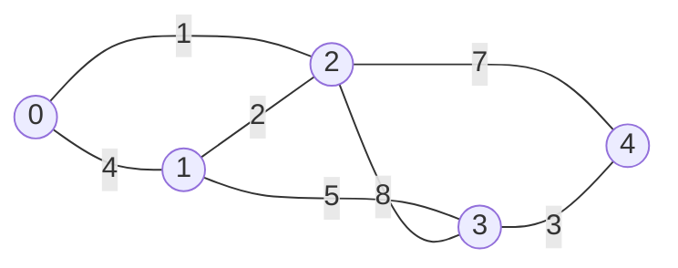

**Interviewer cue:** "connect all these points/cities/computers as cheaply as
possible" is a minimum spanning tree problem in disguise. Given a connected,
weighted, undirected graph, an MST is the subset of edges that connects every
node using the **least total weight possible**, with no cycles. There are two
classic greedy algorithms for building one -- Kruskal's and Prim's -- and both
always find the same minimum total weight.

## What you'll learn

- What a minimum spanning tree is, and why greedy works here (unlike most
  shortest-path problems).
- **Kruskal's algorithm**: sort every edge cheapest-first, then use
  Union-Find to skip any edge that would create a cycle.
- **Prim's algorithm**: grow a single tree from a start node, always adding
  the cheapest edge that reaches a brand-new node, using a min-heap.
- Time/space complexity for both, and when to reach for which.

## The cue

:::tip[You are looking at a minimum spanning tree when...]
- The goal is to **connect everything as cheaply as possible** -- wire every house, link every
  server, join every city -- and you are asked for a *total cost*, not a route between two places.
- The problem gives **points and a distance rule** and asks for the minimum cost to connect them
  all. LC 1584 (Min Cost to Connect All Points) is exactly this, with edges implied rather than
  listed.
- Some links **already exist for free** and you must add the cheapest remaining set. Those edges
  have weight 0, or you pre-union their endpoints -- LC 1135, 1489.
- The answer must be **exactly `n - 1` edges with no cycles**. That phrasing *is* a spanning tree.
- You are asked to **maximise** the minimum connection, or find the cheapest edge whose removal
  splits the network -- both are MST properties in disguise.
:::

**When it is the wrong tool.** "Shortest path from A to B" is
[Dijkstra](../../phase-10-patterns-graphs/shortest-paths-dijkstra-bellman-ford-and-floyd-warshall/):
an MST does **not** contain shortest paths, and the path between two nodes through an MST can be
arbitrarily worse than the true shortest one. "Route flow through a capacitated network" is
[max flow](../maximum-flow/) -- MST connects, flow routes. "Which nodes are connected?" needs only
[union-find](../../phase-03-core-data-structures/union-find-disjoint-set-union/) with no weights at
all. And on a **directed** graph, the analogous object is a minimum arborescence and neither
algorithm here applies -- Chu-Liu/Edmonds does.

**The one-line distinction to keep**: Dijkstra grows by *distance from the source*, Prim grows by
*distance from the tree*. The code is almost identical and the difference is exactly one term --
which is also the most common way people get this wrong.

## What is a minimum spanning tree?

Take this weighted, undirected graph -- 5 nodes, 7 edges:



A **spanning tree** connects all 5 nodes using exactly `n - 1 = 4` edges and
no cycles. Many spanning trees exist for this graph -- the **minimum**
spanning tree is the one whose edges sum to the smallest possible total:

```mermaid title="Minimum spanning tree: the cheapest 4 edges connecting all 5 nodes (total weight 11)"
graph LR
    N0((0)) ---|"1"| N2((2))
    N2 ---|"2"| N1((1))
    N1 ---|"5"| N3((3))
    N3 ---|"3"| N4((4))
```

Both algorithms below find exactly this tree, total weight `1 + 2 + 5 + 3 = 11`
-- they just build it up in different orders.

## Kruskal's algorithm: sort edges, then union-find

Kruskal's is a direct application of **Union-Find** (covered in Phase 3):
sort every edge from cheapest to most expensive, then walk the sorted list
and add an edge **only if its two endpoints are in different components** --
otherwise it would create a cycle, so skip it.

```python title="kruskal_mst.py" showLineNumbers{1}
class UnionFind:
    def __init__(self, n):
        self.parent = list(range(n))
        self.rank = [0] * n

    def find(self, x):
        if self.parent[x] != x:
            self.parent[x] = self.find(self.parent[x])   # path compression
        return self.parent[x]

    def union(self, a, b):
        root_a, root_b = self.find(a), self.find(b)
        if root_a == root_b:
            return False   # already connected -- this edge would create a cycle
        if self.rank[root_a] < self.rank[root_b]:
            root_a, root_b = root_b, root_a
        self.parent[root_b] = root_a
        if self.rank[root_a] == self.rank[root_b]:
            self.rank[root_a] += 1
        return True


def kruskal_mst(n, edges):
    # edges: list of (weight, u, v)
    uf = UnionFind(n)
    mst_edges = []
    total_weight = 0

    for weight, u, v in sorted(edges):   # cheapest edges first
        if uf.union(u, v):               # keep it only if it joins two DIFFERENT components
            mst_edges.append((u, v, weight))
            total_weight += weight

    return mst_edges, total_weight


edges = [
    (4, 0, 1), (1, 0, 2), (2, 1, 2),
    (5, 1, 3), (7, 2, 4), (8, 2, 3), (3, 3, 4),
]   # (weight, u, v)

mst_edges, total_weight = kruskal_mst(5, edges)
print("MST edges:", mst_edges)
print("total weight:", total_weight)
```

:::tip[Why greedy works for MST but not for shortest paths]
Picking the globally cheapest *remaining* edge that doesn't form a cycle is
always safe for MST -- this is the "cut property": for any split of the
nodes into two groups, the cheapest edge crossing that split must belong to
*some* minimum spanning tree. Shortest-path problems don't have this
property once negative weights are allowed, which is why Dijkstra needs
non-negative weights but Kruskal/Prim don't care about the sign at all.
:::

## Prim's algorithm: grow one tree with a heap

Prim's takes a different route to the same answer: start from any single
node, and repeatedly grow the tree by adding the **cheapest edge that leads
to a node not yet in the tree**. A min-heap (`heapq`) keeps "what's the
cheapest next step?" fast.

```python title="prim_mst.py" showLineNumbers{1}
import heapq
from collections import defaultdict


def prim_mst(n, weighted_edges, start=0):
    graph = defaultdict(list)
    for u, v, w in weighted_edges:
        graph[u].append((w, v))
        graph[v].append((w, u))   # undirected: store the edge both ways

    visited = {start}
    min_heap = graph[start][:]    # every edge leaving the start node
    heapq.heapify(min_heap)

    mst_edges = []
    total_weight = 0

    while min_heap and len(visited) < n:
        weight, node = heapq.heappop(min_heap)   # cheapest edge reaching an UNVISITED node
        if node in visited:
            continue    # stale entry -- both endpoints already joined the tree some other way
        visited.add(node)
        mst_edges.append((node, weight))
        total_weight += weight
        for next_weight, neighbor in graph[node]:
            if neighbor not in visited:
                heapq.heappush(min_heap, (next_weight, neighbor))

    return mst_edges, total_weight


weighted_edges = [
    (0, 1, 4), (0, 2, 1), (1, 2, 2),
    (1, 3, 5), (2, 4, 7), (2, 3, 8), (3, 4, 3),
]

mst_edges, total_weight = prim_mst(5, weighted_edges)
print("nodes added (node, edge weight used):", mst_edges)
print("total weight:", total_weight)
```

Notice Prim's `total_weight` comes out `11` too -- the exact same minimum, just
discovered by growing outward from one node instead of scanning every edge
globally.

```p5 title="Prim's algorithm growing the MST, one cheapest edge at a time" desc="Starting from node 0, each tick adds the cheapest edge that reaches a brand-new node -- the same greedy heap-pop step as the code above." height="340"
let positions = {
  0: { x: 100, y: 80 },
  1: { x: 300, y: 60 },
  2: { x: 200, y: 180 },
  3: { x: 380, y: 230 },
  4: { x: 220, y: 300 },
};

let allEdges = [
  { a: 0, b: 1, w: 4 },
  { a: 0, b: 2, w: 1 },
  { a: 1, b: 2, w: 2 },
  { a: 1, b: 3, w: 5 },
  { a: 2, b: 4, w: 7 },
  { a: 2, b: 3, w: 8 },
  { a: 3, b: 4, w: 3 },
];

let mstOrder = [
  { a: 0, b: 2, w: 1 },
  { a: 2, b: 1, w: 2 },
  { a: 1, b: 3, w: 5 },
  { a: 3, b: 4, w: 3 },
];

let step = 0;
let lastTime = 0;
let stepDelay = 900;

function setup() {
  createCanvas(460, 340);
}

function draw() {
  background(13, 17, 23);

  if (millis() - lastTime > stepDelay) {
    lastTime = millis();
    step = (step + 1) % (mstOrder.length + 2);
  }

  let visited = new Set([0]);
  for (let i = 0; i < step && i < mstOrder.length; i++) {
    visited.add(mstOrder[i].b);
  }

  stroke(45, 52, 64);
  strokeWeight(1.5);
  for (let e of allEdges) {
    let p1 = positions[e.a], p2 = positions[e.b];
    line(p1.x, p1.y, p2.x, p2.y);
  }

  stroke(255, 211, 67);
  strokeWeight(3);
  for (let i = 0; i < step && i < mstOrder.length; i++) {
    let e = mstOrder[i];
    let p1 = positions[e.a], p2 = positions[e.b];
    line(p1.x, p1.y, p2.x, p2.y);
  }

  for (let id in positions) {
    let p = positions[id];
    if (visited.has(Number(id))) fill(255, 211, 67);
    else fill(75, 139, 190);
    noStroke();
    circle(p.x, p.y, 34);
    fill(13, 17, 23);
    textAlign(CENTER, CENTER);
    textSize(14);
    text(id, p.x, p.y);
  }

  let weightSoFar = 0;
  for (let i = 0; i < step && i < mstOrder.length; i++) weightSoFar += mstOrder[i].w;

  fill(200);
  noStroke();
  textAlign(CENTER, TOP);
  textSize(13);
  text("MST weight so far: " + weightSoFar, width / 2, 10);
}
```

## Dry run

The graph: 5 nodes, 7 edges, weights `(0,1):4 (0,2):1 (1,2):2 (1,3):5 (2,4):7 (2,3):8 (3,4):3`.
Brute-forcing all $\binom{7}{4}$ edge subsets finds **21** valid spanning trees with weights from
**11** to **24** -- so the greedy has real work to do, and 11 is the target.

### Kruskal: sort, then union

| Edge | Weight | Roots before | Kept? | Total | Components after |
| --- | --- | --- | --- | --- | --- |
| `(0,2)` | 1 | `(0, 2)` | **keep** | 1 | `{0,2} {1} {3} {4}` |
| `(1,2)` | 2 | `(1, 0)` | **keep** | 3 | `{0,1,2} {3} {4}` |
| `(3,4)` | 3 | `(3, 4)` | **keep** | 6 | `{0,1,2} {3,4}` |
| `(0,1)` | 4 | `(0, 0)` | skip -- cycle | 6 | `{0,1,2} {3,4}` |
| `(1,3)` | 5 | `(0, 3)` | **keep** | **11** | `{0,1,2,3,4}` |
| `(2,4)` | 7 | `(0, 0)` | skip -- cycle | 11 | one component |
| `(2,3)` | 8 | `(0, 0)` | skip -- cycle | 11 | one component |

MST `[(0,2,1), (1,2,2), (3,4,3), (1,3,5)]`, total **11**, matching brute force.

**The roots column is the entire cycle test.** Equal roots mean the two endpoints are already
connected, so this edge closes a cycle and is discarded. `find` returning the same value is a
cheaper test than any search for a path between them -- that is what union-find buys.

**Row 3 is the interesting one.** Kruskal adds `(3,4)` while `{3,4}` is still completely
disconnected from `{0,1,2}`. Kruskal grows a **forest**, not a tree, and only merges the pieces at
the end. Prim cannot do this -- it always has exactly one connected tree.

**Kruskal keeps scanning after the tree is complete.** Rows 6 and 7 do work that changes nothing.
The standard early exit is to stop once `len(mst_edges) == n - 1`, which on a dense graph saves the
tail of the sorted list -- though not the sort itself, which is the dominant cost.

### Prim: grow one tree from node 0

Heap entries are `(weight, node)`; the stale-entry check is the line to watch.

| Step | Pop | Action | Total | Pushed | Heap after |
| --- | --- | --- | --- | --- | --- |
| 1 | `(0, 0)` | add node 0 | 0 | `(1,2) (4,1)` | `(1,2) (4,1)` |
| 2 | `(1, 2)` | add node 2 | 1 | `(2,1) (7,4) (8,3)` | `(2,1) (4,1) (7,4) (8,3)` |
| 3 | `(2, 1)` | add node 1 | 3 | `(5,3)` | `(4,1) (5,3) (7,4) (8,3)` |
| 4 | `(4, 1)` | **stale -- node 1 already in tree, discard** | 3 | -- | `(5,3) (7,4) (8,3)` |
| 5 | `(5, 3)` | add node 3 | 8 | `(3,4)` | `(3,4) (7,4) (8,3)` |
| 6 | `(3, 4)` | add node 4 | **11** | -- | `(7,4) (8,3)` |
| 7 | `(7, 4)` | **stale, discard** | 11 | -- | `(8,3)` |
| 8 | `(8, 3)` | **stale, discard** | 11 | -- | `[]` |

Tree `[(0,2,1), (2,1,2), (1,3,5), (3,4,3)]`, total **11** -- and on this graph the edge *set* is
identical to Kruskal's, verified. Both algorithms find `{0-2, 1-2, 1-3, 3-4}`. They agree here
because every weight is distinct; with ties they can legitimately differ.

**Steps 4, 7 and 8 are all stale pops** -- three of the eight pops did nothing but discard. That is
not waste to be optimised away, it is how *lazy* Prim works: `heapq` cannot decrease-key, so instead
of updating an existing entry you push a new, cheaper one and let the old one surface later and get
thrown out. The `if u in visited: continue` line is what makes that correct.

**Counting the pushes: 8 for a graph with `V = 5` and `E = 7`.** Pushes scale with `E`, not `V`,
because every edge out of a newly-added node gets pushed. That is why the bound is $O(E \log V)$ and
why the heap can hold more than `V` entries at once -- and why omitting the `visited` check does not
just slow it down, it adds nodes twice and produces a wrong total.

**Step 4 is also where Prim differs from Dijkstra in one term.** The pushed weight is `w2`, the raw
edge weight -- the cost of joining the tree. Dijkstra would push `dist[u] + w2`, the cost from the
source. Write the accumulated version here and you get shortest paths from node 0, not an MST, and
on this graph the total would be wrong.

### Both algorithms fail the same way on a disconnected graph

4 nodes, edges only `(0,1)` and `(2,3)`:

| Algorithm | Result |
| --- | --- |
| Kruskal | returns **2** edges, not `n - 1 = 3`; 2 components remain |
| Prim from node 0 | reaches only `{0, 1}` of 4 nodes, weight 1 |

**Neither raises.** Kruskal quietly returns a minimum spanning *forest*; Prim quietly returns the
MST of the start node's component. Both look like successful runs. The checks are
`len(mst_edges) == n - 1` for Kruskal and `len(visited) == n` for Prim, and LC 1135 ("return -1 if
it is impossible") exists specifically to catch whether you wrote one of them.

### When the MST is not unique

A triangle with all three edges weight 1: every pair of edges is a spanning tree of weight 2, so
**all three** spanning trees are minimum. Kruskal returns `{(0,1), (0,2)}` -- determined purely by
the sort's tie-breaking.

So "the MST" is a slight lie whenever weights repeat. The *weight* is unique; the edge set is not.
If a problem asks for the tree rather than the cost, either the weights are distinct or any
minimum tree is acceptable -- worth a sentence out loud rather than an assumption.

## Complexity

| Algorithm | Time | Space | Grows from |
| --- | --- | --- | --- |
| Kruskal | $O(E \log E)$ (sorting dominates; Union-Find adds a near-$O(1)$ $\alpha(n)$ factor) | $O(V + E)$ | The globally cheapest remaining edge, anywhere in the graph |
| Prim (binary heap) | $O(E \log V)$ | $O(V + E)$ | A single growing tree, one node at a time |

## Kruskal vs. Prim: which one to reach for

- **Kruskal** is simplest when the input already arrives as an **edge list**
  (a flat list of `[u, v, weight]` triples, which is exactly how most
  LeetCode MST problems hand you the graph) and the graph is **sparse**
  ($E$ close to $V$) -- sorting $E$ edges is cheap.
- **Prim** wins when the graph is **dense** ($E$ close to $V^2$, e.g. "every
  pair of points has an edge" problems like Min Cost to Connect All Points)
  and you already have -- or can cheaply build -- an adjacency list, since it
  never needs to look at every edge up front.
- Both always produce a spanning tree of the **same minimum total weight**
  (though the exact edges chosen can differ if multiple edges share a
  weight) -- pick based on the input shape and graph density, not
  correctness.

:::note[No Union-Find shortcut for Prim, no heap needed for Kruskal]
The two algorithms use genuinely different machinery -- Kruskal needs
Union-Find to detect cycles across the *whole* edge set; Prim needs a
min-heap to always know the cheapest way to extend *one* tree. Mixing them
up (e.g. trying to run Prim without a heap) turns an $O(E \log V)$ algorithm
into an $O(V^2)$ one -- still correct, just slower on sparse graphs.
:::

## The variant map

| Variant | The change | Canonical problem |
| --- | --- | --- |
| **Explicit edge list** | Kruskal directly | 1135 Connecting Cities With Minimum Cost |
| **Implicit complete graph from points** | Generate all $\binom{n}{2}$ edges, or run **dense Prim** in $O(n^2)$ without a heap | 1584 Min Cost to Connect All Points |
| **Some edges already built** | Give them weight 0, or pre-`union` their endpoints before starting | 1489 · 1697 |
| **Must include certain edges** | Union them first, then run Kruskal on the rest | constrained MST |
| **Detect impossibility** | Kruskal: `len(mst) != n - 1` · Prim: `len(visited) != n` -> return `-1` | 1135 |
| **Critical and pseudo-critical edges** | Compute the MST weight, then re-run *excluding* each edge (critical if the weight rises) and *forcing* each edge (pseudo-critical if the weight is unchanged) | 1489 |
| **Maximum spanning tree** | Negate the weights, or sort descending | reliability / bandwidth problems |
| **Minimax path (bottleneck shortest path)** | The MST path between two nodes **minimises the maximum edge** on it -- so build the MST and walk it | 1102 Path With Maximum Minimum Value |
| **Second-best MST** | For each MST edge, remove it and re-run; take the cheapest result | CP |
| **Cluster into `k` groups** | Stop Kruskal after `n - k` edges -- single-linkage clustering | -- |
| **Directed graph** | Not an MST at all -- minimum arborescence, Chu-Liu/Edmonds | CP only |

:::note[The minimax property is the non-obvious payoff]
The path between `u` and `v` **through the MST** minimises the largest edge weight along it, over
all `u`-`v` paths in the graph. That is a stronger statement than it looks, and it is what makes
MSTs the answer to "get from A to B without ever crossing a link heavier than necessary" -- LC 1102,
and the whole family of "maximise the minimum" connectivity problems.

The MST does **not** minimise total path length, though. Those are different objectives, and
conflating them is the standard MST-versus-Dijkstra error.
:::

## Pitfalls

- **Using an MST to answer shortest-path questions.** The MST minimises *total edge weight of the
  whole tree*, not the distance between any particular pair. The `u`-`v` path through an MST can be
  arbitrarily longer than the true shortest path. Different objective, different algorithm.
- **Pushing `dist + w` in Prim.** Prim grows by distance *from the tree*, so the heap key is the raw
  edge weight `w`. Dijkstra grows by distance *from the source*, so its key is `dist[u] + w`. The two
  loops are nearly identical and this single term is the difference -- with an accumulated key you
  compute a shortest-path tree and report the wrong total.
- **Forgetting the `visited` check in lazy Prim.** `heapq` has no decrease-key, so stale entries are
  normal -- three of eight pops on the traced graph. Without `if u in visited: continue`, nodes get
  added twice and the total is wrong.
- **Assuming the heap holds at most `V` entries.** Pushes scale with `E`: 8 pushes for `V = 5`,
  `E = 7`. The bound is $O(E \log V)$, and $O(E)$ space.
- **Not detecting a disconnected graph.** Kruskal silently returns a spanning *forest*; Prim
  silently returns one component's MST. Verified on 4 nodes with edges `(0,1)` and `(2,3)`: Kruskal
  returns 2 edges instead of 3, Prim reaches 2 nodes of 4, and neither raises. Check
  `len(mst_edges) == n - 1` or `len(visited) == n`.
- **Treating "the MST" as unique.** With repeated weights it is not -- a triangle of equal weights
  has three distinct minimum spanning trees. The total weight is unique; the edge set is not.
- **Running heap-Prim on a dense graph.** For a complete graph from `n` points, $E = \Theta(n^2)$, so
  heap-Prim is $O(n^2 \log n)$ while the plain $O(n^2)$ array version -- scan for the nearest
  unvisited node each round, no heap -- is strictly better. LC 1584 is exactly this shape.
- **Sorting inside the loop.** Kruskal sorts **once**, up front. The sort is the dominant term,
  $O(E \log E)$, and union-find's near-constant cost is why the total is not worse.
- **Forgetting path compression or union by rank.** Without both, `find` degrades toward $O(n)$ and
  Kruskal's near-linear post-sort phase becomes the bottleneck instead of a footnote.
- **Applying either algorithm to a directed graph.** Neither works. The directed analogue is a
  minimum arborescence and needs Chu-Liu/Edmonds -- worth naming, not worth writing.

## Practice -- real LeetCode problems

Prim on a dense implicit graph, Kruskal used as an **offline query** engine, and
then the classification of every edge as critical or merely optional. The third is
the one that proves you understand what an MST actually is.

### LC 1584 -- Min Cost to Connect All Points · Medium

**Problem.** Given points on a plane, the cost of connecting two points is their
Manhattan distance. Return the minimum cost to connect all points so that there is
exactly one simple path between any two.

**Constraints.** `1 <= len(points) <= 1000`,
`-10**6 <= xi, yi <= 10**6`, all points distinct.

**Examples.** `[[0,0],[2,2],[3,10],[5,2],[7,0]]` gives `20` ·
`[[3,12],[-2,5],[-4,1]]` gives `18` · `[[0,0]]` gives `0`

<DataCampExercise
  lang="python"
  hint={`Every pair of points is connected, so the graph is complete with n*(n-1)/2 edges -- about half a million here. Prefer Prim: grow one tree, and each time you add a point, relax the cheapest-known distance to every point still outside. Keep a best array of those distances so a stale heap entry can be skipped when popped, and never materialise the edge list.`}
  code={`class Solution:
    def minCostConnectPoints(self, points):
        # TODO: Prim's algorithm on the implicit complete graph.
        # Track the cheapest known distance into each point, add the
        # closest outside point each round, then relax from it.
        # Manhattan distance = abs(dx) + abs(dy). Skip stale heap pops.
        pass


sol = Solution()
cases = [[[0, 0], [2, 2], [3, 10], [5, 2], [7, 0]], [[3, 12], [-2, 5], [-4, 1]],
         [[0, 0]], [[0, 0], [1, 1]]]
print([sol.minCostConnectPoints([p[:] for p in c]) for c in cases])
# expect [20, 18, 0, 2]`}
  solution={`import heapq


class Solution:
    def minCostConnectPoints(self, points):
        n = len(points)
        best = [float("inf")] * n         # cheapest edge into each point
        best[0] = 0
        in_tree = [False] * n
        total = 0
        heap = [(0, 0)]

        while heap:
            cost, u = heapq.heappop(heap)
            if in_tree[u]:
                continue                  # stale entry -- already absorbed
            in_tree[u] = True
            total += cost

            ux, uy = points[u]
            for v in range(n):            # relax against every outside point
                if not in_tree[v]:
                    d = abs(ux - points[v][0]) + abs(uy - points[v][1])
                    if d < best[v]:
                        best[v] = d
                        heapq.heappush(heap, (d, v))
        return total


sol = Solution()
cases = [[[0, 0], [2, 2], [3, 10], [5, 2], [7, 0]], [[3, 12], [-2, 5], [-4, 1]],
         [[0, 0]], [[0, 0], [1, 1]]]
print([sol.minCostConnectPoints([p[:] for p in c]) for c in cases])`}
  sct={`test_output_contains("[20, 18, 0, 2]")
success_msg("Dense graph, so Prim without building the edge list. Recognising density from the constraints is the decision being tested.")
`}
  height={460}
/>

<details>
<summary>Editorial · approach, complexity, follow-ups</summary>

An MST question in disguise -- *"exactly one simple path between any two points"*
is the definition of a spanning tree, and minimum cost makes it minimum.

**Which algorithm, and why.** The graph is **complete**: $n = 1000$ means about
$5 \times 10^5$ edges. Kruskal would sort all of them, $O(n^2 \log n)$, which
passes but is wasteful. Prim relaxes lazily and never materialises the list. This
is the standard dense-versus-sparse call, and it is what the problem is really
asking you to make.

**Time** $O(n^2 \log n)$ as written, from the heap. The classic $O(n^2)$ dense-Prim
-- scan the `best` array for its minimum each round instead of using a heap -- is
actually faster here and worth naming. **Space** $O(n)$.

- **Add the cost when you *pop*, not when you push.** Pushed entries are candidates;
  popped-and-not-stale ones are real tree edges.
- **The stale check `if in_tree[u]: continue`** is mandatory with a lazy heap,
  because a point can be pushed several times at decreasing costs.
- **A single point costs 0** and the loop adds one zero. **Two points** cost their
  distance.
- **Manhattan, not Euclidean.** No square roots, so everything stays integral and
  exact.
- **`best[0] = 0`** seeds the tree at point 0; any start gives the same total, which
  is worth saying -- MST weight is independent of the root.

**Follow-ups you should expect:** "Euclidean distance instead?" -- the same
algorithm, and for points on a plane the MST is a subgraph of the Delaunay
triangulation, which gets you to $O(n \log n)$. "$n = 10^5$?" -- $O(n^2)$ is out;
you need that geometric structure, or the Manhattan-MST sweep that keeps only
$O(n)$ candidate edges. "Which edges?" -- record the predecessor whenever you
improve `best[v]`. "Second-best MST?" -- for each tree edge, forbid it and rerun, or
use the max-edge-on-path trick. "Some points already connected?" -- seed the DSU or
mark them all in-tree at cost 0.

</details>

### LC 1697 -- Checking Existence of Edge Length Limited Paths · Hard

**Problem.** Given an undirected weighted graph and queries `[p, q, limit]`,
answer for each query whether there is a path from `p` to `q` using only edges of
weight **strictly less than** `limit`.

**Constraints.** `2 <= n <= 10**5`, `1 <= len(edgeList), len(queries) <= 10**5`,
multiple edges between the same pair are possible.

**Examples.** `n = 3`, `edgeList = [[0,1,2],[1,2,4],[2,0,8],[1,0,16]]`,
`queries = [[0,1,2],[0,2,5]]` gives `[false,true]`

<DataCampExercise
  lang="python"
  hint={`Answer the queries OFFLINE. Sort the edges by weight and sort the query indices by their limit. Then sweep: for each query in increasing limit order, union in every edge whose weight is below that limit, and answer by testing whether p and q now share a root. Because both sequences ascend, each edge is unioned at most once across all queries. Keep the original query index so the answers go back in the right slots.`}
  code={`class Solution:
    def distanceLimitedPathsExist(self, n, edgeList, queries):
        # TODO: offline + union-find.
        # Sort edges by weight; sort QUERY INDICES by limit.
        # Sweep the limits upward, unioning every edge below the current
        # limit, then test connectivity. Write answers back by index.
        pass


sol = Solution()
cases = [(3, [[0, 1, 2], [1, 2, 4], [2, 0, 8], [1, 0, 16]], [[0, 1, 2], [0, 2, 5]]),
         (5, [[0, 1, 10], [1, 2, 5], [2, 3, 9], [3, 4, 13]], [[0, 4, 14], [1, 4, 13]]),
         (2, [[0, 1, 5]], [[0, 1, 5], [0, 1, 6]])]
print([sol.distanceLimitedPathsExist(n, [e[:] for e in el], [q[:] for q in qs])
       for n, el, qs in cases])
# expect [[False, True], [True, False], [False, True]]`}
  solution={`class DSU:
    def __init__(self, n):
        self.parent = list(range(n))
        self.rank = [0] * n

    def find(self, x):
        while self.parent[x] != x:
            self.parent[x] = self.parent[self.parent[x]]   # path halving
            x = self.parent[x]
        return x

    def union(self, a, b):
        ra, rb = self.find(a), self.find(b)
        if ra == rb:
            return False
        if self.rank[ra] < self.rank[rb]:
            ra, rb = rb, ra
        self.parent[rb] = ra
        if self.rank[ra] == self.rank[rb]:
            self.rank[ra] += 1
        return True


class Solution:
    def distanceLimitedPathsExist(self, n, edgeList, queries):
        edgeList.sort(key=lambda e: e[2])
        # sort query POSITIONS so answers can be written back in order
        order = sorted(range(len(queries)), key=lambda i: queries[i][2])

        dsu = DSU(n)
        answer = [False] * len(queries)
        e = 0
        for qi in order:
            p, q, limit = queries[qi]
            while e < len(edgeList) and edgeList[e][2] < limit:
                dsu.union(edgeList[e][0], edgeList[e][1])
                e += 1                    # never revisited
            answer[qi] = dsu.find(p) == dsu.find(q)
        return answer


sol = Solution()
cases = [(3, [[0, 1, 2], [1, 2, 4], [2, 0, 8], [1, 0, 16]], [[0, 1, 2], [0, 2, 5]]),
         (5, [[0, 1, 10], [1, 2, 5], [2, 3, 9], [3, 4, 13]], [[0, 4, 14], [1, 4, 13]]),
         (2, [[0, 1, 5]], [[0, 1, 5], [0, 1, 6]])]
print([sol.distanceLimitedPathsExist(n, [e[:] for e in el], [q[:] for q in qs])
       for n, el, qs in cases])`}
  sct={`test_output_contains("[[False, True], [True, False], [False, True]]")
success_msg("Reordering the queries is the whole technique. Remember it -- 'offline plus union-find' answers a surprising number of Hards.")
`}
  height={520}
/>

<details>
<summary>Editorial · approach, complexity, follow-ups</summary>

The technique is **offline query processing**: nothing says you must answer queries
in the order given, so sort them into the order that makes the work monotone.

Union-find can add edges but never remove them. Processing limits in ascending
order means the edge set only ever grows, which is exactly what the structure
supports. Each edge is unioned once in total, not once per query -- that is where
the efficiency comes from.

**Time** $O(E \log E + Q \log Q + (E + Q) \alpha(n))$. **Space** $O(n + Q)$.

- **Strictly less than the limit.** `edgeList[e][2] < limit`, not `<=`. The third
  test case -- one edge of weight 5, with limits 5 and 6 -- exists only to catch
  this, and it is the single most common wrong submission.
- **Sort the indices, not the queries.** If you sort the query list itself you lose
  the mapping back to output positions. Sorting `range(len(queries))` by limit keeps
  it.
- **`e` is never reset.** It is a single monotone pointer across the whole sweep.
  Resetting it inside the loop turns the solution quadratic.
- **Duplicate edges** between the same pair are explicitly allowed; the second union
  is a harmless no-op.
- **Disconnected graphs** are fine -- `find(p) != find(q)` simply reports `False`.

**Follow-ups you should expect:** "Online, answering each query as it arrives?" --
build a maximum-spanning-tree-style structure and answer with the **minimax path**
weight: binary lifting on the MST, or a Kruskal reconstruction tree, both giving
$O(\log n)$ per query. That is the real answer to "what if you cannot reorder", and
it is the follow-up that separates candidates. "Weight *at most* the limit?" --
change the comparison to `<=`. "Minimise the maximum edge on a path (LC 1631)?" --
the same minimax-path idea. "Edges being added and removed?" -- offline dynamic
connectivity, considerably harder.

</details>

### LC 1489 -- Find Critical and Pseudo-Critical Edges in MST · Hard

**Problem.** Given a weighted undirected graph, find all **critical** edges (in
every MST) and all **pseudo-critical** edges (in at least one MST but not all).
Return `[critical, pseudo_critical]` as lists of edge indices.

**Constraints.** `2 <= n <= 100`, `1 <= len(edges) <= min(200, n*(n-1)/2)`,
`1 <= weight <= 1000`, no repeated edges.

**Examples.** `n = 5`,
`edges = [[0,1,1],[1,2,1],[2,3,2],[0,3,2],[0,4,3],[3,4,3],[1,4,6]]` gives
`[[0,1],[2,3,4,5]]` · a 4-cycle of equal weights gives `[[],[0,1,2,3]]`

<DataCampExercise
  lang="python"
  hint={`Compute the MST weight once as a baseline. Then test each edge twice. Exclude it and recompute: if the best possible weight goes UP (or the graph stops being connectable), the edge is critical. Otherwise force it in first and recompute: if the total still equals the baseline, it is pseudo-critical. Keep the original index alongside each edge, because you must sort by weight but report by input position.`}
  code={`class Solution:
    def findCriticalAndPseudoCriticalEdges(self, n, edges):
        # TODO: baseline = MST weight.
        # For each edge: exclude it and recompute -- weight goes up (or the
        # graph cannot be spanned) means CRITICAL.
        # Otherwise force it in first -- still equal to baseline means
        # PSEUDO-CRITICAL.
        # Carry the original index; sort by weight, report by index.
        pass


sol = Solution()
cases = [(5, [[0, 1, 1], [1, 2, 1], [2, 3, 2], [0, 3, 2], [0, 4, 3], [3, 4, 3],
              [1, 4, 6]]),
         (4, [[0, 1, 1], [1, 2, 1], [2, 3, 1], [0, 3, 1]])]
print([sol.findCriticalAndPseudoCriticalEdges(n, [e[:] for e in el])
       for n, el in cases])
# expect [[[0, 1], [2, 3, 4, 5]], [[], [0, 1, 2, 3]]]`}
  solution={`class DSU:
    def __init__(self, n):
        self.parent = list(range(n))

    def find(self, x):
        while self.parent[x] != x:
            self.parent[x] = self.parent[self.parent[x]]
            x = self.parent[x]
        return x

    def union(self, a, b):
        ra, rb = self.find(a), self.find(b)
        if ra == rb:
            return False
        self.parent[rb] = ra
        return True


class Solution:
    def findCriticalAndPseudoCriticalEdges(self, n, edges):
        # keep the input position, then sort by weight
        indexed = sorted((w, u, v, i) for i, (u, v, w) in enumerate(edges))

        def mst_weight(skip=-1, force=-1):
            dsu = DSU(n)
            total, used = 0, 0
            if force >= 0:
                w, u, v, _ = indexed[force]
                dsu.union(u, v)
                total, used = w, 1
            for j, (w, u, v, _) in enumerate(indexed):
                if j == skip or j == force:
                    continue
                if dsu.union(u, v):
                    total += w
                    used += 1
            # not spanning -> treat as unreachable
            return total if used == n - 1 else float("inf")

        base = mst_weight()
        critical, pseudo = [], []
        for j in range(len(indexed)):
            position = indexed[j][3]
            if mst_weight(skip=j) > base:
                critical.append(position)
            elif mst_weight(force=j) == base:
                pseudo.append(position)
        return [sorted(critical), sorted(pseudo)]


sol = Solution()
cases = [(5, [[0, 1, 1], [1, 2, 1], [2, 3, 2], [0, 3, 2], [0, 4, 3], [3, 4, 3],
              [1, 4, 6]]),
         (4, [[0, 1, 1], [1, 2, 1], [2, 3, 1], [0, 3, 1]])]
print([sol.findCriticalAndPseudoCriticalEdges(n, [e[:] for e in el])
       for n, el in cases])`}
  sct={`test_output_contains("[[[0, 1], [2, 3, 4, 5]], [[], [0, 1, 2, 3]]]")
success_msg("Two definitions, two experiments: forbid the edge, then force it. Small constraints are the licence to brute-force this way.")
`}
  height={560}
/>

<details>
<summary>Editorial · approach, complexity, follow-ups</summary>

Read the definitions as **experiments you can run**, and the solution writes
itself:

- **Critical** = in every MST = removing it makes the best achievable weight worse
  (or disconnects the graph entirely).
- **Pseudo-critical** = in some MST = forcing it in still achieves the baseline
  weight, and it is not critical.

The `n <= 100`, `edges <= 200` constraints are the permission slip: two extra
Kruskal runs per edge is at most 400 runs of a near-linear algorithm.

**Time** $O(E^2 \alpha(n))$ -- about $200 \times 400$ union operations. **Space**
$O(n + E)$.

- **Carry the original index.** You must sort by weight for Kruskal but report by
  input position. Losing the index is the most common way to get this wrong, and
  the sorted-tuple trick `(w, u, v, i)` handles it in one line.
- **Disconnection must count as worse**, hence returning infinity when fewer than
  `n - 1` edges were used. Without that, removing a bridge looks free and the edge
  is misclassified.
- **Every edge is critical or pseudo-critical or neither.** The `elif` matters: an
  edge already found critical must not also be listed as pseudo-critical.
- **All-equal weights on a cycle** make nothing critical and everything
  pseudo-critical -- that is the second test case, and a good sanity check on the
  `elif`.
- **A bridge is always critical**, whatever its weight, since without it the graph
  cannot be spanned.

**Follow-ups you should expect:** "Faster than $O(E^2)$?" -- yes, and this is the
real question hiding behind the problem. Run Kruskal weight class by weight class:
within a group of equal-weight edges, those that join two different components
*after* all lighter edges are merged are exactly the candidates, and among them the
**bridges of the contracted multigraph** are the critical ones. That gets you to
roughly $O(E \log E)$. "Why does grouping by weight work?" -- all MSTs use the same
*number* of edges from each weight class, which is the key MST exchange property.
"Count the distinct MSTs?" -- multiply the spanning-tree counts of the contracted
graph per weight class, via Kirchhoff's matrix-tree theorem. "Is a given edge set
extendable to an MST?" -- force them all in and compare against the baseline.

</details>

## LeetCode problem set

Generated from the problem database, so each entry carries its sheet
membership and reported companies. Tick them off as you go — progress is
saved in this browser, and the Export button writes it to a file you can keep.

<ProblemLadder pattern="minimum-spanning-trees-kruskal-and-prim"
  notes={{"1135":"The MST problem stated almost word for word; either algorithm works directly on the given edge list","1168":"Add a virtual node 0 representing \"the well,\" turn each house's well cost into an edge from node 0, then run ordinary Kruskal/Prim on the combined edge set","1584":"A dense graph (every pair of points has an edge, weighted by Manhattan distance): Prim's shines here"}} />

## Interview follow-ups

| They ask | What they're checking | The answer |
| --- | --- | --- |
| "Why is greedy correct here, when it usually is not?" | Whether you know the cut property | For any split of the nodes into two groups, the cheapest edge crossing the split belongs to *some* MST. Both algorithms only ever pick such an edge, so they can never regret one -- unlike shortest paths, where negative weights break the analogous claim |
| "Kruskal or Prim?" | Judgement rather than preference | **Sparse** ($E \approx V$): Kruskal, dominated by the $O(E \log E)$ sort and trivial to write given union-find. **Dense** ($E \approx V^2$, points in a plane): the array-based $O(V^2)$ Prim, no heap -- heap-Prim is $O(V^2 \log V)$ there. If the edges are already sorted or the weights are small integers, Kruskal wins outright |
| "Negative weights?" | Whether you know the difference from Dijkstra | Both handle them fine. MST correctness rests on the cut property, which never compares a *sum* of weights against another -- only individual edges. Dijkstra's non-negativity requirement comes from a different argument entirely |
| "How is Prim different from Dijkstra?" | The single-term distinction | Prim's heap key is the raw edge weight (distance from the **tree**); Dijkstra's is `dist[u] + w` (distance from the **source**). Same loop otherwise. That one term is the most common thing people get wrong |
| "Why is `if u in visited: continue` needed?" | Lazy deletion | `heapq` cannot decrease-key, so instead of updating an entry you push a cheaper duplicate and discard the stale one when it surfaces. Three of eight pops were stale on the traced graph. Omit the check and nodes are added twice, giving a wrong total |
| "The graph might be disconnected" | Whether you check | Neither algorithm raises. Kruskal returns a spanning forest, Prim returns the start's component -- both look like successes. Guard with `len(mst) == n - 1` or `len(visited) == n`; LC 1135 requires `-1` for exactly this case |
| "Is the MST unique?" | Precision | The *weight* always is. The edge set is not, once weights repeat -- a triangle of equal weights has three minimum spanning trees. Say which the problem wants |
| "Give me the maximum spanning tree" | Whether you see the symmetry | Negate every weight, or sort descending. The cut property mirrors exactly; nothing else changes |
| "Which edges are critical?" | Composing the pattern | Compute the MST weight `W`. An edge is **critical** if excluding it makes the best weight exceed `W` (or disconnects the graph), and **pseudo-critical** if forcing it in still gives `W`. That is $O(E)$ MST computations -- LC 1489, and it is a real interview question |
| "Cheapest route from A to B?" | Whether you reach for the wrong tool | Not an MST -- that is Dijkstra. But if the question is "the route whose *heaviest* edge is smallest", the MST path answers it exactly, which is the minimax property |
| "Split the network into `k` clusters" | Knowing what MST is used for | Run Kruskal and stop after `n - k` edges. The `k` remaining components are single-linkage clusters, and the next unused edge is the gap between them |

## Self-check

<Quiz
  questions={[
    {
      q: "Why is a greedy strategy provably correct for MST when it fails for most optimisation problems?",
      options: [
        "Because the graph is undirected",
        "The cut property: for any split of the nodes, the cheapest edge crossing it belongs to some MST -- so a greedy choice can never be regretted",
        "Because sorting the edges removes all ambiguity",
        "Because spanning trees always have exactly n - 1 edges",
      ],
      answer: 1,
      explain:
        "Both algorithms only ever add an edge that is cheapest across some cut, so an optimal tree containing all previous choices always still exists. Compare shortest paths, where the analogous claim fails once weights can be negative -- which is why Dijkstra needs non-negativity and Kruskal/Prim do not care about sign at all.",
    },
    {
      q: "In the Kruskal trace, edge (0,1) with weight 4 is skipped. What made it skippable?",
      options: [
        "It was more expensive than the edges already chosen",
        "`find(0)` and `find(1)` returned the same root, so the endpoints were already connected and the edge would close a cycle",
        "Node 1 already had two edges",
        "It was not on the shortest path between 0 and 1",
      ],
      answer: 1,
      explain:
        "Equal roots is the entire cycle test, and it is why Kruskal needs union-find rather than a path search. Being expensive is not itself a reason to skip -- edge (1,3) with weight 5 is *more* expensive and is kept, because its endpoints were in different components at that moment.",
    },
    {
      q: "After Kruskal's third step the components are {0,1,2} and {3,4} -- two disconnected pieces. Is that a bug?",
      options: [
        "Yes -- a spanning tree must stay connected while being built",
        "No -- Kruskal grows a forest and merges the pieces at the end; only Prim maintains a single connected tree throughout",
        "Yes -- edge (3,4) should have been deferred",
        "No, but only because the graph happens to be connected overall",
      ],
      answer: 1,
      explain:
        "This is the structural difference between the two algorithms. Kruskal takes globally cheapest edges wherever they are, so intermediate states are forests; edge (3,4) at weight 3 is added while {3,4} is entirely separate from {0,1,2}. Prim can never do this -- it grows outward from one seed and always has exactly one tree.",
    },
    {
      q: "Three of Prim's eight pops on the traced graph were discarded as stale. Why is that expected rather than a defect?",
      options: [
        "It indicates the heap was seeded incorrectly",
        "heapq has no decrease-key, so a cheaper route to a node is pushed as a new entry and the old one is discarded when it surfaces -- lazy deletion",
        "Stale entries only occur on graphs with duplicate weights",
        "They come from the initial (0, start) entry",
      ],
      answer: 1,
      explain:
        "This is the standard lazy-Prim design, the same lazy-deletion idea that shows up in sliding-window medians and Dijkstra. The `if u in visited: continue` line is what makes it correct. Note the consequence: pushes scale with E rather than V -- 8 pushes for V = 5, E = 7 -- which is why the bound is O(E log V) and the heap can exceed V entries.",
    },
    {
      q: "What single term separates Prim's inner loop from Dijkstra's?",
      options: [
        "Prim uses a max-heap and Dijkstra a min-heap",
        "Prim pushes the raw edge weight w (distance from the tree); Dijkstra pushes dist[u] + w (distance from the source)",
        "Dijkstra needs a visited set and Prim does not",
        "Prim processes edges and Dijkstra processes nodes",
      ],
      answer: 1,
      explain:
        "Everything else is essentially the same loop, which is exactly why this is the most common confusion in the topic. Write the accumulated key in Prim and you build a shortest-path tree from node 0 and report its weight as the MST weight -- a wrong answer with no error, on a program that looks right.",
    },
    {
      q: "You run Kruskal on 4 nodes whose only edges are (0,1) and (2,3). What happens?",
      options: [
        "It raises an exception for a disconnected graph",
        "It returns 2 edges instead of n - 1 = 3, a minimum spanning *forest*, with no error at all",
        "It returns an empty list",
        "It connects 1 and 2 with an infinite-weight edge",
      ],
      answer: 1,
      explain:
        "Verified: 2 edges returned, 2 components remaining, no exception. Prim from node 0 fails the same way, reaching only {0,1} of 4 nodes. Both look like successful runs, which is what makes it dangerous. Guard with `len(mst_edges) == n - 1` or `len(visited) == n` -- LC 1135 requires returning -1 for exactly this input class.",
    },
    {
      q: "LC 1584 gives n points in a plane and asks the minimum cost to connect them all. Which implementation?",
      options: [
        "Kruskal, after generating all n(n-1)/2 edges and sorting them",
        "Array-based O(n^2) Prim with no heap -- the graph is complete, so E = Theta(n^2) and heap-Prim would be O(n^2 log n)",
        "Dijkstra from point 0",
        "Union-find alone, with no weights",
      ],
      answer: 1,
      explain:
        "On a complete graph the edge count is quadratic, so every log factor multiplies n^2. Dense Prim scans for the nearest unvisited node each round -- n rounds of O(n) work, no heap, no edge list materialised. Kruskal works but must sort n^2/2 edges at O(n^2 log n). Dijkstra answers a different question entirely.",
    },
    {
      q: "A triangle whose three edges all have weight 1. How many minimum spanning trees does it have?",
      options: [
        "One -- the MST is always unique",
        "Three -- any two of the edges form a spanning tree of weight 2, and Kruskal's choice is decided purely by the sort's tie-breaking",
        "Two",
        "None -- an MST requires distinct weights",
      ],
      answer: 1,
      explain:
        "The total weight is always unique; the edge *set* is not, whenever weights repeat. Kruskal happens to return {(0,1), (0,2)} here purely because of how the sort ordered the ties. If a problem asks for the tree rather than the cost, either the weights are distinct or any minimum tree is acceptable -- worth stating out loud rather than assuming.",
    },
  ]}
/>

## Recall card

- **An MST is `n - 1` edges, no cycles, minimum total weight.** It minimises the *tree's* cost, not
  the distance between any pair -- that is Dijkstra's job.
- **Greedy is correct by the cut property**: the cheapest edge crossing any split of the nodes
  belongs to some MST. Both algorithms only ever pick such an edge.
- **Kruskal** = sort all edges once, then keep an edge iff `union` succeeds. Equal `find` roots means
  a cycle. $O(E \log E)$, dominated by the sort. Grows a **forest** and merges at the end.
- **Prim** = grow one tree from any seed, heap keyed on the **raw edge weight**. $O(E \log V)$.
- **Prim's key is `w`, not `dist[u] + w`.** That single term is the difference from Dijkstra --
  distance from the *tree* versus distance from the *source*.
- **Lazy Prim needs `if u in visited: continue`.** `heapq` has no decrease-key, so stale duplicates
  are normal (3 of 8 pops on the worked graph). Pushes scale with `E`, so the heap can exceed `V`.
- **Sparse -> Kruskal. Dense (points in a plane) -> array Prim at $O(V^2)$**, no heap.
- **Both fail silently on a disconnected graph.** Kruskal returns a forest, Prim returns one
  component. Check `len(mst) == n - 1` / `len(visited) == n`; LC 1135 needs `-1`.
- **Negative weights are fine** for both -- the cut property never sums weights.
- **The weight is unique; the edge set is not.** Equal weights mean several minimum trees.
- **Minimax property**: the MST path between two nodes minimises the *largest* edge on it (LC 1102).
- **Maximum spanning tree** = negate the weights. **`k` clusters** = stop Kruskal at `n - k` edges.
- **Directed graphs need a minimum arborescence** (Chu-Liu/Edmonds), not either algorithm here.

## Recap

- An MST connects every node in a weighted graph using `n - 1` edges at the
  minimum possible total weight.
- **Kruskal**: sort all edges cheapest-first, use Union-Find to skip any
  edge that would close a cycle. $O(E \log E)$, best for sparse graphs given
  as an edge list.
- **Prim**: grow one tree from a start node, always adding the cheapest edge
  to an unvisited node via a min-heap. $O(E \log V)$, best for dense graphs
  or when you already have an adjacency list.
- Both are greedy and both are always correct for MST -- unlike shortest-path
  problems, MST's "cut property" guarantees the locally cheapest choice is
  always part of some optimal solution.

Next: **Topological Sort** -- ordering the nodes of a directed acyclic graph
so every edge points from earlier to later, the pattern behind build systems
and course scheduling.
