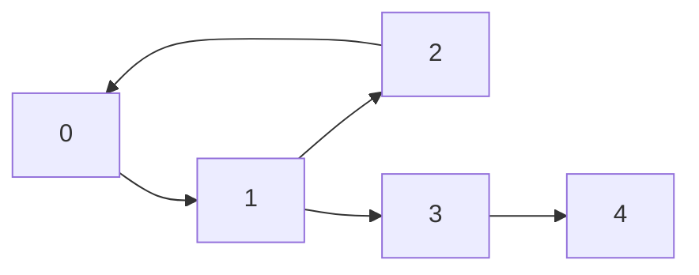
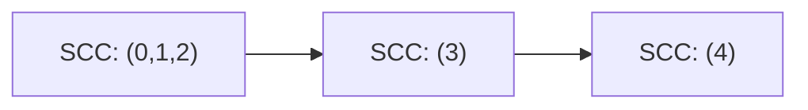

import DataCampExercise from "../../../../components/DataCampExercise.astro";

import GraphTraversal from "../../../../components/viz/GraphTraversal.tsx";


import ProblemLadder from "../../../../components/dsa/ProblemLadder.astro";
import Quiz from "../../../../components/Quiz.astro";

A **strongly connected component (SCC)** is a maximal group of nodes in a
**directed** graph where every node can reach every other node in the
group, following edge directions both ways. A **bridge** is the opposite
kind of fragility: a single edge in an **undirected** graph whose removal
disconnects the graph. Both questions are answered with the same tool --
one DFS pass that tracks *when* each node was first discovered.

:::note[More common in CP than interviews]
SCCs and bridges show up constantly in competitive programming (graph
condensation, network reliability, 2-SAT) but are asked far less often in
standard coding interviews than BFS/DFS/cycle detection. Worth knowing the
shape of the algorithm; don't expect to derive Tarjan's lowlink from
scratch under interview pressure.
:::

## What you'll learn

- What a **strongly connected component** is, and why it's a directed-graph
  concept (undirected connectivity is simpler -- everything reachable is
  automatically "strongly" connected).
- **Kosaraju's algorithm**: two DFS passes plus a graph transpose.
- A pointer to **Tarjan's algorithm** -- a single-pass alternative using
  lowlink values.
- **Bridges**: edges whose removal disconnects the graph, found with
  Tarjan's discovery-time/lowlink trick.
- A quick mention of **articulation points**, the node-removal analogue of
  bridges.

## The cue

:::tip[You are looking at SCCs or bridges when...]
- The graph is **directed** and the question is about **mutual** reachability -- "which groups of
  pages can all reach each other", "which accounts are in the same cycle of transfers".
- You need to **collapse cycles to make a DAG** so that topological sort or DP becomes possible.
  Condensing SCCs is the standard preprocessing step, and the result is *always* a DAG.
- The problem is **2-SAT**, or any "either A or B" constraint set -- satisfiability reduces to
  checking whether a variable and its negation land in the same SCC.
- The graph is **undirected** and the question is about **fragility**: which single link or single
  server, if it failed, would split the network. Bridges (edges) and articulation points (nodes).
- LC 1192 -- "find all critical connections in a network" -- is bridge-finding, stated verbatim.
:::

**When it is the wrong tool.** "Is there *any* path from `u` to `v`?" is plain
[DFS or BFS](../../phase-10-patterns-graphs/). "Which nodes are connected in an **undirected**
graph?" is [union-find](../../phase-03-core-data-structures/union-find-disjoint-set-union/) or one
DFS -- SCCs are a *directed*-graph notion and collapse to ordinary components when edges go both
ways. "Does this directed graph have a cycle at all?" needs only the three-colour DFS from
[cycle detection](../../phase-10-patterns-graphs/cycle-detection-and-bipartite-checking/), not a full
SCC decomposition.

**The honest framing.** As the note above says, this is far more common in competitive programming
than in interviews -- with one exception: **LC 1192 is a real interview question** and it is exactly
`find_bridges`. If you learn one thing on this page cold, learn the `low[neighbor] > disc[node]`
test and why the edge-id skip matters.

## Strongly connected components

In a directed graph, "connected" isn't enough -- you need a path `u -> v`
**and** a path `v -> u` for `u` and `v` to be in the same SCC. Squash every
SCC down to a single "super-node" and the result (the **condensation
graph**) is always a DAG -- no cycles can survive between components,
otherwise those components would have merged into one.





`0 -> 1 -> 2 -> 0` is a cycle, so `{0, 1, 2}` collapses into one SCC. `3`
and `4` each sit alone (a single node is trivially its own SCC), and the
edges between the three SCCs form a clean DAG.

## Visual intuition

Both algorithms on this page are annotations on a plain DFS — Kosaraju uses its **finish order**,
Tarjan its **entry times and low-links**. The spine they annotate is this:

<GraphTraversal
  client:visible
  algo="dfs"
  edges={[
    ["A", "B"],
    ["B", "C"],
    ["C", "A"],
    ["B", "D"],
    ["D", "E"],
  ]}
  start="A"
  title="The DFS spine that low-link values decorate"
  lib="O(V + E) for both algorithms"
  desc="Watch the stack: the nodes on it are exactly the ones whose component is still undecided, which is why Tarjan can pop a whole component the moment a root's low-link equals its own entry time. Kosaraju instead records the order nodes FINISH in, then repeats the traversal on the reversed graph -- two passes over the same spine."
/>

## Kosaraju's algorithm

Kosaraju's algorithm finds every SCC in three steps:

1. Run a DFS over the graph, and record each node in a stack **by finish
   time** (append it only after all its descendants are done -- postorder).
2. Build the **transpose** graph: every edge reversed.
3. Pop nodes off the finish-time stack (highest finish time first) and run
   DFS on the **transpose**. Each DFS tree you get this way is exactly one
   SCC.

```python title="kosaraju_scc.py" showLineNumbers{1}
def kosaraju_scc(n, edges):
    graph = {i: [] for i in range(n)}
    reverse_graph = {i: [] for i in range(n)}
    for u, v in edges:
        graph[u].append(v)
        reverse_graph[v].append(u)

    # Pass 1: record nodes in POSTORDER (finish time) on the original graph.
    visited = [False] * n
    finish_order = []

    def dfs1(node):
        visited[node] = True
        for neighbor in graph[node]:
            if not visited[neighbor]:
                dfs1(neighbor)
        finish_order.append(node)   # append AFTER exploring every descendant

    for node in range(n):
        if not visited[node]:
            dfs1(node)

    # Pass 2: DFS on the TRANSPOSE, visiting in decreasing finish-time order.
    visited2 = [False] * n
    components = []

    def dfs2(node, component):
        visited2[node] = True
        component.append(node)
        for neighbor in reverse_graph[node]:
            if not visited2[neighbor]:
                dfs2(neighbor, component)

    for node in reversed(finish_order):
        if not visited2[node]:
            component = []
            dfs2(node, component)
            components.append(component)

    return components


n = 5
edges = [(0, 1), (1, 2), (2, 0), (1, 3), (3, 4)]
print("SCCs:", kosaraju_scc(n, edges))
```

:::tip[Why the transpose works]
Reversing every edge flips every "can reach" relationship too. Processing
nodes in **decreasing finish time** guarantees that whichever node finished
last (in pass 1) is explored first in pass 2 -- and it can only "leak" into
another SCC on the transpose if that SCC could already reach it in the
original graph, which is exactly what "strongly connected" requires.
:::

## Tarjan's algorithm: the single-pass alternative

Tarjan's algorithm finds the same SCCs in **one** DFS pass instead of two,
using a `low[node]` value -- the smallest discovery time reachable from
`node` via any number of tree edges plus **at most one back edge**. A node
starts a new SCC exactly when `low[node] == disc[node]` (nothing below it
reaches further back than itself). It needs an explicit stack of
"currently active" nodes instead of a transpose graph -- more fiddly to
implement correctly, but avoids building a second graph. The lowlink idea
it introduces is exactly what powers bridge-finding next.

## Bridges: edges that hold the graph together

A **bridge** is an edge whose removal increases the number of connected
components. Tarjan's lowlink answers this directly on an **undirected**
graph: track each node's discovery time `disc[node]` and its `low[node]`
(the earliest discovery time reachable from its subtree via one back edge).
An edge `(node, neighbor)` in the DFS tree is a bridge exactly when
`low[neighbor] > disc[node]` -- meaning nothing in `neighbor`'s subtree can
reach `node` or anything before it *except through that one edge*.

```python title="find_bridges.py" showLineNumbers{1}
def find_bridges(n, edges):
    graph = {i: [] for i in range(n)}
    for i, (u, v) in enumerate(edges):
        graph[u].append((v, i))
        graph[v].append((u, i))   # store the edge's index to skip its own reverse

    disc = [-1] * n
    low = [0] * n
    timer = [0]
    bridges = []

    def dfs(node, parent_edge):
        disc[node] = low[node] = timer[0]
        timer[0] += 1
        for neighbor, edge_id in graph[node]:
            if edge_id == parent_edge:
                continue                      # don't walk back over the edge we just used
            if disc[neighbor] == -1:
                dfs(neighbor, edge_id)
                low[node] = min(low[node], low[neighbor])
                if low[neighbor] > disc[node]:
                    bridges.append(edges[edge_id])
            else:
                low[node] = min(low[node], disc[neighbor])

    for node in range(n):
        if disc[node] == -1:
            dfs(node, -1)

    return bridges


# Two triangles (0-1-2 and 3-4-5) joined by a single connecting edge.
n = 6
edges = [(0, 1), (1, 2), (2, 0), (2, 3), (3, 4), (4, 5), (5, 3)]
print("bridges:", find_bridges(n, edges))
```

Neither triangle has a bridge -- every node inside one has **two** disjoint
ways back to any other node in it. The single edge `(2, 3)` connecting the
two triangles is the only bridge: cut it, and the graph splits in two.

:::tip[Articulation points are one condition looser]
An **articulation point** (a node whose removal disconnects the graph) uses
almost the same check: `low[neighbor] >= disc[node]` (not strictly
greater) for a non-root node, plus a special case for the DFS root (it's an
articulation point only if it has **more than one** DFS-tree child). Same
`disc`/`low` machinery, one comparison operator different.
:::

## Dry run

### Kosaraju on the page's graph

`n = 5`, edges `0->1, 1->2, 2->0, 1->3, 3->4`.

**Pass 1** (DFS on the original graph, appending on *finish*):

```
finish order (postorder): [2, 4, 3, 1, 0]
processed in pass 2     : [0, 1, 3, 4, 2]   (reversed)
```

Node `2` finishes first because the DFS descends `0 -> 1 -> 2`, and `2`'s only edge leads back to
the already-visited `0`, so it has nowhere to go. Node `0` finishes **last** -- it is the root of the
whole traversal.

**Pass 2** (DFS on the transpose, in reversed finish order):

| Start node | Reached on the transpose | Component |
| --- | --- | --- |
| 0 | 0, then 2 (via `0<-2`), then 1 (via `2<-1`) | **`{0, 2, 1}`** |
| 1 | already visited | -- |
| 3 | 3 only -- on the transpose, `3`'s only in-edge came from `1`, already visited | **`{3}`** |
| 4 | 4 only | **`{4}`** |
| 2 | already visited | -- |

SCCs `[[0, 2, 1], [3], [4]]`, matching a brute-force mutual-reachability check on all 25 pairs.

**Why the transpose is load-bearing.** Run pass 2 on the *original* graph instead and the answer is
`[[0, 1, 2, 3, 4]]` -- one component, badly wrong. Starting from `0` on the original graph you can
walk `0 -> 1 -> 3 -> 4` and swallow the entire graph, because forward reachability alone says nothing
about whether `4` can get back. Reversing the edges is what makes the second pass ask "who can reach
*me*", and intersecting that with pass 1's "who can I reach" is precisely the definition of an SCC.

**Why decreasing finish time.** Node `0` finished last and is processed first, so pass 2 starts at a
node in a **source** component of the condensation. On the transpose, a source becomes a sink -- so
the DFS cannot escape its own SCC. Process in the wrong order and it leaks.

**The condensation really is a DAG**, verified: component ids `{0,1,2} -> 0`, `{3} -> 1`, `{4} -> 2`,
condensation edges `(0,1)` and `(1,2)`, and a three-colour cycle check on it returns `False`. That
guarantee is what makes SCC-condensation useful as a preprocessing step -- whatever DAG algorithm you
wanted (topological sort, longest path, DP) now applies.

### Bridges: two triangles joined by one edge

`n = 6`, edges `(0,1) (1,2) (2,0) (2,3) (3,4) (4,5) (5,3)`.

Final arrays:

```
node :  0  1  2  3  4  5
disc :  0  1  2  3  4  5
low  :  0  0  0  3  3  3
```

Every tree edge, tested as `low[child] > disc[parent]`:

| Tree edge | `low[child]` | `disc[parent]` | Bridge? |
| --- | --- | --- | --- |
| `(4,5)` | 3 | 4 | no -- `3 < 4` |
| `(3,4)` | 3 | 3 | no -- equal, not strictly greater |
| **`(2,3)`** | **3** | **2** | **yes -- `3 > 2`** |
| `(1,2)` | 0 | 1 | no |
| `(0,1)` | 0 | 0 | no |

Only `(2, 3)`, confirmed by brute force (removing each edge and counting components).

**The `low` array splits cleanly into `[0,0,0]` and `[3,3,3]`** -- one value per triangle. Inside a
cycle every node can reach back to the cycle's entry point, so they all share that entry's discovery
time. The bridge is exactly the place where the two blocks meet, and `low[3] = 3` cannot reach back
past `disc[2] = 2` because the only route is the edge under test.

**Row 2 is why the operator is `>` and not `>=`.** For `(3,4)`, `low[4] == disc[3] == 3`: node 4 *can*
reach back to node 3 by another route (`4 -> 5 -> 3`), so the edge is redundant. Loosen to `>=` and
you report every tree edge inside a cycle as a bridge. That same loosening is exactly what turns the
test into the **articulation point** condition -- one operator, a different question.

### The parallel-edge trap, demonstrated

Two nodes joined by **two** parallel edges: `n = 2`, `edges = [(0,1), (0,1)]`. There is no bridge --
cutting either edge leaves the other, so the graph stays connected. Brute force agrees: `[]`.

| Implementation | Result |
| --- | --- |
| Skip by **edge id** (as written above) | `[]` ✅ |
| Skip by **parent node** (`if y == par: continue`) | `[(0, 1)]` ❌ |

Skipping by parent node makes the DFS at node 1 ignore *both* edges back to 0, so it never records
the second route, `low[1]` stays at 1, and `1 > disc[0] = 0` reports a bridge that is not there.

Storing the edge index and skipping only *that* edge is what distinguishes "don't walk back the way
I came" from "don't walk back to that node at all". Simple graphs hide the difference completely,
which is why this passes tests and fails on multigraph input.

### Bridges and articulation points are not the same set

Same two-triangle graph:

| Object | Result |
| --- | --- |
| Bridges | `[(2, 3)]` -- one |
| Articulation points | `[2, 3]` -- **two** |

Removing node 2 destroys the first triangle *and* the link; removing node 3 does the same on the
other side. One fragile edge, two fragile nodes.

And they can come apart entirely. A **bowtie** -- two triangles sharing a single node --
`edges = [(0,1),(1,2),(2,0),(2,3),(3,4),(4,2)]`:

| Object | Result |
| --- | --- |
| Bridges | `[]` -- **none** |
| Articulation points | `[2]` |

Every edge sits on a cycle, so no single edge is critical. But node 2 is the only thing joining the
two triangles, so removing it splits the graph. **A graph can have an articulation point with no
bridges at all** -- verified against brute force both ways. If a problem asks about failing servers
rather than failing links, the `>=` version plus the root's child-count special case is the one you
need.

## Complexity

Kosaraju's algorithm is two DFS passes plus building the transpose:
$O(V + E)$ time, $O(V + E)$ space. Tarjan's SCC algorithm and the
bridge-finding DFS are both a single pass: $O(V + E)$ time, $O(V)$ space
for `disc`/`low`.

## The variant map

| Variant | The change | Canonical problem |
| --- | --- | --- |
| **Find all SCCs** | Kosaraju (two passes) or Tarjan (one pass) | 1192-adjacent, CP staples |
| **Condense to a DAG** | Map each node to its component id, dedupe cross edges | preprocessing for topological DP |
| **Count SCCs / find the largest** | The decomposition itself | CP |
| **2-SAT** | Build the implication graph; satisfiable iff no variable shares an SCC with its negation | CP |
| **Semi-connectivity / unique topological order** | Condense, then check the DAG has a Hamiltonian path | CP |
| **Bridges (critical edges)** | `low[child] > disc[node]`, skipping by **edge id** | 1192 Critical Connections |
| **Articulation points (critical nodes)** | `low[child] >= disc[node]` for non-roots; the root qualifies iff it has **>1** DFS child | 1568-adjacent |
| **Bridge-connected (2-edge-connected) components** | Remove all bridges, then take ordinary connected components | CP |
| **Biconnected components** | Same DFS, but push *edges* onto a stack and pop at each articulation point | CP |
| **Minimum edges to make it strongly connected** | Condense, then `max(#sources, #sinks)` (or 0 if already one SCC) | CP |
| **Redundant connection in an undirected graph** | Not this at all -- [union-find](../../phase-03-core-data-structures/union-find-disjoint-set-union/) | 684 |

:::note[Kosaraju versus Tarjan, in practice]
Both are $O(V + E)$. The trade is not speed:

- **Kosaraju** needs the transpose graph -- $O(V + E)$ extra memory -- but is two plain DFS passes
  you can write from memory under pressure. Its correctness argument (finish order plus reversed
  edges) is also the easier one to explain out loud.
- **Tarjan** is one pass and no second graph, but needs an explicit on-stack set, an `disc`/`low`
  pair, and the `low[u] == disc[u]` pop condition -- more moving parts, and easier to get subtly
  wrong when you have not written it recently.

Write Kosaraju unless memory is genuinely tight. Recursion depth is the practical hazard for both in
CPython -- an iterative rewrite or `sys.setrecursionlimit` is needed past a few thousand nodes.
:::

## Pitfalls

- **Running pass 2 on the original graph instead of the transpose.** Verified: the traced graph
  returns one component `[[0,1,2,3,4]]` instead of three. Forward reachability alone is not mutual
  reachability, and the failure is a plausible wrong answer with no error.
- **Processing pass 2 in the wrong order.** It must be *decreasing* finish time. That guarantees you
  start in a source component of the condensation, which on the transpose is a sink -- so the DFS
  cannot escape its own SCC. Any other order leaks between components.
- **Appending on entry instead of on finish.** `finish_order.append(node)` goes *after* the neighbour
  loop. Append on entry and you have a preorder, which carries none of the ordering guarantee the
  algorithm rests on.
- **Skipping by parent node instead of parent edge id when finding bridges.** On two parallel edges
  `[(0,1),(0,1)]` the edge-id version correctly reports no bridge; the parent-node version reports
  `(0,1)`. Simple graphs hide this completely, so it ships.
- **Using `>=` for bridges or `>` for articulation points.** Bridges need **strictly** greater --
  with `>=`, every tree edge inside a cycle is reported. Articulation points need `>=`. One operator,
  two different questions, and the traced graph has one bridge but *two* articulation points.
- **Forgetting the root's special case for articulation points.** The DFS root has no parent, so the
  general test does not apply: it is an articulation point iff it has **more than one** DFS-tree
  child.
- **Assuming bridges and articulation points coincide.** A bowtie -- two triangles sharing one node
  -- has **no bridges** but one articulation point. Verified both ways against brute force.
- **Applying SCCs to an undirected graph.** Every undirected edge is bidirectional, so SCCs collapse
  to plain connected components and the whole two-pass apparatus is wasted. Use one DFS or
  union-find.
- **Recursion depth.** Both algorithms are naturally recursive, and CPython dies at ~1000 frames. A
  path graph of 10,000 nodes is a legitimate input; convert to an explicit stack or raise the limit.
- **Assuming `low` is the *smallest reachable* discovery time.** It is the smallest reachable via
  tree edges plus **at most one** back edge. The distinction matters when you try to derive the
  update rules yourself: you propagate `low[child]` from tree edges but only `disc[neighbor]` from
  back edges -- using `low[neighbor]` there breaks the bridge test.
## Practice -- real LeetCode problems

A reachability closure to warm up, then Tarjan's bridge-finding algorithm -- the
one worth memorising -- and finally a problem where recognising that the answer is
always 0, 1 or 2 beats any clever algorithm.

### LC 1462 -- Course Schedule IV · Medium

**Problem.** Given `numCourses` courses and direct prerequisite pairs
`[a, b]` meaning `a` must be taken before `b`, answer each query `[u, v]`: is `u` a
prerequisite of `v`, directly or indirectly?

**Constraints.** `2 <= numCourses <= 100`,
`0 <= len(prerequisites) <= n*(n-1)/2`, `1 <= len(queries) <= 10**4`, the graph is
a DAG with no duplicate edges.

**Examples.** `n = 2`, `prerequisites = [[1,0]]`, `queries = [[0,1],[1,0]]` gives
`[false,true]` · with no prerequisites, everything is `false`

<DataCampExercise
  lang="python"
  hint={`With n at most 100 you can afford the full transitive closure: a boolean matrix reach where reach[i][j] means i comes before j. Seed it from the direct edges, then run Floyd-Warshall -- for every intermediate k, if i reaches k and k reaches j then i reaches j. After that every query is a single lookup. Note the order of the loops: k must be the OUTERMOST.`}
  code={`class Solution:
    def checkIfPrerequisite(self, numCourses, prerequisites, queries):
        # TODO: build the transitive closure as a boolean matrix.
        # Seed from direct edges, then Floyd-Warshall with k OUTERMOST:
        # reach[i][j] |= reach[i][k] and reach[k][j].
        # Each query is then one lookup.
        pass


sol = Solution()
cases = [(2, [[1, 0]], [[0, 1], [1, 0]]),
         (2, [], [[1, 0], [0, 1]]),
         (3, [[1, 2], [1, 0], [2, 0]], [[1, 0], [1, 2]]),
         (5, [[0, 1], [1, 2], [2, 3], [3, 4]], [[0, 4], [4, 0], [1, 3]])]
print([sol.checkIfPrerequisite(n, [p[:] for p in pre], [q[:] for q in qs])
       for n, pre, qs in cases])
# expect [[False, True], [False, False], [True, True], [True, False, True]]`}
  solution={`class Solution:
    def checkIfPrerequisite(self, numCourses, prerequisites, queries):
        # reach[i][j] = i is a prerequisite of j
        reach = [[False] * numCourses for _ in range(numCourses)]
        for a, b in prerequisites:
            reach[a][b] = True

        # Floyd-Warshall on booleans -- k must be the OUTERMOST loop
        for k in range(numCourses):
            for i in range(numCourses):
                if reach[i][k]:
                    for j in range(numCourses):
                        if reach[k][j]:
                            reach[i][j] = True

        return [reach[a][b] for a, b in queries]


sol = Solution()
cases = [(2, [[1, 0]], [[0, 1], [1, 0]]),
         (2, [], [[1, 0], [0, 1]]),
         (3, [[1, 2], [1, 0], [2, 0]], [[1, 0], [1, 2]]),
         (5, [[0, 1], [1, 2], [2, 3], [3, 4]], [[0, 4], [4, 0], [1, 3]])]
print([sol.checkIfPrerequisite(n, [p[:] for p in pre], [q[:] for q in qs])
       for n, pre, qs in cases])`}
  sct={`test_output_contains("[[False, True], [False, False], [True, True], [True, False, True]]")
success_msg("n at most 100 with up to 10,000 queries is the signal: precompute everything once, then answer in O(1).")
`}
  height={440}
/>

<details>
<summary>Editorial · approach, complexity, follow-ups</summary>

The shape of the constraints picks the algorithm. A hundred nodes but ten thousand
queries means **precompute once, answer instantly** -- a BFS per query would be
$10^4$ traversals for no reason.

**Time** $O(n^3 + Q)$, about $10^6$ here. **Space** $O(n^2)$.

- **`k` must be the outermost loop.** This is the one thing to get right about
  Floyd-Warshall. The invariant after iteration `k` is *"reach[i][j] is correct
  using only intermediates from the first `k` nodes"*, and any other loop order
  destroys it. Being able to state that invariant is what distinguishes
  understanding it from having copied it.
- **The `if reach[i][k]` guard** is not just a speedup -- it keeps the inner loop
  off entirely for most pairs, which matters at $n^3$.
- **Direction matters.** `[a, b]` means `a` before `b`, so seed `reach[a][b]`, and a
  query `[u, v]` asks `reach[u][v]`. Reversing it passes the second test and fails
  the first, which is why both are in the tests.
- **No prerequisites** means everything is `False`, and the closure of an empty
  relation is empty.
- **`reach[i][i]` stays `False`**, which is right for a DAG -- a course is not its
  own prerequisite.

The alternative worth mentioning: a topological order plus a bitmask per node,
propagating ancestor sets with `ancestors[v] |= ancestors[u] | (1 << u)`. With
Python's big integers that is $O(n^2)$ word operations and considerably faster in
practice.

**Follow-ups you should expect:** "The graph might have cycles?" -- then compute
SCCs first and run the closure on the condensation, since everything in one SCC
reaches everything else in it. "$n = 10^5$?" -- $O(n^2)$ memory is already too much;
you would answer queries individually or restrict to tree-shaped input.
"Prerequisites added over time?" -- incremental closure, updating one row and
column per new edge. "The shortest prerequisite chain?" -- BFS instead of a boolean
closure, or Floyd-Warshall over distances.

</details>

### LC 1192 -- Critical Connections in a Network · Hard

**Problem.** Given a connected undirected network of `n` servers and their
connections, return all **critical connections** -- edges whose removal would
disconnect some server from the rest. Any order.

**Constraints.** `2 <= n <= 10**5`,
`n - 1 <= len(connections) <= 10**5`, no repeated connections, the graph is
connected.

**Examples.** `n = 4`, `connections = [[0,1],[1,2],[2,0],[1,3]]` gives `[[1,3]]`
-- the triangle has no critical edge · `n = 2`, `[[0,1]]` gives `[[0,1]]`

<DataCampExercise
  lang="python"
  hint={`These are bridges, and Tarjan finds them in one DFS. Give every node a discovery time, and a low value: the smallest discovery time reachable from its subtree using at most one back edge. After recursing into a child, edge (node, child) is a bridge exactly when low[child] > disc[node] -- meaning nothing in the child's subtree can reach node or above by any other route. Skip the edge back to the parent, and note the grader sorts your output so any order is fine.`}
  code={`class Solution:
    def criticalConnections(self, n, connections):
        # TODO: Tarjan. Track disc[v] (discovery time) and low[v] (lowest
        # discovery time reachable from v's subtree via at most one back
        # edge). After recursing into child c: low[node] = min(low[node],
        # low[c]), and if low[c] > disc[node] then (node, c) is a bridge.
        # For an already-visited neighbour, use its DISC, not its low.
        # Do not walk back to the parent.
        pass


sol = Solution()
cases = [(4, [[0, 1], [1, 2], [2, 0], [1, 3]]),
         (2, [[0, 1]]),
         (3, [[0, 1], [1, 2], [2, 0]]),
         (5, [[1, 0], [2, 0], [3, 2], [4, 2], [4, 3], [3, 0], [4, 0]]),
         (6, [[0, 1], [1, 2], [2, 0], [1, 3], [3, 4], [4, 5], [5, 3]])]
print([sorted(sorted(b) for b in sol.criticalConnections(n, [c[:] for c in cs]))
       for n, cs in cases])
# expect [[[1, 3]], [[0, 1]], [], [[0, 1]], [[1, 3]]]`}
  solution={`from collections import defaultdict


class Solution:
    def criticalConnections(self, n, connections):
        graph = defaultdict(list)
        for a, b in connections:
            graph[a].append(b)
            graph[b].append(a)

        disc = [-1] * n                   # discovery time, -1 = unvisited
        low = [0] * n                     # lowest disc reachable from subtree
        bridges = []
        timer = [0]

        def dfs(node, parent):
            disc[node] = low[node] = timer[0]
            timer[0] += 1
            for nxt in graph[node]:
                if nxt == parent:
                    continue              # never walk straight back
                if disc[nxt] == -1:
                    dfs(nxt, node)
                    low[node] = min(low[node], low[nxt])
                    if low[nxt] > disc[node]:
                        bridges.append([node, nxt])   # no alternate route
                else:
                    # back edge: use its DISC, not its low
                    low[node] = min(low[node], disc[nxt])

        dfs(0, -1)
        return bridges


sol = Solution()
cases = [(4, [[0, 1], [1, 2], [2, 0], [1, 3]]),
         (2, [[0, 1]]),
         (3, [[0, 1], [1, 2], [2, 0]]),
         (5, [[1, 0], [2, 0], [3, 2], [4, 2], [4, 3], [3, 0], [4, 0]]),
         (6, [[0, 1], [1, 2], [2, 0], [1, 3], [3, 4], [4, 5], [5, 3]])]
print([sorted(sorted(b) for b in sol.criticalConnections(n, [c[:] for c in cs]))
       for n, cs in cases])`}
  sct={`test_output_contains("[[[1, 3]], [[0, 1]], [], [[0, 1]], [[1, 3]]]")
success_msg("low[child] > disc[node] is the bridge condition. Learn what low MEANS and the condition stops needing memorisation.")
`}
  height={520}
/>

<details>
<summary>Editorial · approach, complexity, follow-ups</summary>

Tarjan's bridge algorithm. One DFS, two arrays, and one comparison -- but only if
you know what the arrays mean.

- **`disc[v]`** -- when the DFS first reached `v`. A timestamp; it never changes.
- **`low[v]`** -- the smallest `disc` reachable from `v`'s DFS subtree using tree
  edges downward plus **at most one** back edge.

The bridge condition **`low[child] > disc[node]`** then reads directly: nothing in
the child's subtree can reach `node` or anything discovered before it by any route
other than this edge. Cut it and the subtree is stranded. Compare with the
articulation-point condition `low[child] >= disc[node]`, which differs by one
character and answers a different question -- that pairing is a favourite interview
probe.

**Time** $O(n + E)$. **Space** $O(n + E)$.

- **Use `disc[nxt]`, not `low[nxt]`, for a back edge.** Taking `low` would let two
  back edges chain together, which is precisely what `low` is defined to forbid, and
  you would miss bridges. Subtle and very commonly wrong.
- **Skipping the parent** by node id is fine here because the constraints promise no
  repeated connections. With **parallel edges** it breaks -- two edges between the
  same pair mean neither is a bridge, yet skipping by node id hides the second one.
  Track the incoming *edge index* instead. Say this out loud; it is the most
  valuable thing you can add to a correct answer.
- **A tree** has every edge critical; a **cycle** has none. Those are the two
  extremes, and the triangle case in the tests is the "none" check.
- **Recursion depth.** At $n = 10^5$ a path-shaped graph blows Python's default
  limit of 1000. In an interview say you would raise the limit or write it
  iteratively; the recursive version is what gets discussed.
- **The graph is promised connected**, so one `dfs(0, -1)` suffices. If it were not,
  loop over all unvisited nodes.

**Follow-ups you should expect:** "Articulation points (cut vertices) instead?" --
same DFS, condition `low[child] >= disc[node]` for non-root nodes, and the root is
a cut vertex exactly when it has more than one DFS child. "Directed graphs and
SCCs?" -- Tarjan's SCC algorithm reuses `disc`/`low` with an explicit stack, or use
Kosaraju's two passes, which is easier to explain. "2-edge-connected components?" --
remove the bridges and take the remaining components. "Which single edge addition
minimises the bridges?" -- contract the 2-edge-connected components into a tree and
add an edge between two leaves at maximum distance.

</details>

### LC 1568 -- Minimum Number of Days to Disconnect Island · Hard

**Problem.** A binary grid where 1 is land. The grid is **connected** if it has
exactly one island. In one day you may change a single 1 into a 0. Return the
minimum number of days to make the grid disconnected -- zero islands or more than
one.

**Constraints.** `1 <= rows, cols <= 30`, entries are 0 or 1.

**Examples.** `[[0,1,1,0],[0,1,1,0],[0,0,0,0]]` gives `2` ·
`[[1,1]]` gives `2` · `[[1,0,1,0]]` gives `0` -- already two islands

<DataCampExercise
  lang="python"
  hint={`The answer is only ever 0, 1 or 2 -- take any corner cell of the island and its two neighbours can always be removed to strand it, so two days always suffice. So: count islands; not exactly one means 0. Otherwise try removing each land cell in turn and recount; if any single removal works the answer is 1. Otherwise 2. Remember to put the cell back after each trial.`}
  code={`class Solution:
    def minDays(self, grid):
        # TODO: the answer is always 0, 1 or 2.
        # Not exactly one island -> 0.
        # Try removing each land cell and recount -> 1 if any works.
        # Otherwise 2. Restore the cell after each trial.
        pass


sol = Solution()
cases = [[[0, 1, 1, 0], [0, 1, 1, 0], [0, 0, 0, 0]],
         [[1, 1]],
         [[1, 0, 1, 0]],
         [[1, 1, 0, 1, 1], [1, 1, 1, 1, 1], [1, 1, 0, 1, 1]],
         [[0, 0], [0, 0]]]
print([sol.minDays([r[:] for r in g]) for g in cases])
# expect [2, 2, 0, 1, 0]`}
  solution={`class Solution:
    def minDays(self, grid):
        rows, cols = len(grid), len(grid[0])

        def islands():
            seen = set()
            count = 0
            for r in range(rows):
                for c in range(cols):
                    if grid[r][c] == 1 and (r, c) not in seen:
                        count += 1
                        stack = [(r, c)]
                        seen.add((r, c))
                        while stack:      # iterative flood fill
                            x, y = stack.pop()
                            for dx, dy in ((1, 0), (-1, 0), (0, 1), (0, -1)):
                                nx, ny = x + dx, y + dy
                                if (0 <= nx < rows and 0 <= ny < cols
                                        and grid[nx][ny] == 1
                                        and (nx, ny) not in seen):
                                    seen.add((nx, ny))
                                    stack.append((nx, ny))
            return count

        if islands() != 1:
            return 0                      # zero islands, or already split

        for r in range(rows):
            for c in range(cols):
                if grid[r][c] == 1:
                    grid[r][c] = 0
                    if islands() != 1:
                        grid[r][c] = 1    # restore before returning
                        return 1
                    grid[r][c] = 1
        return 2                          # two days always suffice


sol = Solution()
cases = [[[0, 1, 1, 0], [0, 1, 1, 0], [0, 0, 0, 0]],
         [[1, 1]],
         [[1, 0, 1, 0]],
         [[1, 1, 0, 1, 1], [1, 1, 1, 1, 1], [1, 1, 0, 1, 1]],
         [[0, 0], [0, 0]]]
print([sol.minDays([r[:] for r in g]) for g in cases])`}
  sct={`test_output_contains("[2, 2, 0, 1, 0]")
success_msg("Bounding the answer at 2 turns a scary Hard into two flood-fill loops. Bound the answer before you design the algorithm.")
`}
  height={520}
/>

<details>
<summary>Editorial · approach, complexity, follow-ups</summary>

The insight is not an algorithm, it is a **bound**: the answer is never more than
2.

Why. If the island has at least three cells, pick the topmost row it occupies and
the leftmost cell in that row. That cell has land in at most two of its four
directions -- nothing above and nothing to the left, by construction. Remove those
one or two neighbours and the cell is isolated, giving at least two islands. Grids
with one or two cells are the small cases: a single cell takes 1 day (removing it
leaves zero islands), and two adjacent cells take 2.

With the answer bounded, the search is trivial: check 0, then check 1 by trying
every removal, otherwise answer 2.

**Time** $O((rc)^2)$ -- up to 900 candidate removals, each followed by an
$O(rc)$ recount, so about $8 \times 10^5$ cell visits. Fine at `30 x 30`.
**Space** $O(rc)$.

- **Zero islands counts as disconnected.** An all-water grid answers 0, and a
  single land cell answers 1 -- removing it leaves zero islands, which satisfies
  "not exactly one".
- **Restore the cell** after every trial, *including* on the early return, or the
  caller sees a mutated grid.
- **`[[1,1]]` answers 2**, not 1: removing either cell leaves exactly one island,
  so no single day works.
- **Already disconnected input** short-circuits to 0 before any trial. That check
  must come first.
- **Iterative flood fill.** At `30 x 30` recursion would survive, but the loop
  costs nothing extra and removes the worry.

**Follow-ups you should expect:** "Faster than $O((rc)^2)$?" -- yes: a single land
cell whose removal disconnects the island is an **articulation point** of the
grid graph, so one Tarjan pass finds all of them in $O(rc)$. That is the intended
"good" answer and ties this page together -- but mind the degenerate cases, since
one- and two-cell islands have no articulation point yet still answer 1 and 2.
"Prove the bound of 2?" -- the topmost-leftmost argument above. "8-directional
connectivity?" -- the bound rises, since a corner cell can have three neighbours.
"Disconnect into exactly `k` islands?" -- a much harder problem, with no small
bound. "Remove *water* cells to connect instead?" -- that is a shortest-path or
minimum-cost problem, not this one.

</details>

## LeetCode problem set

Generated from the problem database, so each entry carries its sheet
membership and reported companies. Tick them off as you go — progress is
saved in this browser, and the Export button writes it to a file you can keep.

<ProblemLadder pattern="strongly-connected-components-and-bridges"
  notes={{"1192":"Exactly the bridge-finding DFS above, applied to server connections"}} />

## Interview follow-ups

| They ask | What they're checking | The answer |
| --- | --- | --- |
| "What is an SCC, precisely?" | Mutual, not one-way | A maximal set where every node reaches every other **following edge directions**. One-way reachability is not enough, which is why one DFS cannot answer it |
| "Why does Kosaraju need the transpose?" | The core argument | Pass 1 answers "who can I reach", pass 2 on the reversed graph answers "who can reach me", and an SCC is the intersection. Run pass 2 on the original graph and the traced example collapses to a single component -- a wrong answer with no error |
| "Why decreasing finish time?" | The ordering guarantee | The last node to finish sits in a **source** component of the condensation; on the transpose a source becomes a sink, so the DFS cannot escape its own SCC. Any other order leaks |
| "Is the condensation always a DAG?" | Whether you see why it must be | Yes. A cycle between two components would mean mutual reachability, so they would have been one component. Verified on the traced graph. That guarantee is what makes SCC-condensation the standard preprocessing step before topological sort or DAG DP |
| "Kosaraju or Tarjan?" | Judgement | Both $O(V+E)$. Kosaraju is two plain DFS passes plus a transpose ($O(V+E)$ extra memory) and is far easier to write correctly cold. Tarjan is one pass with no second graph but needs `disc`/`low`, an on-stack set, and the pop condition. Write Kosaraju unless memory is tight |
| "How do you find bridges?" | The one thing worth knowing cold | DFS tracking `disc` and `low`; a tree edge `(u, v)` is a bridge iff `low[v] > disc[u]` -- nothing in `v`'s subtree reaches `u` or earlier except through that edge. LC 1192 is this verbatim |
| "Why skip by edge id rather than parent node?" | The trap | Parallel edges. On `[(0,1),(0,1)]` the edge-id version correctly finds no bridge; the parent-node version reports one, because it ignores both routes back and never learns the second exists. Simple graphs hide it entirely |
| "Now find critical *nodes* instead" | Whether you know the one-operator change | `low[v] >= disc[u]` for non-root `u`, plus: the root is an articulation point iff it has more than one DFS-tree child. Same machinery |
| "Are the critical edges and critical nodes the same?" | Whether you have thought about it | No. The two-triangle graph has one bridge and **two** articulation points; a bowtie sharing one node has **no** bridges and one articulation point. Different objects |
| "10,000 nodes in a path. Any problem?" | Practical CPython | Recursion depth -- both algorithms recurse to depth $O(V)$ and CPython dies at ~1000 frames. Rewrite iteratively or raise the limit, and say which |
| "What is 2-SAT and why does it use SCCs?" | Depth, if the conversation goes there | Each clause becomes two implications in a graph over literals. The formula is satisfiable iff no variable shares an SCC with its negation -- because that would mean `x` implies `not x` and back. The assignment is then read off the condensation's topological order |

## Self-check

<Quiz
  questions={[
    {
      q: "What makes a set of nodes a strongly connected component?",
      options: [
        "Every node can be reached from some starting node",
        "Every node reaches every other node following edge directions -- mutual reachability -- and the set is maximal",
        "The nodes form a cycle of length equal to the set size",
        "Removing any node disconnects the set",
      ],
      answer: 1,
      explain:
        "Mutual is the operative word. One-way reachability is what a single DFS gives you, and it is not enough -- in the traced graph, 0 reaches 4 but 4 cannot reach 0, so they are in different SCCs. Maximality matters too: {0,1} is mutually reachable but is not an SCC, because 2 belongs with them.",
    },
    {
      q: "You run Kosaraju's pass 2 on the original graph instead of the transpose. What happens on the traced example?",
      options: [
        "It raises an error",
        "It returns one component, [[0,1,2,3,4]] -- badly wrong, with no error at all",
        "It returns the SCCs in a different order but the same partition",
        "It returns five singleton components",
      ],
      answer: 1,
      explain:
        "Verified. Starting at node 0 on the original graph you walk 0 -> 1 -> 3 -> 4 and swallow everything, because forward reachability says nothing about whether 4 can get back. Pass 1 answers \"who can I reach\"; pass 2 on the reversed graph answers \"who can reach me\"; an SCC is the intersection. Remove the reversal and you are computing the wrong intersection.",
    },
    {
      q: "Why must pass 2 process nodes in *decreasing* finish time?",
      options: [
        "So the components come out in topological order",
        "The last node to finish lies in a source component of the condensation, which becomes a sink on the transpose -- so the DFS cannot escape its own SCC",
        "Because heaps require a sorted order",
        "It does not matter; any order gives the same partition",
      ],
      answer: 1,
      explain:
        "Being in a sink of the graph you are traversing is what confines the DFS. In the trace node 0 finished last and is processed first, and on the transpose it can reach only 2 and 1 -- exactly its SCC. Any other order lets a DFS start mid-condensation and leak into components it should not merge with.",
    },
    {
      q: "Is the condensation graph always a DAG?",
      options: [
        "Only if the original graph is acyclic",
        "Yes -- a cycle between two components would mean mutual reachability, so they would already be one component",
        "No, it can contain cycles between mutually-reachable components",
        "Only for graphs with fewer SCCs than nodes",
      ],
      answer: 1,
      explain:
        "The guarantee is definitional, and it is the whole payoff of the decomposition. Verified on the traced graph: components {0,1,2}, {3}, {4} with condensation edges (0,1) and (1,2), and a cycle check returning False. Once you have a DAG, topological sort, longest-path and DAG DP all apply to a graph that originally had cycles.",
    },
    {
      q: "In the two-triangle graph, the low array is [0,0,0,3,3,3]. Why does it split so cleanly?",
      options: [
        "Because the nodes were numbered in DFS order",
        "Inside a cycle every node can reach back to the cycle's entry point, so they all share that entry's discovery time -- and the bridge is where the two blocks meet",
        "Because both triangles have the same number of nodes",
        "Because low is initialised to the component index",
      ],
      answer: 1,
      explain:
        "The first triangle is entered at node 0 (disc 0) and the second at node 3 (disc 3). Node 3 cannot reach back past disc 2 because the only route is the edge (2,3) under test -- which is exactly why low[3] = 3 > disc[2] = 2 flags it. The clean split is the bridge test made visible.",
    },
    {
      q: "The bridge test is `low[child] > disc[node]`. What breaks with `>=`?",
      options: [
        "Nothing -- the two are equivalent for connected graphs",
        "Every tree edge inside a cycle gets reported as a bridge -- and `>=` is in fact the *articulation point* condition, a different question",
        "It misses bridges at the DFS root",
        "It causes infinite recursion",
      ],
      answer: 1,
      explain:
        "The traced edge (3,4) has low[4] == disc[3] == 3: node 4 can reach back to 3 by another route (4 -> 5 -> 3), so the edge is redundant. Strict `>` means \"cannot reach back at all except through me\". Loosening to `>=` answers the node question instead -- with the extra rule that the DFS root qualifies only if it has more than one tree child.",
    },
    {
      q: "Bridge-finding on two nodes joined by two parallel edges, `[(0,1), (0,1)]`. What do the edge-id and parent-node versions return?",
      options: [
        "Both correctly return no bridges",
        "Edge-id returns [] (correct); skipping by parent node returns [(0,1)] -- a bridge that does not exist",
        "Both report (0,1) as a bridge",
        "Edge-id crashes on parallel edges",
      ],
      answer: 1,
      explain:
        "Cutting either parallel edge leaves the other, so the graph stays connected and there is no bridge -- brute force agrees. Skipping by parent node makes the DFS at node 1 ignore *both* routes back to 0, so it never learns the second exists, low[1] stays 1, and 1 > disc[0] = 0 fires. \"Don't walk back the way I came\" and \"don't walk back to that node\" are different instructions, and only multigraph input reveals it.",
    },
    {
      q: "A bowtie -- two triangles sharing a single node. How many bridges and articulation points?",
      options: [
        "One bridge and one articulation point",
        "Zero bridges and one articulation point -- every edge lies on a cycle, but the shared node is the only thing joining the halves",
        "Two bridges and two articulation points",
        "Zero of each",
      ],
      answer: 1,
      explain:
        "Verified against brute force in both directions. Every edge sits on a triangle, so no single edge is critical; remove the shared node and the graph splits. This is the cleanest demonstration that the two notions are genuinely different objects -- so read whether the problem is about failing links or failing servers before picking the operator.",
    },
  ]}
/>

## Recall card

- **An SCC is *mutual* reachability, maximal.** A directed-graph notion; on an undirected graph it
  degenerates to plain connected components.
- **Kosaraju = 3 steps**: DFS recording **finish** (postorder) → build the **transpose** → DFS the
  transpose in **decreasing finish order**. Each tree is one SCC. $O(V+E)$.
- **Both details are load-bearing.** Pass 2 on the *original* graph gave one component instead of
  three; the order guarantees you start in a condensation source, which is a transpose sink.
- **Append on finish, not on entry.** Preorder carries no guarantee.
- **The condensation is always a DAG** -- a cycle between components would have merged them. That is
  what unlocks topological sort and DAG DP on a cyclic graph.
- **Tarjan** is one pass, no transpose, but needs `disc`/`low`, an on-stack set, and
  `low[u] == disc[u]`. Kosaraju is the one to write cold.
- **Bridges: `low[child] > disc[node]`, strictly.** LC 1192 verbatim. `low` splits into one value
  per cycle -- `[0,0,0,3,3,3]` for two triangles.
- **Skip by edge id, not parent node.** On parallel edges `[(0,1),(0,1)]` the parent-node version
  invents a bridge. Simple graphs hide it.
- **Articulation points: `low[child] >= disc[node]`** for non-roots, and the root qualifies iff it
  has **>1** DFS-tree child.
- **The two sets differ.** Two triangles joined by an edge: 1 bridge, **2** articulation points. A
  bowtie: **0** bridges, 1 articulation point.
- **`low` = earliest reachable via tree edges plus at most *one* back edge.** Propagate `low[child]`
  from tree edges, `disc[neighbor]` from back edges -- using `low[neighbor]` there breaks the test.
- **Recursion depth kills both in CPython** past ~1000 nodes. Iterate or raise the limit.

## Recap

- An **SCC** is a maximal set of directed nodes that can all reach each
  other; squashing every SCC always yields a DAG (the condensation graph).
- **Kosaraju's algorithm**: DFS for finish order, transpose the graph, DFS
  again in decreasing finish-time order -- each tree is one SCC.
  **Tarjan's algorithm** does it in one pass using lowlink values.
- A **bridge** is a DFS tree edge where `low[neighbor] > disc[node]` --
  nothing past it can reach back. **Articulation points** use the same
  `disc`/`low` values with a looser (`>=`) comparison.
- All of these run in $O(V + E)$ time -- the cost is in getting the
  bookkeeping (finish order, transpose, or lowlink) exactly right, not in
  the asymptotic complexity.

Next: **Maximum Flow** -- when edges carry capacities instead of just
existing, and the question becomes "how much can flow from source to
sink."
