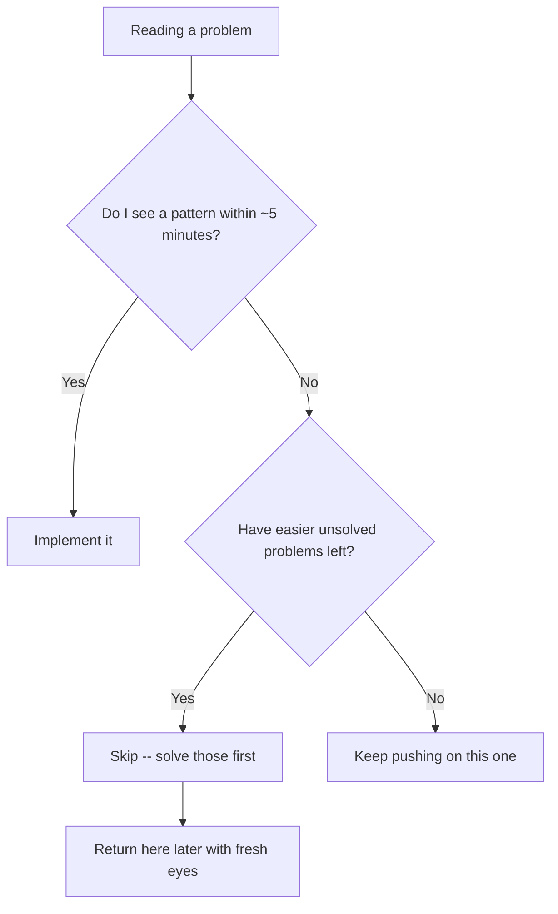

Interviews reward depth on one problem at a time. Contests reward
**breadth and speed** across several problems in a fixed window, with a
scoreboard ticking the whole time. The algorithms are the same ones from
earlier phases -- what changes is the meta-game: which problem to read
first, how long to spend before giving up, and how to debug when the
clock is the real opponent.

## What you'll learn

- Why **constraints in the problem statement are a spoiler** for the
  intended time complexity.
- How to **manage time** across a contest: what to attempt first, when to
  skip.
- The **LeetCode contest** workflow -- format, rating, virtual contests.
- The **Codeforces** workflow -- divisions, rating, virtual contests, and
  upsolving.
- How to **debug under time pressure** and **stress test** a solution
  against a brute force.
- Why having a **template** ready before the contest starts saves real
  minutes.

## Complexity budgets from constraints

Every well-set contest problem gives you $n$ (and sometimes a time
limit) specifically so you can reverse-engineer the intended approach
*before* writing any code. This is the single highest-leverage reading
skill in competitive programming.

| Constraint on n | Expected complexity | Typical approach |
| --- | --- | --- |
| $n \le 10$ | $O(n!)$ or $O(2^n \cdot n)$ | Brute-force permutations or subset enumeration |
| $n \le 20$--$22$ | $O(2^n)$ | Bitmask DP, subset enumeration |
| $n \le 500$ | $O(n^3)$ | Triple nested loops, Floyd-Warshall |
| $n \le 5{,}000$ | $O(n^2)$ | DP tables, pairwise comparisons |
| $n \le 10^5$--$10^6$ | $O(n \log n)$ | Sorting, heaps, segment trees, binary search |
| $n \le 10^7$--$10^8$ | $O(n)$ | Linear scans, two pointers, prefix sums |
| $n \le 10^{18}$ | $O(\log n)$ or $O(1)$ | Binary search on the answer, matrix exponentiation, closed-form math |

:::tip[Read the constraints before the statement's third paragraph]
Strong competitive programmers often skim straight to the constraints
section first. If $n \le 5{,}000$, an $O(n^2)$ solution is not just
allowed -- it's very likely the *intended* one, and time spent hunting for
an $O(n \log n)$ trick may be wasted relative to just implementing the
straightforward $O(n^2)$ approach correctly and quickly.
:::

### The budget, adjusted for Python

The table above is the standard one, and it assumes a C++-speed constant factor. **Pure-Python
loops run roughly 10-100x slower**, so shift the practical figure down about one order of
magnitude: $10^7$ simple operations per second is a safer working number than $10^8$.

What does *not* pay that tax is work pushed into C:

| Slow in Python | Fast equivalent | Why |
| --- | --- | --- |
| `for` loop summing a list | `sum(lst)` | The loop runs in C |
| Building a string with `+=` | `"".join(parts)` | Avoids quadratic reallocation |
| `x in some_list` | `x in some_set` | $O(n)$ becomes $O(1)$ |
| `lst.pop(0)` / `lst.insert(0, x)` | `collections.deque` | $O(n)$ becomes $O(1)$ |
| Hand-written sort or heap | `sorted`, `heapq`, `bisect` | All C implementations |
| `input()` in a loop | `sys.stdin.readline` or one `sys.stdin.read().split()` | See Phase 2's Fast IO page |

So an $O(n \log n)$ solution at $n = 10^6$ is comfortable in C++ and marginal in CPython if the
inner work is Python-level. The usual fixes, in order of how much they buy: switch to PyPy where the
judge offers it, push the hot loop into a built-in, or accept a worse asymptotic bound with a much
better constant.

### Diagnosing a TLE

A time-limit-exceeded verdict has exactly three causes, and they need different responses:

1. **The complexity class is wrong.** You wrote $O(n^2)$ where the constraint demanded
   $O(n \log n)$. Re-read the constraint block -- it told you the intended bound before you started.
2. **The class is right and the constant is not.** Python-level loops, per-iteration allocation,
   string concatenation, `in` on a list. Same algorithm, C-level primitives.
3. **The bound is not over what you think.** Binary search on the answer is $O(n \log R)$ in the
   *value* range; knapsack is $O(nW)$ in the *capacity*. Both are routinely quoted as functions of
   `n` alone, and both blow up when the other variable is large.

Check 1 and 3 before rewriting anything. Rewriting for constant factor when the class is wrong is
the most expensive mistake available in a timed contest.

## Time management

A contest is a scoring problem, not a correctness problem in isolation --
partial credit for fast, safe points usually beats a heroic attempt at the
hardest problem on the set.

- **Read every problem's statement and constraints first**, in order,
  before committing to solve any one of them -- five minutes of
  reconnaissance can save twenty minutes of solving the wrong problem
  first.
- **Solve in roughly increasing difficulty**, but skip ahead if an early
  problem isn't clicking -- points from a later, easier-for-you problem
  count the same as points from an earlier one.
- **Set a mental time box per problem.** If you haven't found an approach
  in the time you've budgeted, move on and come back later rather than
  spiraling.
- **Bank the easy points before chasing the hard ones.** A contest lost
  on a silly bug in problem A while problem D sits unread is a worse
  outcome than a clean sweep of A through C.



## LeetCode contest workflow

- **Format:** Weekly and Biweekly contests, four problems in 90 minutes,
  roughly increasing in difficulty and points.
- **Rating:** an ELO-style number that moves based on your rank relative
  to other participants each contest -- consistency across many contests
  matters more than any single result.
- **Penalties:** wrong submissions cost time-adjusted points, so test
  locally before submitting rather than using the judge as your debugger.
- **Virtual contests:** missed a live contest? Take it later under
  timed conditions -- the practice value is nearly identical even though
  it doesn't count toward rating.
- **After the contest:** read editorial solutions for anything you didn't
  finish, and **upsolve** (solve it properly afterward) rather than just
  reading the answer.

## Codeforces workflow

- **Divisions:** Div. 4 and Div. 3 target newer competitors with gentler
  early problems; Div. 2 is the mainstream bracket; Div. 1 (and combined
  Div. 1 + 2 rounds) target higher-rated competitors. Pick the division
  that matches your current rating.
- **Rating:** also ELO-style, but with a longer history and more
  established bands (see the roadmap page for rating-to-focus mapping).
- **Virtual contests:** Codeforces lets you run any past contest as a
  timed virtual round, complete with the original problems and time
  limit -- one of the best practice tools available, since it simulates
  real contest pressure on demand.
- **Upsolving:** after a round ends, keep working on problems you didn't
  finish using the same submission system -- this is where most rating
  gains actually come from over time, not from the live round itself.

:::note[Virtual contests are underused]
New competitors often only ever compete live, then stop practicing
between rounds. Running a virtual contest on a past round -- timed, no
looking at the editorial until you're done or stuck -- is one of the
highest-value ways to spend practice time, because it forces the same
time-pressure decisions as a live round.
:::

## Debugging under time pressure

- **Isolate the failing function** and test it directly with the sample
  input rather than re-running the whole program repeatedly.
- **Check the boundaries first**: $n = 0$, $n = 1$, all-equal values, and
  the largest allowed input -- boundary bugs are the most common source
  of wrong answers in a rushed solution.
- **Look for off-by-one errors** around loop bounds and array indices
  before assuming the *algorithm* is wrong -- most contest bugs are
  implementation bugs, not conceptual ones.
- **Print intermediate state sparingly and remove it before submitting**
  -- a stray debug `print` can silently break judges that check output
  exactly.

## Stress testing

When a solution passes the sample cases but fails a hidden test, generate
random small inputs, run both a brute-force reference and your fast
solution, and compare outputs until you find a mismatch.

```python title="stress_test.py" showLineNumbers{1}
import random


def brute_force(nums, target):
    for i in range(len(nums)):
        for j in range(i + 1, len(nums)):
            if nums[i] + nums[j] == target:
                return sorted((i, j))
    return None


def fast_solution(nums, target):
    seen = {}
    for i, value in enumerate(nums):
        complement = target - value
        if complement in seen:
            return sorted((seen[complement], i))
        seen[value] = i
    return None


def is_valid(nums, target, answer, reference):
    """Two Sum has many valid answers, so check validity -- not equality."""
    if answer is None:
        return reference is None            # only None when no pair exists at all
    i, j = answer
    return i != j and nums[i] + nums[j] == target


for trial in range(200):
    size = random.randint(2, 8)
    nums = [random.randint(-10, 10) for _ in range(size)]
    target = random.randint(-10, 10)

    reference = brute_force(nums, target)
    actual = fast_solution(nums, target)

    if not is_valid(nums, target, actual, reference):
        print("MISMATCH on trial", trial, nums, target, "reference", reference, "got", actual)
        break
else:
    print("All 200 random trials matched.")
```

:::caution[Comparing outputs directly here would report a bug that is not one]
Written the obvious way -- `if expected != actual` against the brute force's return value -- this
harness fires on **8 of 200** random trials. Not because either function is wrong, but because
Two Sum has many valid answers and the two functions find *different* ones:

`nums = [3, 1, 2, 0]`, `target = 3`. The brute force scans `i` then `j` and returns `[0, 3]`
(`3 + 0`). The hash version returns as soon as a complement is in the map, giving `[1, 2]`
(`1 + 2`). Both are correct.

This is the most common way stress testing gets abandoned: the first mismatch is a false positive,
so the technique looks broken. Two fixes, and you need one of them **whenever the answer is not
unique**:

- **Validate rather than compare** -- check that the returned answer satisfies the problem, as
  `is_valid` does above. Use `reference` only for the "no answer exists" case.
- **Compare a canonical value** -- have both functions return something unique, like the *count*
  of valid pairs or the lexicographically smallest one.

Direct comparison is correct only when the answer genuinely is unique: a maximum value, a count, a
sorted list. For "return any valid X", it will always eventually produce a mismatch that is not a
bug.
:::

## Template preparation

Walking into a contest with a ready-made template -- fast input reading
(see Phase 2's **Fast IO and Beating TLE**), common imports (`heapq`,
`collections.deque`, `bisect`, `math.gcd`), and a scaffold for reading
multiple test cases -- saves real minutes on every single problem, not
just the hard ones.

## Contest-day checklist

| Before the contest | During the contest |
| --- | --- |
| Templates for fast IO and common imports ready to paste | Read constraints before committing to an approach |
| Editor/IDE shortcuts and run configuration tested | Solve roughly in order, skip if stuck past your time box |
| Know the judge's time and memory limits | Test locally against samples before submitting |
| Full night's sleep -- contest performance drops sharply when tired | Stress test against a brute force if a submission fails silently |
| Warm up with one easy problem beforehand | Upsolve unfinished problems immediately after, while it's fresh |

## Pitfalls

- **Using the judge as a debugger.** Wrong submissions cost time-adjusted points on LeetCode and a
  flat penalty on Codeforces. Test locally against the samples, then submit once. A submit-and-see
  loop is the most expensive habit in competitive programming.
- **Comparing outputs in a stress test when the answer is not unique.** The single most common
  stress-testing mistake, and it wastes the technique's whole value -- you chase a "bug" that is
  two equally valid answers. See the caution in the stress-testing section below; compare a
  *canonical* value, or **validate** the answer rather than matching it.
- **Chasing an $O(n \log n)$ trick when $n \le 5{,}000$.** The constraint said $O(n^2)$ was
  intended. Twenty minutes hunting for elegance while problems C and D sit unread is a strictly
  worse outcome than a fast, correct quadratic solution.
- **Not reading every statement first.** Five minutes of reconnaissance routinely reveals that
  problem C is easier for you than problem B. Points are points; the letters are not a ranking of
  *your* difficulty.
- **Spiralling on one problem.** Without a time box, one hard problem eats the contest. If no
  approach has appeared in your budgeted time, leave -- and come back with fresh eyes, which
  genuinely works.
- **Assuming the algorithm is wrong when the bug is an off-by-one.** Most contest failures are
  implementation bugs, not conceptual ones. Check loop bounds, inclusive-versus-exclusive ranges,
  and the `n = 0` / `n = 1` cases before you throw the approach away.
- **A stray debug `print` left in.** Judges compare output exactly, so a leftover trace is a wrong
  answer on a correct solution. Print to `sys.stderr` if you must print at all -- judges ignore it.
- **Forgetting to reset global state between test cases.** A multi-test-case problem with a
  module-level `visited` set or a memo that persists across cases fails from the second case on --
  and passes the sample, which usually has one case. Reset inside the per-case function.
- **Reading input with `input()` in a loop.** At $10^5$ lines this alone can TLE a correct
  solution. `sys.stdin.readline`, or read everything at once and split.
- **Integer division and negative numbers.** Python's `//` floors, so `-7 // 2` is `-4`, not `-3`
  as C++ gives. If a problem's formula was written with C++ truncation in mind, use
  `int(a / b)` or `math.trunc`, and be careful with `%` too -- Python's result takes the divisor's
  sign.
- **Never upsolving.** Reading the editorial is not upsolving. Most rating gain comes from
  finishing the problems you could not finish, in the judge, afterwards.
- **Only ever competing live.** Virtual contests on past rounds reproduce the same time pressure on
  demand, and they are the most underused practice tool available.

## 🧪 Try It Yourself

<DataCampExercise
  lang="python"
  hint={`n <= 5,000 lands in the O(n^2) row of the constraint table -- fill in that string.`}
  code={`# Task: complete the missing complexity bucket.
def expected_complexity(n):
    if n <= 20:
        return "O(2^n)"
    elif n <= 5000:
        return ___
    else:
        return "O(n log n) or better"

print(expected_complexity(2000))`}
  solution={`def expected_complexity(n):
    if n <= 20:
        return "O(2^n)"
    elif n <= 5000:
        return "O(n^2)"
    else:
        return "O(n log n) or better"

print(expected_complexity(2000))`}
  sct={`test_output_contains("O(n^2)")
success_msg("n <= 5,000 is squarely in O(n^2) territory -- DP tables and pairwise checks both fit comfortably.")`}
  height={170}
/>

## Practice

Contest-shaped problems: the ones where reading the constraints tells you the intended complexity before you have an algorithm. Practise deriving the target bound first.

<ProblemLadder pattern={["binary-search-on-answer", "heaps-and-priority-queues", "two-pointers", "number-theory-for-competitive-programming"]} />

## Interview follow-ups

Contests are not interviews, but the two questions below come up constantly -- once from
interviewers about your competitive background, and once from yourself when a submission fails.

| The question | What it is really asking | The answer |
| --- | --- | --- |
| "You compete. How does that help here?" | Whether you can frame it usefully | Implementation speed and debugging under pressure, plus reading constraints to size an approach. Not "it makes me a better engineer" -- that claim invites disagreement and is not what contests train |
| "Contest code is not production code. Do you know the difference?" | Self-awareness | Yes, and name the specifics: single-letter names, no validation, global state, no tests. Contest code optimises for minutes-to-correct; production code optimises for the next reader. Both are correct in context |
| "Your submission TLE'd. What do you check first?" | Diagnosis order | Whether the *class* is wrong, then whether the bound is over the variable you assumed ($O(nW)$, $O(n \log R)$), and only then the constant factor. Rewriting for constant when the class is wrong wastes the round |
| "Wrong answer, but the samples pass. Now what?" | Method over guessing | Stress test against a brute force on small random inputs -- and validate rather than compare when the answer is not unique. Also check the boundaries: `n = 0`, `n = 1`, all-equal, maximum size |
| "Why not just resubmit and see?" | Cost awareness | Penalties are real: time-adjusted points on LeetCode, a flat penalty on Codeforces. The judge is a grader, not a debugger, and treating it as one loses more points than the bug did |
| "How do you decide to abandon a problem?" | Whether you have a rule or a feeling | A pre-set time box. If no approach has appeared within it and easier problems remain unsolved, leave and return later. Points are points, and the letters are not ordered by *your* difficulty |
| "How do you actually improve?" | Whether practice is deliberate | Upsolving in the judge after the round -- not reading editorials -- plus virtual contests on past rounds for time-pressure reps. Most rating gain comes from finishing what you could not finish live |

## Self-check

<Quiz
  questions={[
    {
      q: "A problem gives n <= 5,000. What should you conclude?",
      options: [
        "An O(n log n) solution is required; look for the trick",
        "O(n^2) is very likely the intended solution -- implement it correctly and quickly",
        "The constraint is probably a typo",
        "You need O(n) because the time limit is usually tight",
      ],
      answer: 1,
      explain:
        "5,000 squared is 25 million, comfortably inside a one-second budget even in Python if the inner work is cheap. A setter who wanted O(n log n) would have written 10^5 or larger. Spending twenty minutes hunting for elegance while later problems sit unread is a strictly worse outcome than a fast, correct quadratic.",
    },
    {
      q: "Your stress test compares brute_force and fast_solution outputs for Two Sum and reports a mismatch on trial 29. What is the most likely explanation?",
      options: [
        "The fast solution has a genuine bug in its hash-map logic",
        "Two Sum has many valid answers, and the two functions found different correct pairs",
        "The random generator produced an invalid input",
        "The brute force is wrong for negative numbers",
      ],
      answer: 1,
      explain:
        "Written with direct comparison, this exact harness fires on 8 of 200 trials. On [3, 1, 2, 0] with target 3, the brute force returns [0, 3] and the hash version returns [1, 2] -- both correct. Whenever the answer is not unique, either validate the answer against the problem's condition or make both functions return something canonical, such as a count.",
    },
    {
      q: "When is direct output comparison the right way to stress test?",
      options: [
        "Always -- it is the definition of a stress test",
        "Only when the answer is genuinely unique: a maximum value, a count, a sorted list",
        "Only when both solutions use the same algorithm",
        "Only when the inputs are small",
      ],
      answer: 1,
      explain:
        "Uniqueness is the precondition. \"Return the maximum sum\" has one answer; \"return any pair summing to k\" has many, and comparing those will eventually produce a mismatch that is not a bug. Getting a false positive on the first mismatch is the usual reason people conclude stress testing does not work and stop using it.",
    },
    {
      q: "A correct O(n log n) solution TLEs in Python. What do you check first?",
      options: [
        "The constant factor -- rewrite the hot loop with built-ins",
        "Whether the complexity class is actually wrong, and whether the bound is over the variable you assumed",
        "Whether the judge is slow today",
        "Switch languages immediately",
      ],
      answer: 1,
      explain:
        "Cheapest checks first. The class may simply be wrong -- re-read the constraint, which told you the intended bound before you started. Then check the variable: binary search on the answer is O(n log R) in the *value* range and knapsack is O(nW) in the *capacity*, both routinely misquoted as functions of n. Only after those does constant-factor work make sense; rewriting for constant when the class is wrong is the most expensive mistake in a timed contest.",
    },
    {
      q: "A multi-test-case problem passes the sample but fails from the second case onward on the judge. Most likely cause?",
      options: [
        "The input parsing is wrong",
        "Global or module-level state -- a visited set, memo, or counter -- is not reset between cases",
        "The time limit is exceeded on later cases",
        "The output format needs a blank line between cases",
      ],
      answer: 1,
      explain:
        "The signature is passing case one and failing the rest, and the sample usually has a single case so it hides the bug completely. An `lru_cache` that survives across cases is the same failure in a different costume. Reset state inside the per-case function, or build it fresh each time.",
    },
    {
      q: "In Python, `-7 // 2` evaluates to what, and why does it matter in contests?",
      options: [
        "-3, matching C++ truncation",
        "-4, because Python floors -- so a formula written with C++ truncation in mind needs int(a / b) or math.trunc",
        "-3.5, since // returns a float for negatives",
        "It raises a ValueError",
      ],
      answer: 1,
      explain:
        "Python floors toward negative infinity; C++ truncates toward zero. Translate a formula from an editorial written in C++ and every negative input silently drifts by one. The same asymmetry applies to `%`: Python's result takes the sign of the divisor, so -7 % 2 is 1, not -1.",
    },
    {
      q: "What produces the most rating gain over time?",
      options: [
        "Competing in every live round",
        "Upsolving in the judge after the round, plus virtual contests on past rounds",
        "Reading editorials for every problem you did not solve",
        "Memorising templates for common algorithms",
      ],
      answer: 1,
      explain:
        "Live rounds measure; practice improves. Upsolving means actually getting the accepted verdict on what you could not finish -- reading the editorial and nodding is not the same thing, because it skips the implementation, which is where contest failures actually live. Virtual contests reproduce time pressure on demand and are the most underused tool available.",
    },
  ]}
/>

## Recall card

- **Read the constraints before the statement.** They name the intended complexity, and that
  prunes the approach space in seconds.
- **`n` to bound**: &lt;=10 factorial · &lt;=22 $O(2^n)$ · &lt;=500 $O(n^3)$ · &lt;=5,000 $O(n^2)$ ·
  &lt;=$10^6$ $O(n \log n)$ · &lt;=$10^7$ $O(n)$ · $10^{18}$ $O(\log n)$ or a formula.
- **Shift the budget down ~10x for pure Python.** $10^7$ operations per second, not $10^8$ -- work
  pushed into C (`sum`, `sorted`, `heapq`, `set`, `join`) does not pay the tax.
- **Read every problem first.** C is often easier *for you* than B. Points are points.
- **Time-box each problem** and leave when it expires. Returning with fresh eyes works.
- **When $n \le 5{,}000$, write the $O(n^2)$.** The constraint said so.
- **Never use the judge as a debugger** -- penalties are real. Test locally, submit once.
- **Stress test with a brute force**, and **validate rather than compare when the answer is not
  unique** -- otherwise the first mismatch is a false positive and you abandon the technique.
- **TLE diagnosis order**: wrong class -> wrong variable ($O(nW)$, $O(n \log R)$) -> constant
  factor. Never reverse it.
- **Reset global state between test cases.** Passing case 1 and failing the rest is the signature.
- **`-7 // 2` is `-4`**, not `-3`. Python floors; C++ truncates. Same for `%`.
- **Strip debug prints** -- judges compare exactly. Use `sys.stderr` if you must.
- **Upsolve in the judge, not in the editorial**, and use virtual contests for time-pressure reps.
  That is where rating actually comes from.

## Recap

- Constraints are a spoiler for the intended complexity -- read them
  before committing to an approach.
- Solve roughly in order of difficulty, skip when stuck, and bank easy
  points before chasing hard ones.
- LeetCode and Codeforces both reward consistent participation over
  single big results -- use virtual contests and upsolving between rounds.
- When a solution fails silently, stress test it against a brute-force
  reference with random small inputs rather than guessing at the bug.

Next: **Study Plans and Roadmap** -- turning this whole site's phases into
a week-by-week interview prep plan and a competitive-programming ladder.
