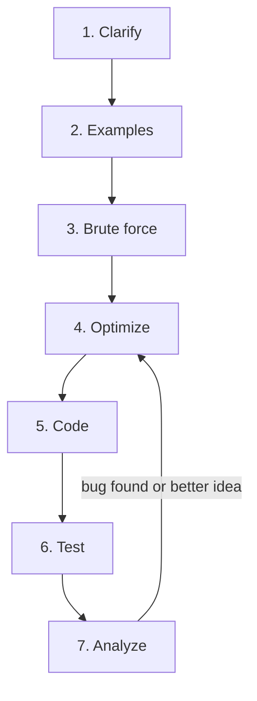

import DataCampExercise from "../../../../components/DataCampExercise.astro";

import ProblemLadder from "../../../../components/dsa/ProblemLadder.astro";
import Quiz from "../../../../components/Quiz.astro";

Knowing every pattern in this site doesn't help if you freeze the moment
someone reads you a problem out loud. The coding interview is a
**communication test wrapped around a coding test** -- the interviewer is
watching how you think, not just whether you eventually produce working
code. This page is the playbook: the shape of the loop you'll face, a
repeatable seven-step framework for any problem, and what to actually say
at each step.

## What you'll learn

- The typical **FAANG-style interview loop** -- phone screen through onsite.
- A repeatable **seven-step framework**: clarify, examples, brute force,
  optimize, code, test, analyze.
- What to **say out loud** at each step, and what the interviewer is
  quietly scoring.
- How to **get unstuck** without going silent for five minutes.
- How to talk through **complexity analysis** like it's second nature.
- The most common ways candidates lose points, and a brief look at
  **behavioral** basics.

## The interview loop

Most FAANG-style processes follow the same rough shape, whether the
company calls it "phone screen + onsite" or "loop":

| Stage | Format | What it's testing |
| --- | --- | --- |
| Recruiter screen | 20-30 min call | Background fit, basic expectations |
| Phone / online assessment | 1-2 coding problems, 45-60 min | Can you solve problems at all |
| Onsite: coding rounds (x2-3) | 45 min each, live or shared editor | Patterns, correctness, communication |
| Onsite: system design (mid/senior) | 45-60 min | Trade-offs at scale, not DSA |
| Onsite: behavioral | 30-45 min | Collaboration, ownership, conflict handling |

The coding rounds are where this whole site pays off directly -- and
they're graded less on "did you get the optimal answer instantly" and more
on "did you get there through a process I'd trust in a teammate."

:::note[Every round is independent]
A rough round doesn't necessarily sink the loop -- most companies average
signal across rounds rather than requiring a clean sweep. That's a reason
to recover calmly from a stumble instead of spiraling for the rest of the
interview.
:::

## The seven-step framework

Run every problem through the same sequence, in the same order, every
time. Interviewers have seen hundreds of candidates skip straight to
coding -- doing the earlier steps *out loud* is itself a huge signal.

### 1. Clarify

Restate the problem in your own words and ask about the shape of the
input before writing a single line of code.

**Say:** "So given an array of integers, I need to return the two indices
whose values sum to a target -- can the array have duplicates? Is it
always sorted? What should I return if there's no valid pair?"

**Scored on:** whether you notice edge cases the prompt didn't spell out
-- empty input, negative numbers, duplicates, integer overflow (less of a
concern in Python, but worth mentioning for languages that have it).

### 2. Examples

Write down (or ask to write down) one small example by hand, and one edge
case. This surfaces misunderstandings before they're baked into code.

**Say:** "Let me trace a quick example: `[2, 7, 11, 15]` with target `9`
should give indices `0, 1`. And an empty array, or no valid pair, should
give... what would you like for that case?"

**Scored on:** catching ambiguity early is cheaper than catching it after
you've written twenty lines of code around the wrong assumption.

### 3. Brute force

State the naive $O(n^2)$-or-worse solution out loud, even if you never
type it. It proves you understand the problem and gives you a baseline to
optimize from.

**Say:** "The brute force is to check every pair with a nested loop --
that's $O(n^2)$ time, $O(1)$ space. I think we can do better with a hash
map."

**Scored on:** never skip this step even when the optimal approach is
obvious to you -- naming the brute force shows you can *recognize* why the
optimization is an improvement, not just recite a memorized answer.

### 4. Optimize

This is where **pattern recognition** does the heavy lifting -- see the
**Pattern Recognition Guide** (next page) for the cue-to-pattern lookup.
Name the pattern and the trade-off before coding it.

**Say:** "Sorted array plus pair-sum is the cue for two pointers -- or
since this one isn't sorted, a hash set trades $O(n)$ space for a single
$O(n)$ pass instead of sorting first."

**Scored on:** articulating *why* the optimization works, not just that
it exists.

### 5. Code

Write clean, working code -- meaningful variable names, small helper
functions where they help readability, and a narration of what you're
doing as you type so the interviewer isn't watching you in silence.

**Say:** "I'll use a dictionary mapping value to index as I scan once
left to right, checking for the complement before inserting the current
value."

**Scored on:** syntax correctness matters less than most candidates fear
-- structure, naming, and whether the code matches the approach you just
described matter more.

### 6. Test

Trace your own code against the examples from step 2 by hand, out loud,
before the interviewer asks you to. Then check the edge cases.

**Say:** "Let me trace this against `[2, 7, 11, 15]`, target `9`... at
index 0, value 2, complement 7 isn't in the map yet, so I insert 2. At
index 1, value 7, complement 2 *is* in the map -- return `[0, 1]`.
Matches."

**Scored on:** finding your own bugs before being told about them is one
of the strongest signals in the whole interview.

### 7. Analyze

State the final time and space complexity, and mention any trade-offs
against the brute force or alternative approaches.

**Say:** "This is $O(n)$ time and $O(n)$ space -- trading memory for
speed compared to the $O(n^2)$ brute force, or $O(n \log n)$ if we sorted
first and used two pointers."

## Communication tips

- **Think out loud, always.** Silence for more than about 30 seconds
  reads as "stuck," even if you're actually making progress in your head.
- **Narrate before you type.** Say what you're about to code, then code
  it -- don't make the interviewer reverse-engineer your plan from
  keystrokes.
- **Ask, don't assume.** Constraints on input size, value ranges, and
  expected output format are all fair game to ask about, and asking is
  free signal.
- **State assumptions if no answer is available.** "I'll assume the array
  fits in memory and values can be negative" keeps you moving without
  waiting on an answer that may not come.

## Getting unstuck

Going quiet is the worst thing you can do when stuck. Instead:

1. **Re-read the constraints.** Constraints often hint at the intended
   complexity -- see **Contest Strategy** later in this phase for the
   constraint-to-complexity table, which applies just as much to
   interviews.
2. **Fall back to the brute force.** A working $O(n^2)$ solution beats a
   broken $O(n)$ one -- say so, and offer to optimize if time allows.
3. **Ask for a hint.** "Is there a data structure that would help me look
   up values faster here?" is a completely normal thing to ask, and most
   interviewers will nudge you.
4. **Simplify the problem.** Solve a smaller or restricted version first
   (ignore duplicates, assume sorted input) and generalize once that
   works.
5. **Time-box it.** If five minutes pass with no progress, say what
   you're stuck on explicitly rather than staring silently -- that's
   still a demonstration of process.

## Pitfalls

- **Jumping straight to code** without stating an approach -- the
  interviewer can't follow your reasoning if there isn't any spoken
  reasoning.
- **Debugging in silence.** Narrate what you're checking as you trace
  through the code, the same way you would for the initial test step.
- **Ignoring edge cases** until asked -- empty input, single element, all
  duplicates, and negative numbers are worth a mention even if the
  interviewer doesn't bring them up first.
- **Skipping the complexity statement** at the end -- always say it,
  even if it feels obvious.
- **Over-engineering.** Building a fully generic, configurable solution
  for a 45-minute problem burns time better spent on correctness and
  testing.
- **Optimising before stating the brute force.** The most common process failure, and it costs
  you even when the optimal answer is right -- the interviewer cannot tell whether you *derived*
  it or *recalled* it. Thirty seconds of "the brute force is $O(n^2)$ nested loops" buys the
  benefit of the doubt for the whole round.
- **Answering the question you recognised instead of the one asked.** A problem that looks like
  Two Sum but returns *values* rather than indices, or allows reuse of an element, is a different
  problem. Step 1 exists to catch exactly this, and pattern recognition is what makes you
  vulnerable to it.
- **Silent debugging.** The single behaviour most likely to turn a passing round into a failing
  one. When you spot a bug, say what you saw and what you are checking. A found-and-narrated bug
  is a *positive* signal; the same bug found in silence looks like flailing.
- **Treating a hint as a failure.** Interviewers nudge on purpose, and taking a hint gracefully
  scores better than a long silence. Refusing to ask when stuck is the actual penalty.
- **Spiralling after a rough round.** Rounds are usually averaged, not gated. Recovering calmly is
  a graded behaviour in itself.
- **Untested code offered as finished.** Saying "I think that's it" and stopping hands the testing
  step to the interviewer. Trace it yourself, out loud, unprompted -- finding your own bug first
  is one of the strongest signals available to you.
- **Editing without re-tracing.** After a fix, re-run the trace. A change made under pressure that
  breaks a case you already verified is worse than the original bug, because it reads as
  guess-and-check rather than reasoning.
- **Burning the clock on naming and generality.** A configurable, fully abstracted solution to a
  45-minute problem is time taken from correctness and testing. Clear names, small helpers, stop.

## Behavioral basics

A short behavioral round or a few behavioral questions embedded in a
coding round are common. The **STAR** structure keeps answers concise:

| Letter | Meaning |
| --- | --- |
| Situation | The context -- one or two sentences, no more. |
| Task | What you specifically were responsible for. |
| Action | What *you* did -- first person, concrete steps. |
| Result | The outcome, ideally with a number or clear takeaway. |

Prepare two or three stories in advance (a conflict, a failure, a project
you're proud of) so you're not improvising STAR structure live -- the
content matters less than answering in a focused, complete way.

## Complexity

Step 7 is the one candidates rush, and it is the cheapest signal in the whole round. You are not
being asked to recite a bound -- you are being asked to show you know *where the cost lives*.

**Say the shape, then the number.** "It is one pass over the array with a constant-time hash
lookup per element, so $O(n)$ time; the map holds at most `n` entries, so $O(n)$ space." That is
better than "$O(n)$ time, $O(n)$ space" because it is checkable — an interviewer can hear whether
your model matches your code.

Bounds you should be able to state without pausing, because they are the ones you will actually
have written:

| Your code contains | The honest bound | The mistake to avoid |
| --- | --- | --- |
| A sort, then a linear scan | $O(n \log n)$ | Quoting $O(n)$ because the scan is the interesting part -- the sort dominates |
| A `while` inside a `for`, monotonic stack style | $O(n)$ **amortised** | Quoting $O(n^2)$ from the nesting. Each element is pushed and popped once |
| A heap bounded at `k` | $O(n \log k)$ | Quoting $O(n \log n)$ -- bounding the heap is the whole point |
| Binary search on the answer | $O(n \log R)$, `R` the **value** range | Quoting $O(n \log n)$; the log is over values, not elements |
| Recursion | $+ O(h)$ **space**, invisible in the source | Forgetting stack frames entirely -- and CPython dies at ~1000 |
| A DP table | states x transitions | Reading off the table size and ignoring an $O(n)$ inner loop |
| Knapsack-style DP | $O(nW)$, pseudo-polynomial | Calling it polynomial. It is polynomial in the *capacity*, not the input length |
| `x in some_list` inside a loop | $O(n^2)$ | The most common accidental blow-up in Python. `in` on a set is $O(1)$ |
| `list.insert(0, x)` or `list.pop(0)` | $O(n)$ each | Use `collections.deque` -- $O(1)$ at both ends |
| String concatenation in a loop | $O(n^2)$ | Build a list and `"".join` it |

**Two follow-ups that always come after step 7.** "Can you do better on space?" -- usually yes, by
trading a hash map for sorting plus two pointers, or by rolling a DP table down to one row. And
"what dominates if `n` is huge?" -- name the term, not the whole expression.

**Amortised is a word worth using correctly.** `list.append` is $O(1)$ amortised and $O(n)$ on the
resize that copies. Over `n` appends the total is $O(n)$, so amortised is the honest figure for a
loop. Saying "amortised" when you mean it, and "worst case" when you mean that, is a small thing
that reads as precision.

## 🧪 Try It Yourself

<DataCampExercise
  lang="python"
  hint={`The framework runs Clarify, Examples, Brute force, Optimize, Code, Test, Analyze in that order -- the missing step comes right after "Brute force."`}
  code={`# Task: fill in the missing step of the seven-step framework.
steps = ["Clarify", "Examples", "Brute force", ___, "Code", "Test", "Analyze"]
print(steps[3])`}
  solution={`steps = ["Clarify", "Examples", "Brute force", "Optimize", "Code", "Test", "Analyze"]
print(steps[3])`}
  sct={`test_output_contains("Optimize")
success_msg("Brute force always comes before optimize -- naming the naive approach first is what proves you understand the problem.")`}
  height={150}
/>

## Practice

High-frequency loop problems across the four patterns that dominate phone screens. Use the seven-step framework on each rather than racing to code.

<ProblemLadder pattern={["two-pointers", "hash-tables", "heaps-and-priority-queues", "one-dimensional-dp"]} />

## Interview follow-ups

The questions that follow a working solution -- and what each one is actually testing.

| They ask | What they're checking | The answer that works |
| --- | --- | --- |
| "Can you do better?" | Whether you know your own bound is not the floor | Name the specific bottleneck, not a vague yes: "the sort dominates at $O(n \log n)$; if the values are bounded I can bucket them and get $O(n)$." If you genuinely believe it is optimal, say why -- "we must read every element, so $O(n)$ is a lower bound" |
| "Can you reduce the space?" | Space as a first-class axis | Usually yes, and usually by trading time: sort plus two pointers instead of a hash map ($O(1)$ vs $O(n)$, at $O(n \log n)$ vs $O(n)$), or rolling a 2D DP down to one row |
| "What if the input doesn't fit in memory?" | Whether the approach survives streaming | Single-pass, $O(1)$-space approaches survive -- fast/slow pointers, a bounded heap, a rolling hash. Anything needing a full sort or random access becomes an external merge |
| "What if this were called a million times?" | Preprocessing versus per-query cost | Shift work to a one-time build: prefix sums, a precomputed map, a segment tree. State both bounds separately -- "$O(n)$ build, $O(1)$ per query" |
| "Now the input is a stream" | Whether your state is bounded | Say what state you must keep and whether it is bounded. A count or a running max is fine; "the whole array so I can sort it" is the answer that fails |
| "Walk me through your code on this input" | Whether you can trace, not just write | Trace it honestly, variable by variable. If it breaks, say so immediately and fix it -- catching it here is a much better outcome than defending it |
| "There's a bug on line 12" | Response to correction | Look, agree if they are right, fix it, re-trace. Do not defend it and do not over-apologise. If you believe the line is correct, walk the input that proves it -- politely, and with the trace |
| "How would you test this?" | Engineering instinct beyond the algorithm | Categories, not examples: empty, single element, all duplicates, all negative, maximum size, and the boundary the algorithm turns on. Naming the *last* one is what distinguishes the answer |
| "Which parts would you extract if this were production code?" | Whether you know interview code is not production code | Input validation, a named helper for the core transform, and the magic numbers as constants -- while saying you deliberately skipped them for the 45-minute version |
| "You have five minutes left and it's not working" | Behaviour under real pressure | State where you are, what you believe is wrong, and what you would do next. A clearly-narrated near-miss is a far better outcome than silence with a broken editor |

## Self-check

<Quiz
  questions={[
    {
      q: "You immediately recognise the problem and know the optimal O(n) solution. Should you still state the brute force?",
      options: [
        "No -- stating a worse solution wastes limited time",
        "Yes -- it shows you can recognise why the optimisation is an improvement, rather than reciting a memorised answer",
        "Only if the interviewer asks for it",
        "Only if the brute force is under O(n^2)",
      ],
      answer: 1,
      explain:
        "The interviewer cannot distinguish derived from recalled unless you show the derivation. Thirty seconds of \"the brute force is nested loops, O(n^2) time and O(1) space, and I think a hash map removes the inner loop\" buys credibility for the whole round -- and it gives you a fallback you have already described if the optimal approach falls apart.",
    },
    {
      q: "You find a bug while tracing your own code. What is the best move?",
      options: [
        "Fix it quietly before the interviewer notices",
        "Say what you saw, what you are checking, and fix it out loud",
        "Finish the trace first, then mention it at the end",
        "Start over with a different approach",
      ],
      answer: 1,
      explain:
        "A bug you find and narrate is a positive signal -- it is direct evidence you can verify your own work, which is most of the job. The same bug found in silence looks like flailing, and one found by the interviewer is a missed opportunity. Silent debugging is the behaviour most likely to turn a passing round into a failing one.",
    },
    {
      q: "Your solution sorts the input and then does one linear pass. What complexity should you state?",
      options: [
        "O(n), since the pass is the interesting part",
        "O(n log n) -- the sort dominates",
        "O(n log n) for time and O(n) for space, always",
        "It depends on the sort algorithm, so state a range",
      ],
      answer: 1,
      explain:
        "The dominant term is the answer, and it is the sort. Space depends on the sort: Python's `sorted` is O(n) auxiliary, `list.sort` is in-place but still O(n) worst case for Timsort's merge buffer -- so say which you used rather than defaulting. Claiming O(n) because the scan is where your logic lives is the mistake, and it is an easy one to be caught on.",
    },
    {
      q: "Five minutes are left and your code does not work. What is the strongest thing to do?",
      options: [
        "Keep debugging silently until time runs out",
        "State where you are, what you believe is wrong, and what you would try next",
        "Delete it and write the brute force from scratch",
        "Apologise and ask to attempt a different problem",
      ],
      answer: 1,
      explain:
        "A narrated near-miss is graded far better than a silent failure, because process is most of what is being measured. Naming your hypothesis also gives the interviewer the option to nudge you. Restarting from scratch with five minutes left usually produces nothing at all -- though offering the working brute force *as a fallback you already described* is a legitimate move if you have time to write it.",
    },
    {
      q: "The interviewer says \"there's a bug on line 12.\" You believe line 12 is correct. What do you do?",
      options: [
        "Change it anyway -- the interviewer is the grader",
        "Walk an input through line 12 to show why it holds, politely, and stay open to being wrong",
        "Say it is correct and move on",
        "Rewrite the whole function to sidestep the disagreement",
      ],
      answer: 1,
      explain:
        "Being right matters less than how you resolve a technical disagreement, which is the actual signal -- it predicts code review. A concrete trace is evidence; an assertion is not. Changing working code because you were challenged is worse than the imagined bug, and often the interviewer is probing exactly whether you will fold.",
    },
    {
      q: "\"How would you test this?\" What is the strongest answer?",
      options: [
        "Give two or three concrete example inputs",
        "Name categories -- empty, single element, all duplicates, maximum size, and specifically the boundary the algorithm turns on",
        "Say you would write unit tests with pytest",
        "Say the provided examples are sufficient",
      ],
      answer: 1,
      explain:
        "Categories show you are reasoning about the input space rather than recalling a checklist. The differentiator is the last one: every algorithm has a case it pivots on -- the exact window boundary, the single-element list for a fast/slow pointer, the all-negatives array for a max-subarray. Naming *that* case is what separates this answer from a generic one.",
    },
    {
      q: "\"What if this function were called a million times?\" What is the shift being asked for?",
      options: [
        "Add caching with lru_cache",
        "Move work into a one-time preprocessing step and report the build and per-query costs separately",
        "Rewrite it in a faster language",
        "Parallelise across threads",
      ],
      answer: 1,
      explain:
        "The question is about amortising across queries: prefix sums, a precomputed map, a segment tree. State both bounds -- \"O(n) build, O(1) per query\" -- because a single blended figure hides the trade you just made. `lru_cache` is a real answer when the *arguments* repeat, which is a different situation and worth distinguishing out loud.",
    },
  ]}
/>

## Recall card

- **Seven steps, same order, every time**: clarify · examples · brute force · optimise · code ·
  test · analyse. Doing the early ones *out loud* is itself the signal.
- **Never skip the brute force**, even when the optimal answer is obvious -- it is what shows you
  derived the solution instead of recalling it.
- **Clarify catches the near-miss.** A problem that resembles one you know but returns values
  instead of indices is a different problem. Recognition is what makes you vulnerable to this.
- **Narrate before you type**, and never debug in silence. A bug you find and say out loud is a
  positive signal; the same bug in silence looks like flailing.
- **Test unprompted.** Finding your own bug is among the strongest signals available. After a fix,
  **re-trace** -- an unverified fix reads as guess-and-check.
- **Always state complexity**, as shape then number. Watch the sort that dominates, the `while`
  inside a `for` that is still amortised $O(n)$, the heap that is $\log k$ not $\log n$, and the
  $O(h)$ recursion stack that is invisible in the source.
- **Ask for a hint rather than going quiet.** Refusing to ask is the penalty, not the asking.
- **A working $O(n^2)$ beats a broken $O(n)$** -- say that out loud and offer to optimise if time
  allows.
- **Rounds are averaged, not gated.** Recover calmly; the recovery is graded too.
- **Do not over-engineer.** Clear names, small helpers, stop. Time spent on generality is taken
  from correctness and testing.
- **STAR for behavioural**: Situation (1-2 sentences) · Task (yours) · Action (first person) ·
  Result (with a number). Prepare three stories -- a conflict, a failure, a success.

## Recap

- Every FAANG-style loop mixes coding rounds with system design and
  behavioral rounds -- each is scored mostly independently.
- The seven-step framework -- clarify, examples, brute force, optimize,
  code, test, analyze -- is the same for every problem, and running it out
  loud is itself the signal.
- Getting unstuck means falling back to the brute force, re-reading
  constraints, or asking a targeted question -- never going silent.
- STAR (Situation, Task, Action, Result) keeps behavioral answers short
  and concrete.

Next: **Pattern Recognition Guide** -- the cue-to-pattern lookup table
that powers step 4 (optimize) of the framework above.
