The single biggest difference between someone who's "seen a lot of
problems" and someone who's actually **fast** at interviews and contests
is pattern recognition -- the ability to read a problem statement and, in
seconds, know which of a couple dozen templates it's really asking for.
This page is a reference: a cue-to-pattern table you can scan top to
bottom, and a decision tree for when the wording doesn't immediately ring
a bell.

## What you'll learn

- A single **cue-to-pattern table** covering the array/string/linked-list
  patterns from Phase 5, plus the graph and DP shapes from Phases 6 and 7.
- A **decision tree** for working from problem keywords to a pattern when
  nothing jumps out immediately.
- Where to go on this site to actually learn each pattern in depth.

## The cue-to-pattern table

Read a problem statement, find the phrase closest to what it's describing
in the left column, and you have your starting point.

| Cue in the problem | Pattern | Learn it in |
| --- | --- | --- |
| "sorted array, find a pair/triplet summing to X" | Two pointers | **Two Pointers** |
| "in place, no extra memory" on an array | Two pointers | **Two Pointers** |
| "longest/shortest contiguous subarray or substring" meeting a condition | Sliding window | **Sliding Window** |
| "linked list has a cycle" / "find the middle node" | Fast and slow pointers | **Fast and Slow Pointers** |
| "merge overlapping ranges/meetings/intervals" | Merge intervals | **Merge Intervals** |
| "array contains numbers from 1 to n" (find missing/duplicate) | Cyclic sort | **Cyclic Sort** |
| "reverse a linked list" (whole or in groups of k) | In-place reversal | **In-place Linked List Reversal** |
| "top / k largest / k closest / kth smallest" | Heap (top K) | **Top K Elements** |
| "merge k sorted lists/arrays" | K-way merge | **K-way Merge** |
| "generate all subsets/combinations/permutations" | Backtracking | **Subsets and Combinations** |
| "explore all valid arrangements subject to constraints" (N-Queens, Sudoku) | Backtracking | **Backtracking** |
| "next greater/smaller element", "largest rectangle in histogram" | Monotonic stack | **Monotonic Stack** |
| "answer range sum queries fast", "range update, then query" | Prefix sums / difference array | **Prefix Sums and Difference Arrays** |
| "minimize the maximum" / "maximize the minimum" feasible value | Binary search on answer | **Binary Search on Answer** |
| "fewest steps/moves in an unweighted graph or grid" | BFS | **Breadth First Search** |
| "does a path exist", "explore every connected component" | DFS | **Depth First Search** |
| "number of ways to reach a target", "optimal value given a sequence of choices" | Dynamic programming | Phase 6: **Dynamic Programming** |
| "shortest path with weighted edges" | Dijkstra's algorithm | Phase 7: **Graphs Advanced** |
| "order tasks respecting dependencies" | Topological sort | Phase 7: **Graphs Advanced** |
| "are these two nodes connected", "count connected components" incrementally | Union-Find | Phase 7: **Graphs Advanced** |
| "frequent range queries **and** updates on a large array" | Segment tree / Fenwick tree | Phase 8: **Segment Trees and Lazy Propagation** / **Fenwick Tree** |

:::tip[Cues stack]
Real problems often combine two cues -- "find the k closest points to the
origin" is both "top K" (heap) *and* a distance computation. Match each
clause in the problem to a row, and the combination usually tells you the
whole approach.
:::

## A decision tree for picking a pattern

When no single phrase jumps out, work top-down through the shape of the
input and the shape of the question being asked.

```mermaid title="Picking a pattern from problem keywords"
graph TD
    N0{"What's the input shape?"}
    N0 -- "sorted array + pair/triplet sum" --> N1["Two Pointers"]
    N0 -- "subarray/substring + optimum or count" --> N2["Sliding Window"]
    N0 -- "linked list: cycle or middle" --> N3["Fast and Slow Pointers"]
    N0 -- "linked list: reverse a segment" --> N4["In-place Reversal"]
    N0 -- "array of intervals/ranges" --> N5["Merge Intervals"]
    N0 -- "array holds values 1..n" --> N6["Cyclic Sort"]
    N0 -- "top/k/closest elements" --> N7["Top K Elements (Heap)"]
    N0 -- "merge k sorted inputs" --> N8["K-way Merge"]
    N0 -- "all subsets/permutations/valid arrangements" --> N9["Backtracking"]
    N0 -- "next greater/smaller element" --> N10["Monotonic Stack"]
    N0 -- "range sum, static array" --> N11["Prefix Sums"]
    N0 -- "range sum or update, changing array" --> N12["Segment Tree / Fenwick Tree"]
    N0 -- "minimize the max / maximize the min feasible value" --> N13["Binary Search on Answer"]
    N0 -- "graph: fewest steps, unweighted" --> N14["Breadth First Search"]
    N0 -- "graph: does a path exist, explore all" --> N15["Depth First Search"]
    N0 -- "graph: cheapest path, weighted edges" --> N16["Dijkstra"]
    N0 -- "count ways / optimal value with choices" --> N17["Dynamic Programming"]
```

:::note[When two branches both seem to fit]
It's common for a problem to look like it matches two rows at once --
usually because one is the brute-force framing and one is the optimized
framing. "Count subarrays with sum equal to k" looks like sliding window
at a glance, but negative numbers break the window's monotonic-sum
assumption, so it's really a prefix-sum-plus-hash-map problem instead.
When in doubt, check whether the naive two-pointer/window invariant
actually holds for the given constraints (can values be negative? can the
window need to shrink non-monotonically?) before committing to a pattern.
:::

## How to use this guide

Don't try to memorize the table -- use it as a **checklist** while
practicing. Read a problem, guess the pattern from memory first, *then*
check this page to confirm. Being wrong and correcting yourself here is
what builds the instant recall you want to have live in an interview or a
contest, where there's no lookup table to check.

## Complexity

The pattern you pick commits you to a complexity before you write a line. Reading the constraint
*first* and the problem statement *second* eliminates most of the table above in one step -- if
$n = 10^5$, every $O(n^2)$ pattern is already wrong, whatever the phrasing suggests.

| Pattern | Time | Space | Largest `n` it comfortably handles |
| --- | --- | --- | --- |
| Two pointers | $O(n)$ after an $O(n \log n)$ sort | $O(1)$ | $10^6$ |
| Sliding window | $O(n)$ | $O(k)$ for the window's map | $10^6$ |
| Fast and slow pointers | $O(n)$ | $O(1)$ | $10^7$ |
| Prefix sums / difference array | $O(n)$ build, $O(1)$ query | $O(n)$ | $10^6$ |
| Monotonic stack | $O(n)$ amortised | $O(n)$ | $10^6$ |
| Merge intervals | $O(n \log n)$ (the sort dominates) | $O(n)$ | $10^5$-$10^6$ |
| Cyclic sort | $O(n)$ | $O(1)$ | $10^6$ |
| Top K with a heap | $O(n \log k)$ | $O(k)$ | $10^6$ |
| K-way merge | $O(N \log k)$ over `N` total items | $O(k)$ | $10^6$ |
| Binary search on the answer | $O(n \log R)$, `R` the *value* range | $O(1)$ | $10^5$-$10^6$ |
| BFS / DFS | $O(V + E)$ | $O(V)$ | $10^6$ nodes |
| Dijkstra (binary heap) | $O(E \log V)$ | $O(V)$ | $10^5$-$10^6$ edges |
| Union-Find | $O(\alpha(n))$ per op, effectively $O(1)$ | $O(n)$ | $10^6$ |
| Topological sort | $O(V + E)$ | $O(V)$ | $10^6$ |
| Segment tree / Fenwick | $O(\log n)$ per op | $O(n)$ | $10^5$-$10^6$ |
| 1D dynamic programming | $O(n)$ to $O(n^2)$ | $O(n)$ | $10^4$ if quadratic |
| 2D / interval DP | $O(n^2)$ to $O(n^3)$ | $O(n^2)$ | 500-5,000 |
| Backtracking (subsets) | $O(2^n \cdot n)$ | $O(n)$ depth | ~20-25 |
| Backtracking (permutations) | $O(n! \cdot n)$ | $O(n)$ depth | ~10-12 |

**Read it backwards to narrow the table.** A constraint of `n <= 12` is not generosity -- it is
the problem telling you factorial or subset enumeration is expected, so stop looking for a clever
polynomial one. `n <= 10^5` with a "count the ways" phrasing rules out $O(n^2)$ DP and points at
a one-dimensional recurrence or a prefix-sum trick. `n <= 500` invites $O(n^3)$, which is almost
always interval DP or Floyd-Warshall.

**Two bounds people misread.** Binary search on the answer is $O(n \log R)$ where `R` is the range
of *values*, not `n` -- quoting it as $O(n \log n)$ is wrong and occasionally matters. And a heap
solution is $O(n \log k)$, not $O(n \log n)$: the whole point of bounding the heap at `k` is that
the log term shrinks, which is why Top K beats sorting when `k` is small.

## Pitfalls

Pattern recognition fails in a handful of specific, repeatable ways. All of them are the same
mistake -- matching on the *wording* rather than on whether the pattern's invariant actually holds.

- **Sliding window with negative numbers.** "Count subarrays summing to `k`" reads like a window
  problem and is not. A window only works when growing it moves the sum monotonically; negatives
  break that, so shrinking on "too big" can skip valid answers. The real pattern is prefix sums
  plus a hash map. **Check the value range before committing to a window.**
- **Two pointers on an unsorted array.** The technique depends on knowing which side to move,
  which depends on order. If sorting is not allowed -- because indices must be preserved and the
  problem returns positions -- you need a hash map instead. LC 1 (Two Sum) is the hash-map
  version; LC 167 is the two-pointer version. Same sentence, different pattern, decided entirely
  by one word in the constraints.
- **BFS on a weighted graph.** "Fewest steps" cues BFS, but BFS is only correct when every edge
  costs the same. One weighted edge and you need Dijkstra -- or, if the weights are only 0 and 1,
  [0-1 BFS with a deque](../../phase-10-patterns-graphs/0-1-bfs-and-deque-shortest-paths/). The
  symptom is a plausible wrong answer, never a crash.
- **Greedy where DP is required.** "Maximise the total" cues greedy, but greedy is only correct
  when a local choice can never be regretted. If a later item can make an earlier choice look bad,
  it is DP. Interviewers ask "can you prove the greedy is optimal?" precisely here, and the honest
  answer -- "I cannot, so let me write the DP" -- scores better than a confident wrong greedy.
- **Backtracking when memoisation applies.** Enumerating all paths is exponential; if different
  paths reach the same state, the problem is DP wearing a backtracking costume. The tell is a
  *count* or an *optimum* in the question rather than the arrangements themselves.
- **Matching the noun instead of the question.** "Tree" does not mean tree DP, "graph" does not
  mean Dijkstra, and "string" does not mean KMP. The data structure narrows the field; the
  *question being asked about it* picks the pattern.
- **Committing before reading the constraints.** The single highest-yield habit on this page is
  to read the constraint block first. It rules out more patterns in five seconds than the
  statement does in five minutes.

## 🧪 Try It Yourself

<DataCampExercise
  lang="python"
  hint={`"Longest substring without repeating characters" is a subarray/substring optimization problem, which the table maps to sliding window.`}
  code={`# Task: complete the cue-to-pattern lookup for the missing entry.
cue_to_pattern = {
    "sorted array pair sum": "Two Pointers",
    "longest substring without repeating characters": ___,
    "kth largest element": "Top K Elements",
}

print(cue_to_pattern["longest substring without repeating characters"])`}
  solution={`cue_to_pattern = {
    "sorted array pair sum": "Two Pointers",
    "longest substring without repeating characters": "Sliding Window",
    "kth largest element": "Top K Elements",
}

print(cue_to_pattern["longest substring without repeating characters"])`}
  sct={`test_output_contains("Sliding Window")
success_msg("Contiguous substring plus an optimum (longest, no repeats) is the sliding window cue.")`}
  height={170}
/>

## Practice

The cue-to-pattern table above, as problems. Read each title and constraint set, commit to a pattern out loud, and only then open it — the point of this ladder is the guess, not the solution.

<ProblemLadder pattern={["sliding-window", "two-pointers", "binary-search-template-and-variants", "breadth-first-search", "backtracking", "one-dimensional-dp", "monotonic-stack", "top-k-elements"]} />

## Interview follow-ups

| They ask | What they're checking | The answer |
| --- | --- | --- |
| "What made you pick that pattern?" | Whether recognition is reasoned or memorised | Name the cue *and* the invariant: "the window's sum is monotonic because all values are positive, so shrinking on too-big never skips an answer." A cue alone sounds like pattern-matching; the invariant shows you checked |
| "The values can now be negative. Does your approach still work?" | Whether you know your own assumption | No -- the window invariant breaks. Switch to prefix sums plus a hash map, $O(n)$ time and $O(n)$ space instead of $O(1)$. This is the most common single follow-up in the whole set |
| "Could you do it without sorting?" | Two pointers versus hashing | Sorting destroys original indices. If the answer is a pair of *positions*, a hash map is the right structure; if it is a pair of *values* or the array is already sorted, two pointers wins on space |
| "Why a heap rather than sorting?" | Precision about `k` | $O(n \log k)$ against $O(n \log n)$, and $O(k)$ space against $O(n)$. When `k` is small and `n` is huge -- a stream, or a top-10 over millions -- the difference is real. When `k` is close to `n`, just sort |
| "Some edges now have weight 2. What changes?" | BFS's precondition | BFS is only shortest-path-correct on uniform edge costs. Switch to Dijkstra, $O(E \log V)$. If the weights are only 0 and 1, 0-1 BFS with a deque keeps it linear |
| "Prove your greedy is optimal" | The line between greedy and DP | Exchange argument -- show any optimal solution can be transformed into the greedy one without getting worse. If you cannot construct it, say so and write the DP; a greedy you cannot justify is a coin flip |
| "This looks like backtracking, but `n` is 10^5" | Reading the constraint as a hint | Exponential is off the table, so the problem wants a count or an optimum rather than the arrangements themselves -- that is DP or a greedy, and the constraint said so before the statement did |
| "You matched two patterns. Which and why?" | Handling composition | Say both and how they compose: "k closest points" is a distance computation *feeding* a size-k heap. Most medium-and-up problems are two cues stacked, and naming the seam is the answer |
| "What if the input does not fit in memory?" | Whether the pattern survives streaming | Anything $O(1)$-space and single-pass survives: fast/slow pointers, a bounded heap, a rolling hash. Anything needing random access or a full sort does not -- that becomes an external merge |

## Self-check

<Quiz
  questions={[
    {
      q: "\"Count the subarrays whose sum equals k.\" The array can contain negative numbers. Which pattern?",
      options: [
        "Sliding window, expanding and shrinking on the running sum",
        "Prefix sums plus a hash map of counts",
        "Two pointers after sorting",
        "Binary search on the answer",
      ],
      answer: 1,
      explain:
        "A sliding window needs the sum to move monotonically as the window grows -- true only when all values are non-negative. With negatives, shrinking on \"too big\" can skip valid answers. The prefix-sum-plus-hash-map version is O(n) and indifferent to sign. This is the single most common mis-match in the whole table, because the wording is pure window.",
    },
    {
      q: "The constraint says `n <= 12`. What is the problem telling you?",
      options: [
        "That an O(n^2) solution is safe",
        "That exponential or factorial work is expected -- subsets or permutations",
        "That the input is a special case with a closed-form answer",
        "Nothing; small constraints are just easy tests",
      ],
      answer: 1,
      explain:
        "A bound that tiny is never generosity. 12! is about 479 million and 2^12 is 4096, so the setter has sized the input for full enumeration. Reading the constraint block before the statement rules out more patterns in five seconds than the statement does in five minutes.",
    },
    {
      q: "\"Fewest moves from A to B\" in a graph where some edges cost 2 and some cost 1. Is BFS correct?",
      options: [
        "Yes -- BFS finds the fewest edges, which is the fewest moves",
        "No -- BFS is shortest-path-correct only on uniform edge costs; use Dijkstra",
        "Yes, if you run BFS from both ends",
        "No, but only if the graph has cycles",
      ],
      answer: 1,
      explain:
        "BFS relies on discovering nodes in non-decreasing distance order, which holds only when every edge adds the same amount. One heavier edge and a node can be reached first by a cheap-hop-count path that is actually more expensive. The failure mode is a plausible wrong number, never a crash. Weights of only 0 and 1 are the special case: 0-1 BFS with a deque keeps it linear.",
    },
    {
      q: "Two Sum on a sorted array versus Two Sum on an unsorted array returning indices. Same pattern?",
      options: [
        "Yes -- sort first, then two pointers",
        "No -- sorting destroys the original indices, so the unsorted version needs a hash map",
        "Yes, if you sort a list of (value, index) pairs",
        "No -- the unsorted version requires binary search",
      ],
      answer: 1,
      explain:
        "Sorting pairs does technically work and is a fine thing to mention, but it costs O(n log n) where the hash map is O(n), and it is more code under time pressure. The deeper point is that one word in the constraints -- sorted or not, indices or values -- flips the pattern for an identical-sounding sentence. LC 167 is two pointers; LC 1 is a hash map.",
    },
    {
      q: "You want the k largest of n elements. Why prefer a heap over sorting?",
      options: [
        "Heaps are always faster than sorting",
        "O(n log k) time and O(k) space instead of O(n log n) and O(n) -- which matters when k is small or the input is a stream",
        "Sorting cannot handle duplicates",
        "A heap gives the elements in sorted order for free",
      ],
      answer: 1,
      explain:
        "Bounding the heap at k is what shrinks the log term, and O(k) space is what lets it run over a stream that never fits in memory. When k approaches n the advantage disappears -- just sort. Note a heap does *not* hand back sorted output for free; you pay another k log k to drain it.",
    },
    {
      q: "A problem says \"maximise the total value\" and a greedy choice looks obviously right. What should you do before writing it?",
      options: [
        "Write it -- obvious greedy choices are almost always correct",
        "Try to construct an exchange argument; if you cannot, write the DP instead",
        "Write both and compare on the sample input",
        "Check whether the values are integers",
      ],
      answer: 1,
      explain:
        "Greedy is correct only when a local choice can never be regretted, and the proof obligation is the exchange argument: any optimal solution can be transformed into the greedy one without getting worse. Interviewers ask \"prove it\" exactly here. \"I cannot prove it, so let me write the DP\" scores better than a confident wrong greedy -- and passing the samples proves nothing, since the samples are chosen to be easy.",
    },
    {
      q: "\"Find the k closest points to the origin.\" How many patterns is that?",
      options: [
        "One -- Top K with a heap",
        "Two, composed: a distance computation feeding a size-k heap",
        "Two alternatives -- either a heap or quickselect, pick one",
        "Three -- sort, then two pointers, then a heap",
      ],
      answer: 1,
      explain:
        "Cues stack, and naming the seam is the answer. The distance is the key function; the heap is the selection structure. Most medium-and-up problems are two cues composed rather than one cue matched. Quickselect is a genuine alternative for the selection half -- O(n) average instead of O(n log k) -- and mentioning the trade is a bonus, not a replacement for seeing the composition.",
    },
  ]}
/>

## Recall card

- **Read the constraint block before the problem statement.** It eliminates more patterns in five
  seconds than the prose does in five minutes. `n <= 12` means enumerate; `n <= 500` invites
  $O(n^3)$; `n <= 10^5` forbids $O(n^2)$.
- **Match the question, not the noun.** "Tree" is not tree DP, "graph" is not Dijkstra, "string"
  is not KMP. The structure narrows; the question decides.
- **Name the invariant, not just the cue.** "Sliding window because the sum is monotonic, and it
  is monotonic because all values are positive" is a reasoned answer; "sliding window because it
  says substring" is a guess.
- **The four classic mis-matches**: window with negatives (use prefix sums + hash map) · two
  pointers without sort order (use a hash map) · BFS on weighted edges (use Dijkstra, or 0-1 BFS)
  · greedy without an exchange argument (use DP).
- **Cues stack.** Most medium-and-up problems are two patterns composed; find the seam.
- **Use this page as a checklist, not a lookup.** Guess from memory first, then check. Being
  wrong here is what builds recall for when there is no table to check.

## Recap

- Match phrases in the problem statement to the cue-to-pattern table
  first -- most problems are a direct hit or a close combination of two
  rows.
- When nothing jumps out, walk the decision tree from the shape of the
  input (array, linked list, graph, "choices") down to a specific pattern.
- Watch for cues that look alike but diverge under extra constraints
  (negative numbers, non-monotonic windows) -- confirm the invariant
  before committing.
- Every pattern named here has its own deep-dive page earlier in this
  site; this page is the index, not the tutorial.

Next: **Contest Strategy** -- how constraints, time limits, and problem
ordering change the way you apply these same patterns under contest
pressure.
