import StudyPlanner from "../../../../components/dsa/StudyPlanner.astro";

import ProblemLadder from "../../../../components/dsa/ProblemLadder.astro";
import Quiz from "../../../../components/Quiz.astro";

Every page on this site teaches one topic well, but nobody studies one
topic at a time in isolation -- you have a deadline, a target company, or
a target rating, and a limited number of hours per week. This page turns
the phases you've already read (or are about to read) into an actual
schedule: an 8-week interview plan, a competitive-programming ladder, and
a system for tracking what's actually sticking.

## What you'll learn

- An **8-week interview prep plan** mapping each week to specific phases
  on this site.
- A **competitive-programming ladder** from beginner to advanced, tied to
  Codeforces-style rating bands.
- How to use **spaced repetition** and a weak-area log instead of just
  grinding problems linearly.
- Rough **problem-count targets** by difficulty for interview readiness.
- How to structure **mock interviews** in your final two weeks.

## An 8-week interview prep plan

This assumes roughly 8-12 hours a week. Compress it to 4-5 weeks if
you're already comfortable with Phases 1-4, or stretch it if you're
starting from zero.

| Week | Focus (this site's phases) | Goal | Problems |
| --- | --- | --- | --- |
| 1 | Phase 1: Foundations, Phase 2: Python for DSA and CP | Complexity analysis, fast I/O, recursion basics | 10-15 easy array/string problems |
| 2 | Phase 3: Core Data Structures | Arrays, linked lists, stacks, queues, hash maps | 15 problems, mostly easy |
| 3 | Phase 4: Sorting and Searching, start Phase 5 | Sorting fundamentals, two pointers, sliding window | 15 problems, easy-to-medium |
| 4 | Phase 5 (continued) | Fast/slow pointers, merge intervals, cyclic sort, top K, monotonic stack, prefix sums, backtracking, binary search on answer | 20 problems, medium |
| 5 | Phase 5 (BFS/DFS), start Phase 7 | Graph traversal basics, connected components | 15 problems, medium |
| 6 | Phase 6: Dynamic Programming | 1D and 2D DP, knapsack-style problems | 20 problems, medium-to-hard |
| 7 | Phase 7 (continued), light Phase 8 if senior-level | Union-Find, Dijkstra, topological sort; segment trees if expected | 15 problems, medium-to-hard |
| 8 | Review + this phase, mock interviews | Close weak areas, rehearse the seven-step framework | 10-15 mixed problems + 4-6 mock interviews |

:::tip[Adjust, don't skip]
If week 4's pattern list feels overwhelming, spread it across two weeks
and push everything after it back by a week -- a slower plan you actually
finish beats a compressed one you abandon in week 3.
:::

## Generate your own plan

The table above is a fixed 8-week shape, which is the right thing for prose but cannot
answer "what if I have five weeks?" or "what if I am only interviewing at one company?".
This is the same idea, built from the actual syllabus and problem database:

<StudyPlanner weeks={8} hoursPerWeek={10} />

Two things it reports that a hand-written plan cannot:

- **What it defers.** The full syllabus is 104 pattern pages and 444 problems — well over a
  year at 10 h/week, and the component works out the exact figure for whatever budget you give
  it. Any short plan is a slice; the pages it cannot fit are listed rather than quietly
  dropped, so you always know what you have not covered.
- **New problems per week**, not total. Each problem is attributed to the *first* page that
  claims its pattern, so a later page sharing that pattern shows 0 new ones — it still needs
  studying, but it adds no fresh practice material.

Weeks are balanced by problem count rather than page count, because a 17-problem page is not
a 3-problem page's worth of work. And the order is the course's own teaching order, so
prerequisites hold automatically.

### Targeting one company

Pass a company slug to restrict the plan to that loop's pattern families — useful when a
single process is imminent and breadth can wait:

<StudyPlanner weeks={6} hoursPerWeek={12} company="google" />

Compare that against the [company comparison matrix](../../phase-21-company-guides/company-comparison-matrix/),
which makes the case for the opposite move: **no pattern family appears in more than 4 of the
9 company profiles**, so a company-filtered plan is for the week before an onsite, not for a
search with several processes running.

## A competitive-programming ladder

Codeforces rating bands (or the rough equivalent on any other judge) map
reasonably well onto a progression through this site's phases.

| Rating band | Focus | Tied to this site |
| --- | --- | --- |
| Newcomer (unrated - 1200) | Implementation, basic math, brute force, simple greedy | Phases 1-4 |
| Pupil / Specialist (1200-1600) | Two pointers, sliding window, binary search, basic DP, BFS/DFS | Phase 5, start of Phase 6 |
| Expert (1600-1900) | Full DP toolkit, graph algorithms (Dijkstra, Union-Find, topological sort), basic number theory | Phases 6-7 |
| Candidate Master and above (1900+) | Segment trees, advanced DP optimizations, string algorithms, heavier number theory | Phase 8 |

```mermaid title="The full roadmap: how the phases fit together"
graph LR
    N0["Phase 1: Foundations"] --> N1["Phase 2: Python for DSA and CP"]
    N1 --> N2["Phase 3: Core Data Structures"]
    N2 --> N3["Phase 4: Sorting and Searching"]
    N3 --> N4["Phase 5: Interview Patterns"]
    N4 --> N5["Phase 6: Dynamic Programming"]
    N5 --> N6["Phase 7: Graphs Advanced"]
    N6 --> N7["Phase 8: Advanced CP Topics"]
    N7 --> N8["Phase 10: Interview and Contest Strategy"]
    N8 --> N9["Phase 11: Problem Sets"]
```

Climbing the ladder doesn't require finishing every phase before starting
the next one -- most competitors cycle back through earlier phases as
gaps show up in harder problems, which is exactly what spaced repetition
below is for.

## Spaced repetition and tracking weak areas

Solving a problem once and moving on is the least efficient way to make a
pattern stick. Instead:

- **Log every problem** you attempt: name, pattern/tag, difficulty, date,
  and whether you solved it independently, with a hint, or by reading the
  solution.
- **Re-attempt problems you struggled with** after about a week, and
  again after about a month, from scratch (no peeking at your old code)
  -- if it's still slow the second time, the pattern hasn't stuck yet.
- **Tag by pattern, not just by problem name**, so you can see which
  patterns (from the Pattern Recognition Guide) keep showing up in your
  "struggled" column -- that's your actual weak-area list, and it's more
  useful than a raw count of problems solved.
- A plain spreadsheet with columns for problem, pattern, difficulty, date,
  and outcome is enough -- the tracking matters more than the tool.

:::note[Roughly how many problems is "enough"]
For interview readiness, aim for somewhere around 150-250 problems total,
weighted roughly 30% easy (warm-up and pattern drilling), 50% medium (the
bulk of real interview difficulty), and 20% hard (stretch problems and
senior-level rounds) -- fewer if you're already comfortable with most
patterns, more if several patterns from the guide still feel unfamiliar.
:::

## Mock interviews

Reading about the seven-step framework is not the same as running it
under time pressure with someone watching.

- **Do 4-6 mock interviews** in your final two weeks, ideally with a
  peer, a platform built for it, or even by recording yourself narrating
  a solve out loud.
- **Alternate roles.** Interviewing someone else sharpens your sense of
  what "good communication" actually looks like from the other side of
  the table.
- **Time-box each mock to about 45 minutes**, matching real onsite
  rounds, and force yourself to talk through every step of the framework
  even on problems you recognize instantly.
- **Review afterward**, not just the code -- did you clarify first? Did
  you state the brute force before optimizing? Did you test your own
  code before being asked?

## Complexity

A plan is only useful if it makes something specific true by a specific date. The measurable
version of "I know complexity" is this: **given a constraint, you can name the intended bound
without thinking**, and given your own code, you can state its bound and defend it. Those are two
separate skills, and the second one is what interviews test.

Use this as a checkpoint schedule -- by the end of each week, these should be automatic rather
than derived.

| By end of week | You can state, unprompted | The concrete test |
| --- | --- | --- |
| 1 | The cost of every Python built-in you use | `list.insert(0, x)` is $O(n)$, `x in list` is $O(n)$, `x in set` is $O(1)$, `list.append` is $O(1)$ **amortised** |
| 1 | The operations budget | ~$10^8$ simple operations per second, and **an order of magnitude fewer in pure Python** |
| 2 | The cost of each core structure's operations | Hash map $O(1)$ average · deque $O(1)$ both ends · heap $O(\log n)$ push/pop · sorted list insert $O(n)$ |
| 3 | Why a sort is often the dominant term | Two pointers is $O(n)$ *after* an $O(n \log n)$ sort, so the honest bound is $O(n \log n)$ |
| 4 | Amortised versus worst case, precisely | Monotonic stack: a `while` inside a `for` is still $O(n)$ because each element is pushed and popped once |
| 5 | Graph bounds in terms of `V` and `E` | BFS/DFS $O(V + E)$, not $O(V^2)$ -- and why the adjacency representation decides that |
| 6 | The DP bound as states x transitions | An $O(n^2)$ table with $O(1)$ transitions is $O(n^2)$; with an $O(n)$ inner scan it is $O(n^3)$ |
| 6 | Pseudo-polynomial bounds | Knapsack is $O(nW)$ in the *capacity*, not polynomial in the input length |
| 7 | Weighted-graph and structure bounds | Dijkstra $O(E \log V)$ · Union-Find effectively $O(1)$ per op · segment tree $O(\log n)$ |
| 8 | Space, including the invisible kind | Recursion costs $O(h)$ stack frames and dies at ~1000 in CPython |

**The constraint-to-complexity reflex** is the single highest-yield item in the table, and it is a
week-1 skill, not a week-8 one:

| Max `n` | Intended complexity | Typical pattern |
| --- | --- | --- |
| &lt;= 12 | $O(n!)$ | permutations, brute force |
| &lt;= 25 | $O(2^n)$ | subsets, bitmask DP |
| &lt;= 500 | $O(n^3)$ | interval DP, Floyd-Warshall |
| &lt;= 5,000 | $O(n^2)$ | pairwise DP, LCS, edit distance |
| &lt;= $10^6$ | $O(n \log n)$ | sorting, heaps, binary search on the answer |
| &lt;= $10^7$ | $O(n)$ | one pass, sliding window, prefix sums |
| >= $10^9$ | $O(\log n)$ or $O(1)$ | binary search on the answer, closed form, digit DP |

The full version, with the Python constant-factor caveats, is the
[Master Complexity Cheatsheet](../../phase-18-templates-and-cheatsheets/master-complexity-cheatsheet/).
Drill that table until the mapping is instant -- it is the fastest 30 minutes of study on this
whole roadmap, because it prunes the search space before you have read the problem.

## Pitfalls

Study plans fail in predictable ways, and almost none of them are "not enough hours."

- **Counting problems instead of patterns.** "I did 300 problems" says less than "I can derive
  monotonic stack from scratch." The number is a proxy that stops correlating with readiness
  somewhere around 150. Track the **struggled** column by pattern; that list is your actual
  syllabus.
- **Reading solutions too early -- and then not re-solving.** Reading a solution is a legitimate
  learning move; the mistake is logging the problem as done. A problem you read is a problem you
  have **scheduled**, not finished. Re-attempt it from scratch a week later or it did not happen.
- **Grinding easies because they feel productive.** Easy problems drill syntax and warm you up;
  they do not build the pattern-composition skill that medium problems test. If your week is 80%
  easy, the plan has quietly turned into a comfort loop. The 30/50/20 split exists to stop that.
- **Skipping the plan's ordering.** Phase 5's patterns assume Phase 3's structures. Jumping to DP
  before you are fluent with recursion means every DP problem is two unfamiliar things at once,
  and you will conclude you are bad at DP when you are actually bad at recursion.
- **Compressing rather than extending.** A four-week plan you abandon in week 3 teaches less than
  an eight-week plan you finish. If week 4's pattern list is overwhelming, split it and push
  everything back -- the schedule is a tool, not a commitment device.
- **Never practising out loud.** Silent solving builds none of the narration skill that a real
  interview grades. Four to six mocks in the final two weeks is the minimum, and recording
  yourself narrating counts when no peer is available.
- **Doing mocks only on unfamiliar problems.** The point is rehearsing the *framework*, so run it
  even on problems you recognise instantly. Skipping the clarify-and-brute-force steps because
  "I already know this one" is exactly the habit that costs you the real round.
- **Not reviewing the mock.** Review the process, not just the code: did you clarify first, state
  a brute force, test unprompted? Those are the gradeable behaviours, and they are invisible if
  you only diff your solution against the editorial.
- **Letting the log rot.** A spreadsheet you stop updating in week 3 is worse than none, because
  it makes the weak-area list look empty. Two minutes per problem is the whole cost.

## Practice

The core spine of the 8-week plan in one list, spanning the eight patterns the schedule is built around. Track progress here; the checkboxes persist in this browser.

<ProblemLadder pattern={["sliding-window", "two-pointers", "binary-search-template-and-variants", "breadth-first-search", "depth-first-search", "topological-sort", "backtracking", "one-dimensional-dp"]} />

## Interview follow-ups

These are the questions a *recruiter or hiring manager* asks about your preparation, plus the ones
you should be asking yourself at each checkpoint.

| The question | What it is really probing | The answer that works |
| --- | --- | --- |
| "How have you been preparing?" | Whether your process is deliberate | Name the structure: patterns rather than problem count, a log tagged by pattern, spaced re-attempts, mocks in the final stretch. Specific beats enthusiastic |
| "How do you know you are ready?" | Self-assessment, honestly | Not a problem count. "I can name the pattern and the intended complexity from the constraints for most mediums, and my struggled-by-pattern list is down to two entries" is a real answer |
| "What is your weakest area?" | Whether you know, and are working on it | Name one and say what you are doing about it. The log makes this answerable in a sentence, which is exactly why the log exists. "I don't have one" reads as no self-awareness |
| "Walk me through a problem you found hard" | Learning process over outcome | Pick one you failed first and later solved. Say what the missing insight was and what you changed. The recovery is the story, not the solve |
| "Have you done mock interviews?" | Whether you have rehearsed under pressure | Yes, with a number and a lesson from them -- "four; the recurring note was that I optimise before stating a brute force." A specific weakness you have fixed is more credible than "they went well" |
| "How much time per week?" | Sustainability | 8-12 hours consistently beats 25 for one week and zero for three. Say the number and say it is steady |
| "Do you compete?" | Whether it is relevant to the role | Only if you do. Frame it as implementation speed and debugging under pressure -- not as evidence you will be a better engineer, which is the claim that lands badly |
| "You've done 300 problems but struggled here. What happened?" | Handling the uncomfortable one | Do not argue with the premise. Name what the problem needed that you had not drilled, then show you can get there with a hint. Volume is not a defence, and treating it as one is worse than the miss |

## Self-check

<Quiz
  questions={[
    {
      q: "What is the most useful thing to track in a problem log?",
      options: [
        "Total problems solved and current streak",
        "The pattern tag plus whether you solved it independently, with a hint, or by reading the solution",
        "Time taken per problem",
        "The company each problem is tagged with",
      ],
      answer: 1,
      explain:
        "Pattern plus outcome is what turns a log into a syllabus: filter for `struggled` and group by pattern, and you have your actual weak-area list. A raw count stops correlating with readiness somewhere around 150 problems. Time and company tags are mildly useful; neither tells you what to study next.",
    },
    {
      q: "You read the editorial for a problem you could not solve. How should it be logged?",
      options: [
        "As solved -- you understand it now",
        "As scheduled: re-attempt from scratch in about a week, and again in about a month",
        "As failed, and move on to a different pattern",
        "As solved, but with a note",
      ],
      answer: 1,
      explain:
        "Reading a solution is a legitimate learning move; logging it as done is the mistake. Understanding a solution and being able to produce it cold are different skills, and only the second one shows up in an interview. If it is still slow on the second attempt a week later, the pattern has not stuck yet -- which is precisely the signal the log exists to surface.",
    },
    {
      q: "Roughly what problem mix does the plan target for interview readiness?",
      options: [
        "500+ problems, mostly hard",
        "About 150-250 total, roughly 30% easy, 50% medium, 20% hard",
        "100 problems, evenly split across difficulties",
        "As many easies as possible, then a handful of mediums",
      ],
      answer: 1,
      explain:
        "Medium is where real interview difficulty lives, so it gets the bulk. Easy problems warm you up and drill syntax; hard ones stretch you and cover senior rounds. Fewer than 150 is fine if most patterns already feel familiar -- the split matters more than the total, and a week that is 80% easy has quietly become a comfort loop.",
    },
    {
      q: "Week 4's pattern list feels overwhelming. What does the plan say to do?",
      options: [
        "Push through -- the schedule is calibrated",
        "Spread it over two weeks and shift everything after it back by one",
        "Skip the patterns you find hardest and return at the end",
        "Switch to a different, shorter plan",
      ],
      answer: 1,
      explain:
        "A slower plan you finish beats a compressed one you abandon in week 3. Skipping is the worse option specifically for week 4, because Phase 5's patterns are the ones interviews draw from most heavily -- and the later phases assume them. The schedule is a tool, not a commitment device.",
    },
    {
      q: "Why run the seven-step framework in a mock even on a problem you recognise instantly?",
      options: [
        "To make the mock last the full 45 minutes",
        "The mock is rehearsing the framework, not the solution -- and skipping clarify-and-brute-force on easy problems is exactly the habit that costs you the real round",
        "Because the interviewer may not know the problem",
        "It is not necessary; save the time for harder problems",
      ],
      answer: 1,
      explain:
        "Under pressure you do what you have practised. If you have practised jumping straight to the optimal solution whenever you recognise a problem, you will do it on the one where your recognition is wrong. Four to six mocks time-boxed to 45 minutes, and review the *process* afterwards -- did you clarify first, state a brute force, test unprompted -- not just the code.",
    },
    {
      q: "Which single drill prunes the search space fastest when you read a new problem?",
      options: [
        "Memorising the code templates for each pattern",
        "The constraint-to-complexity mapping -- n <= 12 means O(n!), n <= 500 invites O(n^3), n <= 10^6 means O(n log n)",
        "Reading the problem twice before starting",
        "Listing every pattern that could possibly apply",
      ],
      answer: 1,
      explain:
        "It eliminates whole families of approaches in five seconds, before you have finished reading the statement. It is also a week-1 skill rather than a week-8 one, which is why the checkpoint table puts it first. Templates matter, but they help you write a solution you have already chosen.",
    },
    {
      q: "A recruiter asks what your weakest area is. What is the strongest response?",
      options: [
        "\"I don't really have one -- I've covered every pattern\"",
        "Name one specifically, plus what you are currently doing about it",
        "Name something safely unrelated to the role",
        "Redirect to your strongest area",
      ],
      answer: 1,
      explain:
        "The question probes self-awareness and process, and the pattern-tagged log makes it answerable in one sentence -- which is a large part of why the log exists. Claiming no weakness reads as no self-assessment; a safely-unrelated dodge reads as evasive. A named gap with a plan reads as someone who improves deliberately.",
    },
  ]}
/>

## Recall card

- **8 weeks at 8-12 hours, in order.** Phases build on each other -- DP before fluent recursion
  means failing at two things at once and blaming the wrong one.
- **Extend, never compress.** A plan finished slowly beats a plan abandoned in week 3.
- **Target 150-250 problems, 30/50/20 easy/medium/hard.** Medium is where interviews live. An 80%
  easy week is a comfort loop.
- **Log pattern + outcome, not just names.** Filter for "struggled", group by pattern -- that is
  your syllabus, and it is the answer to "what is your weakest area?".
- **A problem you read is scheduled, not solved.** Re-attempt cold at ~1 week and ~1 month.
- **Drill constraint-to-complexity first.** It prunes the search space before you finish reading
  the statement, and it is a week-1 skill.
- **4-6 mocks in the last two weeks, 45 minutes each**, running the full framework *even on
  problems you recognise* -- because under pressure you do what you rehearsed.
- **Review the process, not the code**: did you clarify, state a brute force, test unprompted?
- **CP ladder maps to the phases**: &lt;1200 implementation · 1200-1600 patterns and basic DP ·
  1600-1900 full DP and graphs · 1900+ segment trees, DP optimisations, strings.

## Recap

- An 8-week plan moving through Phases 1 through 8 (with a review week
  using this phase) covers the full interview syllabus at a sustainable
  pace.
- The competitive-programming ladder ties Codeforces-style rating bands
  directly to phases on this site -- climb it by cycling back to close
  gaps, not by rushing forward.
- Log every problem by pattern and revisit struggles after a week and a
  month -- spaced repetition beats one-and-done grinding.
- Aim for roughly 150-250 problems total, and close out prep with several
  timed mock interviews.

Next: **Problem Sets** -- curated problem lists organized by pattern and
difficulty, ready to plug straight into the plan above.
