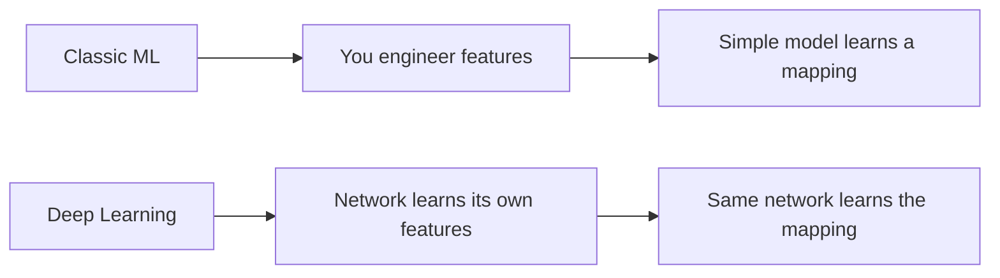
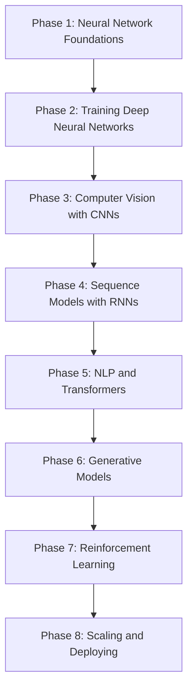

## What you'll learn

Deep Learning (DL) is the branch of Machine Learning built around **artificial neural
networks (ANNs)** — models loosely inspired by the networks of neurons in animal brains.
Instead of hand-crafting features (like "average pixel brightness" or "word count"), a
deep network **learns its own layered representations of the data**, stacking simple
computations on top of each other until it can recognize faces, translate sentences, or
beat a world champion at Go.

In this module, you'll learn:

- how a single artificial neuron (a perceptron) turns inputs into a decision
- how stacking neurons into layers — a Multi-Layer Perceptron (MLP) — lets a network learn
  non-linear patterns that a single neuron never could
- how backpropagation and optimizers (SGD, Adam) actually train these networks
- how CNNs, RNNs, and Transformers specialize this idea for images, sequences, and language
- how generative models and reinforcement learning push deep nets beyond plain prediction
- how to build, train, and evaluate real networks using **tf.keras**

## How deep learning differs from classic ML

Classic ML (linear/logistic regression, decision trees, gradient boosting) usually needs
**you** to engineer good features before the model can do its job. Deep learning instead
gives the network raw(ish) data — pixels, characters, audio samples — and lets it discover
the useful features on its own, through many stacked layers of simple, learnable
transformations.



That extra flexibility comes at a cost: deep networks typically need **more data**, **more
compute**, and are **harder to interpret** than a linear model. So the right tool still
depends on the problem — deep learning shines on unstructured data (vision, audio, text)
and at large scale, while classic ML often wins on smaller, tabular datasets where
explainability matters.

## How this module is structured



- **Phase 1: Neural Network Foundations** — the perceptron, MLPs, and activation functions.
- **Phase 2: Training Deep Neural Networks** — backpropagation, optimizers, and the training loop.
- **Phase 3: Computer Vision with CNNs** — convolutional networks and transfer learning.
- **Phase 4: Sequence Models with RNNs** — recurrent networks for sequential data.
- **Phase 5: NLP & Transformers** — text preprocessing, embeddings, and modern language models.
- **Phase 6: Generative Models** — autoencoders, GANs, and generating new data.
- **Phase 7: Reinforcement Learning** — agents that learn by interacting with an environment.
- **Phase 8: Scaling & Deploying** — training at scale and shipping models to production.

## Prerequisites

- You've finished (or are comfortable with) the **Machine Learning** module — you should
  already know what training/validation/test sets are, what a loss function is, and how
  gradient descent works.
- Comfortable with NumPy arrays and basic Python.
- No prior neural network experience needed — Phase 1 starts from a single neuron.

## A tiny tf.keras example

Here's the smallest possible neural network in tf.keras: one input, one neuron, one
output. It's the digital cousin of the perceptron you'll meet in Phase 1.

```python title="The tiniest possible neural network" showLineNumbers{1}
from tensorflow import keras
import numpy as np

# A single neuron with one input and one output.
model = keras.Sequential([
    keras.layers.Dense(1, input_shape=[1])
])
model.compile(optimizer="sgd", loss="mean_squared_error")

# y = 2x - 1
X = np.array([-1.0, 0.0, 1.0, 2.0, 3.0, 4.0])
y = np.array([-3.0, -1.0, 1.0, 3.0, 5.0, 7.0])

model.fit(X, y, epochs=200, verbose=0)
print(model.predict([10.0]))  # should land close to 19.0
```

## Next

Start with **Phase 1: Neural Network Foundations** and meet the perceptron.

import DataCampExercise from "../../../components/DataCampExercise.astro";

## 🧪 Try It Yourself

### Exercise 1 – Build a Sequential Model

<DataCampExercise
  lang="python"
  hint={`Use \`keras.Sequential([...])\` and pass a list of layers.`}
  code={`# Task: Exercise 1 - Build a Sequential Model
from tensorflow import keras

model = keras.___([                       # replace ___ with Sequential
    keras.layers.Dense(4, activation="relu", input_shape=(3,)),
    keras.layers.Dense(1),
])
print("Layers:", len(model.layers))

# ── Expected Output ───────────────────────────────────────────
# Layers: 2
# ──────────────────────────────────────────────────────────────`}
  solution={`from tensorflow import keras

model = keras.Sequential([
    keras.layers.Dense(4, activation="relu", input_shape=(3,)),
    keras.layers.Dense(1),
])
print("Layers:", len(model.layers))`}
  sct={`test_output_contains("Layers: 2")
success_msg("Your first Sequential model is built!")`}
  height={140}
/>

### Exercise 2 – Compile a Model

<DataCampExercise
  lang="python"
  hint={`Call \`model.compile(loss=..., optimizer=..., metrics=[...])\`.`}
  code={`# Task: Exercise 2 - Compile a Model
from tensorflow import keras

model = keras.Sequential([keras.layers.Dense(1, input_shape=(1,))])
model.___(loss="mse", optimizer="sgd", metrics=["mae"])  # replace ___ with compile
print("Loss function:", model.loss)

# ── Expected Output ───────────────────────────────────────────
# Loss function: mse
# ──────────────────────────────────────────────────────────────`}
  solution={`from tensorflow import keras

model = keras.Sequential([keras.layers.Dense(1, input_shape=(1,))])
model.compile(loss="mse", optimizer="sgd", metrics=["mae"])
print("Loss function:", model.loss)`}
  sct={`test_output_contains("Loss function: mse")
success_msg("Model compiled and ready to train!")`}
  height={140}
/>

