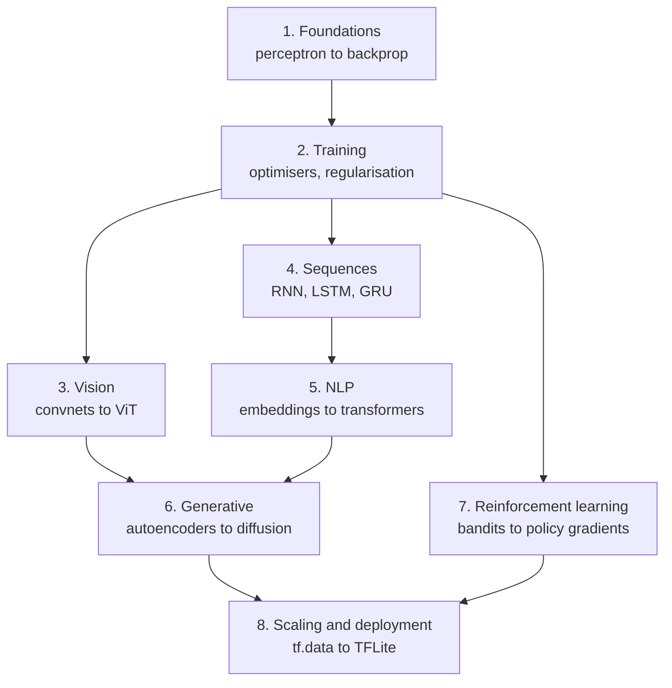

import DataCampExercise from "../../../components/DataCampExercise.astro";
import Figure from "../../../components/Figure.astro";
import Quiz from "../../../components/Quiz.astro";

Deep learning is the branch of machine learning built around **neural networks**: models that
learn their own features instead of being handed them. That much is in every introduction. What
is usually missing is the part that decides whether your model works — the measurements that tell
you which of the standard advice applies to your problem, your data and your hardware.

This module is built the other way round. **Every number in it was produced on one machine** —
TensorFlow 2.21, 8 CPU cores, no GPU — and the pages report what the runs actually did, including
the times that was not what the literature predicts.

## What makes this module different

A representative sample of results that came out contrary to the usual telling:

| Claim you will read elsewhere | What was measured here |
| --- | --- |
| Deeper is better | A plain 12-layer convnet beat its residual version |
| GANs trade coverage for sharpness | The GAN lost on **both** — the VAE covered 10 classes to its 5 |
| Compression costs accuracy | Pruning **50% of weights improved** it, 0.9773 against 0.9733 |
| Mixed precision is a free 2× | **40.65× slower** on a CPU |
| More sampling steps, better samples | Diffusion coverage peaked at 20 steps and got worse at 200 |
| Augmentation helps | It **hurt** until the epoch budget was fixed — my bug, documented |
| FID measures generative quality | Copying 200 real images scored **better than real data** |

None of those are claims that the textbooks are wrong in general. They are claims about what
happens at this scale, on this hardware, and each page says which. That distinction — between a
result and the conditions that produced it — is the actual subject of the module.

## The nine phases



1. **[Neural Network Foundations](/deep-learning/phase-01---neural-network-foundations/phase-1---neural-network-foundations/)** — tensors, the perceptron, backpropagation, and the three
   first examples that every later page builds on.
2. **[Training Deep Networks](/deep-learning/phase-02---training-deep-neural-networks/phase-2---training-deep-neural-networks/)** — optimisers, learning-rate schedules, regularisation,
   batch normalisation, and the workflow that turns them into a method.
3. **[Computer Vision](/deep-learning/phase-03---computer-vision-with-cnns/phase-3---computer-vision-with-cnns/)** — convolution, pooling, the famous architectures, transfer
   learning, segmentation, detection, and vision transformers.
4. **[Sequence Models](/deep-learning/phase-04---sequence-models-with-rnns/phase-4---sequence-models-with-rnns/)** — recurrence, gating, masking, and forecasting.
5. **[NLP & Transformers](/deep-learning/phase-05---nlp--transformers/phase-5---nlp--transformers/)** — tokenisation, embeddings, attention built from scratch, and the
   full transformer block.
6. **[Generative Deep Learning](/deep-learning/phase-06---generative-deep-learning/phase-6---generative-deep-learning/)** — autoencoders, VAEs, GANs, diffusion, and the evaluation
   page that judges all of them.
7. **[Reinforcement Learning](/deep-learning/phase-07---reinforcement-learning/phase-7---reinforcement-learning/)** — exploration, value iteration, DQN, and policy gradients.
8. **[Scaling & Deployment](/deep-learning/phase-08---scaling--deploying-deep-models/phase-8---scaling--deploying-deep-models/)** — input pipelines, custom loops, distribution,
   tuning, serving, and compression.
9. **[Capstone Projects](/deep-learning/phase-09---capstone-projects/phase-9---capstone-projects/)** — three end-to-end projects: a ladder that climbs, a ladder that
   stops, and a generative result with no accuracy column to hide behind.

```p5 title="How often the standard story survived" desc="Step through the phases. Each bar splits the claims that phase tested into contradicted, held at a price, and held as advertised - the totals are summed live." height="400"
let picked = 0;
const PHASES = [
  [1, "Neural Network Foundations", 3, 0, 3, "a single neuron cannot do XOR - 0 of 40,401 weight pairs"],
  [2, "Training Deep Networks", 2, 2, 2, "146x the parameters bought 0.0150 accuracy"],
  [3, "Computer Vision", 4, 1, 1, "augmentation cost 0.1855 clean, bought 0.1105 rotated"],
  [4, "Sequence Models", 4, 2, 0, "a fixed state scored 0.0017 against attention's 1.0000"],
  [5, "NLP & Transformers", 4, 1, 1, "TF-IDF 0.8632 beat a transformer's 0.8462, 55x cheaper"],
  [6, "Generative", 3, 1, 2, "copying 200 real images scored FID 5.027 against real 9.605"],
  [7, "Reinforcement Learning", 4, 2, 0, "replay and target nets: 144.20 together, 53.45 either alone"],
  [8, "Scaling & Deployment", 5, 1, 0, "mixed precision measured 40.65x SLOWER on this CPU"],
  [9, "Capstones", 5, 1, 0, "a memoriser beat the VAE on Frechet distance"]
];
function setup() {
  createCanvas(620, 400);
  textFont("monospace");
}
function draw() {
  background(13, 17, 23);
  noStroke();
  fill(230);
  textSize(12);
  textAlign(LEFT, TOP);
  text("54 claims, 9 phases, every one tested by a measurement", 26, 16);
  let broke = 0;
  let cost = 0;
  let held = 0;
  for (let i = 0; i < PHASES.length; i++) {
    broke += PHASES[i][2];
    cost += PHASES[i][3];
    held += PHASES[i][4];
  }
  for (let i = 0; i < PHASES.length; i++) {
    const y = 48 + i * 26;
    const row = PHASES[i];
    const chosen = i === picked;
    fill(chosen ? 255 : 130, chosen ? 211 : 140, chosen ? 67 : 155);
    textSize(9);
    text("Phase " + row[0] + "  " + row[1], 26, y + 5);
    let x = 250;
    const unit = 34;
    fill(224, 108, 117);
    rect(x, y, row[2] * unit, 17, 2);
    x += row[2] * unit;
    fill(255, 211, 67);
    rect(x, y, row[3] * unit, 17, 2);
    x += row[3] * unit;
    fill(126, 192, 143);
    rect(x, y, row[4] * unit, 17, 2);
    if (chosen) {
      noFill();
      stroke(255, 211, 67);
      strokeWeight(1.5);
      rect(248, y - 2, 6 * unit + 4, 21, 3);
      noStroke();
    }
  }
  const row = PHASES[picked];
  fill(200);
  textSize(10);
  text("Phase " + row[0] + " headline:", 26, 300);
  fill(255, 211, 67);
  textSize(10);
  text(row[5], 26, 318);
  fill(150);
  textSize(9);
  text("contradicted " + row[2] + "   held at a price " + row[3]
       + "   held " + row[4], 26, 340);
  fill(224, 108, 117);
  rect(26, 360, 12, 12, 2);
  fill(150);
  textSize(9);
  text("contradicted  " + broke + " of 54", 44, 362);
  fill(255, 211, 67);
  rect(210, 360, 12, 12, 2);
  fill(150);
  text("held at a price  " + cost, 228, 362);
  fill(126, 192, 143);
  rect(400, 360, 12, 12, 2);
  fill(150);
  text("held  " + held, 418, 362);
  fill(110);
  textSize(8.5);
  text("click a row. Collected from each page's own measured run.", 26, 382);
}
function mousePressed() {
  for (let i = 0; i < PHASES.length; i++) {
    const y = 48 + i * 26;
    if (mouseY > y && mouseY < y + 20) { picked = i; }
  }
}
```

## Three ideas that recur in every phase

### Always have a baseline

<Figure
  src="/images/dl/phase-02-training/universal-workflow/baseline-ladder"
  alt="A ladder of baselines on one task, from a constant predictor through logistic regression to a small and then a tuned neural network, each annotated with its measured accuracy."
  title="From the universal workflow page"
  caption="A model's accuracy means nothing on its own. The number that matters is the gap between it and the simplest thing that could have worked — and on more than one page in this module, the simple thing won. TF-IDF beat every neural model on sentiment; PCA beat an autoencoder at 128 dimensions; a plain convnet beat its residual version."
/>

Every page that reports a model's performance also reports something to compare it against: a
constant predictor, a linear model, the previous page's architecture, or the exact answer from
value iteration. Where the comparison was unflattering, it stayed in.

### Measure the mechanism, not the vibe

<Figure
  src="/images/dl/phase-01-foundations/how-neural-networks-learn/learning-rate-sweep"
  alt="Loss curves for several learning rates, showing divergence at the largest, slow progress at the smallest, and a clear best in between."
  title="From the how neural networks learn page"
  caption="Hyperparameters are usually described qualitatively — too high diverges, too low is slow. They are all measurable, and the measurement is nearly always more interesting than the description: here the best rate is a factor of a hundred from the worst, and the failure at the top end is abrupt rather than gradual."
/>

### Know what your model cannot do

<Figure
  src="/images/dl/phase-08-scaling/limitations/shift"
  alt="Accuracy and confidence against rotation and against pixel shift, showing accuracy collapsing while confidence stays high."
  title="From the limitations page"
  caption="The final page of the module takes a 0.9785 model and breaks it four ways — a four-pixel shift takes it to 0.0975, and it stays 0.77 confident throughout. That combination, catastrophic failure at high confidence, is the thing to carry out of the module: a test-set score describes one distribution, and deployment is a different one."
/>

## How to work through it

- **Run the code.** Every page has five or six exercises with a single blank to fill, and their
  expected output is what the code actually printed here.
- **Read the pitfalls before the recap.** They are the mistakes that cost real time, including
  several of mine — a fixed epoch budget that hid 0.1675 of accuracy, a rotation range specified
  in turns rather than degrees, a metric that returned 0.0000 forever because the labels were
  smoothed.
- **Do not skip the measurement pages.** Evaluating generative models and the universal workflow
  are the two that change how you read everything else.
- **Expect the phases to disagree.** Phase 3 shows augmentation helping; the limitations page
  shows how far it does not reach.

## What you need

Python with TensorFlow 2.x and NumPy. Nothing in this module requires a GPU — that constraint is
why the pages measure semantics, overhead and correctness rather than reporting throughput
numbers you cannot reproduce.

Cached datasets are enough throughout: MNIST, Fashion-MNIST, IMDB, Reuters and Boston Housing.
Where a page needed something else — pretrained ImageNet weights, `gymnasium`, KerasTuner,
TensorFlow Serving — it says so and measures the mechanism directly instead.

```p5 title="Results that did not match the textbook" desc="Click a claim to see what this module measured. Each one names the page and the conditions the result depends on." height="360"
let chosen = 0;
const CLAIMS = [
  ["deeper is better", "a plain 12-layer convnet beat its residual version",
    "phase 3, famous architectures"],
  ["GANs trade coverage for sharpness",
    "the GAN lost BOTH: 5 classes to the VAE's 10, lower confidence too",
    "phase 6, GANs"],
  ["compression costs accuracy",
    "pruning 50% of weights IMPROVED it: 0.9773 against 0.9733",
    "phase 8, model compression"],
  ["mixed precision is a free 2x",
    "40.65x SLOWER on a CPU - it is a tensor-core feature",
    "phase 8, mixed precision"],
  ["more sampling steps are better",
    "diffusion coverage peaked at 20 steps, worse at 200",
    "phase 6, diffusion"],
  ["FID measures generative quality",
    "copying 200 real images scored BETTER than real held-out data",
    "phase 6, evaluating generative models"],
];
function setup() {
  createCanvas(620, 360);
  textFont("monospace");
}
function wrap(text, x, y, width, size) {
  textSize(size);
  const words = text.split(" ");
  let line = "";
  let offset = 0;
  for (const word of words) {
    const attempt = line.length ? line + " " + word : word;
    if (attempt.length * size * 0.6 > width) {
      text(line, x, y + offset);
      offset += size + 4;
      line = word;
    } else {
      line = attempt;
    }
  }
  if (line.length) { text(line, x, y + offset); }
  return offset + size + 4;
}
function draw() {
  background(13, 17, 23);
  const row = CLAIMS[chosen];
  noStroke();
  fill(150);
  textSize(10.5);
  textAlign(LEFT, TOP);
  text("the usual claim", 30, 22);
  fill(224, 108, 117);
  wrap(row[0], 30, 42, 540, 14);
  fill(150);
  textSize(10.5);
  text("what was measured here", 30, 92);
  fill(126, 192, 143);
  wrap(row[1], 30, 112, 540, 13);
  fill(120);
  textSize(9.5);
  text("see: " + row[2], 30, 176);
  fill(150);
  textSize(9.5);
  text("every result on this page is conditional on the budget and hardware",
    30, 204);
  text("the page states - that is the point, not a disclaimer", 30, 218);
  for (let i = 0; i < CLAIMS.length; i++) {
    const x = 30 + (i % 2) * 285;
    const y = 248 + Math.floor(i / 2) * 34;
    fill(i === chosen ? color(255, 211, 67) : color(60, 70, 84));
    rect(x, y, 270, 26, 4);
    fill(i === chosen ? 20 : 200);
    textSize(9);
    textAlign(CENTER, CENTER);
    const label = CLAIMS[i][0].length > 34
      ? CLAIMS[i][0].slice(0, 32) + ".." : CLAIMS[i][0];
    text(label, x + 135, y + 13);
    textAlign(LEFT, TOP);
  }
}
function mousePressed() {
  for (let i = 0; i < CLAIMS.length; i++) {
    const x = 30 + (i % 2) * 285;
    const y = 248 + Math.floor(i / 2) * 34;
    if (mouseX > x && mouseX < x + 270 && mouseY > y && mouseY < y + 26) {
      chosen = i;
      return;
    }
  }
}
```

## Pitfalls

- **Treating a benchmark score as a capability.** The same 0.9785 model scores 0.0975 four pixels
  to the left.
- **Skipping the baseline.** Several pages here have the simple method winning; you cannot know
  which without running it.
- **Reading a single run.** Greedy bandit search scored 0.00 regret on its best seed and 2394.40
  on its worst.
- **Trusting confidence as correctness.** Measured repeatedly: 0.81 confidence at 8.5% accuracy.
- **Applying performance advice without measuring it on your hardware.** Mixed precision cost
  40.65× here.
- **Assuming a metric cannot be gamed.** Word validity, FID and coverage each have a degenerate
  optimum, all three demonstrated.
- **Believing the model is the hard part.** Most of the effort in this module went into
  measurement and into finding the bugs that measurement exposed.

## Recap

- Deep learning is a set of methods whose applicability is empirical — the same technique helps,
  does nothing, or hurts depending on scale, data and hardware.
- Every number in these 66 pages was produced on one CPU-only machine and is reported with the
  conditions that produced it.
- The recurring method is: baseline first, measure the mechanism, then state what the result does
  not cover.
- Several standard claims did not reproduce at this scale, and those pages report the measurement
  rather than the expectation.
- The module ends where deployment begins, and with a page on what none of it fixes.

## Next

Start at the beginning — tensors, the perceptron, and the first network that learns anything:
[Phase 1 - Neural Network Foundations](/deep-learning/phase-01---neural-network-foundations/phase-1---neural-network-foundations/).

<Quiz
  questions={[
    {
      q: "Several pages in this module found the simpler method winning — TF-IDF over neural models, PCA over an autoencoder, a plain convnet over a residual one. What is the right conclusion?",
      options: [
        "Neural networks are usually the wrong choice",
        "At small scale the advantage of a complex model often disappears, so a baseline is the only way to know whether the complexity bought anything on YOUR problem",
        "Those measurements must be flawed",
        "Simpler models generalise better in all cases",
      ],
      answer: 1,
      explain: "Each of those pages states its budget. The claim is about what happens at that scale, not a general ordering of methods.",
    },
    {
      q: "A model scored 0.9785 on held-out data and 0.0975 on the same data shifted four pixels, staying about 0.77 confident throughout. What does that say about test-set accuracy?",
      options: [
        "It is a useless metric",
        "It describes performance on one distribution — deployment is a different distribution, and a single score cannot warn you about the difference",
        "The test set was too small",
        "The model was overfitted",
      ],
      answer: 1,
      explain: "The high confidence during failure is the practical problem: nothing in the model's output signals that it has left the distribution it was trained on.",
    },
    {
      q: "Why does this module report that mixed precision was 40.65x SLOWER rather than the usual roughly 2x speed-up?",
      options: [
        "The implementation was wrong",
        "Because it was measured on a CPU, which has no float16 execution units — the speed-up is a property of tensor-core hardware, and the page says so",
        "Because TensorFlow 2.21 has a regression",
        "Because the model was too small to benefit",
      ],
      answer: 1,
      explain: "Accuracy was unchanged at 0.9067 against 0.9073, which shows the numerics were fine and only the hardware claim failed.",
    },
    {
      q: "Copying 200 real training images scored a better Frechet distance than genuinely held-out real data. What does that demonstrate?",
      options: [
        "The Frechet distance was computed incorrectly",
        "Every generative metric has a degenerate optimum — copying reproduces the real feature statistics exactly, so a distribution distance rewards it and only a memorisation check catches it",
        "Copying is a legitimate generative strategy",
        "The real data was unusual",
      ],
      answer: 1,
      explain: "The same shape of failure appears with word validity, where greedy decoding scored a perfect 1.0000 by repeating one word 58 times.",
    },
    {
      q: "What is the recurring method the module uses on every page?",
      options: [
        "Train the largest model the hardware allows",
        "Establish a baseline, measure the mechanism rather than describing it, and state the conditions the result does not cover",
        "Reproduce the original paper's numbers",
        "Tune hyperparameters until the result matches expectations",
      ],
      answer: 1,
      explain: "That method is what surfaced the contrary results — none of them would have been visible from a curve that merely goes up.",
    },
  ]}
/>

## 🧪 Try It Yourself

<DataCampExercise
  lang="python"
  hint={`A baseline that always predicts the most common class has accuracy equal to that class's share of the data.`}
  code={`# Task: Exercise 1 - The baseline every result should be compared against
import numpy as np

DATASETS = {
    "MNIST (balanced)": np.repeat(np.arange(10), [980, 1135, 1032, 1010, 982,
                                                  892, 958, 1028, 974, 1009]),
    "fraud (imbalanced)": np.repeat([0, 1], [9950, 50]),
    "three classes": np.repeat([0, 1, 2], [700, 200, 100]),
}


def majority_baseline(labels):
    """Accuracy of always predicting the most common class."""
    counts = np.bincount(labels)
    return float(counts.max() / ___)             # replace ___ with counts.sum()


print(f"{'dataset':22s} {'classes':>8} {'baseline':>10} "
      f"{'a 95% model is...':>20}")
for name, labels in DATASETS.items():
    baseline = majority_baseline(labels)
    verdict = "impressive" if baseline < 0.9 else "possibly worthless"
    print(f"{name:22s} {len(np.unique(labels)):8d} {baseline:10.4f} "
          f"{verdict:>20}")

print("\\n95% accuracy on the fraud dataset is WORSE than predicting 'not")
print("fraud' every time - which is why a baseline comes first")`}
  solution={`import numpy as np

DATASETS = {
    "MNIST (balanced)": np.repeat(np.arange(10), [980, 1135, 1032, 1010, 982,
                                                  892, 958, 1028, 974, 1009]),
    "fraud (imbalanced)": np.repeat([0, 1], [9950, 50]),
    "three classes": np.repeat([0, 1, 2], [700, 200, 100]),
}


def majority_baseline(labels):
    """Accuracy of always predicting the most common class."""
    counts = np.bincount(labels)
    return float(counts.max() / counts.sum())


print(f"{'dataset':22s} {'classes':>8} {'baseline':>10} "
      f"{'a 95% model is...':>20}")
for name, labels in DATASETS.items():
    baseline = majority_baseline(labels)
    verdict = "impressive" if baseline < 0.9 else "possibly worthless"
    print(f"{name:22s} {len(np.unique(labels)):8d} {baseline:10.4f} "
          f"{verdict:>20}")

print("\\n95% accuracy on the fraud dataset is WORSE than predicting 'not")
print("fraud' every time - which is why a baseline comes first")`}
  expectedOutput={`dataset                 classes   baseline    a 95% model is...
MNIST (balanced)             10     0.1135           impressive
fraud (imbalanced)            2     0.9950   possibly worthless
three classes                 3     0.7000           impressive

95% accuracy on the fraud dataset is WORSE than predicting 'not
fraud' every time - which is why a baseline comes first`}
/>

<DataCampExercise
  lang="python"
  hint={`Count parameters layer by layer: a Dense layer has inputs * units weights plus units biases.`}
  code={`# Task: Exercise 2 - Where do the parameters actually live?
LAYERS = [
    # (name, kind, in_shape, out_units, kernel)
    ("conv1", "conv", 1, 32, 3),
    ("conv2", "conv", 32, 64, 3),
    ("dense1", "dense", 64 * 5 * 5, 128, None),
    ("output", "dense", 128, 10, None),
]


def parameters(kind, inputs, units, kernel):
    if kind == "conv":
        return kernel * kernel * inputs * units + units
    return inputs * units + ___                  # replace ___ with units


total = 0
print(f"{'layer':10s} {'kind':>7} {'parameters':>12} {'share':>8}")
counts = [(name, kind, parameters(kind, i, u, k))
          for name, kind, i, u, k in LAYERS]
total = sum(count for _, _, count in counts)
for name, kind, count in counts:
    print(f"{name:10s} {kind:>7} {count:12,} {count / total:8.1%}")
print(f"{'TOTAL':10s} {'':>7} {total:12,}")

print("\\nthe convolutions do the work and the dense layer holds the weights -")
print("which is why global pooling instead of flatten shrinks a model so much")`}
  solution={`LAYERS = [
    # (name, kind, in_shape, out_units, kernel)
    ("conv1", "conv", 1, 32, 3),
    ("conv2", "conv", 32, 64, 3),
    ("dense1", "dense", 64 * 5 * 5, 128, None),
    ("output", "dense", 128, 10, None),
]


def parameters(kind, inputs, units, kernel):
    if kind == "conv":
        return kernel * kernel * inputs * units + units
    return inputs * units + units


total = 0
print(f"{'layer':10s} {'kind':>7} {'parameters':>12} {'share':>8}")
counts = [(name, kind, parameters(kind, i, u, k))
          for name, kind, i, u, k in LAYERS]
total = sum(count for _, _, count in counts)
for name, kind, count in counts:
    print(f"{name:10s} {kind:>7} {count:12,} {count / total:8.1%}")
print(f"{'TOTAL':10s} {'':>7} {total:12,}")

print("\\nthe convolutions do the work and the dense layer holds the weights -")
print("which is why global pooling instead of flatten shrinks a model so much")`}
  expectedOutput={`layer         kind   parameters    share
conv1         conv          320     0.1%
conv2         conv       18,496     8.2%
dense1       dense      204,928    91.1%
output       dense        1,290     0.6%
TOTAL                   225,034`}
/>

<DataCampExercise
  lang="python"
  hint={`Compare the training and validation curves: a widening gap is overfitting, both high is underfitting.`}
  code={`# Task: Exercise 3 - Read a learning curve
CURVES = {
    "A": {"train": [0.62, 0.78, 0.85, 0.90, 0.94, 0.97, 0.99],
          "val":   [0.60, 0.75, 0.80, 0.81, 0.81, 0.80, 0.79]},
    "B": {"train": [0.55, 0.62, 0.66, 0.68, 0.69, 0.70, 0.70],
          "val":   [0.54, 0.61, 0.65, 0.67, 0.68, 0.69, 0.69]},
    "C": {"train": [0.61, 0.79, 0.86, 0.90, 0.92, 0.93, 0.94],
          "val":   [0.60, 0.77, 0.84, 0.88, 0.90, 0.91, 0.92]},
}


def diagnose(curve):
    gap = curve["train"][-1] - curve["val"][___]     # replace ___ with -1
    peaked = max(curve["val"]) - curve["val"][-1]
    if gap > 0.1 and peaked > 0.005:
        return "OVERFITTING - regularise or stop earlier"
    if curve["train"][-1] < 0.8:
        return "UNDERFITTING - more capacity or training"
    return "healthy - keep going"


for name, curve in CURVES.items():
    print(f"model {name}: train {curve['train'][-1]:.2f}  "
          f"val {curve['val'][-1]:.2f}  -> {diagnose(curve)}")

print("\\nthe universal workflow says overfit FIRST, then regularise - a model")
print("that cannot overfit its training set has a capacity problem, not a")
print("regularisation problem")`}
  solution={`CURVES = {
    "A": {"train": [0.62, 0.78, 0.85, 0.90, 0.94, 0.97, 0.99],
          "val":   [0.60, 0.75, 0.80, 0.81, 0.81, 0.80, 0.79]},
    "B": {"train": [0.55, 0.62, 0.66, 0.68, 0.69, 0.70, 0.70],
          "val":   [0.54, 0.61, 0.65, 0.67, 0.68, 0.69, 0.69]},
    "C": {"train": [0.61, 0.79, 0.86, 0.90, 0.92, 0.93, 0.94],
          "val":   [0.60, 0.77, 0.84, 0.88, 0.90, 0.91, 0.92]},
}


def diagnose(curve):
    gap = curve["train"][-1] - curve["val"][-1]
    peaked = max(curve["val"]) - curve["val"][-1]
    if gap > 0.1 and peaked > 0.005:
        return "OVERFITTING - regularise or stop earlier"
    if curve["train"][-1] < 0.8:
        return "UNDERFITTING - more capacity or training"
    return "healthy - keep going"


for name, curve in CURVES.items():
    print(f"model {name}: train {curve['train'][-1]:.2f}  "
          f"val {curve['val'][-1]:.2f}  -> {diagnose(curve)}")

print("\\nthe universal workflow says overfit FIRST, then regularise - a model")
print("that cannot overfit its training set has a capacity problem, not a")
print("regularisation problem")`}
  expectedOutput={`model A: train 0.99  val 0.79  -> OVERFITTING - regularise or stop earlier
model B: train 0.70  val 0.69  -> UNDERFITTING - more capacity or training
model C: train 0.94  val 0.92  -> healthy - keep going

the universal workflow says overfit FIRST, then regularise - a model
that cannot overfit its training set has a capacity problem, not a
regularisation problem`}
/>

<DataCampExercise
  lang="python"
  hint={`Each metric has an input that maximises it while being useless. Match the metric to its degenerate optimum.`}
  code={`# Task: Exercise 4 - Every metric has a degenerate optimum
DEGENERATE = {
    "accuracy": "always predict the majority class",
    "word validity": "repeat one dictionary word forever",
    "Frechet distance": "return copies of the training data",
    "class coverage": "return copies of the training data",
    "judge confidence": "produce sharp samples of a single class",
}

MEASURED = {
    "greedy decoding": {"word validity": 1.0000, "distinct words": 0.0171},
    "200 copied images": {"Frechet distance": 5.027, "nearest real": 0.0022},
    "collapsed GAN": {"judge confidence": 0.5798, "classes": 5},
}

print("each of these scored WELL on one metric while being useless:")
for name, scores in MEASURED.items():
    best = max(scores, key=lambda k: scores[k] if k != "nearest real" else -1)
    print(f"  {name:20s} {best}: {scores[best]}")

print("\\nthe defence is a second metric that the degenerate answer fails:")
for metric, cheat in DEGENERATE.items():
    guard = "a diversity or memorisation check"
    print(f"  {metric:20s} gamed by: {cheat}")

needed = len(set(DEGENERATE.___()))              # replace ___ with values
print(f"\\n{needed} distinct degenerate strategies across 5 metrics")`}
  solution={`DEGENERATE = {
    "accuracy": "always predict the majority class",
    "word validity": "repeat one dictionary word forever",
    "Frechet distance": "return copies of the training data",
    "class coverage": "return copies of the training data",
    "judge confidence": "produce sharp samples of a single class",
}

MEASURED = {
    "greedy decoding": {"word validity": 1.0000, "distinct words": 0.0171},
    "200 copied images": {"Frechet distance": 5.027, "nearest real": 0.0022},
    "collapsed GAN": {"judge confidence": 0.5798, "classes": 5},
}

print("each of these scored WELL on one metric while being useless:")
for name, scores in MEASURED.items():
    best = max(scores, key=lambda k: scores[k] if k != "nearest real" else -1)
    print(f"  {name:20s} {best}: {scores[best]}")

print("\\nthe defence is a second metric that the degenerate answer fails:")
for metric, cheat in DEGENERATE.items():
    guard = "a diversity or memorisation check"
    print(f"  {metric:20s} gamed by: {cheat}")

needed = len(set(DEGENERATE.values()))
print(f"\\n{needed} distinct degenerate strategies across 5 metrics")`}
/>

<DataCampExercise
  lang="python"
  hint={`Work out how many training runs each plan costs, then compare that with the time you have.`}
  code={`# Task: Exercise 5 - Budget an experiment before running it
SECONDS_PER_EPOCH = 8.0
EPOCHS_PER_RUN = 10


def plan_cost(runs, seeds=1):
    """Wall-clock for a plan, in minutes."""
    return runs * seeds * EPOCHS_PER_RUN * SECONDS_PER_EPOCH / ___   # 60


PLANS = {
    "one model, one seed": (1, 1),
    "one model, 5 seeds": (1, 5),
    "6 hyperparameters, 1 seed": (6, 1),
    "6 hyperparameters, 5 seeds": (6, 5),
    "24-config grid, 3 seeds": (24, 3),
}

print(f"{'plan':30s} {'runs':>6} {'minutes':>9} {'fits in an hour?':>18}")
for name, (runs, seeds) in PLANS.items():
    minutes = plan_cost(runs, seeds)
    print(f"{name:30s} {runs * seeds:6d} {minutes:9.1f} "
          f"{'yes' if minutes <= 60 else 'NO':>18}")

print("\\nseeds multiply, and a single-seed comparison of two models is a coin")
print("flip - this module measured a greedy bandit at 0.00 on one seed and")
print("2394.40 on another")`}
  solution={`SECONDS_PER_EPOCH = 8.0
EPOCHS_PER_RUN = 10


def plan_cost(runs, seeds=1):
    """Wall-clock for a plan, in minutes."""
    return runs * seeds * EPOCHS_PER_RUN * SECONDS_PER_EPOCH / 60


PLANS = {
    "one model, one seed": (1, 1),
    "one model, 5 seeds": (1, 5),
    "6 hyperparameters, 1 seed": (6, 1),
    "6 hyperparameters, 5 seeds": (6, 5),
    "24-config grid, 3 seeds": (24, 3),
}

print(f"{'plan':30s} {'runs':>6} {'minutes':>9} {'fits in an hour?':>18}")
for name, (runs, seeds) in PLANS.items():
    minutes = plan_cost(runs, seeds)
    print(f"{name:30s} {runs * seeds:6d} {minutes:9.1f} "
          f"{'yes' if minutes <= 60 else 'NO':>18}")

print("\\nseeds multiply, and a single-seed comparison of two models is a coin")
print("flip - this module measured a greedy bandit at 0.00 on one seed and")
print("2394.40 on another")`}
  expectedOutput={`plan                             runs   minutes   fits in an hour?
one model, one seed                 1       1.3                yes
one model, 5 seeds                  5       6.7                yes
6 hyperparameters, 1 seed           6       8.0                yes
6 hyperparameters, 5 seeds         30      40.0                yes
24-config grid, 3 seeds            72      96.0                 NO

seeds multiply, and a single-seed comparison of two models is a coin
flip - this module measured a greedy bandit at 0.00 on one seed and
2394.40 on another`}
/>

<DataCampExercise
  lang="python"
  hint={`Train the simplest thing first, then the network, and print both so the comparison is unavoidable.`}
  code={`# Task: Exercise 6 - Your first measured result
import numpy as np
from tensorflow import keras

keras.utils.set_random_seed(0)
(x_train, y_train), (x_test, y_test) = keras.datasets.mnist.load_data()
x_train = (x_train[:6000].reshape(-1, 784) / 255.0).astype("float32")
x_test = (x_test[:2000].reshape(-1, 784) / 255.0).astype("float32")
y_train, y_test = y_train[:6000], y_test[:2000]

# Baseline 1: always predict the most common class.
majority = np.bincount(y_train).argmax()
constant = float((y_test == majority).mean())

# Baseline 2: nearest centroid - one average image per class.
centroids = np.stack([x_train[y_train == digit].mean(axis=0)
                      for digit in range(10)])
distances = ((x_test[:, None, :] - centroids[None, :, :]) ** 2).sum(axis=2)
centroid = float((distances.argmin(axis=1) == y_test).mean())

# The network.
model = keras.Sequential([keras.layers.Input((784,)),
                          keras.layers.Dense(64, activation="relu"),
                          keras.layers.Dense(10, activation="softmax")])
model.compile("adam", "sparse_categorical_crossentropy", metrics=["accuracy"])
model.fit(x_train, y_train, epochs=5, batch_size=128, verbose=0)
network = model.evaluate(x_test, y_test, verbose=0)[1]

print(f"always predict {majority}:   {constant:.4f}")
print(f"nearest centroid:      {centroid:.4f}")
print(f"neural network:        {network:.4f}")
print(f"\\nthe network beat the centroid by "
      f"{network - ___:.4f}")                    # replace ___ with centroid
print("that gap - not the accuracy - is what the network actually bought")`}
  solution={`import numpy as np
from tensorflow import keras

keras.utils.set_random_seed(0)
(x_train, y_train), (x_test, y_test) = keras.datasets.mnist.load_data()
x_train = (x_train[:6000].reshape(-1, 784) / 255.0).astype("float32")
x_test = (x_test[:2000].reshape(-1, 784) / 255.0).astype("float32")
y_train, y_test = y_train[:6000], y_test[:2000]

# Baseline 1: always predict the most common class.
majority = np.bincount(y_train).argmax()
constant = float((y_test == majority).mean())

# Baseline 2: nearest centroid - one average image per class.
centroids = np.stack([x_train[y_train == digit].mean(axis=0)
                      for digit in range(10)])
distances = ((x_test[:, None, :] - centroids[None, :, :]) ** 2).sum(axis=2)
centroid = float((distances.argmin(axis=1) == y_test).mean())

# The network.
model = keras.Sequential([keras.layers.Input((784,)),
                          keras.layers.Dense(64, activation="relu"),
                          keras.layers.Dense(10, activation="softmax")])
model.compile("adam", "sparse_categorical_crossentropy", metrics=["accuracy"])
model.fit(x_train, y_train, epochs=5, batch_size=128, verbose=0)
network = model.evaluate(x_test, y_test, verbose=0)[1]

print(f"always predict {majority}:   {constant:.4f}")
print(f"nearest centroid:      {centroid:.4f}")
print(f"neural network:        {network:.4f}")
print(f"\\nthe network beat the centroid by "
      f"{network - centroid:.4f}")
print("that gap - not the accuracy - is what the network actually bought")`}
/>
