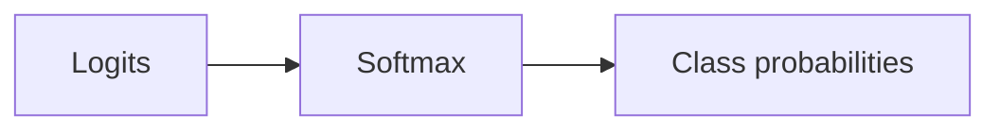

Every layer you've built so far ends with `activation="relu"` or `"softmax"` — but
what are those, and why do they matter so much? This page is about the small
non-linear function every neuron applies to its weighted sum, and why skipping it
would quietly turn your deep network back into a single linear model.

## Why activations are needed

Without activations, layers collapse into a single linear transformation. Chain two
linear functions together — say `f(x) = 2x + 3` and `g(x) = 5x - 1` — and you just get
another linear function: `f(g(x)) = 10x + 1`. No matter how many layers you stack, a
network without non-linear activations is mathematically equivalent to a single
layer. A large-enough network *with* non-linear activations, on the other hand, can
approximate essentially any continuous function.

There's a second, more practical reason activations changed over time. The original
perceptron used a hard **step function**, which is flat everywhere except at zero —
so its gradient is zero almost everywhere, and Gradient Descent has nothing to push
against. Backpropagation needed a function with a well-defined, non-zero derivative
everywhere. That's why the first successful MLPs replaced the step function with the
smooth **logistic (sigmoid)** function.

## ReLU

`ReLU(x) = max(0, x)`

Common choice for hidden layers.

Pros:

- simple and fast to compute
- helps with vanishing gradient (compared to sigmoid), since it doesn't saturate for
  positive inputs

Cons:

- not differentiable at `x = 0` (in practice, this rarely causes problems)
- "dead" neurons: if a neuron's weighted sum is always negative, its gradient is
  always zero and it stops learning

## Sigmoid

`sigmoid(x) = 1 / (1 + e^-x)`

Maps any real number to **(0, 1)**, so its output can be read as a probability.

Used for:

- binary classification output (probability of the positive class)

## Tanh

`tanh(x) = 2·sigmoid(2x) − 1`

Same S-shape as sigmoid, but squashes to **(−1, 1)** instead of (0, 1). Because its
output tends to be centered around 0, it often helps hidden layers converge a little
faster than sigmoid does.

## Softmax

Turns a vector of raw scores (**logits**) into a probability distribution over
classes — every value lands in (0, 1) and they all sum to 1:

`softmax(z)_i = exp(z_i) / Σ_j exp(z_j)`

Used for:

- multiclass classification output, when each instance belongs to exactly **one**
  class out of several



## Typical choices

- hidden layers: ReLU
- binary output: sigmoid
- multiclass output: softmax

## Picking the output layer for your actual problem

The three worked examples later in this phase (IMDB, Reuters, house prices) each end
in a different output layer — here's the full picture of *why*, one problem type at a
time:

- **Regression** (predict any real number, like a house price) — usually **no
  activation** at all, so the output is free to be any value. If you know the target
  must be positive, ReLU or its smooth cousin `softplus(z) = log(1 + exp(z))` works
  too. If the target is naturally bounded, sigmoid (0 to 1) or tanh (−1 to 1) can work
  — but then you must scale your labels into that same range first.
- **Binary classification** (2 mutually exclusive classes, like IMDB) — **one output
  neuron with sigmoid**. Its single number is `P(positive class)`.
- **Multiclass, single-label classification** (exactly one class out of several, like
  Reuters' 46 topics) — **one output neuron per class, with softmax** over the whole
  layer, so the outputs form one probability distribution that sums to 1.
- **Multilabel, multiclass classification** (an example can belong to *several*
  classes at once — e.g. tagging an email as both "spam" and "urgent") — **one output
  neuron per label, each with its own sigmoid**, *not* softmax. Every neuron answers
  an independent yes/no question, so the outputs do **not** need to sum to 1:

```python title="Two independent sigmoid outputs for multilabel classification" showLineNumbers{1}
from tensorflow import keras

model = keras.Sequential([
    keras.layers.Dense(16, activation="relu", input_shape=(10,)),
    keras.layers.Dense(2, activation="sigmoid"),  # 2 labels, each independent
])
model.compile(loss="binary_crossentropy", optimizer="rmsprop", metrics=["accuracy"])
```

Using `softmax` here would be a bug: it would force `P(spam) + P(urgent) = 1`, as if
an email couldn't be both at once.

:::tip[From the book]
Biological neurons seem to implement a roughly sigmoid activation, so for decades
researchers stuck with sigmoid functions in artificial ones. It turns out ReLU
generally works better in practice — one of several cases where following biology
too closely turned out to be misleading.
:::

:::tip[From the book]
Chollet's term for what an activation buys you: a richer **hypothesis space**. Without
one, a `Dense` layer can only express linear transformations of its input — no matter
how many you chain, the result is still just one linear transformation. A single
non-linear activation is enough to let a deep stack of layers represent far more
complex functions than any linear model, which is the entire reason "deep" helps.
:::

## Activations in tf.keras

You already choose an activation every time you build a `Dense` layer. Here's how
the three from this page look side by side, plus a peek at what each one actually
outputs on a batch of raw scores:

```python title="Comparing activations in tf.keras" showLineNumbers{1}
import numpy as np
from tensorflow import keras

logits = np.array([[2.0, -1.0, 0.5]])

relu = keras.activations.relu(logits)
sigmoid = keras.activations.sigmoid(logits)
softmax = keras.activations.softmax(logits)

print("ReLU:   ", relu.numpy())
print("Sigmoid:", sigmoid.numpy())
print("Softmax:", softmax.numpy(), "-> sums to", softmax.numpy().sum())
```

```python title="Where activations live in a model" showLineNumbers{1}
from tensorflow import keras

model = keras.Sequential([
    keras.layers.Dense(300, activation="relu", input_shape=(784,)),  # hidden: ReLU
    keras.layers.Dense(100, activation="relu"),                      # hidden: ReLU
    keras.layers.Dense(10, activation="softmax"),                    # output: softmax
])
model.compile(loss="sparse_categorical_crossentropy",
              optimizer="sgd",
              metrics=["accuracy"])
```

## Visualize it

Each activation reshapes the neuron's signal differently: **ReLU** zeroes out negatives and
passes positives straight through, **sigmoid** squashes everything into 0–1, and **tanh**
squashes into −1–1. Their shapes are why they behave so differently:

```p5 title="Activation functions shape the signal" desc="ReLU clips negatives to zero, sigmoid squashes to 0..1, tanh squashes to -1..1. A sweeping probe shows what each function outputs for the same input, in real time." height="280"
const PERIOD = 200;
function relu(x) { return x > 0 ? Math.min(x, 5) / 5 : 0; }
function sigmoid(x) { return 1 / (1 + Math.exp(-x)); }
function tanhFn(x) { return Math.tanh(x); }
function setup() {
  createCanvas(600, 280);
  textFont("monospace");
}
function draw() {
  background(13, 17, 23);
  const gx = 42, gy = 20, gw = width - 84, gh = height - 56;
  stroke(60, 70, 84);
  strokeWeight(1);
  line(gx, gy + gh / 2, gx + gw, gy + gh / 2);
  line(gx + gw / 2, gy, gx + gw / 2, gy + gh);
  const px = (x) => gx + gw / 2 + (x / 5) * (gw / 2);
  const py = (y) => gy + gh / 2 - (y / 1.2) * (gh / 2);
  function plot(fn, col, label, ly) {
    stroke(col[0], col[1], col[2]);
    strokeWeight(2.5);
    noFill();
    beginShape();
    for (let x = -5; x <= 5; x += 0.1) vertex(px(x), py(constrain(fn(x), -1.2, 1.2)));
    endShape();
    noStroke();
    fill(col[0], col[1], col[2]);
    textAlign(LEFT, CENTER);
    textSize(12);
    text(label, gx + gw - 80, ly);
  }
  const curves = [
    { fn: relu, col: [120, 200, 120], label: "ReLU", ly: gy + 14 },
    { fn: sigmoid, col: [75, 139, 190], label: "sigmoid", ly: gy + 32 },
    { fn: tanhFn, col: [255, 211, 67], label: "tanh", ly: gy + 50 },
  ];
  for (const c of curves) plot(c.fn, c.col, c.label, c.ly);

  // A probe input sweeps smoothly from -5 to 5 and back (no jump), and a
  // marker rides each curve at that x -- so you can watch, in real time, how
  // differently the same input is reshaped by each activation.
  const t = (frameCount % PERIOD) / PERIOD;
  const x = lerp(-5, 5, (Math.cos(TWO_PI * t - PI) + 1) / 2);
  stroke(230, 230, 230, 140);
  strokeWeight(1);
  line(px(x), gy, px(x), gy + gh);
  noStroke();
  for (const c of curves) {
    const y = constrain(c.fn(x), -1.2, 1.2);
    fill(c.col[0], c.col[1], c.col[2]);
    ellipse(px(x), py(y), 9, 9);
  }
  fill(230);
  textAlign(CENTER, TOP);
  textSize(12);
  text("x = " + x.toFixed(2), px(x), gy + gh + 6);
  textAlign(LEFT, CENTER);
}
```

## Mini-checkpoint

If your model is predicting 10 classes, what activation is typical in the last layer?

(Softmax.)

## Next

You now know the perceptron, the MLP, and the activations that make them work.
Continue to **Building Neural Networks with Keras (Sequential and Functional API)**
to see the different ways to assemble these pieces into an actual `tf.keras` model —
before moving on to Phase 2's training toolkit.

import DataCampExercise from "../../../../components/DataCampExercise.astro";

## 🧪 Try It Yourself

### Exercise 1 – Apply ReLU

<DataCampExercise
  lang="python"
  hint={`\`keras.activations.relu(x)\` zeroes out negative values and passes positives through.`}
  code={`# Task: Exercise 1 - Apply ReLU
import numpy as np
from tensorflow import keras

x = np.array([-2.0, 0.0, 3.5])
result = keras.activations.___(x)   # replace ___ with relu
print("ReLU output:", result.numpy())

# ── Expected Output ───────────────────────────────────────────
# ReLU output: [0.  0.  3.5]
# ──────────────────────────────────────────────────────────────`}
  solution={`import numpy as np
from tensorflow import keras

x = np.array([-2.0, 0.0, 3.5])
result = keras.activations.relu(x)
print("ReLU output:", result.numpy())`}
  sct={`test_output_contains("ReLU output:")
success_msg("Negatives clipped to zero, positives pass straight through!")`}
  height={150}
/>

### Exercise 2 – A Sigmoid Output Layer

<DataCampExercise
  lang="python"
  hint={`Binary classification -> one output neuron with \`activation="sigmoid"\`.`}
  code={`# Task: Exercise 2 - A Sigmoid Output Layer
from tensorflow import keras

model = keras.Sequential([
    keras.layers.Dense(16, activation="relu", input_shape=(10,)),
    keras.layers.Dense(1, activation="___"),   # replace ___ with sigmoid
])
print("Output activation:", model.layers[-1].activation.__name__)

# ── Expected Output ───────────────────────────────────────────
# Output activation: sigmoid
# ──────────────────────────────────────────────────────────────`}
  solution={`from tensorflow import keras

model = keras.Sequential([
    keras.layers.Dense(16, activation="relu", input_shape=(10,)),
    keras.layers.Dense(1, activation="sigmoid"),
])
print("Output activation:", model.layers[-1].activation.__name__)`}
  sct={`test_output_contains("Output activation: sigmoid")
success_msg("Ready to output a probability between 0 and 1!")`}
  height={150}
/>

### Exercise 3 – Softmax Sums to 1

<DataCampExercise
  lang="python"
  hint={`Use \`keras.activations.softmax(logits)\`, then sum the result.`}
  code={`# Task: Exercise 3 - Softmax Sums to 1
import numpy as np
from tensorflow import keras

logits = np.array([[1.0, 2.0, 0.5]])
probs = keras.activations.softmax(___)   # replace ___ with logits
print("Sum of probabilities:", round(float(probs.numpy().sum()), 2))

# ── Expected Output ───────────────────────────────────────────
# Sum of probabilities: 1.0
# ──────────────────────────────────────────────────────────────`}
  solution={`import numpy as np
from tensorflow import keras

logits = np.array([[1.0, 2.0, 0.5]])
probs = keras.activations.softmax(logits)
print("Sum of probabilities:", round(float(probs.numpy().sum()), 2))`}
  sct={`test_output_contains("Sum of probabilities: 1.0")
success_msg("Softmax always produces a valid probability distribution!")`}
  height={150}
/>

