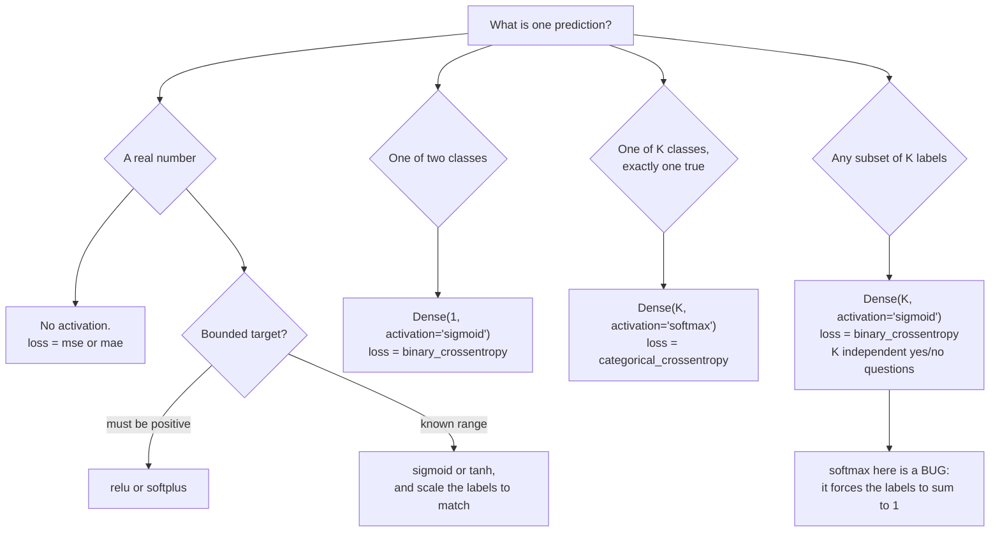

import DataCampExercise from "../../../../components/DataCampExercise.astro";
import Figure from "../../../../components/Figure.astro";
import Quiz from "../../../../components/Quiz.astro";

Every layer you have built so far ends with `activation="relu"` or `"softmax"`. This
page is about that small non-linear function, and it makes three claims with numbers
attached: without it a deep network is *algebraically* one layer, the choice of
activation decides whether a deep network trains at all, and the usual advice
("always ReLU") does not survive contact with the measurement.

## What you'll learn

- Why stacking linear layers collapses into a single one — proved in two lines and
  verified to $8.88 \times 10^{-16}$.
- The exact derivative of each activation, and why the sigmoid's ceiling of **0.25**
  is the whole vanishing-gradient story.
- The gradient that actually reaches layer 1 of an 8-layer network: **72,334× smaller**
  with sigmoid than with tanh or ReLU, measured before a single update.
- Softmax and cross-entropy derived together, ending in the gradient
  $\hat{\mathbf{p}} - \mathbf{y}$ — checked against a numeric gradient to $10^{-10}$.
- How to pick the output layer from the *shape of the problem*, not from habit.
- Two measured results that contradict the folklore: **tanh does not degrade at depth 8**
  (0.8782 against ReLU's 0.8502), and **dead ReLU units stayed under 4%** at every
  learning rate tested.

## Why a network needs a non-linearity at all

Take two `Dense` layers with no activation. The first computes
$\mathbf{h} = \mathbf{x}\mathbf{W}_1 + \mathbf{b}_1$, the second
$\mathbf{y} = \mathbf{h}\mathbf{W}_2 + \mathbf{b}_2$. Substitute:

$$
\mathbf{y} = (\mathbf{x}\mathbf{W}_1 + \mathbf{b}_1)\mathbf{W}_2 + \mathbf{b}_2
           = \mathbf{x}\underbrace{(\mathbf{W}_1\mathbf{W}_2)}_{\mathbf{W}'}
           + \underbrace{(\mathbf{b}_1\mathbf{W}_2 + \mathbf{b}_2)}_{\mathbf{b}'}
$$

The composition is $\mathbf{x}\mathbf{W}' + \mathbf{b}'$ — a single linear layer with
$\mathbf{W}' = \mathbf{W}_1\mathbf{W}_2$ and
$\mathbf{b}' = \mathbf{b}_1\mathbf{W}_2 + \mathbf{b}_2$. This is not an approximation
or a rule of thumb; it is matrix multiplication being associative. Stack a hundred
linear layers and the same substitution collapses all of them.

Run it and the two agree to floating-point noise:

```python title="linear_collapse.py" showLineNumbers{1}
import numpy as np

rng = np.random.default_rng(0)
W1, b1 = rng.normal(size=(3, 4)), rng.normal(size=4)
W2, b2 = rng.normal(size=(4, 2)), rng.normal(size=2)
x = rng.normal(size=(5, 3))

stacked = (x @ W1 + b1) @ W2 + b2            # two layers
W_eq, b_eq = W1 @ W2, b1 @ W2 + b2           # one equivalent layer
collapsed = x @ W_eq + b_eq

print("max difference:", f"{np.abs(stacked - collapsed).max():.2e}")
# max difference: 8.88e-16
print("equivalent layer:", W_eq.shape, b_eq.shape)
# equivalent layer: (3, 2) (2,)
```

**What that costs on real data.** Three-class spiral, 450 training points, two hidden
layers of 32 units, 120 epochs, identical seeds — the only difference is whether the
hidden layers have an activation:

| Model | Parameters | Test accuracy |
| --- | --- | --- |
| 2 hidden layers, **no activation** | 1,251 | 0.7000 |
| 2 hidden layers, **ReLU** | 1,251 | **0.9933** |
| a single `Dense(3)` layer | 9 | 0.6667 |

The linear stack carries 139× more parameters than the single layer and buys 0.0333
accuracy for them — noise from a different optimisation path, not capacity. Adding
`relu` to the *same 1,251 parameters* buys 0.2933. The parameters were never the
constraint; the linearity was.

## The four activations, and what their derivatives cost

$$
\sigma(z) = \frac{1}{1 + e^{-z}}
\qquad
\tanh(z) = \frac{e^{z} - e^{-z}}{e^{z} + e^{-z}}
\qquad
\mathrm{ReLU}(z) = \max(0, z)
$$

Backpropagation multiplies one derivative per layer, so the derivative — not the
activation — decides what happens at depth:

$$
\sigma'(z) = \sigma(z)\bigl(1 - \sigma(z)\bigr)
\qquad
\tanh'(z) = 1 - \tanh^{2}(z)
\qquad
\mathrm{ReLU}'(z) = \begin{cases} 1 & z > 0 \\ 0 & z < 0 \end{cases}
$$

$\sigma(z)(1-\sigma(z))$ is a product of two numbers that sum to 1, so it is largest
when both are $\tfrac{1}{2}$:

$$
\max_z \sigma'(z) = \tfrac{1}{2} \cdot \tfrac{1}{2} = 0.25
$$

<Figure
  src="/images/dl/phase-01-foundations/activation-functions/activation-curves"
  alt="Left panel: sigmoid and tanh S-curves, ReLU as a thick hinge at zero, leaky ReLU dashed on top of it. Right panel: their derivatives, with tanh peaking at 1.0, ReLU flat at 1.0 for positive inputs, and sigmoid peaking at only 0.25 against a dashed reference line."
  title="The activation on the left; the number backpropagation actually multiplies by on the right"
  caption="Leaky ReLU is drawn dashed because it is identical to ReLU except for a 0.01 slope on the negative side. The right panel is the one that matters: tanh's derivative reaches 1.0 at the origin, ReLU's is exactly 1.0 for every positive input, and sigmoid's can never exceed 0.25 anywhere."
/>

That ceiling compounds. A gradient crossing $k$ sigmoid layers is multiplied by at
most $0.25^{k}$:

| Layers crossed | Best case for sigmoid, $0.25^{k}$ | ReLU on active units, $1^{k}$ |
| --- | --- | --- |
| 1 | 0.25 | 1.0 |
| 2 | 0.0625 | 1.0 |
| 4 | $3.906 \times 10^{-3}$ | 1.0 |
| 8 | $1.526 \times 10^{-5}$ | 1.0 |
| 16 | $2.328 \times 10^{-10}$ | 1.0 |

And that is the *best* case, at $z = 0$; anywhere else the factor is smaller.

## The gradient that actually reaches layer 1

The table above is arithmetic. This is a measurement: an 8-hidden-layer network on
MNIST, one batch of 256, mean $\lvert \partial L / \partial \mathbf{W} \rvert$ per
layer, **before any training** — so nothing here is the optimiser's fault.

<Figure
  src="/images/dl/phase-01-foundations/activation-functions/gradient-by-layer"
  alt="Log-scale plot of mean absolute weight gradient against layer index for three activations. The sigmoid line climbs five orders of magnitude from layer 1 to layer 9; the tanh and relu lines are essentially flat across all nine layers."
  title="Nine layers, three activations, one batch"
  caption="Sigmoid's first layer receives a gradient of 4.89e-08 while its last receives 2.02e-02 — a factor of 72,334. The tanh and ReLU curves are flat, which is the entire practical argument for both: the update reaching layer 1 is the same order of magnitude as the update reaching layer 9."
/>

| Activation | layer 1 | layer 8 | ratio (layer 1 ÷ layer 8) |
| --- | --- | --- | --- |
| sigmoid | $4.89 \times 10^{-8}$ | $3.54 \times 10^{-3}$ | $1.38 \times 10^{-5}$ |
| tanh | $2.56 \times 10^{-3}$ | $5.14 \times 10^{-3}$ | 0.498 |
| relu | $2.59 \times 10^{-4}$ | $2.23 \times 10^{-4}$ | 1.16 |

Note what the sigmoid network is *not* doing: it is not saturated. Measured on 1,000
test images at initialisation, **0.0000** of its activations exceed 0.99 in absolute
value, at layer 1 and at layer 8. The gradient is tiny because of the 0.25 ceiling
multiplying eight times, not because any unit is stuck. Saturation makes it worse
later; the arithmetic is already fatal at initialisation.

## Does it change the accuracy? Measured

Same width, same data, same epochs, three seeds each — only the activation and the
depth change:

<Figure
  src="/images/dl/phase-01-foundations/activation-functions/activation-depth"
  alt="Grouped bar chart of MNIST validation accuracy for sigmoid, tanh and relu at 2 and 8 hidden layers. Sigmoid falls from 0.7402 to 0.1563 when deepened; tanh holds at 0.8773 and 0.8782; relu goes from 0.8803 to 0.8502."
  title="MNIST validation accuracy, 8,000 rows, 4 epochs, 3 seeds (bars are the mean, whiskers the range)"
  caption="Sigmoid at depth 8 collapses to 0.1563 — barely above the 0.10 you get by always guessing one class. tanh is unmoved by the extra six layers. ReLU loses 0.03 at depth 8 in this budget, which is a real result and not the one the folklore predicts."
/>

| Activation | 2 hidden layers | 8 hidden layers |
| --- | --- | --- |
| sigmoid | 0.7402 (0.7295–0.7590) | **0.1563** (0.1025–0.1865) |
| tanh | 0.8773 (0.8745–0.8815) | **0.8782** (0.8670–0.8865) |
| relu | **0.8803** (0.8785–0.8815) | 0.8502 (0.8295–0.8625) |

Three readings, and the third is the uncomfortable one:

**Depth is what makes the activation matter.** At two layers, sigmoid is 0.14 behind
and everything else is within noise. At eight, sigmoid stops learning entirely.

**tanh did not degrade.** 0.8782 at depth 8 against 0.8773 at depth 2 — the extra six
layers cost nothing measurable. Its derivative reaches 1.0 at the origin and its
outputs are zero-centred, which is exactly what the gradient figure shows.

**ReLU lost 0.0301 going deep, and lost to tanh at depth 8.** "Always use ReLU" is
folklore at this scale. ReLU wins on cost (a comparison and a copy, no exponential)
and it wins at the widths and epoch budgets where modern networks live, but on *this*
measurement it is second. Report what you measure.

## Softmax and cross-entropy, derived together

Softmax turns $K$ real-valued logits into a distribution:

$$
\mathrm{softmax}(\mathbf{z})_i = \frac{e^{z_i}}{\sum_{j=1}^{K} e^{z_j}}
$$

Every output is positive and they sum to 1 by construction. Paired with it,
categorical cross-entropy scores the prediction against a one-hot target
$\mathbf{y}$:

$$
L = -\sum_{i=1}^{K} y_i \log \hat{p}_i = -\log \hat{p}_c
$$

for true class $c$ — only one term survives, because $\mathbf{y}$ is one-hot.

### Worked by hand

Logits $\mathbf{z} = [2.0,\ 1.0,\ 0.1]$:

$$
e^{\mathbf{z}} = [7.389056,\ 2.718282,\ 1.105171],
\qquad
\textstyle\sum_j e^{z_j} = 11.212509
$$

$$
\hat{\mathbf{p}} = [0.659001,\ 0.242433,\ 0.098566]
$$

The loss depends entirely on which class is true:

| True class | $\hat{p}_c$ | $L = -\log \hat{p}_c$ |
| --- | --- | --- |
| 0 | 0.659001 | 0.417030 |
| 1 | 0.242433 | 1.417030 |
| 2 | 0.098566 | 2.317030 |

Note the spacing: the differences are exactly $\log$ ratios of the probabilities, so
being confidently wrong is punished without bound while being confidently right
approaches zero loss but never reaches it.

### The gradient is a subtraction

Differentiate the pair together and everything cancels:

$$
\frac{\partial L}{\partial z_i} = \hat{p}_i - y_i
$$

For our example with true class 0, $\hat{\mathbf{p}} - \mathbf{y} =
[-0.340999,\ 0.242433,\ 0.098566]$. A central-difference gradient of the same loss
gives the same three numbers to $1.05 \times 10^{-10}$. Two properties fall out for
free: the components sum to exactly zero (softmax outputs are constrained to sum to
1, so pushing one logit up must push others down), and no derivative of the
activation appears anywhere — which is why this pairing trains when
sigmoid-plus-squared-error does not.

:::caution[Never apply softmax twice]
`loss="categorical_crossentropy"` expects probabilities; `from_logits=True` expects
raw logits and applies the softmax internally, in a numerically stable way. Doing both
— softmax in the last layer *and* `from_logits=True` — silently trains a model on
softmax-of-softmax, which flattens the distribution and quietly costs accuracy with no
error message.
:::

### Why the implementation subtracts the max

$e^{1000}$ overflows to `inf` in float64, and `inf / inf` is `nan`. Since softmax is
unchanged by shifting every logit by a constant, subtract the largest one first:

$$
\mathrm{softmax}(\mathbf{z})_i
= \frac{e^{z_i - \max_j z_j}}{\sum_j e^{z_j - \max_j z_j}}
$$

```python title="stable_softmax.py" showLineNumbers{1}
import numpy as np

def softmax(v):
    shifted = v - v.max()          # the whole trick: largest exponent becomes 0
    exponent = np.exp(shifted)
    return exponent / exponent.sum()

large = np.array([1000.0, 999.0, 998.0])
print(softmax(large))                                  # [0.665241 0.244728 0.090031]
print(np.exp(large) / np.exp(large).sum())             # [nan nan nan]
```

### Temperature: the same logits, a different distribution

Dividing the logits by a temperature $T$ before the softmax rescales confidence
without changing the ranking. It is how text generation trades safety for surprise,
and it appears again in Phase 06:

| $T$ | probabilities | top probability |
| --- | --- | --- |
| 0.25 | [0.9815, 0.0180, 0.0005] | 0.9815 |
| 0.50 | [0.8638, 0.1169, 0.0193] | 0.8638 |
| 1.00 | [0.6590, 0.2424, 0.0986] | 0.6590 |
| 2.00 | [0.5017, 0.3043, 0.1940] | 0.5017 |
| 10.00 | [0.3661, 0.3312, 0.3027] | 0.3661 |

As $T \to 0$ softmax becomes $\arg\max$; as $T \to \infty$ it becomes uniform.

## Choosing the output layer

The output activation is not a preference — it is determined by what a prediction
*is* for your problem:



The bottom-right branch is the one that bites. Tagging an email as both "spam" and
"urgent" needs two independent sigmoids; softmax would force
$P(\text{spam}) + P(\text{urgent}) = 1$, encoding "it cannot be both" into the
architecture:

```python title="multilabel_output.py" showLineNumbers{1}
from tensorflow import keras

model = keras.Sequential([
    keras.layers.Input((10,)),
    keras.layers.Dense(16, activation="relu"),
    keras.layers.Dense(2, activation="sigmoid"),      # 2 independent labels
])
model.compile(loss="binary_crossentropy", optimizer="rmsprop", metrics=["accuracy"])
```

For hidden layers the default is ReLU, with tanh worth trying whenever the network is
deep and unnormalised — the measurement above is a direct argument for testing both
rather than assuming.

## See it move

The first sketch shows the shapes; the second shows the compounding that the shapes
imply. Drag the depth slider and watch a gradient of 1.0 shrink as it crosses layers.

```p5 title="Activation functions reshape the signal" desc="ReLU clips negatives to zero, sigmoid squashes to 0..1, tanh squashes to -1..1. A sweeping probe shows what each function outputs for the same input, in real time." height="280"
const PERIOD = 200;
function relu(x) { return x > 0 ? Math.min(x, 5) / 5 : 0; }
function sigmoid(x) { return 1 / (1 + Math.exp(-x)); }
function tanhFn(x) { return Math.tanh(x); }
function setup() {
  createCanvas(600, 280);
  textFont("monospace");
}
function draw() {
  background(13, 17, 23);
  const gx = 42, gy = 20, gw = width - 84, gh = height - 56;
  stroke(60, 70, 84);
  strokeWeight(1);
  line(gx, gy + gh / 2, gx + gw, gy + gh / 2);
  line(gx + gw / 2, gy, gx + gw / 2, gy + gh);
  const px = (x) => gx + gw / 2 + (x / 5) * (gw / 2);
  const py = (y) => gy + gh / 2 - (y / 1.2) * (gh / 2);
  function plot(fn, col, label, ly) {
    stroke(col[0], col[1], col[2]);
    strokeWeight(2.5);
    noFill();
    beginShape();
    for (let x = -5; x <= 5; x += 0.1) vertex(px(x), py(constrain(fn(x), -1.2, 1.2)));
    endShape();
    noStroke();
    fill(col[0], col[1], col[2]);
    textAlign(LEFT, CENTER);
    textSize(12);
    text(label, gx + gw - 80, ly);
  }
  const curves = [
    { fn: relu, col: [120, 200, 120], label: "ReLU", ly: gy + 14 },
    { fn: sigmoid, col: [75, 139, 190], label: "sigmoid", ly: gy + 32 },
    { fn: tanhFn, col: [255, 211, 67], label: "tanh", ly: gy + 50 },
  ];
  for (const c of curves) plot(c.fn, c.col, c.label, c.ly);

  const t = (frameCount % PERIOD) / PERIOD;
  const x = lerp(-5, 5, (Math.cos(TWO_PI * t - PI) + 1) / 2);
  stroke(230, 230, 230, 140);
  strokeWeight(1);
  line(px(x), gy, px(x), gy + gh);
  noStroke();
  for (const c of curves) {
    const y = constrain(c.fn(x), -1.2, 1.2);
    fill(c.col[0], c.col[1], c.col[2]);
    ellipse(px(x), py(y), 9, 9);
  }
  fill(230);
  textAlign(CENTER, TOP);
  textSize(12);
  text("x = " + x.toFixed(2), px(x), gy + gh + 6);
  textAlign(LEFT, CENTER);
}
```

```p5 title="One derivative per layer, multiplied" desc="A gradient of 1.0 enters at the output and crosses layer after layer, multiplied by each activation's derivative. The sigmoid chain collapses within a few layers; tanh and ReLU arrive intact. Drag to change the depth." height="400"
const MAX_DEPTH = 16;
let depth = 8;
let dragging = false;
// Derivative factors: sigmoid's best case, tanh at a typical pre-activation,
// and ReLU on a unit that is active.
const CHAINS = [
  { name: "sigmoid", factor: 0.25, col: [75, 139, 190] },
  { name: "tanh", factor: 0.9, col: [120, 200, 120] },
  { name: "relu (active)", factor: 1.0, col: [255, 176, 67] },
];

function setup() {
  createCanvas(620, 400);
  textFont("monospace");
}
function draw() {
  background(13, 17, 23);
  fill(215);
  textSize(12);
  textAlign(LEFT, TOP);
  text("layers crossed: " + depth, 24, 14);

  noStroke();
  fill(30, 36, 44);
  rect(24, 40, 420, 8, 4);
  fill(75, 139, 190);
  rect(24, 40, ((depth - 1) / (MAX_DEPTH - 1)) * 420, 8, 4);
  fill(235);
  ellipse(24 + ((depth - 1) / (MAX_DEPTH - 1)) * 420, 44, 14, 14);
  fill(105);
  textSize(9);
  textAlign(CENTER, TOP);
  for (let d = 1; d <= MAX_DEPTH; d += 3) {
    text(d, 24 + ((d - 1) / (MAX_DEPTH - 1)) * 420, 54);
  }

  const x0 = 70, x1 = 560, y0 = 92, y1 = 300;
  const px = (i) => x0 + (i / MAX_DEPTH) * (x1 - x0);
  // log scale from 1 down to 1e-10
  const py = (v) => y0 + (Math.log10(1 / Math.max(v, 1e-11)) / 11) * (y1 - y0);

  stroke(34, 40, 48);
  strokeWeight(1);
  for (let e = 0; e >= -10; e -= 2) {
    const y = py(Math.pow(10, e));
    line(x0, y, x1, y);
    noStroke();
    fill(100);
    textSize(9);
    textAlign(RIGHT, CENTER);
    text(e === 0 ? "1" : "1e" + e, x0 - 6, y);
    stroke(34, 40, 48);
  }

  for (const chain of CHAINS) {
    stroke(chain.col[0], chain.col[1], chain.col[2]);
    strokeWeight(2.2);
    noFill();
    beginShape();
    for (let i = 0; i <= depth; i++) vertex(px(i), py(Math.pow(chain.factor, i)));
    endShape();
    const end = Math.pow(chain.factor, depth);
    noStroke();
    fill(chain.col[0], chain.col[1], chain.col[2]);
    ellipse(px(depth), py(end), 10, 10);
  }

  noStroke();
  fill(130);
  textSize(10);
  textAlign(CENTER, TOP);
  text("layers crossed (output on the left, input on the right)", (x0 + x1) / 2, y1 + 10);

  const rows = CHAINS.map((c) => [c, Math.pow(c.factor, depth)]);
  for (let i = 0; i < rows.length; i++) {
    const [chain, value] = rows[i];
    const y = 330 + i * 20;
    fill(chain.col[0], chain.col[1], chain.col[2]);
    textSize(11);
    textAlign(LEFT, TOP);
    text(chain.name.padEnd(14, " ") + "x" + chain.factor.toFixed(2) + " per layer", 24, y);
    fill(value < 1e-4 ? color(232, 122, 122) : color(215));
    textAlign(LEFT, TOP);
    text("gradient survives as " + value.toExponential(2), 300, y);
  }
}
function mousePressed() { if (Math.abs(mouseY - 44) < 16) dragging = true; }
function mouseDragged() {
  if (dragging) depth = Math.max(1, Math.round(1 + ((mouseX - 24) / 420) * (MAX_DEPTH - 1)));
}
function mouseReleased() { dragging = false; }
```

At depth 8 the sigmoid chain is down to $1.53 \times 10^{-5}$ of its original size
while ReLU is unchanged — which is the same conclusion the measured figure reached by
a completely different route, from real gradients in a real network.

## Pitfalls

**Softmax on a multilabel problem.** Forces the predicted labels to sum to 1. Use one
sigmoid per label. This is an architecture bug, not a tuning issue — no amount of
training fixes it.

**Applying softmax twice.** A softmax output layer plus `from_logits=True` is
softmax-of-softmax. It trains, it never errors, and it silently flattens every
prediction.

**Reading "dead ReLU" as a routine emergency.** Measured on four learning rates,
after 4 epochs on 8,000 MNIST rows with a 4×64 network:

| Learning rate | Dead units | Test accuracy |
| --- | --- | --- |
| 0.001 | 3 / 256 (1.17%) | 0.1210 |
| 0.01 | 6 / 256 (2.34%) | 0.4500 |
| 0.1 | 9 / 256 (3.52%) | 0.8640 |
| 0.5 | 5 / 256 (1.95%) | 0.8690 |

Dead units never exceeded 3.52%, and they did not rise monotonically with the learning
rate. What actually separated these runs was training progress: at lr 0.001 the network
had barely started (0.1210). Dead ReLUs are real and worth knowing about; on this
evidence they were not what limited any of these models. Measure before reaching for
leaky ReLU.

**Expecting sigmoid hidden layers to work if you just train longer.** At depth 8 the
first layer receives $4.89 \times 10^{-8}$ of gradient at initialisation. Longer
training multiplies a number that is already negligible.

**Assuming ReLU is always the best hidden activation.** On the measurement on this
page, tanh beat it at depth 8 (0.8782 against 0.8502). Try both; it is two characters
of code.

**Forgetting to scale labels when the output is bounded.** A sigmoid output cannot
emit 350,000. If the output activation bounds the range, the labels have to live in
that range too.

## Recap

- Two linear layers are one linear layer:
  $\mathbf{W}' = \mathbf{W}_1\mathbf{W}_2$, verified to $8.88\times10^{-16}$. On the
  spiral, adding `relu` to the same 1,251 parameters moved accuracy from 0.7000 to
  **0.9933**.
- $\sigma'(z) \le 0.25$ everywhere, so eight sigmoid layers multiply a gradient by at
  most $1.526\times10^{-5}$. Measured in a real 8-layer network, layer 1 received
  **72,334× less** gradient than layer 8.
- Accuracy follows: sigmoid **0.7402 → 0.1563** from depth 2 to 8, tanh **0.8773 →
  0.8782**, ReLU **0.8803 → 0.8502**.
- Softmax with cross-entropy has gradient $\hat{\mathbf{p}} - \mathbf{y}$, which
  contains no activation derivative — checked against a numeric gradient to
  $1.05\times10^{-10}$.
- Subtract the max before exponentiating, or large logits produce `nan`.
- The output layer follows from the problem shape: none for regression, one sigmoid
  for binary, softmax for single-label multiclass, K sigmoids for multilabel.
- Dead ReLU units stayed under 4% at every learning rate tested here — check yours
  rather than assuming.

<Quiz
  questions={[
    {
      q: "You stack five Dense layers with no activation function. What have you built?",
      options: [
        "A deep network that needs more epochs to train",
        "Exactly one linear layer — the five weight matrices multiply into a single W' and the biases into a single b', verified here to 8.88e-16",
        "A network that will overfit because of its depth",
        "A network equivalent to one layer only if all the layers are the same width",
      ],
      answer: 1,
      explain: "Matrix multiplication is associative, so (xW1+b1)W2+b2 = xW1W2 + (b1W2+b2). The collapse holds for any widths and any depth. The measurement on this page: 1,251 parameters with no activation scored 0.7000 on the spiral, against 0.9933 for the same 1,251 with relu.",
    },
    {
      q: "Why does a sigmoid network with 8 hidden layers fail to train, on the evidence here?",
      options: [
        "Its units are saturated at initialisation",
        "Because the sigmoid derivative can never exceed 0.25, so eight layers multiply the gradient by at most 1.5e-05 — measured, layer 1 received 72,334x less gradient than layer 8, while 0.0000 of its activations were above 0.99",
        "Sigmoid outputs are not zero-centred, which is the whole problem",
        "The learning rate is always too low for sigmoid",
      ],
      answer: 1,
      explain: "Saturation was measured at exactly 0.0000 of activations above 0.99 at initialisation — the units are not stuck. The 0.25 ceiling compounding across eight layers is enough on its own, which is why the failure is visible before the first update.",
    },
    {
      q: "Softmax paired with categorical cross-entropy has gradient dL/dz = p - y. Why does that matter?",
      options: [
        "It makes the loss smaller",
        "No activation derivative appears in it, so nothing shrinks the signal at the output layer, and the components sum to exactly zero",
        "It means you can skip the softmax at inference",
        "It only holds when there are exactly two classes",
      ],
      answer: 1,
      explain: "The activation derivative cancels against the loss derivative. Contrast sigmoid-plus-squared-error, where a sigma'(z) factor of at most 0.25 multiplies every output gradient. The zero sum follows from softmax outputs being constrained to sum to 1.",
    },
    {
      q: "An email can be both 'spam' and 'urgent'. What output layer do you use for two such labels?",
      options: [
        "Dense(2, activation='softmax') with categorical_crossentropy",
        "Dense(2, activation='sigmoid') with binary_crossentropy — two independent yes/no questions whose probabilities need not sum to 1",
        "Dense(1, activation='sigmoid') and threshold it twice",
        "Dense(2) with no activation and mse",
      ],
      answer: 1,
      explain: "Softmax would force P(spam) + P(urgent) = 1, encoding 'it cannot be both' into the architecture. Independent sigmoids let both be 0.9 at once.",
    },
    {
      q: "Your softmax returns nan for a batch of large logits. What is the fix?",
      options: [
        "Lower the learning rate",
        "Subtract the maximum logit before exponentiating — softmax is invariant to that shift, and it turns exp(1000) into exp(0)",
        "Clip the logits to [-1, 1]",
        "Switch to float64",
      ],
      answer: 1,
      explain: "exp(1000) overflows to inf and inf/inf is nan. Shifting by the max leaves the result unchanged mathematically: the same logits give [0.665241, 0.244728, 0.090031] instead of nan. Clipping would change the distribution; float64 only moves the overflow point.",
    },
  ]}
/>

## Next

You now know what each activation does to the signal and to the gradient. Continue to
**Building Neural Networks with Keras (Sequential and Functional API)** to see how
these layers get assembled into a model — and then to
[How Neural Networks Learn](/deep-learning/phase-01---neural-network-foundations/how-neural-networks-learn-gradient-based-optimization/),
where the gradients measured here are actually used to update weights.

## 🧪 Try It Yourself

### Exercise 1 – Every activation and its derivative

<DataCampExercise
  lang="python"
  hint={`The sigmoid derivative is sigma(z) * (1 - sigma(z)); the tanh derivative is 1 - tanh(z) ** 2.`}
  code={`# Task: Exercise 1 - Every activation and its derivative
import numpy as np

z = np.array([-2.0, -0.5, 0.0, 0.5, 2.0])


def sigmoid(x):
    return 1 / (1 + np.exp(-x))


activations = {
    "sigmoid": sigmoid(z),
    "tanh": np.tanh(z),
    "relu": np.maximum(z, 0.0),
    "leaky": np.where(z > 0, z, 0.01 * z),
}
derivatives = {
    "sigmoid": sigmoid(z) * (1 - ___),          # replace ___ with sigmoid(z)
    "tanh": 1 - np.tanh(z) ** 2,
    "relu": (z > 0).astype(float),
    "leaky": np.where(z > 0, 1.0, 0.01),
}
print("z            ", z)
for name in activations:
    print(f"{name:8s} f(z)  {np.round(activations[name], 4)}")
    print(f"{name:8s} f'(z) {np.round(derivatives[name], 4)}")
print("largest sigmoid derivative anywhere:", round(float(derivatives["sigmoid"].max()), 4))

# -- Expected Output -------------------------------------------
# z             [-2.  -0.5  0.   0.5  2. ]
# sigmoid  f(z)  [0.1192 0.3775 0.5    0.6225 0.8808]
# sigmoid  f'(z) [0.105 0.235 0.25  0.235 0.105]
# tanh     f(z)  [-0.964  -0.4621  0.      0.4621  0.964 ]
# tanh     f'(z) [0.0707 0.7864 1.     0.7864 0.0707]
# relu     f(z)  [0.  0.  0.  0.5 2. ]
# relu     f'(z) [0. 0. 0. 1. 1.]
# leaky    f(z)  [-0.02  -0.005  0.     0.5    2.   ]
# leaky    f'(z) [0.01 0.01 0.01 1.   1.  ]
# largest sigmoid derivative anywhere: 0.25
# --------------------------------------------------------------`}
  solution={`import numpy as np

z = np.array([-2.0, -0.5, 0.0, 0.5, 2.0])


def sigmoid(x):
    return 1 / (1 + np.exp(-x))


activations = {
    "sigmoid": sigmoid(z),
    "tanh": np.tanh(z),
    "relu": np.maximum(z, 0.0),
    "leaky": np.where(z > 0, z, 0.01 * z),
}
derivatives = {
    "sigmoid": sigmoid(z) * (1 - sigmoid(z)),
    "tanh": 1 - np.tanh(z) ** 2,
    "relu": (z > 0).astype(float),
    "leaky": np.where(z > 0, 1.0, 0.01),
}
print("z            ", z)
for name in activations:
    print(f"{name:8s} f(z)  {np.round(activations[name], 4)}")
    print(f"{name:8s} f'(z) {np.round(derivatives[name], 4)}")
print("largest sigmoid derivative anywhere:", round(float(derivatives["sigmoid"].max()), 4))`}
  sct={`test_output_contains("largest sigmoid derivative anywhere: 0.25")
success_msg("0.25 exactly, at z = 0. Every sigmoid layer a gradient crosses multiplies it by at most this.")`}
  height={360}
/>

### Exercise 2 – Collapse a linear stack yourself

<DataCampExercise
  lang="python"
  hint={`The equivalent weight matrix is W1 @ W2 and the equivalent bias is b1 @ W2 + b2.`}
  code={`# Task: Exercise 2 - Collapse a linear stack yourself
import numpy as np

rng = np.random.default_rng(0)
W1, b1 = rng.normal(size=(3, 4)), rng.normal(size=4)
W2, b2 = rng.normal(size=(4, 2)), rng.normal(size=2)
x = rng.normal(size=(5, 3))

stacked = (x @ W1 + b1) @ W2 + b2
W_eq = W1 ___ W2                        # replace ___ with @
b_eq = b1 @ W2 + b2
collapsed = x @ W_eq + b_eq

print("stacked shape  ", stacked.shape)
print("collapsed shape", collapsed.shape)
print("equivalent single layer: W", W_eq.shape, " b", b_eq.shape)
print("max absolute difference:", f"{np.abs(stacked - collapsed).max():.2e}")
print("identical to floating-point tolerance:", bool(np.allclose(stacked, collapsed)))

# -- Expected Output -------------------------------------------
# stacked shape   (5, 2)
# collapsed shape (5, 2)
# equivalent single layer: W (3, 2)  b (2,)
# max absolute difference: 8.88e-16
# identical to floating-point tolerance: True
# --------------------------------------------------------------`}
  solution={`import numpy as np

rng = np.random.default_rng(0)
W1, b1 = rng.normal(size=(3, 4)), rng.normal(size=4)
W2, b2 = rng.normal(size=(4, 2)), rng.normal(size=2)
x = rng.normal(size=(5, 3))

stacked = (x @ W1 + b1) @ W2 + b2
W_eq = W1 @ W2
b_eq = b1 @ W2 + b2
collapsed = x @ W_eq + b_eq

print("stacked shape  ", stacked.shape)
print("collapsed shape", collapsed.shape)
print("equivalent single layer: W", W_eq.shape, " b", b_eq.shape)
print("max absolute difference:", f"{np.abs(stacked - collapsed).max():.2e}")
print("identical to floating-point tolerance:", bool(np.allclose(stacked, collapsed)))`}
  sct={`test_output_contains("8.88e-16")
success_msg("Two layers, four parameter arrays, and a single 3x2 matrix that does the same job. This is why the activation is not optional.")`}
  height={300}
/>

### Exercise 3 – A softmax that survives large logits

<DataCampExercise
  lang="python"
  hint={`Subtract v.max() from v before exponentiating. Softmax is unchanged by a constant shift.`}
  code={`# Task: Exercise 3 - A softmax that survives large logits
import numpy as np


def softmax(v):
    shifted = v - v.___()               # replace ___ with max
    exponent = np.exp(shifted)
    return exponent / exponent.sum()


small = np.array([2.0, 1.0, 0.1])
large = np.array([1000.0, 999.0, 998.0])

print("stable softmax on [2, 1, 0.1]     :", np.round(softmax(small), 6))
print("stable softmax on [1000, 999, 998]:", np.round(softmax(large), 6))
with np.errstate(over="ignore", invalid="ignore"):
    naive = np.exp(large) / np.exp(large).sum()
print("naive version on the large logits :", naive)
print("both sum to 1:", round(float(softmax(small).sum()), 6),
      round(float(softmax(large).sum()), 6))

# -- Expected Output -------------------------------------------
# stable softmax on [2, 1, 0.1]     : [0.659001 0.242433 0.098566]
# stable softmax on [1000, 999, 998]: [0.665241 0.244728 0.090031]
# naive version on the large logits : [nan nan nan]
# both sum to 1: 1.0 1.0
# --------------------------------------------------------------`}
  solution={`import numpy as np


def softmax(v):
    shifted = v - v.max()
    exponent = np.exp(shifted)
    return exponent / exponent.sum()


small = np.array([2.0, 1.0, 0.1])
large = np.array([1000.0, 999.0, 998.0])

print("stable softmax on [2, 1, 0.1]     :", np.round(softmax(small), 6))
print("stable softmax on [1000, 999, 998]:", np.round(softmax(large), 6))
with np.errstate(over="ignore", invalid="ignore"):
    naive = np.exp(large) / np.exp(large).sum()
print("naive version on the large logits :", naive)
print("both sum to 1:", round(float(softmax(small).sum()), 6),
      round(float(softmax(large).sum()), 6))`}
  sct={`test_output_contains("[0.665241 0.244728 0.090031]")
success_msg("One subtraction turns nan into a valid distribution. This is what every framework's softmax does internally.")`}
  height={320}
/>

### Exercise 4 – Check the softmax + cross-entropy gradient

<DataCampExercise
  lang="python"
  hint={`The analytic gradient is the predicted distribution minus the one-hot target: probs - target.`}
  code={`# Task: Exercise 4 - Check the softmax + cross-entropy gradient
import numpy as np


def softmax(v):
    exponent = np.exp(v - v.max())
    return exponent / exponent.sum()


logits = np.array([2.0, 1.0, 0.1])
true_class = 0
probs = softmax(logits)
target = np.eye(3)[true_class]

analytic = probs - ___                  # replace ___ with target


def loss_at(v):
    return float(-np.log(softmax(v)[true_class]))


numeric = np.zeros(3)
step = 1e-6
for i in range(3):
    forward, backward = logits.copy(), logits.copy()
    forward[i] += step
    backward[i] -= step
    numeric[i] = (loss_at(forward) - loss_at(backward)) / (2 * step)

print("probabilities      ", np.round(probs, 6))
print("loss               ", round(loss_at(logits), 6))
print("analytic (p - y)   ", np.round(analytic, 6))
print("numeric            ", np.round(numeric, 6))
print("max difference     ", f"{np.abs(analytic - numeric).max():.2e}")
print("gradient sums to zero:", round(float(analytic.sum()), 10))

# -- Expected Output -------------------------------------------
# probabilities       [0.659001 0.242433 0.098566]
# loss                0.41703
# analytic (p - y)    [-0.340999  0.242433  0.098566]
# numeric             [-0.340999  0.242433  0.098566]
# max difference      1.05e-10
# gradient sums to zero: 0.0
# --------------------------------------------------------------`}
  solution={`import numpy as np


def softmax(v):
    exponent = np.exp(v - v.max())
    return exponent / exponent.sum()


logits = np.array([2.0, 1.0, 0.1])
true_class = 0
probs = softmax(logits)
target = np.eye(3)[true_class]

analytic = probs - target


def loss_at(v):
    return float(-np.log(softmax(v)[true_class]))


numeric = np.zeros(3)
step = 1e-6
for i in range(3):
    forward, backward = logits.copy(), logits.copy()
    forward[i] += step
    backward[i] -= step
    numeric[i] = (loss_at(forward) - loss_at(backward)) / (2 * step)

print("probabilities      ", np.round(probs, 6))
print("loss               ", round(loss_at(logits), 6))
print("analytic (p - y)   ", np.round(analytic, 6))
print("numeric            ", np.round(numeric, 6))
print("max difference     ", f"{np.abs(analytic - numeric).max():.2e}")
print("gradient sums to zero:", round(float(analytic.sum()), 10))`}
  sct={`test_output_contains("1.05e-10")
success_msg("A two-term derivation agrees with brute-force differentiation to ten decimal places, and the components sum to zero because softmax outputs must sum to one.")`}
  height={380}
/>

### Exercise 5 – Temperature reshapes the same logits

<DataCampExercise
  lang="python"
  hint={`Divide the logits by the temperature before the softmax: softmax(logits / temperature).`}
  code={`# Task: Exercise 5 - Temperature reshapes the same logits
import numpy as np


def softmax(v):
    exponent = np.exp(v - v.max())
    return exponent / exponent.sum()


logits = np.array([2.0, 1.0, 0.1])
print(f"{'T':>6} {'probabilities':>32} {'top prob':>9}")
for temperature in (0.25, 0.5, 1.0, 2.0, 10.0):
    scaled = softmax(logits ___ temperature)     # replace ___ with /
    print(f"{temperature:6.2f} {str(np.round(scaled, 4)):>32} {scaled.max():9.4f}")
print("low T sharpens toward the argmax; high T flattens toward uniform")

# -- Expected Output -------------------------------------------
#      T                    probabilities  top prob
#   0.25  [9.815e-01 1.800e-02 5.000e-04]    0.9815
#   0.50           [0.8638 0.1169 0.0193]    0.8638
#   1.00           [0.659  0.2424 0.0986]    0.6590
#   2.00           [0.5017 0.3043 0.194 ]    0.5017
#  10.00           [0.3661 0.3312 0.3027]    0.3661
# low T sharpens toward the argmax; high T flattens toward uniform
# --------------------------------------------------------------`}
  solution={`import numpy as np


def softmax(v):
    exponent = np.exp(v - v.max())
    return exponent / exponent.sum()


logits = np.array([2.0, 1.0, 0.1])
print(f"{'T':>6} {'probabilities':>32} {'top prob':>9}")
for temperature in (0.25, 0.5, 1.0, 2.0, 10.0):
    scaled = softmax(logits / temperature)
    print(f"{temperature:6.2f} {str(np.round(scaled, 4)):>32} {scaled.max():9.4f}")
print("low T sharpens toward the argmax; high T flattens toward uniform")`}
  sct={`test_output_contains("0.9815")
success_msg("The ranking never changes and the confidence changes completely. Phase 06 uses exactly this knob to trade coherence against variety in generated text.")`}
  height={320}
/>

### Exercise 6 – Count the silent units

<DataCampExercise
  lang="python"
  hint={`ReLU outputs exactly 0.0 for every negative pre-activation, so (outputs == 0).mean() is the silent fraction.`}
  code={`# Task: Exercise 6 - Count the silent units
import numpy as np
import tensorflow as tf

(x_train, y_train), _ = tf.keras.datasets.mnist.load_data()
x_train = x_train.reshape(-1, 784).astype("float32") / 255.0

for activation in ("relu", "tanh"):
    tf.keras.utils.set_random_seed(0)
    model = tf.keras.Sequential(
        [tf.keras.layers.Input((784,))]
        + [tf.keras.layers.Dense(32, activation=activation) for _ in range(8)]
        + [tf.keras.layers.Dense(10, activation="softmax")]
    )
    probe = tf.keras.Model(model.inputs, [layer.output for layer in model.layers[:-1]])
    outputs = [np.asarray(a) for a in probe.predict(x_train[:1000], verbose=0)]
    first_zero = float((outputs[0] ___ 0).mean())      # replace ___ with ==
    last_zero = float((outputs[-1] == 0).mean())
    print(f"{activation:5s} exactly-zero activations: layer 1 {first_zero:.4f}   "
          f"layer 8 {last_zero:.4f}")
print("ReLU discards about half its activations at initialisation, by construction")

# -- Expected Output -------------------------------------------
# relu  exactly-zero activations: layer 1 0.5233   layer 8 0.5515
# tanh  exactly-zero activations: layer 1 0.0000   layer 8 0.0000
# ReLU discards about half its activations at initialisation, by construction
# --------------------------------------------------------------`}
  solution={`import numpy as np
import tensorflow as tf

(x_train, y_train), _ = tf.keras.datasets.mnist.load_data()
x_train = x_train.reshape(-1, 784).astype("float32") / 255.0

for activation in ("relu", "tanh"):
    tf.keras.utils.set_random_seed(0)
    model = tf.keras.Sequential(
        [tf.keras.layers.Input((784,))]
        + [tf.keras.layers.Dense(32, activation=activation) for _ in range(8)]
        + [tf.keras.layers.Dense(10, activation="softmax")]
    )
    probe = tf.keras.Model(model.inputs, [layer.output for layer in model.layers[:-1]])
    outputs = [np.asarray(a) for a in probe.predict(x_train[:1000], verbose=0)]
    first_zero = float((outputs[0] == 0).mean())
    last_zero = float((outputs[-1] == 0).mean())
    print(f"{activation:5s} exactly-zero activations: layer 1 {first_zero:.4f}   "
          f"layer 8 {last_zero:.4f}")
print("ReLU discards about half its activations at initialisation, by construction")`}
  sct={`test_output_contains("0.5233")
success_msg("Half of ReLU's outputs are exactly zero at initialisation and that is normal — a symmetric pre-activation means half the units are negative. A unit is only 'dead' when it is zero for every input AND its gradient can never revive it.")`}
  height={380}
/>
