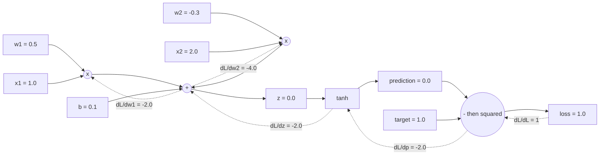

import DataCampExercise from "../../../../components/DataCampExercise.astro";
import Figure from "../../../../components/Figure.astro";
import Quiz from "../../../../components/Quiz.astro";

`tf.GradientTape()` looks like magic: you write arithmetic, ask for a gradient, and get
one. It is not magic — it is one small idea (record every operation, then walk the
recording backwards) plus one derivative rule per operation. This page builds the whole
thing, then checks it against TensorFlow on the same graph.

## What you'll learn

- Why a computation **graph** is the data structure differentiation needs.
- Reverse-mode autodiff in **60 lines**, one `_backward` closure per operation.
- Why gradients must **accumulate** with `+=`, verified on `a + a` and `a * a`.
- A gradient agreeing with `tf.GradientTape` to **0.00e+00** on the same expression.
- Why reverse mode, not forward mode: **one backward pass for a million parameters**.
- A 9-parameter network learning XOR with no framework at all — loss **1.766 → 0.000541**.

## The idea: record, then replay backwards

The chain rule says that if $L$ depends on $u$ which depends on $w$:

$$
\frac{\partial L}{\partial w} = \frac{\partial L}{\partial u} \cdot \frac{\partial u}{\partial w}
$$

To use it you need two things at every step: the **local derivative** of the operation,
and the derivative that has already arrived from above. So each value must remember
which operation produced it and from which inputs. That is a graph:



Solid arrows are the forward pass, dotted arrows the backward pass. Every dotted number
is the one this page computes, and every one is checkable by hand.

## The engine

Each `Value` holds its number, a gradient slot, its parents, and a closure that knows
how to push the gradient one step further back.

```python title="autograd.py" showLineNumbers{1}
import math


class Value:
    """A scalar that remembers how it was computed, so it can be differentiated."""

    def __init__(self, data, parents=(), op=""):
        self.data = float(data)
        self.grad = 0.0                 # filled in by backward()
        self._backward = lambda: None   # how to pass my gradient to my parents
        self._parents = tuple(parents)
        self._op = op

    def __add__(self, other):
        other = other if isinstance(other, Value) else Value(other)
        out = Value(self.data + other.data, (self, other), "+")

        def _backward():
            self.grad += out.grad          # d(a+b)/da = 1
            other.grad += out.grad         # d(a+b)/db = 1
        out._backward = _backward
        return out

    def __mul__(self, other):
        other = other if isinstance(other, Value) else Value(other)
        out = Value(self.data * other.data, (self, other), "*")

        def _backward():
            self.grad += other.data * out.grad     # d(ab)/da = b
            other.grad += self.data * out.grad     # d(ab)/db = a
        out._backward = _backward
        return out

    def __pow__(self, exponent):
        out = Value(self.data ** exponent, (self,), f"**{exponent}")

        def _backward():
            self.grad += exponent * self.data ** (exponent - 1) * out.grad
        out._backward = _backward
        return out

    def tanh(self):
        t = math.tanh(self.data)
        out = Value(t, (self,), "tanh")

        def _backward():
            self.grad += (1 - t * t) * out.grad    # tanh'(z) = 1 - tanh(z)^2
        out._backward = _backward
        return out

    def relu(self):
        out = Value(max(0.0, self.data), (self,), "relu")

        def _backward():
            self.grad += (out.data > 0) * out.grad
        out._backward = _backward
        return out

    def __neg__(self):
        return self * -1

    def __sub__(self, other):
        return self + (-(other if isinstance(other, Value) else Value(other)))

    def __truediv__(self, other):
        other = other if isinstance(other, Value) else Value(other)
        return self * other ** -1

    __radd__ = __add__
    __rmul__ = __mul__

    def backward(self):
        """Topologically sort the graph, then apply the chain rule once per node."""
        order, seen = [], set()

        def build(node):
            if id(node) in seen:
                return
            seen.add(id(node))
            for parent in node._parents:
                build(parent)
            order.append(node)          # parents land before children

        build(self)
        self.grad = 1.0                 # dL/dL = 1: the base case
        for node in reversed(order):    # children before parents
            node._backward()
        return order
```

Three details carry all the weight.

**The topological sort.** A node's gradient is only complete once *every* child has
contributed. Sorting the graph so parents appear before children, then walking it in
reverse, guarantees that. Without the sort you get partially-summed gradients that look
plausible and are wrong.

**`self.grad = 1.0` before the loop.** $\partial L / \partial L = 1$. Every other
gradient in the graph is derived from that one line.

**`+=`, never `=`.** A value used twice receives a gradient along each path.

## The smallest possible check

$f(a,b) = ab + a$ at $a = 3$, $b = 4$. By hand:
$\partial f/\partial a = b + 1 = 5$ and $\partial f/\partial b = a = 3$.

```python
a, b = Value(3.0), Value(4.0)
f = a * b + a
f.backward()
print(f.data, a.grad, b.grad)     # 15.0 5.0 3.0
```

Four nodes in the graph, both gradients exact. Note that $a$ appears twice and its
gradient is the *sum* of the two paths — $b$ from the multiply, $1$ from the add.

## A longer chain against calculus

$y = \tanh(x^3 + 3x)$ at $x = 0.5$. The analytic derivative is

$$
\frac{dy}{dx} = \bigl(1 - \tanh^2(x^3 + 3x)\bigr)\,(3x^2 + 3)
$$

| | Value |
| --- | --- |
| inner $x^3 + 3x$ | 1.625 |
| $y$ | 0.925346 |
| autograd $dy/dx$ | **0.5390038624** |
| analytic $dy/dx$ | **0.5390038624** |
| difference | 0.00e+00 |

(Evaluated at $x = 0.5$ deliberately — at $x = 2$ the tanh saturates, both derivatives
are 0.0000000000, and the "check" would be vacuous.)

One expression proves nothing about the other eight rules, so every one of them gets the
same treatment:

<Figure
  src="/images/dl/phase-01-foundations/autograd-from-scratch/gradient-check"
  alt="Horizontal bars on a log axis showing the absolute difference between each rule's autograd gradient and a central-difference reference. All nine bars sit between 2e-11 and 6e-10, far to the left of a dashed line marking 1e-9."
  title="Every rule the engine implements, against a central difference"
  caption="Nine rules, worst error 5.96e-10 on the cube. These errors are the finite-difference reference's, not the engine's: a central difference with a step of 1e-6 is accurate to roughly 1e-10, so this figure shows agreement to the limit of what the check can resolve. The chained case and the shared-node case matter most — they are where a wrong implementation shows up."
/>

## One neuron, one step, by hand

$w_1 = 0.5$, $w_2 = -0.3$, $b = 0.1$, inputs $(1, 2)$, target 1, loss
$(\tanh(z) - y)^2$:

$$
z = 0.5(1) + (-0.3)(2) + 0.1 = 0.0
\quad\Rightarrow\quad
\hat{y} = \tanh(0) = 0,
\quad
L = (0 - 1)^2 = 1
$$

Working backwards, $\partial L/\partial \hat{y} = 2(\hat{y} - y) = -2$, and
$\tanh'(0) = 1$, so $\partial L/\partial z = -2$. Then each weight's gradient is that
number times its input:

| Parameter | Gradient | After one step at $\eta = 0.1$ |
| --- | --- | --- |
| $w_1$ | $-2 \times 1 = -2.000000$ | 0.5 → **0.700000** |
| $w_2$ | $-2 \times 2 = -4.000000$ | −0.3 → **0.100000** |
| $b$ | $-2 \times 1 = -2.000000$ | 0.1 → **0.300000** |

$w_2$ gets twice the gradient of $w_1$ because its input is twice as large. That is the
whole reason feature scaling matters, visible in three numbers.

## The same graph in TensorFlow

```python title="against_tensorflow.py" showLineNumbers{1}
import tensorflow as tf

tw1, tw2, tb = tf.Variable(0.5), tf.Variable(-0.3), tf.Variable(0.1)
with tf.GradientTape() as tape:
    tz = tw1 * 1.0 + tw2 * 2.0 + tb
    tloss = (tf.tanh(tz) - 1.0) ** 2
print(tape.gradient(tloss, [tw1, tw2, tb]))
```

| Parameter | Ours | `tf.GradientTape` | Difference |
| --- | --- | --- | --- |
| $w_1$ | −2.00000000 | −2.00000000 | 0.00e+00 |
| $w_2$ | −4.00000000 | −4.00000000 | 0.00e+00 |
| $b$ | −2.00000000 | −2.00000000 | 0.00e+00 |

Identical to every printed digit. `GradientTape` is doing exactly what the 60 lines
above do; it just does it on tensors, with fused kernels, and without Python's overhead
per operation.

## Why reverse mode

There are two ways to apply the chain rule. **Forward mode** propagates derivatives
from inputs toward the output and costs one pass per *input*. **Reverse mode** starts at
the output and costs one pass per *output*:

| Parameters | Forward mode | Reverse mode |
| --- | --- | --- |
| 2 | 2 passes | **1 pass** |
| 100 | 100 passes | **1 pass** |
| 10,000 | 10,000 passes | **1 pass** |
| 1,000,000 | 1,000,000 passes | **1 pass** |

Neural networks have millions of parameters and exactly one scalar loss. That asymmetry
is why every framework implements reverse mode — and why the backward pass costs roughly
the same as the forward pass regardless of how many parameters you have.

The table above is arithmetic. Here is the same claim measured, with both modes
implemented in the same style so the comparison is like for like — forward mode as dual
numbers, reverse mode as the `Value` graph above:

<Figure
  src="/images/dl/phase-01-foundations/autograd-from-scratch/forward-vs-reverse"
  alt="Left: milliseconds for one full gradient against parameter count, both axes logarithmic. The forward-mode line climbs steeply from 0.03 ms at 2 parameters to 2372 ms at 800, while the reverse-mode line climbs gently from 0.03 ms to 13.6 ms. Right: bars of the cost ratio, rising from 1.0 at 2 parameters to 174.4 at 800."
  title="One gradient of the same function, both modes, same machinery"
  caption="At two parameters the modes tie. At 800 the forward pass costs 2372 ms against 13.6 ms — 174× — because it repeats the whole computation once per parameter while reverse mode makes one backward sweep. Both gradients agree to 1.11e-16, so this is purely a cost difference, not an accuracy one. Extrapolate the left panel to a million parameters to see why no framework offers forward mode as the default."
/>

## Gradients accumulate

```python
a = Value(3.0); b = a + a; b.backward()      # db/da = 2.0
a = Value(3.0); c = a * a; c.backward()      # dc/da = 6.0
```

Both are correct only because `_backward` uses `+=`. With `=` the second contribution
would overwrite the first and you would get 1.0 and 3.0 — wrong by exactly a factor of
two, which is the kind of bug that trains *almost* fine and wastes a week.

This is also why real frameworks make you zero the gradients: PyTorch's
`optimizer.zero_grad()` exists because the accumulation is deliberate. Keras hides it
inside `apply_gradients`, and `GradientTape` gives you a fresh tape per context.

## Train a network with nothing but this

Nine parameters, a 2-2-1 tanh network, plain gradient descent at $\eta = 0.1$, learning
XOR — the function [a single perceptron provably cannot represent](/deep-learning/phase-01---neural-network-foundations/introduction-to-neural-networks-the-perceptron/):

| Epoch | Loss (sum over the 4 rows) |
| --- | --- |
| 1 | 1.766174 |
| 100 | 0.938014 |
| 500 | 0.729389 |
| 1000 | 0.461485 |
| 2000 | 0.001065 |
| 3000 | **0.000541** |

| Input | Prediction | Target |
| --- | --- | --- |
| (0, 0) | +0.0003 | 0 |
| (0, 1) | +0.9824 | 1 |
| (1, 0) | +0.9848 | 1 |
| (1, 1) | +0.0001 | 0 |

Read the middle of that table rather than the ends. Nothing much happens for the first
500 epochs, the loss then falls by three orders of magnitude between epoch 1000 and epoch
2000, and it is essentially done by 2500. Nine parameters and plain gradient descent
produce a **plateau followed by a collapse**, not a smooth curve — and the descent is not
even monotonic: the loss rose on **27 of 2,999** epoch-to-epoch transitions, the largest
single rise being 0.010974.

<Figure
  src="/images/dl/phase-01-foundations/autograd-from-scratch/xor-training"
  alt="Left: loss against epoch on a logarithmic vertical axis, flat near 1 for several hundred epochs then dropping sharply after epoch 1000 to below 0.001. Right: a red-blue heat map of the network's output over the input square, with the two positive corners in one colour and the two negative corners in the other, separated by a curved band."
  title="Trained by the engine on this page, no framework involved"
  caption="Left: the plateau-then-collapse shape, on a log axis so the last three orders of magnitude are visible. Right: what nine parameters bought — the output surface is not a straight line, which is exactly why a single perceptron cannot represent this function and a 2-2-1 network can. The four training points are marked; everything between them is the network's own extrapolation."
/>

## See it move

```p5 title="Forward values, then backward gradients" desc="The graph for loss = (tanh(w1*x1 + w2*x2 + b) - y)^2. The forward pass fills in each node's value, then the backward pass fills in each node's gradient, one node at a time. Click to restart." height="420"
const NODES = [
  { id: "w1", label: "w1", x: 60, y: 60, value: 0.5, grad: -2.0, kind: "param" },
  { id: "x1", label: "x1", x: 60, y: 120, value: 1.0, grad: null, kind: "input" },
  { id: "w2", label: "w2", x: 60, y: 200, value: -0.3, grad: -4.0, kind: "param" },
  { id: "x2", label: "x2", x: 60, y: 260, value: 2.0, grad: null, kind: "input" },
  { id: "b", label: "b", x: 60, y: 330, value: 0.1, grad: -2.0, kind: "param" },
  { id: "m1", label: "w1*x1", x: 200, y: 90, value: 0.5, grad: -2.0, kind: "op" },
  { id: "m2", label: "w2*x2", x: 200, y: 230, value: -0.6, grad: -2.0, kind: "op" },
  { id: "z", label: "z = sum", x: 340, y: 160, value: 0.0, grad: -2.0, kind: "op" },
  { id: "p", label: "tanh(z)", x: 460, y: 160, value: 0.0, grad: -2.0, kind: "op" },
  { id: "L", label: "loss", x: 570, y: 160, value: 1.0, grad: 1.0, kind: "loss" },
];
const EDGES = [
  ["w1", "m1"], ["x1", "m1"], ["w2", "m2"], ["x2", "m2"],
  ["m1", "z"], ["m2", "z"], ["b", "z"], ["z", "p"], ["p", "L"],
];
const FORWARD = ["w1", "x1", "w2", "x2", "b", "m1", "m2", "z", "p", "L"];
const BACKWARD = ["L", "p", "z", "m1", "m2", "w1", "w2", "b"];
let step = 0;
let timer = 0;

function setup() {
  createCanvas(620, 420);
  textFont("monospace");
}
function node(id) {
  return NODES.find((n) => n.id === id);
}
function draw() {
  background(13, 17, 23);
  const total = FORWARD.length + BACKWARD.length;
  const phase = step < FORWARD.length ? "forward" : "backward";
  const shownForward = FORWARD.slice(0, Math.min(step, FORWARD.length));
  const shownBackward = step > FORWARD.length
    ? BACKWARD.slice(0, step - FORWARD.length) : [];

  fill(215);
  textSize(13);
  textAlign(LEFT, TOP);
  text(phase === "forward" ? "forward pass: computing values"
                           : "backward pass: computing gradients", 24, 16);
  fill(105);
  textSize(10);
  text(phase === "forward"
       ? "each node stores its result and remembers its parents"
       : "each node adds its local derivative x the gradient from above", 24, 36);

  for (const [from, to] of EDGES) {
    const a = node(from), b = node(to);
    const forwardDone = shownForward.includes(from) && shownForward.includes(to);
    const backwardDone = shownBackward.includes(to) && shownBackward.includes(from);
    stroke(backwardDone ? color(232, 122, 122)
           : forwardDone ? color(120, 200, 120) : color(45, 52, 62));
    strokeWeight(backwardDone ? 2.2 : 1.6);
    line(a.x + 26, a.y, b.x - 26, b.y);
  }

  for (const n of NODES) {
    const hasValue = shownForward.includes(n.id);
    const hasGrad = shownBackward.includes(n.id) && n.grad !== null;
    noStroke();
    fill(hasGrad ? color(60, 30, 34) : hasValue ? color(30, 44, 38) : color(24, 29, 36));
    rect(n.x - 26, n.y - 18, 52, 36, 4);
    stroke(hasGrad ? color(232, 122, 122) : hasValue ? color(120, 200, 120) : color(50, 58, 68));
    strokeWeight(1.5);
    noFill();
    rect(n.x - 26, n.y - 18, 52, 36, 4);
    noStroke();
    fill(225);
    textSize(9);
    textAlign(CENTER, CENTER);
    text(n.label, n.x, n.y - 7);
    fill(hasValue ? color(120, 200, 120) : color(70, 78, 88));
    textSize(10);
    text(hasValue ? n.value.toFixed(2) : "?", n.x, n.y + 7);
    if (n.grad !== null) {
      fill(hasGrad ? color(232, 122, 122) : color(60, 66, 76));
      textSize(9);
      textAlign(CENTER, TOP);
      text(hasGrad ? "g " + n.grad.toFixed(1) : "g ?", n.x, n.y + 20);
    }
  }

  fill(150);
  textSize(11);
  textAlign(LEFT, TOP);
  text("green = value known      red = gradient known", 24, 374);
  fill(105);
  textSize(10);
  text("step " + Math.min(step, total) + " of " + total + "   —   click to restart", 24, 394);

  timer += deltaTime;
  if (timer > 620) {
    timer = 0;
    step = step < total ? step + 1 : total;
  }
}
function mousePressed() { step = 0; timer = 0; }
```

```p5 title="The measured table, ranked" desc="Click a column to rank every row by it. The bars are that column's values and the highest and lowest are computed from the numbers, not written in." height="306"
let metric = 0;
const COLUMNS = ["Loss (sum over the 4 rows)"];
const ROWS = [
  ["1", 1.766174],
  ["100", 0.938014],
  ["500", 0.729389],
  ["1000", 0.461485],
  ["2000", 0.001065],
  ["3000", 0.000541]
];
function setup() {
  createCanvas(620, 306);
  textFont("monospace");
}
function fmt(v) {
  if (v === 0) { return "0"; }
  const a = Math.abs(v);
  if (a >= 1000 || a < 0.001) { return v.toExponential(2); }
  if (a >= 100) { return v.toFixed(1); }
  return v.toFixed(4);
}
function draw() {
  background(13, 17, 23);
  noStroke();
  fill(230);
  textSize(12);
  textAlign(LEFT, TOP);
  text("Autograd from Scratch", 26, 16);
  let x = 26;
  for (let i = 0; i < COLUMNS.length; i++) {
    const w = COLUMNS[i].length * 6.6 + 16;
    if (i === metric) { fill(255, 211, 67); } else { fill(48, 56, 68); }
    rect(x, 40, w, 22, 4);
    if (i === metric) { fill(13, 17, 23); } else { fill(180); }
    textSize(9);
    text(COLUMNS[i], x + 8, 47);
    x += w + 6;
    if (x > 500) { break; }
  }
  const values = ROWS.map((r) => r[metric + 1]);
  const lo = Math.min(...values);
  const hi = Math.max(...values);
  const span = hi - lo === 0 ? 1 : hi - lo;
  const order = ROWS.slice().sort((a, b) => b[metric + 1] - a[metric + 1]);
  for (let i = 0; i < order.length; i++) {
    const y = 78 + i * 26;
    const v = order[i][metric + 1];
    fill(160);
    textSize(9);
    text(order[i][0], 26, y + 5);
    fill(34, 40, 50);
    rect(230, y, 280, 18, 3);
    const frac = (v - lo) / span;
    if (v === hi) { fill(126, 192, 143); }
    else if (v === lo) { fill(224, 108, 117); }
    else { fill(107, 169, 221); }
    rect(230, y, Math.max(frac * 280, 3), 18, 3);
    fill(225);
    textSize(9);
    text(fmt(v), 518, y + 5);
  }
  const top = order[0];
  const bottom = order[order.length - 1];
  fill(150);
  textSize(9);
  const base = 78 + order.length * 26 + 8;
  text("highest " + COLUMNS[metric] + ": " + top[0] + " at " + fmt(top[1]),
       26, base);
  text("lowest  " + COLUMNS[metric] + ": " + bottom[0] + " at "
       + fmt(bottom[1]), 26, base + 14);
  text("bars are scaled within the chosen column - lowest is not zero", 26,
       base + 30);
}
function mousePressed() {
  let x = 26;
  for (let i = 0; i < COLUMNS.length; i++) {
    const w = COLUMNS[i].length * 6.6 + 16;
    if (mouseX > x && mouseX < x + w && mouseY > 40 && mouseY < 62) {
      metric = i;
    }
    x += w + 6;
  }
}
```

## Pitfalls

**Using `=` instead of `+=` in a backward closure.** A value used twice then reports
only its last path's gradient. `a + a` returns 1.0 instead of 2.0 — a silent factor-of-N
error wherever a tensor is reused.

**Skipping the topological sort.** Applying `_backward` in creation order propagates
gradients that are not finished yet. The result is wrong but stable, which makes it hard
to spot.

**Forgetting to zero gradients between steps.** Because accumulation is the point,
gradients from the previous batch survive unless you clear them. In this engine that is
`for p in params: p.grad = 0.0`; in PyTorch it is `optimizer.zero_grad()`.

**Assuming autodiff is numerical differentiation.** It is not. There is no step size and
no truncation error — each local derivative is the exact symbolic rule, evaluated at a
point. That is why the checks here come out to 0.00e+00 rather than 1e-7.

**Differentiating through a Python `if` and expecting the other branch to matter.** The
graph records the path actually taken. `relu`'s gradient is 0 for negative inputs
because that is the branch that ran, and no gradient flows down a road not travelled.

**Building this for production.** Scalar `Value` objects allocate one Python object per
operation. That is perfect for understanding and hopeless for speed — the reason
frameworks work on whole tensors with fused kernels.

## Recap

- Autodiff needs a graph: each value remembers its operation and its parents.
- The engine is one `_backward` closure per operation, a topological sort, and
  $\partial L/\partial L = 1$.
- Gradients **accumulate**: `a + a` gives 2.0, `a * a` gives 6.0, and both require `+=`.
- Checked against calculus (**0.5390038624** both ways) and against `tf.GradientTape`
  (**0.00e+00** difference on all three parameters).
- $w_2$ received twice $w_1$'s gradient because its input was twice as large — the
  argument for feature scaling, in three numbers.
- Reverse mode costs **one backward pass** whether you have 2 parameters or 1,000,000 —
  measured at **174× cheaper** than forward mode at 800 parameters, on identical
  machinery, with the two gradients agreeing to 1.11e-16.
- All nine derivative rules agree with a central difference to **5.96e-10 or better**.
- Nine parameters and this engine learned XOR: loss **1.766174 → 0.000541**, after a
  plateau lasting 1,000 epochs and with the loss rising on 27 of 2,999 transitions —
  a path a final-number-only report would have hidden.

<Quiz
  questions={[
    {
      q: "Why must a backward closure use `self.grad += ...` rather than `self.grad = ...`?",
      options: [
        "For numerical stability",
        "Because a value used more than once receives a gradient along each path, and they must sum — `a + a` gives 2.0 with += and an incorrect 1.0 with =",
        "Because gradients are always positive",
        "It makes no difference; += is a convention",
      ],
      answer: 1,
      explain: "This is also why frameworks make you zero gradients between steps: the accumulation is deliberate, so last batch's gradients survive unless cleared.",
    },
    {
      q: "What does the topological sort in backward() guarantee?",
      options: [
        "That the graph has no cycles",
        "That every node's gradient is complete before it is used — all of a node's children contribute before the node passes anything to its parents",
        "That the forward pass is efficient",
        "That memory is freed in the right order",
      ],
      answer: 1,
      explain: "Without it you propagate partially-summed gradients. The result looks plausible and is wrong, which is the worst kind of bug.",
    },
    {
      q: "Your network has 1,000,000 parameters and one scalar loss. How many passes does reverse-mode autodiff need for all the gradients?",
      options: [
        "1,000,000 — one per parameter",
        "One backward pass, because reverse mode costs one pass per output and there is a single loss",
        "Two — one forward, one per layer",
        "It depends on the batch size",
      ],
      answer: 1,
      explain: "Forward mode would need one pass per input, which is why nobody uses it for training. The asymmetry between many parameters and one loss is exactly what reverse mode exploits.",
    },
    {
      q: "In the worked neuron, w2's gradient was -4.0 while w1's was -2.0. Why?",
      options: [
        "w2 started with a negative value",
        "Because dL/dw = dL/dz times the input, and x2 = 2.0 was twice x1 = 1.0 — the input scale multiplies the gradient directly",
        "Because tanh is asymmetric",
        "A larger weight always gets a larger gradient",
      ],
      answer: 1,
      explain: "This is the mechanism behind feature scaling: an input measured in thousands produces gradients a thousand times larger than one measured in units, so a single learning rate cannot suit both.",
    },
    {
      q: "How does autodiff differ from numerical differentiation with a small step h?",
      options: [
        "It is the same thing with a better choice of h",
        "There is no step size — each local derivative is the exact symbolic rule evaluated at a point, which is why the checks here differ by 0.00e+00 rather than about 1e-7",
        "It only works for polynomials",
        "It is slower but more accurate",
      ],
      answer: 1,
      explain: "Numerical differentiation trades truncation error against floating-point cancellation and needs one evaluation per parameter. Autodiff has neither problem, which is why gradient checks use finite differences only as an independent sanity test.",
    },
  ]}
/>

## Next

You have now written the accumulation rule that PyTorch exposes as
`optimiser.zero_grad()`. The next page builds the same network in both frameworks and
measures how far apart their gradients actually land:
[The Same Network in PyTorch](/deep-learning/phase-01---neural-network-foundations/the-same-network-in-pytorch/).

## 🧪 Try It Yourself

### Exercise 1 – Write the multiply rule

<DataCampExercise
  lang="python"
  hint={`For out = a * b, the derivative with respect to a is b (times the incoming gradient), and with respect to b is a.`}
  code={`# Task: Exercise 1 - Write the multiply rule
class Value:
    def __init__(self, data, parents=(), op=""):
        self.data = float(data)
        self.grad = 0.0
        self._backward = lambda: None
        self._parents = tuple(parents)
        self._op = op

    def __add__(self, other):
        other = other if isinstance(other, Value) else Value(other)
        out = Value(self.data + other.data, (self, other), "+")

        def _backward():
            self.grad += out.grad
            other.grad += out.grad
        out._backward = _backward
        return out

    def __mul__(self, other):
        other = other if isinstance(other, Value) else Value(other)
        out = Value(self.data * other.data, (self, other), "*")

        def _backward():
            self.grad += ___.data * out.grad        # replace ___ with other
            other.grad += self.data * out.grad
        out._backward = _backward
        return out

    def backward(self):
        order, seen = [], set()

        def build(node):
            if id(node) in seen:
                return
            seen.add(id(node))
            for parent in node._parents:
                build(parent)
            order.append(node)

        build(self)
        self.grad = 1.0
        for node in reversed(order):
            node._backward()
        return order


a, b = Value(3.0), Value(4.0)
f = a * b + a
order = f.backward()
print("f =", f.data)
print("df/da =", a.grad, " (expected b + 1 = 5.0)")
print("df/db =", b.grad, " (expected a = 3.0)")
print("graph nodes:", len(order))

# -- Expected Output -------------------------------------------
# f = 15.0
# df/da = 5.0  (expected b + 1 = 5.0)
# df/db = 3.0  (expected a = 3.0)
# graph nodes: 4
# --------------------------------------------------------------`}
  solution={`class Value:
    def __init__(self, data, parents=(), op=""):
        self.data = float(data)
        self.grad = 0.0
        self._backward = lambda: None
        self._parents = tuple(parents)
        self._op = op

    def __add__(self, other):
        other = other if isinstance(other, Value) else Value(other)
        out = Value(self.data + other.data, (self, other), "+")

        def _backward():
            self.grad += out.grad
            other.grad += out.grad
        out._backward = _backward
        return out

    def __mul__(self, other):
        other = other if isinstance(other, Value) else Value(other)
        out = Value(self.data * other.data, (self, other), "*")

        def _backward():
            self.grad += other.data * out.grad
            other.grad += self.data * out.grad
        out._backward = _backward
        return out

    def backward(self):
        order, seen = [], set()

        def build(node):
            if id(node) in seen:
                return
            seen.add(id(node))
            for parent in node._parents:
                build(parent)
            order.append(node)

        build(self)
        self.grad = 1.0
        for node in reversed(order):
            node._backward()
        return order


a, b = Value(3.0), Value(4.0)
f = a * b + a
order = f.backward()
print("f =", f.data)
print("df/da =", a.grad, " (expected b + 1 = 5.0)")
print("df/db =", b.grad, " (expected a = 3.0)")
print("graph nodes:", len(order))`}
  sct={`test_output_contains("df/da = 5.0")
success_msg("a appears twice and its gradient is the sum of both paths: 4.0 through the multiply plus 1.0 through the add.")`}
  height={420}
/>

### Exercise 2 – Check a long chain against calculus

<DataCampExercise
  lang="python"
  hint={`The analytic derivative of tanh(u) is (1 - tanh(u)**2) * du/dx, and here du/dx = 3x**2 + 3.`}
  code={`# Task: Exercise 2 - Check a long chain against calculus
import math

# A minimal Value with the operations this expression needs.
class Value:
    def __init__(self, data, parents=()):
        self.data = float(data); self.grad = 0.0
        self._backward = lambda: None; self._parents = tuple(parents)

    def __add__(self, other):
        other = other if isinstance(other, Value) else Value(other)
        out = Value(self.data + other.data, (self, other))
        def _backward():
            self.grad += out.grad; other.grad += out.grad
        out._backward = _backward; return out

    def __mul__(self, other):
        other = other if isinstance(other, Value) else Value(other)
        out = Value(self.data * other.data, (self, other))
        def _backward():
            self.grad += other.data * out.grad; other.grad += self.data * out.grad
        out._backward = _backward; return out

    def tanh(self):
        t = math.tanh(self.data)
        out = Value(t, (self,))
        def _backward():
            self.grad += (1 - t * ___) * out.grad         # replace ___ with t
        out._backward = _backward; return out

    def backward(self):
        order, seen = [], set()
        def build(node):
            if id(node) in seen: return
            seen.add(id(node))
            for parent in node._parents: build(parent)
            order.append(node)
        build(self); self.grad = 1.0
        for node in reversed(order): node._backward()


x = Value(0.5)
y = (x * x * x + Value(3.0) * x).tanh()
y.backward()
inner = 0.5 ** 3 + 3 * 0.5
analytic = (1 - math.tanh(inner) ** 2) * (3 * 0.5 ** 2 + 3)
print(f"inner = {inner}, y = {y.data:.6f}")
print(f"autograd dy/dx = {x.grad:.10f}")
print(f"analytic dy/dx = {analytic:.10f}")
print(f"difference     = {abs(x.grad - analytic):.2e}")

# -- Expected Output -------------------------------------------
# inner = 1.625, y = 0.925346
# autograd dy/dx = 0.5390038624
# analytic dy/dx = 0.5390038624
# difference     = 0.00e+00
# --------------------------------------------------------------`}
  solution={`import math

class Value:
    def __init__(self, data, parents=()):
        self.data = float(data); self.grad = 0.0
        self._backward = lambda: None; self._parents = tuple(parents)

    def __add__(self, other):
        other = other if isinstance(other, Value) else Value(other)
        out = Value(self.data + other.data, (self, other))
        def _backward():
            self.grad += out.grad; other.grad += out.grad
        out._backward = _backward; return out

    def __mul__(self, other):
        other = other if isinstance(other, Value) else Value(other)
        out = Value(self.data * other.data, (self, other))
        def _backward():
            self.grad += other.data * out.grad; other.grad += self.data * out.grad
        out._backward = _backward; return out

    def tanh(self):
        t = math.tanh(self.data)
        out = Value(t, (self,))
        def _backward():
            self.grad += (1 - t * t) * out.grad
        out._backward = _backward; return out

    def backward(self):
        order, seen = [], set()
        def build(node):
            if id(node) in seen: return
            seen.add(id(node))
            for parent in node._parents: build(parent)
            order.append(node)
        build(self); self.grad = 1.0
        for node in reversed(order): node._backward()


x = Value(0.5)
y = (x * x * x + Value(3.0) * x).tanh()
y.backward()
inner = 0.5 ** 3 + 3 * 0.5
analytic = (1 - math.tanh(inner) ** 2) * (3 * 0.5 ** 2 + 3)
print(f"inner = {inner}, y = {y.data:.6f}")
print(f"autograd dy/dx = {x.grad:.10f}")
print(f"analytic dy/dx = {analytic:.10f}")
print(f"difference     = {abs(x.grad - analytic):.2e}")`}
  sct={`test_output_contains("difference     = 0.00e+00")
success_msg("Exactly zero, not approximately — autodiff evaluates the symbolic rule, so there is no step size and no truncation error. Try x = 2.0 and watch both derivatives collapse to 0.0 as the tanh saturates.")`}
  height={420}
/>

### Exercise 3 – Watch gradients accumulate

<DataCampExercise
  lang="python"
  hint={`Both expressions use a twice, so its gradient is the sum over both paths. Use += in the closures.`}
  code={`# Task: Exercise 3 - Watch gradients accumulate
class Value:
    def __init__(self, data, parents=()):
        self.data = float(data); self.grad = 0.0
        self._backward = lambda: None; self._parents = tuple(parents)

    def __add__(self, other):
        out = Value(self.data + other.data, (self, other))
        def _backward():
            self.grad += out.grad
            other.grad ___ out.grad          # replace ___ with +=
        out._backward = _backward; return out

    def __mul__(self, other):
        out = Value(self.data * other.data, (self, other))
        def _backward():
            self.grad += other.data * out.grad
            other.grad += self.data * out.grad
        out._backward = _backward; return out

    def backward(self):
        order, seen = [], set()
        def build(node):
            if id(node) in seen: return
            seen.add(id(node))
            for parent in node._parents: build(parent)
            order.append(node)
        build(self); self.grad = 1.0
        for node in reversed(order): node._backward()


a = Value(3.0)
b = a + a
b.backward()
print(f"b = a + a with a=3  ->  db/da = {a.grad}  (correct: 2.0)")

a2 = Value(3.0)
c = a2 * a2
c.backward()
print(f"c = a*a with a=3    ->  dc/da = {a2.grad}  (correct: 6.0)")
print("both need += rather than =, because a contributes through two paths")

# -- Expected Output -------------------------------------------
# b = a + a with a=3  ->  db/da = 2.0  (correct: 2.0)
# c = a*a with a=3    ->  dc/da = 6.0  (correct: 6.0)
# both need += rather than =, because a contributes through two paths
# --------------------------------------------------------------`}
  solution={`class Value:
    def __init__(self, data, parents=()):
        self.data = float(data); self.grad = 0.0
        self._backward = lambda: None; self._parents = tuple(parents)

    def __add__(self, other):
        out = Value(self.data + other.data, (self, other))
        def _backward():
            self.grad += out.grad
            other.grad += out.grad
        out._backward = _backward; return out

    def __mul__(self, other):
        out = Value(self.data * other.data, (self, other))
        def _backward():
            self.grad += other.data * out.grad
            other.grad += self.data * out.grad
        out._backward = _backward; return out

    def backward(self):
        order, seen = [], set()
        def build(node):
            if id(node) in seen: return
            seen.add(id(node))
            for parent in node._parents: build(parent)
            order.append(node)
        build(self); self.grad = 1.0
        for node in reversed(order): node._backward()


a = Value(3.0)
b = a + a
b.backward()
print(f"b = a + a with a=3  ->  db/da = {a.grad}  (correct: 2.0)")

a2 = Value(3.0)
c = a2 * a2
c.backward()
print(f"c = a*a with a=3    ->  dc/da = {a2.grad}  (correct: 6.0)")
print("both need += rather than =, because a contributes through two paths")`}
  sct={`test_output_contains("dc/da = 6.0")
success_msg("Change one += to = and these become 1.0 and 3.0 — wrong by exactly a factor of two, and a model trained that way would still almost work. That is the dangerous kind of bug.")`}
  height={400}
/>

### Exercise 4 – Take one gradient step by hand

<DataCampExercise
  lang="python"
  hint={`dL/dz is 2*(prediction - target) times tanh'(z), and each weight's gradient is that times its input.`}
  code={`# Task: Exercise 4 - Take one gradient step by hand
import math

w1, w2, b = 0.5, -0.3, 0.1
x1, x2 = 1.0, 2.0
target = 1.0

z = w1 * x1 + w2 * x2 + b
prediction = math.tanh(z)
loss = (prediction - target) ** 2

dloss_dpred = 2 * (prediction - target)
dpred_dz = 1 - prediction ** 2                 # tanh'(z)
dloss_dz = dloss_dpred * dpred_dz

grads = {"w1": dloss_dz * x1, "w2": dloss_dz * ___, "b": dloss_dz * 1.0}
# replace ___ with x2

print(f"z = {z:.4f}  prediction = {prediction:.6f}  loss = {loss:.6f}")
for name, value in grads.items():
    print(f"  dloss/d{name:2s} = {value:+.6f}")
lr = 0.1
print("after one step of size 0.1:")
for name, start in (("w1", w1), ("w2", w2), ("b", b)):
    print(f"  {name:2s}: {start:+.4f} -> {start - lr * grads[name]:+.6f}")

# -- Expected Output -------------------------------------------
# z = 0.0000  prediction = 0.000000  loss = 1.000000
#   dloss/dw1 = -2.000000
#   dloss/dw2 = -4.000000
#   dloss/db  = -2.000000
# after one step of size 0.1:
#   w1: +0.5000 -> +0.700000
#   w2: -0.3000 -> +0.100000
#   b : +0.1000 -> +0.300000
# --------------------------------------------------------------`}
  solution={`import math

w1, w2, b = 0.5, -0.3, 0.1
x1, x2 = 1.0, 2.0
target = 1.0

z = w1 * x1 + w2 * x2 + b
prediction = math.tanh(z)
loss = (prediction - target) ** 2

dloss_dpred = 2 * (prediction - target)
dpred_dz = 1 - prediction ** 2
dloss_dz = dloss_dpred * dpred_dz

grads = {"w1": dloss_dz * x1, "w2": dloss_dz * x2, "b": dloss_dz * 1.0}

print(f"z = {z:.4f}  prediction = {prediction:.6f}  loss = {loss:.6f}")
for name, value in grads.items():
    print(f"  dloss/d{name:2s} = {value:+.6f}")
lr = 0.1
print("after one step of size 0.1:")
for name, start in (("w1", w1), ("w2", w2), ("b", b)):
    print(f"  {name:2s}: {start:+.4f} -> {start - lr * grads[name]:+.6f}")`}
  sct={`test_output_contains("dloss/dw2 = -4.000000")
success_msg("w2 gets exactly twice w1's gradient because its input is twice as large. That single fact is the whole argument for feature scaling.")`}
  height={380}
/>

### Exercise 5 – Check yourself against tf.GradientTape

<DataCampExercise
  lang="python"
  hint={`tape.gradient(loss, [variables]) returns the gradients in the same order as the list you pass.`}
  code={`# Task: Exercise 5 - Check yourself against tf.GradientTape
import math
import tensorflow as tf

# our hand-computed gradients from the previous exercise
z = 0.5 * 1.0 + (-0.3) * 2.0 + 0.1
prediction = math.tanh(z)
dloss_dz = 2 * (prediction - 1.0) * (1 - prediction ** 2)
ours = {"w1": dloss_dz * 1.0, "w2": dloss_dz * 2.0, "b": dloss_dz}

tw1, tw2, tb = tf.Variable(0.5), tf.Variable(-0.3), tf.Variable(0.1)
with tf.GradientTape() as tape:
    tz = tw1 * 1.0 + tw2 * 2.0 + tb
    tloss = (tf.tanh(tz) - 1.0) ** 2
grads = tape.___(tloss, [tw1, tw2, tb])         # replace ___ with gradient

print(f"TensorFlow loss = {float(tloss):.6f}")
for name, theirs in zip(("w1", "w2", "b"), grads):
    print(f"  d/d{name:2s}  ours {ours[name]:+.8f}   tf {float(theirs):+.8f}   "
          f"diff {abs(ours[name] - float(theirs)):.2e}")

# -- Expected Output -------------------------------------------
# TensorFlow loss = 1.000000
#   d/dw1  ours -2.00000000   tf -2.00000000   diff 0.00e+00
#   d/dw2  ours -4.00000000   tf -4.00000000   diff 0.00e+00
#   d/db   ours -2.00000000   tf -2.00000000   diff 0.00e+00
# --------------------------------------------------------------`}
  solution={`import math
import tensorflow as tf

z = 0.5 * 1.0 + (-0.3) * 2.0 + 0.1
prediction = math.tanh(z)
dloss_dz = 2 * (prediction - 1.0) * (1 - prediction ** 2)
ours = {"w1": dloss_dz * 1.0, "w2": dloss_dz * 2.0, "b": dloss_dz}

tw1, tw2, tb = tf.Variable(0.5), tf.Variable(-0.3), tf.Variable(0.1)
with tf.GradientTape() as tape:
    tz = tw1 * 1.0 + tw2 * 2.0 + tb
    tloss = (tf.tanh(tz) - 1.0) ** 2
grads = tape.gradient(tloss, [tw1, tw2, tb])

print(f"TensorFlow loss = {float(tloss):.6f}")
for name, theirs in zip(("w1", "w2", "b"), grads):
    print(f"  d/d{name:2s}  ours {ours[name]:+.8f}   tf {float(theirs):+.8f}   "
          f"diff {abs(ours[name] - float(theirs)):.2e}")`}
  sct={`test_output_contains("diff 0.00e+00")
success_msg("Identical to every printed digit. GradientTape is this mechanism on tensors — same chain rule, same accumulation, faster kernels.")`}
  height={340}
/>

### Exercise 6 – Count the passes reverse mode saves

<DataCampExercise
  lang="python"
  hint={`Forward mode needs one pass per input (parameter); reverse mode needs one per output, and there is a single loss.`}
  code={`# Task: Exercise 6 - Count the passes reverse mode saves
print("forward mode costs one pass PER INPUT; reverse mode costs one pass per OUTPUT.")
for n_params in (2, 100, 10_000, 1_000_000):
    forward_passes = n_params
    reverse_passes = ___                       # replace ___ with 1
    print(f"  {n_params:9,d} parameters -> forward mode: {forward_passes:9,d} passes, "
          f"reverse mode: {reverse_passes} pass")
print("a neural network has many parameters and one loss, which is exactly")
print("the shape reverse mode is efficient for")

# -- Expected Output -------------------------------------------
# forward mode costs one pass PER INPUT; reverse mode costs one pass per OUTPUT.
#           2 parameters -> forward mode:         2 passes, reverse mode: 1 pass
#         100 parameters -> forward mode:       100 passes, reverse mode: 1 pass
#      10,000 parameters -> forward mode:    10,000 passes, reverse mode: 1 pass
#   1,000,000 parameters -> forward mode: 1,000,000 passes, reverse mode: 1 pass
# a neural network has many parameters and one loss, which is exactly
# the shape reverse mode is efficient for
# --------------------------------------------------------------`}
  solution={`print("forward mode costs one pass PER INPUT; reverse mode costs one pass per OUTPUT.")
for n_params in (2, 100, 10_000, 1_000_000):
    forward_passes = n_params
    reverse_passes = 1
    print(f"  {n_params:9,d} parameters -> forward mode: {forward_passes:9,d} passes, "
          f"reverse mode: {reverse_passes} pass")
print("a neural network has many parameters and one loss, which is exactly")
print("the shape reverse mode is efficient for")`}
  sct={`test_output_contains("1,000,000 passes, reverse mode: 1 pass")
success_msg("One pass either way for a 2-parameter model; a million-to-one saving for a real one. Reverse mode would be the wrong choice if you had one input and a million outputs.")`}
  height={280}
/>
