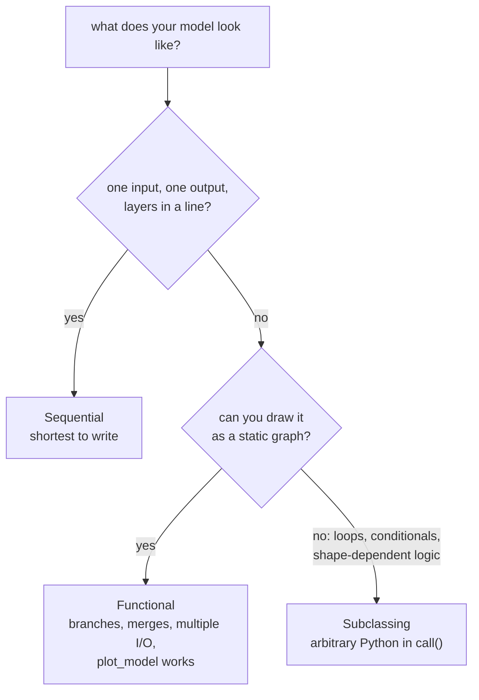

import DataCampExercise from "../../../../components/DataCampExercise.astro";
import Figure from "../../../../components/Figure.astro";
import Quiz from "../../../../components/Quiz.astro";

Keras offers three ways to define a model. Choosing between them is not a
performance decision — the same architecture through all three produces
**bit-identical predictions** and trains in the same time to within 2%. It is a
decision about what the framework can see, and therefore what it can do for you.

## What you'll learn

- Sequential, Functional and Subclassing side by side: **5,121 parameters each**,
  predictions matching to **0.00e+00**, training times within **0.12s** of each
  other.
- What subclassing gives up: `count_params()` **raises** on a fresh model, then
  reports **0** even after `build()` — only a forward pass sizes the kernels.
- A Functional-only architecture (wide & deep) measured: **13 extra parameters**
  for **0.0431** better test MAE.
- `compile` / `fit` / `evaluate` / `predict` — the four verbs, identical across
  all three APIs.
- Four stopping policies on the same model: **2.8941 down to 2.7653** test MAE,
  and why `restore_best_weights=True` is the line that matters.
- Saving: a `.keras` file reproduces predictions to **0.00e+00** and carries the
  optimizer state with it.

## The same model, three spellings

A two-hidden-layer regressor for the [house-price
data](/deep-learning/phase-01---neural-network-foundations/first-example-predicting-house-prices-regression/),
written three ways.

```python title="Sequential: a list of layers"
from tensorflow import keras

def sequential_model():
    return keras.Sequential([
        keras.layers.Input((13,)),
        keras.layers.Dense(64, activation="relu", name="h1"),
        keras.layers.Dense(64, activation="relu", name="h2"),
        keras.layers.Dense(1, name="out"),
    ])
```

```python title="Functional: call layers on tensors"
def functional_model():
    inputs = keras.Input((13,))
    h = keras.layers.Dense(64, activation="relu", name="h1")(inputs)
    h = keras.layers.Dense(64, activation="relu", name="h2")(h)
    outputs = keras.layers.Dense(1, name="out")(h)
    return keras.Model(inputs, outputs)
```

```python title="Subclassing: write the forward pass yourself"
class Subclassed(keras.Model):
    def __init__(self):
        super().__init__()
        self.h1 = keras.layers.Dense(64, activation="relu")
        self.h2 = keras.layers.Dense(64, activation="relu")
        self.out = keras.layers.Dense(1)

    def call(self, inputs):
        return self.out(self.h2(self.h1(inputs)))
```

With the same seed, all three are the same model:

| | Parameters | Weight tensors | Max prediction difference vs Sequential |
| --- | --- | --- | --- |
| Sequential | 5,121 | 6 | — |
| Functional | 5,121 | 6 | **0.00e+00** |
| Subclassing | 5,121 | 6 | **0.00e+00** |

The parameter count checks out by hand: $13 \times 64 + 64 = 896$, then
$64 \times 64 + 64 = 4{,}160$, then $64 \times 1 + 1 = 65$, totalling
**5,121**. Six weight tensors is three kernels and three bias vectors.

Training time, 40 epochs at batch 16 on 404 rows:

| API | Seconds | Test MAE |
| --- | --- | --- |
| Sequential | 5.55 | 2.8923 |
| Functional | 5.43 | 2.8923 |
| Subclassing | 5.52 | 2.8923 |

Identical accuracy, a 2% spread in time that is measurement noise. **The API
choice costs nothing and buys nothing at runtime.** What differs is what happens
before you call `fit`.

## What each API actually gives you



Sequential and Functional build a **static graph** that Keras can inspect. That
is why `model.summary()` prints shapes, `keras.utils.plot_model` draws a diagram,
and layer reuse is checkable. The Functional model exposes its graph directly:

```python
print([layer.name for layer in functional_model().layers])
# ['input_layer_1', 'h1', 'h2', 'out']
print(sequential_model().input_shape)   # (None, 13)
```

Subclassing gives up that visibility, because `call()` is arbitrary Python and
Keras cannot know what it does without running it. Measured on Keras 3.15:

```python
model = Subclassed()
model.count_params()
# ValueError: You tried to call `count_params` on layer '<name>',
# but the layer isn't built.

model.build((None, 13))
print(model.count_params())     # 0
model.summary()                 # every layer shows "?" and "0 (unbuilt)"

model(np.zeros((1, 13), dtype="float32"))
print(model.count_params())     # 5,121
```

Three distinct states, and the middle one is the surprise. A fresh subclassed
model **raises** rather than reporting zero. `Model.build` then marks the model
itself built without propagating the shape into the sublayers, so
`count_params()` answers **0** — technically accurate and thoroughly misleading.
Only an actual forward pass sizes the kernels and gives 5,121.

The reason is that `Dense(64)` cannot allocate a $13 \times 64$ kernel until it
knows the input has 13 columns, and the only thing that reveals that in a
subclassed model is data flowing through `call()`. Sequential and Functional learn
it from `Input((13,))` at construction time, which is why they report 5,121
immediately.

The trade is real but narrow: use Sequential by default, Functional when the graph
branches, and Subclassing only when the forward pass genuinely needs control flow
that a graph cannot express.

## What Functional buys: wide & deep

Some architectures cannot be written as a list. A *wide & deep* model sends the
raw input both through the hidden layers and straight to the output:

```python title="A branch and a merge — impossible in Sequential"
def wide_and_deep():
    inputs = keras.Input((13,))
    deep = keras.layers.Dense(64, activation="relu")(inputs)
    deep = keras.layers.Dense(64, activation="relu")(deep)
    joined = keras.layers.Concatenate()([inputs, deep])
    outputs = keras.layers.Dense(1)(joined)
    return keras.Model(inputs, outputs)
```

Measured against the plain stack, both trained 80 epochs at batch 16 on all 404
rows:

| Model | Parameters | Test MSE | Test MAE |
| --- | --- | --- | --- |
| plain 64-64 | 5,121 | 17.8460 | 2.6112 |
| wide & deep | 5,134 | **16.7008** | **2.5681** |

**13 extra parameters** — one weight per raw feature reaching the output layer —
for **0.0431 better MAE and 1.15 better MSE**. That is a small, real gain from an
architecture Sequential cannot express: the output layer sees both the learned
representation and the untransformed features, so simple linear relationships do
not have to survive two ReLU layers to reach it.

Treat the size of that gain honestly. It is roughly 1.7% of the MAE, on 102 test
houses, from one run. The reason to know the pattern is that the same skip idea
scales into residual networks in Phase 3, where it is the difference between
trainable and untrainable.

```p5 title="Build a Functional graph, watch the parameter count" desc="Toggle the wide path and change the deep widths. The parameter count is computed exactly as Keras would: inputs times units plus units, per layer." height="330"
let widths = [64, 64];
let wide = true;
function setup() {
  createCanvas(600, 330);
  textFont("monospace");
}
function params() {
  let total = 0, prev = 13;
  for (const w of widths) { total += prev * w + w; prev = w; }
  const lastIn = wide ? prev + 13 : prev;
  total += lastIn * 1 + 1;
  return { total: total, lastIn: lastIn };
}
function box(x, y, w, h, label, sub, col) {
  fill(col[0], col[1], col[2]);
  rect(x, y, w, h, 4);
  fill(245);
  textSize(11);
  textAlign(CENTER, CENTER);
  text(label, x + w / 2, y + h / 2 - 7);
  textSize(9);
  fill(225);
  text(sub, x + w / 2, y + h / 2 + 8);
}
function draw() {
  background(13, 17, 23);
  noStroke();
  const p = params();
  box(30, 130, 84, 46, "Input", "13 features", [70, 80, 96]);
  box(160, 130, 96, 46, "Dense", widths[0] + " relu", [46, 96, 140]);
  box(300, 130, 96, 46, "Dense", widths[1] + " relu", [46, 96, 140]);
  box(452, 130, 110, 46, "Dense 1", p.lastIn + " inputs", [40, 110, 70]);
  stroke(120, 140, 160);
  strokeWeight(1.6);
  line(114, 153, 160, 153);
  line(256, 153, 300, 153);
  line(396, 153, 452, 153);
  if (wide) {
    stroke(255, 211, 67);
    strokeWeight(2);
    noFill();
    beginShape();
    vertex(72, 130);
    vertex(72, 76);
    vertex(507, 76);
    vertex(507, 130);
    endShape();
    noStroke();
    fill(255, 211, 67);
    textSize(11);
    textAlign(CENTER, BOTTOM);
    text("wide path: raw features concatenated before the output", 290, 70);
  }
  noStroke();
  fill(230);
  textSize(12);
  textAlign(LEFT, TOP);
  text("total parameters: " + p.total.toLocaleString(), 30, 214);
  fill(150);
  textSize(11);
  text("13*" + widths[0] + "+" + widths[0] + "  +  " + widths[0] + "*"
    + widths[1] + "+" + widths[1] + "  +  " + p.lastIn + "*1+1", 30, 234);
  const buttons = [
    { x: 30, label: "deep -" }, { x: 118, label: "deep +" },
    { x: 226, label: wide ? "wide: ON" : "wide: OFF" },
  ];
  for (const b of buttons) {
    fill(90, 100, 114);
    rect(b.x, 268, 84, 26, 4);
    fill(240);
    textSize(11);
    textAlign(CENTER, CENTER);
    text(b.label, b.x + 42, 281);
  }
  fill(150);
  textSize(10);
  textAlign(LEFT, TOP);
  text("wide=ON is the wide & deep model: 5,134 parameters at 64/64",
    30, 306);
}
function mousePressed() {
  if (mouseY < 268 || mouseY > 294) return;
  if (mouseX > 30 && mouseX < 114) {
    widths = widths.map((w) => Math.max(4, w - 16));
  } else if (mouseX > 118 && mouseX < 202) {
    widths = widths.map((w) => Math.min(256, w + 16));
  } else if (mouseX > 226 && mouseX < 310) {
    wide = !wide;
  }
}
```

## The three APIs produce the same model

"Sequential, Functional and subclassing are three ways to say the same thing" is easy to
assert and easy to check: build one architecture three ways, copy identical weights into
all three, and compare their outputs on the same 256 inputs.

<Figure
  src="/images/dl/phase-01-foundations/building-networks-with-keras/api-equivalence"
  alt="Left: two horizontal bars on a log axis showing the largest output difference between Functional and Sequential, and between a subclassed Model and Sequential — both pinned at the floor of the axis, both 0.00e+00. Right: parameter counts, 1,217 for each of the three APIs and 908 for a two-input two-output model shown in amber."
  title="Same architecture, same weights, 256 inputs"
  caption="Both differences are exactly 0.00e+00 — not 'small', zero — and all three report 1,217 parameters. The choice of API is a choice of notation. The amber bar is the exception that matters: a model with 2 inputs and 2 outputs, which Sequential cannot express at all because a Sequential model is by definition one chain from one input to one output."
/>

| Comparison | Largest output difference | Parameters |
| --- | --- | --- |
| Functional vs Sequential | **0.00e+00** | 1,217 vs 1,217 |
| Subclassed vs Sequential | **0.00e+00** | 1,217 vs 1,217 |
| Two-input, two-output model | — | 908 |

Pick the API by what you need to express, not by what you expect it to compute. Sequential
until you need a branch; Functional when you do; subclassing when the forward pass has
control flow that a graph of layers cannot describe.

## Four verbs, identical everywhere

Whichever API built the model, the training interface is the same:

```python title="compile, fit, evaluate, predict"
model.compile(optimizer="rmsprop", loss="mse", metrics=["mae"])
history = model.fit(x_train, y_train, epochs=80, batch_size=16,
                    validation_data=(x_val, y_val), verbose=0)
mse, mae = model.evaluate(x_test, y_test, verbose=0)
predictions = model.predict(x_test, verbose=0)
```

- `compile` attaches the optimizer, loss and metrics. It creates no weights and
  runs no data through the model.
- `fit` trains and returns a `History` whose `.history` is a plain dict of lists,
  one entry per metric per epoch.
- `evaluate` returns the loss followed by every metric, in `compile` order.
- `predict` returns raw model output — probabilities for a sigmoid or softmax
  head, unbounded numbers for a linear one.

## Callbacks: where the real decisions live

Fixed-epoch training forces you to guess. `EarlyStopping` watches a metric and
stops when it stops improving. It has two parameters that matter, and one of them
is routinely left at the wrong default.

<Figure
  src="/images/dl/phase-01-foundations/building-networks-with-keras/early-stopping"
  alt="Two panels. Left: 300 epochs of validation loss on a logarithmic axis, falling steeply for the first 50 epochs then flattening, with epochs 100 to 300 shaded. Right: the same curve restricted to epochs 100 to 300, revealing a noisy shallow decline to a minimum of 9.6798 at epoch 207 and a slow rise afterwards, with vertical lines at the epochs where patience 20 and patience 50 would stop."
  title="300 epochs of validation loss, and where patience fires"
  caption="Everything after epoch 100 happens in a band 0.8 MSE wide, which is why the left panel needs a log axis and the right panel needs a crop. The minimum, 9.6798, arrives at epoch 207; by epoch 300 the loss is 9.8984. Patience 20 stops at epoch 227 and patience 50 at 257 — both after the minimum, which is the point of patience."
/>

```python title="Stop when it stops improving — and go back"
stop = keras.callbacks.EarlyStopping(monitor="val_loss", patience=20,
                                     restore_best_weights=True)
model.fit(x_train, y_train, epochs=300, batch_size=16,
          validation_data=(x_val, y_val), callbacks=[stop], verbose=0)
```

Four policies, the same model, the same seed, the same 320/84 split:

<Figure
  src="/images/dl/phase-01-foundations/building-networks-with-keras/training-policies"
  alt="Bar chart of test mean absolute error for four training policies: 300 fixed epochs at 2.8941, patience 20 without weight restoration at 2.8047, patience 20 with restoration at 2.7653, and patience 50 with restoration also at 2.7653. The two restoring policies are highlighted."
  title="Same model, same data — four stopping policies"
  caption="Both restoring policies land on exactly 2.7653 because both roll back to the same epoch-207 weights; patience 50 simply spent 30 more epochs discovering nothing better. Stopping early without restoring gives back most of the benefit: 2.8047 against 2.7653."
/>

| Policy | Stopped after | Test MAE |
| --- | --- | --- |
| 300 fixed epochs | 300 | 2.8941 |
| patience 20, `restore_best_weights=False` | 227 | 2.8047 |
| patience 20, `restore_best_weights=True` | 227 | **2.7653** |
| patience 50, `restore_best_weights=True` | 257 | **2.7653** |

Three readings:

1. **`restore_best_weights` is the setting that matters, and it defaults to
   `False`.** Without it, `fit` leaves you the weights from the *last* epoch —
   which is `patience` epochs past the best one, by construction. Here that costs
   0.0394 MAE, and the whole point of the callback was to avoid exactly that.
2. **Patience buys nothing extra once it is long enough.** 20 and 50 both restore
   epoch 207 and score identically; patience 50 just burned 30 epochs.
3. **Early stopping beat 300 fixed epochs by 0.1288 MAE.** Modest, and the curve
   explains why: the plateau is nearly flat, so overtraining costs little here.
   On the [IMDB
   model](/deep-learning/phase-01---neural-network-foundations/first-example-classifying-movie-reviews-imdb-binary/),
   where validation loss doubled after its minimum, the same callback is worth far
   more.

The honest caveat: that plateau is noisy. Between epochs 190 and 230 the
validation loss wobbles by about 0.05 MSE, and "epoch 207" is partly which noise
sample happened to be lowest. On a small validation set, the *best epoch* is an
estimate, not a fact.

```p5 title="Choose the patience, see where it fires" desc="The real 300-epoch validation loss curve from the run above. Drag the slider to set patience; the sketch runs Keras's own stopping rule over the measured values." height="330"
const VAL = [483.877,323.671,179.662,105.185,77.598,62.758,53.31,46.796,41.79,37.687,34.206,31.182,28.616,26.355,24.423,22.72,21.269,19.971,18.891,17.912,17.156,16.456,15.865,15.421,14.943,14.546,14.209,13.899,13.615,13.327,13.117,12.895,12.712,12.537,12.415,12.234,12.112,12.013,11.92,11.81,11.731,11.656,11.559,11.5,11.456,11.365,11.31,11.258,11.185,11.163,11.118,11.043,11.02,10.958,10.931,10.888,10.844,10.812,10.793,10.752,10.75,10.697,10.683,10.656,10.65,10.601,10.609,10.583,10.561,10.526,10.538,10.525,10.487,10.5,10.493,10.472,10.447,10.438,10.438,10.411,10.421,10.424,10.405,10.397,10.4,10.367,10.405,10.378,10.386,10.37,10.37,10.359,10.338,10.353,10.343,10.348,10.336,10.342,10.31,10.329,10.316,10.324,10.344,10.332,10.321,10.274,10.297,10.296,10.334,10.275,10.291,10.267,10.259,10.221,10.252,10.207,10.233,10.184,10.188,10.174,10.172,10.133,10.168,10.123,10.161,10.171,10.126,10.126,10.111,10.124,10.108,10.099,10.112,10.114,10.087,10.089,10.076,10.054,10.08,10.09,10.052,10.086,10.057,10.063,10.039,10.029,10.053,10.008,10.048,10.034,10.027,9.987,10.062,10,10.002,10.027,10.036,9.933,9.979,10.006,9.988,9.969,9.961,9.939,9.972,9.943,9.925,9.95,9.919,9.895,9.925,9.892,9.919,9.908,9.919,9.854,9.867,9.872,9.853,9.846,9.825,9.82,9.852,9.798,9.813,9.838,9.802,9.794,9.82,9.8,9.815,9.783,9.765,9.787,9.766,9.753,9.753,9.738,9.737,9.735,9.749,9.714,9.771,9.737,9.728,9.734,9.68,9.712,9.713,9.741,9.717,9.695,9.742,9.705,9.721,9.702,9.698,9.692,9.733,9.753,9.742,9.752,9.723,9.757,9.733,9.743,9.775,9.769,9.772,9.781,9.758,9.758,9.789,9.774,9.761,9.758,9.75,9.806,9.774,9.729,9.807,9.747,9.789,9.77,9.747,9.774,9.748,9.735,9.726,9.766,9.742,9.716,9.691,9.761,9.694,9.752,9.736,9.738,9.773,9.695,9.747,9.733,9.758,9.745,9.73,9.744,9.747,9.792,9.738,9.698,9.785,9.745,9.735,9.754,9.731,9.764,9.749,9.708,9.776,9.724,9.83,9.782,9.791,9.774,9.761,9.798,9.756,9.872,9.804,9.784,9.799,9.91,9.815,9.821,9.837,9.832,9.851,9.82,9.888,9.898];
let patience = 20;
function setup() {
  createCanvas(600, 330);
  textFont("monospace");
}
function fire(pat) {
  let best = Infinity, bestEpoch = 0, wait = 0;
  for (let i = 0; i < VAL.length; i++) {
    if (VAL[i] < best) { best = VAL[i]; bestEpoch = i + 1; wait = 0; }
    else if (++wait >= pat) return { stop: i + 1, bestEpoch: bestEpoch, best: best };
  }
  return { stop: VAL.length, bestEpoch: bestEpoch, best: best };
}
function draw() {
  background(13, 17, 23);
  const gx = 56, gy = 46, gw = width - 96, gh = 176;
  const lo = 9.6, hi = 11.2;
  const px = (e) => gx + (e - 60) / (VAL.length - 60) * gw;
  const py = (v) => gy + gh - (constrain(v, lo, hi) - lo) / (hi - lo) * gh;
  stroke(60, 70, 84);
  strokeWeight(1);
  line(gx, gy + gh, gx + gw, gy + gh);
  line(gx, gy, gx, gy + gh);
  noFill();
  stroke(75, 139, 190);
  strokeWeight(1.2);
  beginShape();
  for (let e = 60; e <= VAL.length; e++) vertex(px(e), py(VAL[e - 1]));
  endShape();
  const r = fire(patience);
  stroke(120, 200, 120);
  strokeWeight(1.6);
  line(px(r.bestEpoch), gy, px(r.bestEpoch), gy + gh);
  stroke(255, 211, 67);
  line(px(r.stop), gy, px(r.stop), gy + gh);
  noStroke();
  fill(230);
  textSize(12);
  textAlign(LEFT, TOP);
  text("validation loss, epochs 60-300 (below 9.6 and above 11.2 clipped)",
    56, 24);
  fill(120, 200, 120);
  textSize(11);
  text("restored epoch " + r.bestEpoch + "  (loss " + r.best.toFixed(4) + ")",
    56, 240);
  fill(255, 211, 67);
  text("fit stops at epoch " + r.stop + "  -- " + (300 - r.stop)
    + " epochs saved", 56, 258);
  fill(150);
  text("patience = " + patience + "   (drag the bar)", 56, 276);
  fill(90, 100, 114);
  rect(56, 300, 300, 12, 6);
  fill(75, 139, 190);
  ellipse(56 + (patience - 1) / 59 * 300, 306, 18, 18);
  fill(150);
  textSize(10);
  textAlign(LEFT, CENTER);
  text("patience 5 fires at epoch 91 -- the plateau is noisy enough to fool it",
    370, 306);
}
function mouseDragged() {
  if (mouseY > 288 && mouseY < 322 && mouseX > 46 && mouseX < 366) {
    patience = Math.round(constrain(1 + (mouseX - 56) / 300 * 59, 1, 60));
  }
}
```

Drag the patience down to 5 and it fires at **epoch 91**, restoring epoch 86 —
120 epochs before the real minimum. Patience is a bet on how long a plateau can
last before it counts as the end, and a short bet loses on a noisy curve.

Two other callbacks worth knowing:

```python title="Checkpointing and rate reduction"
callbacks = [
    keras.callbacks.ModelCheckpoint("best.keras", monitor="val_loss",
                                    save_best_only=True),
    keras.callbacks.ReduceLROnPlateau(monitor="val_loss", factor=0.5,
                                      patience=10),
]
```

`ModelCheckpoint(save_best_only=True)` writes the best model to disk, which
survives a crashed process in a way `restore_best_weights` does not.
`ReduceLROnPlateau` cuts the learning rate instead of stopping — an alternative
to the fixed rate whose stability limit was derived on the [gradient descent
page](/deep-learning/phase-01---neural-network-foundations/how-neural-networks-learn-gradient-based-optimization/).

## Saving and loading

```python title="One file, everything in it"
model.save("house.keras")
restored = keras.models.load_model("house.keras")
```

Measured on the 5,121-parameter model after 40 epochs:

| | Value |
| --- | --- |
| `.keras` file size | 64,456 bytes |
| max \|prediction before − after\| over 102 test rows | **0.00e+00** |
| optimizer restored | `RMSprop`, learning rate 0.0010 |
| `.weights.h5` (weights only) | 61,672 bytes — **0.96×** the full model |

Two things worth noticing. The round trip is **exact**, not approximate — the
same input produces the same output bit for bit, so a saved model is a
reproducible artefact. And the raw weights are only $5{,}121 \times 4 =
20{,}484$ bytes, so **two thirds of both files is not weights**: the optimizer's
per-parameter state and the container metadata dominate at this size. Weights-only
saving is not a space optimisation here; its purpose is that it deliberately
*excludes* the architecture, so the code that loads it must define the model —
useful when the architecture lives in version control and the weights do not.

## Pitfalls

- **Leaving `restore_best_weights=False`.** The default hands back weights from
  `patience` epochs *after* the best one. Cost here: 0.0394 MAE.
- **Expecting `Sequential` to branch.** A skip connection, two inputs, or two
  outputs needs the Functional API. There is no `Sequential` spelling.
- **Calling `count_params()` on a fresh subclassed model.** It raises
  `ValueError`, and after `model.build(shape)` it reports 0 with `?` shapes.
  Only a forward pass sizes the kernels.
- **Believing the API choice affects speed.** Measured spread across three APIs:
  0.12s out of 5.5s, with identical accuracy.
- **Setting patience too low on a noisy curve.** Patience 5 stopped 120 epochs
  before the real minimum here.
- **Treating the best epoch as exact.** The plateau wobbles by ~0.05 MSE, so
  "epoch 207" is partly a noise artefact.
- **Assuming `compile` builds the model.** It attaches the optimizer and loss and
  nothing else; weights still appear on first use.
- **Using `save_weights` and losing the architecture.** Weights-only files cannot
  be loaded without code that reconstructs the exact layer graph.

## Recap

- Sequential, Functional and Subclassing produced 5,121 parameters, identical
  predictions to 0.00e+00, and training times within 2% of each other.
- Sequential and Functional build an inspectable static graph; subclassing trades
  that for arbitrary Python in `call()`, and cannot count its own parameters
  until data has flowed through it.
- Functional is required for branches and merges. Wide & deep cost 13 parameters
  and gained 0.0431 MAE.
- `compile` / `fit` / `evaluate` / `predict` behave identically regardless of how
  the model was defined.
- `EarlyStopping` needs `restore_best_weights=True` to be worth using; with it,
  patience 20 and patience 50 both landed on 2.7653 against 2.8941 for 300 fixed
  epochs.
- `model.save` round-trips exactly and carries the optimizer state; the weights
  themselves are only a third of the file at this size.

## Next

With the API settled, the rest of the phase is three complete problems built with
it — starting with [binary classification on movie
reviews](/deep-learning/phase-01---neural-network-foundations/first-example-classifying-movie-reviews-imdb-binary/).

<Quiz
  questions={[
    {
      q: "The same architecture through Sequential, Functional and Subclassing gave identical predictions to 0.00e+00 and training times within 0.12s. What does the API choice actually determine?",
      options: [
        "Nothing at all — the three are interchangeable in every respect",
        "How much of the model's structure Keras can inspect without running it, which is what enables summary shapes, plot_model, and building before the first batch",
        "The numerical precision of the forward pass",
        "Which optimizers are available",
      ],
      answer: 1,
      explain: "A static graph is inspectable; an arbitrary call() method is not. That visibility is the whole trade.",
    },
    {
      q: "A freshly constructed subclassed model reports count_params() == 0. Why?",
      options: [
        "Subclassed models do not have parameters until compiled",
        "A Dense layer cannot allocate its kernel until it knows the input width, and a subclassed model only learns that from the first batch or an explicit build() call",
        "count_params() is not supported for subclassed models",
        "The layers were created in __init__ rather than in call",
      ],
      answer: 1,
      explain: "Sequential and Functional get the shape from Input((13,)) at construction time, which is why they report 5,121 immediately.",
    },
    {
      q: "Wide & deep added 13 parameters and improved test MAE from 2.6112 to 2.5681. Where do those 13 parameters come from?",
      options: [
        "A new hidden layer",
        "The concatenation gives the output layer 13 extra inputs — the raw features — so the output kernel grows from 64x1 to 77x1",
        "The Concatenate layer has its own weights",
        "Keras adds a bias per input feature",
      ],
      answer: 1,
      explain: "Concatenate has no weights. The cost is entirely in the wider output kernel, which is why the gain comes so cheaply.",
    },
    {
      q: "EarlyStopping with patience 20 stopped at epoch 227 in a run whose best validation loss was at epoch 207. With restore_best_weights=False, which weights does fit leave behind?",
      options: [
        "Epoch 207's, the best ones",
        "Epoch 227's — the last epoch trained, which is by construction 20 epochs past the best one, costing 0.0394 MAE here",
        "An average of the last 20 epochs",
        "Whichever epoch had the lowest training loss",
      ],
      answer: 1,
      explain: "The default is False, so the callback stops training but keeps the final weights. That defeats most of the purpose.",
    },
    {
      q: "Patience 20 and patience 50 both produced exactly 2.7653 test MAE. What does that tell you about tuning patience?",
      options: [
        "Patience has no effect on the result",
        "Once patience is long enough to survive the plateau, both restore the same best epoch, so extra patience only costs training time — while too little patience fires early (patience 5 stopped at epoch 91 here)",
        "Patience 50 must have been implemented incorrectly",
        "The two runs used different random seeds",
      ],
      answer: 1,
      explain: "Patience is a bet on plateau length. Long enough is enough; longer is waste; too short is a real error.",
    },
  ]}
/>

## 🧪 Try It Yourself

<DataCampExercise
  lang="python"
  hint={`In the Functional API each layer is called on a tensor and returns a tensor. keras.Model(inputs, outputs) then captures the graph between the two.`}
  code={`# Task: Exercise 1 - The same model, two APIs, identical weights
import numpy as np
from tensorflow import keras


def sequential_model():
    return keras.Sequential([
        keras.layers.Input((13,)),
        keras.layers.Dense(64, activation="relu", name="h1"),
        keras.layers.Dense(64, activation="relu", name="h2"),
        keras.layers.Dense(1, name="out"),
    ])


def functional_model():
    inputs = keras.Input((13,))
    h = keras.layers.Dense(64, activation="relu", name="h1")(inputs)
    h = keras.layers.Dense(64, activation="relu", name="h2")(h)
    outputs = keras.layers.Dense(1, name="out")(h)
    return keras.Model(___, outputs)          # replace ___ with inputs


rows = np.zeros((8, 13), dtype="float32") + 0.5
keras.utils.set_random_seed(0)
a = sequential_model()
keras.utils.set_random_seed(0)
b = functional_model()

print(f"sequential parameters {a.count_params():,}  tensors {len(a.weights)}")
print(f"functional parameters {b.count_params():,}  tensors {len(b.weights)}")
print(f"13*64+64 + 64*64+64 + 64*1+1 = {13 * 64 + 64 + 64 * 64 + 64 + 65:,}")
print(f"max |difference| on 8 rows: "
      f"{np.abs(a.predict(rows, verbose=0) - b.predict(rows, verbose=0)).max():.2e}")

# -- Expected Output -------------------------------------------
# sequential parameters 5,121  tensors 6
# functional parameters 5,121  tensors 6
# 13*64+64 + 64*64+64 + 64*1+1 = 5,121
# max |difference| on 8 rows: 0.00e+00
# --------------------------------------------------------------`}
/>

<DataCampExercise
  lang="python"
  hint={`A subclassed model's layers cannot size their kernels until data with a known width flows through call(). Passing one array of the right shape is enough.`}
  code={`# Task: Exercise 2 - Three states of a subclassed model
import numpy as np
from tensorflow import keras


class Subclassed(keras.Model):
    def __init__(self):
        super().__init__()
        self.h1 = keras.layers.Dense(64, activation="relu")
        self.h2 = keras.layers.Dense(64, activation="relu")
        self.out = keras.layers.Dense(1)

    def call(self, inputs):
        return self.out(self.h2(self.h1(inputs)))


keras.utils.set_random_seed(0)
model = Subclassed()
try:
    model.count_params()
except ValueError as error:
    print(f"fresh model -> {type(error).__name__} (the model isn't built yet)")

model.build((None, 13))
print(f"after model.build((None, 13)): {model.count_params()} parameters")
model(np.zeros((1, ___), dtype="float32"))     # replace ___ with 13
print(f"after one forward pass       : {model.count_params():,} parameters")
print("build() marks the model built without propagating the shape into its")
print("sublayers; only data flowing through call() sizes the kernels")

# -- Expected Output -------------------------------------------
# fresh model -> ValueError (the model isn't built yet)
# after model.build((None, 13)): 0 parameters
# after one forward pass       : 5,121 parameters
# build() marks the model built without propagating the shape into its
# sublayers; only data flowing through call() sizes the kernels
# --------------------------------------------------------------`}
/>

<DataCampExercise
  lang="python"
  hint={`Concatenate takes a list of tensors and joins them along the last axis. It has no weights of its own — the extra parameters appear in the wider output kernel.`}
  code={`# Task: Exercise 3 - A branch and a merge: wide & deep
from tensorflow import keras


def wide_and_deep():
    inputs = keras.Input((13,))
    deep = keras.layers.Dense(64, activation="relu")(inputs)
    deep = keras.layers.Dense(64, activation="relu")(deep)
    joined = keras.layers.Concatenate()([___, deep])   # replace ___ with inputs
    outputs = keras.layers.Dense(1)(joined)
    return keras.Model(inputs, outputs)


keras.utils.set_random_seed(0)
model = wide_and_deep()
print(f"parameters {model.count_params():,}")
# note: layer.input_shape does not exist in Keras 3 -- use layer.input.shape
print(f"output layer input width: {model.layers[-1].input.shape[-1]}")
print(f"plain 64-64 has 5,121; the extra "
      f"{model.count_params() - 5121} are the 13 raw features reaching the "
      f"output kernel")
for index, layer in enumerate(model.layers):
    print(f"  layer {index} {type(layer).__name__:14s} "
          f"{layer.count_params():>6,} parameters")

# -- Expected Output -------------------------------------------
# parameters 5,134
# output layer input width: 77
# plain 64-64 has 5,121; the extra 13 are the 13 raw features reaching the output kernel
#   layer 0 InputLayer          0 parameters
#   layer 1 Dense             896 parameters
#   layer 2 Dense           4,160 parameters
#   layer 3 Concatenate         0 parameters
#   layer 4 Dense              78 parameters
# --------------------------------------------------------------`}
/>

<DataCampExercise
  lang="python"
  hint={`EarlyStopping tracks the best value of the monitored metric and counts epochs since it improved. When that count reaches patience, training stops.`}
  code={`# Task: Exercise 4 - Simulate EarlyStopping on a real curve
import numpy as np

# The measured validation loss of the 300-epoch house-price run, thinned to
# every tenth epoch for readability. The full curve is in the page above.
val_loss = [483.877, 37.687, 22.720, 17.912, 14.943, 13.327, 12.234, 11.810,
            11.365, 11.163, 10.888, 10.752, 10.601, 10.526, 10.472, 10.411,
            10.367, 10.370, 10.348, 10.329, 10.274, 10.207, 10.174, 10.123,
            10.126, 10.099, 10.076, 10.052, 10.039, 10.048]


def early_stop(curve, patience):
    best, best_index, wait = float("inf"), 0, 0
    for index, value in enumerate(curve):
        if value < best:
            best, best_index, wait = value, index, 0
        else:
            wait += ___                        # replace ___ with 1
            if wait >= patience:
                return index + 1, best_index + 1, best
    return len(curve), best_index + 1, best


for patience in (1, 2, 3):
    stopped, best_at, best = early_stop(val_loss, patience)
    print(f"patience {patience}: stopped at point {stopped:2d}, best was "
          f"point {best_at:2d} with loss {best:.3f}")
print("with restore_best_weights=False you keep the weights from the stop")
print("point, which is always 'patience' steps worse than the best")

# -- Expected Output -------------------------------------------
# patience 1: stopped at point 18, best was point 17 with loss 10.367
# patience 2: stopped at point 30, best was point 29 with loss 10.039
# patience 3: stopped at point 30, best was point 29 with loss 10.039
# with restore_best_weights=False you keep the weights from the stop
# point, which is always 'patience' steps worse than the best
# --------------------------------------------------------------`}
/>

<DataCampExercise
  lang="python"
  hint={`model.save writes a single .keras archive containing architecture, weights and optimizer state. load_model rebuilds all three.`}
  code={`# Task: Exercise 5 - A save/load round trip must be exact
import os
import numpy as np
from tensorflow import keras

(x_train, y_train), (x_test, y_test) = keras.datasets.boston_housing.load_data()
mean, std = x_train.mean(axis=0), x_train.std(axis=0)
xs, xt = (x_train - mean) / std, (x_test - mean) / std

keras.utils.set_random_seed(0)
model = keras.Sequential([
    keras.layers.Input((13,)),
    keras.layers.Dense(64, activation="relu"),
    keras.layers.Dense(64, activation="relu"),
    keras.layers.Dense(1),
])
model.compile("rmsprop", "mse", metrics=["mae"])
model.fit(xs, y_train, epochs=40, batch_size=16, verbose=0)
before = model.predict(xt, verbose=0)

model.save("house.keras")
restored = keras.models.___("house.keras")     # replace ___ with load_model
after = restored.predict(xt, verbose=0)

print(f"file size {os.path.getsize('house.keras'):,} bytes for "
      f"{model.count_params():,} parameters")
print(f"raw float32 weights would be {model.count_params() * 4:,} bytes")
print(f"max |before - after| over {len(before)} rows: "
      f"{np.abs(before - after).max():.2e}")
print(f"optimizer came back too: {restored.optimizer.__class__.__name__}, "
      f"learning rate {float(restored.optimizer.learning_rate):.4f}")

# -- Expected Output -------------------------------------------
# file size 64,456 bytes for 5,121 parameters
# raw float32 weights would be 20,484 bytes
# max |before - after| over 102 rows: 0.00e+00
# optimizer came back too: RMSprop, learning rate 0.0010
# --------------------------------------------------------------`}
/>

<DataCampExercise
  lang="python"
  hint={`Only the callback list changes between the runs. Reset the seed and rebuild the model each time so the comparison isolates the stopping policy.`}
  code={`# Task: Exercise 6 - Four stopping policies, one model
import numpy as np
from tensorflow import keras

(x_train, y_train), (x_test, y_test) = keras.datasets.boston_housing.load_data()
mean, std = x_train.mean(axis=0), x_train.std(axis=0)
xs, xt = (x_train - mean) / std, (x_test - mean) / std
split = 320


def build():
    model = keras.Sequential([
        keras.layers.Input((13,)),
        keras.layers.Dense(64, activation="relu"),
        keras.layers.Dense(64, activation="relu"),
        keras.layers.Dense(1),
    ])
    model.compile("rmsprop", "mse", metrics=["mae"])
    return model


fit = dict(epochs=300, batch_size=16, verbose=0,
           validation_data=(xs[split:], y_train[split:]))

keras.utils.set_random_seed(0)
model = build()
history = model.fit(xs[:split], y_train[:split], **fit)
val_loss = history.history["val_loss"]
print(f"best validation loss {min(val_loss):.4f} at epoch "
      f"{int(np.argmin(val_loss)) + 1}; at epoch 300 it is {val_loss[-1]:.4f}")
print(f"{'300 fixed epochs':30s} 300 epochs  test MAE "
      f"{model.evaluate(xt, y_test, verbose=0)[1]:.4f}")

for patience, restore in ((20, False), (20, True), (50, True)):
    keras.utils.set_random_seed(0)
    model = build()
    stop = keras.callbacks.EarlyStopping(monitor="val_loss",
                                         patience=patience,
                                         restore_best_weights=___)
    # replace ___ with restore
    run = model.fit(xs[:split], y_train[:split], callbacks=[stop], **fit)
    print(f"{f'patience {patience}, restore {restore}':30s} "
          f"{len(run.history['loss']):3d} epochs  test MAE "
          f"{model.evaluate(xt, y_test, verbose=0)[1]:.4f}")

# -- Expected Output -------------------------------------------
# best validation loss 9.6798 at epoch 207; at epoch 300 it is 9.8984
# 300 fixed epochs               300 epochs  test MAE 2.8941
# patience 20, restore False     227 epochs  test MAE 2.8047
# patience 20, restore True      227 epochs  test MAE 2.7653
# patience 50, restore True      257 epochs  test MAE 2.7653
# --------------------------------------------------------------`}
/>
