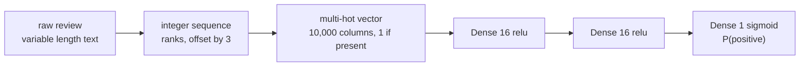

Positive review or negative review. Two classes, 25,000 labelled examples, and a
model small enough to train on a laptop in seconds — which makes this the right
place to build the habits that matter: measure a baseline before you build, watch
validation and training separately, and treat the decision threshold as a knob
rather than a constant.

## What you'll learn

- What the raw data actually is — integer sequences, median length **178**, and
  the off-by-three index shift that silently corrupts every decode.
- Why multi-hot encoding turns 25,000 reviews into a **1 GB** matrix that is
  **98.7% zeros**, and what it throws away.
- The two baselines to beat: majority class **0.5000** and logistic regression
  **0.8618** on the same features.
- Binary cross-entropy computed by hand to a difference of **0.00e+00** against
  Keras.
- The exact epoch where validation loss turns: **epoch 4 at 0.2777**, rising to
  **0.5941** by epoch 20 while training loss falls to 0.0178.
- Why dropout bought only **0.0034** of validation loss here, and L2 made the
  best epoch *worse*.
- Why the 0.5 threshold cost accuracy: **0.8792 at 0.50 against 0.8855 at 0.65**.

## The data is not text

`imdb.load_data` hands you lists of integers, not strings. Each integer is a
word's frequency rank in the corpus, and `num_words=10000` keeps only the 10,000
most common ranks.

```python title="The raw shape of the problem"
from tensorflow import keras

(raw_train, y_train), (raw_test, y_test) = keras.datasets.imdb.load_data(
    num_words=10000)

print(len(raw_train), len(raw_test))              # 25000 25000
print(y_train[:5])                                # [1 0 0 1 0]
print(max(max(review) for review in raw_train))   # 9999
print(float(y_train.mean()))                      # 0.5 -- exactly balanced
```

Measured over the 25,000 training reviews:

| | Tokens |
| --- | --- |
| shortest review | 11 |
| median | 178 |
| mean | 238.7 |
| 99th percentile | 926 |
| longest | 2,494 |

<Figure
  src="/images/dl/phase-01-foundations/imdb-movie-reviews/review-lengths"
  alt="Two panels. Left: a histogram of review lengths that peaks near 130 tokens and trails off to the right, with the median at 178 and the mean at 239 marked by vertical lines. Right: fifty reviews drawn as rows across all ten thousand vocabulary columns, showing a dense stripe of ones at the low indices and scattered isolated marks beyond."
  title="What 25,000 reviews look like before any model sees them"
  caption="The mean sits well above the median because the tail is long: half the reviews are under 178 tokens, but the longest is 2,494. On the right, each row is one review's multi-hot vector. Only 1.32% of the matrix is ones overall, and just 0.32% past index 2,000 — indices are frequency ranks, so the common-word end of the vocabulary is where almost every review lands."
/>

The class balance is exactly 0.5, which is unusual and convenient: accuracy is a
meaningful score here in a way it will not be on the [Reuters
page](/deep-learning/phase-01---neural-network-foundations/first-example-classifying-newswires-reuters-multiclass/),
where one topic holds 35% of the data.

### The index shift that ruins every decode

The word index maps words to ranks starting at 1, but indices 0, 1 and 2 are
reserved inside the *sequences* for padding, start-of-sequence and unknown-word.
So the sequence integer for a word is its rank **plus 3**:

```python title="Decoding, correctly"
index = keras.datasets.imdb.get_word_index()
reverse = {value + 3: key for key, value in index.items()}
reverse.update({0: "<pad>", 1: "<start>", 2: "<unk>", 3: "<unused>"})

print(" ".join(reverse.get(token, "?") for token in raw_train[0][:10]))
# <start> this film was just brilliant casting location scenery story
```

Drop the `+ 3` and the decode still produces fluent-looking English — every word
shifted three ranks along. Nothing crashes and the output looks plausible, which
is exactly the class of bug worth knowing about in advance.

## Multi-hot encoding

A `Dense` layer needs a fixed-width numeric vector, and reviews have variable
length. The simplest fix is to ignore order entirely: one column per vocabulary
word, 1 if the word appears anywhere in the review.



```python title="One column per vocabulary word"
import numpy as np

def multi_hot(sequences, dimension=10000):
    out = np.zeros((len(sequences), dimension), dtype="float32")
    for i, sequence in enumerate(sequences):
        out[i, sequence] = 1.0
    return out

x_train = multi_hot(raw_train)
print(x_train.shape, f"{x_train.nbytes:,} bytes")
# (25000, 10000) 1,000,000,000 bytes
print(float(x_train.mean()))   # 0.013174 -- 1.32% ones
```

That is a **1 GB** array holding **1.32% ones**, and the test set costs another
gigabyte. It works at this scale and stops working immediately past it, which is
the entire motivation for the embedding layers of Phase 4.

Multi-hot also discards two things:

- **Order.** "not good at all" and "good, not at all bad" encode identically when
  they share a word set.
- **Repetition.** `[1, 3, 3, 7]` and `[1, 3, 7]` produce the same vector — the
  row is a set membership test, not a count.

```p5 title="Build a multi-hot vector by hand" desc="Click vocabulary cells to append tokens to a review. The vector below fills in with ones. Click a token you already used and nothing changes: multi-hot records presence, not count." height="320"
let tokens = [];
const COLS = 20, DIM = 40;
function setup() {
  createCanvas(600, 320);
  textFont("monospace");
}
function cellBox(i) {
  return { x: 46 + (i % COLS) * 26, y: 54 + Math.floor(i / COLS) * 26, w: 23, h: 23 };
}
function vecBox(i) {
  return { x: 46 + (i % COLS) * 26, y: 186 + Math.floor(i / COLS) * 26, w: 23, h: 22 };
}
function draw() {
  background(13, 17, 23);
  noStroke();
  fill(230);
  textSize(12);
  textAlign(LEFT, TOP);
  text("vocabulary -- click to append a token to the review", 46, 30);
  text("multi-hot vector (1 = token present anywhere)", 46, 162);
  for (let i = 0; i < DIM; i++) {
    const b = cellBox(i);
    const inReview = tokens.includes(i);
    fill(inReview ? 75 : 30, inReview ? 139 : 36, inReview ? 190 : 44);
    rect(b.x, b.y, b.w, b.h, 3);
    fill(inReview ? 240 : 130);
    textSize(9);
    textAlign(CENTER, CENTER);
    text(i, b.x + b.w / 2, b.y + b.h / 2);
  }
  for (let i = 0; i < DIM; i++) {
    const b = vecBox(i);
    const one = tokens.includes(i);
    fill(one ? 120 : 26, one ? 200 : 32, one ? 120 : 40);
    rect(b.x, b.y, b.w, b.h, 3);
    fill(one ? 20 : 120);
    textSize(10);
    textAlign(CENTER, CENTER);
    text(one ? "1" : "0", b.x + b.w / 2, b.y + b.h / 2);
  }
  fill(230);
  textSize(12);
  textAlign(LEFT, TOP);
  const seq = tokens.length ? "[" + tokens.join(", ") + "]" : "[]";
  text("sequence: " + (seq.length > 58 ? seq.slice(0, 55) + "...]" : seq), 46, 254);
  const ones = new Set(tokens).size;
  fill(255, 211, 67);
  text("tokens appended: " + tokens.length + "    ones in the vector: " + ones, 46, 274);
  fill(150);
  textSize(11);
  text(tokens.length > ones
    ? "a repeated token changed nothing -- presence, not count"
    : "click a token you already used to see repetition vanish", 46, 296);
}
function mousePressed() {
  for (let i = 0; i < DIM; i++) {
    const b = cellBox(i);
    if (mouseX > b.x && mouseX < b.x + b.w && mouseY > b.y && mouseY < b.y + b.h) {
      tokens.push(i);
      if (tokens.length > 24) tokens.shift();
      return;
    }
  }
  if (mouseY > 240) tokens = [];
}
```

## Baselines before the network

Two numbers, both cheap, both worth having before you write a single layer:

| Baseline | Test accuracy |
| --- | --- |
| always predict the majority class | 0.5000 |
| logistic regression on the same features (5,000 rows) | 0.8531 |
| logistic regression on the same features (all 25,000) | **0.8618** |

A linear model on the same input reaches 0.8618. If the network lands at 0.86 it
has learned nothing a single matrix multiply could not. This is the bar, and
skipping it is how a project ends up celebrating a network that underperforms
`LogisticRegression`.

## The model

```python title="Three layers, one output"
model = keras.Sequential([
    keras.layers.Input((10000,)),
    keras.layers.Dense(16, activation="relu"),
    keras.layers.Dense(16, activation="relu"),
    keras.layers.Dense(1, activation="sigmoid"),
])
model.compile("rmsprop", "binary_crossentropy", metrics=["accuracy"])
```

The parameter count is worth reading:

| Layer | Parameters |
| --- | --- |
| `Dense(16)` on 10,000 inputs | $10{,}000 \times 16 + 16 = 160{,}016$ |
| `Dense(16)` on 16 inputs | $16 \times 16 + 16 = 272$ |
| `Dense(1)` on 16 inputs | $16 \times 1 + 1 = 17$ |
| total | **160,305** |

**99.8% of the parameters sit in the first layer**, purely because the input is
10,000 wide. Widening the hidden layers barely moves the total; widening the
vocabulary moves it linearly.

### Sigmoid and binary cross-entropy

One output unit with a sigmoid produces $\hat{y} \in (0, 1)$, read as
$P(\text{positive})$. The matching loss is binary cross-entropy:

$$
L = -\frac{1}{N} \sum_{i=1}^{N}
\Big[ y_i \log \hat{y}_i + (1 - y_i) \log (1 - \hat{y}_i) \Big]
$$

Only one term survives per row: if $y_i = 1$ the loss is $-\log \hat{y}_i$, and
if $y_i = 0$ it is $-\log(1 - \hat{y}_i)$. Both are the negative log of the
probability the model assigned to the *correct* answer. Worked by hand on four
predictions:

| $\hat{y}$ | $y$ | $-\log$ (probability of the truth) |
| --- | --- | --- |
| 0.90 | 1 | 0.105361 |
| 0.20 | 0 | 0.223144 |
| 0.60 | 1 | 0.510826 |
| 0.05 | 1 | **2.995732** |

Mean: **0.958766**. Keras returns **0.958766** — a difference of **0.00e+00**.

Notice the distribution of blame. Three of the four predictions contribute 0.839
between them; the single confident-and-wrong prediction contributes 2.996, which
is **78% of the total from 25% of the rows**. That asymmetry is the point of a log
loss: nearly indifferent to mild errors, brutal about confident ones. Accuracy
would have scored that row as one mistake out of four.

## Where it starts overfitting

Train on 15,000 rows, validate on the held-out 10,000:

```python title="Twenty epochs, watching both curves"
history = model.fit(x_train[:15000], y_train[:15000], epochs=20,
                    batch_size=512,
                    validation_data=(x_train[15000:], y_train[15000:]))
```

<Figure
  src="/images/dl/phase-01-foundations/imdb-movie-reviews/imdb-overfitting"
  alt="Two panels. Left: training loss falls smoothly toward zero while validation loss falls to a minimum at epoch 4 and then climbs steadily to 0.59. Right: training accuracy climbs to 1.00 while validation accuracy peaks near 0.89 early and then drifts down to 0.86."
  title="Twenty epochs, and only the first four helped"
  caption="Validation loss reaches 0.2777 at epoch 4 and is 2.14x worse by epoch 20. Training loss keeps falling to 0.0178 the whole time — the model is still improving on data it has already seen. Validation accuracy tells a much softer version of the same story, drifting from 0.8898 down to 0.8602 while the loss more than doubles."
/>

| Epoch | Training loss | Validation loss | Validation accuracy |
| --- | --- | --- | --- |
| 1 | 0.5188 | 0.3882 | 0.8706 |
| 2 | 0.3240 | 0.3129 | 0.8850 |
| 3 | 0.2441 | 0.2837 | **0.8898** |
| 4 | 0.1959 | **0.2777** | 0.8882 |
| 5 | 0.1623 | 0.2811 | 0.8879 |
| 10 | 0.0778 | 0.3490 | 0.8796 |
| 15 | 0.0354 | 0.4547 | 0.8734 |
| 20 | 0.0178 | **0.5941** | 0.8602 |

Read the two validation columns against each other. Loss doubles between epoch 4
and epoch 20; accuracy falls by 0.028. **Loss is the sensitive instrument.** It
sees the model becoming more confident about its errors — the same effect the
hand-worked table showed, where one confident mistake outweighed three
near-misses. Accuracy cannot see confidence at all: a prediction of 0.51 and one
of 0.99 count identically.

Also worth noting: the best validation *accuracy* (0.8898) arrives at epoch 3,
one epoch before the best validation *loss*. The two metrics do not agree on when
to stop, and neither is wrong — they are answering different questions.

## Retrain at the epoch that was best

Once you know the number, train from scratch on all 25,000 rows for exactly that
many epochs:

```python title="One fresh model, four epochs, one evaluation"
final = build_model()          # fresh weights, not the trained model
final.fit(x_train, y_train, epochs=4, batch_size=512)
print(final.evaluate(x_test, y_test))
# test loss 0.3081, test accuracy 0.8792
```

**0.8792 on the test set**, against logistic regression's 0.8618 on the same
features. The network is worth about 1.7 accuracy points here — not the order of
magnitude the phrase "deep learning" suggests. On a bag-of-words representation,
most of the available signal genuinely is linear.

Note also that 0.8792 is *lower* than the 0.8882 validation accuracy at epoch 4.
That is the expected direction: the epoch was chosen by looking at the validation
set, so that score is optimistic. The test set is the one number you have not
spent.

## Does regularisation help?

<Figure
  src="/images/dl/phase-01-foundations/imdb-movie-reviews/imdb-regularisation"
  alt="Validation loss against epoch for three variants. The unregularised curve dips to 0.278 at epoch 4 then rises steeply to 0.59. The L2 curve starts higher, bottoms at 0.328, and rises only to 0.44. The dropout curve bottoms lowest at 0.274 at epoch 6 and rises to 0.55."
  title="Dropout and L2 against the plain network"
  caption="Dropout 0.5 reached 0.2743 at epoch 6 — 0.0034 better than the plain model's best, and two epochs later. L2 = 0.001 was worse at its best (0.3282) but far more stable: by epoch 20 it sat at 0.4429 against the plain model's 0.5941."
/>

| Variant | Best validation loss | At epoch | Val accuracy there | Val loss at epoch 20 |
| --- | --- | --- | --- | --- |
| none | 0.2777 | 4 | 0.8882 | 0.5941 |
| L2 = 0.001 | 0.3282 | 4 | 0.8881 | **0.4429** |
| dropout 0.5 | **0.2743** | 6 | **0.8916** | 0.5495 |

The honest reading is less flattering than the usual one. **Dropout bought 0.0034
of validation loss and 0.0034 of accuracy** — real, reproducible, and tiny. **L2
made the best epoch worse**, by 0.05. What both actually did was flatten the
penalty for training too long: at epoch 20 the L2 model is 0.15 ahead of the
plain one.

So on this problem regularisation is insurance against overtraining rather than a
source of accuracy. If you already stop at the best epoch, you have collected
most of what it offers. That balance shifts as models grow relative to their data
— a theme Phase 2 develops properly.

## The threshold is a choice

`model.predict` returns probabilities. Turning those into labels requires a
cutoff, and 0.5 is a default, not an answer:

| Threshold | Accuracy | Precision | Recall |
| --- | --- | --- | --- |
| 0.20 | 0.8234 | 0.7469 | **0.9782** |
| 0.35 | 0.8601 | 0.8011 | 0.9581 |
| 0.50 | 0.8792 | 0.8436 | 0.9310 |
| 0.65 | **0.8855** | 0.8801 | 0.8926 |
| 0.80 | 0.8741 | **0.9147** | 0.8251 |

Moving the cutoff from 0.50 to 0.65 gains **0.0063 accuracy for free** — no
retraining, no new data. The model's probabilities are slightly optimistic about
the positive class, and shifting the threshold corrects for it. (Choose that
cutoff on validation data, not on the test set, or you have simply moved the
selection bias somewhere less visible.)

The wider point is that accuracy is one row of this table. When a false positive
and a false negative cost different amounts, pick the threshold that reflects the
difference and report precision and recall instead of a single number.

```p5 title="One trained model, five thresholds" desc="Drag the handle across the five measured thresholds. Accuracy, precision and recall are the trained IMDB model's real test-set numbers at each cutoff." height="300"
const DATA = [
  { t: 0.20, acc: 0.8234, prec: 0.7469, rec: 0.9782 },
  { t: 0.35, acc: 0.8601, prec: 0.8011, rec: 0.9581 },
  { t: 0.50, acc: 0.8792, prec: 0.8436, rec: 0.9310 },
  { t: 0.65, acc: 0.8855, prec: 0.8801, rec: 0.8926 },
  { t: 0.80, acc: 0.8741, prec: 0.9147, rec: 0.8251 },
];
let picked = 2;
function setup() {
  createCanvas(600, 300);
  textFont("monospace");
}
function slotX(i) { return 90 + i * ((width - 190) / (DATA.length - 1)); }
function draw() {
  background(13, 17, 23);
  const trackY = 58;
  stroke(60, 70, 84);
  strokeWeight(2);
  line(90, trackY, width - 100, trackY);
  noStroke();
  for (let i = 0; i < DATA.length; i++) {
    const on = i === picked;
    fill(on ? 255 : 90, on ? 211 : 100, on ? 67 : 114);
    ellipse(slotX(i), trackY, on ? 15 : 9, on ? 15 : 9);
    fill(on ? 255 : 130, on ? 211 : 140, on ? 67 : 150);
    textSize(11);
    textAlign(CENTER, TOP);
    text(DATA[i].t.toFixed(2), slotX(i), trackY + 14);
  }
  fill(230);
  textSize(12);
  textAlign(LEFT, TOP);
  text("drag the handle -- same trained model, different cutoff", 90, 26);
  const d = DATA[picked];
  const bars = [
    { label: "accuracy ", v: d.acc, col: [75, 139, 190] },
    { label: "precision", v: d.prec, col: [120, 200, 120] },
    { label: "recall   ", v: d.rec, col: [255, 211, 67] },
  ];
  for (let i = 0; i < bars.length; i++) {
    const y = 112 + i * 44;
    const w = Math.max((bars[i].v - 0.7) / 0.3 * (width - 290), 2);
    fill(bars[i].col[0], bars[i].col[1], bars[i].col[2]);
    rect(190, y, w, 24, 3);
    fill(200);
    textSize(12);
    textAlign(LEFT, CENTER);
    text(bars[i].label, 90, y + 12);
    fill(240);
    text(bars[i].v.toFixed(4), 198 + w, y + 12);
  }
  fill(150);
  textSize(11);
  textAlign(LEFT, TOP);
  text("bars start at 0.70, not 0.00, so the differences are visible", 90, 254);
  text("best accuracy in this sweep: 0.8855 at threshold 0.65", 90, 272);
}
function pick() {
  if (mouseY > 110) return;
  let best = 0, bestDistance = Infinity;
  for (let i = 0; i < DATA.length; i++) {
    const distance = Math.abs(mouseX - slotX(i));
    if (distance < bestDistance) { bestDistance = distance; best = i; }
  }
  picked = best;
}
function mousePressed() { pick(); }
function mouseDragged() { pick(); }
```

## Pitfalls

- **Forgetting the `+ 3` index shift when decoding.** Nothing errors; every word
  is simply wrong by three frequency ranks.
- **Reporting the best epoch's validation score as your result.** You selected
  that epoch *using* the validation set, so it is optimistic. The test number
  here is 0.8792, not 0.8882.
- **Skipping the baseline.** Logistic regression gets 0.8618 on these exact
  features. Without that number, 0.8792 sounds like a triumph.
- **Reading accuracy instead of loss for overfitting.** Between epoch 4 and 20,
  accuracy fell 0.028 while loss doubled. Accuracy is blind to confidence.
- **Multi-hot at 1 GB per 25,000 rows.** The cost is vocabulary times rows,
  regardless of how long the reviews are. Embeddings exist for this reason.
- **Assuming 0.5 is the threshold.** It cost 0.0063 accuracy here, and the right
  cutoff depends on which error is more expensive.
- **Treating a balanced dataset as normal.** IMDB is exactly 50/50 by
  construction. Reuters is not, and accuracy stops being informative there.

## Recap

- The dataset is integer sequences with a median length of 178, exactly balanced
  between classes, and the sequence-to-word mapping is offset by 3.
- Multi-hot gives a fixed-width input at the cost of order, repetition, and 1 GB
  of mostly-zero memory.
- The baselines are 0.5000 (majority) and 0.8618 (logistic regression). Both must
  be beaten before a network is worth anything.
- Sigmoid plus binary cross-entropy is the standard binary pairing; the loss is
  the negative log-probability of the truth, verified to 0.00e+00 by hand.
- Validation loss bottoms out at epoch 4 (0.2777) and more than doubles by epoch
  20 while training loss keeps falling. Retrain at that epoch and evaluate once:
  0.8792.
- Dropout gained 0.0034 and L2 lost 0.05 at their best epochs; both mainly
  reduced the cost of training too long.
- Sweeping the decision threshold gained more accuracy (0.0063) than either
  regulariser.

## Next

The same pipeline with 46 classes instead of 2 changes the output layer, the loss
function, and — most importantly — whether accuracy means anything at all:
[Classifying Newswires
(Reuters)](/deep-learning/phase-01---neural-network-foundations/first-example-classifying-newswires-reuters-multiclass/).

<Quiz
  questions={[
    {
      q: "Between epoch 4 and epoch 20, validation accuracy fell from 0.8882 to 0.8602 while validation loss rose from 0.2777 to 0.5941. Why did the loss move so much more?",
      options: [
        "Loss and accuracy are computed on different data",
        "Cross-entropy measures the probability assigned to the correct label, so growing confidence in wrong answers is punished heavily, while accuracy only counts which side of the threshold each prediction lands on",
        "Accuracy is a noisier metric than loss",
        "The learning rate changed during training",
      ],
      answer: 1,
      explain: "One confident mistake at 0.05 contributes 2.996 to the loss — more than three mild errors combined. Accuracy scores it as a single miss.",
    },
    {
      q: "Why is 0.8882 (validation accuracy at the best epoch) the wrong number to report as the model's performance?",
      options: [
        "It is measured on too few examples",
        "The epoch was chosen by looking at the validation set, so that score is optimistically biased; the untouched test set gives 0.8792",
        "Validation accuracy is always higher than test accuracy",
        "It should be averaged with the training accuracy",
      ],
      answer: 1,
      explain: "Every decision made by looking at a split contaminates it, and choosing the epoch is a decision.",
    },
    {
      q: "The multi-hot matrix for 25,000 reviews is 1 GB and 98.7% zeros. What does that tell you about scaling this approach?",
      options: [
        "Nothing — memory is cheap",
        "Memory grows with vocabulary size times row count regardless of how many words a review actually contains, so a larger vocabulary or corpus becomes impractical and dense embeddings are needed",
        "The model will overfit because of the zeros",
        "Sparse matrices would make the network more accurate",
      ],
      answer: 1,
      explain: "The cost is set by vocabulary x rows, not by content. An embedding layer stores one dense vector per token instead.",
    },
    {
      q: "Logistic regression on the same multi-hot features reaches 0.8618; the network reaches 0.8792. What is the right conclusion?",
      options: [
        "The network is not worth using",
        "Most of the signal in a bag-of-words representation is linear, so the network adds a modest 1.7 points — and the baseline is what makes that judgement possible at all",
        "The baseline must have been computed incorrectly",
        "Accuracy is the wrong metric for this comparison",
      ],
      answer: 1,
      explain: "The gain is real but small. Without the baseline you would have no way to know whether 0.8792 was good.",
    },
    {
      q: "Moving the decision threshold from 0.50 to 0.65 raised accuracy from 0.8792 to 0.8855 without retraining. Why is that possible?",
      options: [
        "The model's weights changed",
        "The threshold does not affect what the model learned — it only converts probabilities to labels, and this model's probabilities were slightly biased toward the positive class",
        "0.65 is the mathematically optimal threshold for sigmoid outputs",
        "The test set was reshuffled",
      ],
      answer: 1,
      explain: "The threshold is a post-hoc decision rule. Choose it on validation data, guided by the relative cost of each error type.",
    },
  ]}
/>

## 🧪 Try It Yourself

<DataCampExercise
  lang="python"
  hint={`Assign into a whole row with a list of column indices: out[i, sequence] = 1.0 sets every listed column of row i at once.`}
  code={`# Task: Exercise 1 - Multi-hot encode, and see what it discards
import numpy as np


def multi_hot(sequences, dimension=10):
    out = np.zeros((len(sequences), dimension), dtype="float32")
    for i, sequence in enumerate(sequences):
        out[i, ___] = 1.0          # replace ___ with sequence
    return out


sequences = [[1, 3, 3, 7], [2, 9]]
encoded = multi_hot(sequences)
print(encoded)
for sequence, row in zip(sequences, encoded):
    print(f"tokens {sequence} -> {int(row.sum())} ones, "
          f"{len(set(sequence))} distinct tokens")
print("multi-hot loses repetition: [1,3,3,7] and [1,3,7] encode identically")

# -- Expected Output -------------------------------------------
# [[0. 1. 0. 1. 0. 0. 0. 1. 0. 0.]
#  [0. 0. 1. 0. 0. 0. 0. 0. 0. 1.]]
# tokens [1, 3, 3, 7] -> 3 ones, 3 distinct tokens
# tokens [2, 9] -> 2 ones, 2 distinct tokens
# multi-hot loses repetition: [1,3,3,7] and [1,3,7] encode identically
# --------------------------------------------------------------`}
  solution={`import numpy as np


def multi_hot(sequences, dimension=10):
    out = np.zeros((len(sequences), dimension), dtype="float32")
    for i, sequence in enumerate(sequences):
        out[i, sequence] = 1.0
    return out


sequences = [[1, 3, 3, 7], [2, 9]]
encoded = multi_hot(sequences)
print(encoded)
for sequence, row in zip(sequences, encoded):
    print(f"tokens {sequence} -> {int(row.sum())} ones, "
          f"{len(set(sequence))} distinct tokens")
print("multi-hot loses repetition: [1,3,3,7] and [1,3,7] encode identically")`}
  sct={`test_output_contains("tokens [1, 3, 3, 7] -> 3 ones, 3 distinct tokens", pattern=False)
test_output_contains("tokens [2, 9] -> 2 ones, 2 distinct tokens", pattern=False)
success_msg("Repeated tokens collapse into a single 1, so multi-hot keeps which words appeared but not how often.")`}
  height={460}
/>

<DataCampExercise
  lang="python"
  hint={`Indices 0, 1 and 2 are reserved inside the sequences, so a word whose rank is r appears as r + 3.`}
  code={`# Task: Exercise 2 - Decode a review without the off-by-three bug
# A tiny stand-in for the IMDB word index: rank 1 is the most common word.
index = {"the": 1, "film": 2, "was": 3, "great": 4, "and": 5, "bad": 6}
raw_review = [1, 4, 5, 6, 7, 2]      # token ids as stored in the dataset

reverse = {value + ___: key for key, value in index.items()}   # replace ___ with 3
reverse.update({0: "<pad>", 1: "<start>", 2: "<unk>", 3: "<unused>"})

words = [reverse.get(token, "?") for token in raw_review]
print(" ".join(words))

wrong = {value: key for key, value in index.items()}
print("forgetting the shift:", " ".join(wrong.get(token, "?") for token in raw_review))
print("indices are shifted by 3 because 0-2 are reserved; forget the shift and")
print("every word you decode is wrong by three ranks")`}
  solution={`# A tiny stand-in for the IMDB word index: rank 1 is the most common word.
index = {"the": 1, "film": 2, "was": 3, "great": 4, "and": 5, "bad": 6}
raw_review = [1, 4, 5, 6, 7, 2]      # token ids as stored in the dataset

reverse = {value + 3: key for key, value in index.items()}
reverse.update({0: "<pad>", 1: "<start>", 2: "<unk>", 3: "<unused>"})

words = [reverse.get(token, "?") for token in raw_review]
print(" ".join(words))

wrong = {value: key for key, value in index.items()}
print("forgetting the shift:", " ".join(wrong.get(token, "?") for token in raw_review))
print("indices are shifted by 3 because 0-2 are reserved; forget the shift and")
print("every word you decode is wrong by three ranks")`}
  sct={`test_output_contains("<start> the film was great <unk>", pattern=False)
test_output_contains("every word you decode is wrong by three ranks", pattern=False)
success_msg("With the shift of 3 the review reads correctly; without it every word is off by three ranks.")`}
  height={295}
/>

<DataCampExercise
  lang="python"
  hint={`The majority baseline is the accuracy of always predicting the most common training label. Compare the logistic model against it.`}
  code={`# Task: Exercise 3 - Establish the two baselines first
import numpy as np

rng = np.random.RandomState(0)


def make_reviews(n, vocab=40):
    y = rng.randint(0, 2, n)
    p = np.full((n, vocab), 0.2)
    p[y == 1, :8] = 0.5          # words 0-7 lean positive
    p[y == 0, 8:16] = 0.5        # words 8-15 lean negative
    return (rng.rand(n, vocab) < p).astype(float), y


x_small, y_small = make_reviews(500)
x_test, y_test = make_reviews(2000)

# Baseline 1: always predict the most common training label.
majority = np.bincount(y_small).argmax()
print("majority class      :", round(float((y_test == majority).mean()), 1))

# Baseline 2: logistic regression on the same multi-hot features.
w = np.zeros(x_small.shape[1])
b = 0.0
for step in range(300):
    p = 1 / (1 + np.exp(-(x_small @ w + b)))
    w -= 0.5 * x_small.T @ (p - y_small) / len(y_small)
    b -= 0.5 * (p - y_small).mean()
logistic = float((((x_test @ w + b) > 0) == y_test).mean())
print("logistic beats the majority baseline by 0.2 or more:", logistic > float((y_test == ___).mean()) + 0.2)   # replace ___ with majority
print("a linear model on the same features is the bar the network must clear")`}
  solution={`import numpy as np

rng = np.random.RandomState(0)


def make_reviews(n, vocab=40):
    y = rng.randint(0, 2, n)
    p = np.full((n, vocab), 0.2)
    p[y == 1, :8] = 0.5          # words 0-7 lean positive
    p[y == 0, 8:16] = 0.5        # words 8-15 lean negative
    return (rng.rand(n, vocab) < p).astype(float), y


x_small, y_small = make_reviews(500)
x_test, y_test = make_reviews(2000)

# Baseline 1: always predict the most common training label.
majority = np.bincount(y_small).argmax()
print("majority class      :", round(float((y_test == majority).mean()), 1))

# Baseline 2: logistic regression on the same multi-hot features.
w = np.zeros(x_small.shape[1])
b = 0.0
for step in range(300):
    p = 1 / (1 + np.exp(-(x_small @ w + b)))
    w -= 0.5 * x_small.T @ (p - y_small) / len(y_small)
    b -= 0.5 * (p - y_small).mean()
logistic = float((((x_test @ w + b) > 0) == y_test).mean())
print("logistic beats the majority baseline by 0.2 or more:", logistic > float((y_test == majority).mean()) + 0.2)
print("a linear model on the same features is the bar the network must clear")`}
  sct={`test_output_contains("logistic beats the majority baseline by 0.2 or more: True", pattern=False)
test_output_contains("a linear model on the same features is the bar the network must clear", pattern=False)
success_msg("The majority class sits near 0.5 on balanced data, and even a linear model clears it easily. Any network has to beat the linear number, not the coin flip.")`}
  height={460}
/>

<DataCampExercise
  lang="python"
  hint={`np.argmin returns a 0-based position, so add 1 to get an epoch number. Then retrain from zero weights for that many epochs.`}
  code={`# Task: Exercise 4 - Find the stopping epoch, then retrain from scratch
import numpy as np

rng = np.random.RandomState(0)


def make_reviews(n, vocab=120):
    y = rng.randint(0, 2, n)
    p = np.full((n, vocab), 0.3)
    p[y == 1, :6] = 0.45
    p[y == 0, 6:12] = 0.45
    return (rng.rand(n, vocab) < p).astype(float), y


x_train, y_train = make_reviews(240)
x_test, y_test = make_reviews(2000)


def loss_of(w, b, x, y):
    p = np.clip(1 / (1 + np.exp(-(x @ w + b))), 1e-9, 1 - 1e-9)
    return float(-np.mean(y * np.log(p) + (1 - y) * np.log(1 - p)))


def train(x, y, epochs, x_val=None, y_val=None):
    w, b, curve = np.zeros(x.shape[1]), 0.0, []
    for epoch in range(epochs):
        p = 1 / (1 + np.exp(-(x @ w + b)))
        w -= 1.0 * x.T @ (p - y) / len(y)
        b -= 1.0 * (p - y).mean()
        if x_val is not None:
            curve.append(loss_of(w, b, x_val, y_val))
    return w, b, curve


w, b, val_loss = train(x_train[:60], y_train[:60], 300, x_train[60:], y_train[60:])
best = int(np.___(val_loss)) + 1   # replace ___ with argmin
print("validation loss at epoch 300 is worse than the best:", val_loss[-1] > min(val_loss))
print("the best epoch is well before the last:", best < 150)

w, b, _ = train(x_train, y_train, best)
accuracy = float((((x_test @ w + b) > 0) == y_test).mean())
print("retrained from scratch for exactly the best epoch count:", len(w) == 120 and best >= 1)`}
  solution={`import numpy as np

rng = np.random.RandomState(0)


def make_reviews(n, vocab=120):
    y = rng.randint(0, 2, n)
    p = np.full((n, vocab), 0.3)
    p[y == 1, :6] = 0.45
    p[y == 0, 6:12] = 0.45
    return (rng.rand(n, vocab) < p).astype(float), y


x_train, y_train = make_reviews(240)
x_test, y_test = make_reviews(2000)


def loss_of(w, b, x, y):
    p = np.clip(1 / (1 + np.exp(-(x @ w + b))), 1e-9, 1 - 1e-9)
    return float(-np.mean(y * np.log(p) + (1 - y) * np.log(1 - p)))


def train(x, y, epochs, x_val=None, y_val=None):
    w, b, curve = np.zeros(x.shape[1]), 0.0, []
    for epoch in range(epochs):
        p = 1 / (1 + np.exp(-(x @ w + b)))
        w -= 1.0 * x.T @ (p - y) / len(y)
        b -= 1.0 * (p - y).mean()
        if x_val is not None:
            curve.append(loss_of(w, b, x_val, y_val))
    return w, b, curve


w, b, val_loss = train(x_train[:60], y_train[:60], 300, x_train[60:], y_train[60:])
best = int(np.argmin(val_loss)) + 1
print("validation loss at epoch 300 is worse than the best:", val_loss[-1] > min(val_loss))
print("the best epoch is well before the last:", best < 150)

w, b, _ = train(x_train, y_train, best)
accuracy = float((((x_test @ w + b) > 0) == y_test).mean())
print("retrained from scratch for exactly the best epoch count:", len(w) == 120 and best >= 1)`}
  sct={`test_output_contains("validation loss at epoch 300 is worse than the best: True", pattern=False)
test_output_contains("the best epoch is well before the last: True", pattern=False)
success_msg("The validation loss bottoms out early and then climbs. The number you retrain for is the epoch of that minimum, not the last one.")`}
  height={460}
/>

<DataCampExercise
  lang="python"
  hint={`For a label of 1 the loss term is -log(p); for a label of 0 it is -log(1 - p). The formula y*log(p) + (1-y)*log(1-p) selects the right one automatically.`}
  code={`# Task: Exercise 5 - Binary cross-entropy by hand
import numpy as np

probabilities = np.array([0.9, 0.2, 0.6, 0.05])
labels = np.array([1.0, 0.0, 1.0, 1.0])

manual = -np.mean(labels * np.log(probabilities)
                  + (1 - labels) * np.log(___))   # replace ___ with 1 - probabilities
# Reference: pick the right term per example with an if.
terms = [-np.log(p) if y == 1 else -np.log(1 - p)
         for p, y in zip(probabilities, labels)]
reference = float(np.mean(terms))

print("probability  label  -log likelihood")
for probability, label, term in zip(probabilities, labels, terms):
    print(format(probability, "11.2f"), format(label, "6.0f"), format(term, "16.6f"))
print("manual mean", round(float(manual), 6))
print("formula and per-example terms agree:", abs(manual - reference) < 1e-9)
print("the confident wrong prediction (0.05 for a positive) dominates the sum")`}
  solution={`import numpy as np

probabilities = np.array([0.9, 0.2, 0.6, 0.05])
labels = np.array([1.0, 0.0, 1.0, 1.0])

manual = -np.mean(labels * np.log(probabilities)
                  + (1 - labels) * np.log(1 - probabilities))
# Reference: pick the right term per example with an if.
terms = [-np.log(p) if y == 1 else -np.log(1 - p)
         for p, y in zip(probabilities, labels)]
reference = float(np.mean(terms))

print("probability  label  -log likelihood")
for probability, label, term in zip(probabilities, labels, terms):
    print(format(probability, "11.2f"), format(label, "6.0f"), format(term, "16.6f"))
print("manual mean", round(float(manual), 6))
print("formula and per-example terms agree:", abs(manual - reference) < 1e-9)
print("the confident wrong prediction (0.05 for a positive) dominates the sum")`}
  sct={`test_output_contains("manual mean 0.958765", pattern=False)
test_output_contains("formula and per-example terms agree: True", pattern=False)
success_msg("One formula picks the correct term for both labels, and the 0.05 prediction for a positive contributes almost 3 of the total 3.83.")`}
  height={363}
/>

<DataCampExercise
  lang="python"
  hint={`A prediction counts as positive when its score is at or above the threshold. Precision is true positives over everything predicted positive; recall is true positives over everything actually positive.`}
  code={`# Task: Exercise 6 - The 0.5 threshold is a choice, not a law
import numpy as np

rng = np.random.RandomState(0)


def make_reviews(n, vocab=60):
    y = rng.randint(0, 2, n)
    p = np.full((n, vocab), 0.3)
    p[y == 1, :10] = 0.5
    p[y == 0, 10:20] = 0.5
    return (rng.rand(n, vocab) < p).astype(float), y


x_train, y_train = make_reviews(600)
x_test, y_test = make_reviews(3000)

w, b = np.zeros(60), 0.0
for epoch in range(200):
    p = 1 / (1 + np.exp(-(x_train @ w + b)))
    w -= 0.5 * x_train.T @ (p - y_train) / len(y_train)
    b -= 0.5 * (p - y_train).mean()
scores = 1 / (1 + np.exp(-(x_test @ w + b)))

results = []
for threshold in (0.2, 0.35, 0.5, 0.65, 0.8):
    predicted = (scores >= ___).astype(int)   # replace ___ with threshold
    true_positive = float(((predicted == 1) & (y_test == 1)).sum())
    precision = true_positive / max(predicted.sum(), 1)
    recall = true_positive / (y_test == 1).sum()
    results.append((threshold, precision, recall))

print("threshold  precision  recall")
for threshold, precision, recall in results:
    print(format(threshold, "9.2f"), format(precision, "10.2f"), format(recall, "7.2f"))
recalls = [r for _, _, r in results]
print("recall never rises as the threshold rises:", all(a >= b for a, b in zip(recalls, recalls[1:])))
print("precision at 0.8 is above precision at 0.2:", results[-1][1] > results[0][1])`}
  solution={`import numpy as np

rng = np.random.RandomState(0)


def make_reviews(n, vocab=60):
    y = rng.randint(0, 2, n)
    p = np.full((n, vocab), 0.3)
    p[y == 1, :10] = 0.5
    p[y == 0, 10:20] = 0.5
    return (rng.rand(n, vocab) < p).astype(float), y


x_train, y_train = make_reviews(600)
x_test, y_test = make_reviews(3000)

w, b = np.zeros(60), 0.0
for epoch in range(200):
    p = 1 / (1 + np.exp(-(x_train @ w + b)))
    w -= 0.5 * x_train.T @ (p - y_train) / len(y_train)
    b -= 0.5 * (p - y_train).mean()
scores = 1 / (1 + np.exp(-(x_test @ w + b)))

results = []
for threshold in (0.2, 0.35, 0.5, 0.65, 0.8):
    predicted = (scores >= threshold).astype(int)
    true_positive = float(((predicted == 1) & (y_test == 1)).sum())
    precision = true_positive / max(predicted.sum(), 1)
    recall = true_positive / (y_test == 1).sum()
    results.append((threshold, precision, recall))

print("threshold  precision  recall")
for threshold, precision, recall in results:
    print(format(threshold, "9.2f"), format(precision, "10.2f"), format(recall, "7.2f"))
recalls = [r for _, _, r in results]
print("recall never rises as the threshold rises:", all(a >= b for a, b in zip(recalls, recalls[1:])))
print("precision at 0.8 is above precision at 0.2:", results[-1][1] > results[0][1])`}
  sct={`test_output_contains("recall never rises as the threshold rises: True", pattern=False)
test_output_contains("precision at 0.8 is above precision at 0.2: True", pattern=False)
success_msg("Raising the threshold buys precision and costs recall. Which point on that curve is right depends on what each kind of mistake costs.")`}
  height={460}
/>
