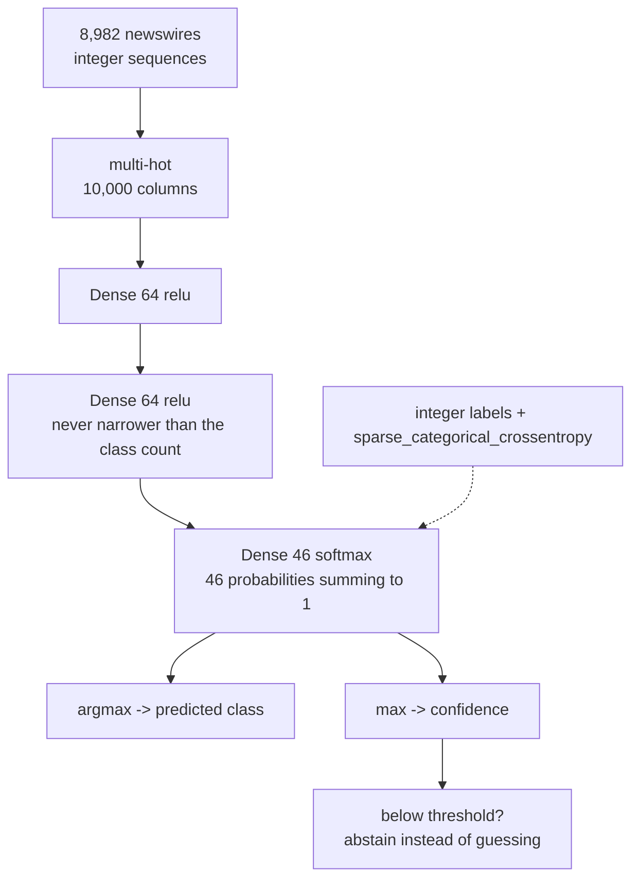

import DataCampExercise from "../../../../components/DataCampExercise.astro";
import Figure from "../../../../components/Figure.astro";
import Quiz from "../../../../components/Quiz.astro";

Going from 2 classes to 46 changes three lines of code — the output width, the
activation, the loss — and it changes everything about how you should read the
result. The IMDB dataset was exactly 50/50 balanced. Reuters has one topic holding
**35% of the data** and another holding **10 examples**, and that single fact makes
accuracy a misleading number.

## What you'll learn

- Softmax derived from scratch, verified against Keras to **3.27e−08**, plus why
  the max is subtracted before exponentiating.
- The two baselines: majority class **0.3620**, uniform guessing **0.0217**.
- Sparse integer labels versus one-hot: identical loss, **23× less memory**.
- What a 4-unit bottleneck costs, measured: **0.7703 → 0.6207** test accuracy.
- Why **0.7703 accuracy sits alongside a macro-average recall of 0.3279** — and
  that **13 of 46 classes were never predicted once**.
- How to trade coverage for reliability: abstain below 0.90 confidence and
  accuracy rises to **0.9389** on the 55% of newswires you keep.

## 46 classes, wildly unequal

```python title="Loading the newswires"
from tensorflow import keras
import numpy as np

(raw_train, y_train), (raw_test, y_test) = keras.datasets.reuters.load_data(
    num_words=10000)

print(len(raw_train), len(raw_test))     # 8982 2246
print(int(y_train.max()) + 1)            # 46
print(np.bincount(y_train).max())        # 3159
```

The label distribution is the defining feature of this dataset:

| Rank | Class id | Training examples | Share |
| --- | --- | --- | --- |
| 1 | 3 | 3,159 | **0.3517** |
| 2 | 4 | 1,949 | 0.2170 |
| 3 | 19 | 549 | 0.0611 |
| 4 | 16 | 444 | 0.0494 |
| 5 | 1 | 432 | 0.0481 |
| … | … | … | … |
| 46 | 35 | **10** | 0.0011 |

<Figure
  src="/images/dl/phase-01-foundations/reuters-newswires/reuters-imbalance"
  alt="Bar chart of the 46 topic classes ordered from largest to smallest on a logarithmic vertical axis. The first bar towers above the rest at over three thousand examples, the second is close to two thousand, and the remaining forty-four decline smoothly to a final bar of ten examples."
  title="Every class in the training set, largest to smallest"
  caption="The vertical axis is logarithmic — on a linear axis the last thirty bars would be invisible. The largest topic has 3,159 examples and the smallest has 10, a ratio of 316x, and the top three topics together account for 63.0% of all 8,982 newswires."
/>

Two baselines follow directly:

| Baseline | Test accuracy |
| --- | --- |
| always predict class 3 | **0.3620** |
| uniform random over 46 classes | 0.0217 |

Any accuracy under 0.3620 is worse than a model that ignores the input entirely.
That is the number to keep in mind for the rest of this page.

## Softmax: turning scores into a distribution

The output layer produces 46 raw scores. Softmax converts them into
probabilities that sum to 1:

$$
\text{softmax}(\mathbf{z})_i = \frac{e^{z_i}}{\sum_{j=1}^{K} e^{z_j}}
$$

Exponentiating makes everything positive; dividing by the sum makes it total 1.
Because $e^x$ grows so fast, softmax exaggerates differences — a score gap of 1
becomes a probability ratio of $e \approx 2.72$.

Worked on three scores by hand:

| $z$ | $e^z$ | probability |
| --- | --- | --- |
| 2.0 | 7.389056 | **0.659001** |
| 1.0 | 2.718282 | 0.242433 |
| 0.1 | 1.105171 | 0.098566 |

Sum of probabilities: 1.000000. `tf.nn.softmax` returns the same three values to
a maximum difference of **3.27e−08** (float32 rounding, not disagreement).

### Why the max gets subtracted

Softmax is unchanged if you shift every score by the same constant $c$:

$$
\frac{e^{z_i - c}}{\sum_j e^{z_j - c}}
= \frac{e^{-c} e^{z_i}}{e^{-c} \sum_j e^{z_j}}
= \frac{e^{z_i}}{\sum_j e^{z_j}}
$$

That invariance is what makes the standard implementation safe. Computed naïvely
on $\mathbf{z} = [1000, 1001, 1002]$, $e^{1000}$ overflows float64 and every
probability comes back `nan`. Subtracting the max first gives
$[0.090031, 0.244728, 0.665241]$ — the mathematically identical answer, with the
largest exponent now $e^0 = 1$.

```p5 title="Drag the scores, watch the distribution" desc="Three raw output scores and their softmax. Drag any bar to change its score. The button adds 5 to all three at once — the probabilities do not move, because softmax is shift-invariant." height="330"
let z = [2.0, 1.0, 0.1];
let dragging = -1;
function setup() {
  createCanvas(600, 330);
  textFont("monospace");
}
function barY(i) { return 66 + i * 46; }
function draw() {
  background(13, 17, 23);
  noStroke();
  const exps = z.map((v) => Math.exp(v - Math.max(...z)));
  const total = exps.reduce((a, b) => a + b, 0);
  const probs = exps.map((v) => v / total);
  fill(230);
  textSize(12);
  textAlign(LEFT, TOP);
  text("raw scores (drag a bar left or right)", 40, 30);
  for (let i = 0; i < 3; i++) {
    const y = barY(i);
    const w = (z[i] + 4) / 12 * 300;
    fill(75, 139, 190);
    rect(150, y, Math.max(w, 3), 26, 3);
    fill(200);
    textSize(12);
    textAlign(LEFT, CENTER);
    text("score " + i, 40, y + 13);
    fill(240);
    text(z[i].toFixed(2), 158 + Math.max(w, 3), y + 13);
  }
  fill(230);
  textAlign(LEFT, TOP);
  text("softmax probabilities (always sum to 1)", 40, 214);
  for (let i = 0; i < 3; i++) {
    const y = 244 + i * 26;
    const w = probs[i] * 300;
    fill(120, 200, 120);
    rect(150, y, Math.max(w, 3), 20, 3);
    fill(200);
    textSize(11);
    textAlign(LEFT, CENTER);
    text("p" + i, 40, y + 10);
    fill(240);
    text(probs[i].toFixed(6), 158 + Math.max(w, 3), y + 10);
  }
  fill(255, 211, 67);
  textSize(11);
  textAlign(LEFT, TOP);
  text("sum = " + probs.reduce((a, b) => a + b, 0).toFixed(6), 40, 190);
  fill(90, 100, 114);
  rect(430, 26, 130, 24, 4);
  fill(240);
  textSize(11);
  textAlign(CENTER, CENTER);
  text("add 5 to all", 495, 38);
}
function mousePressed() {
  if (mouseX > 430 && mouseX < 560 && mouseY > 26 && mouseY < 50) {
    z = z.map((v) => v + 5);
    return;
  }
  for (let i = 0; i < 3; i++) {
    if (mouseY > barY(i) && mouseY < barY(i) + 26) { dragging = i; setScore(); }
  }
}
function mouseDragged() { if (dragging >= 0) setScore(); }
function mouseReleased() { dragging = -1; }
function setScore() {
  if (dragging < 0) return;
  z[dragging] = constrain((mouseX - 150) / 300 * 12 - 4, -4, 8);
}
```

## Labels: integers or one-hot

Two encodings, two matching losses, identical results:

```python title="The same loss, twice"
integers = np.array([1, 0])
one_hot = np.eye(3, dtype="float32")[integers]
predictions = np.array([[0.1, 0.7, 0.2], [0.6, 0.3, 0.1]], dtype="float32")

keras.losses.sparse_categorical_crossentropy(integers, predictions)  # 0.433750
keras.losses.categorical_crossentropy(one_hot, predictions)          # 0.433750
```

The difference is **5.96e−08** — float32 rounding. The real difference is memory:
one-hot labels for 8,982 rows and 46 classes cost **1,652,688 bytes** against
**71,856** for int64 integers, a factor of 23. At 46 classes that is trivial; at
50,000 vocabulary classes in a language model it is not, which is why
`sparse_categorical_crossentropy` is the default choice.

## The model, and one deliberate mistake

```python title="64-64-46, softmax out"
model = keras.Sequential([
    keras.layers.Input((10000,)),
    keras.layers.Dense(64, activation="relu"),
    keras.layers.Dense(64, activation="relu"),
    keras.layers.Dense(46, activation="softmax"),
])
model.compile("rmsprop", "sparse_categorical_crossentropy",
              metrics=["accuracy"])
```

| Layer | Parameters |
| --- | --- |
| `Dense(64)` on 10,000 inputs | $10{,}000 \times 64 + 64 = 640{,}064$ |
| `Dense(64)` on 64 inputs | $64 \times 64 + 64 = 4{,}160$ |
| `Dense(46)` on 64 inputs | $64 \times 46 + 46 = 2{,}990$ |
| total | **647,214** |

Now shrink the second hidden layer to 4 units and change nothing else:

<Figure
  src="/images/dl/phase-01-foundations/reuters-newswires/reuters-bottleneck"
  alt="Two panels comparing a network with a 64-unit second hidden layer against one with 4 units. Left: validation loss, where the 64-unit curve bottoms out near 0.98 at epoch 10 and the 4-unit curve plateaus far above it around 1.42. Right: validation accuracy, where the 64-unit curve settles near 0.79 and the 4-unit curve near 0.64."
  title="Same input, same output, same everything but four numbers"
  caption="The 4-unit model reached 0.6269 test accuracy against the 64-unit model's 0.7738 — a loss of 0.1469 from one layer's width. It also took 17 epochs to reach its best validation loss instead of 10, and that best was 1.4224 against 0.9790."
/>

| Second hidden layer | Best val loss | At epoch | Val accuracy | Test accuracy |
| --- | --- | --- | --- | --- |
| 64 units | **0.9790** | 10 | 0.7856 | **0.7738** |
| 4 units | 1.4224 | 17 | 0.6408 | 0.6269 |

This is usually called an *information bottleneck*, and the phrase deserves care.
Four real-valued numbers could in principle encode 46 labels — four float32s carry
far more than the $\log_2 46 \approx 5.5$ bits required. The measured failure is
not an information-theoretic impossibility; it is that gradient descent on a
4-dimensional ReLU representation does not *find* such a code. The layer's output
is non-negative and piecewise linear, the 46-way separation has to be linear in
those four coordinates, and training lands in a much worse solution.

The lesson survives the correction: **every layer's width caps what the layers
after it can distinguish**, and no downstream capacity recovers what a narrow
layer discarded. The practical rule is that intermediate layers should be
comfortably wider than the number of output classes.

## The accuracy number is hiding something

The 64-unit model reaches **0.7703** test accuracy (9 epochs, trained on 7,000
rows). Against the 0.3620 majority baseline that looks like a solid result. Then
look per class:

| Class id | Test examples | Recall |
| --- | --- | --- |
| 3 | 813 | 0.9668 |
| 4 | 474 | 0.8713 |
| 1 | 105 | 0.8000 |
| 19 | 133 | 0.7594 |
| the 22 classes with ≤10 test examples (123 newswires) | 123 | **0.1301** |

And the summary statistic that makes it unambiguous:

| Metric | Value |
| --- | --- |
| accuracy (every newswire weighted equally) | 0.7703 |
| macro-average recall (every *class* weighted equally) | **0.3279** |
| classes never predicted even once | **13 of 46** |

**Accuracy 0.7703, macro recall 0.3279.** Both are correct measurements of the
same model. Accuracy is dominated by classes 3 and 4, which together are 57% of
the test set and where the model scores 0.96 and 0.87. Averaged over classes
instead of over rows, the model is barely better than a coin flip on the tail —
and for 13 topics it has effectively learned that the safest move is to never
guess them at all.

<Figure
  src="/images/dl/phase-01-foundations/reuters-newswires/reuters-confusion"
  alt="A ten by ten confusion matrix over the largest topics, row-normalised. The diagonal is dark for the top classes and lighter further down. The row for class 20 shows only 0.44 on the diagonal with 0.21 leaking to class 3 and 0.16 to class 19."
  title="Where the errors actually go"
  caption="Row-normalised, so each row sums to 1 across all 46 predictions and the visible cells are the ten largest topics. Class 20 is the weakest of the ten at 0.44, and its errors are not random: 0.21 of them go to class 3 and 0.16 to class 19, the two largest topics available. When a model is unsure it drifts toward the classes it has seen most."
/>

If your problem cares about the rare classes — fraud, rare diseases, uncommon
faults — accuracy will tell you everything is fine while the model ignores exactly
the cases you built it for. Report macro recall, per-class recall, or a confusion
matrix alongside it.

## Abstaining instead of guessing

Softmax gives a confidence with every prediction. Grouping the test set by that
confidence:

| Max softmax probability | Newswires | Accuracy in the band |
| --- | --- | --- |
| [0.0, 0.4) | 336 | 0.3661 |
| [0.4, 0.7) | 341 | 0.5718 |
| [0.7, 0.9) | 326 | 0.7515 |
| [0.9, 1.0] | 1,243 | **0.9389** |

Confidence is informative — it separates a 0.37 band from a 0.94 band — but it is
not calibrated: mean confidence is **0.8567** when the model is right and still
**0.5139** when it is wrong. Turn that into a policy by refusing to answer below a
threshold:

| Abstain below | Coverage | Newswires kept | Accuracy on kept |
| --- | --- | --- | --- |
| — | 1.0000 | 2,246 | 0.7703 |
| 0.40 | 0.8504 | 1,910 | 0.8414 |
| 0.70 | 0.6986 | 1,569 | 0.8999 |
| 0.90 | 0.5534 | 1,243 | 0.9389 |
| 0.99 | 0.2235 | 502 | **0.9622** |

Answering only the 55% it is most sure about takes the model from 0.7703 to
**0.9389** — without touching a single weight. In any workflow where a human can
handle the rest, that trade is usually the whole product.

```p5 title="Trade coverage for accuracy" desc="Drag the threshold across the five measured cutoffs. Coverage is the share of the 2,246 test newswires the model still answers; accuracy is measured on that kept subset." height="300"
const DATA = [
  { t: 0.00, cov: 1.0000, kept: 2246, acc: 0.7703 },
  { t: 0.40, cov: 0.8504, kept: 1910, acc: 0.8414 },
  { t: 0.70, cov: 0.6986, kept: 1569, acc: 0.8999 },
  { t: 0.90, cov: 0.5534, kept: 1243, acc: 0.9389 },
  { t: 0.99, cov: 0.2235, kept: 502, acc: 0.9622 },
];
let picked = 0;
function setup() {
  createCanvas(600, 300);
  textFont("monospace");
}
function slotX(i) { return 90 + i * ((width - 190) / (DATA.length - 1)); }
function draw() {
  background(13, 17, 23);
  stroke(60, 70, 84);
  strokeWeight(2);
  line(90, 58, width - 100, 58);
  noStroke();
  for (let i = 0; i < DATA.length; i++) {
    const on = i === picked;
    fill(on ? 255 : 90, on ? 211 : 100, on ? 67 : 114);
    ellipse(slotX(i), 58, on ? 15 : 9, on ? 15 : 9);
    fill(on ? 255 : 130, on ? 211 : 140, on ? 67 : 150);
    textSize(11);
    textAlign(CENTER, TOP);
    text(DATA[i].t.toFixed(2), slotX(i), 72);
  }
  fill(230);
  textSize(12);
  textAlign(LEFT, TOP);
  text("abstain below this confidence -- drag the handle", 90, 26);
  const d = DATA[picked];
  const rows = [
    { label: "coverage ", v: d.cov, col: [75, 139, 190] },
    { label: "accuracy ", v: d.acc, col: [120, 200, 120] },
  ];
  for (let i = 0; i < rows.length; i++) {
    const y = 118 + i * 50;
    const w = Math.max(rows[i].v * (width - 290), 2);
    fill(rows[i].col[0], rows[i].col[1], rows[i].col[2]);
    rect(190, y, w, 26, 3);
    fill(200);
    textSize(12);
    textAlign(LEFT, CENTER);
    text(rows[i].label, 90, y + 13);
    fill(240);
    text(rows[i].v.toFixed(4), 198 + w, y + 13);
  }
  fill(255, 211, 67);
  textSize(12);
  textAlign(LEFT, TOP);
  text("answers " + d.kept + " of 2246 newswires, sends " + (2246 - d.kept)
    + " to a human", 90, 226);
  fill(150);
  textSize(11);
  text("bars are 0 to 1; accuracy is measured only on the kept subset", 90, 254);
  text("no weights change -- only which predictions are used", 90, 272);
}
function pick() {
  if (mouseY > 108) return;
  let best = 0, bestDistance = Infinity;
  for (let i = 0; i < DATA.length; i++) {
    const distance = Math.abs(mouseX - slotX(i));
    if (distance < bestDistance) { bestDistance = distance; best = i; }
  }
  picked = best;
}
function mousePressed() { pick(); }
function mouseDragged() { pick(); }
```

## The whole pipeline



## Pitfalls

- **Reading accuracy alone on imbalanced data.** 0.7703 accuracy and 0.3279 macro
  recall describe the same model. Only one of them notices that 13 classes are
  never predicted.
- **Forgetting the majority-class baseline.** Predicting class 3 every time scores
  0.3620 here. Any result must be compared against that, not against 1/46.
- **Making an intermediate layer narrower than the output.** 4 units cost 0.1469
  test accuracy against 64.
- **Mismatching label encoding and loss.** Integer labels with
  `categorical_crossentropy` (or one-hot with the `sparse_` version) produces a
  shape error at best and a silently wrong loss at worst.
- **Computing softmax without subtracting the max.** $e^{1000}$ overflows to
  `inf` and every probability becomes `nan`.
- **Treating softmax output as calibrated probability.** Mean confidence was
  0.5139 on the predictions that were *wrong*.
- **Using `softmax` on the output layer *and* `from_logits=True` in the loss.**
  The loss then exponentiates already-normalised probabilities. Pick one.

## Recap

- Reuters has 46 topics, 8,982 training newswires, and a 316× ratio between the
  largest and smallest class.
- Softmax exponentiates and normalises; it is shift-invariant, which is exactly
  why implementations subtract the max before exponentiating.
- Sparse integer labels and one-hot labels give identical losses; integers cost
  23× less memory here and far less on large label spaces.
- Narrowing the second hidden layer from 64 to 4 units cost 0.1469 test accuracy.
  Keep intermediate widths above the number of classes.
- Accuracy 0.7703 versus macro recall 0.3279 is the central lesson: on imbalanced
  data, always report a per-class view.
- Abstaining below 0.90 confidence raises accuracy to 0.9389 on the 55.3% of
  newswires the model still answers.

## Next

The same three-step recipe once more, with a continuous target instead of a class
— which changes the loss, the last layer, and how you have to validate when there
are only 404 training rows:
[Predicting House
Prices](/deep-learning/phase-01---neural-network-foundations/first-example-predicting-house-prices-regression/).

<Quiz
  questions={[
    {
      q: "The model scores 0.7703 accuracy and 0.3279 macro-average recall. What is the difference between those two numbers measuring?",
      options: [
        "Macro recall is computed on the training set",
        "Accuracy weights every newswire equally, so the two largest topics (57% of the test set) dominate it; macro recall weights every class equally, so the 44 small topics count as much as the big two",
        "Macro recall is a stricter version of accuracy applied to the same rows",
        "They differ only because of rounding",
      ],
      answer: 1,
      explain: "The model gets 0.9668 recall on class 3 and 0.1301 on the 22 rarest classes. Row-weighted and class-weighted averages therefore tell opposite stories.",
    },
    {
      q: "Why is 1/46 = 0.0217 the wrong baseline to compare a Reuters model against?",
      options: [
        "Because random guessing is never a valid baseline",
        "Because the classes are heavily imbalanced: always predicting the largest class scores 0.3620, so that is the real bar to beat",
        "Because 46 classes is too many for a baseline to be meaningful",
        "Because accuracy is not defined for multiclass problems",
      ],
      answer: 1,
      explain: "Uniform guessing only makes sense as a baseline when the classes are uniform. Here the majority-class baseline is 17x higher.",
    },
    {
      q: "Softmax implementations subtract the maximum score before exponentiating. What does that change?",
      options: [
        "It makes the largest probability bigger",
        "Nothing mathematically — softmax is shift-invariant — but it prevents e^z from overflowing to infinity, which turns every probability into nan",
        "It normalises the scores to have zero mean",
        "It makes the gradient easier to compute",
      ],
      answer: 1,
      explain: "For z = [1000, 1001, 1002] the naive form returns nan; subtracting the max gives [0.090031, 0.244728, 0.665241].",
    },
    {
      q: "Narrowing the second hidden layer from 64 to 4 units dropped test accuracy from 0.7738 to 0.6269. What is the precise reason?",
      options: [
        "Four float32 numbers cannot represent 46 distinct labels",
        "Four numbers could encode 46 labels in principle, but gradient descent on a non-negative 4-dimensional ReLU representation does not find such a code, and no later layer can restore what that layer dropped",
        "The 4-unit model has too few parameters to train at all",
        "Softmax requires at least as many inputs as classes",
      ],
      answer: 1,
      explain: "The failure is about what training finds, not about bits. The practical rule still holds: keep intermediate layers wider than the class count.",
    },
    {
      q: "Refusing to predict when confidence is below 0.90 raised accuracy from 0.7703 to 0.9389. What was given up?",
      options: [
        "Nothing — this is free accuracy",
        "Coverage: 44.7% of newswires now get no answer at all, so the gain is only useful if something else (a human, a fallback rule) handles them",
        "The model had to be retrained on less data",
        "The rare classes are no longer predicted",
      ],
      answer: 1,
      explain: "Selective prediction trades coverage for reliability. Always report both numbers — an accuracy figure without its coverage is meaningless.",
    },
  ]}
/>

## 🧪 Try It Yourself

<DataCampExercise
  lang="python"
  hint={`np.bincount counts occurrences of each integer label. Sorting the negated counts with np.argsort gives you the class ids from largest to smallest.`}
  code={`# Task: Exercise 1 - The two baselines any 46-class score must beat
import numpy as np
from tensorflow import keras

(raw_train, y_train), (raw_test, y_test) = keras.datasets.reuters.load_data(
    num_words=10000)

counts = np.bincount(y_train, minlength=46)
ranked = np.argsort(___)                      # replace ___ with -counts
print(f"{'rank':>5} {'class':>6} {'examples':>9} {'share':>8}")
for rank, class_id in enumerate(ranked[:5], start=1):
    print(f"{rank:5d} {class_id:6d} {counts[class_id]:9d} "
          f"{counts[class_id] / len(y_train):8.4f}")
print(f"... 41 more, smallest has {counts[counts > 0].min()} examples")
print(f"always predict class {ranked[0]}  -> test accuracy "
      f"{float((y_test == ranked[0]).mean()):.4f}")
print(f"uniform random over 46 -> test accuracy {1 / 46:.4f}")
print(f"top 3 classes cover {counts[ranked[:3]].sum() / len(y_train):.4f} "
      f"of training data")

# -- Expected Output -------------------------------------------
#  rank  class  examples    share
#     1      3      3159   0.3517
#     2      4      1949   0.2170
#     3     19       549   0.0611
#     4     16       444   0.0494
#     5      1       432   0.0481
# ... 41 more, smallest has 10 examples
# always predict class 3  -> test accuracy 0.3620
# uniform random over 46 -> test accuracy 0.0217
# top 3 classes cover 0.6298 of training data
# --------------------------------------------------------------`}
/>

<DataCampExercise
  lang="python"
  hint={`np.eye(n) is the n x n identity matrix; indexing it with an array of labels gives one row of one-hot per label.`}
  code={`# Task: Exercise 2 - Integer labels and one-hot labels are the same loss
import numpy as np
import tensorflow as tf

predictions = np.array([[0.1, 0.7, 0.2], [0.6, 0.3, 0.1]], dtype="float32")
integers = np.array([1, 0])
one_hot = np.___(3, dtype="float32")[integers]      # replace ___ with eye

sparse = float(tf.keras.losses.sparse_categorical_crossentropy(
    integers, predictions).numpy().mean())
categorical = float(tf.keras.losses.categorical_crossentropy(
    one_hot, predictions).numpy().mean())

print(f"integer labels {integers} with sparse_categorical_crossentropy: "
      f"{sparse:.6f}")
print(f"one-hot labels\\n{one_hot}\\nwith categorical_crossentropy: "
      f"{categorical:.6f}")
print(f"difference {abs(sparse - categorical):.2e} - the choice is about "
      f"memory, not maths")
print(f"one-hot for 46 classes and 8,982 rows costs {8982 * 46 * 4:,} bytes; "
      f"integers cost {8982 * 8:,}")

# -- Expected Output -------------------------------------------
# integer labels [1 0] with sparse_categorical_crossentropy: 0.433750
# one-hot labels
# [[0. 1. 0.]
#  [1. 0. 0.]]
# with categorical_crossentropy: 0.433750
# difference 5.96e-08 - the choice is about memory, not maths
# one-hot for 46 classes and 8,982 rows costs 1,652,688 bytes; integers cost 71,856
# --------------------------------------------------------------`}
/>

<DataCampExercise
  lang="python"
  hint={`Softmax is shift-invariant: subtracting any constant from every score leaves the probabilities unchanged. Subtracting the maximum makes the largest exponent exp(0) = 1.`}
  code={`# Task: Exercise 3 - Softmax by hand, and why the max is subtracted
import numpy as np
import tensorflow as tf

scores = np.array([2.0, 1.0, 0.1], dtype="float64")
exponentials = np.exp(scores)
manual = exponentials / exponentials.sum()
keras_softmax = tf.nn.softmax(scores.astype("float32")).numpy()

print(f"scores  {scores}")
print(f"manual  {manual.round(6)}   sum {manual.sum():.6f}")
print(f"keras   {keras_softmax.round(6)}")
print(f"max difference {np.abs(manual - keras_softmax).max():.2e}")

big = np.array([1000.0, 1001.0, 1002.0])
naive = np.exp(big) / np.exp(big).sum()
shifted = big - big.___()                     # replace ___ with max
stable = np.exp(shifted) / np.exp(shifted).sum()
print(f"naive softmax of {big}: {naive} (overflowed to nan)")
print(f"after subtracting the max: {stable.round(6)}")
print("softmax is shift-invariant, so subtracting the max changes nothing "
      "except the overflow")

# -- Expected Output -------------------------------------------
# scores  [2.  1.  0.1]
# manual  [0.659001 0.242433 0.098566]   sum 1.000000
# keras   [0.659001 0.242433 0.098566]
# max difference 3.27e-08
# naive softmax of [1000. 1001. 1002.]: [nan nan nan] (overflowed to nan)
# after subtracting the max: [0.090031 0.244728 0.665241]
# softmax is shift-invariant, so subtracting the max changes nothing except the overflow
# --------------------------------------------------------------`}
/>

<DataCampExercise
  lang="python"
  hint={`Only the second hidden layer changes width. Everything else — input, first layer, output, loss, epochs, batch size and seed — is held fixed so the comparison isolates one variable.`}
  code={`# Task: Exercise 4 - Measure what a 4-unit layer costs
import numpy as np
from tensorflow import keras

(raw_train, y_train), (raw_test, y_test) = keras.datasets.reuters.load_data(
    num_words=10000)


def multi_hot(sequences, dimension=10000):
    out = np.zeros((len(sequences), dimension), dtype="float32")
    for i, sequence in enumerate(sequences):
        out[i, sequence] = 1.0
    return out


x_train, x_test = multi_hot(raw_train), multi_hot(raw_test)

for hidden in (64, 4):
    keras.utils.set_random_seed(0)
    model = keras.Sequential([
        keras.layers.Input((10000,)),
        keras.layers.Dense(64, activation="relu"),
        keras.layers.Dense(___, activation="relu"),   # replace ___ with hidden
        keras.layers.Dense(46, activation="softmax"),
    ])
    model.compile("rmsprop", "sparse_categorical_crossentropy",
                  metrics=["accuracy"])
    model.fit(x_train[:7000], y_train[:7000], epochs=9, batch_size=512,
              verbose=0)
    loss, accuracy = model.evaluate(x_test, y_test, verbose=0)
    print(f"second hidden layer {hidden:3d} units -> test loss {loss:.4f}  "
          f"test accuracy {accuracy:.4f}")
print("four units could encode 46 labels in principle, but training does not "
      "find such a code -- and no later layer restores what was dropped")

# -- Expected Output -------------------------------------------
# second hidden layer  64 units -> test loss 1.0217  test accuracy 0.7703
# second hidden layer   4 units -> test loss 1.5895  test accuracy 0.6207
# four units could encode 46 labels in principle, but training does not find such a code -- and no later layer restores what was dropped
# --------------------------------------------------------------`}
/>

<DataCampExercise
  lang="python"
  hint={`Recall for one class is the fraction of that class's true examples the model got right: (predicted[rows] == class_id).mean() where rows selects that class.`}
  code={`# Task: Exercise 5 - Accuracy hides the tail
import numpy as np
from tensorflow import keras

(raw_train, y_train), (raw_test, y_test) = keras.datasets.reuters.load_data(
    num_words=10000)


def multi_hot(sequences, dimension=10000):
    out = np.zeros((len(sequences), dimension), dtype="float32")
    for i, sequence in enumerate(sequences):
        out[i, sequence] = 1.0
    return out


x_train, x_test = multi_hot(raw_train), multi_hot(raw_test)

keras.utils.set_random_seed(0)
model = keras.Sequential([
    keras.layers.Input((10000,)),
    keras.layers.Dense(64, activation="relu"),
    keras.layers.Dense(64, activation="relu"),
    keras.layers.Dense(46, activation="softmax"),
])
model.compile("rmsprop", "sparse_categorical_crossentropy",
              metrics=["accuracy"])
model.fit(x_train[:7000], y_train[:7000], epochs=9, batch_size=512, verbose=0)

predictions = model.predict(x_test, verbose=0)
predicted = predictions.___(axis=1)          # replace ___ with argmax
print(f"overall test accuracy {float((predicted == y_test).mean()):.4f}")
test_counts = np.bincount(y_test, minlength=46)
print(f"{'class':>6} {'test n':>7} {'recall':>8}")
for class_id in np.argsort(-test_counts)[:4]:
    rows = y_test == class_id
    print(f"{class_id:6d} {int(rows.sum()):7d} "
          f"{float((predicted[rows] == class_id).mean()):8.4f}")
rare = [c for c in range(46) if 0 < test_counts[c] <= 10]
rare_rows = np.isin(y_test, rare)
print(f"the {len(rare)} classes with 10 or fewer test examples "
      f"({int(rare_rows.sum())} newswires): recall "
      f"{float((predicted[rare_rows] == y_test[rare_rows]).mean()):.4f}")
never = [c for c in range(46) if (predicted == c).sum() == 0]
print(f"{len(never)} of 46 classes were never predicted at all")

# -- Expected Output -------------------------------------------
# overall test accuracy 0.7703
#  class  test n   recall
#      3     813   0.9668
#      4     474   0.8713
#     19     133   0.7594
#      1     105   0.8000
# the 22 classes with 10 or fewer test examples (123 newswires): recall 0.1301
# 13 of 46 classes were never predicted at all
# --------------------------------------------------------------`}
/>

<DataCampExercise
  lang="python"
  hint={`The confidence of a softmax prediction is the largest probability in the row: predictions.max(axis=1). Keeping only rows above a threshold is selective prediction.`}
  code={`# Task: Exercise 6 - Trade coverage for accuracy
import numpy as np
from tensorflow import keras

(raw_train, y_train), (raw_test, y_test) = keras.datasets.reuters.load_data(
    num_words=10000)


def multi_hot(sequences, dimension=10000):
    out = np.zeros((len(sequences), dimension), dtype="float32")
    for i, sequence in enumerate(sequences):
        out[i, sequence] = 1.0
    return out


x_train, x_test = multi_hot(raw_train), multi_hot(raw_test)

keras.utils.set_random_seed(0)
model = keras.Sequential([
    keras.layers.Input((10000,)),
    keras.layers.Dense(64, activation="relu"),
    keras.layers.Dense(64, activation="relu"),
    keras.layers.Dense(46, activation="softmax"),
])
model.compile("rmsprop", "sparse_categorical_crossentropy",
              metrics=["accuracy"])
model.fit(x_train[:7000], y_train[:7000], epochs=9, batch_size=512, verbose=0)

predictions = model.predict(x_test, verbose=0)
predicted, confidence = predictions.argmax(axis=1), predictions.___(axis=1)
# replace ___ with max
correct = predicted == y_test
print(f"overall accuracy {correct.mean():.4f}")
print(f"{'abstain below':>14} {'coverage':>9} {'kept n':>7} "
      f"{'accuracy on kept':>17}")
for threshold in (0.0, 0.4, 0.7, 0.9, 0.99):
    keep = confidence >= threshold
    print(f"{threshold:14.2f} {keep.mean():9.4f} {int(keep.sum()):7d} "
          f"{correct[keep].mean():17.4f}")
macro = np.mean([correct[y_test == c].mean() for c in range(46)
                 if (y_test == c).sum()])
print(f"macro-average recall over the 46 classes present in test: {macro:.4f}")

# -- Expected Output -------------------------------------------
# overall accuracy 0.7703
#  abstain below  coverage  kept n  accuracy on kept
#           0.00    1.0000    2246            0.7703
#           0.40    0.8504    1910            0.8414
#           0.70    0.6986    1569            0.8999
#           0.90    0.5534    1243            0.9389
#           0.99    0.2235     502            0.9622
# macro-average recall over the 46 classes present in test: 0.3279
# --------------------------------------------------------------`}
/>
