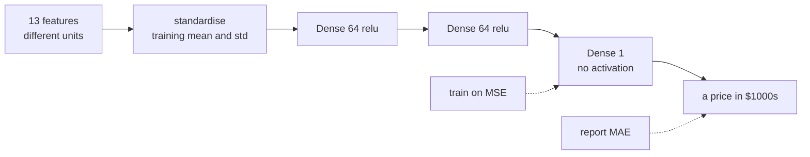

import DataCampExercise from "../../../../components/DataCampExercise.astro";
import Figure from "../../../../components/Figure.astro";
import Quiz from "../../../../components/Quiz.astro";

404 training rows. That number governs this entire page. It is small enough that a
single train/validation split is close to worthless — the four folds measured
below disagree by **0.8018 MAE**, which is a third of the score itself — and small
enough that the model's honest limitations are visible in a scatter plot rather
than buried in aggregate statistics.

## What you'll learn

- Why a regression head has **no activation**, and what happens to the loss if you
  add one.
- MSE against MAE: which to train with, which to report, and the exact
  contribution one outlier makes to each.
- Feature scaling with **training statistics only**, and the measured cost of
  skipping it: **MAE 5.1459 against 2.6112**.
- K-fold validation on 404 rows, where the four folds report **1.8332, 2.3717,
  2.6349 and 2.3216**.
- Two baselines: predicting the training median gives **MAE 6.6608**; the model
  gives **2.6112**, a 60.8% improvement.
- What the residuals show that MAE cannot: a **+28.08** worst case, and systematic
  under-prediction of expensive houses.

## The data

```python title="404 rows, 13 features, one continuous target"
from tensorflow import keras
import numpy as np

(x_train, y_train), (x_test, y_test) = keras.datasets.boston_housing.load_data()

print(x_train.shape, x_test.shape)     # (404, 13) (102, 13)
print(y_train.min(), np.median(y_train), y_train.max())   # 5.0 20.8 50.0
```

The target is a median house price in thousands of dollars, ranging from 5.0 to
50.0. The 13 features are on wildly different scales:

<Figure
  src="/images/dl/phase-01-foundations/house-prices-regression/feature-scales"
  alt="Two panels. Left: a horizontal bar chart of each feature's range width on a logarithmic axis, from 0.49 for the narrowest to 523.00 for the widest. Right: the same thirteen features after standardisation, drawn as vertical spans in standard deviations, all centred at zero but with feature 0 reaching above 9 standard deviations."
  title="Thirteen features that share no common scale"
  caption="The widest feature spans 523.00 units and the narrowest 0.49 — a ratio of 1,076x. After subtracting the mean and dividing by the standard deviation every feature is centred at 0 with unit variance, but standardisation does not remove skew: feature 0 still reaches 9.2 standard deviations above its mean, because its distribution has a long right tail."
/>

Standardise using the **training** mean and standard deviation, then apply that
same transform to the test set:

```python title="Fit on train, transform both"
mean = x_train.mean(axis=0)
std = x_train.std(axis=0)
x_train_scaled = (x_train - mean) / std
x_test_scaled = (x_test - mean) / std        # transformed, not re-fitted
```

The test set will *not* come out centred at zero — measured, its mean is
**+0.020827** and its standard deviation **0.983608**. That is correct and
expected. Fitting a scaler on the combined data shifts the feature means by up to
**0.0303** standard deviations here, which is small but is still information from
the test set leaking into training. The size of the leak is not the point; the
habit is.

## A regression head has no activation

```python title="The whole model"
def build():
    model = keras.Sequential([
        keras.layers.Input((13,)),
        keras.layers.Dense(64, activation="relu"),
        keras.layers.Dense(64, activation="relu"),
        keras.layers.Dense(1),          # no activation
    ])
    model.compile("rmsprop", "mse", metrics=["mae"])
    return model
```

That bare `Dense(1)` is the only structural difference from the
[IMDB](/deep-learning/phase-01---neural-network-foundations/first-example-classifying-movie-reviews-imdb-binary/)
and
[Reuters](/deep-learning/phase-01---neural-network-foundations/first-example-classifying-newswires-reuters-multiclass/)
models, and it matters:

| Output layer | Range | Effect on this problem |
| --- | --- | --- |
| `Dense(1)` | $(-\infty, \infty)$ | correct — the target is 5.0 to 50.0 |
| `Dense(1, activation="sigmoid")` | $(0, 1)$ | can never exceed 1.0; every prediction is wrong by at least 4 |
| `Dense(1, activation="relu")` | $[0, \infty)$ | works, but any unit driven negative stops receiving gradient |



## MSE to train, MAE to report

$$
\text{MSE} = \frac{1}{N}\sum_i (\hat{y}_i - y_i)^2
\qquad
\text{MAE} = \frac{1}{N}\sum_i \lvert \hat{y}_i - y_i \rvert
$$

They are not interchangeable. Take five errors, $[0.5, -0.5, 1.0, -1.0, 10.0]$:

| | Value | The single 10.0 error's share |
| --- | --- | --- |
| MAE | 2.6000 | 0.7692 |
| MSE | 20.5000 | **0.9756** |

Squaring means MSE is dominated by the worst case — 97.6% of it comes from one of
five errors. That makes MSE a good *training* signal, because its gradient grows
with the error, so large mistakes are corrected first. MAE is the better *report*,
because "off by 2.6" is in dollars a person understands, whereas "MSE 17.85" is in
squared dollars.

The two losses also have different minimisers, which shows up in the baselines:

| Constant prediction | Test MAE | Test MSE |
| --- | --- | --- |
| training median (20.8) | **6.6608** | 88.6654 |
| training mean (22.4) | 6.5330 | **83.7109** |

The median minimises absolute error, the mean minimises squared error — visible
here as each baseline winning exactly one column. Neither is a coincidence.

## Validating on 404 rows

With 404 training rows, holding out 100 leaves 304 to learn from and a validation
set small enough that its score is mostly noise. K-fold validation trains K times,
each on a different K−1 folds:

```python title="Four folds, four models"
k, scores = 4, []
size = len(x_train_scaled) // k
for fold in range(k):
    val_x = x_train_scaled[fold * size:(fold + 1) * size]
    val_y = y_train[fold * size:(fold + 1) * size]
    part_x = np.concatenate([x_train_scaled[:fold * size],
                             x_train_scaled[(fold + 1) * size:]])
    part_y = np.concatenate([y_train[:fold * size],
                             y_train[(fold + 1) * size:]])
    model = build()
    model.fit(part_x, part_y, epochs=80, batch_size=16, verbose=0)
    scores.append(model.evaluate(val_x, val_y, verbose=0)[1])
```

<Figure
  src="/images/dl/phase-01-foundations/house-prices-regression/kfold-spread"
  alt="Two panels. Left: validation MAE against epoch for four folds, all falling steeply in the first ten epochs then flattening between 1.8 and 2.7 with the folds clearly separated. Right: a bar chart of each fold's final validation MAE — 1.83, 2.37, 2.63 and 2.32 — with a dashed line marking the mean of 2.29."
  title="The same configuration, four different held-out folds"
  caption="Nothing differs between these four runs except which 101 rows were held out. The results span 1.8332 to 2.6349 — a spread of 0.8018, which is 35% of the mean score of 2.2904. A single split would have reported any one of those four numbers as 'the' validation MAE."
/>

| Fold | Train rows | Validation rows | Validation MAE |
| --- | --- | --- | --- |
| 1 | 303 | 101 | **1.8332** |
| 2 | 303 | 101 | 2.3717 |
| 3 | 303 | 101 | **2.6349** |
| 4 | 303 | 101 | 2.3216 |
| mean | | | 2.2904 |
| spread | | | **0.8018** |

If you had run one split and got fold 1, you would believe the model achieves
1.83. Run it again with a different split and you would believe 2.63 — a 44%
difference in reported error from the same model and the same data. **The spread
is the finding**, not the mean. On a dataset this small, report both.

Note also that all four folds reached their best validation MAE between epochs 70
and 80, so 80 epochs is not past the overfitting point here — unlike IMDB, where
the turn came at epoch 4.

## The final model, and what MAE hides

```python title="Train on everything, evaluate once"
model = build()
model.fit(x_train_scaled, y_train, epochs=80, batch_size=16, verbose=0)
print(model.evaluate(x_test_scaled, y_test))
# test MSE 17.8460, test MAE 2.6112
```

**MAE 2.6112** — about $2,611 off per house — against the median baseline's
6.6608, a 60.8% improvement. That is the headline. The residuals are more
informative:

<Figure
  src="/images/dl/phase-01-foundations/house-prices-regression/residuals"
  alt="Two panels. Left: predicted against actual price for 102 test houses, clustered along the diagonal, with three houses at the 50.0 target cap predicted well below it and one house of actual value 21.9 predicted at 50.0. Right: a histogram of residuals centred slightly left of zero, with one house clipped into the far right bin at plus 28."
  title="102 test houses, one at a time"
  caption="The scatter tracks the diagonal closely in the 10-35 range and degrades at both ends. Three houses sit at the dataset's 50.0 target cap and are all under-predicted. One house with an actual value of 21.9 was predicted at 50.0 — a single error of +28.08, which is 43.3% of the total MSE but contributes only 0.28 of the 2.6112 MAE."
/>

| | Value |
| --- | --- |
| test MAE | 2.6112 |
| median residual | **−0.5222** |
| houses over-predicted | 38 of 102 |
| within $2,000 | 0.5490 |
| within $5,000 | 0.8922 |
| worst error | **+28.08** (actual 21.9, predicted 50.0) |
| mean residual, houses ≥ 35.0 (n=10) | **−2.6962** |
| mean residual, houses < 35.0 (n=92) | −0.2081 |

Three things MAE alone would not have told you:

1. **The model is biased low.** 64 of 102 houses are under-predicted and the
   median residual is −0.52.
2. **The bias is concentrated at the top.** Expensive houses are under-predicted
   by 2.70 on average against 0.21 for the rest — partly because the target is
   capped at 50.0, so the training data contains no examples of what lies above
   it.
3. **One catastrophic error exists.** A house worth 21.9 was predicted at 50.0.
   If this were a pricing tool, that single output is the one that would matter,
   and no average over 102 houses will surface it.

## What unscaled features cost

Everything identical, except the features go in raw:

| Features | Test MSE | Test MAE |
| --- | --- | --- |
| standardised | 17.8460 | **2.6112** |
| raw | 47.4376 | 5.1459 |

**Nearly twice the error**, from four lines of preprocessing. The mechanism is the
one derived on the [gradient descent
page](/deep-learning/phase-01---neural-network-foundations/how-neural-networks-learn-gradient-based-optimization/):
a weight's gradient is proportional to its input, so a feature spanning 523 units
generates gradients a thousand times larger than one spanning 0.49. A single
learning rate has to satisfy the tightest axis, and every other weight then moves
far too slowly.

```p5 title="One learning rate, two feature scales" desc="Gradient descent on a two-weight quadratic loss. Drag the scale slider to stretch one feature's range and watch the descent path go from a clean diagonal to a narrow zig-zag." height="330"
let ratio = 1.0;
let path = [];
function setup() {
  createCanvas(600, 330);
  textFont("monospace");
  recompute();
}
function recompute() {
  // Loss = (a * w1)^2 + (b * w2)^2 with b scaled by the feature ratio: the
  // curvature along each axis is what a feature's scale actually changes.
  const cx = 2.0, cy = 2.0 * ratio * ratio;
  const lr = 0.9 / Math.max(cx, cy);
  let w = [2.4, 1.6];
  path = [w.slice()];
  for (let i = 0; i < 60; i++) {
    w = [w[0] - lr * cx * w[0], w[1] - lr * cy * w[1]];
    if (!isFinite(w[0]) || !isFinite(w[1])) break;
    path.push(w.slice());
  }
}
function draw() {
  background(13, 17, 23);
  const gx = 60, gy = 56, gw = width - 130, gh = 210;
  const px = (v) => gx + gw / 2 + (v / 3) * (gw / 2);
  const py = (v) => gy + gh / 2 - (v / 2) * (gh / 2);
  stroke(60, 70, 84);
  strokeWeight(1);
  line(gx, py(0), gx + gw, py(0));
  line(px(0), gy, px(0), gy + gh);
  noFill();
  strokeWeight(0.8);
  for (let level = 1; level <= 5; level++) {
    beginShape();
    for (let t = 0; t <= TWO_PI + 0.1; t += 0.1) {
      const r = level * 0.55;
      vertex(px(r * Math.cos(t)), py(r * Math.sin(t) / ratio));
    }
    endShape(CLOSE);
  }
  stroke(120, 200, 120);
  strokeWeight(1.6);
  noFill();
  beginShape();
  for (const p of path) vertex(px(p[0]), py(p[1]));
  endShape();
  noStroke();
  fill(255, 211, 67);
  ellipse(px(0), py(0), 10, 10);
  fill(230);
  textSize(12);
  textAlign(LEFT, TOP);
  text("descent path on the loss contours (star = minimum)", 60, 28);
  const finalLoss = 2.0 * path[path.length - 1][0] ** 2
    + 2.0 * ratio * ratio * path[path.length - 1][1] ** 2;
  fill(150);
  textSize(11);
  text("feature scale ratio: " + ratio.toFixed(1) + "x", 60, 282);
  text("loss after 60 steps: " + finalLoss.toExponential(2), 60, 298);
  text("drag the bar below -- learning rate is always 0.9 / largest curvature",
    60, 314);
  fill(90, 100, 114);
  rect(300, 280, 240, 14, 7);
  fill(75, 139, 190);
  const handle = 300 + (ratio - 1) / 9 * 240;
  ellipse(handle, 287, 18, 18);
}
function mouseDragged() {
  if (mouseY > 268 && mouseY < 306 && mouseX > 290 && mouseX < 550) {
    ratio = constrain(1 + (mouseX - 300) / 240 * 9, 1, 10);
    recompute();
  }
}
```

```p5 title="The measured table, ranked" desc="Click a column to rank every row by it. The bars are that column's values and the highest and lowest are computed from the numbers, not written in." height="306"
let metric = 0;
const COLUMNS = ["Validation MAE"];
const ROWS = [
  ["1", 1.8332],
  ["2", 2.3717],
  ["3", 2.6349],
  ["4", 2.3216],
  ["mean", 2.2904],
  ["spread", 0.8018]
];
function setup() {
  createCanvas(620, 306);
  textFont("monospace");
}
function fmt(v) {
  if (v === 0) { return "0"; }
  const a = Math.abs(v);
  if (a >= 1000 || a < 0.001) { return v.toExponential(2); }
  if (a >= 100) { return v.toFixed(1); }
  return v.toFixed(4);
}
function draw() {
  background(13, 17, 23);
  noStroke();
  fill(230);
  textSize(12);
  textAlign(LEFT, TOP);
  text("'First Example: Predicting House P", 26, 16);
  let x = 26;
  for (let i = 0; i < COLUMNS.length; i++) {
    const w = COLUMNS[i].length * 6.6 + 16;
    if (i === metric) { fill(255, 211, 67); } else { fill(48, 56, 68); }
    rect(x, 40, w, 22, 4);
    if (i === metric) { fill(13, 17, 23); } else { fill(180); }
    textSize(9);
    text(COLUMNS[i], x + 8, 47);
    x += w + 6;
    if (x > 500) { break; }
  }
  const values = ROWS.map((r) => r[metric + 1]);
  const lo = Math.min(...values);
  const hi = Math.max(...values);
  const span = hi - lo === 0 ? 1 : hi - lo;
  const order = ROWS.slice().sort((a, b) => b[metric + 1] - a[metric + 1]);
  for (let i = 0; i < order.length; i++) {
    const y = 78 + i * 26;
    const v = order[i][metric + 1];
    fill(160);
    textSize(9);
    text(order[i][0], 26, y + 5);
    fill(34, 40, 50);
    rect(230, y, 280, 18, 3);
    const frac = (v - lo) / span;
    if (v === hi) { fill(126, 192, 143); }
    else if (v === lo) { fill(224, 108, 117); }
    else { fill(107, 169, 221); }
    rect(230, y, Math.max(frac * 280, 3), 18, 3);
    fill(225);
    textSize(9);
    text(fmt(v), 518, y + 5);
  }
  const top = order[0];
  const bottom = order[order.length - 1];
  fill(150);
  textSize(9);
  const base = 78 + order.length * 26 + 8;
  text("highest " + COLUMNS[metric] + ": " + top[0] + " at " + fmt(top[1]),
       26, base);
  text("lowest  " + COLUMNS[metric] + ": " + bottom[0] + " at "
       + fmt(bottom[1]), 26, base + 14);
  text("bars are scaled within the chosen column - lowest is not zero", 26,
       base + 30);
}
function mousePressed() {
  let x = 26;
  for (let i = 0; i < COLUMNS.length; i++) {
    const w = COLUMNS[i].length * 6.6 + 16;
    if (mouseX > x && mouseX < x + w && mouseY > 40 && mouseY < 62) {
      metric = i;
    }
    x += w + 6;
  }
}
```

## Pitfalls

- **Fitting the scaler on all the data.** Use training statistics only. The test
  set should not come out perfectly centred, and that is the proof you did it
  right.
- **Putting an activation on the output.** `sigmoid` caps predictions at 1.0 when
  the target reaches 50.0.
- **Reporting one train/validation split on a small dataset.** Four folds here
  disagree by 0.8018 MAE. One split is a coin toss dressed as a measurement.
- **Reporting only the mean of the folds.** The spread is the interesting number.
- **Confusing MSE and MAE units.** MSE 17.85 is in squared thousands of dollars;
  its square root, 4.22, is comparable to the MAE of 2.61 and larger precisely
  because of the outlier.
- **Trusting an average error on 102 rows.** The worst single error here is
  +28.08. Look at the residuals.
- **Ignoring a capped target.** Prices stop at 50.0 in this dataset, so the model
  has never seen an example above it and systematically under-predicts the top of
  the range by 2.70.

## Recap

- Regression uses a `Dense(1)` output with no activation, MSE as the training
  loss, and MAE as the reported metric.
- MSE is dominated by the worst error (97.6% of it from one of five errors in the
  worked example); MAE spreads blame evenly and is in interpretable units.
- Standardise with training statistics only. Skipping it nearly doubled the error
  here, 5.1459 against 2.6112.
- With 404 rows, K-fold is not optional: the four folds reported 1.8332 to
  2.6349, a spread of 0.8018 around a mean of 2.2904.
- The final model reaches MAE 2.6112 against the median baseline's 6.6608 — a
  60.8% improvement.
- Residuals reveal what MAE hides: a low bias overall, a −2.70 bias on expensive
  houses caused by the 50.0 target cap, and one +28.08 catastrophe.

## Next

Phase 1 is complete: tensors, layers, activations, gradient descent, and three
worked problems covering binary classification, multiclass classification and
regression. Phase 2 takes on what happens when these networks get deep — the
vanishing gradients, initialisation schemes, normalisation layers and
regularisers that make depth trainable at all.

<Quiz
  questions={[
    {
      q: "The four K-fold runs reported validation MAEs of 1.8332, 2.3717, 2.6349 and 2.3216. What is the most important thing that tells you?",
      options: [
        "The model is unstable and should be retrained with a different seed",
        "With only 404 training rows, a single train/validation split would have reported any of those four numbers, so the spread of 0.8018 must be reported alongside the mean of 2.2904",
        "Fold 1 is the best model and should be the one you ship",
        "Four folds is too few — the answer is to use more epochs",
      ],
      answer: 1,
      explain: "Nothing differed between the runs except which 101 rows were held out. A single-split score on data this small is mostly noise.",
    },
    {
      q: "Why does the output layer use Dense(1) with no activation?",
      options: [
        "Because regression models cannot use activations anywhere",
        "Because the target ranges from 5.0 to 50.0 and any squashing activation would restrict the output range — sigmoid, for instance, could never exceed 1.0",
        "Because MSE requires a linear output mathematically",
        "Because activations only apply to hidden layers by convention",
      ],
      answer: 1,
      explain: "The output has to be able to reach the target's range. ReLU would work here since prices are positive, but it adds a dead-unit failure mode for no benefit.",
    },
    {
      q: "For the errors [0.5, -0.5, 1.0, -1.0, 10.0], the single 10.0 error contributes 97.6% of the MSE but only 76.9% of the MAE. What does that imply about which to use?",
      options: [
        "Always use MAE, since MSE is distorted by outliers",
        "Train on MSE because its gradient grows with the error so large mistakes are corrected first, and report MAE because it is in the target's own units and easier to interpret",
        "Use MSE for both, since it is the more sensitive metric",
        "The choice makes no practical difference",
      ],
      answer: 1,
      explain: "This is why Keras models here compile with loss='mse' and metrics=['mae'] — one number drives learning, the other communicates the result.",
    },
    {
      q: "After scaling with training statistics, the test set has mean +0.020827 rather than exactly 0. Is that a bug?",
      options: [
        "Yes — the scaler should be refitted on the test set",
        "No — the test set was transformed by the training mean and standard deviation, not fitted to its own, and a small offset is the expected consequence of doing it correctly",
        "Yes — it means the split was not random",
        "No, but it does mean the model will underperform on the test set",
      ],
      answer: 1,
      explain: "A test set that comes out perfectly centred is evidence the scaler saw it. Fitting on train+test here shifts feature means by up to 0.0303 standard deviations.",
    },
    {
      q: "The model's mean residual is -2.6962 on houses priced at or above 35.0 versus -0.2081 below. What explains the difference?",
      options: [
        "Expensive houses have more measurement noise in their features",
        "The target is capped at 50.0, so the training data contains no examples above that ceiling and the model has no reason to predict near or beyond it — producing systematic under-prediction at the top",
        "MAE penalises large predictions more than small ones",
        "The model needs more epochs to fit the expensive houses",
      ],
      answer: 1,
      explain: "Three test houses sit exactly at 50.0 and all three are under-predicted. A censored target produces a censored model, and only a residual plot shows it.",
    },
  ]}
/>

## 🧪 Try It Yourself

<DataCampExercise
  lang="python"
  hint={`Compute mean and std from x_train only, then apply that same transform to both arrays. The test set will not come out exactly centred, and that is the correct outcome.`}
  code={`# Task: Exercise 1 - Scale with training statistics only
import numpy as np
from tensorflow import keras

(x_train, y_train), (x_test, y_test) = keras.datasets.boston_housing.load_data()

mean = x_train.mean(axis=0)
std = x_train.std(axis=0)
x_train_scaled = (x_train - mean) / std
x_test_scaled = (x_test - ___) / std          # replace ___ with mean
print(f"training set after scaling: mean {x_train_scaled.mean():.2e}  "
      f"std {x_train_scaled.std():.6f}")
print(f"test set with the same transform: mean {x_test_scaled.mean():+.6f}  "
      f"std {x_test_scaled.std():.6f}")
print("the test set is NOT centred at zero, and that is correct - it was")
print("transformed by the training statistics, not fitted to its own")

leaked_mean = np.concatenate([x_train, x_test]).mean(axis=0)
drift = np.abs(leaked_mean - mean) / std
print(f"fitting the scaler on train+test shifts feature means by up to "
      f"{drift.max():.4f} sd (feature {int(np.argmax(drift))})")

# -- Expected Output -------------------------------------------
# training set after scaling: mean 2.60e-15  std 1.000000
# test set with the same transform: mean +0.020827  std 0.983608
# the test set is NOT centred at zero, and that is correct - it was
# transformed by the training statistics, not fitted to its own
# fitting the scaler on train+test shifts feature means by up to 0.0303 sd (feature 3)
# --------------------------------------------------------------`}
/>

<DataCampExercise
  lang="python"
  hint={`The median minimises absolute error and the mean minimises squared error, so each constant baseline should win exactly one of the two columns.`}
  code={`# Task: Exercise 2 - The baseline the model must beat
import numpy as np
from tensorflow import keras

(x_train, y_train), (x_test, y_test) = keras.datasets.boston_housing.load_data()

median = float(np.median(y_train))
mean_target = float(y_train.___())              # replace ___ with mean
print(f"target: min {y_train.min():.1f}  median {median:.1f}  "
      f"mean {mean_target:.1f}  max {y_train.max():.1f}")
for name, prediction in (("training median", median),
                         ("training mean", mean_target)):
    errors = y_test - prediction
    print(f"predict {name:16s} -> test MAE {np.abs(errors).mean():.4f}  "
          f"MSE {np.mean(errors ** 2):.4f}")
print("the median wins on MAE and the mean wins on MSE, which is what those")
print("two losses are respectively minimised by")

# -- Expected Output -------------------------------------------
# target: min 5.0  median 20.8  mean 22.4  max 50.0
# predict training median  -> test MAE 6.6608  MSE 88.6654
# predict training mean    -> test MAE 6.5330  MSE 83.7109
# the median wins on MAE and the mean wins on MSE, which is what those
# two losses are respectively minimised by
# --------------------------------------------------------------`}
/>

<DataCampExercise
  lang="python"
  hint={`np.concatenate joins the slices before and after the held-out fold. Build a fresh model inside the loop — reusing one would carry the previous fold's weights forward.`}
  code={`# Task: Exercise 3 - K-fold, because 404 rows is not enough for one split
import numpy as np
from tensorflow import keras

(x_train, y_train), (x_test, y_test) = keras.datasets.boston_housing.load_data()
mean, std = x_train.mean(axis=0), x_train.std(axis=0)
x_train_scaled = (x_train - mean) / std


def build(features):
    model = keras.Sequential([
        keras.layers.Input((features,)),
        keras.layers.Dense(64, activation="relu"),
        keras.layers.Dense(64, activation="relu"),
        keras.layers.Dense(1),
    ])
    model.compile("rmsprop", "mse", metrics=["mae"])
    return model


k = 4
size = len(x_train_scaled) // k
scores = []
for fold in range(k):
    val_x = x_train_scaled[fold * size:(fold + 1) * size]
    val_y = y_train[fold * size:(fold + 1) * size]
    part_x = np.concatenate([x_train_scaled[:fold * size],
                             x_train_scaled[(fold + 1) * size:]])
    part_y = np.concatenate([y_train[:fold * size],
                             y_train[(fold + 1) * size:]])
    keras.utils.set_random_seed(fold)
    model = ___(x_train_scaled.shape[1])       # replace ___ with build
    model.fit(part_x, part_y, epochs=80, batch_size=16, verbose=0)
    scores.append(float(model.evaluate(val_x, val_y, verbose=0)[1]))
    print(f"fold {fold + 1}: {len(part_x)} train / {len(val_x)} validate  "
          f"-> validation MAE {scores[-1]:.4f}")
print(f"mean {np.mean(scores):.4f}   spread {max(scores) - min(scores):.4f}")
print("one split would have reported any single number in that range")

# -- Expected Output -------------------------------------------
# fold 1: 303 train / 101 validate  -> validation MAE 1.8332
# fold 2: 303 train / 101 validate  -> validation MAE 2.3717
# fold 3: 303 train / 101 validate  -> validation MAE 2.6349
# fold 4: 303 train / 101 validate  -> validation MAE 2.3216
# mean 2.2904   spread 0.8018
# one split would have reported any single number in that range
# --------------------------------------------------------------`}
/>

<DataCampExercise
  lang="python"
  hint={`MSE squares each error before averaging, so the largest error's share of the total grows. Compare each error's share of sum(errors**2) against its share of sum(|errors|).`}
  code={`# Task: Exercise 4 - MSE and MAE disagree about outliers
import numpy as np

errors = np.array([0.5, -0.5, 1.0, -1.0, 10.0])
print(f"errors {errors}")
print(f"MAE {np.abs(errors).mean():.4f}   MSE {np.mean(errors ** ___):.4f}")
# replace ___ with 2
share = errors[-1] ** 2 / np.sum(errors ** 2)
print(f"the single 10.0 error contributes {share:.4f} of the MSE but only "
      f"{abs(errors[-1]) / np.abs(errors).sum():.4f} of the MAE")
print("train with MSE to punish large misses; report MAE because it is in "
      "the units people understand")

# -- Expected Output -------------------------------------------
# errors [ 0.5 -0.5  1.  -1.  10. ]
# MAE 2.6000   MSE 20.5000
# the single 10.0 error contributes 0.9756 of the MSE but only 0.7692 of the MAE
# train with MSE to punish large misses; report MAE because it is in the units people understand
# --------------------------------------------------------------`}
/>

<DataCampExercise
  lang="python"
  hint={`Everything about the two runs is identical except which array goes in. The seed is reset before each so the comparison isolates the preprocessing.`}
  code={`# Task: Exercise 5 - Measure what unscaled features cost
import numpy as np
from tensorflow import keras

(x_train, y_train), (x_test, y_test) = keras.datasets.boston_housing.load_data()
mean, std = x_train.mean(axis=0), x_train.std(axis=0)
x_train_scaled, x_test_scaled = (x_train - mean) / std, (x_test - mean) / std

widths = x_train.max(axis=0) - x_train.min(axis=0)
print(f"raw feature range widths: min {widths.min():.4f} (feature "
      f"{int(np.argmin(widths))})  max {widths.max():.4f} (feature "
      f"{int(np.argmax(widths))})")
print(f"ratio {widths.max() / widths.___():,.0f}x")     # replace ___ with min


def build(features):
    model = keras.Sequential([
        keras.layers.Input((features,)),
        keras.layers.Dense(64, activation="relu"),
        keras.layers.Dense(64, activation="relu"),
        keras.layers.Dense(1),
    ])
    model.compile("rmsprop", "mse", metrics=["mae"])
    return model


for name, train_x, test_x in (("scaled  ", x_train_scaled, x_test_scaled),
                              ("unscaled", x_train, x_test)):
    keras.utils.set_random_seed(0)
    model = build(train_x.shape[1])
    model.fit(train_x, y_train, epochs=80, batch_size=16, verbose=0)
    mse, mae = model.evaluate(test_x, y_test, verbose=0)
    print(f"{name} features -> test MSE {mse:9.4f}  MAE {mae:.4f}")

# -- Expected Output -------------------------------------------
# raw feature range widths: min 0.4860 (feature 4)  max 523.0000 (feature 9)
# ratio 1,076x
# scaled   features -> test MSE   17.8460  MAE 2.6112
# unscaled features -> test MSE   47.4376  MAE 5.1459
# --------------------------------------------------------------`}
/>

<DataCampExercise
  lang="python"
  hint={`A residual is prediction minus actual, so a positive residual means the model predicted too high. Slice the test set by price to see whether the bias is uniform.`}
  code={`# Task: Exercise 6 - Read the residuals, not just the average
import numpy as np
from tensorflow import keras

(x_train, y_train), (x_test, y_test) = keras.datasets.boston_housing.load_data()
mean, std = x_train.mean(axis=0), x_train.std(axis=0)
x_train_scaled, x_test_scaled = (x_train - mean) / std, (x_test - mean) / std

keras.utils.set_random_seed(0)
model = keras.Sequential([
    keras.layers.Input((13,)),
    keras.layers.Dense(64, activation="relu"),
    keras.layers.Dense(64, activation="relu"),
    keras.layers.Dense(1),
])
model.compile("rmsprop", "mse", metrics=["mae"])
model.fit(x_train_scaled, y_train, epochs=80, batch_size=16, verbose=0)

predictions = model.predict(x_test_scaled, verbose=0).ravel()
residuals = predictions - ___                    # replace ___ with y_test
print(f"test MAE {np.abs(residuals).mean():.4f}   "
      f"median residual {np.median(residuals):+.4f}")
print(f"over-predicted {int((residuals > 0).sum())} of {len(residuals)} houses")
print(f"within $2,000: {float((np.abs(residuals) <= 2.0).mean()):.4f}   "
      f"within $5,000: {float((np.abs(residuals) <= 5.0).mean()):.4f}")
worst = int(np.argmax(np.abs(residuals)))
print(f"worst house: actual {y_test[worst]:.1f}  predicted "
      f"{predictions[worst]:.1f}  error {residuals[worst]:+.4f}")
expensive = y_test >= 35.0
print(f"houses at or above 35.0 (n={int(expensive.sum())}): mean residual "
      f"{residuals[expensive].mean():+.4f}")
print(f"houses below 35.0 (n={int((~expensive).sum())}): mean residual "
      f"{residuals[~expensive].mean():+.4f}")
print("the target is capped at 50.0, so the model systematically "
      "under-predicts the top of the range")

# -- Expected Output -------------------------------------------
# test MAE 2.6112   median residual -0.5222
# over-predicted 38 of 102 houses
# within $2,000: 0.5490   within $5,000: 0.8922
# worst house: actual 21.9  predicted 50.0  error +28.0817
# houses at or above 35.0 (n=10): mean residual -2.6962
# houses below 35.0 (n=92): mean residual -0.2081
# the target is capped at 50.0, so the model systematically under-predicts the top of the range
# --------------------------------------------------------------`}
/>
