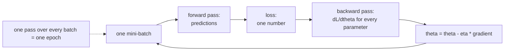

import DataCampExercise from "../../../../components/DataCampExercise.astro";
import Figure from "../../../../components/Figure.astro";
import Quiz from "../../../../components/Quiz.astro";

Training is one line repeated: move every parameter a little way against its gradient.
Everything interesting is in "a little way" — this page derives the exact ceiling on the
step size, then measures what happens at five learning rates and five batch sizes.

## What you'll learn

- The update rule, with one SGD step reproduced by hand to **0.00e+00** against Keras.
- Why the stability limit is $2/\text{curvature}$ — derived, then tested at four rates.
- A learning-rate sweep spanning **0.1320 to 0.8960** validation accuracy on identical
  models, and why lr=1.0 did *not* explode here.
- What batch size buys: batch 32 reached **0.9005** in 6.5s, batch 2048 **0.7650** in
  1.7s, and batch 8 took **34 minutes**.
- Why anisotropic curvature makes one learning rate wrong for two parameters.
- A case where plain SGD beat both momentum and Adam by three orders of magnitude.

## The update rule

For every parameter $\theta_i$ and a loss $L$:

$$
\theta_i \leftarrow \theta_i - \eta \frac{\partial L}{\partial \theta_i}
$$

The gradient points in the direction of steepest *increase*, so subtracting it decreases
the loss. $\eta$ (the learning rate) sets how far you commit to that direction.



Verified against Keras on a single sigmoid unit, one row, $\eta = 0.5$:

| | Value |
| --- | --- |
| prediction | 0.093652 |
| loss (binary cross-entropy) | 2.368167 |
| $\partial L/\partial \mathbf{W}$ | [−0.906348, −0.453174, +0.453174, −1.812696] |
| $\mathbf{W}$ after a manual step | [0.487537, −0.191737, 0.515915, 0.044456] |
| $\mathbf{W}$ after `SGD.apply_gradients` | [0.487537, −0.191737, 0.515915, 0.044456] |
| difference | **0.00e+00** |

An optimiser is that subtraction plus bookkeeping. Note the third gradient component is
the only positive one — its input was the only negative feature.

## How large a step is too large?

Take $L(w) = (w - 1)^2$ and write out one step:

$$
w' = w - \eta \cdot 2(w-1)
\quad\Longrightarrow\quad
(w' - 1) = (1 - 2\eta)(w - 1)
$$

The distance to the minimum is multiplied by $\lvert 1 - 2\eta \rvert$ every step, which
gives the entire picture:

- $\lvert 1 - 2\eta\rvert < 1$ — converges, requiring $0 < \eta < 1$.
- $\eta = 0.5$ — the factor is 0: it lands exactly on the minimum in one step.
- $\eta = 1$ — the factor is $-1$: it bounces between two points forever.
- $\eta > 1$ — the factor exceeds 1 and the distance grows.

For curvature $c$ (the second derivative) the limit is $\eta < 2/c$. Tested:

| $\eta$ | Final loss after 30 steps | Behaviour |
| --- | --- | --- |
| 0.4 | 0.0000e+00 | converges |
| 0.9 | 1.3792e−05 | converges, oscillating |
| 1.0 | 9.0000e+00 | bounces forever, never improves |
| 1.1 | 5.0713e+05 | **diverges** |

At $\eta = 0.3$ the factor is 0.4, so each step leaves 40% of the distance:

| Step | $w$ | Loss | Gradient |
| --- | --- | --- | --- |
| 0 | 4.000000 | 9.000000 | 6.000000 |
| 1 | 2.200000 | 1.440000 | 2.400000 |
| 2 | 1.480000 | 0.230400 | 0.960000 |
| 3 | 1.192000 | 0.036864 | 0.384000 |
| 4 | 1.076800 | 0.005898 | 0.153600 |
| 5 | 1.030720 | 0.000944 | 0.061440 |

## When the curvature differs by axis

Real losses are not symmetric bowls. For $L(a,b) = a^2 + 10b^2$ the curvature is 2 along
$a$ and 20 along $b$, so the stability limits are 1.0 and 0.1. **One learning rate must
satisfy the tightest axis.**

<Figure
  src="/images/dl/phase-01-foundations/how-neural-networks-learn/loss-descent"
  alt="Three contour plots of an elliptical loss bowl with a descent path on each. At lr 0.02 the green path creeps along the flat direction. At lr 0.09 it zig-zags across the narrow direction but still reaches the centre. At lr 0.101 the red path oscillates with growing amplitude and leaves the plot."
  title="The same bowl, three step sizes"
  caption="Starting loss 16.8. lr=0.02 reaches 0.258 in 40 steps — stable but slow along the flat axis. lr=0.09 reaches 1.04e-06, zig-zagging because it is just under the b-axis limit of 0.1. lr=0.101 is just past that limit and the loss grows to 48.8."
/>

| $\eta$ | Loss: start → after 40 steps | |
| --- | --- | --- |
| 0.02 | 16.8 → 0.258 | converging, slowly |
| 0.09 | 16.8 → 1.038e−06 | converging, zig-zagging |
| 0.101 | 16.8 → 48.75 | **diverging** |

A condition number of 10 — mild by real standards — already forces a compromise: fast
enough for $a$ is unstable for $b$. This is why feature scaling matters, why the
[MLP page's](/deep-learning/phase-01---neural-network-foundations/multi-layer-perceptron-mlp/)
weights received gradients proportional to their inputs, and why Phase 2's normalisation
layers exist.

## What the learning rate does to a real model

Identical model, identical seed, plain SGD, 15 epochs on 8,000 MNIST rows:

<Figure
  src="/images/dl/phase-01-foundations/how-neural-networks-learn/learning-rate-sweep"
  alt="Two panels. Left: training loss on a log scale against epoch for five learning rates, with 0.0001 nearly flat at the top and 0.1 and 1.0 falling fastest. Right: validation accuracy against epoch, with 0.0001 stuck near 0.13 while 0.1 and 1.0 climb above 0.88."
  title="Five learning rates, everything else held fixed"
  caption="lr=0.0001 is not broken, just a thousand times too slow — after 15 epochs it reached 0.1320, barely above the 0.10 of guessing. lr=1.0 did not diverge on this problem; it matched lr=0.1 almost exactly. The useful range spans two orders of magnitude."
/>

| Learning rate | Final training loss | Final validation accuracy |
| --- | --- | --- |
| 0.0001 | 2.318552 | **0.1320** |
| 0.001 | 1.714472 | 0.5885 |
| 0.01 | 0.464704 | 0.8405 |
| 0.1 | 0.187716 | **0.8960** |
| 1.0 | 0.187320 | 0.8855 |

Two honest readings. **A learning rate 1,000× too small looks exactly like a broken
model** — 0.1320 accuracy and a loss that barely moves. Sweep the rate before suspecting
the architecture. And **lr=1.0 did not explode**, which the textbook picture would
predict. Cross-entropy on this shallow ReLU network has gentle enough curvature that a
step of 1.0 stayed inside the limit. Theory gives you $2/c$; only measurement tells you
what $c$ is.

## Batch size: more steps against cheaper steps

<Figure
  src="/images/dl/phase-01-foundations/how-neural-networks-learn/batch-size-tradeoff"
  alt="Bar chart of validation accuracy by batch size with an overlaid line of wall clock seconds. Accuracy falls from 0.9005 at batch 32 to 0.7650 at batch 2048 while time falls from 6.5 to 1.7 seconds."
  title="Same data, same epochs, same learning rate — only the batch size"
  caption="Batch 32 takes 2,000 steps and 6.5 seconds to reach 0.9005; batch 2048 takes 32 steps and 1.7 seconds to reach 0.7650. Holding epochs fixed while changing the batch size changes the number of updates by 62x, so this compares update counts as much as batch sizes."
/>

| Batch size | Steps (8 epochs) | Seconds | Validation accuracy |
| --- | --- | --- | --- |
| 8 | 8,000 | **2,047.93** | 0.9245 |
| 32 | 2,000 | 6.49 | 0.9005 |
| 128 | 504 | 3.05 | 0.8795 |
| 512 | 128 | 2.02 | 0.8475 |
| 2048 | 32 | 1.69 | 0.7650 |

The batch-8 row was measured once and deliberately left out of the figure build: **34
minutes** to buy 0.0240 accuracy over batch 32's 6.5 seconds — a 315× time cost for a 2.7%
relative gain. That is why batch sizes of 32–512 dominate in practice.

Note what this does *not* show. Holding epochs fixed gave the small-batch runs 62× more
updates, so part of their advantage is simply more optimisation. A fair batch-size
experiment fixes the *step* count and scales the learning rate — which is what Phase 8
does when it measures throughput properly.

## Mini-batch SGD, written out

$$
\theta \leftarrow \theta - \eta \cdot \frac{1}{|B|}\sum_{i \in B} \nabla_\theta L_i
$$

The batch average is what makes the gradient usable: one example's gradient is a very
noisy estimate of the full-dataset gradient, and the full dataset is too expensive to
evaluate every step. Mini-batches are the compromise, and the
[tensor page's](/deep-learning/phase-01---neural-network-foundations/tensors-and-tensor-operations/)
throughput measurement — 61 GFLOP/s at n=64 against 199 at n=1024 — is why a batch is
processed as one matmul rather than a loop.

## Momentum and Adam, and where they help

Momentum keeps a running velocity, so consistent directions accumulate:

$$
v \leftarrow \beta v + \nabla_\theta L,
\qquad
\theta \leftarrow \theta - \eta v
$$

Adam additionally divides each parameter's step by a running estimate of its own gradient
magnitude, which directly attacks the per-axis curvature problem above.

On the anisotropic bowl, 60 steps at $\eta = 0.05$:

| Optimiser | Final loss |
| --- | --- |
| plain SGD | **2.182971e−05** |
| SGD + momentum 0.9 | 1.910986e−02 |
| Adam | 9.709373e−02 |

**Plain SGD won by three orders of magnitude.** On a clean two-parameter quadratic with a
well-chosen rate there is nothing for momentum to accelerate and nothing for Adam to
rescale, so their extra state only overshoots. Adam earns its default-choice status on
messy, high-dimensional, non-stationary losses — not on this. Phase 2 compares them where
the difference goes the other way, which is the honest place to do it.

## See it move

```p5 title="A ball descending a loss surface" desc="The white ball starts high on the loss curve and steps downhill each frame, using the local slope (gradient) to decide which way to move -- then eases back to the start and does it again." height="300"
function lossFn(p) {
  return 0.02 * (p - 300) * (p - 300) / 40 + 20 * Math.sin(p / 45) * 0.3 + 60;
}
const START_X = 90;
let paramX = START_X;
let lr = 6;
let phase = "descend";   // descend -> hold -> rewind -> descend ...
let holdTimer = 0;
let settledX = START_X;
let rewindT = 0;

function setup() {
  createCanvas(600, 300);
  textFont("monospace");
  frameRate(20);
}

function slopeAt(p) {
  const eps = 1.0;
  return (lossFn(p + eps) - lossFn(p - eps)) / (2 * eps);
}

function easeInOut(x) {
  return x < 0.5 ? 2 * x * x : 1 - Math.pow(-2 * x + 2, 2) / 2;
}

function draw() {
  background(13, 17, 23);

  stroke(70, 80, 96);
  strokeWeight(1);
  noFill();
  beginShape();
  for (let px = 20; px <= 580; px += 4) {
    vertex(px, 250 - lossFn(px));
  }
  endShape();

  let status;
  if (phase === "descend") {
    const g = slopeAt(paramX);
    paramX -= lr * Math.sign(g) * Math.min(Math.abs(g), 4);
    status = "stepping opposite the gradient";
    if (Math.abs(g) < 0.05) {
      phase = "hold";
      holdTimer = 0;
      settledX = paramX;
    }
  } else if (phase === "hold") {
    status = "settled near a minimum";
    holdTimer++;
    if (holdTimer > 30) {
      phase = "rewind";
      rewindT = 0;
    }
  } else {
    status = "resetting for another descent...";
    rewindT += 0.035;
    paramX = lerp(settledX, START_X, easeInOut(constrain(rewindT, 0, 1)));
    if (rewindT >= 1) {
      phase = "descend";
      paramX = START_X;
    }
  }

  const py = 250 - lossFn(paramX);
  noStroke();
  fill(255, 211, 67);
  ellipse(paramX, py, 16, 16);

  fill(107, 169, 221);
  textSize(12);
  text("parameter value ->", 220, 280);
  fill(150);
  textSize(11);
  text(status, 20, 20);
}
```

The second sketch is the stability limit you can feel. Drag the rate past $2/c$ and the
path stops converging — the boundary sits exactly where the algebra says it does.

```p5 title="Cross the stability limit yourself" desc="Gradient descent on a quadratic with draggable learning rate and curvature. The convergence factor is shown live: below 1 the path converges, at exactly 1 it bounces forever, above 1 it diverges." height="420"
let lr = 0.3;
let curvature = 2.0;
let drag = -1;

function setup() {
  createCanvas(620, 420);
  textFont("monospace");
}
function draw() {
  background(13, 17, 23);
  const limit = 2 / curvature;
  const factor = Math.abs(1 - lr * curvature);

  fill(215);
  textSize(12);
  textAlign(LEFT, TOP);
  text("L(w) = " + (curvature / 2).toFixed(1) + " (w - 1)^2      curvature c = "
       + curvature.toFixed(1), 24, 16);

  const sliders = [["learning rate", lr, 0.01, 1.3], ["curvature c", curvature, 0.5, 6]];
  for (let i = 0; i < 2; i++) {
    const value = sliders[i][1], lo = sliders[i][2], hi = sliders[i][3];
    const y = 44 + i * 40;
    fill(150);
    textSize(11);
    textAlign(LEFT, TOP);
    text(sliders[i][0], 24, y);
    fill(235);
    textAlign(RIGHT, TOP);
    text(value.toFixed(3), 250, y);
    noStroke();
    fill(30, 36, 44);
    rect(24, y + 18, 226, 7, 4);
    fill(75, 139, 190);
    rect(24, y + 18, ((value - lo) / (hi - lo)) * 226, 7, 4);
    fill(235);
    ellipse(24 + ((value - lo) / (hi - lo)) * 226, y + 21, 13, 13);
  }

  fill(150);
  textSize(11);
  textAlign(LEFT, TOP);
  text("stability limit 2/c = " + limit.toFixed(3), 24, 134);
  fill(factor < 1 ? color(120, 200, 120)
       : factor > 1 ? color(232, 122, 122) : color(255, 176, 67));
  textSize(14);
  text("convergence factor |1 - lr*c| = " + factor.toFixed(3), 24, 154);
  textSize(11);
  text(factor < 1 ? "each step shrinks the distance to the minimum"
       : factor > 1 ? "each step GROWS the distance: divergence"
       : "the distance never changes: it bounces forever", 24, 176);

  const x0 = 300, x1 = 596, y0 = 60, y1 = 300;
  const wMin = -3, wMax = 5;
  const px = (w) => x0 + ((w - wMin) / (wMax - wMin)) * (x1 - x0);
  const lossOf = (w) => (curvature / 2) * (w - 1) * (w - 1);
  const maxLoss = Math.max(lossOf(wMin), lossOf(wMax), 1);
  const py = (l) => y1 - (Math.min(l, maxLoss) / maxLoss) * (y1 - y0);

  stroke(70, 80, 96);
  strokeWeight(1.4);
  noFill();
  beginShape();
  for (let w = wMin; w <= wMax; w += 0.05) vertex(px(w), py(lossOf(w)));
  endShape();

  let w = 4.0;
  let escaped = false;
  const points = [[w, lossOf(w)]];
  for (let i = 0; i < 24; i++) {
    w = w - lr * curvature * (w - 1);
    if (!isFinite(w) || Math.abs(w) > 40) { escaped = true; break; }
    points.push([w, lossOf(w)]);
  }
  for (let i = 0; i < points.length; i++) {
    const pw = points[i][0], pl = points[i][1];
    const inside = pw >= wMin && pw <= wMax;
    if (inside) {
      noStroke();
      fill(escaped ? color(232, 122, 122) : color(255, 211, 67));
      ellipse(px(pw), py(pl), 9, 9);
      if (i > 0 && points[i - 1][0] >= wMin && points[i - 1][0] <= wMax) {
        stroke(escaped ? color(232, 122, 122, 160) : color(255, 211, 67, 160));
        strokeWeight(1.2);
        line(px(points[i - 1][0]), py(points[i - 1][1]), px(pw), py(pl));
      }
    }
  }
  noStroke();
  fill(120, 200, 120);
  textSize(11);
  textAlign(CENTER, TOP);
  text("minimum at w = 1", px(1), y1 + 8);

  fill(105);
  textSize(10);
  textAlign(LEFT, TOP);
  const finalLoss = escaped ? Infinity : lossOf(points[points.length - 1][0]);
  text("start: w = 4, loss = " + lossOf(4).toFixed(2), 24, 210);
  text("after " + (points.length - 1) + " steps: loss = "
       + (escaped ? "escaped the plot" : finalLoss.toExponential(2)), 24, 228);
  text("drag either slider — the boundary is exactly at lr = 2/c", 24, 256);
  text("raising the curvature LOWERS the usable learning rate", 24, 274);
}
function mousePressed() {
  for (let i = 0; i < 2; i++) {
    const y = 44 + i * 40 + 21;
    if (mouseX > 16 && mouseX < 258 && Math.abs(mouseY - y) < 14) drag = i;
  }
}
function mouseDragged() {
  if (drag < 0) return;
  const u = constrain((mouseX - 24) / 226, 0, 1);
  if (drag === 0) lr = 0.01 + u * 1.29;
  if (drag === 1) curvature = 0.5 + u * 5.5;
}
function mouseReleased() { drag = -1; }
```

## Pitfalls

**Diagnosing a too-small learning rate as a bad architecture.** lr=0.0001 gave 0.1320
accuracy — indistinguishable from a broken model. Sweep the rate first; it costs five
short runs.

**Assuming a large learning rate always diverges.** lr=1.0 matched lr=0.1 here. The limit
is $2/c$, and you do not know $c$ until you measure.

**Comparing batch sizes at a fixed epoch count.** That changes the update count by 62×
between batch 32 and 2048, so two variables move at once.

**Using a tiny batch to "learn better".** Batch 8 cost 2,047.93s against batch 32's 6.49s
for 0.0240 more accuracy.

**Reaching for Adam automatically.** On this well-conditioned problem plain SGD beat it by
three orders of magnitude. Adam is a good default on hard problems, not a strictly better
algorithm.

**Forgetting the gradient is a batch average.** Changing the batch size changes the
gradient's variance, which interacts with the learning rate — they are not independent
knobs.

## Recap

- $\theta \leftarrow \theta - \eta\,\partial L/\partial\theta$, reproduced by hand to
  **0.00e+00** against `SGD.apply_gradients`.
- For $(w-1)^2$, one step multiplies the distance to the minimum by
  $\lvert 1 - 2\eta\rvert$; in general $\eta < 2/c$. Tested: 0.9 converges, 1.0 bounces
  forever, 1.1 diverges to 5.07e+05.
- Anisotropic curvature forces a compromise — on $a^2 + 10b^2$ the limits are 1.0 and
  0.1, so 0.101 diverged while 0.09 converged to 1.04e−06.
- On real data: **0.1320** accuracy at lr=0.0001 against **0.8960** at lr=0.1, and
  lr=1.0 did not diverge.
- Batch size: 32 → 0.9005 in 6.49s, 2048 → 0.7650 in 1.69s, 8 → 0.9245 in
  **2,047.93s**.
- Plain SGD beat momentum and Adam on the clean quadratic; their advantage lies on messy
  losses.

<Quiz
  questions={[
    {
      q: "Your model trains 15 epochs and reaches 0.1320 validation accuracy on a 10-class problem. What should you check first?",
      options: [
        "The architecture — it is clearly too small",
        "The learning rate. Measured here, lr=0.0001 produced exactly that, while lr=0.1 on the identical model and seed reached 0.8960",
        "The label encoding",
        "Whether the data is shuffled",
      ],
      answer: 1,
      explain: "A rate three orders of magnitude too small is indistinguishable from a broken model. A log-spaced sweep of five short runs is the cheapest diagnostic in deep learning.",
    },
    {
      q: "For L(w) = (w-1)², what happens at exactly eta = 1.0?",
      options: [
        "It converges fastest",
        "The distance to the minimum is multiplied by |1 - 2| = 1 every step, so it bounces between two points forever — measured, the loss was still 9.0000 after 30 steps",
        "It diverges immediately",
        "It lands on the minimum in one step",
      ],
      answer: 1,
      explain: "eta = 0.5 is the rate that lands exactly on the minimum (factor 0). Convergence needs the factor below 1, meaning eta < 1 here and eta < 2/c in general.",
    },
    {
      q: "On L(a,b) = a² + 10b², why can one learning rate not suit both parameters?",
      options: [
        "Because b has a larger coefficient",
        "The curvatures are 2 and 20, so the limits are 1.0 and 0.1 — anything fast enough for a is unstable for b; measured, 0.101 diverged while 0.09 converged",
        "Because gradient descent needs symmetric losses",
        "It can, with enough steps",
      ],
      answer: 1,
      explain: "A condition number of 10 is mild and already forces the compromise. This is the mechanism behind feature scaling, normalisation layers and per-parameter optimisers.",
    },
    {
      q: "Batch 32 reached 0.9005 and batch 2048 reached 0.7650 after the same 8 epochs. What is the flaw in concluding small batches generalise better?",
      options: [
        "There is none — the result is clear",
        "At fixed epochs, batch 32 took 2,000 updates against batch 2048's 32 — a 62x difference, so the comparison conflates batch size with the amount of optimisation",
        "The batch sizes are too far apart",
        "Validation accuracy is the wrong metric",
      ],
      answer: 1,
      explain: "To isolate batch size you fix the step count and scale the learning rate. As run here, much of the gap is simply that the small-batch model took far more updates.",
    },
    {
      q: "Plain SGD finished at 2.18e-05 while Adam finished at 9.71e-02 on the same bowl. What does that tell you?",
      options: [
        "Adam is a worse optimiser",
        "That on a clean low-dimensional problem with a well-chosen rate there is nothing for Adam's adaptive scaling to fix, so its extra state only overshoots — its advantage appears on messy high-dimensional losses",
        "The Adam implementation is buggy",
        "Adam needs a warm-up",
      ],
      answer: 1,
      explain: "Benchmarks decide optimisers, not reputations. Adam is the right default when you cannot tune a rate per problem, which is the usual situation — but not this one.",
    },
  ]}
/>

## Next

You know the update rule and its hard limit. Continue to **Building Neural Networks with
Keras** to assemble models the framework way, or to
[Autograd from Scratch](/deep-learning/phase-01---neural-network-foundations/autograd-from-scratch/)
to see where these gradients come from.

## 🧪 Try It Yourself

### Exercise 1 – Descend a one-parameter loss

<DataCampExercise
  lang="python"
  hint={`The gradient of (w - 1)**2 is 2*(w - 1), and the update is w = w - lr * gradient.`}
  code={`# Task: Exercise 1 - Descend a one-parameter loss
w = 4.0
lr = 0.3
print(f"{'step':>5} {'w':>10} {'loss':>10} {'gradient':>10}")
for step in range(6):
    loss = (w - 1.0) ** 2
    gradient = 2 * (w - 1.0)
    print(f"{step:5d} {w:10.6f} {loss:10.6f} {gradient:10.6f}")
    w = w - lr * ___                        # replace ___ with gradient
print(f"the minimum is at w = 1.0; after 5 steps we are at {w:.6f}")
print(f"each step multiplies the distance to the minimum by "
      f"|1 - lr*2| = {abs(1 - lr * 2):.1f}")

# -- Expected Output -------------------------------------------
#  step          w       loss   gradient
#     0   4.000000   9.000000   6.000000
#     1   2.200000   1.440000   2.400000
#     2   1.480000   0.230400   0.960000
#     3   1.192000   0.036864   0.384000
#     4   1.076800   0.005898   0.153600
#     5   1.030720   0.000944   0.061440
# the minimum is at w = 1.0; after 5 steps we are at 1.012288
# each step multiplies the distance to the minimum by |1 - lr*2| = 0.4
# --------------------------------------------------------------`}
  solution={`w = 4.0
lr = 0.3
print(f"{'step':>5} {'w':>10} {'loss':>10} {'gradient':>10}")
for step in range(6):
    loss = (w - 1.0) ** 2
    gradient = 2 * (w - 1.0)
    print(f"{step:5d} {w:10.6f} {loss:10.6f} {gradient:10.6f}")
    w = w - lr * gradient
print(f"the minimum is at w = 1.0; after 5 steps we are at {w:.6f}")
print(f"each step multiplies the distance to the minimum by "
      f"|1 - lr*2| = {abs(1 - lr * 2):.1f}")`}
  sct={`test_output_contains("1.012288")
success_msg("The distance shrinks by exactly 0.4 each step: 3.0, 1.2, 0.48, 0.192, 0.0768, 0.0307. Gradient descent on a quadratic is geometric decay.")`}
  height={300}
/>

### Exercise 2 – Find the stability limit

<DataCampExercise
  lang="python"
  hint={`The step is w - lr * 2 * (w - 1). Convergence needs |1 - lr * curvature| below 1.`}
  code={`# Task: Exercise 2 - Find the stability limit
import numpy as np

curvature = 2.0                      # the second derivative of (w-1)^2
limit = 2.0 / ___                    # replace ___ with curvature
print(f"for loss (w-1)^2 the curvature is {curvature} so steps must stay below "
      f"{limit}")
for lr in (0.4, 0.9, 1.0, 1.1):
    w = 4.0
    for _ in range(30):
        w = w - lr * 2 * (w - 1.0)
        if not np.isfinite(w) or abs(w) > 1e12:
            break
    final = (w - 1.0) ** 2 if np.isfinite(w) and abs(w) < 1e12 else float("inf")
    verdict = "converges" if final < 1e-6 else ("oscillates forever" if final < 1e3
                                                else "DIVERGES")
    print(f"lr={lr:<4} final loss {final:12.4e}  {verdict}")

# -- Expected Output -------------------------------------------
# for loss (w-1)^2 the curvature is 2.0 so steps must stay below 1.0
# lr=0.4  final loss   0.0000e+00  converges
# lr=0.9  final loss   1.3792e-05  oscillates forever
# lr=1.0  final loss   9.0000e+00  oscillates forever
# lr=1.1  final loss   5.0713e+05  DIVERGES
# --------------------------------------------------------------`}
  solution={`import numpy as np

curvature = 2.0
limit = 2.0 / curvature
print(f"for loss (w-1)^2 the curvature is {curvature} so steps must stay below "
      f"{limit}")
for lr in (0.4, 0.9, 1.0, 1.1):
    w = 4.0
    for _ in range(30):
        w = w - lr * 2 * (w - 1.0)
        if not np.isfinite(w) or abs(w) > 1e12:
            break
    final = (w - 1.0) ** 2 if np.isfinite(w) and abs(w) < 1e12 else float("inf")
    verdict = "converges" if final < 1e-6 else ("oscillates forever" if final < 1e3
                                                else "DIVERGES")
    print(f"lr={lr:<4} final loss {final:12.4e}  {verdict}")`}
  sct={`test_output_contains("DIVERGES")
success_msg("The boundary is exact, not empirical: |1 - lr*c| < 1 rearranges to lr < 2/c. Note lr=0.9 lands at 1.4e-05 rather than 0 — it is converging, but oscillating around the minimum as it goes.")`}
  height={300}
/>

### Exercise 3 – One rate, two curvatures

<DataCampExercise
  lang="python"
  hint={`The gradient of a**2 + 10*b**2 is [2a, 20b]. The tighter axis sets the ceiling.`}
  code={`# Task: Exercise 3 - One rate, two curvatures
import numpy as np

print("loss(a, b) = a^2 + 10 b^2 : curvature 2 along a, 20 along b")
print(f"stability limit along a: {2 / 2:.3f}   along b: {2 / 20:.3f}")
for lr in (0.02, 0.09, 0.101):
    point = np.array([2.6, 1.0])
    start = point[0] ** 2 + 10 * point[1] ** 2
    for _ in range(40):
        point = point - lr * np.array([2 * point[0], ___ * point[1]])
        # replace ___ with 20
        if not np.all(np.isfinite(point)) or np.abs(point).max() > 1e6:
            break
    final = point[0] ** 2 + 10 * point[1] ** 2 if np.all(np.isfinite(point)) else float("inf")
    print(f"lr={lr:<6} loss {start:.1f} -> {final:.4g}  "
          f"{'DIVERGING' if final > start else 'converging'}")
print("the tightest axis sets the ceiling: 0.101 > 0.1 blows up along b")
print("this is why feature scaling and normalisation layers matter")

# -- Expected Output -------------------------------------------
# loss(a, b) = a^2 + 10 b^2 : curvature 2 along a, 20 along b
# stability limit along a: 1.000   along b: 0.100
# lr=0.02   loss 16.8 -> 0.258  converging
# lr=0.09   loss 16.8 -> 1.038e-06  converging
# lr=0.101  loss 16.8 -> 48.75  DIVERGING
# the tightest axis sets the ceiling: 0.101 > 0.1 blows up along b
# this is why feature scaling and normalisation layers matter
# --------------------------------------------------------------`}
  solution={`import numpy as np

print("loss(a, b) = a^2 + 10 b^2 : curvature 2 along a, 20 along b")
print(f"stability limit along a: {2 / 2:.3f}   along b: {2 / 20:.3f}")
for lr in (0.02, 0.09, 0.101):
    point = np.array([2.6, 1.0])
    start = point[0] ** 2 + 10 * point[1] ** 2
    for _ in range(40):
        point = point - lr * np.array([2 * point[0], 20 * point[1]])
        if not np.all(np.isfinite(point)) or np.abs(point).max() > 1e6:
            break
    final = point[0] ** 2 + 10 * point[1] ** 2 if np.all(np.isfinite(point)) else float("inf")
    print(f"lr={lr:<6} loss {start:.1f} -> {final:.4g}  "
          f"{'DIVERGING' if final > start else 'converging'}")
print("the tightest axis sets the ceiling: 0.101 > 0.1 blows up along b")
print("this is why feature scaling and normalisation layers matter")`}
  sct={`test_output_contains("48.75")
success_msg("0.09 converges to 1e-06 and 0.101 blows up — the boundary sits exactly at 2/20 = 0.1, set by the tighter axis. A real network has millions of axes and a far worse condition number.")`}
  height={330}
/>

### Exercise 4 – Reproduce one SGD step

<DataCampExercise
  lang="python"
  hint={`The manual update is W - lr * grad. Then let the optimiser do it and compare.`}
  code={`# Task: Exercise 4 - Reproduce one SGD step
import numpy as np
import tensorflow as tf

tf.keras.utils.set_random_seed(0)
model = tf.keras.Sequential([tf.keras.layers.Input((4,)),
                             tf.keras.layers.Dense(1, activation="sigmoid")])
x = np.array([[1.0, 0.5, -0.5, 2.0]], dtype="float32")
y = np.array([[1.0]], dtype="float32")

W, b = [v.numpy().copy() for v in model.weights]
with tf.GradientTape() as tape:
    prediction = model(x, training=True)
    loss = tf.keras.losses.binary_crossentropy(y, prediction)
grads = tape.gradient(loss, model.weights)

lr = 0.5
manual_W = W - lr * grads[0].___()          # replace ___ with numpy
optimizer = tf.keras.optimizers.SGD(learning_rate=lr)
optimizer.apply_gradients(zip(grads, model.weights))
keras_W = model.weights[0].numpy()

print(f"prediction {prediction.numpy().item():.6f}   loss {loss.numpy().item():.6f}")
print(f"dL/dW      {grads[0].numpy().ravel().round(6)}")
print(f"manual W after one step {manual_W.ravel().round(6)}")
print(f"keras  W after one step {keras_W.ravel().round(6)}")
print(f"max difference: {np.abs(manual_W - keras_W).max():.2e}")

# -- Expected Output -------------------------------------------
# prediction 0.093652   loss 2.368167
# dL/dW      [-0.906348 -0.453174  0.453174 -1.812696]
# manual W after one step [ 0.487537 -0.191737  0.515915  0.044456]
# keras  W after one step [ 0.487537 -0.191737  0.515915  0.044456]
# max difference: 0.00e+00
# --------------------------------------------------------------`}
  solution={`import numpy as np
import tensorflow as tf

tf.keras.utils.set_random_seed(0)
model = tf.keras.Sequential([tf.keras.layers.Input((4,)),
                             tf.keras.layers.Dense(1, activation="sigmoid")])
x = np.array([[1.0, 0.5, -0.5, 2.0]], dtype="float32")
y = np.array([[1.0]], dtype="float32")

W, b = [v.numpy().copy() for v in model.weights]
with tf.GradientTape() as tape:
    prediction = model(x, training=True)
    loss = tf.keras.losses.binary_crossentropy(y, prediction)
grads = tape.gradient(loss, model.weights)

lr = 0.5
manual_W = W - lr * grads[0].numpy()
optimizer = tf.keras.optimizers.SGD(learning_rate=lr)
optimizer.apply_gradients(zip(grads, model.weights))
keras_W = model.weights[0].numpy()

print(f"prediction {prediction.numpy().item():.6f}   loss {loss.numpy().item():.6f}")
print(f"dL/dW      {grads[0].numpy().ravel().round(6)}")
print(f"manual W after one step {manual_W.ravel().round(6)}")
print(f"keras  W after one step {keras_W.ravel().round(6)}")
print(f"max difference: {np.abs(manual_W - keras_W).max():.2e}")`}
  sct={`test_output_contains("max difference: 0.00e+00")
success_msg("An SGD optimiser is that one subtraction. Note the third gradient component is the only positive one — its input was the only negative feature.")`}
  height={380}
/>

### Exercise 5 – Count the updates

<DataCampExercise
  lang="python"
  hint={`Steps per epoch is ceil(rows / batch); multiply by the number of epochs.`}
  code={`# Task: Exercise 5 - Count the updates
import numpy as np

rows = 8000
epochs = 8
print(f"{'batch':>7} {'steps/epoch':>12} {'total steps':>12}")
for batch in (32, 128, 512, 2048):
    per_epoch = int(np.___(rows / batch))          # replace ___ with ceil
    print(f"{batch:7d} {per_epoch:12d} {per_epoch * epochs:12d}")
print("same data and same epochs, a 62x difference in the number of updates")

# -- Expected Output -------------------------------------------
#   batch  steps/epoch  total steps
#      32          250         2000
#     128           63          504
#     512           16          128
#    2048            4           32
# same data and same epochs, a 62x difference in the number of updates
# --------------------------------------------------------------`}
  solution={`import numpy as np

rows = 8000
epochs = 8
print(f"{'batch':>7} {'steps/epoch':>12} {'total steps':>12}")
for batch in (32, 128, 512, 2048):
    per_epoch = int(np.ceil(rows / batch))
    print(f"{batch:7d} {per_epoch:12d} {per_epoch * epochs:12d}")
print("same data and same epochs, a 62x difference in the number of updates")`}
  sct={`test_output_contains("2048            4           32")
success_msg("This is why 'batch 32 generalises better' claims measured at fixed epochs are unsafe: batch 32 got 2,000 updates and batch 2048 got 32.")`}
  height={260}
/>

### Exercise 6 – SGD, momentum and Adam on the same bowl

<DataCampExercise
  lang="python"
  hint={`Call tape.gradient(loss, point) inside the loop and hand the result to apply_gradients.`}
  code={`# Task: Exercise 6 - SGD, momentum and Adam on the same bowl
import tensorflow as tf


def run(optimizer_name, steps=60):
    point = tf.Variable([2.6, 1.0])
    optimizers = {
        "sgd": tf.keras.optimizers.SGD(0.05),
        "momentum": tf.keras.optimizers.SGD(0.05, momentum=0.9),
        "adam": tf.keras.optimizers.Adam(0.05),
    }
    optimizer = optimizers[optimizer_name]
    for _ in range(steps):
        with tf.GradientTape() as tape:
            loss = point[0] ** 2 + 10 * point[1] ** 2
        optimizer.apply_gradients([(tape.___(loss, point), point)])
        # replace ___ with gradient
    return float(point[0] ** 2 + 10 * point[1] ** 2)


for name in ("sgd", "momentum", "adam"):
    print(f"{name:9s} loss after 60 steps: {run(name):.6e}")
print("plain SGD wins here: on a clean 2-parameter quadratic with a well-chosen")
print("rate there is nothing for momentum or Adam to fix, and their extra state")
print("costs accuracy. Their advantage appears on messy high-dimensional losses.")

# -- Expected Output -------------------------------------------
# sgd       loss after 60 steps: 2.182971e-05
# momentum  loss after 60 steps: 1.910986e-02
# adam      loss after 60 steps: 9.709373e-02
# plain SGD wins here: on a clean 2-parameter quadratic with a well-chosen
# rate there is nothing for momentum or Adam to fix, and their extra state
# costs accuracy. Their advantage appears on messy high-dimensional losses.
# --------------------------------------------------------------`}
  solution={`import tensorflow as tf


def run(optimizer_name, steps=60):
    point = tf.Variable([2.6, 1.0])
    optimizers = {
        "sgd": tf.keras.optimizers.SGD(0.05),
        "momentum": tf.keras.optimizers.SGD(0.05, momentum=0.9),
        "adam": tf.keras.optimizers.Adam(0.05),
    }
    optimizer = optimizers[optimizer_name]
    for _ in range(steps):
        with tf.GradientTape() as tape:
            loss = point[0] ** 2 + 10 * point[1] ** 2
        optimizer.apply_gradients([(tape.gradient(loss, point), point)])
    return float(point[0] ** 2 + 10 * point[1] ** 2)


for name in ("sgd", "momentum", "adam"):
    print(f"{name:9s} loss after 60 steps: {run(name):.6e}")
print("plain SGD wins here: on a clean 2-parameter quadratic with a well-chosen")
print("rate there is nothing for momentum or Adam to fix, and their extra state")
print("costs accuracy. Their advantage appears on messy high-dimensional losses.")`}
  sct={`test_output_contains("2.182971e-05")
success_msg("Three orders of magnitude in SGD's favour — on this problem. Run the same comparison on a deep network in Phase 2 and the ordering reverses, which is exactly why benchmarks beat reputations.")`}
  height={380}
/>
