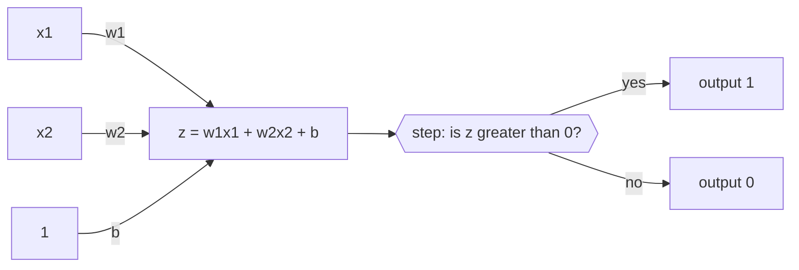

import DataCampExercise from "../../../../components/DataCampExercise.astro";
import Figure from "../../../../components/Figure.astro";
import Quiz from "../../../../components/Quiz.astro";

Every deep network is built from one unit: multiply each input by a weight, add them
up, add a bias, and pass the total through an activation. This page takes that unit as
far as it goes — which is exactly one straight line — proves where it stops, and fixes
it with nine parameters.

## What you'll learn

- The perceptron's forward pass and its 1958 learning rule, both written out and run.
- Why it converges on AND in **9 epochs** and never converges on XOR, measured.
- A four-line proof by contradiction that no straight line can compute XOR.
- Exactly **14 of the 16** two-input boolean functions a single perceptron can learn —
  enumerated, not asserted.
- The two-layer XOR construction, with weights you can check by hand.
- Why the step function makes gradient descent impossible, and what replaced it.

## One neuron, written out

For inputs $\mathbf{x} \in \mathbb{R}^{n}$, weights $\mathbf{w} \in \mathbb{R}^{n}$
and a bias $b \in \mathbb{R}$:

$$
z = \mathbf{w}^\top \mathbf{x} + b = \sum_{i=1}^{n} w_i x_i + b,
\qquad
\hat{y} = \mathrm{step}(z) = \begin{cases} 1 & z > 0 \\ 0 & z \le 0 \end{cases}
$$

The geometry is the whole story. $\mathbf{w}^\top\mathbf{x} + b = 0$ is a hyperplane —
a line in 2D, a plane in 3D. $\mathbf{w}$ is the direction perpendicular to it, and
$b$ decides how far from the origin it sits: the distance is
$\lvert b \rvert / \lVert \mathbf{w} \rVert$. Everything on one side outputs 1;
everything on the other outputs 0. **A perceptron is a line, and a decision about
which side you are on.**



## The learning rule

Rosenblatt's 1958 rule visits one row at a time and only acts when it is wrong:

$$
w_i \leftarrow w_i + \eta\,(y - \hat{y})\,x_i,
\qquad
b \leftarrow b + \eta\,(y - \hat{y})
$$

There are only three cases. Prediction correct, $y - \hat{y} = 0$: nothing moves.
Predicted 0 when the answer was 1, $y - \hat{y} = +1$: add $\eta x_i$, pushing $z$ up
for this input. Predicted 1 when the answer was 0: subtract, pushing $z$ down. That is
the entire algorithm — no derivatives, no loss function.

```python title="perceptron.py" showLineNumbers{1}
import numpy as np

def perceptron(X, y, lr=0.1, max_epochs=100, seed=0):
    """Rosenblatt's rule. Returns whether it separated the data, and in how many passes."""
    rng = np.random.default_rng(seed)
    w, b = rng.normal(0, 0.01, X.shape[1]), 0.0
    for epoch in range(1, max_epochs + 1):
        errors = 0
        for xi, target in zip(X, y):
            prediction = 1 if xi @ w + b > 0 else 0
            step = lr * (target - prediction)          # +lr, -lr, or exactly 0
            if step != 0:
                w, b, errors = w + step * xi, b + step, errors + 1
        if errors == 0:                                 # a full clean pass
            return {"converged": True, "epochs": epoch, "w": w, "b": b}
    return {"converged": False, "epochs": max_epochs, "w": w, "b": b}
```

**The Perceptron Convergence Theorem** guarantees this halts if the data is linearly
separable. Note what it does *not* promise: nothing about the quality of the line, and
nothing at all when the data is not separable.

## Run it on the four gates

<Figure
  src="/images/dl/phase-01-foundations/introduction-to-neural-networks-the-perceptron/perceptron-gates"
  alt="Four panels showing the two-input truth tables as points. AND, OR and NAND each have a green separating line found by the perceptron. The XOR panel has no line: instead a dashed segment joins the two positive points, another joins the two negative points, and they cross at the centre."
  title="Three gates solved, one impossible"
  caption="The XOR panel is the proof rather than an illustration: joining the two positives and joining the two negatives produces segments that cross, so the classes' convex hulls overlap and no straight line can have one class strictly on each side."
/>

| Gate | Outcome | Final weights | Bias |
| --- | --- | --- | --- |
| AND | converged in **9 epochs** | [+0.201, +0.199] | −0.30 |
| OR | converged in **3 epochs** | [+0.001, +0.099] | +0.00 |
| NAND | converged in **4 epochs** | [−0.199, −0.001] | +0.20 |
| XOR | **never converged** (stopped at 100) | [−0.199, −0.001] | +0.10 |

<Figure
  src="/images/dl/phase-01-foundations/introduction-to-neural-networks-the-perceptron/perceptron-convergence"
  alt="Line plot of misclassified rows per epoch for four gates. OR drops to zero by epoch 3, NAND by epoch 4, AND by epoch 9. XOR rises to 4 errors and stays there for all 40 epochs."
  title="Misclassified rows per epoch, out of 4"
  caption="AND takes longer than OR because its separating line has less room. XOR climbs to 4 errors out of 4 and stays — the rule keeps applying corrections that undo each other, forever. There is no learning-rate or epoch-count setting that changes this."
/>

The convergence plot shows one run failing. A stronger statement is available cheaply:
search **every** single neuron and check that none of them works.

<Figure
  src="/images/dl/phase-01-foundations/introduction-to-neural-networks-the-perceptron/xor-ceiling"
  alt="Left: a heat map of how many of XOR's four rows each weight pair classifies correctly, over a 201 by 201 grid of w1 and w2. The map is banded and its brightest regions reach 3, never 4. Right: bars of the share of weight pairs that fully solve each gate — 24.75% for AND, OR and NAND, and 0.0% for XOR."
  title="40,401 weight pairs per gate, best bias chosen for each pair"
  caption="This is the impossibility proof restated as a measurement. For every (w1, w2) on a 201x201 grid the best available bias is used, so the search is not being defeated by a bad intercept — and XOR still tops out at 3 of 4 rows in every one of the 40,401 cells. The other three gates are solved by 10,000 of them apiece. Nothing about the learning rule failed on XOR; there was nothing to find."
/>

| Gate | Best of 4 rows | Weight pairs that solve it | Share |
| --- | --- | --- | --- |
| AND | 4 | 10,000 | 24.75% |
| OR | 4 | 10,000 | 24.75% |
| NAND | 4 | 10,000 | 24.75% |
| **XOR** | **3** | **0** | **0.00%** |

Look at OR's weights: $w_1 = +0.001$, $b = 0$. That line passes within 0.001 of two of
its four data points. It is a valid separator, so the algorithm stopped — the
perceptron takes **the first line that works, not the best one**. That is precisely the
gap [support vector machines](/machine-learning/phase-04---supervised-learning---classification/support-vector-machines-svm/)
close by maximising the margin instead.

## Why XOR is impossible

Suppose weights $w_1, w_2$ and bias $b$ exist with $w_1x_1 + w_2x_2 + b > 0$ exactly
when $\mathrm{XOR}(x_1, x_2) = 1$. Write down what each row demands:

| Row | Target | Constraint |
| --- | --- | --- |
| $(0,0)$ | 0 | $b \le 0$ |
| $(0,1)$ | 1 | $w_2 + b > 0$ |
| $(1,0)$ | 1 | $w_1 + b > 0$ |
| $(1,1)$ | 0 | $w_1 + w_2 + b \le 0$ |

Add rows 2 and 3: $w_1 + w_2 + 2b > 0$, so $w_1 + w_2 > -2b$. Row 4 says
$w_1 + w_2 \le -b$. Together:

$$
-2b < w_1 + w_2 \le -b
\;\Longrightarrow\;
-2b < -b
\;\Longrightarrow\;
b > 0
$$

which contradicts row 1. No such $(w_1, w_2, b)$ exists — for a perceptron or for any
linear classifier, at any learning rate, with any amount of data.

### So how many boolean functions *can* one neuron learn?

Two inputs give $2^4 = 16$ possible truth tables. Running the rule on every one of them:

**14 of 16 are learnable.** The two that are not are exactly
$[0,1,1,0]$ (XOR) and $[1,0,0,1]$ (XNOR).

That reframes the 1969 objection usefully. A single neuron is not weak in general — it
handles 87.5% of two-input logic. It fails on precisely the functions whose positive
examples sit on one diagonal, and that is a statement about geometry, not capacity.

## The two-layer fix, by hand

XOR is "OR, but not AND", which is expressible as $\mathrm{AND}(\mathrm{OR},
\mathrm{NAND})$ — and each of those three *is* linearly separable. Wire them in two
layers with a hidden layer of two units:

$$
\mathbf{W}_1 = \begin{bmatrix} 1 & -1 \\ 1 & -1 \end{bmatrix},
\quad
\mathbf{b}_1 = \begin{bmatrix} -0.5 \\ 1.5 \end{bmatrix},
\quad
\mathbf{W}_2 = \begin{bmatrix} 1 \\ 1 \end{bmatrix},
\quad
b_2 = -1.5
$$

Hidden unit 1 computes $x_1 + x_2 - 0.5 > 0$, which is OR. Hidden unit 2 computes
$-x_1 - x_2 + 1.5 > 0$, which is NAND. The output computes $h_1 + h_2 - 1.5 > 0$,
which is AND. Every row:

| $x_1$ | $x_2$ | $h_1$ (OR) | $h_2$ (NAND) | output | XOR |
| --- | --- | --- | --- | --- | --- |
| 0 | 0 | 0 | 1 | 0 | 0 |
| 0 | 1 | 1 | 1 | **1** | 1 |
| 1 | 0 | 1 | 1 | **1** | 1 |
| 1 | 1 | 1 | 0 | 0 | 0 |

Exact match, using **9 parameters** and no training at all. The hidden layer's job is
to re-represent the input so that the output layer's straight line becomes sufficient —
which is what every hidden layer in every deep network is doing.

## The step function cannot be trained by gradient descent

Gradient descent needs $\partial L / \partial w$, and the chain rule routes that
through $\mathrm{step}'(z)$:

$$
\mathrm{step}'(z) = 0 \quad \text{for all } z \ne 0,
\qquad
\text{undefined at } z = 0
$$

| $z$ | $\mathrm{step}(z)$ | numeric derivative |
| --- | --- | --- |
| −2.0 | 0 | 0.0 |
| −0.1 | 0 | 0.0 |
| +0.1 | 1 | 0.0 |
| +2.0 | 1 | 0.0 |

Every update becomes $w \leftarrow w - \eta \cdot 0$. The weights never move. This is
why Rosenblatt needed a bespoke rule, and why the smooth sigmoid — whose derivative
reaches 0.25, as measured on
[the activations page](/deep-learning/phase-01---neural-network-foundations/activation-functions-relu-sigmoid-softmax/)
— was the change that made backpropagation possible.

Swapping the step for a sigmoid turns the same unit into something trainable:

```python title="one_trainable_neuron.py" showLineNumbers{1}
from tensorflow import keras

# One neuron, two inputs. The only change from a TLU is the activation.
model = keras.Sequential([
    keras.layers.Input((2,)),
    keras.layers.Dense(1, activation="sigmoid"),
])
model.compile(loss="binary_crossentropy", optimizer="sgd", metrics=["accuracy"])
```

## On real data

Two MNIST digit pairs, 2,000 training rows each, the perceptron rule against a single
sigmoid unit trained for 20 epochs:

| Task | Perceptron | Test accuracy | Sigmoid unit |
| --- | --- | --- | --- |
| 0 vs 1 | separated the training set | 0.9976 | 1.0000 |
| 3 vs 5 | never separated it | **0.9663** | 0.9508 |
| 4 vs 9 | never separated it | 0.9513 | 0.9635 |

Two things worth noticing. Handwritten 0s and 1s are close to linearly separable in
raw pixel space, which is why the rule terminates and both models are near-perfect.
And on 3 vs 5 the perceptron **beat** the sigmoid unit (0.9663 against 0.9508) despite
never converging — non-convergence means "no line separates the training set", not
"the line is useless". Failing to converge is information about your data.

## See it move

```p5 title="A perceptron: weighted sum, then activate" desc="A signal travels in along each weighted input, fires the neuron, then travels out to the output — one full forward pass, looping. Thicker edges are larger weights." height="250"
const inputs = [1, 0, 1];
const weights = [0.7, -0.4, 0.9];
const bias = -0.2;
function step(z) { return z > 0 ? 1 : 0; }
let sum, out;
const PERIOD = 100;
function setup() {
  createCanvas(600, 250);
  textFont("monospace");
  sum = inputs.reduce((acc, v, i) => acc + v * weights[i], 0) + bias;
  out = step(sum);
}
function draw() {
  background(13, 17, 23);
  const t = (frameCount % PERIOD) / PERIOD;
  const nx = 330, ny = height / 2;
  const inX = 110;

  for (let i = 0; i < inputs.length; i++) {
    const y = 70 + i * 55;
    stroke(weights[i] > 0 ? color(120, 200, 120) : color(232, 122, 122));
    strokeWeight(1 + Math.abs(weights[i]) * 4);
    line(inX + 22, y, nx - 26, ny);
    noStroke();
    fill(inputs[i] ? color(255, 211, 67) : color(60, 70, 84));
    ellipse(inX, y, 34, 34);
    fill(inputs[i] ? 20 : 200);
    textAlign(CENTER, CENTER);
    textSize(13);
    text(inputs[i], inX, y);
    fill(170);
    textSize(11);
    textAlign(LEFT, CENTER);
    text("w = " + weights[i].toFixed(1), inX + 34, y - 14);

    if (t < 0.5) {
      const u = t / 0.5;
      noStroke();
      fill(255, 211, 67, inputs[i] ? 230 : 60);
      ellipse(lerp(inX + 22, nx - 26, u), lerp(y, ny, u), 9, 9);
    }
  }

  noStroke();
  fill(t >= 0.5 && out ? color(255, 211, 67) : color(40, 48, 58));
  ellipse(nx, ny, 74, 74);
  fill(t >= 0.5 && out ? 20 : 210);
  textAlign(CENTER, CENTER);
  textSize(12);
  text("z=" + sum.toFixed(2), nx, ny - 8);
  textSize(11);
  text("step -> " + out, nx, ny + 10);

  stroke(90, 100, 115);
  strokeWeight(2);
  line(nx + 40, ny, 520, ny);
  if (t >= 0.5) {
    const u = (t - 0.5) / 0.5;
    noStroke();
    fill(255, 211, 67);
    ellipse(lerp(nx + 40, 520, u), ny, 9, 9);
  }
  noStroke();
  fill(out ? color(255, 211, 67) : color(60, 70, 84));
  ellipse(538, ny, 34, 34);
  fill(out ? 20 : 200);
  textAlign(CENTER, CENTER);
  textSize(13);
  text(out, 538, ny);

  fill(150);
  textSize(11);
  textAlign(LEFT, TOP);
  text("bias = " + bias.toFixed(1), 24, 20);
  text("z = 1(0.7) + 0(-0.4) + 1(0.9) - 0.2 = " + sum.toFixed(2), 24, 210);
}
```

The second sketch is the learning rule itself. Each click applies one epoch of updates;
the line moves only on rows it gets wrong. Switch to XOR and watch it never settle.

```p5 title="The perceptron rule, one epoch per click" desc="Four points from a logic gate and the current decision line. Each click runs one epoch of Rosenblatt's rule, showing which rows were misclassified and how the line moved. AND, OR and NAND settle; XOR oscillates forever." height="420"
const GATES = {
  AND: [0, 0, 0, 1],
  OR: [0, 1, 1, 1],
  NAND: [1, 1, 1, 0],
  XOR: [0, 1, 1, 0],
};
const NAMES = ["AND", "OR", "NAND", "XOR"];
const X = [[0, 0], [0, 1], [1, 0], [1, 1]];
const LR = 0.2;
let gate = 0;
let w = [0.01, -0.01];
let b = 0;
let epoch = 0;
let lastErrors = -1;
let history = [];

function reset() {
  w = [0.01, -0.01];
  b = 0;
  epoch = 0;
  lastErrors = -1;
  history = [];
}
function setup() {
  createCanvas(620, 420);
  textFont("monospace");
}
function runEpoch() {
  const y = GATES[NAMES[gate]];
  let errors = 0;
  for (let i = 0; i < 4; i++) {
    const z = X[i][0] * w[0] + X[i][1] * w[1] + b;
    const pred = z > 0 ? 1 : 0;
    const delta = LR * (y[i] - pred);
    if (delta !== 0) {
      w[0] += delta * X[i][0];
      w[1] += delta * X[i][1];
      b += delta;
      errors++;
    }
  }
  epoch++;
  lastErrors = errors;
  history.push(errors);
  if (history.length > 40) history.shift();
}
function draw() {
  background(13, 17, 23);
  const y = GATES[NAMES[gate]];
  const gx = 60, gy = 60, gw = 250, gh = 250;
  const px = (v) => gx + ((v + 0.4) / 1.8) * gw;
  const py = (v) => gy + gh - ((v + 0.4) / 1.8) * gh;

  fill(215);
  textSize(13);
  textAlign(LEFT, TOP);
  text("gate: " + NAMES[gate] + "     epoch: " + epoch, 24, 18);
  fill(105);
  textSize(10);
  text("click the plot to run one epoch, click the name to change gate", 24, 38);

  stroke(34, 40, 48);
  strokeWeight(1);
  for (const v of [0, 1]) {
    line(px(v), gy, px(v), gy + gh);
    line(gx, py(v), gx + gw, py(v));
  }

  // decision line: w0 x + w1 y + b = 0
  stroke(lastErrors === 0 ? color(120, 200, 120) : color(235));
  strokeWeight(2);
  if (Math.abs(w[1]) > 1e-9) {
    const y1 = -(w[0] * -0.4 + b) / w[1];
    const y2 = -(w[0] * 1.4 + b) / w[1];
    line(px(-0.4), py(y1), px(1.4), py(y2));
  } else if (Math.abs(w[0]) > 1e-9) {
    line(px(-b / w[0]), gy, px(-b / w[0]), gy + gh);
  }

  for (let i = 0; i < 4; i++) {
    const z = X[i][0] * w[0] + X[i][1] * w[1] + b;
    const pred = z > 0 ? 1 : 0;
    const wrong = pred !== y[i];
    noStroke();
    fill(y[i] ? color(255, 176, 67) : color(75, 139, 190));
    ellipse(px(X[i][0]), py(X[i][1]), 20, 20);
    if (wrong) {
      noFill();
      stroke(232, 122, 122);
      strokeWeight(2.5);
      ellipse(px(X[i][0]), py(X[i][1]), 30, 30);
      noStroke();
    }
    fill(230);
    textSize(9);
    textAlign(CENTER, CENTER);
    text(y[i], px(X[i][0]), py(X[i][1]));
  }
  noStroke();
  fill(130);
  textSize(10);
  textAlign(CENTER, TOP);
  text("x1", gx + gw / 2, gy + gh + 12);

  const panel = 350;
  fill(150);
  textSize(11);
  textAlign(LEFT, TOP);
  text("w = [" + w[0].toFixed(2) + ", " + w[1].toFixed(2) + "]", panel, 70);
  text("b = " + b.toFixed(2), panel, 90);
  fill(lastErrors === 0 ? color(120, 200, 120) : color(232, 122, 122));
  textSize(12);
  text(lastErrors < 0 ? "not run yet"
       : lastErrors === 0 ? "0 errors — separated" : lastErrors + " rows misclassified",
       panel, 118);

  // error history
  fill(150);
  textSize(10);
  textAlign(LEFT, TOP);
  text("errors per epoch", panel, 150);
  for (let i = 0; i < history.length; i++) {
    const h = (history[i] / 4) * 60;
    noStroke();
    fill(history[i] === 0 ? color(120, 200, 120) : color(232, 122, 122));
    rect(panel + i * 6, 230 - h, 4, h);
  }
  stroke(60, 68, 78);
  line(panel, 230, panel + 240, 230);

  noStroke();
  fill(105);
  textSize(10);
  textAlign(LEFT, TOP);
  text(NAMES[gate] === "XOR"
       ? "XOR: no line exists, so this never reaches 0"
       : "a separable gate: the line settles and stops moving", panel, 250);
  text("amber = target 1, blue = target 0", panel, 272);
  text("red ring = currently misclassified", panel, 288);
}
function mousePressed() {
  if (mouseY < 50) {
    gate = (gate + 1) % NAMES.length;
    reset();
  } else {
    runEpoch();
  }
}
```

## Pitfalls

**Expecting non-convergence to be a bug.** If the data is not linearly separable the
rule cannot terminate, by construction. The fix is a different model, not more epochs.

**Reading the perceptron's line as a good line.** It stops at the first separator it
finds. The OR run above ended with a boundary 0.001 away from two of its four points.

**Using the step function with gradient descent.** Its derivative is 0 everywhere, so
the update is exactly zero. Any modern "perceptron" you train with an optimiser has a
sigmoid or ReLU in it, not a step.

**Assuming a bias-free neuron is only slightly weaker.** Without $b$, the boundary must
pass through the origin. AND is unlearnable in that setting: every row of the truth
table would need $w_1x_1 + w_2x_2 > 0$ to be false at $(0,0)$, which is already forced.

**Believing the 1969 objection killed the idea because a neuron is weak.** One neuron
learns 14 of the 16 two-input functions. Two layers and 9 parameters cover the other
two. What was missing for another 17 years was a way to *train* the second layer.

## Recap

- A perceptron is $\hat{y} = \mathrm{step}(\mathbf{w}^\top\mathbf{x} + b)$: a
  hyperplane, plus a decision about which side you are on.
- The rule $w_i \leftarrow w_i + \eta(y - \hat{y})x_i$ only fires on mistakes, and
  converged in **9, 3 and 4 epochs** on AND, OR and NAND.
- XOR is impossible for any linear classifier — the four constraints force
  $b > 0$ and $b \le 0$ at once.
- **14 of 16** two-input boolean functions are learnable by one neuron; the exceptions
  are XOR and XNOR.
- Two layers, **9 parameters**, no training: OR and NAND in the hidden layer, AND on
  top, exactly reproducing XOR.
- $\mathrm{step}'(z) = 0$ everywhere, which is why sigmoid replaced it and why
  backpropagation had to wait.
- On 3 vs 5 MNIST digits the non-converged perceptron scored **0.9663** against a
  sigmoid unit's 0.9508 — non-convergence describes the data, not the quality of the
  answer.

<Quiz
  questions={[
    {
      q: "The perceptron rule runs for 100 epochs on XOR and never converges. What should you conclude?",
      options: [
        "The learning rate is too high",
        "XOR is not linearly separable, so no setting of any hyperparameter will make it converge — the four truth-table constraints force b > 0 and b <= 0 simultaneously",
        "It needs more training data",
        "The weights were initialised badly",
      ],
      answer: 1,
      explain: "The Perceptron Convergence Theorem only guarantees termination for linearly separable data. The contradiction proof on this page rules out every possible line, so tuning cannot help. Two layers and 9 parameters can.",
    },
    {
      q: "How many of the 16 two-input boolean functions can a single perceptron learn?",
      options: [
        "All 16",
        "14 — every function except XOR [0,1,1,0] and XNOR [1,0,0,1], which was verified by running the rule on all 16 truth tables",
        "8, exactly half",
        "4: AND, OR, NAND and NOR",
      ],
      answer: 1,
      explain: "A single neuron is not weak in general; it fails on precisely the two functions whose positive examples sit on opposite diagonals, which is a geometric property rather than a capacity limit.",
    },
    {
      q: "Why can gradient descent not train a step-function neuron?",
      options: [
        "The step function is not continuous, so the loss is undefined",
        "Its derivative is 0 for every z except 0 (where it is undefined), so w -= lr * grad leaves every weight exactly where it was",
        "Because the outputs are integers",
        "It can, but it needs a much higher learning rate",
      ],
      answer: 1,
      explain: "The chain rule multiplies by step'(z) = 0, so every update is exactly zero. This is why Rosenblatt needed a bespoke rule and why the smooth sigmoid — derivative up to 0.25 — was the change that unlocked backpropagation.",
    },
    {
      q: "The measured OR run ended with w = [+0.001, +0.099] and b = 0.00, a boundary passing within 0.001 of two data points. What does that tell you about the algorithm?",
      options: [
        "It failed and should be re-run with a different seed",
        "It stops at the first line that separates the data, not the best one — maximising the margin instead is exactly what an SVM adds",
        "The learning rate was too small",
        "The data was not separable after all",
      ],
      answer: 1,
      explain: "Zero errors is the stopping condition, so any separating line ends training. A boundary that grazes the data generalises worse than a centred one, which is the gap the max-margin objective closes.",
    },
    {
      q: "In the two-layer XOR construction, what is the hidden layer doing?",
      options: [
        "Adding capacity so the model can memorise four rows",
        "Re-representing the input as (OR, NAND), a space in which a single straight line — AND — is enough",
        "Smoothing the step function",
        "Reducing the number of parameters needed",
      ],
      answer: 1,
      explain: "Both hidden units compute linearly separable functions of the raw input. In their output space the two XOR-positive rows both become (1,1), so the output neuron's straight line suffices. Every hidden layer in every deep network is doing this.",
    },
  ]}
/>

## Next

You have taken one neuron as far as it goes, and seen the two-layer fix built by hand.
Continue to **Multi-Layer Perceptron (MLP)** to stack these units properly and see how
the hidden layer's re-representation is learned rather than hand-designed.

## 🧪 Try It Yourself

### Exercise 1 – The forward pass, by hand

<DataCampExercise
  lang="python"
  hint={`The pre-activation is the dot product of the weights with the inputs, plus the bias: xi @ w + b.`}
  code={`# Task: Exercise 1 - The forward pass, by hand
import numpy as np

X = np.array([[0.0, 0.0], [0.0, 1.0], [1.0, 0.0], [1.0, 1.0]])
w = np.array([0.5, -0.3])
b = 0.1

for xi in X:
    z = float(xi ___ w + b)             # replace ___ with @
    print(f"x = {xi}  z = {z:+.2f}  step(z) = {1 if z > 0 else 0}")
print("weights are a direction, the bias is where the line sits")

# -- Expected Output -------------------------------------------
# x = [0. 0.]  z = +0.10  step(z) = 1
# x = [0. 1.]  z = -0.20  step(z) = 0
# x = [1. 0.]  z = +0.60  step(z) = 1
# x = [1. 1.]  z = +0.30  step(z) = 1
# weights are a direction, the bias is where the line sits
# --------------------------------------------------------------`}
  solution={`import numpy as np

X = np.array([[0.0, 0.0], [0.0, 1.0], [1.0, 0.0], [1.0, 1.0]])
w = np.array([0.5, -0.3])
b = 0.1

for xi in X:
    z = float(xi @ w + b)
    print(f"x = {xi}  z = {z:+.2f}  step(z) = {1 if z > 0 else 0}")
print("weights are a direction, the bias is where the line sits")`}
  sct={`test_output_contains("z = +0.60")
success_msg("Four rows, four dot products. Note that (0,0) outputs 1 here purely because the bias is positive — the bias alone decides the origin's class.")`}
  height={230}
/>

### Exercise 2 – Implement the learning rule

<DataCampExercise
  lang="python"
  hint={`The update is lr * (target - prediction). It is exactly zero when the prediction is already right.`}
  code={`# Task: Exercise 2 - Implement the learning rule
import numpy as np

X = np.array([[0.0, 0.0], [0.0, 1.0], [1.0, 0.0], [1.0, 1.0]])
GATES = {"AND": np.array([0, 0, 0, 1]), "OR": np.array([0, 1, 1, 1]),
         "NAND": np.array([1, 1, 1, 0]), "XOR": np.array([0, 1, 1, 0])}


def perceptron(X, y, lr=0.1, max_epochs=100, seed=0):
    rng = np.random.default_rng(seed)
    w, b = rng.normal(0, 0.01, X.shape[1]), 0.0
    for epoch in range(1, max_epochs + 1):
        errors = 0
        for xi, target in zip(X, y):
            prediction = 1 if xi @ w + b > 0 else 0
            step = lr * (target - ___)          # replace ___ with prediction
            if step != 0:
                w, b, errors = w + step * xi, b + step, errors + 1
        if errors == 0:
            return {"converged": True, "epochs": epoch, "w": w, "b": b}
    return {"converged": False, "epochs": max_epochs, "w": w, "b": b}


for name in ("AND", "OR", "NAND", "XOR"):
    result = perceptron(X, GATES[name])
    verdict = f"converged in {result['epochs']:3d} epochs" if result["converged"] \\
        else f"NEVER converged ({result['epochs']} epochs)"
    print(f"{name:5s} {verdict}   w = [{result['w'][0]:+.3f}, {result['w'][1]:+.3f}]  "
          f"b = {result['b']:+.2f}")

# -- Expected Output -------------------------------------------
# AND   converged in   9 epochs   w = [+0.201, +0.199]  b = -0.30
# OR    converged in   3 epochs   w = [+0.001, +0.099]  b = +0.00
# NAND  converged in   4 epochs   w = [-0.199, -0.001]  b = +0.20
# XOR   NEVER converged (100 epochs)   w = [-0.199, -0.001]  b = +0.10
# --------------------------------------------------------------`}
  solution={`import numpy as np

X = np.array([[0.0, 0.0], [0.0, 1.0], [1.0, 0.0], [1.0, 1.0]])
GATES = {"AND": np.array([0, 0, 0, 1]), "OR": np.array([0, 1, 1, 1]),
         "NAND": np.array([1, 1, 1, 0]), "XOR": np.array([0, 1, 1, 0])}


def perceptron(X, y, lr=0.1, max_epochs=100, seed=0):
    rng = np.random.default_rng(seed)
    w, b = rng.normal(0, 0.01, X.shape[1]), 0.0
    for epoch in range(1, max_epochs + 1):
        errors = 0
        for xi, target in zip(X, y):
            prediction = 1 if xi @ w + b > 0 else 0
            step = lr * (target - prediction)
            if step != 0:
                w, b, errors = w + step * xi, b + step, errors + 1
        if errors == 0:
            return {"converged": True, "epochs": epoch, "w": w, "b": b}
    return {"converged": False, "epochs": max_epochs, "w": w, "b": b}


for name in ("AND", "OR", "NAND", "XOR"):
    result = perceptron(X, GATES[name])
    verdict = f"converged in {result['epochs']:3d} epochs" if result["converged"] \\
        else f"NEVER converged ({result['epochs']} epochs)"
    print(f"{name:5s} {verdict}   w = [{result['w'][0]:+.3f}, {result['w'][1]:+.3f}]  "
          f"b = {result['b']:+.2f}")`}
  sct={`test_output_contains("NEVER converged")
success_msg("Three gates in single digits, and XOR never. Ninety-nine more epochs would change nothing — the rule is applying corrections that undo each other.")`}
  height={380}
/>

### Exercise 3 – Enumerate what one neuron can learn

<DataCampExercise
  lang="python"
  hint={`Loop over all 16 four-bit patterns, build the target vector from the bits, and record the ones the rule cannot separate.`}
  code={`# Task: Exercise 3 - Enumerate what one neuron can learn
import numpy as np

X = np.array([[0.0, 0.0], [0.0, 1.0], [1.0, 0.0], [1.0, 1.0]])


def perceptron(X, y, lr=0.1, max_epochs=200, seed=0):
    rng = np.random.default_rng(seed)
    w, b = rng.normal(0, 0.01, X.shape[1]), 0.0
    for _ in range(max_epochs):
        errors = 0
        for xi, target in zip(X, y):
            prediction = 1 if xi @ w + b > 0 else 0
            step = lr * (target - prediction)
            if step != 0:
                w, b, errors = w + step * xi, b + step, errors + 1
        if errors == 0:
            return True
    return False


impossible = []
for bits in range(___):                     # replace ___ with 16
    y = np.array([(bits >> i) & 1 for i in range(4)])
    if not perceptron(X, y):
        impossible.append([int(v) for v in y])
print(f"learnable by one perceptron: {16 - len(impossible)} of 16")
for outputs in impossible:
    print("  impossible:", outputs)
print("those two are XOR and XNOR — the only non-linearly-separable pair")

# -- Expected Output -------------------------------------------
# learnable by one perceptron: 14 of 16
#   impossible: [0, 1, 1, 0]
#   impossible: [1, 0, 0, 1]
# those two are XOR and XNOR — the only non-linearly-separable pair
# --------------------------------------------------------------`}
  solution={`import numpy as np

X = np.array([[0.0, 0.0], [0.0, 1.0], [1.0, 0.0], [1.0, 1.0]])


def perceptron(X, y, lr=0.1, max_epochs=200, seed=0):
    rng = np.random.default_rng(seed)
    w, b = rng.normal(0, 0.01, X.shape[1]), 0.0
    for _ in range(max_epochs):
        errors = 0
        for xi, target in zip(X, y):
            prediction = 1 if xi @ w + b > 0 else 0
            step = lr * (target - prediction)
            if step != 0:
                w, b, errors = w + step * xi, b + step, errors + 1
        if errors == 0:
            return True
    return False


impossible = []
for bits in range(16):
    y = np.array([(bits >> i) & 1 for i in range(4)])
    if not perceptron(X, y):
        impossible.append([int(v) for v in y])
print(f"learnable by one perceptron: {16 - len(impossible)} of 16")
for outputs in impossible:
    print("  impossible:", outputs)
print("those two are XOR and XNOR — the only non-linearly-separable pair")`}
  sct={`test_output_contains("14 of 16")
success_msg("87.5% of two-input logic fits in a single neuron. The 1969 objection was about two specific functions, not about weakness in general.")`}
  height={380}
/>

### Exercise 4 – Build XOR by hand

<DataCampExercise
  lang="python"
  hint={`Hidden unit 1 is OR (x1 + x2 - 0.5), hidden unit 2 is NAND (-x1 - x2 + 1.5), and the output is AND of those two.`}
  code={`# Task: Exercise 4 - Build XOR by hand
import numpy as np

X = np.array([[0.0, 0.0], [0.0, 1.0], [1.0, 0.0], [1.0, 1.0]])
XOR = np.array([0, 1, 1, 0])

W1 = np.array([[1.0, -1.0], [1.0, -1.0]])
b1 = np.array([-0.5, 1.5])
W2 = np.array([[1.0], [1.0]])
b2 = np.array([-1.5])


def step(v):
    return (v > 0).astype(float)


hidden = step(X @ W1 + b1)
output = step(hidden @ W2 + ___).ravel()      # replace ___ with b2
print("   x1 x2 | h1(OR) h2(NAND) | out | XOR")
for row, hid, prediction, target in zip(X, hidden, output, XOR):
    print(f"   {row[0]:.0f}  {row[1]:.0f}  |   {hid[0]:.0f}       {hid[1]:.0f}     "
          f"|  {prediction:.0f}  |  {target}")
print("matches XOR exactly:", bool((output == XOR).all()))
print("parameters:", W1.size + b1.size + W2.size + b2.size)

# -- Expected Output -------------------------------------------
#    x1 x2 | h1(OR) h2(NAND) | out | XOR
#    0  0  |   0       1     |  0  |  0
#    0  1  |   1       1     |  1  |  1
#    1  0  |   1       1     |  1  |  1
#    1  1  |   1       0     |  0  |  0
# matches XOR exactly: True
# parameters: 9
# --------------------------------------------------------------`}
  solution={`import numpy as np

X = np.array([[0.0, 0.0], [0.0, 1.0], [1.0, 0.0], [1.0, 1.0]])
XOR = np.array([0, 1, 1, 0])

W1 = np.array([[1.0, -1.0], [1.0, -1.0]])
b1 = np.array([-0.5, 1.5])
W2 = np.array([[1.0], [1.0]])
b2 = np.array([-1.5])


def step(v):
    return (v > 0).astype(float)


hidden = step(X @ W1 + b1)
output = step(hidden @ W2 + b2).ravel()
print("   x1 x2 | h1(OR) h2(NAND) | out | XOR")
for row, hid, prediction, target in zip(X, hidden, output, XOR):
    print(f"   {row[0]:.0f}  {row[1]:.0f}  |   {hid[0]:.0f}       {hid[1]:.0f}     "
          f"|  {prediction:.0f}  |  {target}")
print("matches XOR exactly:", bool((output == XOR).all()))
print("parameters:", W1.size + b1.size + W2.size + b2.size)`}
  sct={`test_output_contains("matches XOR exactly: True")
success_msg("Nine numbers, no training. Look at the hidden columns: both XOR-positive rows became (1,1), so one straight line finishes the job.")`}
  height={340}
/>

### Exercise 5 – Show the step function has no gradient

<DataCampExercise
  lang="python"
  hint={`Use a central difference: (f(z + h) - f(z - h)) / (2h) with a small h.`}
  code={`# Task: Exercise 5 - Show the step function has no gradient
def step_scalar(z):
    return 1.0 if z > 0 else 0.0


print(f"{'z':>6} {'step(z)':>8} {'numeric derivative':>20}")
h = 1e-5
for z in (-2.0, -0.1, 0.1, 2.0):
    derivative = (step_scalar(z + h) - step_scalar(z ___ h)) / (2 * h)
    # replace ___ with -
    print(f"{z:6.1f} {step_scalar(z):8.1f} {derivative:20.1f}")
print("every derivative is 0, so w -= lr * grad never moves a weight")
print("this is why the perceptron needs its own update rule, and why")
print("sigmoid (derivative up to 0.25) replaced the step function")

# -- Expected Output -------------------------------------------
#      z  step(z)   numeric derivative
#   -2.0      0.0                  0.0
#   -0.1      0.0                  0.0
#    0.1      1.0                  0.0
#    2.0      1.0                  0.0
# every derivative is 0, so w -= lr * grad never moves a weight
# this is why the perceptron needs its own update rule, and why
# sigmoid (derivative up to 0.25) replaced the step function
# --------------------------------------------------------------`}
  solution={`def step_scalar(z):
    return 1.0 if z > 0 else 0.0


print(f"{'z':>6} {'step(z)':>8} {'numeric derivative':>20}")
h = 1e-5
for z in (-2.0, -0.1, 0.1, 2.0):
    derivative = (step_scalar(z + h) - step_scalar(z - h)) / (2 * h)
    print(f"{z:6.1f} {step_scalar(z):8.1f} {derivative:20.1f}")
print("every derivative is 0, so w -= lr * grad never moves a weight")
print("this is why the perceptron needs its own update rule, and why")
print("sigmoid (derivative up to 0.25) replaced the step function")`}
  sct={`test_output_contains("every derivative is 0")
success_msg("Zero at every sampled point, and the one place it is non-zero is a single undefined point of measure zero. Gradient descent has nothing to work with.")`}
  height={300}
/>

### Exercise 6 – Run it on real digits

<DataCampExercise
  lang="python"
  hint={`Predict with (X @ w + b) > 0 after training, then compare against the labels.`}
  code={`# Task: Exercise 6 - Run it on real digits
import numpy as np
import tensorflow as tf


def perceptron(X, y, lr=0.01, max_epochs=20, seed=0):
    rng = np.random.default_rng(seed)
    w, b = rng.normal(0, 0.01, X.shape[1]), 0.0
    for _ in range(max_epochs):
        errors = 0
        for xi, target in zip(X, y):
            prediction = 1 if xi @ w + b > 0 else 0
            step = lr * (target - prediction)
            if step != 0:
                w, b, errors = w + step * xi, b + step, errors + 1
        if errors == 0:
            return {"converged": True, "w": w, "b": b}
    return {"converged": False, "w": w, "b": b}


(x_train, y_train), (x_test, y_test) = tf.keras.datasets.mnist.load_data()
x_train = x_train.reshape(-1, 784).astype("float32") / 255.0
x_test = x_test.reshape(-1, 784).astype("float32") / 255.0

for pair in ((0, 1), (3, 5)):
    tr = np.isin(y_train, pair)
    te = np.isin(y_test, pair)
    xtr, ytr = x_train[tr][:2000], (y_train[tr][:2000] == pair[1]).astype(int)
    xte, yte = x_test[te], (y_test[te] == pair[1]).astype(int)
    result = perceptron(xtr, ytr)
    predictions = ((xte @ result["w"] + result["b"]) ___ 0).astype(int)
    # replace ___ with >
    print(f"{pair[0]} vs {pair[1]}: "
          f"{'separated the training set' if result['converged'] else 'never separated it':26s} "
          f"test accuracy {float((predictions == yte).mean()):.4f}")
print("linear separability is a property of the data, not a flaw in the rule")

# -- Expected Output -------------------------------------------
# 0 vs 1: separated the training set test accuracy 0.9986
# 3 vs 5: never separated it         test accuracy 0.9290
# linear separability is a property of the data, not a flaw in the rule
# --------------------------------------------------------------`}
  solution={`import numpy as np
import tensorflow as tf


def perceptron(X, y, lr=0.01, max_epochs=20, seed=0):
    rng = np.random.default_rng(seed)
    w, b = rng.normal(0, 0.01, X.shape[1]), 0.0
    for _ in range(max_epochs):
        errors = 0
        for xi, target in zip(X, y):
            prediction = 1 if xi @ w + b > 0 else 0
            step = lr * (target - prediction)
            if step != 0:
                w, b, errors = w + step * xi, b + step, errors + 1
        if errors == 0:
            return {"converged": True, "w": w, "b": b}
    return {"converged": False, "w": w, "b": b}


(x_train, y_train), (x_test, y_test) = tf.keras.datasets.mnist.load_data()
x_train = x_train.reshape(-1, 784).astype("float32") / 255.0
x_test = x_test.reshape(-1, 784).astype("float32") / 255.0

for pair in ((0, 1), (3, 5)):
    tr = np.isin(y_train, pair)
    te = np.isin(y_test, pair)
    xtr, ytr = x_train[tr][:2000], (y_train[tr][:2000] == pair[1]).astype(int)
    xte, yte = x_test[te], (y_test[te] == pair[1]).astype(int)
    result = perceptron(xtr, ytr)
    predictions = ((xte @ result["w"] + result["b"]) > 0).astype(int)
    print(f"{pair[0]} vs {pair[1]}: "
          f"{'separated the training set' if result['converged'] else 'never separated it':26s} "
          f"test accuracy {float((predictions == yte).mean()):.4f}")
print("linear separability is a property of the data, not a flaw in the rule")`}
  sct={`test_output_contains("0.9986")
success_msg("0s and 1s are nearly separable in raw pixels, so the rule terminates. 3s and 5s are not — and the resulting line still scores 0.9290, which is why non-convergence is information rather than failure.")`}
  height={420}
/>
