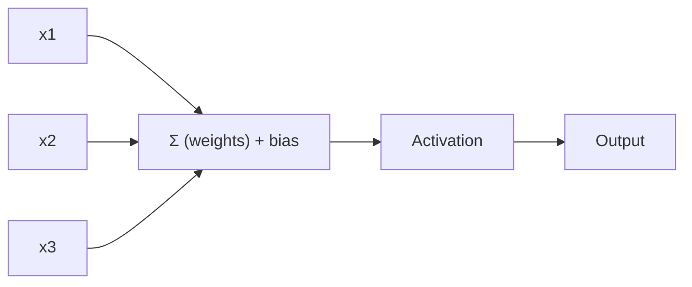

Every deep network — no matter how many layers it has — is built out of one simple
idea: take some numbers in, multiply each by a weight, add them up, and decide what
to output. That's it. This page is about that one idea, called a **perceptron**, and
why on its own it's both powerful and surprisingly limited.

## From biological to artificial neurons

Artificial neural networks are loosely inspired by **biological neurons**: a cell
body receives signals through branching *dendrites*, and if it gets enough signal, it
fires its own pulse down its *axon* to the next neuron. In 1943, Warren McCulloch and
Walter Pitts modeled this with a simplified **artificial neuron**: it takes binary
(on/off) inputs and produces a binary output, activating only when enough of its
inputs are active. Even with that simple rule, McCulloch and Pitts showed you could
wire up networks of these units to compute AND, OR, and NOT — any logical proposition
you like.

## The perceptron

In 1957, Frank Rosenblatt built on this idea with the **perceptron**, based on a
slightly richer unit called a **threshold logic unit (TLU)** (also called a linear
threshold unit, LTU). Instead of binary on/off values, the TLU's inputs and output are
numbers, and each input connection has its own **weight**. The perceptron is the
simplest neural unit:

1. take inputs
2. compute weighted sum
3. add bias
4. apply activation

Mathematically:

`z = w·x + b`

`output = activation(z)`



## What it can do

A single perceptron can learn a **linear decision boundary**.

That means:

- it can separate data that is linearly separable
- it cannot solve XOR alone (needs multiple layers)

## How a perceptron learns

Rosenblatt's training rule was inspired by **Hebb's rule**: "cells that fire together,
wire together." In practice, the perceptron is fed one training example at a time; for
every output that's wrong, it nudges the weights that would have produced the correct
output:

`w[i,j] ← w[i,j] + η · (y_j − ŷ_j) · x_i`

- `η` (eta) is the learning rate
- `y_j` is the target output, `ŷ_j` is the perceptron's actual output
- if the prediction is already correct, nothing changes

If the training data is **linearly separable**, this algorithm is guaranteed to
converge (the Perceptron Convergence Theorem). If it isn't — like the classic XOR
problem — a single perceptron will never find a solution, no matter how long you
train it. That limitation is exactly why the next page stacks perceptrons into an MLP.

:::tip[From the book]
Marvin Minsky and Seymour Papert's 1969 book *Perceptrons* pointed out that a single
perceptron can't solve XOR — and this is true of any linear classifier, not just
perceptrons. Some researchers were so discouraged that they abandoned neural networks
for years. It turns out the fix was simple: stack more than one layer of TLUs.
:::

## Perceptron in code

Scikit-learn ships a ready-made `Perceptron` classifier — a single layer of TLUs
trained with the rule above:

```python title="A single TLU with scikit-learn" showLineNumbers{1}
import numpy as np
from sklearn.datasets import load_iris
from sklearn.linear_model import Perceptron

iris = load_iris()
X = iris.data[:, (2, 3)]              # petal length, petal width
y = (iris.target == 0).astype(int)    # Is it Iris setosa?

per_clf = Perceptron()
per_clf.fit(X, y)

y_pred = per_clf.predict([[2, 0.5]])
print("Predicted class:", y_pred)
```

In tf.keras, a single neuron is just a `Dense` layer with one unit. Swapping the hard
step function for a smooth `sigmoid` turns this "hard threshold" perceptron into a
Logistic Regression-style unit that Gradient Descent can actually train:

```python title="The same idea as a single Keras neuron" showLineNumbers{1}
from tensorflow import keras

# One neuron, two inputs -- the tf.keras equivalent of a TLU.
tlu = keras.layers.Dense(1, activation="sigmoid", input_shape=(2,))

model = keras.Sequential([tlu])
model.compile(loss="binary_crossentropy", optimizer="sgd", metrics=["accuracy"])
```

:::tip[From the book]
Chollet's geometric framing of `z = w·x + b`: the dot product with `w` is a **linear
transform** (a rotation/scaling of the input space), and adding `b` is a
**translation**. Together they form an **affine transform** — and a perceptron with a
smooth activation is exactly that affine transform followed by a non-linear squashing
step. See the Tensors and Tensor Operations page for the geometric picture.
:::

## Key terms

- **weights**: importance of each input
- **bias**: shift term
- **activation**: non-linear function

## Visualize it

A perceptron is one neuron: it multiplies each input by a **weight**, adds them up (plus a
bias), and passes the total through an **activation** to decide its output. Thicker edges
are bigger weights:

```p5 title="A perceptron: weighted sum, then activate" desc="Watch a signal travel in along each weighted input, fire the neuron, then travel out to the output -- one full forward pass, looping." height="250"
const inputs = [1, 0, 1];
const weights = [0.7, -0.4, 0.9];
const bias = -0.2;
function step(z) { return z > 0 ? 1 : 0; }
let sum, out;
const PERIOD = 100;
function setup() {
  createCanvas(600, 250);
  textFont("monospace");
  textAlign(CENTER, CENTER);
  sum = bias;
  for (let i = 0; i < inputs.length; i++) sum += inputs[i] * weights[i];
  out = step(sum);
}
function draw() {
  background(13, 17, 23);
  const nx = 400, ny = 120;
  const t = (frameCount % PERIOD) / PERIOD;
  // Stage 1 (0 - 0.45): each input's signal travels along its wire to the neuron.
  const inPhase = constrain(t / 0.45, 0, 1);
  // Stage 2 (~0.5): the neuron fires -- a brief brightness bump.
  const fireGlow = Math.exp(-Math.pow((t - 0.5) * 14, 2));
  // Stage 3 (0.55 - 0.9): the activated signal travels out to the output.
  const outPhase = constrain((t - 0.55) / 0.35, 0, 1);
  const outGlow = Math.exp(-Math.pow((t - 0.92) * 16, 2));

  for (let i = 0; i < inputs.length; i++) {
    const iy = 60 + i * 55;
    stroke(255, 211, 67, 180);
    strokeWeight(1 + Math.abs(weights[i]) * 3.5);
    line(160, iy, nx - 34, ny);
    // traveling pulse: a small dot riding the wire toward the neuron
    const px = lerp(160, nx - 34, inPhase);
    const py = lerp(iy, ny, inPhase);
    noStroke();
    fill(255, 211, 67, 230);
    ellipse(px, py, 9, 9);
    fill(255, 211, 67);
    textSize(10);
    text("w=" + weights[i], (160 + nx) / 2 - 10, (iy + ny) / 2 - 8);
    fill(75, 139, 190);
    ellipse(140, iy, 42, 42);
    fill(255);
    textSize(15);
    text(inputs[i], 140, iy);
  }

  // neuron body -- brightens for a moment when the sum "fires"
  const ng = 24 + fireGlow * 66, ngg = 34 + fireGlow * 126, nbb = 44 + fireGlow * 46;
  stroke(120, 200, 120);
  strokeWeight(2);
  fill(ng, ngg, nbb);
  ellipse(nx, ny, 82 + fireGlow * 12, 82 + fireGlow * 12);
  noStroke();
  fill(230);
  textSize(12);
  text("Σ = " + sum.toFixed(2), nx, ny - 8);
  fill(255, 211, 67);
  text("activate", nx, ny + 12);

  // output wire -- the activated pulse rides out toward the output node
  stroke(120, 200, 120);
  strokeWeight(2);
  line(nx + 41, ny, 540, ny);
  if (outPhase > 0) {
    const ox = lerp(nx + 41, 540, outPhase);
    noStroke();
    fill(120, 200, 120);
    ellipse(ox, ny, 9, 9);
  }
  const baseCol = out ? [120, 200, 120] : [150, 70, 70];
  noStroke();
  fill(baseCol[0] + outGlow * 60, baseCol[1] + outGlow * 40, baseCol[2] + outGlow * 40);
  ellipse(556, ny, 44 + outGlow * 10, 44 + outGlow * 10);
  fill(255);
  textSize(18);
  text(out, 556, ny);
  fill(150);
  textSize(11);
  text("output", 556, ny + 34);
  fill(107, 169, 221);
  textSize(13);
  text("Σ = " + sum.toFixed(2) + " > 0 ?  →  output " + out, width / 2, 214);
}
```

## Mini-checkpoint

Why do we need activation functions?

- Without them, the network is just a linear model (even with many layers).

## Next

A single perceptron can only draw a straight line. Next up: **Multi-Layer Perceptron
(MLP)** — stacking perceptrons into hidden layers so the network can learn curves and
XOR-like patterns.

import DataCampExercise from "../../../../components/DataCampExercise.astro";

## 🧪 Try It Yourself

### Exercise 1 – Build a Perceptron

<DataCampExercise
  lang="python"
  hint={`Import \`Perceptron\` from \`sklearn.linear_model\`.`}
  code={`# Task: Exercise 1 - Build a Perceptron
from sklearn.linear_model import ___   # replace ___ with Perceptron
import numpy as np

X = np.array([[0, 0], [0, 1], [1, 0], [1, 1]])
y = np.array([0, 0, 0, 1])   # logical AND

clf = ___()                  # replace ___ with Perceptron
clf.fit(X, y)
print("Predictions:", clf.predict(X))

# ── Expected Output ───────────────────────────────────────────
# Predictions: [0 0 0 1]
# ──────────────────────────────────────────────────────────────`}
  solution={`from sklearn.linear_model import Perceptron
import numpy as np

X = np.array([[0, 0], [0, 1], [1, 0], [1, 1]])
y = np.array([0, 0, 0, 1])
clf = Perceptron()
clf.fit(X, y)
print("Predictions:", clf.predict(X))`}
  sct={`test_output_contains("Predictions: [0 0 0 1]")
success_msg("Your perceptron learned logical AND!")`}
  height={150}
/>

### Exercise 2 – Weighted Sum by Hand

<DataCampExercise
  lang="python"
  hint={`Use \`np.dot(weights, inputs) + bias\` to compute z.`}
  code={`# Task: Exercise 2 - Weighted Sum by Hand
import numpy as np

inputs = np.array([1.0, 0.5, -1.0])
weights = np.array([0.6, -0.3, 0.9])
bias = -0.2

z = np.___(weights, inputs) + bias    # replace ___ with dot
print(f"z: {z:.2f}")

# ── Expected Output ───────────────────────────────────────────
# z: -0.65
# ──────────────────────────────────────────────────────────────`}
  solution={`import numpy as np

inputs = np.array([1.0, 0.5, -1.0])
weights = np.array([0.6, -0.3, 0.9])
bias = -0.2
z = np.dot(weights, inputs) + bias
print(f"z: {z:.2f}")`}
  sct={`test_output_contains("z: -0.65")
success_msg("That's the weighted sum a TLU computes before activation!")`}
  height={150}
/>

### Exercise 3 – A Single Keras Neuron

<DataCampExercise
  lang="python"
  hint={`Use \`keras.layers.Dense(1, activation="sigmoid", input_shape=(2,))\`.`}
  code={`# Task: Exercise 3 - A Single Keras Neuron
from tensorflow import keras

tlu = keras.layers.Dense(1, activation="___", input_shape=(2,))  # replace ___ with sigmoid
model = keras.Sequential([tlu])
print("Output units:", model.layers[0].units)

# ── Expected Output ───────────────────────────────────────────
# Output units: 1
# ──────────────────────────────────────────────────────────────`}
  solution={`from tensorflow import keras

tlu = keras.layers.Dense(1, activation="sigmoid", input_shape=(2,))
model = keras.Sequential([tlu])
print("Output units:", model.layers[0].units)`}
  sct={`test_output_contains("Output units: 1")
success_msg("You built a single-neuron Keras model!")`}
  height={150}
/>

