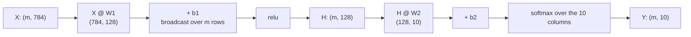

import DataCampExercise from "../../../../components/DataCampExercise.astro";
import Figure from "../../../../components/Figure.astro";
import Quiz from "../../../../components/Quiz.astro";

A perceptron is one line. Stack them with non-linearities between and you get a
multi-layer perceptron, which can represent essentially any continuous function. This
page measures what that buys: the same linear classifier scores **0.6800** on raw
features and **0.9667** on the hidden layer's version of them.

## What you'll learn

- The forward pass as three matrix operations, checked against Keras to $3 \times 10^{-8}$.
- How to count parameters, and why the first layer is usually **98.6%** of them.
- What a hidden layer does, measured: a linear model on learned features goes from
  **0.6800 → 0.9667**.
- The universal approximation theorem at 1, 3, 8 and 40 units — including how bad one
  unit is (**MSE 0.4700**).
- Width against depth at a fixed budget: **4×60 beat 1×128 with 42% fewer parameters**,
  and 8×40 was worse than both.

## The forward pass

An MLP with one hidden layer is three operations:

$$
\mathbf{H} = \phi(\mathbf{X}\mathbf{W}_1 + \mathbf{b}_1),
\qquad
\hat{\mathbf{Y}} = \mathrm{softmax}(\mathbf{H}\mathbf{W}_2 + \mathbf{b}_2)
$$

For a batch of $m$ rows with $n$ features, $h$ hidden units and $k$ classes, the shapes
are forced:

| Tensor | Shape |
| --- | --- |
| $\mathbf{X}$ | $(m, n)$ |
| $\mathbf{W}_1$ | $(n, h)$ |
| $\mathbf{b}_1$ | $(h,)$ — broadcast across all $m$ rows |
| $\mathbf{H}$ | $(m, h)$ |
| $\mathbf{W}_2$ | $(h, k)$ |
| $\hat{\mathbf{Y}}$ | $(m, k)$ |



Written in NumPy and compared against the Keras model holding the same weights:

```python title="forward_by_hand.py" showLineNumbers{1}
hidden = np.maximum(x @ W1 + b1, 0.0)          # relu
logits = hidden @ W2 + b2
shifted = logits - logits.max(axis=1, keepdims=True)
probabilities = np.exp(shifted) / np.exp(shifted).sum(axis=1, keepdims=True)

print(probabilities)                  # [[0.570055 0.429945]]
print(model.predict(x, verbose=0))    # [[0.570055 0.429945]]
```

Maximum difference: $2.98 \times 10^{-8}$ — float32 rounding, nothing more. A `Dense`
layer is a matmul, a broadcast add and an activation.

## Counting parameters

Each layer contributes $(\text{inputs} \times \text{outputs})$ weights plus
$\text{outputs}$ biases:

| Architecture | Weights | Biases | Total |
| --- | --- | --- | --- |
| 784-128-10 | 101,632 | 138 | **101,770** |
| 784-90-90-10 | 79,560 | 190 | 79,750 |
| 784-60-60-60-60-10 | 58,440 | 250 | 58,690 |
| 784-32-10 | 25,408 | 42 | 25,450 |

In 784-128-10, the first layer's $784 \times 128 = 100{,}352$ weights are **98.6% of the
whole model**. Two consequences: the input dimension dominates a small MLP's size, and
adding hidden layers is far cheaper than widening the first one.

## What a hidden layer actually does

The clearest test keeps the classifier fixed and changes only the representation. On the
three-class spiral, with 450 training points:

| Model | Test accuracy |
| --- | --- |
| logistic regression on the raw 2 features | **0.6800** |
| the MLP (32 hidden units, then softmax) | 0.9600 |
| logistic regression on the MLP's 32 hidden units | **0.9667** |

The third row is the point. It is the *same algorithm* as the first row, on the same
labels, and it scores 0.2867 higher — because the hidden layer has re-expressed the two
input coordinates as 32 features in which the classes are close to linearly separable.

**A hidden layer is a learned change of coordinates.** The final layer is still just a
line; the hidden layers move the data until a line is enough. That is exactly what the
[hand-built XOR network](/deep-learning/phase-01---neural-network-foundations/introduction-to-neural-networks-the-perceptron/)
did with OR and NAND, except learned rather than designed.

## The universal approximation theorem, at four widths

The theorem says a network with **one** hidden layer and enough units can approximate any
continuous function on a bounded interval to any accuracy. It does not say how many
units, and it does not say training will find them. Fitting
$y = \sin(2x) + 0.3\sin(6x)$ with one tanh layer:

<Figure
  src="/images/dl/phase-01-foundations/multi-layer-perceptron-mlp/universal-approximation"
  alt="Four panels of the same wavy target curve with a fitted curve overlaid. With 1 hidden unit the fit is a straight sloping line. With 3 units it captures the broad shape but misses the small wiggles. With 8 it is closer. With 40 it tracks the target including the secondary bumps."
  title="One hidden layer, 600 epochs, widths 1 / 3 / 8 / 40"
  caption="One tanh unit can only produce one S-shaped curve, so its best effort is a sloping line at MSE 0.4700. Three units find the primary wave. Forty capture the secondary wiggles at MSE 0.0187 — a 25x improvement for 121 parameters instead of 4."
/>

| Hidden units | Parameters | MSE |
| --- | --- | --- |
| 1 | 4 | **0.469952** |
| 3 | 10 | 0.066197 |
| 8 | 25 | 0.044981 |
| 40 | 121 | **0.018692** |

"Universal" is an existence claim, not a recipe. The gap between 1 and 3 units is a
factor of 7 in MSE; between 8 and 40, a factor of 2.4. Capacity has diminishing returns,
the same shape of curve that
[more training data](/machine-learning/phase-01---the-ml-foundation/what-is-machine-learning/)
produces.

## Width or depth?

If the theorem says one wide layer suffices, why go deep? Four architectures with
comparable parameter budgets, MNIST, 8,000 rows, 6 epochs, three seeds each:

<Figure
  src="/images/dl/phase-01-foundations/multi-layer-perceptron-mlp/width-vs-depth"
  alt="Bar chart of MNIST validation accuracy for four architectures with parameter counts annotated: 1x128 with 101,770 params at 0.9038, 2x90 with 79,750 at 0.9112, 4x60 with 58,690 at 0.9115, and 8x40 with 43,290 at 0.8850."
  title="Similar budgets, spent on width or on depth"
  caption="The two middle configurations win while carrying fewer parameters — 4x60 matches 2x90 using 58,690 against 79,750, and beats the single wide layer's 101,770. At 8 layers of 40 units the accuracy drops to 0.8850: this plain MLP has no normalisation or residual connections, and depth without them stops paying."
/>

| Architecture | Parameters | Accuracy (mean of 3 seeds) |
| --- | --- | --- |
| 1 × 128 | 101,770 | 0.9038 (0.9015–0.9050) |
| 2 × 90 | 79,750 | 0.9112 (0.9045–0.9170) |
| 4 × 60 | 58,690 | **0.9115** (0.9035–0.9205) |
| 8 × 40 | 43,290 | 0.8850 (0.8820–0.8885) |

Read it carefully, because two of the readings cut against the usual slogans.

**Depth is more parameter-efficient than width, up to a point.** 4×60 reached 0.9115
with **42% fewer parameters** than 1×128's 0.9038. Layers compose features; width can
only add more features at the same level of abstraction.

**But "deeper is better" fails at 8 layers here.** 0.8850 is worse than the single wide
layer. Nothing is wrong with the code — a plain MLP with no batch normalisation, no
residual connections and no learning-rate schedule runs into exactly the gradient
problems measured on the
[activations page](/deep-learning/phase-01---neural-network-foundations/activation-functions-relu-sigmoid-softmax/).
Phase 2 is the toolkit that makes depth pay, and this row is the reason it exists.

**The seed spread is not negligible.** 4×60 ranged 0.9035–0.9205 across three seeds — a
0.0170 spread, which is larger than the gap between the top three architectures. Any
comparison of "0.9112 vs 0.9115" without a spread attached is noise reporting.

## The units you are paying for and not using

A ReLU unit whose pre-activation is negative for every input in the dataset outputs zero
always. Its gradient is zero always too, so it can never recover. It is a parameter you
store, multiply and never benefit from — and the count is not negligible:

<Figure
  src="/images/dl/phase-01-foundations/multi-layer-perceptron-mlp/dead-units"
  alt="Left: bars of the share of hidden units that never fire on any test image, rising from 1.6% at one hidden layer to 10.9% at eight. Right: test accuracy against depth, nearly flat between 0.8998 and 0.9075 across all four depths."
  title="MNIST, 8,000 rows, 8 epochs, 3 seeds, 64 units per layer"
  caption="Dead units grow with depth — 1.56% at one layer, 10.87% at eight — while accuracy stays inside 0.0077 across the whole range. The eight-layer network is carrying 512 units of which roughly 56 do nothing at all, for no gain over the one-layer network's 64. This is one concrete reason 'just add layers' stops paying long before the universal approximation theorem runs out of room."
/>

| Hidden layers | Units | Dead share | Worst seed | Test accuracy |
| --- | --- | --- | --- | --- |
| 1 × 64 | 64 | 1.56% | 3.12% | 0.8998 |
| 2 × 64 | 128 | 2.34% | 4.69% | **0.9075** |
| 4 × 64 | 256 | 6.64% | 8.59% | 0.9040 |
| 8 × 64 | 512 | **10.87%** | 12.11% | 0.9047 |

The accuracy column is the control. If depth were buying something, the dead-unit cost
would be a trade; here it is 7× the waste for 0.0049 *less* accuracy than the two-layer
model. Leaky ReLU, a smaller learning rate and better initialisation all reduce the
count — but the first thing to do is measure it, because nothing in the training log
mentions it.

## Building one in Keras

```python title="mlp_keras.py" showLineNumbers{1}
from tensorflow import keras

model = keras.Sequential([
    keras.layers.Input((784,)),
    keras.layers.Dense(128, activation="relu"),
    keras.layers.Dense(64, activation="relu"),
    keras.layers.Dense(10, activation="softmax"),
])
model.compile(optimizer="adam",
              loss="sparse_categorical_crossentropy",
              metrics=["accuracy"])
model.summary()
```

`model.summary()` prints the same arithmetic you did by hand:

| Layer | Output shape | Parameters |
| --- | --- | --- |
| dense | `(None, 128)` | 100,480 |
| dense_1 | `(None, 64)` | 8,256 |
| dense_2 | `(None, 10)` | 650 |
| **total** | | **109,386** |

`None` is the batch axis: pass 7 rows and you get `(7, 10)` out. Use
`sparse_categorical_crossentropy` for integer labels and
`categorical_crossentropy` for one-hot ones — mixing them up is the most common
compile-time error in this phase.

## See it move

```p5 title="A tiny feed-forward network with weighted edges" desc="Watch one forward pass ripple through the network: input signals travel to the hidden layer, ReLU fires, then the result travels on to the output." height="340"
const inputs = [0.8, -0.5, 1.0];
const W1 = [[0.6, -0.3, 0.9], [0.2, 0.7, -0.4], [-0.5, 0.4, 0.3]]; // W1[hidden][input]
const b1 = [0.1, -0.2, 0.05];
const W2 = [0.7, -0.6, 0.5]; // hidden -> output
const b2 = 0.1;
let hidden = [];
let output = 0;
const PERIOD = 130;
function relu(z) { return Math.max(0, z); }
function computeForward() {
  hidden = [];
  for (let j = 0; j < 3; j++) {
    let z = b1[j];
    for (let i = 0; i < 3; i++) z += inputs[i] * W1[j][i];
    hidden.push(relu(z));
  }
  let z2 = b2;
  for (let j = 0; j < 3; j++) z2 += hidden[j] * W2[j];
  output = z2;
}
function setup() {
  createCanvas(600, 340);
  textFont("monospace");
  textAlign(CENTER, CENTER);
  computeForward();
}
function draw() {
  background(13, 17, 23);
  const ix = 90, hx = 300, ox = 500;
  const iy = [80, 170, 260], hy = [80, 170, 260], oy = 170;
  const t = (frameCount % PERIOD) / PERIOD;

  const p1 = constrain(t / 0.4, 0, 1);
  const fire1 = Math.exp(-Math.pow((t - 0.45) * 15, 2));
  const p2 = constrain((t - 0.5) / 0.35, 0, 1);
  const fire2 = Math.exp(-Math.pow((t - 0.92) * 16, 2));

  for (let i = 0; i < 3; i++) {
    for (let j = 0; j < 3; j++) {
      const w = W1[j][i];
      stroke(w >= 0 ? color(120, 200, 120, 180) : color(200, 90, 90, 180));
      strokeWeight(0.5 + Math.abs(w) * 4);
      line(ix + 24, iy[i], hx - 24, hy[j]);
    }
  }
  for (let j = 0; j < 3; j++) {
    const w = W2[j];
    stroke(w >= 0 ? color(120, 200, 120, 180) : color(200, 90, 90, 180));
    strokeWeight(0.5 + Math.abs(w) * 4);
    line(hx + 24, hy[j], ox - 24, oy);
  }

  noStroke();
  if (p1 > 0) {
    for (let i = 0; i < 3; i++) {
      for (let j = 0; j < 3; j++) {
        fill(230, 230, 230, 200);
        ellipse(lerp(ix + 24, hx - 24, p1), lerp(iy[i], hy[j], p1), 6, 6);
      }
    }
  }
  if (p2 > 0) {
    for (let j = 0; j < 3; j++) {
      fill(255, 211, 67, 220);
      ellipse(lerp(hx + 24, ox - 24, p2), lerp(hy[j], oy, p2), 7, 7);
    }
  }

  noStroke();
  for (let i = 0; i < 3; i++) {
    fill(75, 139, 190);
    ellipse(ix, iy[i], 48, 48);
    fill(255);
    textSize(13);
    text(inputs[i].toFixed(1), ix, iy[i]);
  }
  for (let j = 0; j < 3; j++) {
    fill(255, 211 + fire1 * 44, 67 + fire1 * 130);
    ellipse(hx, hy[j], 48 + fire1 * 8, 48 + fire1 * 8);
    fill(20);
    textSize(13);
    text(hidden[j].toFixed(2), hx, hy[j]);
  }
  fill(120 + fire2 * 60, 200 + fire2 * 40, 120 + fire2 * 40);
  ellipse(ox, oy, 54 + fire2 * 10, 54 + fire2 * 10);
  fill(20);
  textSize(14);
  text(output.toFixed(2), ox, oy);
  fill(150);
  textSize(11);
  text("inputs", ix, 306);
  text("hidden (ReLU)", hx, 306);
  text("output", ox, 306);
  fill(107, 169, 221);
  textSize(12);
  text("edge thickness = |weight|; green = positive, red = negative", width / 2, 20);
}
```

The second sketch is the parameter budget. Move the sliders and watch where the
parameters actually go — the first layer's bar dwarfs everything else until the input
dimension shrinks.

```p5 title="Where the parameters go" desc="Adjust the input dimension, hidden width and number of hidden layers, and see the parameter count per layer. The first layer dominates whenever the input is high-dimensional." height="420"
let inputDim = 784;
let width = 128;
let depth = 2;
let drag = -1;

function setup() {
  createCanvas(620, 420);
  textFont("monospace");
}
function layerSizes() {
  const sizes = [inputDim];
  for (let i = 0; i < depth; i++) sizes.push(width);
  sizes.push(10);
  return sizes;
}
function draw() {
  background(13, 17, 23);
  const sizes = layerSizes();
  const counts = [];
  for (let i = 0; i < sizes.length - 1; i++) {
    counts.push(sizes[i] * sizes[i + 1] + sizes[i + 1]);
  }
  const total = counts.reduce((a, b) => a + b, 0);

  fill(215);
  textSize(12);
  textAlign(LEFT, TOP);
  text("architecture: " + sizes.join(" - "), 24, 16);
  fill(255, 176, 67);
  textSize(15);
  text("total parameters: " + total.toLocaleString(), 24, 36);

  const sliders = [
    ["input dimension", inputDim, 8, 3072],
    ["hidden width", width, 4, 512],
    ["hidden layers", depth, 1, 8],
  ];
  for (let i = 0; i < sliders.length; i++) {
    const [label, value, lo, hi] = sliders[i];
    const y = 76 + i * 40;
    fill(150);
    textSize(11);
    textAlign(LEFT, TOP);
    text(label, 24, y);
    fill(235);
    textAlign(RIGHT, TOP);
    text(value, 250, y);
    noStroke();
    fill(30, 36, 44);
    rect(24, y + 18, 226, 7, 4);
    fill(75, 139, 190);
    rect(24, y + 18, ((value - lo) / (hi - lo)) * 226, 7, 4);
    fill(235);
    ellipse(24 + ((value - lo) / (hi - lo)) * 226, y + 21, 13, 13);
  }

  const barX = 300, barW = 290;
  const peak = Math.max(...counts);
  fill(150);
  textSize(11);
  textAlign(LEFT, TOP);
  text("parameters per layer", barX, 76);
  for (let i = 0; i < counts.length; i++) {
    const y = 100 + i * 30;
    const w = (counts[i] / peak) * barW;
    noStroke();
    fill(i === 0 ? color(255, 176, 67) : color(75, 139, 190));
    rect(barX, y, w, 18, 2);
    fill(225);
    textSize(9);
    textAlign(LEFT, CENTER);
    const share = ((counts[i] / total) * 100).toFixed(1);
    text(`${sizes[i]}->${sizes[i + 1]}  ${counts[i].toLocaleString()} (${share}%)`,
         barX + 4, y + 9);
  }

  fill(105);
  textSize(10);
  textAlign(LEFT, TOP);
  const firstShare = ((counts[0] / total) * 100).toFixed(1);
  text("the first layer holds " + firstShare + "% of the parameters", 24, 214);
  text("drag the input dimension down and watch that share collapse:", 24, 236);
  text("a high-dimensional input is what makes layer 1 expensive", 24, 252);
  text("adding a hidden layer costs width*width + width — cheap by comparison", 24, 274);
  text("drag a slider to change the architecture", 24, 300);
}
function mousePressed() {
  for (let i = 0; i < 3; i++) {
    const y = 76 + i * 40 + 21;
    if (mouseX > 16 && mouseX < 258 && Math.abs(mouseY - y) < 14) drag = i;
  }
}
function mouseDragged() {
  if (drag < 0) return;
  const u = constrain((mouseX - 24) / 226, 0, 1);
  if (drag === 0) inputDim = Math.round(8 + u * 3064);
  if (drag === 1) width = Math.round(4 + u * 508);
  if (drag === 2) depth = Math.round(1 + u * 7);
}
function mouseReleased() { drag = -1; }
```

## Pitfalls

**Reading the universal approximation theorem as a recipe.** It guarantees a width
exists; it says nothing about how large, and nothing about whether gradient descent will
find those weights. One unit's best fit here was a sloping line at MSE 0.4700.

**Assuming deeper is always better.** 8×40 scored 0.8850 against 4×60's 0.9115 on the
same data. Plain MLPs stop benefiting from depth without the Phase 2 toolkit.

**Comparing architectures on one seed.** The 4×60 spread was 0.9035–0.9205. Differences
smaller than that spread are not results.

**Widening the first layer to add capacity.** On a 784-input model, the first layer is
already 98.6% of the parameters. An extra hidden layer is far cheaper than doubling that
one.

**Mismatching the loss to the label format.** Integer labels need
`sparse_categorical_crossentropy`; one-hot labels need `categorical_crossentropy`. The
error message points at shapes, not at the loss.

**Forgetting the activation between Dense layers.** Two `Dense` layers with
`activation=None` collapse into one, exactly as measured on the activations page — the
parameters stay, the capacity does not.

## Recap

- The forward pass is matmul, broadcast add, activation — verified against Keras to
  $2.98 \times 10^{-8}$.
- Parameters are $\text{inputs} \times \text{outputs} + \text{outputs}$ per layer, and
  the first layer is **98.6%** of a 784-128-10 model.
- A hidden layer is a learned change of coordinates: the same logistic regression scored
  **0.6800** on raw features and **0.9667** on the MLP's 32 hidden units.
- One hidden layer can approximate anything in principle; in practice 1 unit gave
  MSE 0.4700 and 40 units gave 0.0187 on the same curve.
- At matched budgets, **4×60 (0.9115, 58,690 params) beat 1×128 (0.9038, 101,770)** —
  depth is more parameter-efficient — but **8×40 fell to 0.8850**, which is what Phase 2
  exists to fix.
- Seed spread on this task was up to 0.0170, larger than the gaps between the top three
  architectures.

<Quiz
  questions={[
    {
      q: "A logistic regression scores 0.6800 on the spiral's two raw features and 0.9667 on the 32 hidden activations of a trained MLP. What does that demonstrate?",
      options: [
        "That logistic regression is a better classifier than an MLP",
        "That the hidden layer's job is representation: it re-expresses the inputs in coordinates where a linear boundary is nearly sufficient — the classifier and the labels never changed",
        "That 32 features are always better than 2",
        "That the MLP overfitted",
      ],
      answer: 1,
      explain: "The final layer of an MLP is still a linear model. Everything before it exists to move the data until a line is enough, which is exactly what the hand-built XOR network did with OR and NAND.",
    },
    {
      q: "The universal approximation theorem says one hidden layer suffices. Why use more?",
      options: [
        "The theorem is wrong",
        "It is an existence result with no bound on width and no guarantee that training finds the weights; measured here, 4x60 beat 1x128 while using 42% fewer parameters",
        "Deeper networks always generalise better",
        "One layer cannot represent non-linear functions",
      ],
      answer: 1,
      explain: "Depth composes features, so it often reaches the same accuracy with fewer parameters. But it is not unconditional: 8x40 scored 0.8850 against 4x60's 0.9115 on the same data.",
    },
    {
      q: "In a 784-128-10 network, how much of the model is the first layer?",
      options: [
        "About a third",
        "98.6% — its 784 x 128 = 100,352 weights out of 101,770 parameters total, because the input dimension multiplies the first weight matrix",
        "Half",
        "It depends on the activation",
      ],
      answer: 1,
      explain: "This is why an extra hidden layer (width x width + width) is cheap while widening the first layer is expensive, and why convolutional layers exist for images.",
    },
    {
      q: "You compare two architectures across 3 seeds: 0.9112 and 0.9115, with individual runs ranging 0.9045-0.9205. What can you conclude?",
      options: [
        "The second architecture is better",
        "Nothing — the 0.0003 gap is far smaller than the 0.0170 seed spread, so the comparison needs more seeds or more data before it says anything",
        "Both are overfitting",
        "The difference is significant because the means differ",
      ],
      answer: 1,
      explain: "Reporting a mean without a spread is how architecture folklore gets created. Deep-learning results are draws from a distribution, and the spread here is larger than the effect.",
    },
    {
      q: "You build Sequential([Dense(64), Dense(64), Dense(10, activation='softmax')]) with no activation on the hidden layers. What have you built?",
      options: [
        "A three-layer MLP",
        "Effectively a single linear layer feeding a softmax — the two hidden weight matrices multiply into one, so the parameters remain but the capacity does not",
        "A network that trains faster",
        "An invalid model that will raise an error",
      ],
      answer: 1,
      explain: "The collapse is measured on the activations page: two linear layers agree with one equivalent layer to 8.88e-16. The model runs, trains and quietly underperforms.",
    },
  ]}
/>

## Next

You know what layers buy and what they cost. Continue to
**Activation Functions (ReLU, Sigmoid, Softmax)** for the non-linearity that makes the
stack more than one layer — then to
[Autograd from Scratch](/deep-learning/phase-01---neural-network-foundations/autograd-from-scratch/)
to build the gradient machinery these layers are trained with.

## 🧪 Try It Yourself

### Exercise 1 – Count the parameters

<DataCampExercise
  lang="python"
  hint={`Each layer contributes inputs * outputs weights plus outputs biases.`}
  code={`# Task: Exercise 1 - Count the parameters
def count(layers):
    total = 0
    for inputs, outputs in zip(layers, layers[1:]):
        total += inputs * outputs + ___          # replace ___ with outputs
    return total


ARCHITECTURES = [("784-128-10", [784, 128, 10]), ("784-90-90-10", [784, 90, 90, 10]),
                 ("784-60-60-60-60-10", [784, 60, 60, 60, 60, 10]),
                 ("784-32-10", [784, 32, 10])]
for name, layers in ARCHITECTURES:
    weights = sum(a * b for a, b in zip(layers, layers[1:]))
    biases = sum(layers[1:])
    print(f"{name:20s} weights {weights:7,d} + biases {biases:4,d} = {count(layers):7,d}")
print(f"the first layer of 784-128-10 alone is {784 * 128:,} of its "
      f"{count([784, 128, 10]):,} parameters")

# -- Expected Output -------------------------------------------
# 784-128-10           weights 101,632 + biases  138 = 101,770
# 784-90-90-10         weights  79,560 + biases  190 =  79,750
# 784-60-60-60-60-10   weights  58,440 + biases  250 =  58,690
# 784-32-10            weights  25,408 + biases   42 =  25,450
# the first layer of 784-128-10 alone is 100,352 of its 101,770 parameters
# --------------------------------------------------------------`}
  solution={`def count(layers):
    total = 0
    for inputs, outputs in zip(layers, layers[1:]):
        total += inputs * outputs + outputs
    return total


ARCHITECTURES = [("784-128-10", [784, 128, 10]), ("784-90-90-10", [784, 90, 90, 10]),
                 ("784-60-60-60-60-10", [784, 60, 60, 60, 60, 10]),
                 ("784-32-10", [784, 32, 10])]
for name, layers in ARCHITECTURES:
    weights = sum(a * b for a, b in zip(layers, layers[1:]))
    biases = sum(layers[1:])
    print(f"{name:20s} weights {weights:7,d} + biases {biases:4,d} = {count(layers):7,d}")
print(f"the first layer of 784-128-10 alone is {784 * 128:,} of its "
      f"{count([784, 128, 10]):,} parameters")`}
  sct={`test_output_contains("101,770")
success_msg("The four-hidden-layer network is the smallest of the four. Depth is cheap; a wide first layer on a 784-dimensional input is not.")`}
  height={300}
/>

### Exercise 2 – Run the forward pass yourself

<DataCampExercise
  lang="python"
  hint={`Hidden is relu(x @ W1 + b1); the output is a stable softmax of hidden @ W2 + b2.`}
  code={`# Task: Exercise 2 - Run the forward pass yourself
import numpy as np
import tensorflow as tf

tf.keras.utils.set_random_seed(0)
model = tf.keras.Sequential([
    tf.keras.layers.Input((4,)),
    tf.keras.layers.Dense(3, activation="relu"),
    tf.keras.layers.Dense(2, activation="softmax"),
])
W1, b1 = [w.numpy() for w in model.layers[0].weights]
W2, b2 = [w.numpy() for w in model.layers[1].weights]
x = np.array([[1.0, 0.5, -0.5, 2.0]], dtype="float32")

hidden = np.maximum(x @ W1 + b1, ___)              # replace ___ with 0.0
logits = hidden @ W2 + b2
shifted = logits - logits.max(axis=1, keepdims=True)
probabilities = np.exp(shifted) / np.exp(shifted).sum(axis=1, keepdims=True)
keras_out = model.predict(x, verbose=0)

print("shapes:", x.shape, "->", hidden.shape, "->", probabilities.shape)
print("numpy :", probabilities.round(6))
print("keras :", keras_out.round(6))
print("max difference:", f"{np.abs(probabilities - keras_out).max():.2e}")
print("agree:", bool(np.allclose(probabilities, keras_out, atol=1e-6)))

# -- Expected Output -------------------------------------------
# shapes: (1, 4) -> (1, 3) -> (1, 2)
# numpy : [[0.570055 0.429945]]
# keras : [[0.570055 0.429945]]
# max difference: 2.98e-08
# agree: True
# --------------------------------------------------------------`}
  solution={`import numpy as np
import tensorflow as tf

tf.keras.utils.set_random_seed(0)
model = tf.keras.Sequential([
    tf.keras.layers.Input((4,)),
    tf.keras.layers.Dense(3, activation="relu"),
    tf.keras.layers.Dense(2, activation="softmax"),
])
W1, b1 = [w.numpy() for w in model.layers[0].weights]
W2, b2 = [w.numpy() for w in model.layers[1].weights]
x = np.array([[1.0, 0.5, -0.5, 2.0]], dtype="float32")

hidden = np.maximum(x @ W1 + b1, 0.0)
logits = hidden @ W2 + b2
shifted = logits - logits.max(axis=1, keepdims=True)
probabilities = np.exp(shifted) / np.exp(shifted).sum(axis=1, keepdims=True)
keras_out = model.predict(x, verbose=0)

print("shapes:", x.shape, "->", hidden.shape, "->", probabilities.shape)
print("numpy :", probabilities.round(6))
print("keras :", keras_out.round(6))
print("max difference:", f"{np.abs(probabilities - keras_out).max():.2e}")
print("agree:", bool(np.allclose(probabilities, keras_out, atol=1e-6)))`}
  sct={`test_output_contains("agree: True")
success_msg("Three lines of NumPy reproduce a Keras model to float32 rounding. A Dense layer really is a matmul, a broadcast add and an activation.")`}
  height={360}
/>

### Exercise 3 – Match a parameter budget

<DataCampExercise
  lang="python"
  hint={`Search widths and keep the one whose total parameter count is closest to the target.`}
  code={`# Task: Exercise 3 - Match a parameter budget
def count(layers):
    total = 0
    for inputs, outputs in zip(layers, layers[1:]):
        total += inputs * outputs + outputs
    return total


target = count([784, 90, 90, 10])
print(f"a 784-90-90-10 network has {target:,} parameters")
best = None
for width in range(1, 400):
    total = count([784, width, 10])
    if best is None or abs(total - target) < abs(best[1] - ___):     # replace ___ with target
        best = (width, total)
print(f"the single-hidden-layer network closest to that budget is "
      f"784-{best[0]}-10 with {best[1]:,}")
print(f"difference: {abs(best[1] - target):,} parameters "
      f"({abs(best[1] - target) / target * 100:.2f}%)")

# -- Expected Output -------------------------------------------
# a 784-90-90-10 network has 79,750 parameters
# the single-hidden-layer network closest to that budget is 784-100-10 with 79,510
# difference: 240 parameters (0.30%)
# --------------------------------------------------------------`}
  solution={`def count(layers):
    total = 0
    for inputs, outputs in zip(layers, layers[1:]):
        total += inputs * outputs + outputs
    return total


target = count([784, 90, 90, 10])
print(f"a 784-90-90-10 network has {target:,} parameters")
best = None
for width in range(1, 400):
    total = count([784, width, 10])
    if best is None or abs(total - target) < abs(best[1] - target):
        best = (width, total)
print(f"the single-hidden-layer network closest to that budget is "
      f"784-{best[0]}-10 with {best[1]:,}")
print(f"difference: {abs(best[1] - target):,} parameters "
      f"({abs(best[1] - target) / target * 100:.2f}%)")`}
  sct={`test_output_contains("784-100-10")
success_msg("100 units in one layer costs the same as 90 + 90 in two. That is the fair comparison the width-versus-depth figure makes — and the two-layer version won it.")`}
  height={300}
/>

### Exercise 4 – One unit cannot fit a wave

<DataCampExercise
  lang="python"
  hint={`A single tanh unit can only produce one scaled, shifted S-curve, whatever the training budget.`}
  code={`# Task: Exercise 4 - One unit cannot fit a wave
import numpy as np
import tensorflow as tf

x_curve = np.linspace(-3, 3, 400).astype("float32")
y_curve = np.sin(2.0 * x_curve) + 0.3 * np.sin(6.0 * x_curve)
for width in (1, 6):
    tf.keras.utils.set_random_seed(0)
    net = tf.keras.Sequential([tf.keras.layers.Input((1,)),
                               tf.keras.layers.Dense(width, activation="___"),
                               tf.keras.layers.Dense(1)])     # replace ___ with tanh
    net.compile(tf.keras.optimizers.Adam(0.01), "mse")
    net.fit(x_curve, y_curve, epochs=200, batch_size=64, verbose=0)
    mse = float(np.mean((net.predict(x_curve, verbose=0).ravel() - y_curve) ** 2))
    print(f"width {width:2d}  params {net.count_params():4d}  MSE {mse:.6f}")
print("one tanh unit can only produce one S-shaped curve, whatever the training budget")

# -- Expected Output -------------------------------------------
# width  1  params    4  MSE 0.470475
# width  6  params   19  MSE 0.066634
# one tanh unit can only produce one S-shaped curve, whatever the training budget
# --------------------------------------------------------------`}
  solution={`import numpy as np
import tensorflow as tf

x_curve = np.linspace(-3, 3, 400).astype("float32")
y_curve = np.sin(2.0 * x_curve) + 0.3 * np.sin(6.0 * x_curve)
for width in (1, 6):
    tf.keras.utils.set_random_seed(0)
    net = tf.keras.Sequential([tf.keras.layers.Input((1,)),
                               tf.keras.layers.Dense(width, activation="tanh"),
                               tf.keras.layers.Dense(1)])
    net.compile(tf.keras.optimizers.Adam(0.01), "mse")
    net.fit(x_curve, y_curve, epochs=200, batch_size=64, verbose=0)
    mse = float(np.mean((net.predict(x_curve, verbose=0).ravel() - y_curve) ** 2))
    print(f"width {width:2d}  params {net.count_params():4d}  MSE {mse:.6f}")
print("one tanh unit can only produce one S-shaped curve, whatever the training budget")`}
  sct={`test_output_contains("width  6")
success_msg("Fifteen extra parameters cut the error by a factor of seven. The universal approximation theorem promises this is possible; it never promised it would be cheap.")`}
  height={300}
/>

### Exercise 5 – Measure what the hidden layer buys

<DataCampExercise
  lang="python"
  hint={`Build a Model from the network's input to its first layer's output, then fit a plain logistic regression on those activations.`}
  code={`# Task: Exercise 5 - Measure what the hidden layer buys
import numpy as np
import tensorflow as tf
from sklearn.linear_model import LogisticRegression


def spiral(n_per_class=200, classes=3, noise=0.25, seed=0):
    rng = np.random.default_rng(seed)
    xs, ys = [], []
    for label in range(classes):
        radius = np.linspace(0.05, 1.0, n_per_class)
        theta = (np.linspace(label * 2 * np.pi / classes,
                             label * 2 * np.pi / classes + 3.2, n_per_class)
                 + rng.normal(0, noise, n_per_class))
        xs.append(np.c_[radius * np.sin(theta), radius * np.cos(theta)])
        ys.append(np.full(n_per_class, label))
    return np.concatenate(xs).astype("float32"), np.concatenate(ys).astype("int64")


X, y = spiral()
order = np.random.default_rng(1).permutation(len(X))
Xtr, ytr = X[order[:450]], y[order[:450]]
Xte, yte = X[order[450:]], y[order[450:]]

raw = LogisticRegression(max_iter=2000).fit(Xtr, ytr)
print(f"logistic regression on the raw 2 features : {raw.score(Xte, yte):.4f}")

tf.keras.utils.set_random_seed(0)
net = tf.keras.Sequential([tf.keras.layers.Input((2,)),
                           tf.keras.layers.Dense(32, activation="relu"),
                           tf.keras.layers.Dense(3, activation="softmax")])
net.compile("adam", "sparse_categorical_crossentropy", metrics=["accuracy"])
net.fit(Xtr, ytr, epochs=200, batch_size=32, verbose=0)
print(f"the MLP itself                            : "
      f"{net.evaluate(Xte, yte, verbose=0)[1]:.4f}")

extractor = tf.keras.Model(net.inputs, net.layers[0].___)      # replace ___ with output
Htr, Hte = extractor.predict(Xtr, verbose=0), extractor.predict(Xte, verbose=0)
learned = LogisticRegression(max_iter=2000).fit(Htr, ytr)
print(f"logistic regression on the 32 hidden units: {learned.score(Hte, yte):.4f}")
print("same classifier, same labels — only the representation changed")

# -- Expected Output -------------------------------------------
# logistic regression on the raw 2 features : 0.6800
# the MLP itself                            : 0.9600
# logistic regression on the 32 hidden units: 0.9667
# same classifier, same labels — only the representation changed
# --------------------------------------------------------------`}
  solution={`import numpy as np
import tensorflow as tf
from sklearn.linear_model import LogisticRegression


def spiral(n_per_class=200, classes=3, noise=0.25, seed=0):
    rng = np.random.default_rng(seed)
    xs, ys = [], []
    for label in range(classes):
        radius = np.linspace(0.05, 1.0, n_per_class)
        theta = (np.linspace(label * 2 * np.pi / classes,
                             label * 2 * np.pi / classes + 3.2, n_per_class)
                 + rng.normal(0, noise, n_per_class))
        xs.append(np.c_[radius * np.sin(theta), radius * np.cos(theta)])
        ys.append(np.full(n_per_class, label))
    return np.concatenate(xs).astype("float32"), np.concatenate(ys).astype("int64")


X, y = spiral()
order = np.random.default_rng(1).permutation(len(X))
Xtr, ytr = X[order[:450]], y[order[:450]]
Xte, yte = X[order[450:]], y[order[450:]]

raw = LogisticRegression(max_iter=2000).fit(Xtr, ytr)
print(f"logistic regression on the raw 2 features : {raw.score(Xte, yte):.4f}")

tf.keras.utils.set_random_seed(0)
net = tf.keras.Sequential([tf.keras.layers.Input((2,)),
                           tf.keras.layers.Dense(32, activation="relu"),
                           tf.keras.layers.Dense(3, activation="softmax")])
net.compile("adam", "sparse_categorical_crossentropy", metrics=["accuracy"])
net.fit(Xtr, ytr, epochs=200, batch_size=32, verbose=0)
print(f"the MLP itself                            : "
      f"{net.evaluate(Xte, yte, verbose=0)[1]:.4f}")

extractor = tf.keras.Model(net.inputs, net.layers[0].output)
Htr, Hte = extractor.predict(Xtr, verbose=0), extractor.predict(Xte, verbose=0)
learned = LogisticRegression(max_iter=2000).fit(Htr, ytr)
print(f"logistic regression on the 32 hidden units: {learned.score(Hte, yte):.4f}")
print("same classifier, same labels — only the representation changed")`}
  sct={`test_output_contains("0.9667")
success_msg("0.6800 to 0.9667 with the same classifier. This is the single most useful thing to understand about hidden layers: they are not extra classifiers, they are a change of coordinates.")`}
  height={440}
/>

### Exercise 6 – Trace the shapes

<DataCampExercise
  lang="python"
  hint={`layer.output.shape shows the output shape including the batch axis; layer.count_params() gives its parameter count.`}
  code={`# Task: Exercise 6 - Trace the shapes
import numpy as np
import tensorflow as tf

net = tf.keras.Sequential([
    tf.keras.layers.Input((784,)),
    tf.keras.layers.Dense(128, activation="relu"),
    tf.keras.layers.Dense(64, activation="relu"),
    tf.keras.layers.Dense(10, activation="softmax"),
])
print(f"{'layer':>12} {'output shape':>18} {'params':>9}")
for layer in net.layers:
    print(f"{layer.name[:12]:>12} {str(layer.output.shape):>18} "
          f"{layer.___():9,d}")                     # replace ___ with count_params
print(f"{'TOTAL':>12} {'':>18} {net.count_params():9,d}")
batch = np.zeros((7, 784), dtype="float32")
print(f"a batch of 7 in -> {net.predict(batch, verbose=0).shape} out")
print("None in the shapes is the batch axis: the model accepts any batch size")

# -- Expected Output -------------------------------------------
#        layer       output shape    params
#        dense        (None, 128)   100,480
#      dense_1         (None, 64)     8,256
#      dense_2         (None, 10)       650
#        TOTAL                      109,386
# a batch of 7 in -> (7, 10) out
# None in the shapes is the batch axis: the model accepts any batch size
# --------------------------------------------------------------`}
  solution={`import numpy as np
import tensorflow as tf

net = tf.keras.Sequential([
    tf.keras.layers.Input((784,)),
    tf.keras.layers.Dense(128, activation="relu"),
    tf.keras.layers.Dense(64, activation="relu"),
    tf.keras.layers.Dense(10, activation="softmax"),
])
print(f"{'layer':>12} {'output shape':>18} {'params':>9}")
for layer in net.layers:
    print(f"{layer.name[:12]:>12} {str(layer.output.shape):>18} "
          f"{layer.count_params():9,d}")
print(f"{'TOTAL':>12} {'':>18} {net.count_params():9,d}")
batch = np.zeros((7, 784), dtype="float32")
print(f"a batch of 7 in -> {net.predict(batch, verbose=0).shape} out")
print("None in the shapes is the batch axis: the model accepts any batch size")`}
  sct={`test_output_contains("109,386")
success_msg("100,480 of 109,386 parameters are in the first layer — 91.9% here. Note the layer names restart at 'dense' only in a fresh process; Keras numbers them per session.")`}
  height={320}
/>
