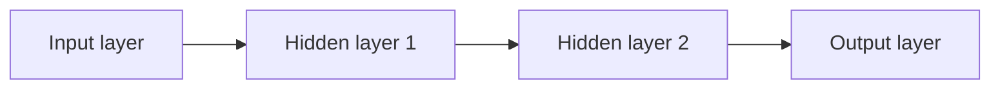

A single perceptron can only draw a straight line through your data — it can't even
solve the classic XOR problem. It turns out the fix is almost embarrassingly simple:
stack more than one layer of neurons. That's a **Multi-Layer Perceptron**, and it's
the ancestor of every deep network you'll meet later in this module.

## What an MLP is

An MLP is composed of one (passthrough) **input layer**, one or more **hidden
layers** of TLUs, and a final **output layer**. Every layer except the output layer
is fully connected to the next — every neuron in the previous layer feeds every
neuron in the next one. This is a **fully connected (dense) layer**. Because signal
only flows forward, from inputs to outputs, this is called a **feedforward neural
network (FNN)**. Stack enough hidden layers and you get a **deep neural network
(DNN)** — the "deep" in Deep Learning.

An MLP is a feed-forward neural network with:

- an input layer
- one or more hidden layers
- an output layer



## Why hidden layers matter

Hidden layers + non-linear activations allow the model to learn:

- curves
- interactions
- complex decision boundaries

## Typical uses

MLP works best on:

- tabular data (sometimes)
- small image/text tasks (but CNNs/Transformers are usually better)

## How training works (a preview)

For decades, nobody could figure out how to train an MLP. The breakthrough — still
used today — is **backpropagation** (Phase 2 covers it in depth):

1. **Forward pass**: feed a batch of data through the network, layer by layer, and
   keep every intermediate result.
2. **Measure the loss**: compare the network's output to the target with a loss
   function.
3. **Backward pass**: apply the chain rule, working backward from the output layer
   to the input layer, to work out how much each weight contributed to the error.
4. **Gradient Descent step**: nudge every weight a little in the direction that
   reduces the error, and repeat.

Two details make this actually work:

- Weights must be **initialized randomly**, not to zero — otherwise every neuron in a
  layer stays identical forever, and the layer behaves like it has just one neuron.
- Hidden layers need a **non-linear activation** (Phase 1's next page). The
  step function used by the original perceptron has zero gradient almost everywhere,
  so the authors of backpropagation swapped it for the smooth **logistic (sigmoid)**
  function instead.

## Building MLPs with tf.keras's Sequential API

Here's a classification MLP with two hidden layers, trained on Fashion MNIST (Keras's
drop-in replacement for MNIST) — straight out of the book:

```python title="A classification MLP with the Sequential API" showLineNumbers{1}
from tensorflow import keras

fashion_mnist = keras.datasets.fashion_mnist
(X_train_full, y_train_full), (X_test, y_test) = fashion_mnist.load_data()

# Pixels arrive as 0-255 integers; scale to 0-1 floats and hold out a
# small validation set from the training data.
X_valid, X_train = X_train_full[:5000] / 255.0, X_train_full[5000:] / 255.0
y_valid, y_train = y_train_full[:5000], y_train_full[5000:]

model = keras.Sequential([
    keras.layers.Flatten(input_shape=[28, 28]),   # 28x28 image -> 784-long vector
    keras.layers.Dense(300, activation="relu"),   # hidden layer 1
    keras.layers.Dense(100, activation="relu"),   # hidden layer 2
    keras.layers.Dense(10, activation="softmax"), # 10 output classes
])

model.compile(loss="sparse_categorical_crossentropy",
              optimizer="sgd",
              metrics=["accuracy"])

history = model.fit(X_train, y_train, epochs=10,
                     validation_data=(X_valid, y_valid))

model.evaluate(X_test, y_test)
```

Regression MLPs look almost identical — the output layer just has a single neuron
and **no activation**, so it's free to predict any real value:

```python title="A regression MLP" showLineNumbers{1}
from tensorflow import keras
from sklearn.datasets import fetch_california_housing
from sklearn.model_selection import train_test_split
from sklearn.preprocessing import StandardScaler

housing = fetch_california_housing()
X_train_full, X_test, y_train_full, y_test = train_test_split(housing.data, housing.target)
X_train, X_valid, y_train, y_valid = train_test_split(X_train_full, y_train_full)

scaler = StandardScaler()
X_train = scaler.fit_transform(X_train)
X_valid = scaler.transform(X_valid)
X_test = scaler.transform(X_test)

model = keras.Sequential([
    keras.layers.Dense(30, activation="relu", input_shape=X_train.shape[1:]),
    keras.layers.Dense(1),   # no activation: any real-valued prediction is allowed
])
model.compile(loss="mean_squared_error", optimizer="sgd")

history = model.fit(X_train, y_train, epochs=20, validation_data=(X_valid, y_valid))
mse_test = model.evaluate(X_test, y_test)
```

:::tip[From the book]
`model.summary()` shows every layer's name, output shape, and parameter count. Don't
be surprised by the numbers: a `Dense(300)` layer fed by 784 inputs already has
784 × 300 + 300 = 235,500 parameters — it's easy for an MLP to have millions of
weights, which is exactly why regularization and early stopping (Phase 2) matter.
:::

:::tip[From the book]
Chollet builds a `Dense` layer completely from scratch to prove there's no magic
inside it: a `NaiveDense` class just holds two `tf.Variable` tensors (`W` and `b`)
and applies `activation(tf.matmul(inputs, W) + b)` in a `__call__()` method. A
`NaiveSequential` wrapper is then nothing more than code that calls each layer on the
previous one's output, in order. Every MLP you build with `keras.Sequential` does
exactly this, just with a lot more engineering underneath.
:::

## Mini-checkpoint

If you remove non-linear activations from all hidden layers, what happens?

- The whole network behaves like a linear model.

## Visualize it

An MLP stacks layers of neurons, each fully connected to the next.

```mermaid title="MLP network topology" desc="An input layer of three nodes connects densely to a hidden layer of four nodes, which connects densely to a single output node."
flowchart LR
  subgraph Input
    i1((i1))
    i2((i2))
    i3((i3))
  end
  subgraph Hidden
    h1((h1))
    h2((h2))
    h3((h3))
    h4((h4))
  end
  subgraph Output
    o1((o1))
  end
  i1 --> h1
  i1 --> h2
  i1 --> h3
  i1 --> h4
  i2 --> h1
  i2 --> h2
  i2 --> h3
  i2 --> h4
  i3 --> h1
  i3 --> h2
  i3 --> h3
  i3 --> h4
  h1 --> o1
  h2 --> o1
  h3 --> o1
  h4 --> o1
```

Here's the same idea with real numbers flowing through it: three inputs feed a hidden
layer of three ReLU neurons, which feed a single output neuron. Edge thickness shows
the size of the weight; green means positive, red means negative:

```p5 title="A tiny feed-forward network with weighted edges" desc="Watch one forward pass ripple through the network: input signals travel to the hidden layer, ReLU fires, then the result travels on to the output." height="340"
const inputs = [0.8, -0.5, 1.0];
const W1 = [[0.6, -0.3, 0.9], [0.2, 0.7, -0.4], [-0.5, 0.4, 0.3]]; // W1[hidden][input]
const b1 = [0.1, -0.2, 0.05];
const W2 = [0.7, -0.6, 0.5]; // hidden -> output
const b2 = 0.1;
let hidden = [];
let output = 0;
const PERIOD = 130;
function relu(z) { return Math.max(0, z); }
function computeForward() {
  hidden = [];
  for (let j = 0; j < 3; j++) {
    let z = b1[j];
    for (let i = 0; i < 3; i++) z += inputs[i] * W1[j][i];
    hidden.push(relu(z));
  }
  let z2 = b2;
  for (let j = 0; j < 3; j++) z2 += hidden[j] * W2[j];
  output = z2;
}
function setup() {
  createCanvas(600, 340);
  textFont("monospace");
  textAlign(CENTER, CENTER);
  computeForward();
}
function draw() {
  background(13, 17, 23);
  const ix = 90, hx = 300, ox = 500;
  const iy = [80, 170, 260], hy = [80, 170, 260], oy = 170;
  const t = (frameCount % PERIOD) / PERIOD;

  // Stage 1 (0 - 0.4): signal travels input -> hidden.
  const p1 = constrain(t / 0.4, 0, 1);
  // Stage 2 (~0.45): hidden layer fires (ReLU activates).
  const fire1 = Math.exp(-Math.pow((t - 0.45) * 15, 2));
  // Stage 3 (0.5 - 0.85): signal travels hidden -> output.
  const p2 = constrain((t - 0.5) / 0.35, 0, 1);
  // Stage 4 (~0.9): output lights up.
  const fire2 = Math.exp(-Math.pow((t - 0.92) * 16, 2));

  for (let i = 0; i < 3; i++) {
    for (let j = 0; j < 3; j++) {
      const w = W1[j][i];
      stroke(w >= 0 ? color(120, 200, 120, 180) : color(200, 90, 90, 180));
      strokeWeight(0.5 + Math.abs(w) * 4);
      line(ix + 24, iy[i], hx - 24, hy[j]);
    }
  }
  for (let j = 0; j < 3; j++) {
    const w = W2[j];
    stroke(w >= 0 ? color(120, 200, 120, 180) : color(200, 90, 90, 180));
    strokeWeight(0.5 + Math.abs(w) * 4);
    line(hx + 24, hy[j], ox - 24, oy);
  }

  // traveling pulses: one per input->hidden edge, then one per hidden->output edge
  noStroke();
  if (p1 > 0) {
    for (let i = 0; i < 3; i++) {
      for (let j = 0; j < 3; j++) {
        fill(230, 230, 230, 200);
        ellipse(lerp(ix + 24, hx - 24, p1), lerp(iy[i], hy[j], p1), 6, 6);
      }
    }
  }
  if (p2 > 0) {
    for (let j = 0; j < 3; j++) {
      fill(255, 211, 67, 220);
      ellipse(lerp(hx + 24, ox - 24, p2), lerp(hy[j], oy, p2), 7, 7);
    }
  }

  noStroke();
  for (let i = 0; i < 3; i++) {
    fill(75, 139, 190);
    ellipse(ix, iy[i], 48, 48);
    fill(255);
    textSize(13);
    text(inputs[i].toFixed(1), ix, iy[i]);
  }
  for (let j = 0; j < 3; j++) {
    // hidden neurons brighten together when the layer "fires"
    fill(255, 211 + fire1 * 44, 67 + fire1 * 130);
    ellipse(hx, hy[j], 48 + fire1 * 8, 48 + fire1 * 8);
    fill(20);
    textSize(13);
    text(hidden[j].toFixed(2), hx, hy[j]);
  }
  fill(120 + fire2 * 60, 200 + fire2 * 40, 120 + fire2 * 40);
  ellipse(ox, oy, 54 + fire2 * 10, 54 + fire2 * 10);
  fill(20);
  textSize(14);
  text(output.toFixed(2), ox, oy);
  fill(150);
  textSize(11);
  text("inputs", ix, 306);
  text("hidden (ReLU)", hx, 306);
  text("output", ox, 306);
  fill(107, 169, 221);
  textSize(12);
  text("edge thickness = |weight|; green = positive, red = negative", width / 2, 20);
}
```

## Next

You now know how to stack layers into an MLP and build one with tf.keras. Next up:
**Activation Functions (ReLU, Sigmoid, Softmax)** — the non-linear pieces that make
all of this actually work.

import DataCampExercise from "../../../../components/DataCampExercise.astro";

## 🧪 Try It Yourself

### Exercise 1 – Stack Hidden Layers

<DataCampExercise
  lang="python"
  hint={`Add two \`Dense\` hidden layers with \`activation="relu"\` before the output layer.`}
  code={`# Task: Exercise 1 - Stack Hidden Layers
from tensorflow import keras

model = keras.Sequential([
    keras.layers.Dense(300, activation="___", input_shape=(784,)),  # replace ___ with relu
    keras.layers.Dense(100, activation="relu"),
    keras.layers.Dense(10, activation="softmax"),
])
print("Number of layers:", len(model.layers))

# ── Expected Output ───────────────────────────────────────────
# Number of layers: 3
# ──────────────────────────────────────────────────────────────`}
  solution={`from tensorflow import keras

model = keras.Sequential([
    keras.layers.Dense(300, activation="relu", input_shape=(784,)),
    keras.layers.Dense(100, activation="relu"),
    keras.layers.Dense(10, activation="softmax"),
])
print("Number of layers:", len(model.layers))`}
  sct={`test_output_contains("Number of layers: 3")
success_msg("You built a Multi-Layer Perceptron!")`}
  height={160}
/>

### Exercise 2 – A Regression Output Layer

<DataCampExercise
  lang="python"
  hint={`For regression, the output \`Dense\` layer has 1 unit and no activation function.`}
  code={`# Task: Exercise 2 - A Regression Output Layer
from tensorflow import keras

model = keras.Sequential([
    keras.layers.Dense(30, activation="relu", input_shape=(8,)),
    keras.layers.Dense(___),   # replace ___ with 1
])
model.compile(loss="mean_squared_error", optimizer="sgd")
print("Output units:", model.layers[-1].units)

# ── Expected Output ───────────────────────────────────────────
# Output units: 1
# ──────────────────────────────────────────────────────────────`}
  solution={`from tensorflow import keras

model = keras.Sequential([
    keras.layers.Dense(30, activation="relu", input_shape=(8,)),
    keras.layers.Dense(1),
])
model.compile(loss="mean_squared_error", optimizer="sgd")
print("Output units:", model.layers[-1].units)`}
  sct={`test_output_contains("Output units: 1")
success_msg("A single, activation-free output neuron -- ready for regression!")`}
  height={160}
/>

### Exercise 3 – Compile for Multiclass Classification

<DataCampExercise
  lang="python"
  hint={`Sparse integer labels + exclusive classes -> \`loss="sparse_categorical_crossentropy"\`.`}
  code={`# Task: Exercise 3 - Compile for Multiclass Classification
from tensorflow import keras

model = keras.Sequential([
    keras.layers.Dense(100, activation="relu", input_shape=(784,)),
    keras.layers.Dense(10, activation="softmax"),
])
model.compile(loss="___", optimizer="sgd", metrics=["accuracy"])  # replace ___ with sparse_categorical_crossentropy
print("Loss:", model.loss)

# ── Expected Output ───────────────────────────────────────────
# Loss: sparse_categorical_crossentropy
# ──────────────────────────────────────────────────────────────`}
  solution={`from tensorflow import keras

model = keras.Sequential([
    keras.layers.Dense(100, activation="relu", input_shape=(784,)),
    keras.layers.Dense(10, activation="softmax"),
])
model.compile(loss="sparse_categorical_crossentropy", optimizer="sgd", metrics=["accuracy"])
print("Loss:", model.loss)`}
  sct={`test_output_contains("Loss: sparse_categorical_crossentropy")
success_msg("Model compiled and ready to classify 10 exclusive classes!")`}
  height={160}
/>

