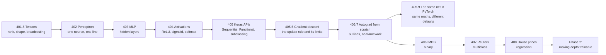

import Figure from "../../../../components/Figure.astro";
import Quiz from "../../../../components/Quiz.astro";

Every architecture in this module — convolutional networks, recurrent networks,
Transformers, diffusion models — is neurons, layers and activation functions
arranged differently, trained by the same update rule. Phase 1 builds that base,
and it does so by measuring rather than asserting: every number on every page in
this phase came from code that ran on a CPU laptop, and several of them contradict
what tutorials usually claim.

## What this phase covers



Read them in order. Each page assumes the previous one, and the three worked
examples at the end reuse everything before them.

## The ten pages, and what each one proves

| # | Page | The result it delivers |
| --- | --- | --- |
| 401.5 | [Tensors and Tensor Operations](/deep-learning/phase-01---neural-network-foundations/tensors-and-tensor-operations/) | Rank, shape and dtype; the broadcasting rule and its failure modes; why matmul costs $2n^3$ flops — and the measured surprise that float16 can be *hundreds of times slower* than float32 on a CPU |
| 402 | [Introduction to Neural Networks (The Perceptron)](/deep-learning/phase-01---neural-network-foundations/introduction-to-neural-networks-the-perceptron/) | The perceptron learning rule, the proof it cannot learn XOR, and a nine-parameter two-layer fix worked out by hand |
| 403 | [Multi-Layer Perceptron (MLP)](/deep-learning/phase-01---neural-network-foundations/multi-layer-perceptron-mlp/) | What a hidden layer actually buys: **0.68 → 0.97** on the same classifier, plus width against depth at a fixed parameter budget |
| 404 | [Activation Functions](/deep-learning/phase-01---neural-network-foundations/activation-functions-relu-sigmoid-softmax/) | Why a network without activations collapses to one linear layer, and what each activation's derivative costs at depth |
| 405 | [Building Networks with Keras](/deep-learning/phase-01---neural-network-foundations/building-neural-networks-with-keras-sequential-and-functional-api/) | Three APIs producing **bit-identical** models, and four stopping policies spanning **2.8941 to 2.7653** test MAE |
| 405.5 | [How Neural Networks Learn](/deep-learning/phase-01---neural-network-foundations/how-neural-networks-learn-gradient-based-optimization/) | The update rule verified to 0.00e+00 against Keras, the stability limit $\eta < 2/c$ derived and tested, and a learning-rate sweep from **0.1320 to 0.8960** accuracy |
| 405.7 | [Autograd from Scratch](/deep-learning/phase-01---neural-network-foundations/autograd-from-scratch/) | Reverse-mode automatic differentiation in about 60 lines, matching `tf.GradientTape` to the last digit |
| 405.9 | [The Same Network in PyTorch](/deep-learning/phase-01---neural-network-foundations/the-same-network-in-pytorch/) | Identical weights give gradients agreeing to **7.45e-09**; identical training gives **0.8990 both ways**; the real gaps are the defaults |
| 406 | [Classifying Movie Reviews (IMDB)](/deep-learning/phase-01---neural-network-foundations/first-example-classifying-movie-reviews-imdb-binary/) | Binary classification end to end: baseline **0.8618**, network **0.8792**, and the overfitting turn located at **epoch 4** |
| 407 | [Classifying Newswires (Reuters)](/deep-learning/phase-01---neural-network-foundations/first-example-classifying-newswires-reuters-multiclass/) | Multiclass on imbalanced data: **0.7703 accuracy hiding a macro recall of 0.3279** |
| 408 | [Predicting House Prices](/deep-learning/phase-01---neural-network-foundations/first-example-predicting-house-prices-regression/) | Regression on 404 rows: a K-fold spread of **0.8018 MAE**, and unscaled features costing **5.1459 against 2.6112** |

<Figure
  src="/images/dl/phase-01-foundations/activation-functions/activation-depth"
  alt="Grouped bar chart of MNIST validation accuracy for sigmoid, tanh and relu at 2 and 8 hidden layers. Sigmoid falls from 0.7402 to 0.1563 when deepened; tanh holds at 0.8773 and 0.8782; relu goes from 0.8803 to 0.8502."
  title="MNIST validation accuracy, 8,000 rows, 4 epochs, 3 seeds (bars are the mean, whiskers the range)"
  caption="Sigmoid at depth 8 collapses to 0.1563 — barely above the 0.10 you get by always guessing one class. tanh is unmoved by the extra six layers. ReLU loses 0.03 at depth 8 in this budget, which is a real result and not the one the folklore predicts."
/>

<Figure
  src="/images/dl/phase-01-foundations/multi-layer-perceptron-mlp/width-vs-depth"
  alt="Bar chart of MNIST validation accuracy for four architectures with parameter counts annotated: 1x128 with 101,770 params at 0.9038, 2x90 with 79,750 at 0.9112, 4x60 with 58,690 at 0.9115, and 8x40 with 43,290 at 0.8850."
  title="Similar budgets, spent on width or on depth"
  caption="The two middle configurations win while carrying fewer parameters — 4x60 matches 2x90 using 58,690 against 79,750, and beats the single wide layer's 101,770. At 8 layers of 40 units the accuracy drops to 0.8850: this plain MLP has no normalisation or residual connections, and depth without them stops paying."
/>

<Figure
  src="/images/dl/overviews/phase-summaries/phase-1"
  alt="Horizontal bars, one per page in the phase, each labelled with the claim it tested and coloured by the verdict: green where the standard story held, amber where it held at a price, red where the measurement contradicted it. 3 of 6 claims contradicted, 0 held at a price, 3 held."
  title="Every claim this phase set out to test"
  caption="Collected from the runs behind each page's own figures rather than measured afresh, so every bar is traceable to the page it names. Bar length is the log of the effect size, because the effects span from 0.0014 to 5,376 — the number that matters is printed on each bar. Across all nine phases, 34 of 54 claims were contradicted outright, 11 held at a cost that was worth stating, and 9 held as advertised."
/>

## Six results that contradict the usual story

The measurements in this phase are not all confirmations. Six worth knowing before
you start, each with its evidence on the page it comes from:

1. **A learning rate 1,000× too small looks exactly like a broken model.** At
   lr=0.0001 the network reached 0.1320 accuracy — barely above guessing — while
   its loss visibly moved. Sweep the rate before suspecting the architecture.
   (405.5)
2. **lr=1.0 did not diverge.** The textbook picture says it should. On a shallow
   ReLU network with cross-entropy it matched lr=0.1 almost exactly, because the
   actual curvature was gentler than the theory's worst case. (405.5)
3. **Plain SGD beat both momentum and Adam** by three orders of magnitude on a
   clean two-parameter quadratic. Adaptive optimisers earn their keep on messy
   high-dimensional losses, not everywhere. (405.5)
4. **tanh beat ReLU at depth 8** (0.8782 against 0.8502) on the same data and
   seed. ReLU is the right default, not a law. (404)
5. **Logistic regression got 0.8618 on IMDB where the neural network got 0.8792.**
   Most of the signal in a bag-of-words representation is linear. Without the
   baseline, 0.8792 sounds like a triumph. (406)
6. **A model with 0.7703 accuracy never predicted 13 of its 46 classes.** Accuracy
   on imbalanced data measures the majority classes and almost nothing else. (407)

None of these are exotic edge cases. They are what happened when ordinary claims
were checked on ordinary hardware.

```p5 title="One neuron, two knobs" desc="Drag inside the square to move the weight vector. The shaded region is what the neuron outputs above 0.5 - a straight line, always, which is exactly the limit the perceptron page proves." height="380"
let w1 = 1.2;
let w2 = -0.8;
let bias = 0.0;
const SIZE = 300;
const POINTS = [
  [0, 0, 0], [0, 1, 1], [1, 0, 1], [1, 1, 0],
];
function setup() {
  createCanvas(620, 380);
  textFont("monospace");
}
function sigmoid(z) { return 1 / (1 + Math.exp(-z)); }
function draw() {
  background(13, 17, 23);
  noStroke();
  fill(230);
  textSize(12);
  textAlign(LEFT, TOP);
  text("sigmoid(w1*x1 + w2*x2 + b) over the unit square", 26, 18);
  const ox = 26;
  const oy = 48;
  const step = 6;
  for (let px = 0; px < SIZE; px += step) {
    for (let py = 0; py < SIZE; py += step) {
      const x1 = (px / SIZE) * 1.6 - 0.3;
      const x2 = 1.3 - (py / SIZE) * 1.6;
      const out = sigmoid(w1 * x1 + w2 * x2 + bias);
      fill(60 + out * 60, 70 + out * 110, 90 + out * 60);
      rect(ox + px, oy + py, step, step);
    }
  }
  for (let i = 0; i < POINTS.length; i++) {
    const px = ((POINTS[i][0] + 0.3) / 1.6) * SIZE;
    const py = ((1.3 - POINTS[i][1]) / 1.6) * SIZE;
    if (POINTS[i][2] === 1) { fill(255, 211, 67); } else { fill(230, 90, 100); }
    circle(ox + px, oy + py, 13);
  }
  fill(150);
  textSize(9);
  text("yellow = XOR true, red = XOR false", ox, oy + SIZE + 8);
  const bx = 360;
  fill(230);
  textSize(11);
  text("w1 = " + w1.toFixed(2), bx, 60);
  text("w2 = " + w2.toFixed(2), bx, 84);
  text("b  = " + bias.toFixed(2), bx, 108);
  let correct = 0;
  for (let i = 0; i < POINTS.length; i++) {
    const out = sigmoid(w1 * POINTS[i][0] + w2 * POINTS[i][1] + bias);
    const predicted = out > 0.5 ? 1 : 0;
    if (predicted === POINTS[i][2]) { correct += 1; }
    fill(predicted === POINTS[i][2] ? color(126, 192, 143)
                                    : color(224, 108, 117));
    textSize(9.5);
    text("(" + POINTS[i][0] + "," + POINTS[i][1] + ") -> " + out.toFixed(2)
         + "  want " + POINTS[i][2], bx, 148 + i * 18);
  }
  fill(255, 211, 67);
  textSize(11);
  text(correct + " of 4 correct", bx, 236);
  fill(150);
  textSize(9);
  text("drag the square to move the", bx, 268);
  text("boundary. Three of four is the", bx, 281);
  text("best any single neuron reaches", bx, 294);
  text("on XOR - page 402 proves why,", bx, 307);
  text("and 405.7 trains nine parameters", bx, 320);
  text("that do reach four.", bx, 333);
}
function mousePressed() { mouseDragged(); }
function mouseDragged() {
  if (mouseX < 26 || mouseX > 26 + SIZE || mouseY < 48 || mouseY > 48 + SIZE) {
    return;
  }
  w1 = (((mouseX - 26) / SIZE) * 2 - 1) * 6;
  w2 = (1 - ((mouseY - 48) / SIZE) * 2) * 6;
  bias = -(w1 + w2) / 2;
}
```

```p5 title="How often the standard story survived" desc="Step through the phases. Each bar splits the claims that phase tested into contradicted, held at a price, and held as advertised - the totals are summed live." height="400"
let picked = 0;
const PHASES = [
  [1, "Neural Network Foundations", 3, 0, 3, "a single neuron cannot do XOR - 0 of 40,401 weight pairs"],
  [2, "Training Deep Networks", 2, 2, 2, "146x the parameters bought 0.0150 accuracy"],
  [3, "Computer Vision", 4, 1, 1, "augmentation cost 0.1855 clean, bought 0.1105 rotated"],
  [4, "Sequence Models", 4, 2, 0, "a fixed state scored 0.0017 against attention's 1.0000"],
  [5, "NLP & Transformers", 4, 1, 1, "TF-IDF 0.8632 beat a transformer's 0.8462, 55x cheaper"],
  [6, "Generative", 3, 1, 2, "copying 200 real images scored FID 5.027 against real 9.605"],
  [7, "Reinforcement Learning", 4, 2, 0, "replay and target nets: 144.20 together, 53.45 either alone"],
  [8, "Scaling & Deployment", 5, 1, 0, "mixed precision measured 40.65x SLOWER on this CPU"],
  [9, "Capstones", 5, 1, 0, "a memoriser beat the VAE on Frechet distance"]
];
function setup() {
  createCanvas(620, 400);
  textFont("monospace");
}
function draw() {
  background(13, 17, 23);
  noStroke();
  fill(230);
  textSize(12);
  textAlign(LEFT, TOP);
  text("54 claims, 9 phases, every one tested by a measurement", 26, 16);
  let broke = 0;
  let cost = 0;
  let held = 0;
  for (let i = 0; i < PHASES.length; i++) {
    broke += PHASES[i][2];
    cost += PHASES[i][3];
    held += PHASES[i][4];
  }
  for (let i = 0; i < PHASES.length; i++) {
    const y = 48 + i * 26;
    const row = PHASES[i];
    const chosen = i === picked;
    fill(chosen ? 255 : 130, chosen ? 211 : 140, chosen ? 67 : 155);
    textSize(9);
    text("Phase " + row[0] + "  " + row[1], 26, y + 5);
    let x = 250;
    const unit = 34;
    fill(224, 108, 117);
    rect(x, y, row[2] * unit, 17, 2);
    x += row[2] * unit;
    fill(255, 211, 67);
    rect(x, y, row[3] * unit, 17, 2);
    x += row[3] * unit;
    fill(126, 192, 143);
    rect(x, y, row[4] * unit, 17, 2);
    if (chosen) {
      noFill();
      stroke(255, 211, 67);
      strokeWeight(1.5);
      rect(248, y - 2, 6 * unit + 4, 21, 3);
      noStroke();
    }
  }
  const row = PHASES[picked];
  fill(200);
  textSize(10);
  text("Phase " + row[0] + " headline:", 26, 300);
  fill(255, 211, 67);
  textSize(10);
  text(row[5], 26, 318);
  fill(150);
  textSize(9);
  text("contradicted " + row[2] + "   held at a price " + row[3]
       + "   held " + row[4], 26, 340);
  fill(224, 108, 117);
  rect(26, 360, 12, 12, 2);
  fill(150);
  textSize(9);
  text("contradicted  " + broke + " of 54", 44, 362);
  fill(255, 211, 67);
  rect(210, 360, 12, 12, 2);
  fill(150);
  text("held at a price  " + cost, 228, 362);
  fill(126, 192, 143);
  rect(400, 360, 12, 12, 2);
  fill(150);
  text("held  " + held, 418, 362);
  fill(110);
  textSize(8.5);
  text("click a row. Collected from each page's own measured run.", 26, 382);
}
function mousePressed() {
  for (let i = 0; i < PHASES.length; i++) {
    const y = 48 + i * 26;
    if (mouseY > y && mouseY < y + 20) { picked = i; }
  }
}
```

## Prerequisites

- The [Machine Learning module](/machine-learning/machine-learning/), or comfort
  with train/test splits, loss functions and gradient descent.
- NumPy: array indexing, `shape`, `dtype`, and basic broadcasting.
- Python functions, classes and f-strings.

A quick self-test — if you can predict all four lines, you are ready:

```python title="Predict the output before running it"
import numpy as np

a = np.zeros((3, 4))
b = np.array([1.0, 2.0, 3.0, 4.0])
print((a + b).shape)                      # (3, 4) -- broadcasting
print(a.T.shape)                          # (4, 3)
print(np.dot(a, b.reshape(4, 1)).shape)   # (3, 1)
print(a.dtype)                            # float64
```

## What you will need installed

```bash
pip install tensorflow numpy matplotlib scikit-learn
```

Everything in this phase runs on a CPU. The slowest single measurement on any page
took 34 minutes — a deliberate batch-size-8 comparison, reported once and not
repeated — and the rest complete in seconds to a couple of minutes. No GPU, no
cloud account. Phase 1 is Keras and NumPy throughout, with one exception: page 405.9 installs `torch` to check, by measurement, how much of what you have learned is about neural networks rather than about TensorFlow.

## By the end of this phase you can

- Read and reason about tensor shapes, and predict when a broadcast will fail.
- Compute a layer's parameter count by hand and check it against
  `model.count_params()`.
- Choose an output layer and loss for binary, multiclass and regression targets,
  and explain why each pairing exists.
- Derive one gradient-descent step by hand and reproduce an optimiser's update
  exactly.
- Write reverse-mode autodiff from scratch, so `GradientTape` stops being magic.
- Build a model in any of the three Keras APIs and pick the right one for a given
  architecture.
- Establish a baseline before training anything, and recognise when a network is
  not beating it.
- Read training curves to find the epoch to stop at, and explain why validation
  loss and validation accuracy disagree about when that is.
- Report a result honestly: per-class recall on imbalanced data, K-fold spread on
  small data, residuals rather than averages.

## Next

Phase 1's networks were shallow — two or three layers — because deeper ones do not
train without help. Phase 2 covers what that help is: weight initialisation,
normalisation layers, better optimisers, dropout, and the rest of the machinery
that makes depth work at all.

<Quiz
  questions={[
    {
      q: "Why does this phase insist on measuring a baseline before building a network?",
      options: [
        "It is a formality required by most papers",
        "Because without it you cannot tell whether a result is good — logistic regression scored 0.8618 on IMDB where the network scored 0.8792, a gap that only means something once you know the baseline",
        "Because baselines train faster than networks",
        "Because baselines are more accurate on small datasets",
      ],
      answer: 1,
      explain: "A number with nothing to compare it against is not a measurement. This is the most transferable habit in the phase.",
    },
    {
      q: "Which order should the ten pages be read in?",
      options: [
        "Any order — each page is self-contained",
        "In sidebar order: tensors, perceptron, MLP, activations, Keras, gradient descent, autograd, then the three worked examples, which reuse everything before them",
        "The three worked examples first, then the theory",
        "Autograd first, since it explains the framework",
      ],
      answer: 1,
      explain: "The worked examples at 406-408 assume the loss functions, output layers and training loop built on every earlier page.",
    },
    {
      q: "The phase reports that tanh beat ReLU at depth 8, and that plain SGD beat Adam on a quadratic. What is the intended lesson?",
      options: [
        "ReLU and Adam are bad defaults and should be avoided",
        "Defaults are defaults, not laws — they are usually right, and the only way to know whether they are right for your problem is to measure it",
        "Older activations and optimisers are generally underrated",
        "Benchmarks are unreliable and should be ignored",
      ],
      answer: 1,
      explain: "Both results are narrow and reproducible. ReLU and Adam remain the sensible starting points; the habit of checking is the part that transfers.",
    },
    {
      q: "What hardware does Phase 1 require?",
      options: [
        "A CUDA GPU with at least 8 GB of memory",
        "A CPU — every measurement in the phase was produced on one, using only TensorFlow, NumPy, matplotlib and scikit-learn",
        "A cloud TPU for the worked examples",
        "Any machine with PyTorch installed",
      ],
      answer: 1,
      explain: "The heaviest single run took 34 minutes and was included deliberately to show what a bad batch size costs. Everything else is seconds to minutes.",
    },
  ]}
/>
