Phase 1 builds the mental model you'll reuse for every architecture in this module —
CNNs, RNNs, Transformers, even generative models. They're all just neurons, layers,
and activation functions arranged differently.

## You'll learn

- What a **tensor** is - scalars, vectors, matrices, and beyond - plus the element-wise
  ops, broadcasting, and dot products every layer is built from
- What a biological neuron inspired, and how McCulloch, Pitts, and Rosenblatt turned
  that idea into the **perceptron**
- Why a single perceptron can only draw a straight line through your data (and why
  that's a problem)
- How stacking perceptrons into a **Multi-Layer Perceptron (MLP)** fixes that
- What **activation functions** (ReLU, sigmoid, softmax) do, and why a network without
  them is secretly just a linear model
- How to describe and build these networks with **tf.keras** - the Sequential,
  Functional, and Subclassing APIs, plus saving, loading, and callbacks
- How gradient-based optimization actually works - derivatives, gradients, the chain
  rule, backpropagation, and a tiny `GradientTape` example
- Three complete first projects: classifying **movie reviews** (binary), **newswires**
  (multiclass), and predicting **house prices** (regression)

```mermaid
flowchart LR
  A["Tensors & tensor ops"] --> B["Perceptron (1 layer of TLUs)"]
  B --> C["Multi-Layer Perceptron (hidden layers)"]
  C --> D["Activation functions (ReLU, sigmoid, softmax)"]
  D --> E["Building models with Keras APIs"]
  E --> G["How networks learn (gradient descent)"]
  G --> H["First examples: IMDB, Reuters, house prices"]
  H --> F["Ready for Phase 2: training"]
```

## Phase checklist

1. Tensors and Tensor Operations
2. Introduction to Neural Networks (The Perceptron)
3. Multi-Layer Perceptron (MLP)
4. Activation Functions (ReLU, Sigmoid, Softmax)
5. Building Neural Networks with Keras (Sequential and Functional API)
6. How Neural Networks Learn (Gradient-Based Optimization)
7. First Example: Classifying Movie Reviews (IMDB, Binary)
8. First Example: Classifying Newswires (Reuters, Multiclass)
9. First Example: Predicting House Prices (Regression)

## Prerequisites

- You've finished the **Machine Learning** module (or are comfortable with train/test
  splits, loss functions, and gradient descent).
- Comfortable with basic NumPy and Python functions.
