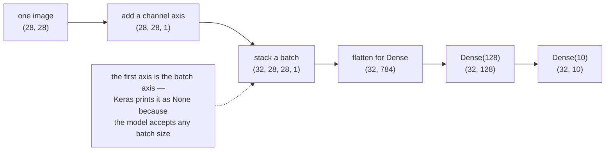

import DataCampExercise from "../../../../components/DataCampExercise.astro";
import Figure from "../../../../components/Figure.astro";
import Quiz from "../../../../components/Quiz.astro";

A neural network is a pipeline of tensor operations. Nearly every bug in Phase 1 is a
shape bug, every speed problem is a dtype or flop-count problem, and both become
obvious once you can read a shape and count a multiply. This page is that vocabulary,
with the arithmetic and the timings measured rather than asserted.

## What you'll learn

- Rank, shape, size and dtype — and how to compute a tensor's memory from them.
- The broadcasting rule, tested on six shape pairs including the two that fail.
- Why a matmul costs $2mnk$ flops, and what that predicts when you double $n$
  (measured: **7.00×** against the theoretical 8).
- Which operations return a **view** and which copy, verified with `np.shares_memory`.
- Why converting MNIST to float32 costs exactly **4×** the memory.
- A measured surprise: **float16 was 314× slower than float32** here, so "half
  precision to save memory" is not free.

## Rank, shape, size, dtype

A tensor is an $n$-dimensional array, and four numbers describe it completely:

| Tensor | Rank | Shape | Size | Bytes (float32) |
| --- | --- | --- | --- | --- |
| scalar | 0 | `()` | 1 | 4 |
| vector | 1 | `(3,)` | 3 | 12 |
| matrix | 2 | `(3, 4)` | 12 | 48 |
| batch of images | 4 | `(32, 28, 28, 1)` | 25,088 | 100,352 |

**Rank** is `len(shape)`. **Size** is the product of the shape. **Bytes** is
$\text{size} \times \text{itemsize}$ — 4 for float32, 8 for float64.

That last row is the shape every image model in Phase 3 consumes:
$(\text{batch}, \text{height}, \text{width}, \text{channels})$. Keras calls that axis
order `channels_last` and uses it by default.



## Broadcasting, including where it stops

Adding a bias vector to a matrix of activations needs no loop, because of broadcasting.
The rule: **align the shapes from the right; each pair of axes must be equal, or one of
them must be 1.**

<Figure
  src="/images/dl/phase-01-foundations/tensors-and-tensor-operations/broadcasting"
  alt="Three grids side by side: a column of three cells labelled a0 to a2 with shape (3,1), a row of four cells labelled b0 to b3 with shape (1,4), and a three-by-four grid whose cells read a0+b0 through a2+b3 with shape (3,4)."
  title="A (3,1) and a (1,4) add to a (3,4)"
  caption="Each operand is stretched along the axis where its length is 1. No copy is made — the stretch is a striding trick, which is why adding a 4096-element bias to a 4096x4096 matrix costs no extra memory for the bias."
/>

Tested on six pairs:

| a | b | result |
| --- | --- | --- |
| `(3, 4)` | `(4,)` | `(3, 4)` — one bias per column |
| `(3, 4)` | `(3, 1)` | `(3, 4)` — one scale per row |
| `(3, 1)` | `(1, 4)` | `(3, 4)` — both stretch |
| `(32, 28, 28, 1)` | `(1,)` | `(32, 28, 28, 1)` — a scalar reaches everything |
| `(3, 4)` | `(3,)` | **ValueError** |
| `(2, 3)` | `(3, 2)` | **ValueError** |

The fifth row is the one that bites. `(3, 4) + (3,)` reads like "add one number per
row", but right-alignment pairs the 3 against the 4 and neither is 1. What you meant
was `(3, 1)` — written `b[:, None]` or `b.reshape(-1, 1)`.

**Broadcasting does not copy.** A 4096×4096 float32 matrix is 67,108,864 bytes; the
4096-element bias added to it is 16,384. Materialising that bias to the matrix's shape
would cost another 67 MB. `np.broadcast_to` hands you the stretched view with a base of
16,384 bytes — the stretch is bookkeeping, not memory.

## Matmul: the operation that dominates the bill

For $\mathbf{A} \in \mathbb{R}^{m \times k}$ and
$\mathbf{B} \in \mathbb{R}^{k \times n}$:

$$
(\mathbf{A}\mathbf{B})_{ij} = \sum_{p=1}^{k} A_{ip} B_{pj}
$$

Each of the $mn$ output entries costs $k$ multiplies and $k-1$ adds, so the total is
$mn(2k-1) \approx 2mnk$ flops. For square matrices that is $2n^3$, so **doubling $n$
multiplies the work by 8**.

<Figure
  src="/images/dl/phase-01-foundations/tensors-and-tensor-operations/matmul-scaling"
  alt="Log-log plot of seconds per matmul against n from 64 to 1024, with a dashed n-cubed reference line matched at n equals 1024. The measured line sits above the reference at small n and converges to its slope by n equals 512."
  title="Measured matmul time against the n³ prediction"
  caption="Between 64 and 256 the measurement is flatter than n cubed because fixed overheads and cache effects dominate — at n=128 the matmul took 0.29 ms against 0.34 ms at n=256, which is not a typo. From 512 upward the slope matches: 512 to 1024 multiplied the time by 7.00 against a predicted 8."
/>

| n | flops | seconds | GFLOP/s |
| --- | --- | --- | --- |
| 64 | 524,288 | 0.000009 | 61.25 |
| 128 | 4,194,304 | 0.000139 | 30.27 |
| 256 | 33,554,432 | 0.000354 | 94.79 |
| 512 | 268,435,456 | 0.001542 | 174.09 |
| 1024 | 2,147,483,648 | 0.010800 | **198.84** |

Two lessons. **The asymptotic rule only applies asymptotically** — below a few hundred
elements per side you are timing overhead, not arithmetic. And **throughput improves
with size**: 61 GFLOP/s at n=64 against 199 at n=1024, because large matrices amortise
the cost of moving data into cache. That is the real reason mini-batching exists — 32
images through one matmul beats 32 separate matmuls even though the flop count is
identical.

You can price a forward pass the same way. A 784→128→10 MLP on a batch of 32:

$$
2 \cdot 32 \cdot 784 \cdot 128 \;+\; 2 \cdot 32 \cdot 128 \cdot 10 = 6{,}504{,}448 \text{ flops}
$$

That is **203,264 flops per image**, and the first layer is 98.7% of it.

## Views, copies and strides

`reshape` and transpose do not move data — they change how the same bytes are read.
That is fast, and it means an accidental shared view is a bug waiting to happen:

```python title="views_and_copies.py" showLineNumbers{1}
import numpy as np

a = np.arange(12, dtype="float32")
b = a.reshape(3, 4)        # a view
c = b.T                    # also a view
d = b.copy()               # a real copy

print(np.shares_memory(a, b))    # True
print(np.shares_memory(a, c))    # True
print(np.shares_memory(a, d))    # False

b[0, 0] = 99.0
print(a[0], d[0, 0])             # 99.0 0.0  -- writing through the view changed a
print(b.strides, c.strides)      # (16, 4) (4, 16)  -- transpose swaps strides
```

A float32 row of 4 elements advances 16 bytes per row and 4 per column, so `b.strides`
is `(16, 4)`. Transposing swaps them to `(4, 16)` without touching a byte — which is
why `c.flags['C_CONTIGUOUS']` is `False`, and why some later operation on a transpose
may quietly materialise a contiguous copy.

## dtype is a decision, not a detail

<Figure
  src="/images/dl/phase-01-foundations/tensors-and-tensor-operations/dtype-cost"
  alt="Two panels for float16, float32 and float64 on a 512 by 512 matrix. The left panel shows memory of 0.5, 1.0 and 2.1 megabytes. The right panel, on a log scale, shows matmul times with float16 by far the slowest and float32 the fastest."
  title="Memory behaves as expected; speed does not"
  caption="float16 halves the memory and, on this CPU, took hundreds of times longer for the same matmul — there is no native half-precision kernel here, so the work is emulated. float64 costs twice float32's memory and roughly twice its time, which is the trade you would predict."
/>

| dtype | bytes for 2048×2048 | matmul time |
| --- | --- | --- |
| float16 | 8,388,608 | **135.92 s** |
| float32 | 16,777,216 | **0.0774 s** |
| float64 | 33,554,432 | 0.1510 s |

At $n = 2048$ the float16 penalty was a factor of **1,756**. The figure repeats the
experiment at $n = 512$, where the same effect measures 314× — the ratio depends on
size, but the direction never changes on a CPU with no half-precision hardware. The
lesson is not "never use float16": it is that half precision pays on hardware built for
it and costs dearly on hardware without it. Phase 8 measures mixed precision properly.

**float32 is the deep-learning default** because it halves float64's memory and
bandwidth while keeping enough precision for gradients. It does run out of integers,
though:

```python title="float32_limit.py" showLineNumbers{1}
import numpy as np

total = np.float32(16_777_210.0)
for step in range(1, 9):
    total = total + np.float32(1.0)
    print(step, total)
# 1 16777211.0 ... 5 16777215.0   6 16777216.0   7 16777216.0   8 16777216.0
```

With 23 mantissa bits, $2^{24} = 16{,}777{,}216$ is the last integer float32 represents
exactly. Adding 1.0 past it does nothing — silently. The same loop in float64 reaches
16,777,218, which is why counters and step numbers live in int64.

## Shape errors, and how Keras reports them

A 784-input model given the wrong shape fails in three distinguishable ways:

| Input | Result |
| --- | --- |
| `(5, 784)` | works — output `(5, 10)` |
| `(5, 28, 28)` | `ValueError` from `Sequential.call()` — rank mismatch, caught early |
| `(5, 783)` | `InvalidArgumentError` at graph execution — the matmul itself refused |

The middle case is the friendly one: Keras compares ranks before doing any work. The
last reaches the kernel, which is why its message is longer and less obvious. Both mean
the same thing — what you passed does not match what the first layer declared.

## One dataset, four shapes

MNIST as it arrives, and as each model wants it:

| Representation | Shape | dtype | Bytes |
| --- | --- | --- | --- |
| raw dataset | `(60000, 28, 28)` | uint8 | 47,040,000 |
| flattened and scaled | `(60000, 784)` | float32 | 188,160,000 |
| with a channel axis | `(60000, 28, 28, 1)` | float32 | 188,160,000 |
| labels, one-hot | `(60000, 10)` | float64 | 4,800,000 |

Dividing by 255 is not free: it converts uint8 to float32 and **multiplies the memory
by 4**. On a dataset this size that is invisible; on a large image corpus it is exactly
why `tf.data` streams from disk and scales inside the pipeline instead of up front.

## See it move

The first sketch is the shape algebra: watch each axis get checked, and see which pairs
are legal.

```p5 title="Broadcasting, one axis at a time" desc="Two shapes are aligned from the right, each axis pair is checked against the rule, and the result shape is assembled. Click to cycle through compatible and incompatible pairs." height="380"
const CASES = [
  { a: [3, 4], b: [4], note: "one bias per column" },
  { a: [3, 4], b: [3, 1], note: "one scale per row" },
  { a: [3, 1], b: [1, 4], note: "both operands stretch" },
  { a: [3, 4], b: [3], note: "4 vs 3 after right-alignment" },
  { a: [2, 3], b: [3, 2], note: "3 vs 2 and 2 vs 3" },
];
let index = 0;
let timer = 0;

function setup() {
  createCanvas(620, 380);
  textFont("monospace");
}
function pad(shape, rank) {
  const out = [];
  for (let i = 0; i < rank - shape.length; i++) out.push(null);
  return out.concat(shape);
}
function draw() {
  background(13, 17, 23);
  const c = CASES[index];
  const rank = Math.max(c.a.length, c.b.length);
  const A = pad(c.a, rank);
  const B = pad(c.b, rank);

  fill(215);
  textSize(13);
  textAlign(LEFT, TOP);
  text("a.shape = (" + c.a.join(", ") + ")      b.shape = (" + c.b.join(", ") + ")", 30, 20);
  fill(105);
  textSize(10);
  text("axes are aligned from the RIGHT, then compared one pair at a time", 30, 44);

  const cell = 74;
  const x0 = 320 - (rank * cell) / 2;
  const rows = [["a", A], ["b", B]];
  for (let r = 0; r < 2; r++) {
    const shape = rows[r][1];
    fill(150);
    textSize(12);
    textAlign(RIGHT, CENTER);
    text(rows[r][0], x0 - 14, 120 + r * 60);
    for (let i = 0; i < rank; i++) {
      const value = shape[i];
      noStroke();
      fill(value === null ? color(26, 32, 40) : color(40, 48, 58));
      rect(x0 + i * cell, 100 + r * 60, cell - 6, 40, 3);
      fill(value === null ? 90 : 225);
      textSize(13);
      textAlign(CENTER, CENTER);
      text(value === null ? "-" : value, x0 + i * cell + (cell - 6) / 2, 120 + r * 60);
    }
  }

  let compatible = true;
  const resultShape = [];
  for (let i = 0; i < rank; i++) {
    const av = A[i] === null ? 1 : A[i];
    const bv = B[i] === null ? 1 : B[i];
    const ok = av === bv || av === 1 || bv === 1;
    if (!ok) compatible = false;
    resultShape.push(ok ? Math.max(av, bv) : "x");
    noStroke();
    fill(ok ? color(120, 200, 120) : color(232, 122, 122));
    textSize(11);
    textAlign(CENTER, TOP);
    text(ok ? "ok" : "clash", x0 + i * cell + (cell - 6) / 2, 226);
    fill(ok ? color(120, 200, 120, 70) : color(232, 122, 122, 70));
    rect(x0 + i * cell, 250, cell - 6, 40, 3);
    fill(230);
    textSize(13);
    textAlign(CENTER, CENTER);
    text(resultShape[i], x0 + i * cell + (cell - 6) / 2, 270);
  }
  fill(150);
  textSize(12);
  textAlign(RIGHT, CENTER);
  text("result", x0 - 14, 270);

  fill(compatible ? color(120, 200, 120) : color(232, 122, 122));
  textSize(13);
  textAlign(LEFT, TOP);
  text(compatible
       ? "compatible -> shape (" + resultShape.join(", ") + ")"
       : "ValueError: operands could not be broadcast together",
       30, 308);
  fill(105);
  textSize(11);
  text(c.note, 30, 332);
  textSize(10);
  text("click for the next shape pair", 30, 356);

  timer += deltaTime;
  if (timer > 3200) { timer = 0; index = (index + 1) % CASES.length; }
}
function mousePressed() { timer = 0; index = (index + 1) % CASES.length; }
```

The second sketch contrasts the two operations people conflate: reshaping rearranges
the same numbers, while broadcasting re-reads a smaller tensor for every row.

```p5 title="Reshape vs. broadcast" desc="Left: the six cells of a (3,2) grid continuously re-flow into a (2,3) grid and back -- same values, same order, just a new shape. Right: the vector's virtual copy sweeps down through every row it's broadcast onto." height="360"
const values = [0, 1, 2, 3, 4, 5];           // the SAME six values, two different shapes
const matrix = [[1, 2, 3], [4, 5, 6]];       // shape (2, 3)
const vec = [10, 20, 30];                    // shape (3,)
const cell = 40;
const origOx = 70, origOy = 45;    // (3,2) layout origin
const reshOx = 230, reshOy = 65;   // (2,3) layout origin
const PERIOD = 240;

function setup() {
  createCanvas(600, 360);
  textFont("monospace");
  textAlign(CENTER, CENTER);
}

function drawCell(v, x, y, fillCol) {
  stroke(90, 100, 114);
  strokeWeight(1);
  fill(fillCol);
  rect(x, y, cell, cell);
  noStroke();
  fill(255);
  textSize(13);
  text(v, x + cell / 2, y + cell / 2);
}

function draw() {
  background(13, 17, 23);
  const t = (frameCount % PERIOD) / PERIOD;

  // --- Left: reshape -- cells continuously re-flow between a (3,2) and a
  // (2,3) layout. A cosine wave gives a smooth there-and-back loop.
  const morph = (Math.cos(TWO_PI * t - PI) + 1) / 2;   // 0 -> 1 -> 0, no jump

  fill(255, 211, 67);
  textSize(13);
  text("reshape((3,2)) <-> (2,3)", 165, 20);
  for (let k = 0; k < values.length; k++) {
    const oCol = k % 2, oRow = Math.floor(k / 2);
    const rCol = k % 3, rRow = Math.floor(k / 3);
    const ox = origOx + oCol * cell, oy = origOy + oRow * cell;
    const rx = reshOx + rCol * cell, ry = reshOy + rRow * cell;
    const x = lerp(ox, rx, morph), y = lerp(oy, ry, morph);
    drawCell(values[k], x, y, color(40 + morph * 20, 54 + morph * 30, 70 + morph * 20));
  }
  fill(120, 200, 120);
  textSize(14);
  text(morph > 0.5 ? "-- same 6 values, shape (2,3) --" : "-- same 6 values, shape (3,2) --", 210, 210);

  // --- Right: broadcasting -- the vector's virtual copy sweeps down through
  // every row of the matrix it's added to.
  fill(75, 139, 190);
  textSize(13);
  text("broadcasting: (2,3) + (3,)", 470, 20);
  for (let i = 0; i < matrix.length; i++) {
    for (let j = 0; j < matrix[i].length; j++) {
      drawCell(matrix[i][j], 400 + j * cell, 45 + i * cell, color(40, 54, 70));
    }
  }
  for (let j = 0; j < vec.length; j++) {
    drawCell(vec[j], 400 + j * cell, 195, color(255, 211, 67, 90));
  }
  const sweep = (Math.cos(TWO_PI * t - PI) + 1) / 2;   // 0 -> 1 -> 0
  const sweepY = lerp(195, 275, sweep);
  const onRow0 = sweepY < 255;
  noStroke();
  fill(255, 211, 67, 55);
  rect(400, 235, 3 * cell, cell);
  fill(255, 211, 67, 55);
  rect(400, 275, 3 * cell, cell);
  fill(255, 211, 67, 190);
  rect(400, sweepY, 3 * cell, cell, 4);
  fill(20);
  textSize(12);
  for (let j = 0; j < vec.length; j++) {
    text(vec[j], 400 + j * cell + cell / 2, sweepY + cell / 2);
  }
  fill(255, 211, 67);
  textSize(11);
  text(onRow0 ? "virtually copied onto row 0" : "virtually copied onto row 1", 460, 330);
  fill(150);
  textSize(11);
  text("no memory duplicated -- NumPy re-reads [10,20,30] for each row", 460, 345);
}
```

:::tip[Chollet's uncrumpled paper ball]
Think of the input as two crumpled sheets of coloured paper balled together. Training is
finding a sequence of simple geometric moves — translations (`+`), rotations and
scalings (`@`), and non-linear folds (activations) — that uncrumples the ball until the
two colours separate. Every one of those moves is a tensor operation from this page.
:::

## Pitfalls

**Reading `(3, 4) + (3,)` as "one value per row".** Right-alignment pairs 3 with 4 and
raises. Use `b[:, None]` to get `(3, 1)`.

**Forgetting the batch axis.** A single 784-vector must be `(1, 784)`, not `(784,)`.
Keras prints the model's input as `(None, 784)`; that `None` is the batch axis and it is
never optional.

**Writing through a view by accident.** `b = a.reshape(3, 4)` shares memory, so
`b[0, 0] = 99` changes `a`. Call `.copy()` when you need independence — and *not* when
you do not, because on large arrays it is the expensive line.

**Choosing float16 to save memory on a CPU.** Measured here: 314× slower at n=512,
1,756× at n=2048. Half precision belongs on hardware built for it.

**Accumulating counters in float32.** Past $2^{24}$, `total += 1.0` silently stops
increasing.

**Assuming a transpose stays free.** Transposing is free; the *next* operation may
materialise a contiguous copy of it.

## Recap

- Rank is `len(shape)`, size is the product of the shape, bytes is
  $\text{size} \times \text{itemsize}$.
- Broadcasting aligns from the right and needs each axis pair equal or containing a 1.
  Six pairs tested, two failed, and the stretch never copies.
- Matmul is $\approx 2mnk$ flops, so doubling a square side costs 8× — measured
  **7.00×** from 512 to 1024, with throughput climbing from 61 to 199 GFLOP/s because
  bigger matmuls use cache better. That is why mini-batching helps.
- A 784→128→10 forward pass is **203,264 flops per image**, 98.7% in the first layer.
- `reshape` and `.T` return views sharing memory; only `.copy()` does not.
- float32 is the default: half of float64's memory, and hundreds of times faster than
  float16 on this CPU. It stops counting integers exactly at $2^{24}$.
- Scaling MNIST to float32 multiplies its memory by exactly 4.

<Quiz
  questions={[
    {
      q: "You have activations of shape (32, 128) and a bias of shape (128,). What does adding them produce?",
      options: [
        "An error, because the ranks differ",
        "Shape (32, 128) — right-alignment pairs 128 with 128 and the missing axis counts as 1, so the bias is stretched across all 32 rows without being copied",
        "Shape (32, 128, 128)",
        "Shape (160,)",
      ],
      answer: 1,
      explain: "This is exactly what a Dense layer does internally. Contrast (3, 4) + (3,), which fails because there the 3 lines up against the 4.",
    },
    {
      q: "A 512x512 matmul takes 1.5 ms. Roughly how long should 1024x1024 take?",
      options: [
        "About 3 ms — twice the size, twice the work",
        "About 12 ms — the flop count is 2n³, so doubling n multiplies the work by 8; measured here it was 7.00x",
        "About 6 ms",
        "The same, because the hardware parallelises it",
      ],
      answer: 1,
      explain: "Measured: 1.542 ms at n=512 and 10.800 ms at n=1024, a factor of 7.00. It came in under 8 because the larger matmul reached higher throughput — 199 GFLOP/s against 174.",
    },
    {
      q: "b = a.reshape(3, 4), then b[0, 0] = 99. What happened to a?",
      options: [
        "Nothing — reshape returns a new array",
        "a[0] is now 99.0, because reshape returned a view sharing the same memory; only .copy() gives independence",
        "a raises an error on next access",
        "It depends on the dtype",
      ],
      answer: 1,
      explain: "np.shares_memory(a, b) is True. The same holds for a transpose, which merely swaps strides from (16, 4) to (4, 16) without moving a byte.",
    },
    {
      q: "You switch a CPU run from float32 to float16 to halve memory. What does the measurement here predict?",
      options: [
        "Roughly 2x faster, since there is half as much data to move",
        "Dramatically slower — 314x at n=512 and 1,756x at n=2048 on this CPU, because there is no native half-precision kernel and the work is emulated",
        "Identical speed, half the memory",
        "A crash",
      ],
      answer: 1,
      explain: "Memory halved exactly as expected; only the time was surprising. Half precision is a win on hardware with tensor cores and a serious loss without them.",
    },
    {
      q: "Why does mini-batching speed up training when it does not change the flop count?",
      options: [
        "It reduces the number of gradient updates",
        "One large matmul reaches far higher throughput than many small ones — 199 GFLOP/s at n=1024 against 61 at n=64 — because large operations amortise the cost of moving data into cache",
        "Because broadcasting is free",
        "It lowers the precision required",
      ],
      answer: 1,
      explain: "The arithmetic is identical; the memory traffic per flop is not. It is also why the measured curve is flatter than n³ at small sizes — there you are timing overhead rather than multiplication.",
    },
  ]}
/>

## Next

You can now read a shape, price a matmul and predict a memory footprint. Continue to
[Introduction to Neural Networks (The Perceptron)](/deep-learning/phase-01---neural-network-foundations/introduction-to-neural-networks-the-perceptron/),
where these tensors become one neuron's weighted sum and the shapes start to mean
something.

## 🧪 Try It Yourself

### Exercise 1 – Read a tensor's four properties

<DataCampExercise
  lang="python"
  hint={`t.ndim is the rank, t.shape the shape, t.size the element count and t.nbytes the memory.`}
  code={`# Task: Exercise 1 - Read a tensor's four properties
import numpy as np

tensors = {
    "scalar": np.array(3.5, dtype="float32"),
    "vector": np.array([1.0, 2.0, 3.0], dtype="float32"),
    "matrix": np.zeros((3, 4), dtype="float32"),
    "image batch": np.zeros((32, 28, 28, 1), dtype="float32"),
}
for name, t in tensors.items():
    print(f"{name:12s} rank {t.___}  shape {str(t.shape):18s} "
          f"size {t.size:6d}  bytes {t.nbytes:8,d}")     # replace ___ with ndim
print("rank is len(shape); size is the product of the shape; bytes is size x itemsize")

# -- Expected Output -------------------------------------------
# scalar       rank 0  shape ()                 size      1  bytes        4
# vector       rank 1  shape (3,)               size      3  bytes       12
# matrix       rank 2  shape (3, 4)             size     12  bytes       48
# image batch  rank 4  shape (32, 28, 28, 1)    size  25088  bytes  100,352
# rank is len(shape); size is the product of the shape; bytes is size x itemsize
# --------------------------------------------------------------`}
  solution={`import numpy as np

tensors = {
    "scalar": np.array(3.5, dtype="float32"),
    "vector": np.array([1.0, 2.0, 3.0], dtype="float32"),
    "matrix": np.zeros((3, 4), dtype="float32"),
    "image batch": np.zeros((32, 28, 28, 1), dtype="float32"),
}
for name, t in tensors.items():
    print(f"{name:12s} rank {t.ndim}  shape {str(t.shape):18s} "
          f"size {t.size:6d}  bytes {t.nbytes:8,d}")
print("rank is len(shape); size is the product of the shape; bytes is size x itemsize")`}
  sct={`test_output_contains("rank 4")
success_msg("A batch of 32 small greyscale images is already 100,352 bytes. Multiply by a realistic image size and this is why data pipelines stream rather than load.")`}
  height={280}
/>

### Exercise 2 – Predict which shapes broadcast

<DataCampExercise
  lang="python"
  hint={`Align the shapes from the right; each pair of axes must be equal or one of them must be 1.`}
  code={`# Task: Exercise 2 - Predict which shapes broadcast
import numpy as np

cases = [((3, 4), (4,)), ((3, 4), (3, 1)), ((3, 1), (1, 4)),
         ((32, 28, 28, 1), (1,)), ((3, 4), (3,)), ((2, 3), (3, 2))]
for a_shape, b_shape in cases:
    a, b = np.ones(a_shape, dtype="float32"), np.ones(b_shape, dtype="float32")
    try:
        print(f"{str(a_shape):18s} + {str(b_shape):12s} -> {(a + b).___}")
        # replace ___ with shape
    except ValueError:
        print(f"{str(a_shape):18s} + {str(b_shape):12s} -> ValueError (incompatible)")
print("align the shapes from the right; each pair must be equal or one of them 1")

# -- Expected Output -------------------------------------------
# (3, 4)             + (4,)         -> (3, 4)
# (3, 4)             + (3, 1)       -> (3, 4)
# (3, 1)             + (1, 4)       -> (3, 4)
# (32, 28, 28, 1)    + (1,)         -> (32, 28, 28, 1)
# (3, 4)             + (3,)         -> ValueError (incompatible)
# (2, 3)             + (3, 2)       -> ValueError (incompatible)
# align the shapes from the right; each pair must be equal or one of them 1
# --------------------------------------------------------------`}
  solution={`import numpy as np

cases = [((3, 4), (4,)), ((3, 4), (3, 1)), ((3, 1), (1, 4)),
         ((32, 28, 28, 1), (1,)), ((3, 4), (3,)), ((2, 3), (3, 2))]
for a_shape, b_shape in cases:
    a, b = np.ones(a_shape, dtype="float32"), np.ones(b_shape, dtype="float32")
    try:
        print(f"{str(a_shape):18s} + {str(b_shape):12s} -> {(a + b).shape}")
    except ValueError:
        print(f"{str(a_shape):18s} + {str(b_shape):12s} -> ValueError (incompatible)")
print("align the shapes from the right; each pair must be equal or one of them 1")`}
  sct={`test_output_contains("ValueError (incompatible)")
success_msg("(3,4) + (3,) failing is the one that catches people. Right-alignment pairs the 3 with the 4; what you wanted was b[:, None] of shape (3, 1).")`}
  height={300}
/>

### Exercise 3 – Tell a view from a copy

<DataCampExercise
  lang="python"
  hint={`np.shares_memory(x, y) answers it directly. reshape and .T give views; .copy() does not.`}
  code={`# Task: Exercise 3 - Tell a view from a copy
import numpy as np

a = np.arange(12, dtype="float32")
b = a.reshape(3, 4)
c = b.T
d = b.copy()
print(f"b = a.reshape(3,4)  shares memory with a: {np.shares_memory(a, b)}")
print(f"c = b.T             shares memory with a: {np.shares_memory(a, c)}")
print(f"d = b.copy()        shares memory with a: {np.___(a, d)}")
# replace ___ with shares_memory
b[0, 0] = 99.0
print(f"after b[0,0] = 99 -> a[0] = {a[0]}   d[0,0] = {d[0, 0]}")
print(f"b strides {b.strides}   c strides {c.strides}   (transpose swaps strides)")

# -- Expected Output -------------------------------------------
# b = a.reshape(3,4)  shares memory with a: True
# c = b.T             shares memory with a: True
# d = b.copy()        shares memory with a: False
# after b[0,0] = 99 -> a[0] = 99.0   d[0,0] = 0.0
# b strides (16, 4)   c strides (4, 16)   (transpose swaps strides)
# --------------------------------------------------------------`}
  solution={`import numpy as np

a = np.arange(12, dtype="float32")
b = a.reshape(3, 4)
c = b.T
d = b.copy()
print(f"b = a.reshape(3,4)  shares memory with a: {np.shares_memory(a, b)}")
print(f"c = b.T             shares memory with a: {np.shares_memory(a, c)}")
print(f"d = b.copy()        shares memory with a: {np.shares_memory(a, d)}")
b[0, 0] = 99.0
print(f"after b[0,0] = 99 -> a[0] = {a[0]}   d[0,0] = {d[0, 0]}")
print(f"b strides {b.strides}   c strides {c.strides}   (transpose swaps strides)")`}
  sct={`test_output_contains("a[0] = 99.0")
success_msg("Writing to b changed a. Strides explain it: (16, 4) becomes (4, 16) under transpose, and no byte moves in either case.")`}
  height={300}
/>

### Exercise 4 – Count the flops in a forward pass

<DataCampExercise
  lang="python"
  hint={`An (m,k) @ (k,n) matmul costs about 2*m*k*n flops.`}
  code={`# Task: Exercise 4 - Count the flops in a forward pass
print(f"{'shapes':>22} {'output':>10} {'flops':>16}")
for m, k, n in ((32, 784, 128), (32, 128, 10), (1, 784, 128), (128, 128, 128)):
    flops = 2 * m * k * ___                # replace ___ with n
    print(f"{f'({m},{k}) @ ({k},{n})':>22} {f'({m},{n})':>10} {flops:16,d}")
batch32 = 2 * 32 * 784 * 128 + 2 * 32 * 128 * 10
print(f"one forward pass of a 784-128-10 MLP on a batch of 32: {batch32:,} flops")
print(f"per image: {batch32 // 32:,} flops")

# -- Expected Output -------------------------------------------
#                 shapes     output            flops
#   (32,784) @ (784,128)   (32,128)        6,422,528
#    (32,128) @ (128,10)    (32,10)           81,920
#    (1,784) @ (784,128)    (1,128)          200,704
#  (128,128) @ (128,128)  (128,128)        4,194,304
# one forward pass of a 784-128-10 MLP on a batch of 32: 6,504,448 flops
# per image: 203,264 flops
# --------------------------------------------------------------`}
  solution={`print(f"{'shapes':>22} {'output':>10} {'flops':>16}")
for m, k, n in ((32, 784, 128), (32, 128, 10), (1, 784, 128), (128, 128, 128)):
    flops = 2 * m * k * n
    print(f"{f'({m},{k}) @ ({k},{n})':>22} {f'({m},{n})':>10} {flops:16,d}")
batch32 = 2 * 32 * 784 * 128 + 2 * 32 * 128 * 10
print(f"one forward pass of a 784-128-10 MLP on a batch of 32: {batch32:,} flops")
print(f"per image: {batch32 // 32:,} flops")`}
  sct={`test_output_contains("203,264")
success_msg("The first layer is 6,422,528 of 6,504,448 flops — 98.7%. When you optimise a network, that is where to look first.")`}
  height={280}
/>

### Exercise 5 – Watch float32 run out of integers

<DataCampExercise
  lang="python"
  hint={`float32 has 23 mantissa bits, so 2**24 is the last integer it represents exactly.`}
  code={`# Task: Exercise 5 - Watch float32 run out of integers
import numpy as np

print("float32 stalls: adding 1.0 repeatedly near the limit")
total = np.float32(16_777_210.0)
for step in range(1, 9):
    total = total + np.___(1.0)              # replace ___ with float32
    print(f"  step {step}: {total}")
print(f"float32 mantissa bits: 23, so 2**24 = {2 ** 24:,} is the last integer")
print(f"with float64 the same loop reaches {np.float64(16_777_210.0) + 8.0}")

# -- Expected Output -------------------------------------------
# float32 stalls: adding 1.0 repeatedly near the limit
#   step 1: 16777211.0
#   step 2: 16777212.0
#   step 3: 16777213.0
#   step 4: 16777214.0
#   step 5: 16777215.0
#   step 6: 16777216.0
#   step 7: 16777216.0
#   step 8: 16777216.0
# float32 mantissa bits: 23, so 2**24 = 16,777,216 is the last integer
# with float64 the same loop reaches 16777218.0
# --------------------------------------------------------------`}
  solution={`import numpy as np

print("float32 stalls: adding 1.0 repeatedly near the limit")
total = np.float32(16_777_210.0)
for step in range(1, 9):
    total = total + np.float32(1.0)
    print(f"  step {step}: {total}")
print(f"float32 mantissa bits: 23, so 2**24 = {2 ** 24:,} is the last integer")
print(f"with float64 the same loop reaches {np.float64(16_777_210.0) + 8.0}")`}
  sct={`test_output_contains("step 7: 16777216.0")
success_msg("Steps 6, 7 and 8 print the same number. No error, no warning — the addition simply has no effect, which is why counters live in int64.")`}
  height={330}
/>

### Exercise 6 – The four shapes of one dataset

<DataCampExercise
  lang="python"
  hint={`reshape(len(x), -1) flattens every image; x[..., None] adds a trailing channel axis.`}
  code={`# Task: Exercise 6 - The four shapes of one dataset
import numpy as np
import tensorflow as tf

(x_train, y_train), _ = tf.keras.datasets.mnist.load_data()
flat = x_train.reshape(len(x_train), -1).astype("float32") / 255.0
conv = x_train[..., ___].astype("float32") / 255.0        # replace ___ with None
one_hot = tf.keras.utils.to_categorical(y_train, 10)
for name, t in (("raw uint8", x_train), ("flat float32", flat),
                ("with channel axis", conv), ("labels one-hot", one_hot)):
    print(f"{name:18s} {str(t.shape):22s} {str(t.dtype):8s} {t.nbytes:12,d} bytes")
print(f"uint8 -> float32 multiplied the image bytes by {conv.nbytes / x_train.nbytes:.0f}")

# -- Expected Output -------------------------------------------
# raw uint8          (60000, 28, 28)        uint8      47,040,000 bytes
# flat float32       (60000, 784)           float32   188,160,000 bytes
# with channel axis  (60000, 28, 28, 1)     float32   188,160,000 bytes
# labels one-hot     (60000, 10)            float64     4,800,000 bytes
# uint8 -> float32 multiplied the image bytes by 4
# --------------------------------------------------------------`}
  solution={`import numpy as np
import tensorflow as tf

(x_train, y_train), _ = tf.keras.datasets.mnist.load_data()
flat = x_train.reshape(len(x_train), -1).astype("float32") / 255.0
conv = x_train[..., None].astype("float32") / 255.0
one_hot = tf.keras.utils.to_categorical(y_train, 10)
for name, t in (("raw uint8", x_train), ("flat float32", flat),
                ("with channel axis", conv), ("labels one-hot", one_hot)):
    print(f"{name:18s} {str(t.shape):22s} {str(t.dtype):8s} {t.nbytes:12,d} bytes")
print(f"uint8 -> float32 multiplied the image bytes by {conv.nbytes / x_train.nbytes:.0f}")`}
  sct={`test_output_contains("multiplied the image bytes by 4")
success_msg("Same pixels, four shapes, and a 4x memory bill for the dtype change alone. Note that to_categorical returned float64 — 10 columns at 8 bytes each, where float32 would have done.")`}
  height={330}
/>
