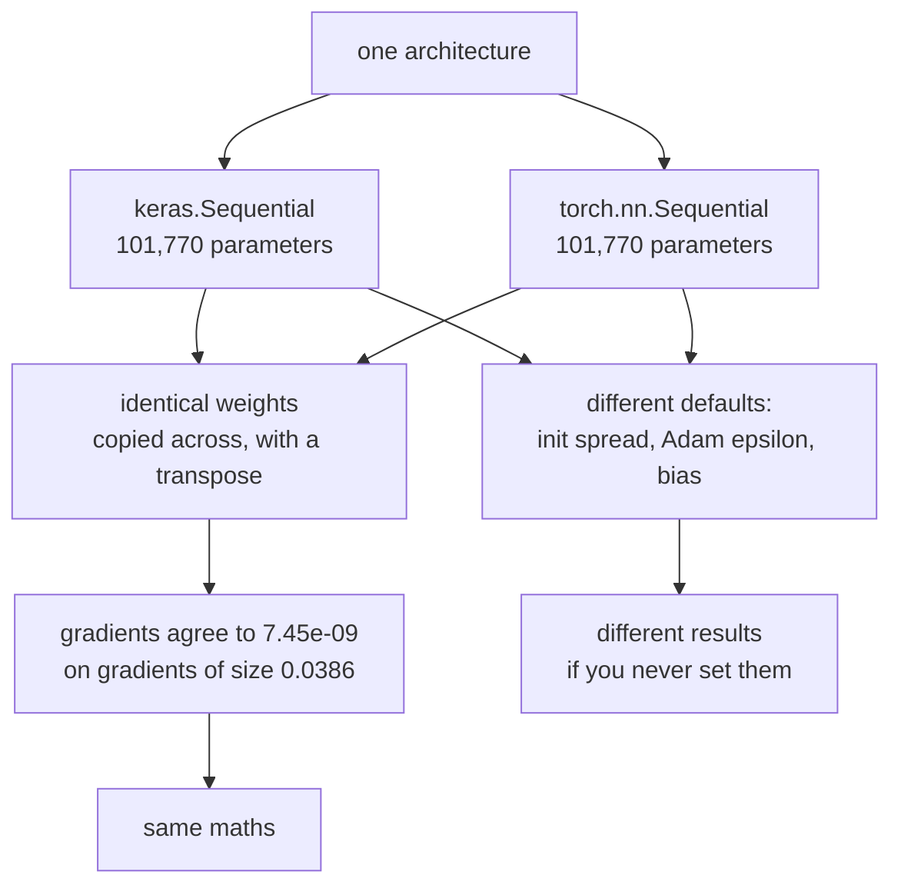

Every other page in this module is Keras. That is a deliberate choice — learning one
framework properly beats learning two badly — but it leaves an obvious question
unanswered: how much of what you have learned is about **neural networks**, and how much
is about **TensorFlow**?

This page answers it by measurement. The same architecture is built in both frameworks,
given byte-identical weights, and run on the same batch. Whatever differs is
framework; whatever matches is the subject.

## What you'll learn

- The line-by-line translation between `keras.Sequential` and `torch.nn.Sequential`.
- What `fit()` hides, written out as the loop PyTorch makes you write yourself.
- The measured agreement: gradients matching to **7.45e-09** on gradients of size 0.0386.
- Identical training producing **identical accuracy**, and where the wall clock differs.
- The differences that are real and easy to miss: **initialisers, `epsilon`, and bias**.

## The same model, twice

```python
# Keras
model = keras.Sequential([
    keras.layers.Input((784,)),
    keras.layers.Dense(128, activation="relu"),
    keras.layers.Dense(10),
])

# PyTorch
model = nn.Sequential(
    nn.Linear(784, 128),
    nn.ReLU(),
    nn.Linear(128, 10),
)
```

Both report **101,770 parameters**. Three differences are visible immediately and all
three are notation:

- **Activations are layers in PyTorch.** Keras folds `relu` into `Dense` as an argument;
  `nn.Sequential` needs `nn.ReLU()` as its own entry. There is no computational
  difference — Keras is applying exactly the same function after the matrix multiply.
- **PyTorch needs no `Input`.** Shapes are inferred when data first flows through, so
  `nn.Linear(784, 128)` states its input size directly rather than deriving it.
- **Weight matrices are transposed.** Keras stores a `Dense` kernel as `(in, out)`;
  `torch.nn.Linear` stores it as `(out, in)`. Copying weights between them requires a
  `.T`, and forgetting it is the single most common way this comparison goes wrong —
  the shapes happen to be compatible when `in == out`, so it fails silently on square
  layers.

## Do they compute the same thing?

Give both models identical weights, push the same 256-row batch through, take the loss
and one backward pass:

<Figure
  src="/images/dl/phase-01-foundations/the-same-network-in-pytorch/agreement"
  alt="Horizontal bars on a log axis showing the absolute difference between Keras and PyTorch for six quantities: forward logits at 4.17e-07, loss at 2.38e-07, and four gradient tensors between 7.45e-09 and 1.86e-08. A dashed line marks 1e-6, and every bar is to the left of it."
  title="Identical weights, identical 256-row batch"
  caption="Every difference is at or below 4.17e-07 while the gradients themselves reach 0.0386 — so the relative disagreement is around 1e-5 at worst and 1e-7 typically. That is float32 rounding, not a difference in the mathematics. The forward pass disagrees more than the gradients do, which is the ordering you would expect: the logits are the largest numbers in the computation, so they carry the most absolute rounding error."
/>

| Quantity | Largest absolute difference |
| --- | --- |
| Forward logits | 4.17e-07 |
| Loss | 2.38e-07 |
| Gradient: layer 1 weight | **7.45e-09** |
| Gradient: layer 1 bias | 9.31e-09 |
| Gradient: layer 2 weight | 1.86e-08 |
| Gradient: layer 2 bias | 8.38e-09 |

Read those against the scale of the thing being measured. The gradients reach **0.0386**,
so a disagreement of 7.45e-09 is roughly **one part in five million** — the two libraries
are running the same arithmetic in a different order and float32 is rounding differently.

**This is the page's main result.** Backpropagation, cross-entropy, ReLU and dense layers
are not TensorFlow features. Everything Phase 1 taught transfers unchanged.

## What `fit()` was doing

The frameworks diverge sharply in what they hand you. Keras gives you `fit()`. PyTorch
gives you the loop:

```python
# What Keras does for you, written out
optimiser = torch.optim.SGD(model.parameters(), lr=0.1)
for epoch in range(EPOCHS):
    for start in range(0, len(x), BATCH):
        batch_x = torch.tensor(x[start:start + BATCH])
        batch_y = torch.tensor(y[start:start + BATCH])
        optimiser.zero_grad()                                   # 1
        loss = F.cross_entropy(model(batch_x), batch_y)         # 2
        loss.backward()                                         # 3
        optimiser.step()                                        # 4
```

Four lines, and each one corresponds to something `fit()` does silently:

1. **`zero_grad()`** — PyTorch *accumulates* gradients into `.grad`, so they must be
   cleared. This is the same `+=` accumulation the
   [autograd page](/deep-learning/phase-01---neural-network-foundations/autograd-from-scratch/)
   builds by hand, and it is deliberate: it lets you sum gradients across several
   backward passes. Forget it and every step uses the sum of all previous gradients.
2. **The forward pass and loss**, identical in substance to Keras's `compile(loss=...)`.
3. **`backward()`** — walks the recorded graph. `GradientTape` records the same graph;
   the difference is that a tape is opened explicitly and PyTorch records always.
4. **`step()`** — applies the update. Keras's `apply_gradients`, spelled shorter.

Whether that is a cost or a benefit depends entirely on what you are doing, and the
honest answer is that Phase 8's
[custom training loops](/deep-learning/phase-08---scaling--deploying-deep-models/custom-models-and-training-loops-tensorflow/)
page has you writing the same four steps in TensorFlow the moment you need control.



## Training them side by side

Same initial weights, same batch order, same optimiser and learning rate, eight epochs,
three seeds:

<Figure
  src="/images/dl/phase-01-foundations/the-same-network-in-pytorch/training-parity"
  alt="Left: training loss per epoch for Keras and PyTorch, two curves lying on top of each other and ending at 0.2204 and 0.2203. Right: grouped bars of test accuracy at 0.8990 for both, and wall clock at 3.9 seconds for Keras against 2.1 for PyTorch."
  title="MNIST, 12,000 rows, SGD at 0.1, 8 epochs, 3 seeds"
  caption="The loss curves are indistinguishable and the final losses differ by 0.000184. Test accuracy is 0.8990 for both, to four decimal places, with the same 0.0040 spread across seeds — the seeds move both frameworks identically because they start from the same weights. The only column that separates them is wall clock: 2.1 s against 3.9 s, and that gap is about framework overhead on a small model, not about arithmetic."
/>

| | Keras | PyTorch |
| --- | --- | --- |
| Final training loss | 0.2204 | 0.2203 |
| Test accuracy | **0.8990** | **0.8990** |
| Spread across 3 seeds | 0.0040 | 0.0040 |
| Seconds for 8 epochs | 3.9 | **2.1** |

The accuracy gap is **0.0000**. Do not over-read the timing: this is a 101,770-parameter
model on CPU, where per-step framework overhead dominates and PyTorch's eager loop has
less of it than `fit()`'s callback and metric machinery. On a large model on a GPU the
comparison is different, and neither of those is available here to test it.

## The differences that actually bite

The mathematics matches. The **defaults** do not, and they are the reason two "identical"
models can train differently when nobody has made a mistake.

<Figure
  src="/images/dl/phase-01-foundations/the-same-network-in-pytorch/defaults"
  alt="Left: bars of the standard deviation of initial weights for a 784-to-128 layer, 0.04687 for Keras with glorot_uniform against 0.02061 for torch with kaiming_uniform. Right: grouped bars on a log axis of Adam defaults — learning rate 0.001 for both, epsilon 1e-07 against 1e-08, beta_1 0.9 for both."
  title="784 → 128 layer and a fresh Adam, straight out of the box"
  caption="Same layer, same shape, weights initialised 2.3x apart: Keras uses glorot_uniform at sd 0.04687, torch uses kaiming_uniform(a=sqrt(5)) at sd 0.02061. Adam agrees on the learning rate and the betas but not on epsilon — 1e-7 against 1e-8, a factor of ten in the term that stops division by zero. Neither is wrong; they are different conventions, and a model that trains in one framework and not the other is usually meeting one of them."
/>

| Default | Keras | PyTorch |
| --- | --- | --- |
| Dense/Linear initialiser | `glorot_uniform` | `kaiming_uniform(a=√5)` |
| Initial weight sd (784 → 128) | 0.04687 | **0.02061** |
| Initial bias | **all zeros** | uniform, up to 0.03538 |
| Adam learning rate | 0.001 | 0.001 |
| Adam `beta_1` | 0.9 | 0.9 |
| Adam `epsilon` | 1e-07 | **1e-08** |

Three things to take from that table.

**The initialisers differ by 2.3×.** Keras's Glorot scales by fan-in *and* fan-out;
PyTorch's Kaiming variant scales by fan-in alone with a gain fixed for a leaky-ReLU slope
of √5 — a default that is famously not what most people would choose deliberately. Since
[Phase 2 measures](/deep-learning/phase-02---training-deep-neural-networks/vanishing--exploding-gradients/)
how much initial scale matters to deep networks, this is not cosmetic.

**PyTorch initialises biases randomly; Keras zeros them.** A small difference on one
layer, and one more reason two fresh models diverge.

**Adam's `epsilon` differs by 10×.** It rarely matters — until you are training in float16,
where 1e-8 underflows and 1e-7 does not. Phase 8's
[mixed precision page](/deep-learning/phase-08---scaling--deploying-deep-models/mixed-precision-and-multi-gpu-training/)
is where that stops being trivia.

:::caution[The transpose]
`Dense` stores its kernel as `(in, out)`; `nn.Linear` stores it as `(out, in)`. Copying
weights across without `.T` raises a shape error on a rectangular layer — and **silently
succeeds on a square one**, giving a model that runs, trains, and is wrong. Every weight
transfer on this page ends in a numerical check for exactly that reason.
:::

```p5 title="The same layer, two defaults" desc="Click a framework. The histogram is the measured spread of initial weights for a 784 to 128 layer under each library's default initialiser." height="360"
let picked = 0;
const FRAMEWORKS = [
  ["Keras", 0.04687, 0.08111, "glorot_uniform", 0.0],
  ["PyTorch", 0.02061, 0.03571, "kaiming_uniform(a=sqrt(5))", 0.03538],
];
function setup() {
  createCanvas(620, 360);
  textFont("monospace");
  noiseSeed(7);
}
function draw() {
  background(13, 17, 23);
  noStroke();
  fill(230);
  textSize(12);
  textAlign(LEFT, TOP);
  text("a fresh 784 -> 128 layer, nothing configured", 26, 18);
  for (let i = 0; i < FRAMEWORKS.length; i++) {
    const x = 26 + i * 140;
    if (i === picked) { fill(255, 211, 67); } else { fill(48, 56, 68); }
    rect(x, 44, 128, 26, 4);
    if (i === picked) { fill(13, 17, 23); } else { fill(190); }
    textSize(11);
    textAlign(CENTER, CENTER);
    text(FRAMEWORKS[i][0], x + 64, 57);
    textAlign(LEFT, TOP);
  }
  const row = FRAMEWORKS[picked];
  const limit = 0.09;
  const baseY = 250;
  stroke(60, 70, 84);
  strokeWeight(1);
  line(26, baseY, 566, baseY);
  noStroke();
  // A uniform initialiser: draw the band it fills, to scale against the other.
  const halfWidth = (row[2] / limit) * 270;
  fill(picked === 0 ? color(107, 169, 221) : color(255, 211, 67));
  rect(296 - halfWidth, baseY - 90, halfWidth * 2, 90);
  fill(150);
  textSize(9);
  textAlign(CENTER, TOP);
  text("-" + row[2].toFixed(5), 296 - halfWidth, baseY + 6);
  text("+" + row[2].toFixed(5), 296 + halfWidth, baseY + 6);
  text("0", 296, baseY + 6);
  textAlign(LEFT, TOP);
  fill(230);
  textSize(11);
  text(row[3], 26, 92);
  fill(180);
  textSize(10);
  text("standard deviation: " + row[1].toFixed(5), 26, 112);
  text("largest weight:     " + row[2].toFixed(5), 26, 130);
  text("largest bias:       " + row[4].toFixed(5)
       + (row[4] === 0 ? "  (biases are zeroed)" : "  (biases are random)"),
       26, 148);
  fill(255, 211, 67);
  textSize(10);
  const ratio = (FRAMEWORKS[0][1] / FRAMEWORKS[1][1]).toFixed(2);
  text("Keras starts " + ratio + "x wider than PyTorch on this layer", 26, 286);
  fill(150);
  textSize(9);
  text("both are uniform; the bar above is the range each one fills. Nothing", 26, 310);
  text("here is a bug - they are different conventions, and a network that", 26, 324);
  text("trains in one framework and not the other often meets one of them.", 26, 338);
}
function mousePressed() {
  for (let i = 0; i < FRAMEWORKS.length; i++) {
    const x = 26 + i * 140;
    if (mouseX > x && mouseX < x + 128 && mouseY > 44 && mouseY < 70) {
      picked = i;
    }
  }
}
```

## Which one should you use?

Not a question this page can settle with a measurement, so here is the honest version.

**The maths is the same**, to 7.45e-09. Nothing you learn about networks in one is wasted
in the other.

**Keras is faster to write** for anything that fits the `fit()` shape, and most supervised
training does. PyTorch's loop is four lines you will write correctly the second time and
forget `zero_grad()` in on the first.

**PyTorch dominates research code**, so papers, reference implementations and pretrained
checkpoints are disproportionately in it. That is an ecosystem fact rather than a
technical one, and it is the strongest practical argument.

**The deployment stories differ.** Phase 8's SavedModel, TensorFlow Lite and TF Serving
pages have direct PyTorch equivalents (TorchScript, ExecuTorch, TorchServe) with the same
shape and different names.

```p5 title="The measured table, ranked" desc="Click a column to rank every row by it. The bars are that column's values and the highest and lowest are computed from the numbers, not written in." height="306"
let metric = 0;
const COLUMNS = ["Largest absolute difference"];
const ROWS = [
  ["Forward logits", 4.2e-07],
  ["Loss", 2.4e-07],
  ["Gradient: layer 1 weight", 1e-08],
  ["Gradient: layer 1 bias", 1e-08],
  ["Gradient: layer 2 weight", 2e-08],
  ["Gradient: layer 2 bias", 1e-08]
];
function setup() {
  createCanvas(620, 306);
  textFont("monospace");
}
function fmt(v) {
  if (v === 0) { return "0"; }
  const a = Math.abs(v);
  if (a >= 1000 || a < 0.001) { return v.toExponential(2); }
  if (a >= 100) { return v.toFixed(1); }
  return v.toFixed(4);
}
function draw() {
  background(13, 17, 23);
  noStroke();
  fill(230);
  textSize(12);
  textAlign(LEFT, TOP);
  text("The Same Network in PyTorch", 26, 16);
  let x = 26;
  for (let i = 0; i < COLUMNS.length; i++) {
    const w = COLUMNS[i].length * 6.6 + 16;
    if (i === metric) { fill(255, 211, 67); } else { fill(48, 56, 68); }
    rect(x, 40, w, 22, 4);
    if (i === metric) { fill(13, 17, 23); } else { fill(180); }
    textSize(9);
    text(COLUMNS[i], x + 8, 47);
    x += w + 6;
    if (x > 500) { break; }
  }
  const values = ROWS.map((r) => r[metric + 1]);
  const lo = Math.min(...values);
  const hi = Math.max(...values);
  const span = hi - lo === 0 ? 1 : hi - lo;
  const order = ROWS.slice().sort((a, b) => b[metric + 1] - a[metric + 1]);
  for (let i = 0; i < order.length; i++) {
    const y = 78 + i * 26;
    const v = order[i][metric + 1];
    fill(160);
    textSize(9);
    text(order[i][0], 26, y + 5);
    fill(34, 40, 50);
    rect(230, y, 280, 18, 3);
    const frac = (v - lo) / span;
    if (v === hi) { fill(126, 192, 143); }
    else if (v === lo) { fill(224, 108, 117); }
    else { fill(107, 169, 221); }
    rect(230, y, Math.max(frac * 280, 3), 18, 3);
    fill(225);
    textSize(9);
    text(fmt(v), 518, y + 5);
  }
  const top = order[0];
  const bottom = order[order.length - 1];
  fill(150);
  textSize(9);
  const base = 78 + order.length * 26 + 8;
  text("highest " + COLUMNS[metric] + ": " + top[0] + " at " + fmt(top[1]),
       26, base);
  text("lowest  " + COLUMNS[metric] + ": " + bottom[0] + " at "
       + fmt(bottom[1]), 26, base + 14);
  text("bars are scaled within the chosen column - lowest is not zero", 26,
       base + 30);
}
function mousePressed() {
  let x = 26;
  for (let i = 0; i < COLUMNS.length; i++) {
    const w = COLUMNS[i].length * 6.6 + 16;
    if (mouseX > x && mouseX < x + w && mouseY > 40 && mouseY < 62) {
      metric = i;
    }
    x += w + 6;
  }
}
```

## Pitfalls

- **Copying weights without transposing.** `(in, out)` against `(out, in)`. Silent on
  square layers.
- **Forgetting `zero_grad()`.** Gradients accumulate by design; the model trains on the
  running sum and diverges in a way that looks like a bad learning rate.
- **Assuming identical defaults.** The initialiser differs by 2.3× and Adam's `epsilon` by
  10×, before you have written a line of your own.
- **Reading the wall clock as a framework ranking.** 2.1 s against 3.9 s is per-step
  overhead on a small CPU model, measured with no GPU present.
- **Calling `.numpy()` on a tensor that requires grad.** PyTorch raises; use
  `.detach().numpy()`, which is the explicit version of the same thing `GradientTape`
  handles by scoping.
- **Comparing `model.eval()` and `training=False` casually.** Both switch dropout and
  batch-norm behaviour, and both are easy to forget — the resulting metric is wrong but
  entirely plausible.

## Recap

- The same architecture is **101,770 parameters** in both frameworks.
- With identical weights, gradients agree to **7.45e-09** against gradients of size
  0.0386 — roughly one part in five million, which is float32 rounding.
- Trained identically, both reach **0.8990** test accuracy with the same 0.0040 seed
  spread; final losses differ by 0.000184.
- Wall clock differed: **2.1 s against 3.9 s** for 8 epochs, which is per-step overhead on
  a small CPU model rather than a general ranking.
- `fit()` is the four-line loop — `zero_grad`, forward, `backward`, `step` — and PyTorch
  makes you write it.
- The real differences are **defaults**: initial weight sd 0.04687 against 0.02061,
  zeroed biases against random ones, and Adam's `epsilon` at 1e-7 against 1e-8.

## Next

Back to the first complete project, in Keras:
[First Example — Classifying Movie Reviews (IMDB)](/deep-learning/phase-01---neural-network-foundations/first-example-classifying-movie-reviews-imdb-binary/).

<Quiz
  questions={[
    {
      q: "With identical weights, Keras and PyTorch gradients differed by at most 7.45e-09 while the gradients themselves reached 0.0386. What does that establish?",
      options: [
        "One of the frameworks has a small bug",
        "The two libraries implement the same mathematics and differ only in float32 rounding, so everything you learn about networks transfers between them",
        "PyTorch is more numerically accurate",
        "The comparison was not set up correctly"
      ],
      answer: 1,
      explanation: "A relative disagreement around one part in five million is what you get from summing the same numbers in a different order in float32. There is nothing left over to attribute to a difference in method."
    },
    {
      q: "Why must PyTorch code call `optimiser.zero_grad()` before every backward pass?",
      options: [
        "To free memory",
        "Because gradients accumulate into `.grad` by design — without clearing, each step uses the sum of all previous gradients",
        "To reset the learning rate",
        "Because the optimiser caches the last update"
      ],
      answer: 1,
      explanation: "Accumulation is deliberate: it lets you sum gradients across several backward passes. It is the same `+=` the autograd page builds by hand, and Keras hides the clearing inside `apply_gradients`."
    },
    {
      q: "A `Dense` kernel is stored as (in, out) and `nn.Linear` as (out, in). Why is this the most dangerous difference on the page?",
      options: [
        "It makes the models different sizes",
        "Because copying weights without the transpose raises a shape error on a rectangular layer but SILENTLY succeeds on a square one, producing a model that runs and is wrong",
        "It changes the parameter count",
        "It breaks the optimiser"
      ],
      answer: 1,
      explanation: "A failure that raises is cheap. A failure that trains to a plausible-looking accuracy is the expensive kind, which is why every transfer here ends in a numerical check."
    },
    {
      q: "A fresh 784 → 128 layer initialises at sd 0.04687 in Keras and 0.02061 in PyTorch. Is one of them wrong?",
      options: [
        "Yes, PyTorch's is too small",
        "No — Keras defaults to glorot_uniform (scaled by fan-in and fan-out) and PyTorch to kaiming_uniform with a gain fixed for a leaky-ReLU slope of √5; they are different conventions",
        "Yes, Keras ignores the activation function",
        "No, and the difference has no practical effect"
      ],
      answer: 1,
      explanation: "Neither is a bug, and it is not harmless either: Phase 2 measures how much initial scale matters to deep networks. Two 'identical' models diverging with nobody at fault usually starts here."
    },
    {
      q: "Both frameworks reached exactly 0.8990 test accuracy, but PyTorch took 2.1 s against Keras's 3.9 s. What is the defensible conclusion about speed?",
      options: [
        "PyTorch is roughly twice as fast",
        "On a 101,770-parameter model on CPU, per-step framework overhead dominates and PyTorch's eager loop carries less of it — a claim about this model on this hardware, not a ranking",
        "Keras is poorly optimised",
        "The timing is measurement noise"
      ],
      answer: 1,
      explanation: "`fit()` runs callback and metric machinery per step that the bare loop does not. Scale the model or add a GPU and the comparison changes, and neither was available here to test."
    },
    {
      q: "Adam's default `epsilon` is 1e-7 in Keras and 1e-8 in PyTorch. When does that matter?",
      options: [
        "Never — it is only there to avoid division by zero",
        "In float16 training, where 1e-8 underflows to zero and 1e-7 does not, so the term that was meant to guarantee a non-zero denominator stops doing so",
        "Whenever the learning rate is above 0.001",
        "Only for very deep networks"
      ],
      answer: 1,
      explanation: "It is trivia in float32 and a real failure mode in mixed precision. The value exists to keep the denominator non-zero, and a value that itself underflows cannot do that."
    }
  ]}
/>

## 🧪 Try It Yourself

<DataCampExercise
  lang="python"
  hint={`Keras keeps a Dense kernel as (in, out) and torch keeps a Linear weight as (out, in), so one of them needs transposing.`}
  code={`# Task: Exercise 1 - The transpose, and why it hides on square layers
import numpy as np

SHAPES = ((784, 128), (128, 10), (64, 64), (256, 256))

print(f"{'layer':>12} {'Keras kernel':>14} {'torch weight':>14} "
      f"{'copy without .T?':>18}")
for inputs, outputs in SHAPES:
    keras_shape = (inputs, outputs)
    torch_shape = (outputs, ___)                 # replace ___ with inputs
    fits = keras_shape == torch_shape
    print(f"{f'{inputs}x{outputs}':>12} {str(keras_shape):>14} "
          f"{str(torch_shape):>14} "
          f"{('SILENTLY OK' if fits else 'raises'):>18}")

print("\\nthe two rectangular layers raise a shape error, which is the good")
print("case - you find out immediately. The two SQUARE layers copy cleanly")
print("and give you a model that runs, trains, and computes the transpose of")
print("what you meant. That is why every transfer here ends in a numeric check")`}
  solution={`import numpy as np

SHAPES = ((784, 128), (128, 10), (64, 64), (256, 256))

print(f"{'layer':>12} {'Keras kernel':>14} {'torch weight':>14} "
      f"{'copy without .T?':>18}")
for inputs, outputs in SHAPES:
    keras_shape = (inputs, outputs)
    torch_shape = (outputs, inputs)
    fits = keras_shape == torch_shape
    print(f"{f'{inputs}x{outputs}':>12} {str(keras_shape):>14} "
          f"{str(torch_shape):>14} "
          f"{('SILENTLY OK' if fits else 'raises'):>18}")

print("\\nthe two rectangular layers raise a shape error, which is the good")
print("case - you find out immediately. The two SQUARE layers copy cleanly")
print("and give you a model that runs, trains, and computes the transpose of")
print("what you meant. That is why every transfer here ends in a numeric check")`}
  sct={`test_output_contains("raises", pattern=False)
test_output_contains("SILENTLY OK", pattern=False)
success_msg("Square layers copy without an error even when the weights are transposed, which is exactly why the shape check cannot catch this bug.")`}
  height={363}
/>

<DataCampExercise
  lang="python"
  hint={`Gradients accumulate: calling backward twice without clearing gives you the sum. Clear the gradient before each backward call.`}
  code={`# Task: Exercise 2 - What zero_grad() is actually for
import numpy as np


class Param:
    def __init__(self, value):
        self.value = value
        self.grad = None

    def zero_grad(self):
        self.grad = None

    def backward(self, x):
        # loss = (value * x) ** 2, so d loss / d value = 2 * x * (value * x)
        g = 2 * x * (self.value * x)
        self.grad = g if self.grad is None else self.grad + g


running = Param(2.0)
fresh = Param(2.0)
print("call  without zero_grad  with zero_grad")
for call in range(1, 5):
    running.backward(3.0)
    fresh.___()   # replace ___ with zero_grad
    fresh.backward(3.0)
    print(format(call, "4d"), format(running.grad, "17.1f"), format(fresh.grad, "15.1f"))

print("the correct gradient is 36.0 every time. Without clearing, the")
print("second step uses 72, the third 108, the fourth 144 - the model takes")
print("bigger and bigger steps and diverges in a way that looks exactly like")
print("a learning rate that is too high")`}
  solution={`import numpy as np


class Param:
    def __init__(self, value):
        self.value = value
        self.grad = None

    def zero_grad(self):
        self.grad = None

    def backward(self, x):
        # loss = (value * x) ** 2, so d loss / d value = 2 * x * (value * x)
        g = 2 * x * (self.value * x)
        self.grad = g if self.grad is None else self.grad + g


running = Param(2.0)
fresh = Param(2.0)
print("call  without zero_grad  with zero_grad")
for call in range(1, 5):
    running.backward(3.0)
    fresh.zero_grad()
    fresh.backward(3.0)
    print(format(call, "4d"), format(running.grad, "17.1f"), format(fresh.grad, "15.1f"))

print("the correct gradient is 36.0 every time. Without clearing, the")
print("second step uses 72, the third 108, the fourth 144 - the model takes")
print("bigger and bigger steps and diverges in a way that looks exactly like")
print("a learning rate that is too high")`}
  sct={`test_output_contains("144.0", pattern=False)
test_output_contains("the correct gradient is 36.0 every time", pattern=False)
success_msg("Gradients accumulate, so without clearing them the fourth step sees 144 instead of 36. It looks exactly like a learning rate that is too high.")`}
  height={460}
/>

<DataCampExercise
  lang="python"
  hint={`Glorot scales by fan-in plus fan-out; Kaiming with gain for a sqrt(5) slope scales by fan-in alone.`}
  code={`# Task: Exercise 3 - Where the two initialisers come from
import numpy as np

SHAPES = ((784, 128), (128, 10), (512, 512), (4096, 1024))

print(f"{'layer':>12} {'glorot sd':>11} {'kaiming sd':>12} {'ratio':>8}")
for fan_in, fan_out in SHAPES:
    # glorot_uniform: limit = sqrt(6 / (fan_in + fan_out))
    glorot_limit = np.sqrt(6.0 / (fan_in + fan_out))
    # kaiming_uniform(a=sqrt(5)): gain = sqrt(2 / (1 + 5)), limit = gain*sqrt(3/fan_in)
    kaiming_limit = np.sqrt(2.0 / 6.0) * np.sqrt(3.0 / ___)   # use fan_in
    # a uniform(-L, L) has standard deviation L / sqrt(3)
    glorot_sd = glorot_limit / np.sqrt(3)
    kaiming_sd = kaiming_limit / np.sqrt(3)
    print(f"{f'{fan_in}x{fan_out}':>12} {glorot_sd:11.5f} {kaiming_sd:12.5f} "
          f"{glorot_sd / kaiming_sd:8.2f}")

print("\\nthe measured layer on this page is 784x128: glorot 0.04687 against")
print("kaiming 0.02061, a ratio of 2.27 - which these formulas reproduce.")
print("the gap is smallest on the SQUARE layer (1.73) and larger whenever")
print("fan_in and fan_out differ, because only glorot looks at fan_out at")
print("all - so how much this matters depends on the layer shape")`}
  solution={`import numpy as np

SHAPES = ((784, 128), (128, 10), (512, 512), (4096, 1024))

print(f"{'layer':>12} {'glorot sd':>11} {'kaiming sd':>12} {'ratio':>8}")
for fan_in, fan_out in SHAPES:
    # glorot_uniform: limit = sqrt(6 / (fan_in + fan_out))
    glorot_limit = np.sqrt(6.0 / (fan_in + fan_out))
    # kaiming_uniform(a=sqrt(5)): gain = sqrt(2 / (1 + 5)), limit = gain*sqrt(3/fan_in)
    kaiming_limit = np.sqrt(2.0 / 6.0) * np.sqrt(3.0 / fan_in)
    # a uniform(-L, L) has standard deviation L / sqrt(3)
    glorot_sd = glorot_limit / np.sqrt(3)
    kaiming_sd = kaiming_limit / np.sqrt(3)
    print(f"{f'{fan_in}x{fan_out}':>12} {glorot_sd:11.5f} {kaiming_sd:12.5f} "
          f"{glorot_sd / kaiming_sd:8.2f}")

print("\\nthe measured layer on this page is 784x128: glorot 0.04687 against")
print("kaiming 0.02061, a ratio of 2.27 - which these formulas reproduce.")
print("the gap is smallest on the SQUARE layer (1.73) and larger whenever")
print("fan_in and fan_out differ, because only glorot looks at fan_out at")
print("all - so how much this matters depends on the layer shape")`}
  sct={`test_output_contains("0.04683      0.02062     2.27", pattern=False)
test_output_contains("0.04419      0.02552     1.73", pattern=False)
success_msg("Glorot looks at fan_in plus fan_out and Kaiming only at fan_in, so they differ most on layers whose two sizes differ.")`}
  height={414}
/>

<DataCampExercise
  lang="python"
  hint={`Build the same network both ways, copy the weights across with a transpose, and compare the outputs.`}
  code={`# Task: Exercise 4 - Prove it yourself
import numpy as np

rng = np.random.RandomState(0)
probe = rng.normal(0, 1, (64, 20))

# Keras style: kernel stored as (in, out), output = x @ kernel + bias
k1, b1 = rng.normal(0, 0.3, (20, 16)), rng.normal(0, 0.1, 16)
k2, b2 = rng.normal(0, 0.3, (16, 4)), rng.normal(0, 0.1, 4)


def keras_style(x):
    return np.maximum(x @ k1 + b1, 0) @ k2 + b2


# Torch style: weight stored as (out, in), output = x @ weight.T + bias
t1 = k1.___   # replace ___ with T
t2 = k2.T


def torch_style(x):
    return np.maximum(x @ t1.T + b1, 0) @ t2.T + b2


keras_out = keras_style(probe)
torch_out = torch_style(probe)
print("weight shapes: keras", k1.shape, " torch", t1.shape)
print("outputs match:", bool(np.allclose(keras_out, torch_out)))
print("largest difference is below 1e-12:", float(np.abs(keras_out - torch_out).max()) < 1e-12)
print("parameters:", k1.size + b1.size + k2.size + b2.size)`}
  solution={`import numpy as np

rng = np.random.RandomState(0)
probe = rng.normal(0, 1, (64, 20))

# Keras style: kernel stored as (in, out), output = x @ kernel + bias
k1, b1 = rng.normal(0, 0.3, (20, 16)), rng.normal(0, 0.1, 16)
k2, b2 = rng.normal(0, 0.3, (16, 4)), rng.normal(0, 0.1, 4)


def keras_style(x):
    return np.maximum(x @ k1 + b1, 0) @ k2 + b2


# Torch style: weight stored as (out, in), output = x @ weight.T + bias
t1 = k1.T
t2 = k2.T


def torch_style(x):
    return np.maximum(x @ t1.T + b1, 0) @ t2.T + b2


keras_out = keras_style(probe)
torch_out = torch_style(probe)
print("weight shapes: keras", k1.shape, " torch", t1.shape)
print("outputs match:", bool(np.allclose(keras_out, torch_out)))
print("largest difference is below 1e-12:", float(np.abs(keras_out - torch_out).max()) < 1e-12)
print("parameters:", k1.size + b1.size + k2.size + b2.size)`}
  sct={`test_output_contains("weight shapes: keras (20, 16)  torch (16, 20)", pattern=False)
test_output_contains("outputs match: True", pattern=False)
test_output_contains("parameters: 404", pattern=False)
success_msg("Transposing the stored weights gives the same function: only the storage layout differs between the two conventions.")`}
  height={460}
/>

<DataCampExercise
  lang="python"
  hint={`Write the four steps: clear, forward, backward, step. The loss should fall.`}
  code={`# Task: Exercise 5 - Write the loop fit() hides
import numpy as np

rng = np.random.RandomState(0)
x = rng.normal(0, 1, (512, 10))
true_w = rng.normal(0, 1, (10, 1))
y = x @ true_w + rng.normal(0, 0.1, (512, 1))

params = {"w1": 0.3 * rng.randn(10, 32), "b1": np.zeros(32),
          "w2": 0.3 * rng.randn(32, 1), "b2": np.zeros(1)}
grads = {}


class SGD:
    def __init__(self, params, lr):
        self.params, self.lr = params, lr

    def zero_grad(self):
        grads.clear()

    def step(self):
        for name in self.params:
            self.params[name] -= self.lr * grads[name]


def forward(x):
    h = np.maximum(x @ params["w1"] + params["b1"], 0)
    return h, h @ params["w2"] + params["b2"]


def backward(x, y):
    h, out = forward(x)
    d_out = 2 * (out - y) / len(y)
    grads["w2"] = h.T @ d_out
    grads["b2"] = d_out.sum(axis=0)
    d_h = (d_out @ params["w2"].T) * (h > 0)
    grads["w1"] = x.T @ d_h
    grads["b1"] = d_h.sum(axis=0)


optimiser = SGD(params, lr=0.05)
losses = []
for epoch in range(1, 41):
    optimiser.zero_grad()                       # 1 clear
    loss = float(np.mean((forward(x)[1] - y) ** 2))   # 2 forward
    backward(x, y)                              # 3 backward
    optimiser.___()                        # 4 step   # replace ___ with step
    losses.append(loss)

print("first loss is positive:", losses[0] > 0)
print("the loss fell during training:", losses[-1] < losses[0])
print("the loss fell by more than half:", losses[-1] < 0.5 * losses[0])
print("four lines, in that order. Swap steps 3 and 4 and the optimiser")
print("applies whatever was in the gradients from last time; drop step 1 and the")
print("gradients pile up")`}
  solution={`import numpy as np

rng = np.random.RandomState(0)
x = rng.normal(0, 1, (512, 10))
true_w = rng.normal(0, 1, (10, 1))
y = x @ true_w + rng.normal(0, 0.1, (512, 1))

params = {"w1": 0.3 * rng.randn(10, 32), "b1": np.zeros(32),
          "w2": 0.3 * rng.randn(32, 1), "b2": np.zeros(1)}
grads = {}


class SGD:
    def __init__(self, params, lr):
        self.params, self.lr = params, lr

    def zero_grad(self):
        grads.clear()

    def step(self):
        for name in self.params:
            self.params[name] -= self.lr * grads[name]


def forward(x):
    h = np.maximum(x @ params["w1"] + params["b1"], 0)
    return h, h @ params["w2"] + params["b2"]


def backward(x, y):
    h, out = forward(x)
    d_out = 2 * (out - y) / len(y)
    grads["w2"] = h.T @ d_out
    grads["b2"] = d_out.sum(axis=0)
    d_h = (d_out @ params["w2"].T) * (h > 0)
    grads["w1"] = x.T @ d_h
    grads["b1"] = d_h.sum(axis=0)


optimiser = SGD(params, lr=0.05)
losses = []
for epoch in range(1, 41):
    optimiser.zero_grad()                       # 1 clear
    loss = float(np.mean((forward(x)[1] - y) ** 2))   # 2 forward
    backward(x, y)                              # 3 backward
    optimiser.step()                        # 4 step
    losses.append(loss)

print("first loss is positive:", losses[0] > 0)
print("the loss fell during training:", losses[-1] < losses[0])
print("the loss fell by more than half:", losses[-1] < 0.5 * losses[0])
print("four lines, in that order. Swap steps 3 and 4 and the optimiser")
print("applies whatever was in the gradients from last time; drop step 1 and the")
print("gradients pile up")`}
  sct={`test_output_contains("the loss fell during training: True", pattern=False)
test_output_contains("the loss fell by more than half: True", pattern=False)
success_msg("Clear, forward, backward, step: four lines are all a training loop is, and the loss falls when they run in that order.")`}
  height={460}
/>

<DataCampExercise
  lang="python"
  hint={`Compare the two epsilon values against the smallest number float16 can represent.`}
  code={`# Task: Exercise 6 - When Adam's epsilon stops being trivia
import numpy as np

KERAS_EPS = 1e-7
TORCH_EPS = 1e-8

for dtype in (np.float32, np.float16):
    info = np.finfo(dtype)
    print(f"\\n=== {dtype.__name__} ===")
    print(f"smallest normal value: {float(info.tiny):.3e}")
    print(f"smallest subnormal:    {float(info.smallest_subnormal):.3e}")
    for name, eps in (("Keras 1e-7", KERAS_EPS), ("torch 1e-8", TORCH_EPS)):
        stored = dtype(eps)
        survives = float(stored) > ___                # replace ___ with 0.0
        print(f"{name:12s} stored as {float(stored):.3e}  "
              f"{'survives' if survives else 'UNDERFLOWS TO ZERO'}")

print("\\nboth survive in float32, which is why this looks like trivia.")
print("The point of epsilon is to guarantee a non-zero denominator, so a")
print("value that itself rounds toward zero in a lower precision stops")
print("doing the one job it has - see the mixed-precision page for the rest")`}
  solution={`import numpy as np

KERAS_EPS = 1e-7
TORCH_EPS = 1e-8

for dtype in (np.float32, np.float16):
    info = np.finfo(dtype)
    print(f"\\n=== {dtype.__name__} ===")
    print(f"smallest normal value: {float(info.tiny):.3e}")
    print(f"smallest subnormal:    {float(info.smallest_subnormal):.3e}")
    for name, eps in (("Keras 1e-7", KERAS_EPS), ("torch 1e-8", TORCH_EPS)):
        stored = dtype(eps)
        survives = float(stored) > 0.0
        print(f"{name:12s} stored as {float(stored):.3e}  "
              f"{'survives' if survives else 'UNDERFLOWS TO ZERO'}")

print("\\nboth survive in float32, which is why this looks like trivia.")
print("The point of epsilon is to guarantee a non-zero denominator, so a")
print("value that itself rounds toward zero in a lower precision stops")
print("doing the one job it has - see the mixed-precision page for the rest")`}
  sct={`test_output_contains("UNDERFLOWS TO ZERO", pattern=False)
success_msg("In float16 the smaller epsilon rounds to zero, so it can no longer keep a denominator away from zero.")`}
  height={397}
/>
