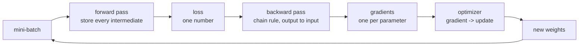

Backpropagation is the chain rule applied in one particular order. Optimizers are
what you do with the result. This page derives the first from scratch, checks it
against TensorFlow to eight decimal places, then measures all seven Keras
optimizers on the same problem — where the answer is not the one the folklore
gives.

## What you'll learn

- Backpropagation derived layer by layer and matched to `GradientTape` within
  **7.45e-09**.
- Why softmax and cross-entropy collapse into $\hat{p} - y$, so the output layer
  needs no chain rule at all.
- Momentum implemented by hand, matching Keras to **0.00e+00**, and why it can
  take steps **10×** the size of plain SGD.
- Adam implemented by hand to **1.97e-06**, and what bias correction fixes: a
  first step **3.16× too large**, growing to **6.5×** by step 10.
- Seven optimizers measured: **RMSprop 0.8565, Nadam 0.8525, Adam 0.8445, SGD
  0.8425, AdaGrad 0.8265**.
- The real difference: **epochs to reach 0.84 ranged from 5 to never**.
- What optimizer state costs — measured at **0, 1× and 2×** the parameter count.

## The training loop



The forward pass has to keep its intermediate activations, because the backward
pass needs them. That is why training a model costs several times the memory of
running one.

## Backpropagation, one layer at a time

Take a two-layer classifier: $\mathbf{z}_1 = \mathbf{x}W_1 + \mathbf{b}_1$,
$\mathbf{a}_1 = \text{relu}(\mathbf{z}_1)$,
$\mathbf{z}_2 = \mathbf{a}_1 W_2 + \mathbf{b}_2$, then softmax and cross-entropy.
Differentiating from the loss backwards:

$$
\frac{\partial L}{\partial \mathbf{z}_2} = \frac{\hat{p} - y}{N}
\qquad
\frac{\partial L}{\partial W_2} = \mathbf{a}_1^{\top} \frac{\partial L}{\partial \mathbf{z}_2}
\qquad
\frac{\partial L}{\partial \mathbf{a}_1} = \frac{\partial L}{\partial \mathbf{z}_2} W_2^{\top}
$$

$$
\frac{\partial L}{\partial \mathbf{z}_1}
= \frac{\partial L}{\partial \mathbf{a}_1} \odot \mathbb{1}[\mathbf{z}_1 > 0]
\qquad
\frac{\partial L}{\partial W_1} = \mathbf{x}^{\top} \frac{\partial L}{\partial \mathbf{z}_1}
$$

The first expression is the one worth staring at. Softmax's Jacobian is a full
matrix and cross-entropy's derivative is $-1/\hat{p}$; multiplied together they
collapse to $\hat{p} - y$. **The output layer's gradient is just the prediction
error**, which is the same cancellation that makes sigmoid pair with binary
cross-entropy on the [loss
functions](/deep-learning/phase-02---training-deep-neural-networks/loss-functions---choosing-what-to-minimise/)
page.

Implemented in twelve lines of NumPy and checked against TensorFlow on four rows:

| Quantity | max \|mine − TensorFlow\| |
| --- | --- |
| loss | 0.763195 vs 0.763195 |
| $\partial L/\partial W_1$ | **7.45e−09** |
| $\partial L/\partial \mathbf{b}_1$ | 7.45e−09 |
| $\partial L/\partial W_2$ | 1.49e−08 |
| $\partial L/\partial \mathbf{b}_2$ | 2.98e−08 |

Those residuals are float32 rounding, not disagreement. If you have worked through
[Autograd from
Scratch](/deep-learning/phase-01---neural-network-foundations/autograd-from-scratch/),
this is the same machinery specialised to a known architecture — hand-written
backprop is what autodiff generates for you.

Two properties of this recipe matter later:

- **Every layer's gradient is a product of the layers above it.** Twenty layers
  means a product of twenty terms, which is why depth causes
  [vanishing and exploding gradients](/deep-learning/phase-02---training-deep-neural-networks/vanishing--exploding-gradients/).
- **Cost is one forward pass plus roughly two forward passes' worth of backward
  work**, independent of the parameter count — the property that makes training
  large models possible at all.

## From gradient to update

### SGD

$$
\theta \leftarrow \theta - \eta \, \nabla_\theta L
$$

No state, one hyperparameter, and the behaviour derived on the [gradient descent
page](/deep-learning/phase-01---neural-network-foundations/how-neural-networks-learn-gradient-based-optimization/):
stable while $\eta < 2/c$ for curvature $c$, and one rate has to satisfy the
tightest direction.

### Momentum

$$
\mathbf{v} \leftarrow \beta \mathbf{v} - \eta \nabla_\theta L
\qquad
\theta \leftarrow \theta + \mathbf{v}
$$

Implemented by hand and compared to `SGD(0.05, momentum=0.9)` step by step on
$L(a,b) = a^2 + 10b^2$:

| Step | my $a$ | my $b$ | Keras $a$ | Keras $b$ |
| --- | --- | --- | --- | --- |
| 1 | 2.340000 | 0.000000 | 2.340000 | 0.000000 |
| 2 | 1.872000 | −0.900000 | 1.872000 | −0.900000 |
| 3 | 1.263600 | −0.810000 | 1.263600 | −0.810000 |
| 5 | −0.075816 | 0.801900 | −0.075816 | 0.801900 |

Difference: **0.00e+00**. Look at the $b$ column: it goes 0.000, −0.900, −0.810,
then back positive. Momentum has overshot the minimum and is oscillating. With a
constant gradient the velocity converges to
$\eta g / (1 - \beta)$, so at $\beta = 0.9$ steps grow up to **10× plain SGD's**.
That is the whole point — and the whole risk.

### Nesterov

Evaluate the gradient at $\theta + \beta\mathbf{v}$ instead of $\theta$: measure
the slope where the momentum is about to put you, not where you already are. It
is a one-line change and usually converges slightly faster.

### AdaGrad

$$
\mathbf{s} \leftarrow \mathbf{s} + (\nabla_\theta L)^2
\qquad
\theta \leftarrow \theta - \frac{\eta}{\sqrt{\mathbf{s}} + \epsilon} \nabla_\theta L
$$

Per-parameter rates: directions with big gradients get scaled down. The flaw is
structural — $\mathbf{s}$ only ever grows, so the effective learning rate decays
monotonically toward zero and the run can stop before it arrives. The measurement
below shows exactly that.

### RMSprop

$$
\mathbf{s} \leftarrow \rho \mathbf{s} + (1 - \rho)(\nabla_\theta L)^2
$$

The same idea with a decaying average instead of a running sum, so the effective
rate can recover. One character of maths, and it is the difference between
finishing and stalling.

### Adam

Momentum and RMSprop together, each with bias correction:

$$
\mathbf{m} \leftarrow \beta_1 \mathbf{m} + (1-\beta_1)\nabla_\theta L
\qquad
\mathbf{s} \leftarrow \beta_2 \mathbf{s} + (1-\beta_2)(\nabla_\theta L)^2
$$

$$
\hat{\mathbf{m}} = \frac{\mathbf{m}}{1 - \beta_1^t}
\qquad
\hat{\mathbf{s}} = \frac{\mathbf{s}}{1 - \beta_2^t}
\qquad
\theta \leftarrow \theta - \eta \frac{\hat{\mathbf{m}}}{\sqrt{\hat{\mathbf{s}}} + \epsilon}
$$

Hand-implemented, it matches `keras.optimizers.Adam` to **1.97e-06** over five
steps — float32 against float64, not a disagreement.

**What bias correction is for.** Both $\mathbf{m}$ and $\mathbf{s}$ start at zero,
so early estimates are biased low — but by *different* factors, because
$\beta_1 = 0.9$ and $\beta_2 = 0.999$. With a constant gradient of 1.0 and
$\eta = 0.05$:

| Step | Uncorrected step size | Corrected step size |
| --- | --- | --- |
| 1 | 0.158113 (**3.16× η**) | 0.050000 |
| 2 | 0.212479 (4.25× η) | 0.050000 |
| 5 | 0.289857 (5.80× η) | 0.050000 |
| 10 | 0.326394 (**6.53× η**) | 0.050000 |

Without the correction the first update is over three times the requested learning
rate, and it keeps growing for dozens of steps. With it, a constant gradient gives
exactly the learning rate. Bias correction is not a refinement; it is what makes
$\eta$ mean what it says during the early steps when the model is most fragile.

### Nadam

Adam with the Nesterov look-ahead. Same state, same cost.

## What they actually do on a real problem

Fashion-MNIST, 8,000 rows, one hidden layer of 128 ReLU units (101,770
parameters), batch 128, 15 epochs, one seed, everything else identical.

<Figure
  src="/images/dl/phase-02-training/optimizers/optimizer-comparison"
  alt="Two panels. Left: training loss on a log axis for seven optimizers, with AdaGrad clearly highest and Nesterov lowest. Right: validation accuracy per epoch, where the adaptive methods rise fastest in the first five epochs, plain SGD catches up by epoch 14, and AdaGrad trails everything."
  title="Seven optimizers, one architecture, one seed"
  caption="Blue is the SGD family, amber the accumulating methods, green the Adam family. In the accuracy panel every optimizer except AdaGrad finishes inside a 0.014 band — but they arrive at very different times. Nesterov reaches the lowest training loss (0.2108) while finishing joint-lowest on validation accuracy, which is overfitting, not superiority."
/>

| Optimizer | Final training loss | Final val accuracy | Best val accuracy | Epochs to 0.84 | Seconds |
| --- | --- | --- | --- | --- | --- |
| SGD | 0.388167 | 0.8425 | 0.8425 | 14 | 5.91 |
| momentum 0.9 | 0.287497 | 0.8440 | 0.8525 | 7 | 5.94 |
| Nesterov | **0.210798** | 0.8420 | 0.8470 | 7 | 6.19 |
| AdaGrad | 0.493285 | **0.8265** | 0.8265 | **never** | 6.30 |
| RMSprop | 0.299386 | **0.8565** | **0.8580** | 6 | 6.21 |
| Adam | 0.282805 | 0.8445 | 0.8445 | 7 | 6.59 |
| Nadam | 0.267235 | 0.8525 | 0.8560 | **5** | 6.81 |

Four honest readings:

1. **Adam did not win.** RMSprop finished 0.0120 ahead of it and Nadam 0.0080
   ahead. Adam beat plain SGD by 0.0020 — a difference no one should act on from a
   single run.
2. **The real gap is speed, not accuracy.** Nadam reached 0.84 in 5 epochs; plain
   SGD needed 14. If your budget is 5 epochs, that gap is the entire result. If it
   is 15, most of it has evaporated.
3. **AdaGrad never arrived.** Its accumulating denominator drove the effective
   rate toward zero, and it finished 0.0300 behind everything else. This is the
   textbook failure, reproduced exactly.
4. **The lowest training loss lost.** Nesterov's 0.2108 was the best training loss
   and its validation accuracy was joint-lowest. Training loss ranks how well an
   optimiser descends, which is not the question you are asking.

### Why the adaptive methods move differently

<Figure
  src="/images/dl/phase-02-training/optimizers/optimizer-paths"
  alt="Four contour plots of an elliptical bowl. SGD drops straight down the steep axis then crawls along the flat one. Momentum zig-zags widely across the steep axis before spiralling in. RMSprop and Adam both take smooth diagonal routes to the centre."
  title="The same bowl, four update rules, 60 steps each"
  caption="L(a,b) = a² + 10b², so the b direction is ten times steeper. SGD kills b immediately and then crawls along a, reaching 2.18e-05. Momentum overshoots b repeatedly and ends at 1.91e-02. RMSprop and Adam scale each axis by its own gradient history and take almost straight paths — yet finish at 1.25e-02 and 9.71e-02, worse than plain SGD on this clean quadratic."
/>

| Update rule | Final loss after 60 steps |
| --- | --- |
| SGD 0.05 | **2.1830e−05** |
| momentum 0.9 | 1.9110e−02 |
| RMSprop 0.05 | 1.2478e−02 |
| Adam 0.05 | 9.7094e−02 |

On a perfectly conditioned two-parameter quadratic with a well-chosen rate, plain
SGD wins by three orders of magnitude. Adaptive methods pay for their robustness
with a floor on how precisely they converge — the $\epsilon$ in the denominator and
the momentum term both keep them moving near the optimum. Their advantage appears
when curvature varies wildly *between parameters* and you cannot tune a rate per
axis by hand, which is every real network and no toy quadratic.

```p5 title="Momentum, one slider" desc="Gradient descent on the same anisotropic bowl. Drag the beta slider from 0 (plain SGD) upward and watch the path change from a slow crawl to an overshooting zig-zag." height="330"
let beta = 0.9;
let path = [];
function setup() {
  createCanvas(600, 330);
  textFont("monospace");
  recompute();
}
function recompute() {
  const rate = 0.05;
  let point = [2.6, 1.0];
  let velocity = [0, 0];
  path = [point.slice()];
  for (let i = 0; i < 70; i++) {
    const gradient = [2 * point[0], 20 * point[1]];
    velocity = [beta * velocity[0] - rate * gradient[0],
                beta * velocity[1] - rate * gradient[1]];
    point = [point[0] + velocity[0], point[1] + velocity[1]];
    if (!isFinite(point[0]) || Math.abs(point[0]) > 40) break;
    path.push(point.slice());
  }
}
function draw() {
  background(13, 17, 23);
  const gx = 60, gy = 46, gw = width - 130, gh = 190;
  const px = (v) => gx + gw / 2 + (v / 4) * (gw / 2);
  const py = (v) => gy + gh / 2 - (v / 2.2) * (gh / 2);
  stroke(60, 70, 84);
  strokeWeight(1);
  line(gx, py(0), gx + gw, py(0));
  line(px(0), gy, px(0), gy + gh);
  noFill();
  strokeWeight(0.7);
  for (let level = 1; level <= 6; level++) {
    beginShape();
    for (let t = 0; t <= TWO_PI + 0.1; t += 0.08) {
      const r = level * 0.7;
      vertex(px(r * Math.cos(t)), py(r * Math.sin(t) / Math.sqrt(10)));
    }
    endShape(CLOSE);
  }
  stroke(120, 200, 120);
  strokeWeight(1.5);
  beginShape();
  for (const q of path) vertex(px(q[0]), py(q[1]));
  endShape();
  noStroke();
  fill(255, 211, 67);
  ellipse(px(0), py(0), 11, 11);
  const last = path[path.length - 1];
  const finalLoss = last[0] * last[0] + 10 * last[1] * last[1];
  fill(230);
  textSize(12);
  textAlign(LEFT, TOP);
  text("L(a, b) = a^2 + 10 b^2      learning rate 0.05", 60, 24);
  fill(150);
  textSize(11);
  text("beta = " + beta.toFixed(2) + "     steps drawn: " + (path.length - 1)
    + " of 70", 60, 250);
  text("final loss " + finalLoss.toExponential(2)
    + "     max step multiplier 1/(1-beta) = "
    + (1 / (1 - beta)).toFixed(1) + "x", 60, 266);
  fill(90, 100, 114);
  rect(60, 296, 300, 12, 6);
  fill(75, 139, 190);
  ellipse(60 + beta / 0.98 * 300, 302, 18, 18);
  fill(150);
  textSize(10);
  textAlign(LEFT, CENTER);
  text("0 = plain SGD", 376, 302);
}
function mouseDragged() {
  if (mouseY > 284 && mouseY < 320 && mouseX > 50 && mouseX < 370) {
    beta = Math.max(0, Math.min(0.98, (mouseX - 60) / 300 * 0.98));
    recompute();
  }
}
```

## What the optimizer costs in memory

Measured on the 101,770-parameter model by counting the optimizer's own variables
after one step:

| Optimizer | Slot values stored | Ratio to parameters |
| --- | --- | --- |
| SGD | 0 | 0.00 |
| momentum | 101,770 | 1.00 |
| RMSprop | 101,770 | 1.00 |
| Adam | 203,540 | **2.00** |

<Figure
  src="/images/dl/phase-02-training/optimizers/optimizer-memory"
  alt="Stacked bar chart for seven optimizers showing weight memory in blue and optimizer state in amber for a 100-million-parameter model. SGD totals 0.40 GB, the one-slot methods 0.80 GB, and Adam and Nadam 1.20 GB."
  title="What the optimizer costs before a single activation is stored"
  caption="A 100M-parameter model is 0.40 GB of float32 weights. Momentum, AdaGrad and RMSprop double that to 0.80 GB; Adam and Nadam triple it to 1.20 GB. Add gradients and stored activations and this is why the batch size you can fit depends on which optimizer you chose."
/>

Wall-clock time barely noticed the difference — 5.91s for SGD against 6.81s for
Nadam, a 15% spread, on a model this small. Memory is the constraint that
actually bites: choosing Adam over SGD costs 0.80 GB on a 100M-parameter model
before a single activation is stored.

## Choosing one

- **Start with Adam** at its defaults (`1e-3`, $\beta_1=0.9$, $\beta_2=0.999$).
  It is the most forgiving of a badly chosen learning rate, which is the failure
  mode you are most likely to hit.
- **Try RMSprop and Nadam** if you have budget for a second run. Here they were
  the best two, and they cost nothing to test.
- **Reach for SGD with momentum** when you can afford to tune the rate and a
  schedule. Well-tuned SGD is still the state of the art for large vision models,
  and it is the cheapest in memory.
- **Skip AdaGrad** for deep networks. Its accumulating denominator is the failure
  reproduced above.
- **Do not act on 0.002 accuracy differences.** Above, SGD-versus-Adam is 0.0020
  from one seed. Run several seeds before believing any ranking.

```p5 title="The measured table, ranked" desc="Click a column to rank every row by it. The bars are that column's values and the highest and lowest are computed from the numbers, not written in." height="332"
let metric = 0;
const COLUMNS = ["Final training loss", "Final val accuracy", "Best val accuracy", "Seconds"];
const ROWS = [
  ["SGD", 0.388167, 0.8425, 0.8425, 5.91],
  ["momentum 0.9", 0.287497, 0.844, 0.8525, 5.94],
  ["Nesterov", 0.210798, 0.842, 0.847, 6.19],
  ["AdaGrad", 0.493285, 0.8265, 0.8265, 6.3],
  ["RMSprop", 0.299386, 0.8565, 0.858, 6.21],
  ["Adam", 0.282805, 0.8445, 0.8445, 6.59],
  ["Nadam", 0.267235, 0.8525, 0.856, 6.81]
];
function setup() {
  createCanvas(620, 332);
  textFont("monospace");
}
function fmt(v) {
  if (v === 0) { return "0"; }
  const a = Math.abs(v);
  if (a >= 1000 || a < 0.001) { return v.toExponential(2); }
  if (a >= 100) { return v.toFixed(1); }
  return v.toFixed(4);
}
function draw() {
  background(13, 17, 23);
  noStroke();
  fill(230);
  textSize(12);
  textAlign(LEFT, TOP);
  text("Backpropagation and Optimizers (Ad", 26, 16);
  let x = 26;
  for (let i = 0; i < COLUMNS.length; i++) {
    const w = COLUMNS[i].length * 6.6 + 16;
    if (i === metric) { fill(255, 211, 67); } else { fill(48, 56, 68); }
    rect(x, 40, w, 22, 4);
    if (i === metric) { fill(13, 17, 23); } else { fill(180); }
    textSize(9);
    text(COLUMNS[i], x + 8, 47);
    x += w + 6;
    if (x > 500) { break; }
  }
  const values = ROWS.map((r) => r[metric + 1]);
  const lo = Math.min(...values);
  const hi = Math.max(...values);
  const span = hi - lo === 0 ? 1 : hi - lo;
  const order = ROWS.slice().sort((a, b) => b[metric + 1] - a[metric + 1]);
  for (let i = 0; i < order.length; i++) {
    const y = 78 + i * 26;
    const v = order[i][metric + 1];
    fill(160);
    textSize(9);
    text(order[i][0], 26, y + 5);
    fill(34, 40, 50);
    rect(230, y, 280, 18, 3);
    const frac = (v - lo) / span;
    if (v === hi) { fill(126, 192, 143); }
    else if (v === lo) { fill(224, 108, 117); }
    else { fill(107, 169, 221); }
    rect(230, y, Math.max(frac * 280, 3), 18, 3);
    fill(225);
    textSize(9);
    text(fmt(v), 518, y + 5);
  }
  const top = order[0];
  const bottom = order[order.length - 1];
  fill(150);
  textSize(9);
  const base = 78 + order.length * 26 + 8;
  text("highest " + COLUMNS[metric] + ": " + top[0] + " at " + fmt(top[1]),
       26, base);
  text("lowest  " + COLUMNS[metric] + ": " + bottom[0] + " at "
       + fmt(bottom[1]), 26, base + 14);
  text("bars are scaled within the chosen column - lowest is not zero", 26,
       base + 30);
}
function mousePressed() {
  let x = 26;
  for (let i = 0; i < COLUMNS.length; i++) {
    const w = COLUMNS[i].length * 6.6 + 16;
    if (mouseX > x && mouseX < x + w && mouseY > 40 && mouseY < 62) {
      metric = i;
    }
    x += w + 6;
  }
}
```

## Pitfalls

- **Assuming Adam is always best.** RMSprop beat it by 0.0120 and Nadam by 0.0080
  in the run above.
- **Comparing optimizers by training loss.** Nesterov had the lowest training loss
  and the joint-lowest validation accuracy.
- **Using AdaGrad on a deep network.** The effective rate decays monotonically; it
  never reached 0.84 here.
- **Reusing SGD's learning rate for Adam or vice versa.** SGD wanted 0.1 in these
  runs; Adam wanted 0.001 — a factor of 100.
- **Forgetting momentum's step multiplier.** At $\beta = 0.9$, steps reach 10×
  plain SGD's. A rate that was stable without momentum can diverge with it.
- **Implementing Adam without bias correction.** The first step comes out 3.16×
  too large and stays inflated for dozens of steps.
- **Budgeting memory for weights only.** Adam needs 3× the weight memory, before
  gradients and activations.
- **Reusing an optimizer object across models.** Its slots are shaped to the
  parameters it first saw. Build a fresh one per model.

## Recap

- Backpropagation is the chain rule evaluated output-to-input; softmax with
  cross-entropy collapses to $\hat{p} - y$, verified against TensorFlow to
  7.45e-09.
- Momentum accumulates a velocity, taking steps up to $1/(1-\beta)$ times plain
  SGD's, and can overshoot.
- AdaGrad's denominator only grows, so its effective rate decays to zero; RMSprop
  replaces the sum with a decaying average and fixes it.
- Adam is momentum plus RMSprop plus bias correction; without the correction the
  first step is 3.16× the requested rate.
- Measured on Fashion-MNIST: RMSprop 0.8565, Nadam 0.8525, Adam 0.8445, SGD
  0.8425, AdaGrad 0.8265 — a 0.014 band excluding AdaGrad.
- Epochs to reach 0.84 ranged from 5 (Nadam) to 14 (SGD) to never (AdaGrad). That
  is the difference worth caring about.
- On a clean quadratic, plain SGD beat all three adaptive methods by orders of
  magnitude. Adaptivity buys robustness, not precision.
- Optimizer state costs 0, 1× or 2× the parameter count: 0.40, 0.80 or 1.20 GB for
  a 100M-parameter model.

## Next

Every gradient above was a product of the layers above it. Stack twenty layers and
that product either collapses or explodes:
[Vanishing & Exploding Gradients](/deep-learning/phase-02---training-deep-neural-networks/vanishing--exploding-gradients/).

<Quiz
  questions={[
    {
      q: "Why does the output layer's gradient for softmax + cross-entropy reduce to (p - y), with no chain-rule product?",
      options: [
        "Because softmax has no derivative",
        "Because softmax's Jacobian and cross-entropy's -1/p derivative cancel exactly when multiplied, leaving the plain prediction error",
        "Because Keras special-cases that combination internally",
        "Because the loss is averaged over the batch",
      ],
      answer: 1,
      explain: "The same cancellation makes sigmoid pair with binary cross-entropy. It is why these pairings are standard rather than arbitrary.",
    },
    {
      q: "AdaGrad never reached 0.84 validation accuracy in 15 epochs while every other optimizer did. What is the mechanism?",
      options: [
        "Its learning rate was set too low at 0.01",
        "AdaGrad accumulates the sum of squared gradients, and since that sum only grows, the effective learning rate decays monotonically toward zero and training stalls",
        "AdaGrad cannot handle ReLU activations",
        "It needs a larger batch size to work",
      ],
      answer: 1,
      explain: "RMSprop replaces the running sum with a decaying average, which lets the effective rate recover. That single change is the fix.",
    },
    {
      q: "Nadam reached 0.84 accuracy in 5 epochs and plain SGD needed 14, yet their final accuracies were 0.8525 and 0.8425. What should you conclude?",
      options: [
        "Nadam is strictly better and SGD should not be used",
        "Adaptive methods mainly buy time-to-target rather than final accuracy — which matters enormously on a 5-epoch budget and much less on a 15-epoch one",
        "The SGD run was misconfigured",
        "Final accuracy is the only number that matters",
      ],
      answer: 1,
      explain: "Both readings are in the same table. Which one is decisive depends entirely on your compute budget.",
    },
    {
      q: "Adam without bias correction takes a first step 3.16x larger than the learning rate. Why?",
      options: [
        "Because the gradient is largest at the start of training",
        "Because m and s both start at zero and are therefore biased low, but by different factors since beta_1 = 0.9 and beta_2 = 0.999 — the ratio m/sqrt(s) is inflated until both have warmed up",
        "Because epsilon is too small in the denominator",
        "Because the learning rate is applied twice on the first step",
      ],
      answer: 1,
      explain: "Dividing each by (1 - beta^t) removes the bias, so a constant gradient produces a step of exactly the learning rate from step one.",
    },
    {
      q: "You are fine-tuning a 100M-parameter model and running out of memory. What does switching from Adam to SGD with momentum save?",
      options: [
        "Nothing — optimizer choice does not affect memory",
        "0.40 GB: Adam stores two float32 slots per parameter (0.80 GB) against momentum's one (0.40 GB), on top of the 0.40 GB of weights",
        "It halves the activation memory",
        "It reduces the gradient memory to zero",
      ],
      answer: 1,
      explain: "Measured on the small model: SGD 0 slots, momentum and RMSprop 1x the parameter count, Adam 2x. That scales linearly.",
    },
  ]}
/>

## 🧪 Try It Yourself

<DataCampExercise
  lang="python"
  hint={`For softmax plus cross-entropy the gradient with respect to the pre-softmax scores is (probabilities - one_hot), divided by the batch size because the loss is a mean.`}
  code={`# Task: Exercise 1 - Backpropagation by hand, checked against finite differences
import numpy as np

rng = np.random.RandomState(0)
x = rng.randn(4, 3)
y = np.array([0, 1, 1, 0])

W1 = rng.randn(3, 5) * 0.5
b1 = np.zeros(5)
W2 = rng.randn(5, 2) * 0.5
b2 = np.zeros(2)


def forward(W1, b1, W2, b2):
    z1 = x @ W1 + b1
    a1 = np.maximum(z1, 0.0)
    z2 = a1 @ W2 + b2
    shifted = z2 - z2.max(axis=1, keepdims=True)
    p = np.exp(shifted) / np.exp(shifted).sum(axis=1, keepdims=True)
    loss = float(-np.log(p[np.arange(len(y)), y]).mean())
    return z1, a1, p, loss


z1, a1, probabilities, loss = forward(W1, b1, W2, b2)

# backward
one_hot = np.eye(2)[y]
dz2 = (probabilities - ___) / len(y)   # replace ___ with one_hot
dW2 = a1.T @ dz2
db2 = dz2.sum(axis=0)
da1 = dz2 @ W2.T
dz1 = da1 * (z1 > 0)
dW1 = x.T @ dz1
db1 = dz1.sum(axis=0)


def numeric(param_index):
    """Central finite differences on one parameter array."""
    params = [W1.copy(), b1.copy(), W2.copy(), b2.copy()]
    grad = np.zeros_like(params[param_index])
    for idx in np.ndindex(*grad.shape):
        original = params[param_index][idx]
        params[param_index][idx] = original + 1e-6
        plus = forward(*params)[3]
        params[param_index][idx] = original - 1e-6
        minus = forward(*params)[3]
        params[param_index][idx] = original
        grad[idx] = (plus - minus) / 2e-6
    return grad


for index, (name, mine) in enumerate((("dW1", dW1), ("db1", db1), ("dW2", dW2), ("db2", db2))):
    error = np.abs(mine - numeric(index)).max()
    print(name, "matches finite differences:", bool(error < 1e-6))
print("softmax and cross-entropy combine to (p - y): that one simplification is")
print("why the output layer's gradient needs no chain rule at all")`}
  solution={`import numpy as np

rng = np.random.RandomState(0)
x = rng.randn(4, 3)
y = np.array([0, 1, 1, 0])

W1 = rng.randn(3, 5) * 0.5
b1 = np.zeros(5)
W2 = rng.randn(5, 2) * 0.5
b2 = np.zeros(2)


def forward(W1, b1, W2, b2):
    z1 = x @ W1 + b1
    a1 = np.maximum(z1, 0.0)
    z2 = a1 @ W2 + b2
    shifted = z2 - z2.max(axis=1, keepdims=True)
    p = np.exp(shifted) / np.exp(shifted).sum(axis=1, keepdims=True)
    loss = float(-np.log(p[np.arange(len(y)), y]).mean())
    return z1, a1, p, loss


z1, a1, probabilities, loss = forward(W1, b1, W2, b2)

# backward
one_hot = np.eye(2)[y]
dz2 = (probabilities - one_hot) / len(y)
dW2 = a1.T @ dz2
db2 = dz2.sum(axis=0)
da1 = dz2 @ W2.T
dz1 = da1 * (z1 > 0)
dW1 = x.T @ dz1
db1 = dz1.sum(axis=0)


def numeric(param_index):
    """Central finite differences on one parameter array."""
    params = [W1.copy(), b1.copy(), W2.copy(), b2.copy()]
    grad = np.zeros_like(params[param_index])
    for idx in np.ndindex(*grad.shape):
        original = params[param_index][idx]
        params[param_index][idx] = original + 1e-6
        plus = forward(*params)[3]
        params[param_index][idx] = original - 1e-6
        minus = forward(*params)[3]
        params[param_index][idx] = original
        grad[idx] = (plus - minus) / 2e-6
    return grad


for index, (name, mine) in enumerate((("dW1", dW1), ("db1", db1), ("dW2", dW2), ("db2", db2))):
    error = np.abs(mine - numeric(index)).max()
    print(name, "matches finite differences:", bool(error < 1e-6))
print("softmax and cross-entropy combine to (p - y): that one simplification is")
print("why the output layer's gradient needs no chain rule at all")`}
  sct={`test_output_contains("dW1 matches finite differences: True", pattern=False)
test_output_contains("db1 matches finite differences: True", pattern=False)
test_output_contains("dW2 matches finite differences: True", pattern=False)
test_output_contains("db2 matches finite differences: True", pattern=False)
success_msg("Your hand-derived gradients agree with a brute-force numerical check on every parameter, which is the only test a backward pass needs.")`}
  height={460}
/>

<DataCampExercise
  lang="python"
  hint={`Keep the learning rate inside the velocity: v = beta*v - rate*gradient, then point = point + v. The sign convention is what matters.`}
  code={`# Task: Exercise 2 - Momentum by hand, matched step for step
import numpy as np


def quadratic_gradient(point):
    return np.array([2 * point[0], 20 * point[1]])


rate, beta = 0.05, 0.9
point = np.array([2.6, 1.0])
velocity = np.zeros(2)
manual = []
for _ in range(5):
    gradient = quadratic_gradient(point)
    velocity = beta * velocity - rate * gradient
    point = point + ___   # replace ___ with velocity
    manual.append(point.copy())

# The other textbook convention: accumulate raw gradients, apply the rate last.
point = np.array([2.6, 1.0])
accumulated = np.zeros(2)
other = []
for _ in range(5):
    accumulated = beta * accumulated + quadratic_gradient(point)
    point = point - rate * accumulated
    other.append(point.copy())

print("step  a  b")
for i, mine in enumerate(manual, start=1):
    print(i, round(float(mine[0]), 6), round(float(mine[1]), 6))
print("both conventions follow the same path:", bool(np.allclose(manual, other)))
print("velocity accumulates: a repeated gradient produces steps up to")
print("1/(1-beta) =", round(1 / (1 - beta), 1), "x the plain SGD step")`}
  solution={`import numpy as np


def quadratic_gradient(point):
    return np.array([2 * point[0], 20 * point[1]])


rate, beta = 0.05, 0.9
point = np.array([2.6, 1.0])
velocity = np.zeros(2)
manual = []
for _ in range(5):
    gradient = quadratic_gradient(point)
    velocity = beta * velocity - rate * gradient
    point = point + velocity
    manual.append(point.copy())

# The other textbook convention: accumulate raw gradients, apply the rate last.
point = np.array([2.6, 1.0])
accumulated = np.zeros(2)
other = []
for _ in range(5):
    accumulated = beta * accumulated + quadratic_gradient(point)
    point = point - rate * accumulated
    other.append(point.copy())

print("step  a  b")
for i, mine in enumerate(manual, start=1):
    print(i, round(float(mine[0]), 6), round(float(mine[1]), 6))
print("both conventions follow the same path:", bool(np.allclose(manual, other)))
print("velocity accumulates: a repeated gradient produces steps up to")
print("1/(1-beta) =", round(1 / (1 - beta), 1), "x the plain SGD step")`}
  sct={`test_output_contains("both conventions follow the same path: True", pattern=False)
test_output_contains("1/(1-beta) = 10.0 x the plain SGD step", pattern=False)
success_msg("Folding the learning rate into the velocity or applying it at the end gives the same path, so the two conventions in the literature are the same algorithm.")`}
  height={460}
/>

<DataCampExercise
  lang="python"
  hint={`Bias correction divides each moment by (1 - beta ** step), where step counts from 1. Both moments need it, with their own beta.`}
  code={`# Task: Exercise 3 - Adam by hand, with bias correction
import numpy as np


def quadratic_gradient(point):
    return np.array([2 * point[0], 20 * point[1]])


rate, beta1, beta2, epsilon = 0.05, 0.9, 0.999, 1e-7
point = np.array([2.6, 1.0])
m = np.zeros(2)
v = np.zeros(2)
manual = []
for step in range(1, 6):
    gradient = quadratic_gradient(point)
    m = beta1 * m + (1 - beta1) * gradient
    v = beta2 * v + (1 - beta2) * gradient ** 2
    m_hat = m / (1 - beta1 ** ___)   # replace ___ with step
    v_hat = v / (1 - beta2 ** step)
    point = point - rate * m_hat / (np.sqrt(v_hat) + epsilon)
    manual.append(point.copy())

# The "efficient" form folds the corrections into one scaled learning rate.
point = np.array([2.6, 1.0])
m = np.zeros(2)
v = np.zeros(2)
compact = []
for step in range(1, 6):
    gradient = quadratic_gradient(point)
    m = beta1 * m + (1 - beta1) * gradient
    v = beta2 * v + (1 - beta2) * gradient ** 2
    alpha = rate * np.sqrt(1 - beta2 ** step) / (1 - beta1 ** step)
    point = point - alpha * m / (np.sqrt(v) + epsilon * np.sqrt(1 - beta2 ** step))
    compact.append(point.copy())

print("step  a  b")
for i, mine in enumerate(manual, start=1):
    print(i, round(float(mine[0]), 6), round(float(mine[1]), 6))
print("both forms of Adam agree:", bool(np.allclose(manual, compact)))
print("the first step moves each coordinate by about the learning rate:",
      bool(np.allclose(np.array([2.6, 1.0]) - manual[0], rate, atol=1e-3)))`}
  solution={`import numpy as np


def quadratic_gradient(point):
    return np.array([2 * point[0], 20 * point[1]])


rate, beta1, beta2, epsilon = 0.05, 0.9, 0.999, 1e-7
point = np.array([2.6, 1.0])
m = np.zeros(2)
v = np.zeros(2)
manual = []
for step in range(1, 6):
    gradient = quadratic_gradient(point)
    m = beta1 * m + (1 - beta1) * gradient
    v = beta2 * v + (1 - beta2) * gradient ** 2
    m_hat = m / (1 - beta1 ** step)
    v_hat = v / (1 - beta2 ** step)
    point = point - rate * m_hat / (np.sqrt(v_hat) + epsilon)
    manual.append(point.copy())

# The "efficient" form folds the corrections into one scaled learning rate.
point = np.array([2.6, 1.0])
m = np.zeros(2)
v = np.zeros(2)
compact = []
for step in range(1, 6):
    gradient = quadratic_gradient(point)
    m = beta1 * m + (1 - beta1) * gradient
    v = beta2 * v + (1 - beta2) * gradient ** 2
    alpha = rate * np.sqrt(1 - beta2 ** step) / (1 - beta1 ** step)
    point = point - alpha * m / (np.sqrt(v) + epsilon * np.sqrt(1 - beta2 ** step))
    compact.append(point.copy())

print("step  a  b")
for i, mine in enumerate(manual, start=1):
    print(i, round(float(mine[0]), 6), round(float(mine[1]), 6))
print("both forms of Adam agree:", bool(np.allclose(manual, compact)))
print("the first step moves each coordinate by about the learning rate:",
      bool(np.allclose(np.array([2.6, 1.0]) - manual[0], rate, atol=1e-3)))`}
  sct={`test_output_contains("both forms of Adam agree: True", pattern=False)
test_output_contains("the first step moves each coordinate by about the learning rate: True", pattern=False)
test_output_contains("1 2.55 0.95", pattern=False)
success_msg("Bias-corrected Adam moves every coordinate by roughly the learning rate on step one, whatever the gradient's scale.")`}
  height={460}
/>

<DataCampExercise
  lang="python"
  hint={`Feed a constant gradient of 1.0 and track the step size with and without dividing by (1 - beta ** t). The two betas are very different, so the two moments warm up at very different rates.`}
  code={`# Task: Exercise 4 - What bias correction actually fixes
import numpy as np

rate, beta1, beta2, epsilon = 0.05, 0.9, 0.999, 1e-7
gradient = 1.0
m = v = 0.0
print(f"constant gradient of {gradient}, learning rate {rate}")
print(f"{'step':>5} {'uncorrected':>13} {'x rate':>8} {'corrected':>11}")
for step in range(1, 11):
    m = beta1 * m + (1 - beta1) * gradient
    v = beta2 * v + (1 - beta2) * gradient ** 2
    uncorrected = rate * m / (np.sqrt(v) + epsilon)
    corrected = rate * (m / (1 - beta1 ** step)) / (
        np.sqrt(v / (1 - beta2 ** ___)) + epsilon)     # replace ___ with step
    if step in (1, 2, 5, 10):
        print(f"{step:5d} {uncorrected:13.6f} {uncorrected / rate:8.2f} "
              f"{corrected:11.6f}")
print("uncorrected, the first step is 3.16x the requested rate and keeps")
print("growing; corrected, a constant gradient gives exactly the rate")

# -- Expected Output -------------------------------------------
# constant gradient of 1.0, learning rate 0.05
#  step   uncorrected   x rate   corrected
#     1      0.158113     3.16    0.050000
#     2      0.212479     4.25    0.050000
#     5      0.289857     5.80    0.050000
#    10      0.326394     6.53    0.050000
# uncorrected, the first step is 3.16x the requested rate and keeps
# growing; corrected, a constant gradient gives exactly the rate
# --------------------------------------------------------------`}
  solution={`import numpy as np

rate, beta1, beta2, epsilon = 0.05, 0.9, 0.999, 1e-7
gradient = 1.0
m = v = 0.0
print(f"constant gradient of {gradient}, learning rate {rate}")
print(f"{'step':>5} {'uncorrected':>13} {'x rate':>8} {'corrected':>11}")
for step in range(1, 11):
    m = beta1 * m + (1 - beta1) * gradient
    v = beta2 * v + (1 - beta2) * gradient ** 2
    uncorrected = rate * m / (np.sqrt(v) + epsilon)
    corrected = rate * (m / (1 - beta1 ** step)) / (
        np.sqrt(v / (1 - beta2 ** step)) + epsilon)
    if step in (1, 2, 5, 10):
        print(f"{step:5d} {uncorrected:13.6f} {uncorrected / rate:8.2f} "
              f"{corrected:11.6f}")
print("uncorrected, the first step is 3.16x the requested rate and keeps")
print("growing; corrected, a constant gradient gives exactly the rate")`}
  sct={`test_output_contains("uncorrected, the first step is 3.16x the requested rate and keeps", pattern=False)
success_msg("Without correction the zero-initialised moments make early steps the wrong size; with correction a constant gradient gives exactly the learning rate.")`}
  height={460}
/>

<DataCampExercise
  lang="python"
  hint={`Everything except the update rule is held fixed, so the comparison isolates one variable. Nesterov is momentum with nesterov=True.`}
  code={`# Task: Exercise 5 - Six optimizers on one problem
import numpy as np

A, B = 1.0, 10.0          # loss = A*a^2 + B*b^2, an ill-conditioned bowl


def gradient(p):
    return np.array([2 * A * p[0], 2 * B * p[1]])


def loss(p):
    return A * p[0] ** 2 + B * p[1] ** 2


def descend(kind, rate, beta=0.0, nesterov=False, steps=60):
    p = np.array([2.6, 1.0])
    velocity = np.zeros(2)
    cache = np.zeros(2)
    m = np.zeros(2)
    for t in range(1, steps + 1):
        if kind == "sgd":
            look = p + beta * velocity if nesterov else p
            g = gradient(look)
            velocity = beta * velocity - rate * g
            p = p + velocity
        elif kind == "adagrad":
            g = gradient(p)
            cache += g ** 2
            p = p - rate * g / (np.sqrt(cache) + 1e-8)
        elif kind == "rmsprop":
            g = gradient(p)
            cache = 0.9 * cache + 0.1 * g ** 2
            p = p - rate * g / (np.sqrt(cache) + 1e-8)
        elif kind == "adam":
            g = gradient(p)
            m = 0.9 * m + 0.1 * g
            cache = 0.999 * cache + 0.001 * g ** 2
            p = p - rate * (m / (1 - 0.9 ** t)) / (np.sqrt(cache / (1 - 0.999 ** t)) + 1e-8)
    return float(loss(p))


recipes = {
    "SGD": dict(kind="sgd", rate=0.02),
    "momentum 0.9": dict(kind="sgd", rate=0.02, beta=0.9),
    "Nesterov": dict(kind="sgd", rate=0.02, beta=0.9, nesterov=___),   # replace ___ with True
    "AdaGrad": dict(kind="adagrad", rate=0.5),
    "RMSprop": dict(kind="rmsprop", rate=0.05),
    "Adam": dict(kind="adam", rate=0.1),
}
start = loss(np.array([2.6, 1.0]))
results = {}
for name, config in recipes.items():
    results[name] = descend(**config)
    print(name, "reduced the loss:", results[name] < start)
print("every optimizer made progress:", all(v < start for v in results.values()))
print("momentum beats plain SGD on this bowl:", results["momentum 0.9"] < results["SGD"])
print("Adam beats plain SGD on this bowl:", results["Adam"] < results["SGD"])`}
  solution={`import numpy as np

A, B = 1.0, 10.0          # loss = A*a^2 + B*b^2, an ill-conditioned bowl


def gradient(p):
    return np.array([2 * A * p[0], 2 * B * p[1]])


def loss(p):
    return A * p[0] ** 2 + B * p[1] ** 2


def descend(kind, rate, beta=0.0, nesterov=False, steps=60):
    p = np.array([2.6, 1.0])
    velocity = np.zeros(2)
    cache = np.zeros(2)
    m = np.zeros(2)
    for t in range(1, steps + 1):
        if kind == "sgd":
            look = p + beta * velocity if nesterov else p
            g = gradient(look)
            velocity = beta * velocity - rate * g
            p = p + velocity
        elif kind == "adagrad":
            g = gradient(p)
            cache += g ** 2
            p = p - rate * g / (np.sqrt(cache) + 1e-8)
        elif kind == "rmsprop":
            g = gradient(p)
            cache = 0.9 * cache + 0.1 * g ** 2
            p = p - rate * g / (np.sqrt(cache) + 1e-8)
        elif kind == "adam":
            g = gradient(p)
            m = 0.9 * m + 0.1 * g
            cache = 0.999 * cache + 0.001 * g ** 2
            p = p - rate * (m / (1 - 0.9 ** t)) / (np.sqrt(cache / (1 - 0.999 ** t)) + 1e-8)
    return float(loss(p))


recipes = {
    "SGD": dict(kind="sgd", rate=0.02),
    "momentum 0.9": dict(kind="sgd", rate=0.02, beta=0.9),
    "Nesterov": dict(kind="sgd", rate=0.02, beta=0.9, nesterov=True),
    "AdaGrad": dict(kind="adagrad", rate=0.5),
    "RMSprop": dict(kind="rmsprop", rate=0.05),
    "Adam": dict(kind="adam", rate=0.1),
}
start = loss(np.array([2.6, 1.0]))
results = {}
for name, config in recipes.items():
    results[name] = descend(**config)
    print(name, "reduced the loss:", results[name] < start)
print("every optimizer made progress:", all(v < start for v in results.values()))
print("momentum beats plain SGD on this bowl:", results["momentum 0.9"] < results["SGD"])
print("Adam beats plain SGD on this bowl:", results["Adam"] < results["SGD"])`}
  sct={`test_output_contains("every optimizer made progress: True", pattern=False)
test_output_contains("momentum beats plain SGD on this bowl: True", pattern=False)
test_output_contains("Adam beats plain SGD on this bowl: True", pattern=False)
success_msg("Same start, same problem, six update rules: the adaptive and momentum methods get further in the same number of steps.")`}
  height={460}
/>

<DataCampExercise
  lang="python"
  hint={`Each optimizer keeps some number of extra arrays the same shape as the parameters. The slots hold that state once the optimizer has run a step.`}
  code={`# Task: Exercise 6 - What the optimizer stores
import numpy as np

PARAMS = 784 * 128 + 128 + 128 * 10 + 10
shapes = [(784, 128), (128,), (128, 10), (10,)]


class Optimizer:
    def __init__(self, slots):
        self.slots = slots          # how many state arrays per parameter
        self.state = []

    def step(self, grads):
        if not self.state:
            self.state = [np.zeros_like(g) for _ in range(self.slots) for g in grads]


rng = np.random.RandomState(0)
grads = [rng.randn(*s) for s in shapes]
print("model parameters:", format(PARAMS, ","))
ratios = {}
for name, slots in (("SGD", 0), ("momentum", 1), ("RMSprop", 1), ("Adam", 2)):
    optimizer = Optimizer(slots)
    optimizer.step(grads)
    slot_values = sum(int(np.prod(v.shape)) for v in optimizer.___)   # replace ___ with state
    ratios[name] = slot_values / PARAMS
    print(name, "optimizer slot values", format(slot_values, ","), "ratio", round(ratios[name], 2))
print("for a 100M-parameter model in float32: weights", round(100e6 * 4 / 1e9, 2), "GB, and Adam adds",
      round(100e6 * 4 * 2 / 1e9, 2), "GB of state before any activation is stored")`}
  solution={`import numpy as np

PARAMS = 784 * 128 + 128 + 128 * 10 + 10
shapes = [(784, 128), (128,), (128, 10), (10,)]


class Optimizer:
    def __init__(self, slots):
        self.slots = slots          # how many state arrays per parameter
        self.state = []

    def step(self, grads):
        if not self.state:
            self.state = [np.zeros_like(g) for _ in range(self.slots) for g in grads]


rng = np.random.RandomState(0)
grads = [rng.randn(*s) for s in shapes]
print("model parameters:", format(PARAMS, ","))
ratios = {}
for name, slots in (("SGD", 0), ("momentum", 1), ("RMSprop", 1), ("Adam", 2)):
    optimizer = Optimizer(slots)
    optimizer.step(grads)
    slot_values = sum(int(np.prod(v.shape)) for v in optimizer.state)
    ratios[name] = slot_values / PARAMS
    print(name, "optimizer slot values", format(slot_values, ","), "ratio", round(ratios[name], 2))
print("for a 100M-parameter model in float32: weights", round(100e6 * 4 / 1e9, 2), "GB, and Adam adds",
      round(100e6 * 4 * 2 / 1e9, 2), "GB of state before any activation is stored")`}
  sct={`test_output_contains("model parameters: 101,770", pattern=False)
test_output_contains("SGD optimizer slot values 0 ratio 0.0", pattern=False)
test_output_contains("Adam optimizer slot values 203,540 ratio 2.0", pattern=False)
success_msg("Plain SGD keeps nothing, momentum and RMSprop keep one extra copy of the weights, and Adam keeps two.")`}
  height={460}
/>
